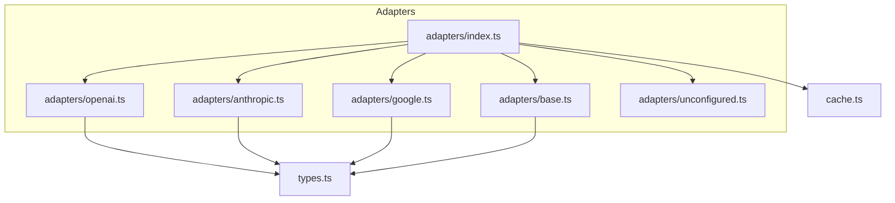
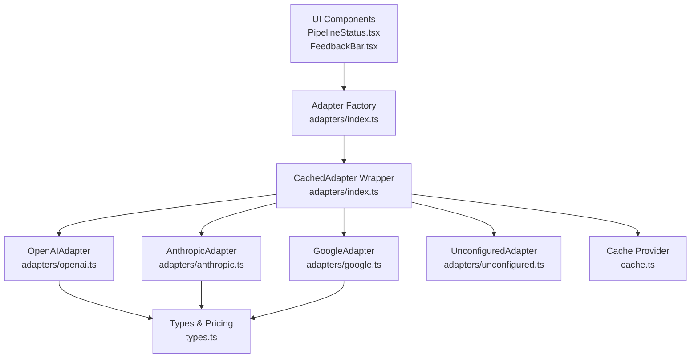
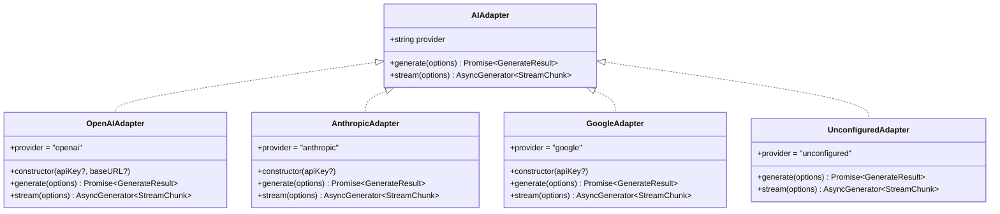
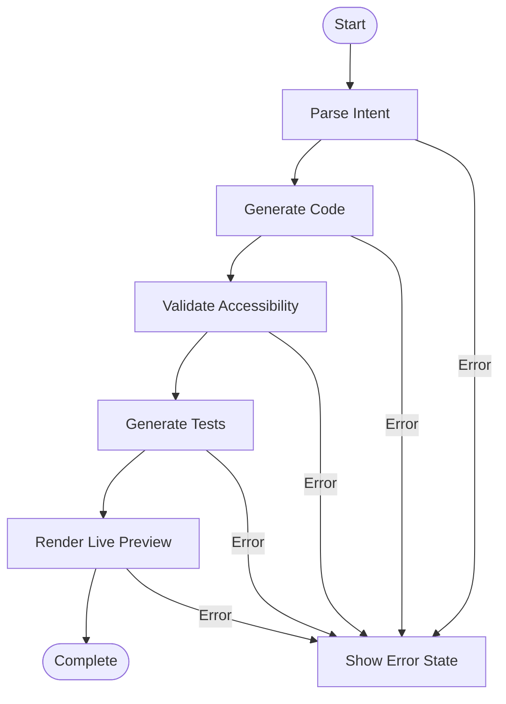
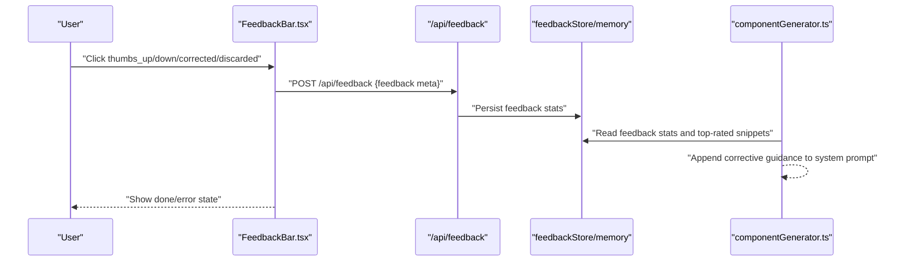
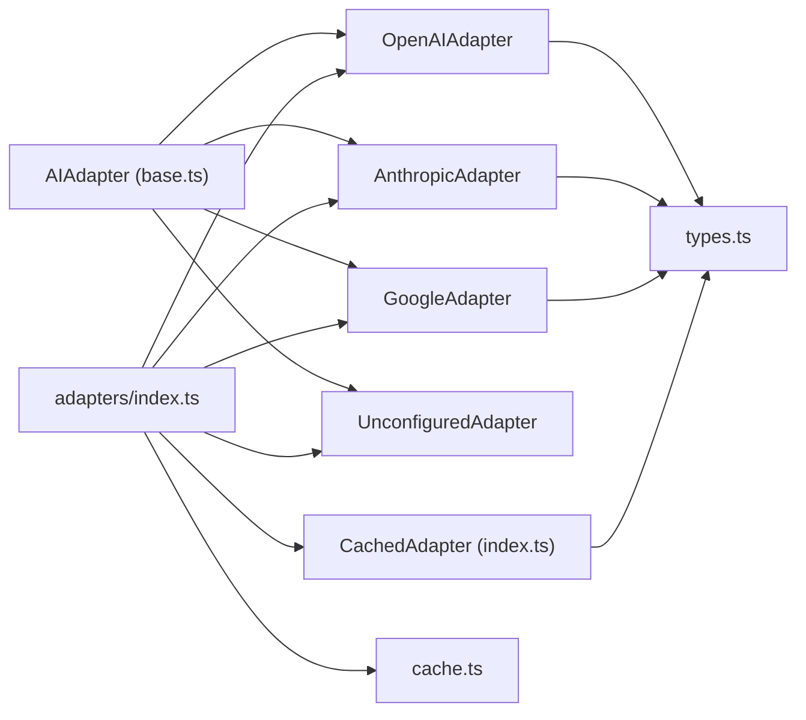

# Design Patterns

<cite>
**Referenced Files in This Document**
- [adapters/index.ts](file://lib/ai/adapters/index.ts)
- [adapters/base.ts](file://lib/ai/adapters/base.ts)
- [adapters/openai.ts](file://lib/ai/adapters/openai.ts)
- [adapters/anthropic.ts](file://lib/ai/adapters/anthropic.ts)
- [adapters/google.ts](file://lib/ai/adapters/google.ts)
- [adapters/unconfigured.ts](file://lib/ai/adapters/unconfigured.ts)
- [types.ts](file://lib/ai/types.ts)
- [cache.ts](file://lib/ai/cache.ts)
- [FeedbackBar.tsx](file://components/FeedbackBar.tsx)
- [PipelineStatus.tsx](file://components/PipelineStatus.tsx)
- [feedbackProcessor.ts](file://lib/ai/feedbackProcessor.ts)
</cite>

## Table of Contents
1. [Introduction](#introduction)
2. [Project Structure](#project-structure)
3. [Core Components](#core-components)
4. [Architecture Overview](#architecture-overview)
5. [Detailed Component Analysis](#detailed-component-analysis)
6. [Dependency Analysis](#dependency-analysis)
7. [Performance Considerations](#performance-considerations)
8. [Troubleshooting Guide](#troubleshooting-guide)
9. [Conclusion](#conclusion)

## Introduction
This document explains the core design patterns implemented in the AI-powered UI engine and how they enable provider abstraction, flexible multi-stage generation, dynamic adapter instantiation, and real-time feedback collection. It focuses on:
- Adapter Pattern for universal AI provider abstraction
- Pipeline Pattern for multi-stage generation workflow
- Factory Pattern for dynamic adapter instantiation
- Observer Pattern for real-time feedback collection

Each pattern is analyzed with concrete examples from the codebase, highlighting how they address architectural challenges, improve extensibility, and contribute to resilience and scalability.

## Project Structure
The AI engine’s adapter system resides under lib/ai/adapters and exposes a unified AIAdapter interface. The factory and registry live in adapters/index.ts, while provider-specific implementations (OpenAI, Anthropic, Google, Ollama/LM Studio) are implemented as classes. Supporting modules include types.ts (client-safe types), cache.ts (pluggable caching), and UI components that demonstrate the Pipeline Pattern and Observer Pattern.



**Diagram sources**
- [adapters/index.ts:1-306](file://lib/ai/adapters/index.ts#L1-L306)
- [adapters/base.ts:1-73](file://lib/ai/adapters/base.ts#L1-L73)
- [adapters/openai.ts:1-223](file://lib/ai/adapters/openai.ts#L1-L223)
- [adapters/anthropic.ts:1-210](file://lib/ai/adapters/anthropic.ts#L1-L210)
- [adapters/google.ts:1-90](file://lib/ai/adapters/google.ts#L1-L90)
- [adapters/unconfigured.ts](file://lib/ai/adapters/unconfigured.ts)
- [types.ts:1-130](file://lib/ai/types.ts#L1-L130)
- [cache.ts:1-141](file://lib/ai/cache.ts#L1-L141)

**Section sources**
- [adapters/index.ts:1-306](file://lib/ai/adapters/index.ts#L1-L306)
- [adapters/base.ts:1-73](file://lib/ai/adapters/base.ts#L1-L73)
- [types.ts:1-130](file://lib/ai/types.ts#L1-L130)
- [cache.ts:1-141](file://lib/ai/cache.ts#L1-L141)

## Core Components
- AIAdapter interface defines a provider-agnostic contract for single-shot generation and streaming.
- Provider adapters implement AIAdapter for OpenAI, Anthropic, Google, and others.
- Adapter factory resolves credentials securely and instantiates the appropriate adapter.
- Caching layer wraps adapters to provide transparent caching and metrics dispatch.
- UI components visualize the multi-stage generation pipeline and collect feedback.

**Section sources**
- [adapters/base.ts:48-72](file://lib/ai/adapters/base.ts#L48-L72)
- [adapters/openai.ts:36-62](file://lib/ai/adapters/openai.ts#L36-L62)
- [adapters/anthropic.ts:71-87](file://lib/ai/adapters/anthropic.ts#L71-L87)
- [adapters/google.ts:24-33](file://lib/ai/adapters/google.ts#L24-L33)
- [adapters/index.ts:146-215](file://lib/ai/adapters/index.ts#L146-L215)
- [cache.ts:82-137](file://lib/ai/cache.ts#L82-L137)

## Architecture Overview
The system separates concerns across layers:
- Presentation/UI: Pipeline visualization and feedback collection
- Application orchestration: Adapter factory and caching
- Provider adapters: Concrete implementations behind a shared interface
- Shared types: Client-safe contracts and pricing utilities



**Diagram sources**
- [PipelineStatus.tsx:29-110](file://components/PipelineStatus.tsx#L29-L110)
- [FeedbackBar.tsx:36-83](file://components/FeedbackBar.tsx#L36-L83)
- [adapters/index.ts:82-138](file://lib/ai/adapters/index.ts#L82-L138)
- [adapters/openai.ts:36-62](file://lib/ai/adapters/openai.ts#L36-L62)
- [adapters/anthropic.ts:71-87](file://lib/ai/adapters/anthropic.ts#L71-L87)
- [adapters/google.ts:24-33](file://lib/ai/adapters/google.ts#L24-L33)
- [adapters/unconfigured.ts](file://lib/ai/adapters/unconfigured.ts)
- [types.ts:19-55](file://lib/ai/types.ts#L19-L55)
- [cache.ts:18-50](file://lib/ai/cache.ts#L18-L50)

## Detailed Component Analysis

### Adapter Pattern: Universal AI Provider Abstraction
The Adapter Pattern encapsulates provider-specific APIs behind a single AIAdapter interface, enabling the rest of the system to remain provider-agnostic. Each provider adapter implements generate() and stream(), converting between the internal representation and provider-specific shapes.

Key characteristics:
- Contract: AIAdapter defines provider identity and two methods for generation and streaming.
- Implementations: OpenAIAdapter, AnthropicAdapter, GoogleAdapter, and UnconfiguredAdapter.
- Type safety: Client-safe types are exported from types.ts to avoid server-only dependencies leaking to clients.

Benefits:
- Extensibility: Adding a new provider requires implementing AIAdapter and updating the factory.
- Isolation: Provider differences (e.g., Anthropic’s native API vs. OpenAI-compatible routes) are localized.
- Consistency: Unified streaming and non-streaming contracts simplify consumers.



**Diagram sources**
- [adapters/base.ts:48-72](file://lib/ai/adapters/base.ts#L48-L72)
- [adapters/openai.ts:36-62](file://lib/ai/adapters/openai.ts#L36-L62)
- [adapters/anthropic.ts:71-87](file://lib/ai/adapters/anthropic.ts#L71-L87)
- [adapters/google.ts:24-33](file://lib/ai/adapters/google.ts#L24-L33)
- [adapters/unconfigured.ts](file://lib/ai/adapters/unconfigured.ts)

**Section sources**
- [adapters/base.ts:48-72](file://lib/ai/adapters/base.ts#L48-L72)
- [adapters/openai.ts:36-62](file://lib/ai/adapters/openai.ts#L36-L62)
- [adapters/anthropic.ts:71-87](file://lib/ai/adapters/anthropic.ts#L71-L87)
- [adapters/google.ts:24-33](file://lib/ai/adapters/google.ts#L24-L33)
- [types.ts:19-55](file://lib/ai/types.ts#L19-L55)

### Pipeline Pattern: Multi-Stage Generation Workflow
The Pipeline Pattern organizes generation into discrete stages with clear transitions and observable states. The UI component PipelineStatus.tsx renders a step-by-step progress bar, reflecting parsing, generation, validation, testing, and preview stages. The application orchestrates these steps by setting pipeline state as each stage completes.

How it works:
- Stage definition: STEPS enumerates each phase with labels, icons, and active/completed states.
- State machine: currentStep drives rendering and accessibility attributes.
- Accessibility: aria-live and role="status" announce updates to assistive technologies.



**Diagram sources**
- [PipelineStatus.tsx:29-110](file://components/PipelineStatus.tsx#L29-L110)

**Section sources**
- [PipelineStatus.tsx:29-110](file://components/PipelineStatus.tsx#L29-L110)

### Factory Pattern: Dynamic Adapter Instantiation
The Factory Pattern centralizes adapter creation and credential resolution. The public factory getWorkspaceAdapter selects the correct adapter based on provider/model and resolves credentials from workspace settings or environment variables. Internally, createAdapter builds the adapter and wraps it with caching.

Key behaviors:
- Credential resolution hierarchy: workspace keys → environment variables → unconfigured fallback.
- Compatibility routing: OpenAI-compatible providers (e.g., Groq, LM Studio) are routed through OpenAIAdapter with custom base URLs.
- Hardened error handling: ConfigurationError surfaces missing keys; UnconfiguredAdapter degrades gracefully in restricted environments (e.g., Vercel).

```mermaid
sequenceDiagram
participant Caller as "Caller"
participant Factory as "getWorkspaceAdapter"
participant WS as "workspaceKeyService"
participant Env as "Environment"
participant Create as "createAdapter"
participant Cache as "CachedAdapter"
participant Prov as "Concrete Adapter"
Caller->>Factory : "providerId, modelId, workspaceId, userId"
Factory->>WS : "getWorkspaceApiKey(...)"
alt Found workspace key
WS-->>Factory : "apiKey"
Factory->>Create : "{provider, model, apiKey}"
else Fallback to env
Factory->>Env : "process.env[...] or provider-specific"
Env-->>Factory : "apiKey or none"
Factory->>Create : "{provider, model, apiKey}"
end
Create->>Prov : "Instantiate provider adapter"
Create-->>Factory : "Adapter"
Factory->>Cache : "Wrap with CachedAdapter"
Cache-->>Caller : "AIAdapter"
```

**Diagram sources**
- [adapters/index.ts:236-278](file://lib/ai/adapters/index.ts#L236-L278)
- [adapters/index.ts:146-215](file://lib/ai/adapters/index.ts#L146-L215)

**Section sources**
- [adapters/index.ts:236-278](file://lib/ai/adapters/index.ts#L236-L278)
- [adapters/index.ts:146-215](file://lib/ai/adapters/index.ts#L146-L215)

### Observer Pattern: Real-Time Feedback Collection
The Observer Pattern captures user interactions and feedback in near real-time. The FeedbackBar component submits user sentiment, corrections, and metadata to the backend. The feedbackProcessor module consumes persisted statistics to influence future generations (e.g., injecting corrective guidance or warning about low approval rates).

Key elements:
- Feedback submission: FeedbackBar posts structured feedback to /api/feedback, including generationId, model, provider, intentType, promptHash, scores, latency, and optional corrected code.
- Feedback processing: feedbackProcessor reads cached stats and project memory to produce systemPromptAppend and warnings for the next generation.
- UI observability: PipelineStatus.tsx reflects current stage and error states, enabling users to understand and recover from failures.



**Diagram sources**
- [FeedbackBar.tsx:45-83](file://components/FeedbackBar.tsx#L45-L83)
- [feedbackProcessor.ts:1-28](file://lib/ai/feedbackProcessor.ts#L1-L28)

**Section sources**
- [FeedbackBar.tsx:36-83](file://components/FeedbackBar.tsx#L36-L83)
- [feedbackProcessor.ts:1-28](file://lib/ai/feedbackProcessor.ts#L1-L28)

## Dependency Analysis
The adapter system exhibits low coupling and high cohesion:
- Adapters depend on AIAdapter and types.ts, ensuring a clean separation between provider logic and shared contracts.
- The factory depends on workspaceKeyService and environment variables, but delegates instantiation to createAdapter.
- CachedAdapter composes an AIAdapter and adds cross-cutting concerns (caching, metrics) without altering the adapter interface.



**Diagram sources**
- [adapters/base.ts:48-72](file://lib/ai/adapters/base.ts#L48-L72)
- [adapters/index.ts:82-138](file://lib/ai/adapters/index.ts#L82-L138)
- [adapters/openai.ts:36-62](file://lib/ai/adapters/openai.ts#L36-L62)
- [adapters/anthropic.ts:71-87](file://lib/ai/adapters/anthropic.ts#L71-L87)
- [adapters/google.ts:24-33](file://lib/ai/adapters/google.ts#L24-L33)
- [adapters/unconfigured.ts](file://lib/ai/adapters/unconfigured.ts)
- [types.ts:19-55](file://lib/ai/types.ts#L19-L55)
- [cache.ts:82-137](file://lib/ai/cache.ts#L82-L137)

**Section sources**
- [adapters/base.ts:48-72](file://lib/ai/adapters/base.ts#L48-L72)
- [adapters/index.ts:82-138](file://lib/ai/adapters/index.ts#L82-L138)
- [types.ts:19-55](file://lib/ai/types.ts#L19-L55)
- [cache.ts:82-137](file://lib/ai/cache.ts#L82-L137)

## Performance Considerations
- Caching: CachedAdapter transparently caches generation results and streams, reducing latency and cost. Cache keys are deterministic and include model, messages, temperature, and tools.
- Pluggable cache: cache.ts supports both in-memory and Upstash Redis backends, with automatic fallback and non-blocking writes.
- Streaming: Providers support streaming to deliver incremental results, improving perceived performance.
- Cost estimation: types.ts provides costEstimateUsd to estimate usage costs based on provider pricing tables.

Recommendations:
- Prefer streaming for long generations to improve responsiveness.
- Use cache keys wisely; avoid excessive variability in messages/tools to maximize cache hits.
- Monitor cache miss rates and adjust TTLs for hot keys.

**Section sources**
- [cache.ts:82-141](file://lib/ai/cache.ts#L82-L141)
- [adapters/index.ts:82-138](file://lib/ai/adapters/index.ts#L82-L138)
- [types.ts:110-130](file://lib/ai/types.ts#L110-L130)

## Troubleshooting Guide
Common issues and resolutions:
- Missing API key: ConfigurationError is thrown when no key is found via workspace settings or environment variables. The factory falls back to UnconfiguredAdapter to present a helpful UI instead of failing hard.
- Provider-specific constraints: Some providers reject certain parameters (e.g., Anthropic’s lack of response_format, OpenAI reasoning models disallowing temperature). Adapters normalize requests accordingly.
- Network or connectivity: For Vercel deployments, local providers (Ollama/LM Studio) are unreachable; UnconfiguredAdapter ensures graceful degradation.
- Feedback submission failures: FeedbackBar displays error messages and remains in an error state until resolved.

Actions:
- Verify workspace keys and environment variables for the selected provider.
- Review provider-specific limitations in adapter implementations.
- Check cache initialization and Upstash credentials for production.

**Section sources**
- [adapters/index.ts:28-40](file://lib/ai/adapters/index.ts#L28-L40)
- [adapters/index.ts:194-211](file://lib/ai/adapters/index.ts#L194-L211)
- [adapters/anthropic.ts:93-98](file://lib/ai/adapters/anthropic.ts#L93-L98)
- [adapters/openai.ts:98-111](file://lib/ai/adapters/openai.ts#L98-L111)
- [FeedbackBar.tsx:75-78](file://components/FeedbackBar.tsx#L75-L78)

## Conclusion
The AI-powered UI engine leverages four complementary design patterns to achieve flexibility, resilience, and scalability:
- Adapter Pattern: Provides a uniform interface across diverse AI providers.
- Factory Pattern: Centralizes secure credential resolution and dynamic instantiation.
- Pipeline Pattern: Structures multi-stage generation with clear states and accessibility.
- Observer Pattern: Captures real-time feedback to continuously improve generation quality.

These patterns collectively enable easy extension to new providers, robust error handling, efficient resource utilization, and a responsive user experience.