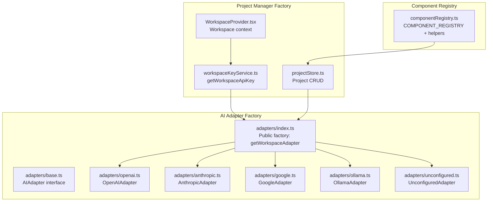
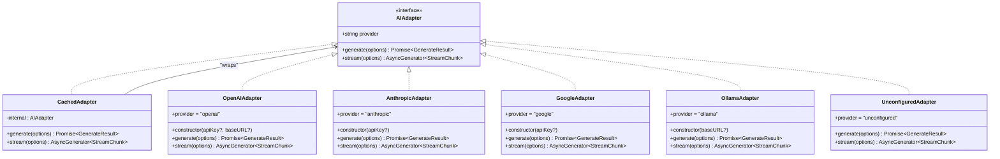
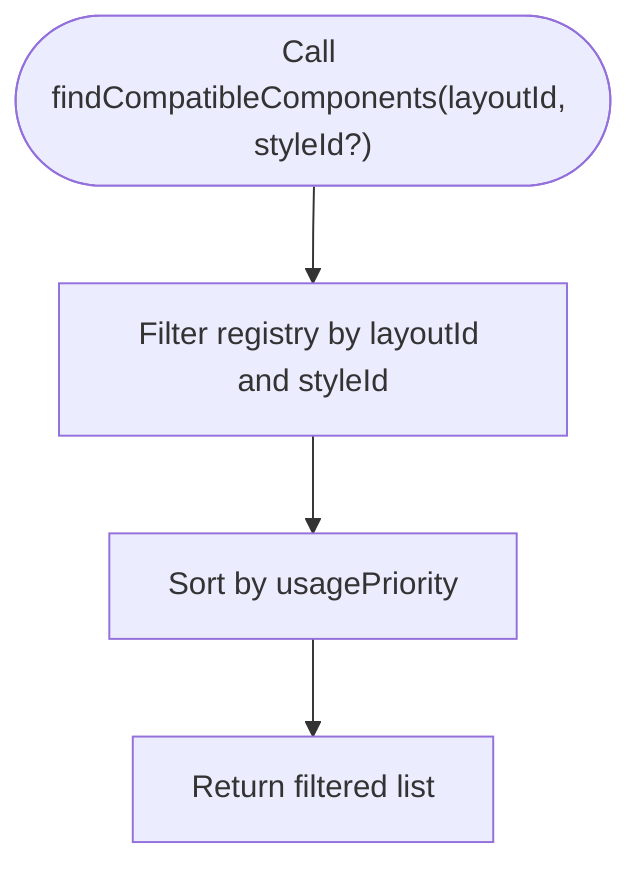
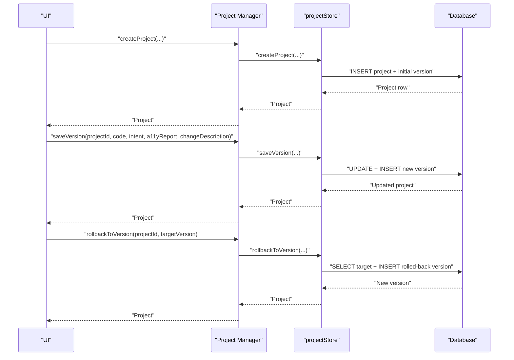
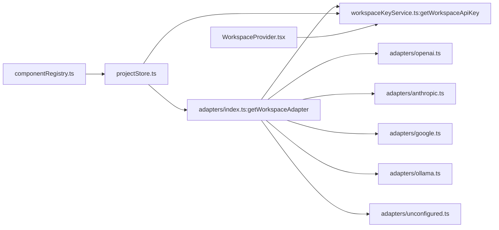

# Factory Pattern

<cite>
**Referenced Files in This Document**
- [adapters/index.ts](file://lib/ai/adapters/index.ts)
- [adapters/base.ts](file://lib/ai/adapters/base.ts)
- [adapters/openai.ts](file://lib/ai/adapters/openai.ts)
- [adapters/anthropic.ts](file://lib/ai/adapters/anthropic.ts)
- [adapters/google.ts](file://lib/ai/adapters/google.ts)
- [adapters/ollama.ts](file://lib/ai/adapters/ollama.ts)
- [adapters/unconfigured.ts](file://lib/ai/adapters/unconfigured.ts)
- [workspaceKeyService.ts](file://lib/security/workspaceKeyService.ts)
- [componentRegistry.ts](file://lib/intelligence/componentRegistry.ts)
- [projectStore.ts](file://lib/projects/projectStore.ts)
- [WorkspaceProvider.tsx](file://components/workspace/WorkspaceProvider.tsx)
</cite>

## Table of Contents
1. [Introduction](#introduction)
2. [Project Structure](#project-structure)
3. [Core Components](#core-components)
4. [Architecture Overview](#architecture-overview)
5. [Detailed Component Analysis](#detailed-component-analysis)
6. [Dependency Analysis](#dependency-analysis)
7. [Performance Considerations](#performance-considerations)
8. [Troubleshooting Guide](#troubleshooting-guide)
9. [Conclusion](#conclusion)

## Introduction
This document explains the Factory Pattern implementation used throughout the system for dynamic object creation. It focuses on:
- The AI adapter factory that creates provider-specific instances based on runtime configuration
- The component registry that acts as a factory for UI component metadata
- The project manager factory that produces workspace-scoped project instances
It also covers how factories encapsulate creation logic, handle dependency injection, and enable runtime configuration changes, with examples of factory method implementations, parameter validation, and how the pattern supports extensibility and testability. Finally, it describes the relationship between factories and dependency injection containers.

## Project Structure
The system organizes factories around three primary concerns:
- AI Adapter Factory: Selects and instantiates the appropriate AI provider adapter based on configuration and environment
- Component Registry: Provides a centralized catalog of UI components and selection helpers
- Project Manager Factory: Produces workspace-scoped project instances backed by a persistence layer



**Diagram sources**
- [adapters/index.ts:146-215](file://lib/ai/adapters/index.ts#L146-L215)
- [adapters/base.ts:50-72](file://lib/ai/adapters/base.ts#L50-L72)
- [adapters/openai.ts:36-62](file://lib/ai/adapters/openai.ts#L36-L62)
- [adapters/anthropic.ts:71-77](file://lib/ai/adapters/anthropic.ts#L71-L77)
- [adapters/google.ts:24-33](file://lib/ai/adapters/google.ts#L24-L33)
- [adapters/ollama.ts:21-30](file://lib/ai/adapters/ollama.ts#L21-L30)
- [adapters/unconfigured.ts:13-14](file://lib/ai/adapters/unconfigured.ts#L13-L14)
- [componentRegistry.ts:31-92](file://lib/intelligence/componentRegistry.ts#L31-L92)
- [workspaceKeyService.ts:32-95](file://lib/security/workspaceKeyService.ts#L32-L95)
- [projectStore.ts:105-160](file://lib/projects/projectStore.ts#L105-L160)
- [WorkspaceProvider.tsx:27-58](file://components/workspace/WorkspaceProvider.tsx#L27-L58)

**Section sources**
- [adapters/index.ts:1-306](file://lib/ai/adapters/index.ts#L1-L306)
- [componentRegistry.ts:1-117](file://lib/intelligence/componentRegistry.ts#L1-L117)
- [projectStore.ts:1-291](file://lib/projects/projectStore.ts#L1-L291)
- [workspaceKeyService.ts:1-95](file://lib/security/workspaceKeyService.ts#L1-L95)
- [WorkspaceProvider.tsx:1-58](file://components/workspace/WorkspaceProvider.tsx#L1-L58)

## Core Components
- AI Adapter Factory
  - Encapsulates provider selection and instantiation logic
  - Validates configuration and throws explicit errors when keys are missing
  - Supports environment-based fallback and workspace-scoped secrets
  - Wraps adapters with caching and metrics
- Component Registry
  - Acts as a factory for component metadata and selection helpers
  - Provides filtering and prioritization based on layout/style compatibility
- Project Manager Factory
  - Produces workspace-scoped project instances
  - Uses a persistence layer to manage versions and rollbacks
  - Integrates with workspace context for multi-tenant operations

**Section sources**
- [adapters/index.ts:146-215](file://lib/ai/adapters/index.ts#L146-L215)
- [adapters/base.ts:50-72](file://lib/ai/adapters/base.ts#L50-L72)
- [componentRegistry.ts:94-116](file://lib/intelligence/componentRegistry.ts#L94-L116)
- [projectStore.ts:105-160](file://lib/projects/projectStore.ts#L105-L160)

## Architecture Overview
The factory pattern is implemented through a combination of:
- A public factory function that resolves credentials and delegates to an internal factory
- An internal factory that selects the correct adapter class based on provider and model
- A metrics and caching wrapper applied uniformly to all adapters
- A workspace-scoped secret retrieval service that supplies credentials to the factory

```mermaid
sequenceDiagram
participant Caller as "Caller"
participant Public as "getWorkspaceAdapter"
participant WSKey as "workspaceKeyService.getWorkspaceApiKey"
participant Internal as "createAdapter"
participant Adapter as "AIAdapter impl"
participant Cache as "CachedAdapter"
Caller->>Public : "providerId, modelId, workspaceId[, userId]"
Public->>WSKey : "lookup encrypted key"
alt "Key found"
WSKey-->>Public : "decrypted key"
Public->>Internal : "cfg {provider, model, apiKey}"
else "No key"
Public->>Public : "check env fallbacks"
alt "Env key found"
Public->>Internal : "cfg {provider, model, apiKey}"
else "No key anywhere"
Public-->>Caller : "UnconfiguredAdapter"
exit
end
end
Internal->>Adapter : "new OpenAIAdapter / AnthropicAdapter / ..."
Adapter->>Cache : "wrap with CachedAdapter"
Cache-->>Public : "CachedAdapter"
Public-->>Caller : "AIAdapter"
```

**Diagram sources**
- [adapters/index.ts:236-278](file://lib/ai/adapters/index.ts#L236-L278)
- [workspaceKeyService.ts:32-95](file://lib/security/workspaceKeyService.ts#L32-L95)
- [adapters/openai.ts:36-62](file://lib/ai/adapters/openai.ts#L36-L62)
- [adapters/anthropic.ts:71-77](file://lib/ai/adapters/anthropic.ts#L71-L77)
- [adapters/google.ts:24-33](file://lib/ai/adapters/google.ts#L24-L33)
- [adapters/ollama.ts:21-30](file://lib/ai/adapters/ollama.ts#L21-L30)
- [adapters/unconfigured.ts:13-14](file://lib/ai/adapters/unconfigured.ts#L13-L14)

## Detailed Component Analysis

### AI Adapter Factory
The AI adapter factory encapsulates provider selection and instantiation logic behind a single public entry point. It enforces strict separation of concerns:
- Credential resolution: Workspace-scoped secrets are retrieved via a dedicated service; environment fallbacks are applied when necessary
- Provider detection: A deterministic mapping from model names to provider IDs is used as a last resort
- Adapter instantiation: The internal factory chooses the correct adapter class and wraps it with caching and metrics
- Error handling: Explicit configuration errors are thrown when credentials are missing, ensuring callers can surface actionable UI

Key implementation patterns:
- Parameter validation: The public factory validates inputs and defers to the internal factory for instantiation
- Dependency injection: The internal factory receives pre-resolved credentials and base URLs, avoiding client-provided secrets
- Extensibility: Adding a new provider requires implementing the adapter interface and updating the internal factory switch



**Diagram sources**
- [adapters/base.ts:50-72](file://lib/ai/adapters/base.ts#L50-L72)
- [adapters/index.ts:82-138](file://lib/ai/adapters/index.ts#L82-L138)
- [adapters/openai.ts:36-62](file://lib/ai/adapters/openai.ts#L36-L62)
- [adapters/anthropic.ts:71-77](file://lib/ai/adapters/anthropic.ts#L71-L77)
- [adapters/google.ts:24-33](file://lib/ai/adapters/google.ts#L24-L33)
- [adapters/ollama.ts:21-30](file://lib/ai/adapters/ollama.ts#L21-L30)
- [adapters/unconfigured.ts:13-14](file://lib/ai/adapters/unconfigured.ts#L13-L14)

**Section sources**
- [adapters/index.ts:146-215](file://lib/ai/adapters/index.ts#L146-L215)
- [adapters/base.ts:50-72](file://lib/ai/adapters/base.ts#L50-L72)
- [adapters/openai.ts:36-62](file://lib/ai/adapters/openai.ts#L36-L62)
- [adapters/anthropic.ts:71-77](file://lib/ai/adapters/anthropic.ts#L71-L77)
- [adapters/google.ts:24-33](file://lib/ai/adapters/google.ts#L24-L33)
- [adapters/ollama.ts:21-30](file://lib/ai/adapters/ollama.ts#L21-L30)
- [adapters/unconfigured.ts:13-14](file://lib/ai/adapters/unconfigured.ts#L13-L14)

### Component Registry Factory
The component registry serves as a factory for UI component metadata and selection logic:
- Centralized catalog: A static registry defines all known components with rich metadata
- Selection helpers: Functions filter and sort components by layout/style compatibility and usage priority
- Testability: The registry is pure data, enabling deterministic tests and easy mocking



**Diagram sources**
- [componentRegistry.ts:94-116](file://lib/intelligence/componentRegistry.ts#L94-L116)

**Section sources**
- [componentRegistry.ts:31-116](file://lib/intelligence/componentRegistry.ts#L31-L116)

### Project Manager Factory
The project manager factory produces workspace-scoped project instances backed by a persistence layer:
- Workspace scoping: Projects are associated with a workspace ID and scoped to authorized users
- Versioning: Each save creates a new version with metadata and change descriptions
- Rollback: Targets a previous version and creates a new version representing the rollback
- Persistence: Uses a database abstraction with graceful handling for migrations



**Diagram sources**
- [projectStore.ts:105-160](file://lib/projects/projectStore.ts#L105-L160)
- [projectStore.ts:162-208](file://lib/projects/projectStore.ts#L162-L208)
- [projectStore.ts:247-281](file://lib/projects/projectStore.ts#L247-L281)

**Section sources**
- [projectStore.ts:105-160](file://lib/projects/projectStore.ts#L105-L160)
- [projectStore.ts:162-208](file://lib/projects/projectStore.ts#L162-L208)
- [projectStore.ts:247-281](file://lib/projects/projectStore.ts#L247-L281)

## Dependency Analysis
Factories depend on:
- Adapter factory depends on:
  - Provider detection and configuration resolution
  - Workspace-scoped secret retrieval
  - Environment variables as fallback
  - Adapter implementations and caching wrapper
- Component registry depends on:
  - Pure metadata arrays and helper functions
- Project manager factory depends on:
  - Persistence layer for CRUD operations
  - Workspace context for scoping



**Diagram sources**
- [adapters/index.ts:236-278](file://lib/ai/adapters/index.ts#L236-L278)
- [workspaceKeyService.ts:32-95](file://lib/security/workspaceKeyService.ts#L32-L95)
- [projectStore.ts:105-160](file://lib/projects/projectStore.ts#L105-L160)
- [componentRegistry.ts:31-92](file://lib/intelligence/componentRegistry.ts#L31-L92)
- [WorkspaceProvider.tsx:27-58](file://components/workspace/WorkspaceProvider.tsx#L27-L58)

**Section sources**
- [adapters/index.ts:146-215](file://lib/ai/adapters/index.ts#L146-L215)
- [workspaceKeyService.ts:32-95](file://lib/security/workspaceKeyService.ts#L32-L95)
- [projectStore.ts:105-160](file://lib/projects/projectStore.ts#L105-L160)
- [componentRegistry.ts:31-116](file://lib/intelligence/componentRegistry.ts#L31-L116)
- [WorkspaceProvider.tsx:27-58](file://components/workspace/WorkspaceProvider.tsx#L27-L58)

## Performance Considerations
- Caching: The adapter factory wraps adapters with a caching layer that stores generation results keyed by normalized options, reducing repeated calls and improving latency
- Metrics: Each adapter emits usage metrics and latency measurements, enabling observability and cost estimation
- Workspace key caching: The workspace key service caches decrypted keys with a TTL to minimize database lookups
- Lazy instantiation: Factories defer instantiation until credentials are available, avoiding unnecessary allocations

[No sources needed since this section provides general guidance]

## Troubleshooting Guide
Common issues and resolutions:
- Missing API keys
  - Symptom: ConfigurationError thrown or UnconfiguredAdapter returned
  - Resolution: Configure provider keys in the workspace settings or environment variables
- Provider mismatch
  - Symptom: Unexpected provider selected
  - Resolution: Explicitly pass provider ID in configuration; model-based detection is a fallback
- Workspace authorization
  - Symptom: Null key returned for workspace-scoped lookup
  - Resolution: Verify user membership and workspace settings presence
- Database migration pending
  - Symptom: Project table missing error
  - Resolution: Run migrations; the project store returns an in-memory stub for UI continuity

**Section sources**
- [adapters/index.ts:28-40](file://lib/ai/adapters/index.ts#L28-L40)
- [adapters/index.ts:236-278](file://lib/ai/adapters/index.ts#L236-L278)
- [workspaceKeyService.ts:32-95](file://lib/security/workspaceKeyService.ts#L32-L95)
- [projectStore.ts:5-8](file://lib/projects/projectStore.ts#L5-L8)
- [projectStore.ts:142-159](file://lib/projects/projectStore.ts#L142-L159)

## Conclusion
The Factory Pattern is central to the system’s design, enabling:
- Clean separation of creation logic from usage
- Runtime configuration-driven instantiation
- Strong dependency injection boundaries
- Extensibility with minimal coupling
- Testability through deterministic factories and pure registries

By encapsulating provider selection, component metadata, and project persistence behind factories, the system remains flexible, maintainable, and robust under varying configurations and environments.