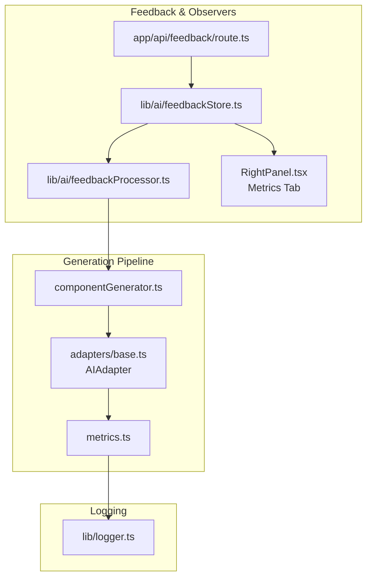
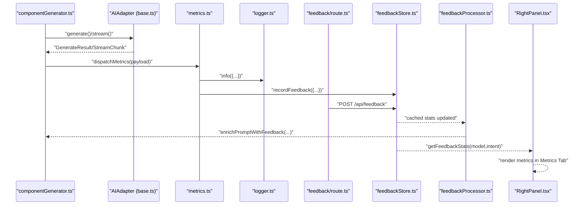
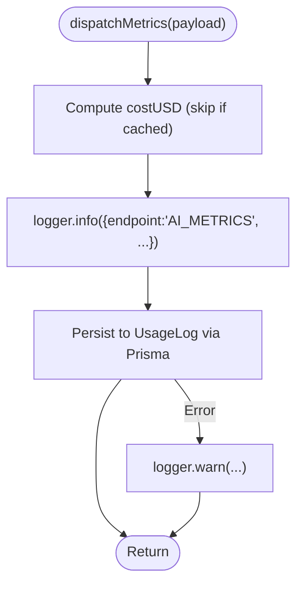
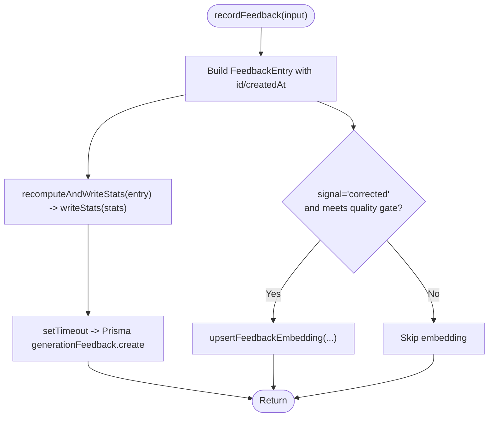
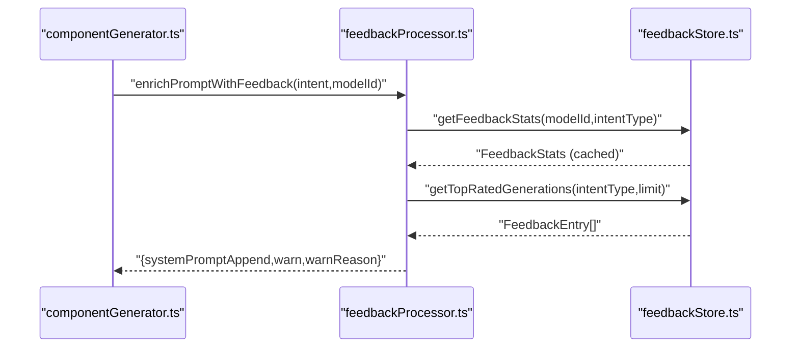
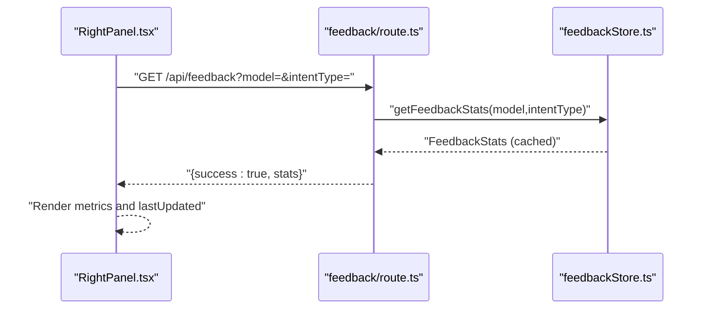
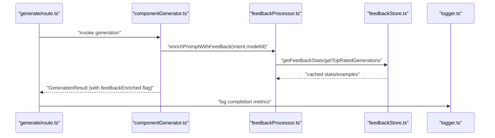
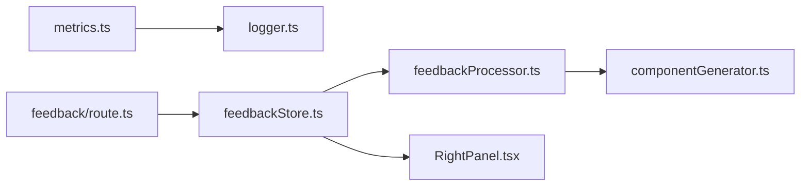

# Observer Pattern

<cite>
**Referenced Files in This Document**
- [metrics.ts](file://lib/ai/metrics.ts)
- [feedbackStore.ts](file://lib/ai/feedbackStore.ts)
- [feedbackProcessor.ts](file://lib/ai/feedbackProcessor.ts)
- [route.ts](file://app/api/feedback/route.ts)
- [RightPanel.tsx](file://components/ide/RightPanel.tsx)
- [logger.ts](file://lib/logger.ts)
- [componentGenerator.ts](file://lib/ai/componentGenerator.ts)
- [route.ts](file://app/api/generate/route.ts)
- [base.ts](file://lib/ai/adapters/base.ts)
</cite>

## Table of Contents
1. [Introduction](#introduction)
2. [Project Structure](#project-structure)
3. [Core Components](#core-components)
4. [Architecture Overview](#architecture-overview)
5. [Detailed Component Analysis](#detailed-component-analysis)
6. [Dependency Analysis](#dependency-analysis)
7. [Performance Considerations](#performance-considerations)
8. [Troubleshooting Guide](#troubleshooting-guide)
9. [Conclusion](#conclusion)

## Introduction
This document explains how the system implements an Observer-like pattern to collect real-time feedback and track metrics across generation events, validation outcomes, and user interactions. It focuses on:
- Event-driven architecture enabling decoupled communication
- Observer registration and notification mechanisms
- How the system maintains loose coupling while preserving functionality
- Extensibility for additional observers
- Performance and memory management considerations for long-running observation scenarios

## Project Structure
The Observer pattern manifests through three primary subsystems:
- Metrics dispatch and persistence for generation events
- Feedback recording and statistics caching for user interactions
- Real-time UI updates driven by cached feedback statistics

**Diagram sources**
- [componentGenerator.ts:33-401](file://lib/ai/componentGenerator.ts#L33-L401)
- [base.ts:50-72](file://lib/ai/adapters/base.ts#L50-L72)
- [metrics.ts:36-88](file://lib/ai/metrics.ts#L36-L88)
- [route.ts:1-85](file://app/api/feedback/route.ts#L1-L85)
- [feedbackStore.ts:211-276](file://lib/ai/feedbackStore.ts#L211-L276)
- [feedbackProcessor.ts:49-127](file://lib/ai/feedbackProcessor.ts#L49-L127)
- [RightPanel.tsx:703-727](file://components/ide/RightPanel.tsx#L703-L727)
- [logger.ts:23-85](file://lib/logger.ts#L23-L85)

**Section sources**
- [metrics.ts:1-89](file://lib/ai/metrics.ts#L1-L89)
- [feedbackStore.ts:1-356](file://lib/ai/feedbackStore.ts#L1-L356)
- [feedbackProcessor.ts:1-149](file://lib/ai/feedbackProcessor.ts#L1-L149)
- [route.ts:1-85](file://app/api/feedback/route.ts#L1-L85)
- [RightPanel.tsx:703-727](file://components/ide/RightPanel.tsx#L703-L727)
- [logger.ts:1-89](file://lib/logger.ts#L1-L89)
- [componentGenerator.ts:33-401](file://lib/ai/componentGenerator.ts#L33-L401)
- [route.ts:380-413](file://app/api/generate/route.ts#L380-L413)
- [base.ts:1-73](file://lib/ai/adapters/base.ts#L1-L73)

## Core Components
- Metrics dispatcher: centralizes logging and persistence of generation usage and latency, decoupling observers from the generation path.
- Feedback store: records user signals and recomputes statistics, exposing a cache-backed read API for observers.
- Feedback processor: enriches prompts and emits warnings based on cached statistics, acting as a reactive observer of feedback trends.
- API endpoints: expose feedback recording and statistics retrieval for UI and external systems.
- UI panel: subscribes to cached statistics to render real-time metrics.

These components collectively implement an event-driven, loosely coupled system where observers react to events without direct dependencies on each other.

**Section sources**
- [metrics.ts:17-88](file://lib/ai/metrics.ts#L17-L88)
- [feedbackStore.ts:23-306](file://lib/ai/feedbackStore.ts#L23-L306)
- [feedbackProcessor.ts:32-127](file://lib/ai/feedbackProcessor.ts#L32-L127)
- [route.ts:28-84](file://app/api/feedback/route.ts#L28-L84)
- [RightPanel.tsx:703-727](file://components/ide/RightPanel.tsx#L703-L727)

## Architecture Overview
The system follows an event-driven architecture:
- Events originate from generation and user actions.
- Observers subscribe to caches and APIs rather than direct callbacks.
- Fire-and-forget notifications ensure non-blocking operation.

**Diagram sources**
- [componentGenerator.ts:33-401](file://lib/ai/componentGenerator.ts#L33-L401)
- [base.ts:50-72](file://lib/ai/adapters/base.ts#L50-L72)
- [metrics.ts:36-88](file://lib/ai/metrics.ts#L36-L88)
- [logger.ts:23-85](file://lib/logger.ts#L23-L85)
- [route.ts:28-59](file://app/api/feedback/route.ts#L28-L59)
- [feedbackStore.ts:211-276](file://lib/ai/feedbackStore.ts#L211-L276)
- [feedbackProcessor.ts:49-127](file://lib/ai/feedbackProcessor.ts#L49-L127)
- [RightPanel.tsx:703-727](file://components/ide/RightPanel.tsx#L703-L727)

## Detailed Component Analysis

### Metrics Dispatcher (Observer of Generation Events)
- Purpose: Centralized dispatch of generation metrics (tokens, latency, cost, cache hit) to structured logs and persistent storage.
- Observer behavior: Observes adapter completions and notifies logging and persistence without blocking the request path.
- Decoupling: Uses fire-and-forget semantics; errors are caught and logged, ensuring the generation pipeline remains unaffected.

**Diagram sources**
- [metrics.ts:36-88](file://lib/ai/metrics.ts#L36-L88)
- [logger.ts:47-63](file://lib/logger.ts#L47-L63)

**Section sources**
- [metrics.ts:17-88](file://lib/ai/metrics.ts#L17-L88)
- [logger.ts:1-89](file://lib/logger.ts#L1-L89)

### Feedback Store (Observer of User Interactions)
- Purpose: Records user feedback signals and recomputes statistics, maintaining a cache-backed stats store.
- Observer behavior: Observes feedback submissions and updates cached statistics; exposes read APIs for observers.
- Dual-write strategy: Fast cache update (Redis/memory) plus asynchronous DB persistence; optional vector embedding for high-quality corrections.

**Diagram sources**
- [feedbackStore.ts:211-276](file://lib/ai/feedbackStore.ts#L211-L276)

**Section sources**
- [feedbackStore.ts:23-306](file://lib/ai/feedbackStore.ts#L23-L306)
- [route.ts:28-59](file://app/api/feedback/route.ts#L28-L59)

### Feedback Processor (Observer of Historical Trends)
- Purpose: Enriches generation prompts and emits warnings based on cached feedback statistics.
- Observer behavior: Reads cached stats synchronously (in-memory fallback) and optionally injects approved examples into prompts.
- Decoupling: Operates independently of the generation pipeline; zero network calls during prompt enrichment.

**Diagram sources**
- [feedbackProcessor.ts:49-127](file://lib/ai/feedbackProcessor.ts#L49-L127)
- [feedbackStore.ts:298-306](file://lib/ai/feedbackStore.ts#L298-L306)
- [feedbackStore.ts:323-339](file://lib/ai/feedbackStore.ts#L323-L339)

**Section sources**
- [feedbackProcessor.ts:23-127](file://lib/ai/feedbackProcessor.ts#L23-L127)
- [feedbackStore.ts:286-306](file://lib/ai/feedbackStore.ts#L286-L306)

### UI Metrics Panel (Observer of Cached Statistics)
- Purpose: Renders real-time metrics (success rates, average scores, latency) by polling cached statistics.
- Observer behavior: Subscribes to cached stats via GET /api/feedback and updates the UI on change.

**Diagram sources**
- [RightPanel.tsx:703-727](file://components/ide/RightPanel.tsx#L703-L727)
- [route.ts:64-84](file://app/api/feedback/route.ts#L64-L84)
- [feedbackStore.ts:298-306](file://lib/ai/feedbackStore.ts#L298-L306)

**Section sources**
- [RightPanel.tsx:703-727](file://components/ide/RightPanel.tsx#L703-L727)
- [route.ts:64-84](file://app/api/feedback/route.ts#L64-L84)

### Integration with Generation Pipeline
- The generation pipeline triggers metrics dispatch upon completion and can incorporate feedback-enriched prompts and warnings before generating code.
- This ensures that downstream observers (UI, validators, repair pipelines) benefit from historical insights without modifying the core generation logic.

**Diagram sources**
- [route.ts:380-413](file://app/api/generate/route.ts#L380-L413)
- [componentGenerator.ts:33-401](file://lib/ai/componentGenerator.ts#L33-L401)
- [feedbackProcessor.ts:49-127](file://lib/ai/feedbackProcessor.ts#L49-L127)
- [feedbackStore.ts:298-306](file://lib/ai/feedbackStore.ts#L298-L306)
- [logger.ts:23-85](file://lib/logger.ts#L23-L85)

**Section sources**
- [route.ts:380-413](file://app/api/generate/route.ts#L380-L413)
- [componentGenerator.ts:33-401](file://lib/ai/componentGenerator.ts#L33-L401)
- [feedbackProcessor.ts:133-148](file://lib/ai/feedbackProcessor.ts#L133-L148)

## Dependency Analysis
- Loose coupling is achieved by:
  - Fire-and-forget notifications (metrics, feedback persistence)
  - Cache-backed reads for prompt enrichment
  - Asynchronous DB writes and embeddings
- Coupling reduction:
  - Observers depend on stable APIs (cache keys, read functions) rather than internal implementations.
  - Logging and persistence are separate concerns, minimizing cross-module dependencies.

**Diagram sources**
- [metrics.ts:36-88](file://lib/ai/metrics.ts#L36-L88)
- [logger.ts:23-85](file://lib/logger.ts#L23-L85)
- [route.ts:28-59](file://app/api/feedback/route.ts#L28-L59)
- [feedbackStore.ts:211-276](file://lib/ai/feedbackStore.ts#L211-L276)
- [feedbackProcessor.ts:49-127](file://lib/ai/feedbackProcessor.ts#L49-L127)
- [componentGenerator.ts:33-401](file://lib/ai/componentGenerator.ts#L33-L401)
- [RightPanel.tsx:703-727](file://components/ide/RightPanel.tsx#L703-L727)

**Section sources**
- [metrics.ts:1-89](file://lib/ai/metrics.ts#L1-L89)
- [feedbackStore.ts:1-356](file://lib/ai/feedbackStore.ts#L1-L356)
- [feedbackProcessor.ts:1-149](file://lib/ai/feedbackProcessor.ts#L1-L149)
- [route.ts:1-85](file://app/api/feedback/route.ts#L1-L85)
- [RightPanel.tsx:703-727](file://components/ide/RightPanel.tsx#L703-L727)
- [componentGenerator.ts:33-401](file://lib/ai/componentGenerator.ts#L33-L401)

## Performance Considerations
- Fire-and-forget design: Metrics dispatch and feedback persistence use non-blocking patterns to avoid delaying request responses.
- Caching strategy:
  - Redis-backed stats cache with in-memory fallback for development/local environments.
  - TTL-based expiration reduces long-term memory footprint.
- Incremental statistics recomputation: Updates running totals and averages without full scans.
- Optional embeddings: Quality-gated embedding prevents low-quality data from polluting vector stores.
- UI polling: The metrics panel fetches cached stats, minimizing database load.

Recommendations:
- Monitor cache hit rates and fallback frequency; adjust TTLs and warm-up procedures accordingly.
- Batch or debounce UI polling to reduce redundant requests.
- Use connection pooling and circuit breakers for Redis and DB operations.

**Section sources**
- [metrics.ts:36-88](file://lib/ai/metrics.ts#L36-L88)
- [feedbackStore.ts:106-139](file://lib/ai/feedbackStore.ts#L106-L139)
- [feedbackStore.ts:149-199](file://lib/ai/feedbackStore.ts#L149-L199)
- [feedbackStore.ts:249-276](file://lib/ai/feedbackStore.ts#L249-L276)
- [RightPanel.tsx:703-727](file://components/ide/RightPanel.tsx#L703-L727)

## Troubleshooting Guide
- Metrics not appearing:
  - Verify dispatchMetrics is called after adapter completion.
  - Check logger output and DB persistence errors.
- Feedback not updating UI:
  - Confirm GET /api/feedback returns cached stats.
  - Ensure the UI polls the endpoint and handles null/empty responses gracefully.
- Low-quality embeddings:
  - Review quality gates and logs for skipped embeddings.
- Prompt enrichment not applied:
  - Validate cached stats availability and minimum sample thresholds.

**Section sources**
- [metrics.ts:36-88](file://lib/ai/metrics.ts#L36-L88)
- [route.ts:64-84](file://app/api/feedback/route.ts#L64-L84)
- [feedbackStore.ts:249-276](file://lib/ai/feedbackStore.ts#L249-L276)
- [feedbackProcessor.ts:23-127](file://lib/ai/feedbackProcessor.ts#L23-L127)

## Conclusion
The system implements an Observer-like pattern by:
- Decoupling event producers (generations, user actions) from observers (logging, metrics, feedback enrichment, UI).
- Using cache-backed reads and fire-and-forget notifications to maintain responsiveness.
- Supporting extensibility by allowing new observers to subscribe to the same cache and APIs without modifying core logic.

This architecture enables real-time feedback collection and metrics tracking while preserving loose coupling and scalability.