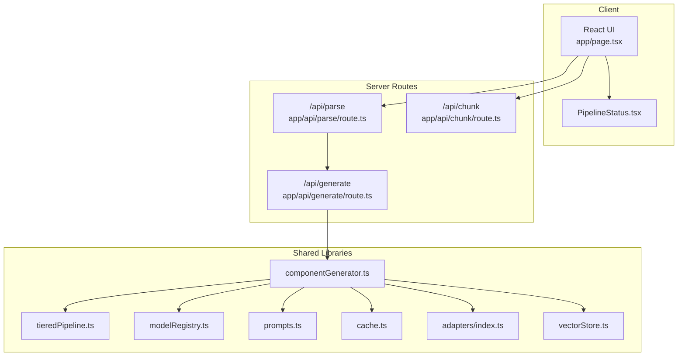
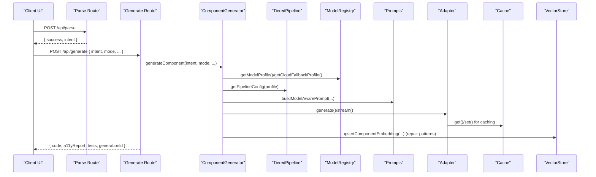
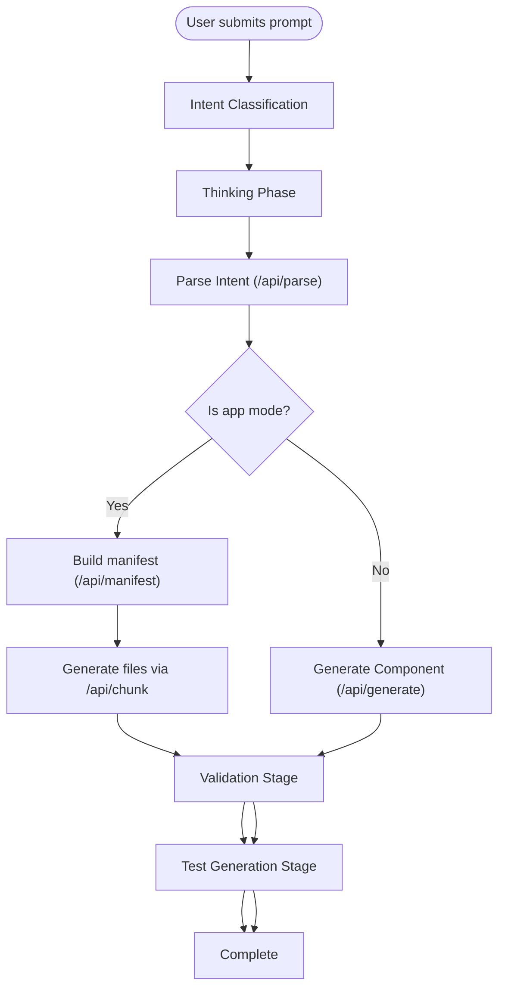
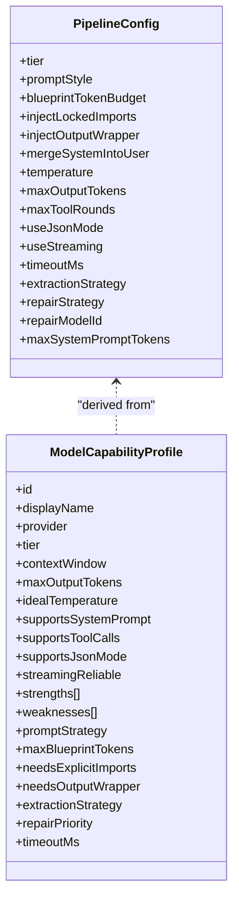
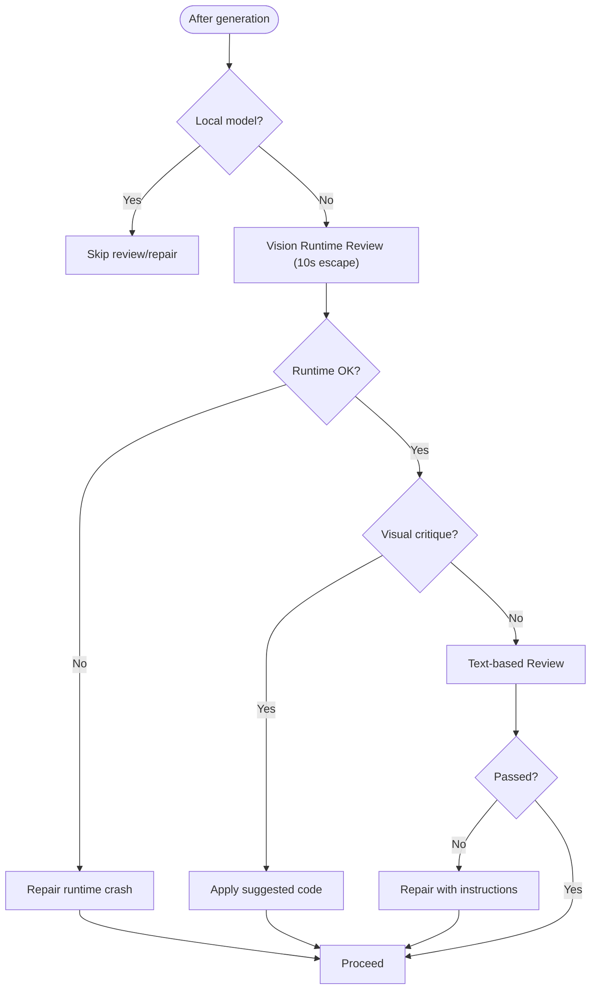
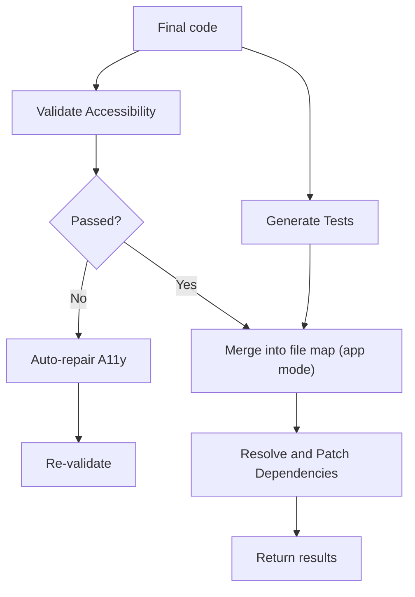
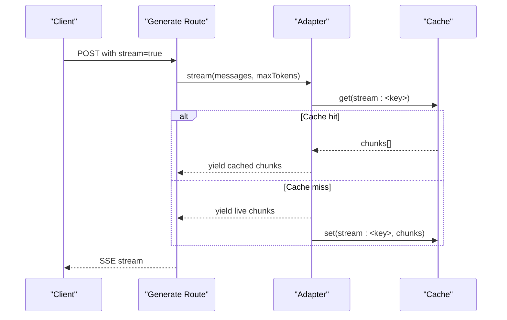
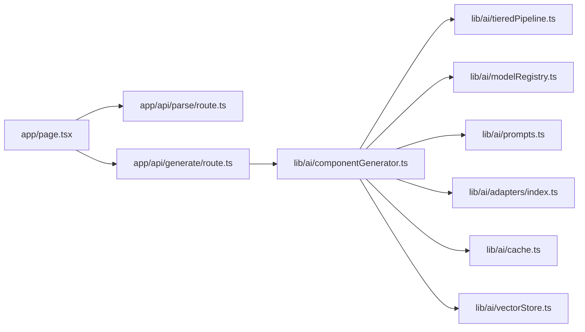

# Pipeline Pattern

<cite>
**Referenced Files in This Document**
- [app/page.tsx](file://app/page.tsx)
- [app/api/generate/route.ts](file://app/api/generate/route.ts)
- [lib/ai/tieredPipeline.ts](file://lib/ai/tieredPipeline.ts)
- [lib/ai/componentGenerator.ts](file://lib/ai/componentGenerator.ts)
- [lib/ai/modelRegistry.ts](file://lib/ai/modelRegistry.ts)
- [lib/ai/prompts.ts](file://lib/ai/prompts.ts)
- [lib/ai/cache.ts](file://lib/ai/cache.ts)
- [lib/ai/adapters/index.ts](file://lib/ai/adapters/index.ts)
- [app/api/chunk/route.ts](file://app/api/chunk/route.ts)
- [app/api/parse/route.ts](file://app/api/parse/route.ts)
- [components/PipelineStatus.tsx](file://components/PipelineStatus.tsx)
- [lib/ai/vectorStore.ts](file://lib/ai/vectorStore.ts)
</cite>

## Table of Contents
1. [Introduction](#introduction)
2. [Project Structure](#project-structure)
3. [Core Components](#core-components)
4. [Architecture Overview](#architecture-overview)
5. [Detailed Component Analysis](#detailed-component-analysis)
6. [Dependency Analysis](#dependency-analysis)
7. [Performance Considerations](#performance-considerations)
8. [Troubleshooting Guide](#troubleshooting-guide)
9. [Conclusion](#conclusion)

## Introduction
This document explains the Pipeline Pattern implementation that orchestrates the multi-stage generation workflow. The system converts natural language intents into production-ready, accessible React components through a tiered pipeline architecture. It covers sequential stages (intent classification, component generation, expert review, and AI repair), flow control, stage validation, error propagation, streaming architecture for real-time feedback, configuration and customization of pipeline tiers, consistency across generation tiers, and performance optimizations via parallelization and caching.

## Project Structure
The generation pipeline spans both client and server layers:
- Client orchestrator triggers the pipeline and renders progress.
- Server routes implement the stages and orchestrate model adapters and validators.
- Shared libraries define pipeline tiers, model capabilities, prompts, and caching.

**Diagram sources**
- [app/page.tsx:166-310](file://app/page.tsx#L166-L310)
- [app/api/parse/route.ts:11-129](file://app/api/parse/route.ts#L11-L129)
- [app/api/generate/route.ts:25-440](file://app/api/generate/route.ts#L25-L440)
- [app/api/chunk/route.ts:8-81](file://app/api/chunk/route.ts#L8-L81)
- [lib/ai/tieredPipeline.ts:32-235](file://lib/ai/tieredPipeline.ts#L32-L235)
- [lib/ai/componentGenerator.ts:60-200](file://lib/ai/componentGenerator.ts#L60-L200)
- [lib/ai/modelRegistry.ts:132-200](file://lib/ai/modelRegistry.ts#L132-L200)
- [lib/ai/prompts.ts:1-200](file://lib/ai/prompts.ts#L1-L200)
- [lib/ai/cache.ts:108-113](file://lib/ai/cache.ts#L108-L113)
- [lib/ai/adapters/index.ts:78-125](file://lib/ai/adapters/index.ts#L78-L125)
- [lib/ai/vectorStore.ts:124-155](file://lib/ai/vectorStore.ts#L124-L155)

**Section sources**
- [app/page.tsx:166-310](file://app/page.tsx#L166-L310)
- [app/api/parse/route.ts:11-129](file://app/api/parse/route.ts#L11-L129)
- [app/api/generate/route.ts:25-440](file://app/api/generate/route.ts#L25-L440)
- [app/api/chunk/route.ts:8-81](file://app/api/chunk/route.ts#L8-L81)
- [lib/ai/tieredPipeline.ts:32-235](file://lib/ai/tieredPipeline.ts#L32-L235)
- [lib/ai/componentGenerator.ts:60-200](file://lib/ai/componentGenerator.ts#L60-L200)
- [lib/ai/modelRegistry.ts:132-200](file://lib/ai/modelRegistry.ts#L132-L200)
- [lib/ai/prompts.ts:1-200](file://lib/ai/prompts.ts#L1-L200)
- [lib/ai/cache.ts:108-113](file://lib/ai/cache.ts#L108-L113)
- [lib/ai/adapters/index.ts:78-125](file://lib/ai/adapters/index.ts#L78-L125)
- [lib/ai/vectorStore.ts:124-155](file://lib/ai/vectorStore.ts#L124-L155)

## Core Components
- Pipeline orchestration and UI:
  - Client orchestrator coordinates intent parsing, generation, validation, testing, and preview.
  - PipelineStatus displays the current stage and error handling.
- Server-side pipeline stages:
  - Intent parsing, component generation, expert review, accessibility validation, test generation, and persistence.
- Tiered pipeline configuration:
  - Model capability profiles drive prompt style, token budgets, tool rounds, streaming, timeouts, and repair strategies.
- Caching and streaming:
  - Adapter caching and SSE streaming enable performance and real-time feedback.

**Section sources**
- [app/page.tsx:166-310](file://app/page.tsx#L166-L310)
- [components/PipelineStatus.tsx:10-75](file://components/PipelineStatus.tsx#L10-L75)
- [app/api/generate/route.ts:25-440](file://app/api/generate/route.ts#L25-L440)
- [lib/ai/tieredPipeline.ts:32-235](file://lib/ai/tieredPipeline.ts#L32-L235)

## Architecture Overview
The pipeline follows a staged, model-agnostic flow:
- Intent classification and parsing produce a structured UI intent.
- Component generation uses a model-aware pipeline with configurable tiers.
- Expert review and AI repair improve quality and stability.
- Accessibility validation and test generation ensure correctness and testability.
- Parallel processing accelerates independent tasks.
- Streaming enables real-time feedback for long-running generations.

**Diagram sources**
- [app/page.tsx:166-310](file://app/page.tsx#L166-L310)
- [app/api/parse/route.ts:11-129](file://app/api/parse/route.ts#L11-L129)
- [app/api/generate/route.ts:25-440](file://app/api/generate/route.ts#L25-L440)
- [lib/ai/componentGenerator.ts:60-200](file://lib/ai/componentGenerator.ts#L60-L200)
- [lib/ai/tieredPipeline.ts:191-235](file://lib/ai/tieredPipeline.ts#L191-L235)
- [lib/ai/modelRegistry.ts:132-200](file://lib/ai/modelRegistry.ts#L132-L200)
- [lib/ai/prompts.ts:141-170](file://lib/ai/prompts.ts#L141-L170)
- [lib/ai/adapters/index.ts:78-125](file://lib/ai/adapters/index.ts#L78-L125)
- [lib/ai/cache.ts:108-113](file://lib/ai/cache.ts#L108-L113)
- [lib/ai/vectorStore.ts:124-155](file://lib/ai/vectorStore.ts#L124-L155)

## Detailed Component Analysis

### Client Orchestration and Stage Flow
- The client orchestrator:
  - Sets stage and pipeline step markers.
  - Calls /api/parse to convert natural language to a structured intent.
  - Executes /api/generate for component generation or /api/chunk for app-mode file chunks.
  - Updates stages for validating, testing, and completion.
  - Persists project and records generation metadata.

**Diagram sources**
- [app/page.tsx:166-310](file://app/page.tsx#L166-L310)
- [app/api/parse/route.ts:11-129](file://app/api/parse/route.ts#L11-L129)
- [app/api/chunk/route.ts:8-81](file://app/api/chunk/route.ts#L8-L81)
- [app/api/generate/route.ts:25-440](file://app/api/generate/route.ts#L25-L440)

**Section sources**
- [app/page.tsx:166-310](file://app/page.tsx#L166-L310)

### Tiered Pipeline Configuration and Stage Customization
- PipelineConfig defines:
  - Prompt style, blueprint token budget, locked imports, output wrapper, and system prompt merging.
  - Generation parameters: temperature, max output tokens, tool rounds, JSON mode, streaming, timeout.
  - Post-processing: extraction strategy, repair strategy, repair model id, and system prompt token limits.
- getPipelineConfig derives a full configuration from a model capability profile, overriding tier defaults with profile-specific values.
- Tiers:
  - tiny: fill-in-blank, temp 0.0, no tools, aggressive extraction, ai-cheap repair.
  - small: structured template, temp 0.15, no tools, rules-only repair.
  - medium: guided freeform, temp 0.25, no tools, rules-only repair.
  - large: light guidance, temp 0.4, no tools, rules-only repair.
  - cloud: full freeform, temp 0.55+, no tools, rules-only repair.

**Diagram sources**
- [lib/ai/tieredPipeline.ts:32-84](file://lib/ai/tieredPipeline.ts#L32-L84)
- [lib/ai/tieredPipeline.ts:191-235](file://lib/ai/tieredPipeline.ts#L191-L235)
- [lib/ai/modelRegistry.ts:69-128](file://lib/ai/modelRegistry.ts#L69-L128)

**Section sources**
- [lib/ai/tieredPipeline.ts:32-235](file://lib/ai/tieredPipeline.ts#L32-L235)
- [lib/ai/modelRegistry.ts:132-200](file://lib/ai/modelRegistry.ts#L132-L200)

### Expert Review and AI Repair
- The expert review and repair phase:
  - Skips for local/Ollama models to avoid expensive secondary inference calls.
  - Runs a 60-second aggregate timeout to prevent exceeding platform limits.
  - Performs a vision runtime review with a 10-second hard escape hatch to avoid cold-start stalls.
  - Applies text-based review and repair instructions when critiques fail.
  - Logs review data and persists repair patterns as embeddings for reuse.

**Diagram sources**
- [app/api/generate/route.ts:242-312](file://app/api/generate/route.ts#L242-L312)
- [lib/ai/vectorStore.ts:124-155](file://lib/ai/vectorStore.ts#L124-L155)

**Section sources**
- [app/api/generate/route.ts:242-312](file://app/api/generate/route.ts#L242-L312)
- [lib/ai/vectorStore.ts:124-155](file://lib/ai/vectorStore.ts#L124-L155)

### Accessibility Validation and Test Generation
- Parallel execution:
  - Accessibility validation and test generation run concurrently after generation.
  - A11y validation applies auto-repairs when violations are found and re-validates.
  - Test generation uses the final code for speed, as repairs are typically minor.
- Dependency resolution:
  - For multi-file outputs, merges A11y-repaired code back into the file map before applying patches.

**Diagram sources**
- [app/api/generate/route.ts:328-406](file://app/api/generate/route.ts#L328-L406)

**Section sources**
- [app/api/generate/route.ts:328-406](file://app/api/generate/route.ts#L328-L406)

### Streaming Architecture and Real-Time Feedback
- Streaming:
  - The generate route supports SSE streaming for long-running model calls.
  - The adapter wrapper caches and streams responses, yielding chunks with usage metrics.
- Client-side progress:
  - PipelineStatus displays active, pending, and completed stages.
  - The orchestrator advances stages with deliberate delays to reflect validation/testing.

**Diagram sources**
- [app/api/generate/route.ts:56-97](file://app/api/generate/route.ts#L56-L97)
- [lib/ai/adapters/index.ts:109-125](file://lib/ai/adapters/index.ts#L109-L125)
- [lib/ai/cache.ts:108-113](file://lib/ai/cache.ts#L108-L113)

**Section sources**
- [app/api/generate/route.ts:56-97](file://app/api/generate/route.ts#L56-L97)
- [lib/ai/adapters/index.ts:109-125](file://lib/ai/adapters/index.ts#L109-L125)
- [lib/ai/cache.ts:108-113](file://lib/ai/cache.ts#L108-L113)
- [components/PipelineStatus.tsx:77-162](file://components/PipelineStatus.tsx#L77-L162)

### Consistency Across Generation Tiers
- ModelRegistry centralizes capability metadata to ensure consistent behavior across tiers.
- getPipelineConfig enforces profile-specific overrides for prompt style, token budgets, streaming reliability, and repair strategies.
- ComponentGenerator composes prompts and applies deterministic beautification and validation regardless of tier.

**Section sources**
- [lib/ai/modelRegistry.ts:132-200](file://lib/ai/modelRegistry.ts#L132-L200)
- [lib/ai/tieredPipeline.ts:191-235](file://lib/ai/tieredPipeline.ts#L191-L235)
- [lib/ai/componentGenerator.ts:60-200](file://lib/ai/componentGenerator.ts#L60-L200)

## Dependency Analysis
- Client depends on server routes for parsing and generation.
- Generate route depends on component generator, validators, reviewers, and persistence.
- Component generator depends on tiered pipeline, model registry, prompts, adapters, and cache.
- Vector store persists repair patterns for reuse.

**Diagram sources**
- [app/page.tsx:166-310](file://app/page.tsx#L166-L310)
- [app/api/parse/route.ts:11-129](file://app/api/parse/route.ts#L11-L129)
- [app/api/generate/route.ts:25-440](file://app/api/generate/route.ts#L25-L440)
- [lib/ai/componentGenerator.ts:60-200](file://lib/ai/componentGenerator.ts#L60-L200)
- [lib/ai/tieredPipeline.ts:32-235](file://lib/ai/tieredPipeline.ts#L32-L235)
- [lib/ai/modelRegistry.ts:132-200](file://lib/ai/modelRegistry.ts#L132-L200)
- [lib/ai/prompts.ts:1-200](file://lib/ai/prompts.ts#L1-L200)
- [lib/ai/adapters/index.ts:78-125](file://lib/ai/adapters/index.ts#L78-L125)
- [lib/ai/cache.ts:108-113](file://lib/ai/cache.ts#L108-L113)
- [lib/ai/vectorStore.ts:124-155](file://lib/ai/vectorStore.ts#L124-L155)

**Section sources**
- [app/page.tsx:166-310](file://app/page.tsx#L166-L310)
- [app/api/generate/route.ts:25-440](file://app/api/generate/route.ts#L25-L440)
- [lib/ai/componentGenerator.ts:60-200](file://lib/ai/componentGenerator.ts#L60-L200)

## Performance Considerations
- Parallelization:
  - Accessibility validation and test generation run concurrently to reduce total latency.
- Streaming:
  - SSE streaming provides immediate feedback for long generations; adapter caching reduces repeated computation.
- Caching:
  - Adapter wraps generate/stream calls with pluggable cache (memory or Upstash Redis) to avoid recomputation.
- Tiered optimization:
  - Small/medium/large tiers cap blueprint sizes and disable tool calls to prevent silent 400s and reduce overhead.
- Timeout management:
  - Review phase is bounded by a 60-second aggregate timeout to prevent exceeding platform limits.

[No sources needed since this section provides general guidance]

## Troubleshooting Guide
- Intent parsing failures:
  - The parse route validates input and returns structured errors; client displays them and continues with defaults when classification is unavailable.
- Generation errors:
  - The generate route logs model/provider context and returns 422/500 with error details; client sets error stage and displays messages.
- Session and authorization:
  - PipelineStatus detects unauthorized conditions and offers a sign-in action.
- Streaming issues:
  - Adapter caching and fallbacks ensure resilience; errors are propagated as stream deltas.

**Section sources**
- [app/api/parse/route.ts:11-129](file://app/api/parse/route.ts#L11-L129)
- [app/api/generate/route.ts:25-440](file://app/api/generate/route.ts#L25-L440)
- [components/PipelineStatus.tsx:165-215](file://components/PipelineStatus.tsx#L165-L215)
- [lib/ai/adapters/index.ts:109-125](file://lib/ai/adapters/index.ts#L109-L125)

## Conclusion
The Pipeline Pattern implementation delivers a robust, model-agnostic, and performance-conscious generation workflow. By structuring stages, enforcing tiered configurations, leveraging parallelism and streaming, and implementing resilient caching and error handling, the system consistently produces accessible, validated, and testable UI components across diverse model capabilities and deployment environments.