# API Layer

<cite>
**Referenced Files in This Document**
- [route.ts](file://app/api/auth/[...nextauth]/route.ts)
- [route.ts](file://app/api/generate/route.ts)
- [route.ts](file://app/api/think/route.ts)
- [route.ts](file://app/api/classify/route.ts)
- [route.ts](file://app/api/models/route.ts)
- [route.ts](file://app/api/projects/route.ts)
- [route.ts](file://app/api/projects/[id]/route.ts)
- [route.ts](file://app/api/projects/[id]/rollback/route.ts)
- [route.ts](file://app/api/workspaces/route.ts)
- [route.ts](file://app/api/workspace/settings/route.ts)
- [route.ts](file://app/api/history/route.ts)
- [route.ts](file://app/api/chunk/route.ts)
- [route.ts](file://app/api/feedback/route.ts)
- [route.ts](file://app/api/suggestions/route.ts)
- [route.ts](file://app/api/usage/route.ts)
- [route.ts](file://app/api/final-round/route.ts)
- [auth.ts](file://lib/auth.ts)
- [thinkingEngine.ts](file://lib/ai/thinkingEngine.ts)
- [intentClassifier.ts](file://lib/ai/intentClassifier.ts)
</cite>

## Update Summary
**Changes Made**
- Added new `/api/think` and `/api/classify` routes to the API architecture documentation
- Updated Performance Considerations section to include maxDuration = 60 for Vercel deployment compatibility
- Enhanced Architecture Overview and Detailed Component Analysis sections with new thinking and classification capabilities
- Updated dependency analysis to include new AI processing routes

## Table of Contents
1. [Introduction](#introduction)
2. [Project Structure](#project-structure)
3. [Core Components](#core-components)
4. [Architecture Overview](#architecture-overview)
5. [Detailed Component Analysis](#detailed-component-analysis)
6. [Dependency Analysis](#dependency-analysis)
7. [Performance Considerations](#performance-considerations)
8. [Troubleshooting Guide](#troubleshooting-guide)
9. [Conclusion](#conclusion)

## Introduction
This document describes the API layer architecture of the Next.js application. It explains how serverless functions are organized under the app/api directory, how routing works with dynamic segments, and how request and response handling is implemented. It also documents authentication, validation, error handling, and the data flow across endpoints grouped by domain (generation, workspace, project, usage, and others). Finally, it covers serverless deployment characteristics and performance considerations relevant to Vercel Functions.

## Project Structure
The API surface is defined by individual route handlers under app/api. Each file exports HTTP method handlers (GET, POST, etc.) that implement the endpoint logic. Many endpoints integrate with shared libraries for authentication, validation, logging, and persistence.

```mermaid
graph TB
subgraph "API Routes"
AUTH["app/api/auth/[...nextauth]/route.ts"]
GEN["app/api/generate/route.ts"]
THINK["app/api/think/route.ts"]
CLASSIFY["app/api/classify/route.ts"]
MODELS["app/api/models/route.ts"]
FEEDBACK["app/api/feedback/route.ts"]
CHUNK["app/api/chunk/route.ts"]
SUGGEST["app/api/suggestions/route.ts"]
USAGE["app/api/usage/route.ts"]
FINAL["app/api/final-round/route.ts"]
WORKSPACES["app/api/workspaces/route.ts"]
WS_SETTINGS["app/api/workspace/settings/route.ts"]
HISTORY["app/api/history/route.ts"]
PROJ_LIST["app/api/projects/route.ts"]
PROJ_ID["app/api/projects/[id]/route.ts"]
PROJ_ROLL["app/api/projects/[id]/rollback/route.ts"]
end
subgraph "Libraries"
AUTHLIB["lib/auth.ts"]
THINKENG["lib/ai/thinkingEngine.ts"]
INTCLAS["lib/ai/intentClassifier.ts"]
end
AUTH --> AUTHLIB
GEN --> AUTHLIB
THINK --> AUTHLIB
THINK --> THINKENG
CLASSIFY --> AUTHLIB
CLASSIFY --> INTCLAS
CHUNK --> AUTHLIB
SUGGEST --> AUTHLIB
FINAL --> AUTHLIB
PROJ_LIST --> AUTHLIB
PROJ_ID --> AUTHLIB
PROJ_ROLL --> AUTHLIB
WORKSPACES --> AUTHLIB
WS_SETTINGS --> AUTHLIB
```

**Diagram sources**
- [route.ts:1-4](file://app/api/auth/[...nextauth]/route.ts#L1-L4)
- [route.ts:1-387](file://app/api/generate/route.ts#L1-L387)
- [route.ts:1-88](file://app/api/think/route.ts#L1-L88)
- [route.ts:1-81](file://app/api/classify/route.ts#L1-L81)
- [route.ts:1-457](file://app/api/models/route.ts#L1-L457)
- [route.ts:1-85](file://app/api/feedback/route.ts#L1-L85)
- [route.ts:1-81](file://app/api/chunk/route.ts#L1-L81)
- [route.ts:1-115](file://app/api/suggestions/route.ts#L1-L115)
- [route.ts:1-111](file://app/api/usage/route.ts#L1-L111)
- [route.ts:1-71](file://app/api/final-round/route.ts#L1-L71)
- [route.ts:1-145](file://app/api/workspaces/route.ts#L1-L145)
- [route.ts:1-147](file://app/api/workspace/settings/route.ts#L1-L147)
- [route.ts:1-60](file://app/api/history/route.ts#L1-L60)
- [route.ts:1-92](file://app/api/projects/route.ts#L1-L92)
- [route.ts:1-12](file://app/api/projects/[id]/route.ts#L1-L12)
- [route.ts:1-23](file://app/api/projects/[id]/rollback/route.ts#L1-L23)
- [auth.ts:1-87](file://lib/auth.ts#L1-L87)
- [thinkingEngine.ts:1-566](file://lib/ai/thinkingEngine.ts#L1-L566)
- [intentClassifier.ts:1-261](file://lib/ai/intentClassifier.ts#L1-L261)

**Section sources**
- [route.ts:1-4](file://app/api/auth/[...nextauth]/route.ts#L1-L4)
- [auth.ts:1-87](file://lib/auth.ts#L1-L87)

## Core Components
- Authentication and session management are provided by NextAuth and exposed via lib/auth.ts. The exported auth() function is used by most API routes to enforce session-based access.
- Request handling follows a consistent pattern: parse JSON body, validate inputs, enforce security constraints (only accept provider/model from client), and return structured JSON responses with appropriate HTTP status codes.
- Logging is centralized through a logger utility that creates per-request loggers for tracing endpoint execution.
- Many endpoints rely on shared libraries for validation, security checks, and integrations with AI adapters and persistence layers.
- **New**: Thinking and classification endpoints provide AI-driven intent analysis and planning capabilities with intelligent fallback mechanisms.

**Section sources**
- [auth.ts:1-87](file://lib/auth.ts#L1-L87)
- [route.ts:1-387](file://app/api/generate/route.ts#L1-L387)
- [route.ts:1-88](file://app/api/think/route.ts#L1-L88)
- [route.ts:1-81](file://app/api/classify/route.ts#L1-L81)
- [route.ts:1-81](file://app/api/chunk/route.ts#L1-L81)
- [route.ts:1-115](file://app/api/suggestions/route.ts#L1-L115)
- [route.ts:1-71](file://app/api/final-round/route.ts#L1-L71)

## Architecture Overview
The API layer is composed of:
- Authentication endpoints routed via NextAuth
- Generation pipeline endpoints for UI generation, chunk generation, and final round critique
- **New**: Thinking and classification endpoints for AI-driven intent analysis and planning
- Workspace and settings endpoints for managing workspaces and provider keys
- Project lifecycle endpoints for listing, creating/upserting, retrieving, and rolling back versions
- Analytics and feedback endpoints for usage metrics and user feedback
- Utility endpoints for model discovery and history retrieval

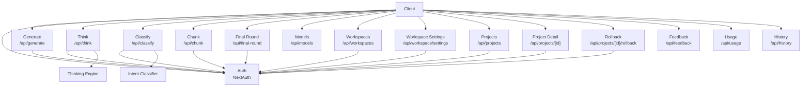

**Diagram sources**
- [route.ts:1-4](file://app/api/auth/[...nextauth]/route.ts#L1-L4)
- [route.ts:1-387](file://app/api/generate/route.ts#L1-L387)
- [route.ts:1-88](file://app/api/think/route.ts#L1-L88)
- [route.ts:1-81](file://app/api/classify/route.ts#L1-L81)
- [route.ts:1-81](file://app/api/chunk/route.ts#L1-L81)
- [route.ts:1-71](file://app/api/final-round/route.ts#L1-L71)
- [route.ts:1-457](file://app/api/models/route.ts#L1-L457)
- [route.ts:1-145](file://app/api/workspaces/route.ts#L1-L145)
- [route.ts:1-147](file://app/api/workspace/settings/route.ts#L1-L147)
- [route.ts:1-92](file://app/api/projects/route.ts#L1-L92)
- [route.ts:1-12](file://app/api/projects/[id]/route.ts#L1-L12)
- [route.ts:1-23](file://app/api/projects/[id]/rollback/route.ts#L1-L23)
- [route.ts:1-85](file://app/api/feedback/route.ts#L1-L85)
- [route.ts:1-111](file://app/api/usage/route.ts#L1-L111)
- [route.ts:1-60](file://app/api/history/route.ts#L1-L60)
- [thinkingEngine.ts:1-566](file://lib/ai/thinkingEngine.ts#L1-L566)
- [intentClassifier.ts:1-261](file://lib/ai/intentClassifier.ts#L1-L261)

## Detailed Component Analysis

### Authentication Layer
- The authentication route delegates to NextAuth handlers and exposes GET/POST for NextAuth's internal routing.
- The library configures a JWT-based session strategy, a credentials provider with bcrypt verification, and callback hooks to attach user info to the session token.

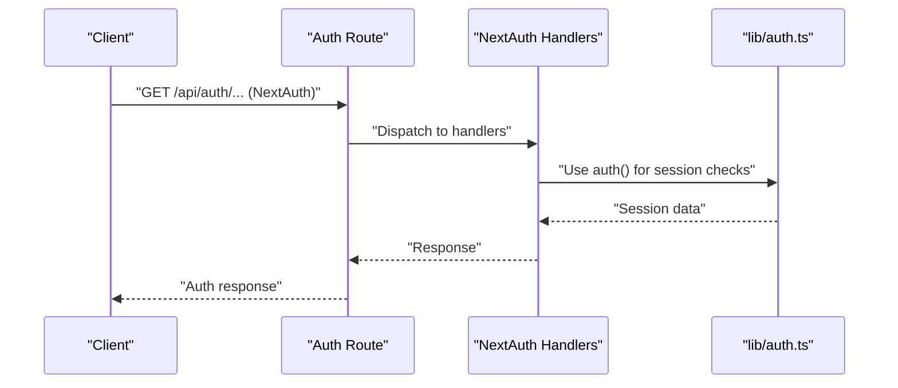

**Diagram sources**
- [route.ts:1-4](file://app/api/auth/[...nextauth]/route.ts#L1-L4)
- [auth.ts:1-87](file://lib/auth.ts#L1-L87)

**Section sources**
- [route.ts:1-4](file://app/api/auth/[...nextauth]/route.ts#L1-L4)
- [auth.ts:1-87](file://lib/auth.ts#L1-L87)

### Generation Pipeline (/api/generate)
- Purpose: End-to-end UI generation with optional streaming, validation, accessibility fixes, testing, and saving to memory.
- Key steps:
  - Parse and validate request body, including intent schema and optional prompt.
  - Enforce security by accepting only provider/model from client.
  - Stream or batch generation depending on stream flag.
  - Optional reviewer and runtime checks with timeouts and fallbacks.
  - Parallel accessibility and test generation.
  - Dependency resolution for multi-file outputs.
  - Save generation metadata asynchronously.
- Streaming: Uses a ReadableStream and createTextStreamResponse for SSE-like streaming.

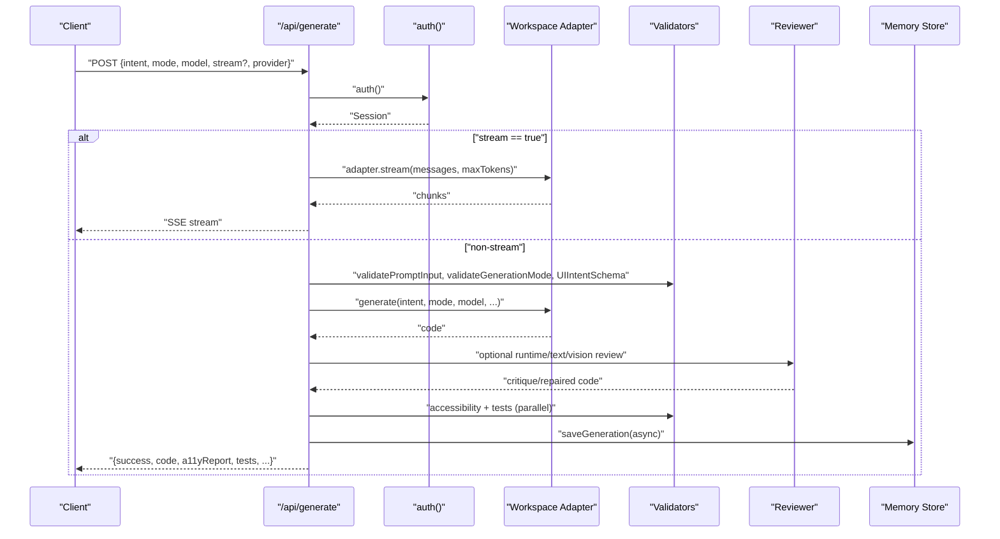

**Diagram sources**
- [route.ts:1-387](file://app/api/generate/route.ts#L1-L387)

**Section sources**
- [route.ts:1-387](file://app/api/generate/route.ts#L1-L387)

### Thinking Engine (/api/think)
- Purpose: Generate AI-driven thinking plans for user intents with intelligent fallback capabilities.
- Security: Resolves workspace/user context from session and headers; accepts only provider/model from client.
- Key features:
  - Generates structured thinking plans with expert reasoning framework
  - Provides clarification opportunities for missing requirements
  - Supports fallback plan generation when LLM calls fail
  - Returns deterministic fallback plans for guaranteed user experience
- Timeout prevention: maxDuration = 60 for Vercel deployment compatibility

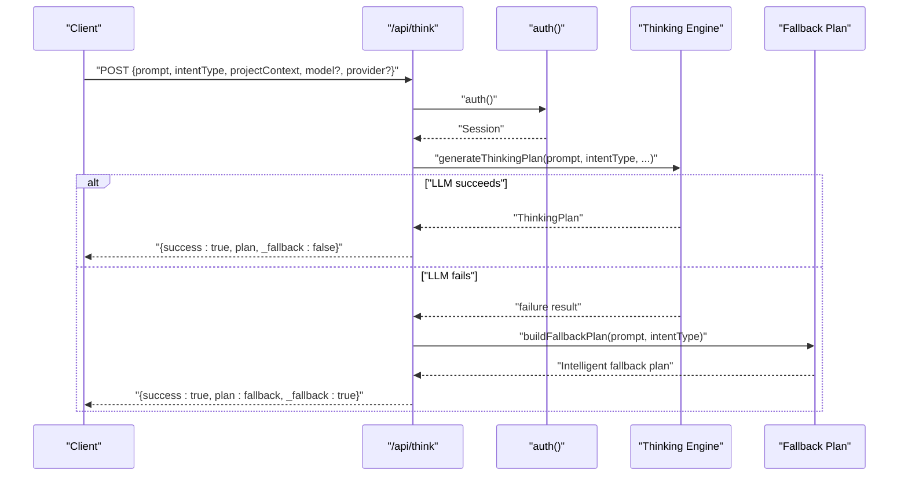

**Diagram sources**
- [route.ts:1-88](file://app/api/think/route.ts#L1-L88)
- [thinkingEngine.ts:1-566](file://lib/ai/thinkingEngine.ts#L1-L566)

**Section sources**
- [route.ts:1-88](file://app/api/think/route.ts#L1-L88)
- [thinkingEngine.ts:1-566](file://lib/ai/thinkingEngine.ts#L1-L566)

### Intent Classification (/api/classify)
- Purpose: Classify user prompts into intent categories with confidence scores and fallback capabilities.
- Security: Resolves workspace/user context from session and headers; accepts only provider/model from client.
- Key features:
  - Classifies into six intent types: ui_generation, ui_refinement, product_requirement, ideation, debug_fix, context_clarification
  - Provides confidence scores and suggested execution modes
  - Implements retry logic for rate limit handling
  - Returns local fallback classification when LLM calls fail
- Timeout prevention: maxDuration = 60 for Vercel deployment compatibility

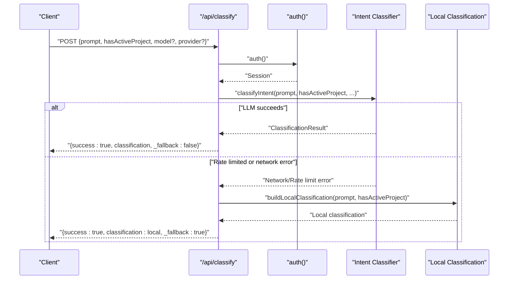

**Diagram sources**
- [route.ts:1-81](file://app/api/classify/route.ts#L1-L81)
- [intentClassifier.ts:1-261](file://lib/ai/intentClassifier.ts#L1-L261)

**Section sources**
- [route.ts:1-81](file://app/api/classify/route.ts#L1-L81)
- [intentClassifier.ts:1-261](file://lib/ai/intentClassifier.ts#L1-L261)

### Chunk Generation (/api/chunk)
- Purpose: Generate a single file chunk for a multi-file project.
- Security: Accepts only provider/model from client; resolves workspace/user context from session and headers.
- Validation: Sanitization and optional browser safety checks (with lenient warnings for non-entry files).

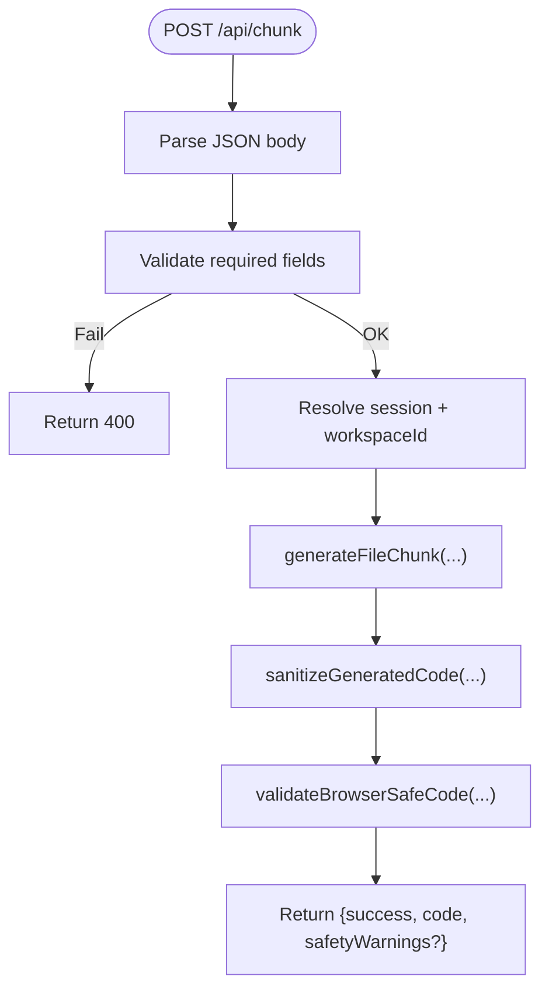

**Diagram sources**
- [route.ts:1-81](file://app/api/chunk/route.ts#L1-L81)

**Section sources**
- [route.ts:1-81](file://app/api/chunk/route.ts#L1-L81)

### Final Round Critique (/api/final-round)
- Purpose: Perform a final visual and functional critique using a screenshot and generated code.
- Security: Resolves credentials server-side; rejects client-provided API keys.
- Response: Returns structured critique results.

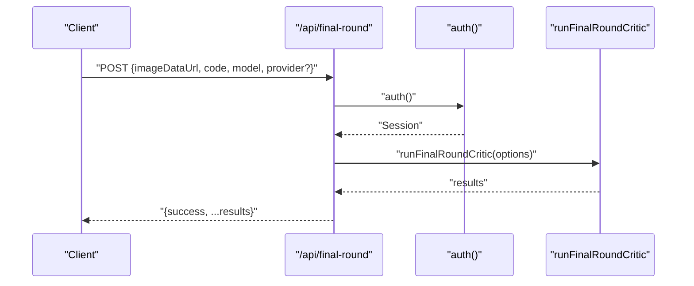

**Diagram sources**
- [route.ts:1-71](file://app/api/final-round/route.ts#L1-L71)

**Section sources**
- [route.ts:1-71](file://app/api/final-round/route.ts#L1-L71)

### Model Discovery (/api/models)
- Purpose: List available models for a given provider, with robust fallbacks and key resolution.
- Key resolution order: client-provided key, DB-stored key, environment variable fallback.
- Returns a normalized list sorted by feature flag and id.

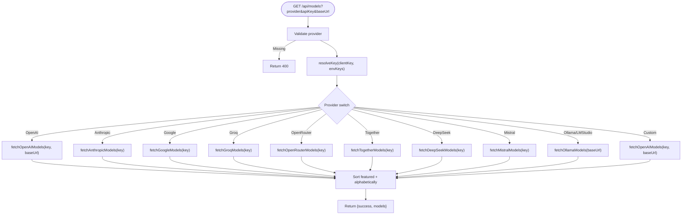

**Diagram sources**
- [route.ts:1-457](file://app/api/models/route.ts#L1-L457)

**Section sources**
- [route.ts:1-457](file://app/api/models/route.ts#L1-L457)

### Workspace and Settings (/api/workspaces, /api/workspace/settings)
- Workspaces: List, create, and delete workspaces with ownership checks and atomic creation.
- Workspace Settings: Retrieve and save provider settings, including key validation against a lightweight test call and encryption.

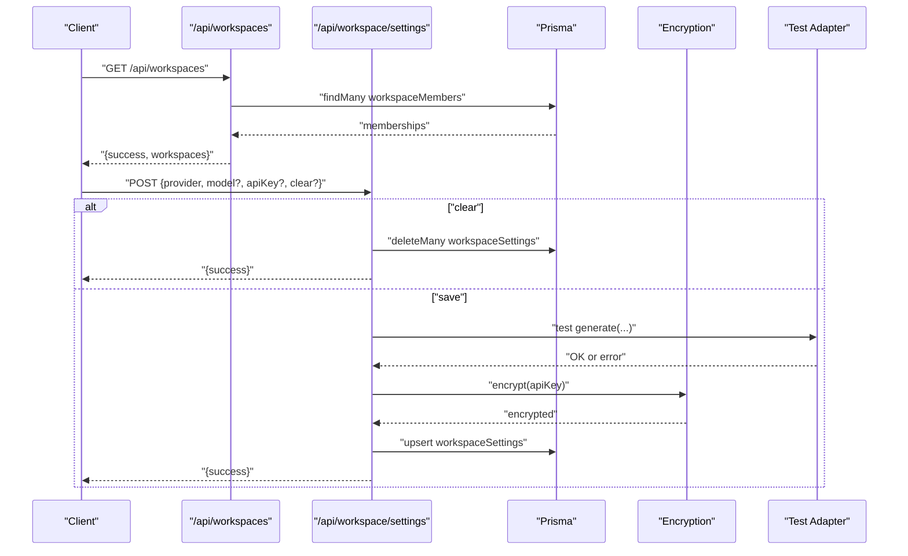

**Diagram sources**
- [route.ts:1-145](file://app/api/workspaces/route.ts#L1-L145)
- [route.ts:1-147](file://app/api/workspace/settings/route.ts#L1-L147)

**Section sources**
- [route.ts:1-145](file://app/api/workspaces/route.ts#L1-L145)
- [route.ts:1-147](file://app/api/workspace/settings/route.ts#L1-L147)

### Projects Lifecycle (/api/projects, /api/projects/[id], /api/projects/[id]/rollback)
- List projects with optional workspace filtering.
- Create new projects or upsert versions; handle edge cases by falling back to creation.
- Retrieve a single project by id.
- Roll back to a previous version with validation.

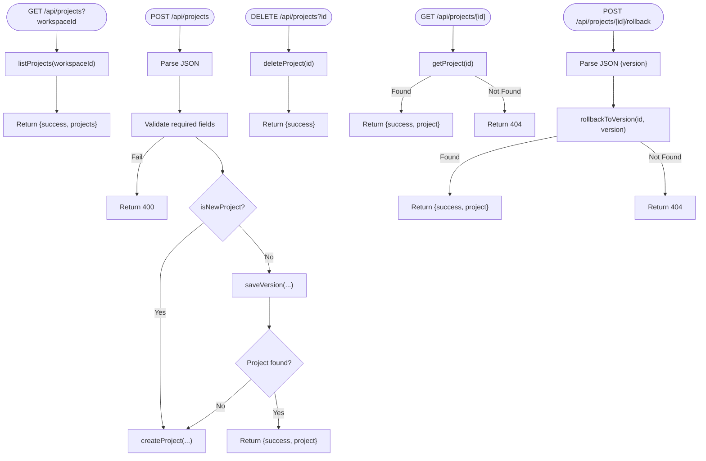

**Diagram sources**
- [route.ts:1-92](file://app/api/projects/route.ts#L1-L92)
- [route.ts:1-12](file://app/api/projects/[id]/route.ts#L1-L12)
- [route.ts:1-23](file://app/api/projects/[id]/rollback/route.ts#L1-L23)

**Section sources**
- [route.ts:1-92](file://app/api/projects/route.ts#L1-L92)
- [route.ts:1-12](file://app/api/projects/[id]/route.ts#L1-L12)
- [route.ts:1-23](file://app/api/projects/[id]/rollback/route.ts#L1-L23)

### Suggestions (/api/suggestions)
- Purpose: Generate targeted UI suggestions for a code snippet using a specialized system prompt.
- Security: Resolves adapter server-side; returns empty suggestions gracefully on configuration errors.

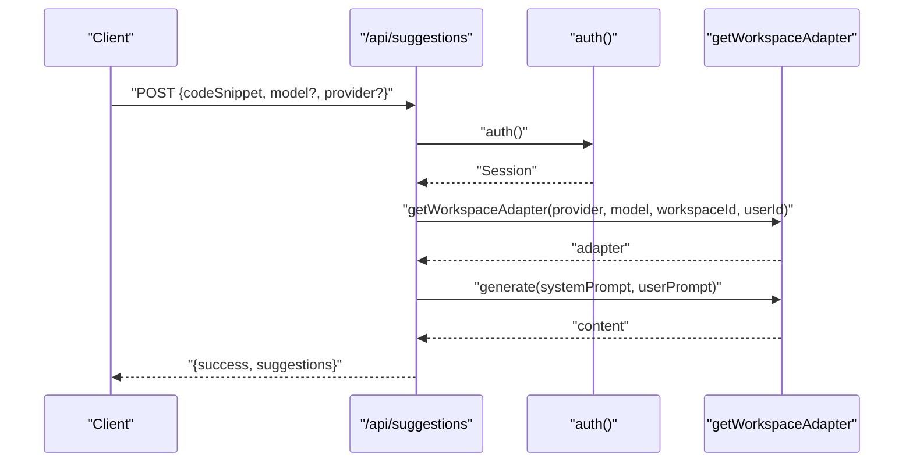

**Diagram sources**
- [route.ts:1-115](file://app/api/suggestions/route.ts#L1-L115)

**Section sources**
- [route.ts:1-115](file://app/api/suggestions/route.ts#L1-L115)

### Feedback (/api/feedback)
- Purpose: Record user feedback signals and retrieve aggregated stats for analytics.
- Validation: Strict Zod schema enforces payload structure.

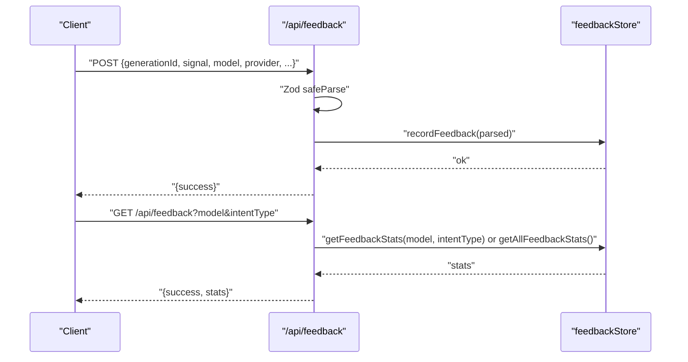

**Diagram sources**
- [route.ts:1-85](file://app/api/feedback/route.ts#L1-L85)

**Section sources**
- [route.ts:1-85](file://app/api/feedback/route.ts#L1-L85)

### Usage Statistics (/api/usage)
- Purpose: Aggregate usage logs by provider and model, with caching hints for serverless environments.
- Query: Supports workspace-scoped queries and day windows.

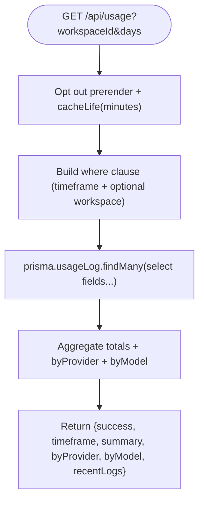

**Diagram sources**
- [route.ts:1-111](file://app/api/usage/route.ts#L1-L111)

**Section sources**
- [route.ts:1-111](file://app/api/usage/route.ts#L1-L111)

### History (/api/history)
- Purpose: Retrieve a single project by id or a summarized history list.
- Behavior: Returns lightweight summaries without code blobs for efficient consumption.

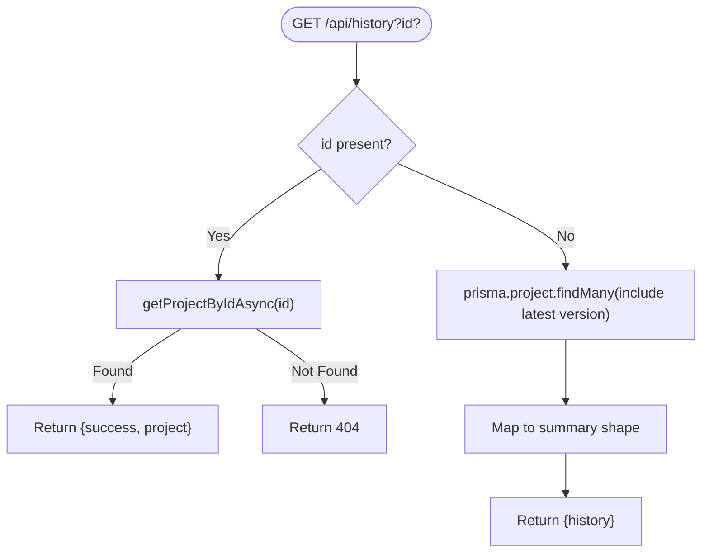

**Diagram sources**
- [route.ts:1-60](file://app/api/history/route.ts#L1-L60)

**Section sources**
- [route.ts:1-60](file://app/api/history/route.ts#L1-L60)

## Dependency Analysis
- Cohesion: Each route file encapsulates a single responsibility (e.g., generation, chunking, feedback, thinking, classification).
- Coupling: Routes depend on shared libraries for auth, validation, security, adapters, and persistence.
- External integrations: Providers (OpenAI, Anthropic, Google, Groq, OpenRouter, Together, Mistral, DeepSeek, Ollama), database via Prisma, and encryption service.
- Security: Centralized enforcement of accepting only provider/model from clients; sensitive keys are resolved server-side or stored encrypted.
- **New**: AI processing dependencies for thinking and classification engines with fallback mechanisms.

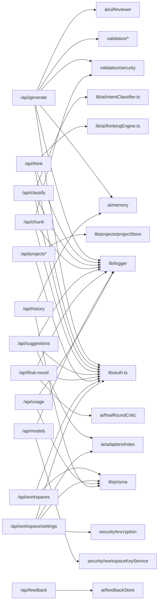

**Diagram sources**
- [route.ts:1-387](file://app/api/generate/route.ts#L1-L387)
- [route.ts:1-88](file://app/api/think/route.ts#L1-L88)
- [route.ts:1-81](file://app/api/classify/route.ts#L1-L81)
- [route.ts:1-81](file://app/api/chunk/route.ts#L1-L81)
- [route.ts:1-115](file://app/api/suggestions/route.ts#L1-L115)
- [route.ts:1-71](file://app/api/final-round/route.ts#L1-L71)
- [route.ts:1-92](file://app/api/projects/route.ts#L1-L92)
- [route.ts:1-12](file://app/api/projects/[id]/route.ts#L1-L12)
- [route.ts:1-23](file://app/api/projects/[id]/rollback/route.ts#L1-L23)
- [route.ts:1-145](file://app/api/workspaces/route.ts#L1-L145)
- [route.ts:1-147](file://app/api/workspace/settings/route.ts#L1-L147)
- [route.ts:1-457](file://app/api/models/route.ts#L1-L457)
- [route.ts:1-85](file://app/api/feedback/route.ts#L1-L85)
- [route.ts:1-111](file://app/api/usage/route.ts#L1-L111)
- [route.ts:1-60](file://app/api/history/route.ts#L1-L60)
- [auth.ts:1-87](file://lib/auth.ts#L1-L87)
- [thinkingEngine.ts:1-566](file://lib/ai/thinkingEngine.ts#L1-L566)
- [intentClassifier.ts:1-261](file://lib/ai/intentClassifier.ts#L1-L261)

**Section sources**
- [route.ts:1-387](file://app/api/generate/route.ts#L1-L387)
- [route.ts:1-88](file://app/api/think/route.ts#L1-L88)
- [route.ts:1-81](file://app/api/classify/route.ts#L1-L81)
- [route.ts:1-81](file://app/api/chunk/route.ts#L1-L81)
- [route.ts:1-115](file://app/api/suggestions/route.ts#L1-L115)
- [route.ts:1-71](file://app/api/final-round/route.ts#L1-L71)
- [route.ts:1-92](file://app/api/projects/route.ts#L1-L92)
- [route.ts:1-12](file://app/api/projects/[id]/route.ts#L1-L12)
- [route.ts:1-23](file://app/api/projects/[id]/rollback/route.ts#L1-L23)
- [route.ts:1-145](file://app/api/workspaces/route.ts#L1-L145)
- [route.ts:1-147](file://app/api/workspace/settings/route.ts#L1-L147)
- [route.ts:1-457](file://app/api/models/route.ts#L1-L457)
- [route.ts:1-85](file://app/api/feedback/route.ts#L1-L85)
- [route.ts:1-111](file://app/api/usage/route.ts#L1-L111)
- [route.ts:1-60](file://app/api/history/route.ts#L1-L60)
- [auth.ts:1-87](file://lib/auth.ts#L1-L87)
- [thinkingEngine.ts:1-566](file://lib/ai/thinkingEngine.ts#L1-L566)
- [intentClassifier.ts:1-261](file://lib/ai/intentClassifier.ts#L1-L261)

## Performance Considerations
- **New**: Thinking and classification endpoints: Both `/api/think` and `/api/classify` declare `maxDuration = 60` to ensure Vercel deployment compatibility and prevent timeout errors during AI processing.
- Streaming: Generation supports streaming with a maxDuration set to accommodate long-running adapters.
- Timeouts and budgets: Review phase is bounded by a 60-second aggregate timeout to prevent exceeding platform limits.
- Concurrency: Parallel execution of accessibility checks and test generation reduces total latency.
- Caching: Usage endpoint uses caching hints and a recent-log limit to bound payload sizes.
- Cold starts: Dedicated timeouts for external services (e.g., vision runtime) mitigate cold-start penalties.
- Duration limits: Several endpoints declare maxDuration to align with platform constraints.

**Updated** Added timeout prevention mechanisms for thinking and classification endpoints

**Section sources**
- [route.ts:8-8](file://app/api/think/route.ts#L8-L8)
- [route.ts:7-7](file://app/api/classify/route.ts#L7-L7)
- [route.ts:22-22](file://app/api/generate/route.ts#L22-L22)
- [route.ts:72-110](file://app/api/usage/route.ts#L72-L110)
- [route.ts:8-114](file://app/api/suggestions/route.ts#L8-L114)
- [route.ts:4-456](file://app/api/models/route.ts#L4-L456)

## Troubleshooting Guide
- Authentication failures: Ensure the credentials provider is properly configured with a valid bcrypt hash and that the client is sending the correct fields.
- Missing or invalid JSON: Most endpoints return 400 for malformed JSON or missing body.
- Authorization errors: Workspace endpoints require a valid session; unauthorized requests receive 401.
- Provider configuration errors: Model listing and other endpoints surface 401 for authentication failures and 403 for missing keys.
- Validation errors: Strict schema validation returns 400 with specific issue messages.
- Internal errors: Unexpected exceptions are caught and reported as 500 with generic messages; refer to logs for details.
- **New**: Thinking and classification failures: Both endpoints implement intelligent fallback mechanisms - thinking plans and classifications will succeed even if LLM calls fail, returning deterministic fallback results with `_fallback: true`.

**Updated** Added troubleshooting guidance for thinking and classification endpoint fallback behavior

**Section sources**
- [auth.ts:1-87](file://lib/auth.ts#L1-L87)
- [route.ts:29-386](file://app/api/generate/route.ts#L29-L386)
- [route.ts:12-87](file://app/api/think/route.ts#L12-L87)
- [route.ts:11-80](file://app/api/classify/route.ts#L11-L80)
- [route.ts:12-79](file://app/api/chunk/route.ts#L12-L79)
- [route.ts:22-114](file://app/api/suggestions/route.ts#L22-L114)
- [route.ts:206-455](file://app/api/models/route.ts#L206-L455)
- [route.ts:31-144](file://app/api/workspaces/route.ts#L31-L144)
- [route.ts:59-146](file://app/api/workspace/settings/route.ts#L59-L146)
- [route.ts:17-81](file://app/api/projects/route.ts#L17-L81)
- [route.ts:4-22](file://app/api/projects/[id]/rollback/route.ts#L4-L22)
- [route.ts:28-84](file://app/api/feedback/route.ts#L28-L84)
- [route.ts:72-110](file://app/api/usage/route.ts#L72-L110)
- [route.ts:5-59](file://app/api/history/route.ts#L5-L59)

## Conclusion
The API layer is organized around clear domain boundaries with consistent request/response patterns, strong security controls, and robust error handling. Authentication is centralized, and most endpoints leverage shared validation and security utilities. The generation pipeline integrates multiple stages with careful attention to performance and reliability, while workspace and project endpoints provide a cohesive developer experience. **New thinking and classification endpoints** provide AI-driven intent analysis with intelligent fallback mechanisms, ensuring reliable user experiences even under rate limiting or network constraints. Serverless deployment characteristics are respected through explicit duration limits, timeouts, and caching strategies, with special attention to Vercel deployment compatibility for AI processing endpoints.