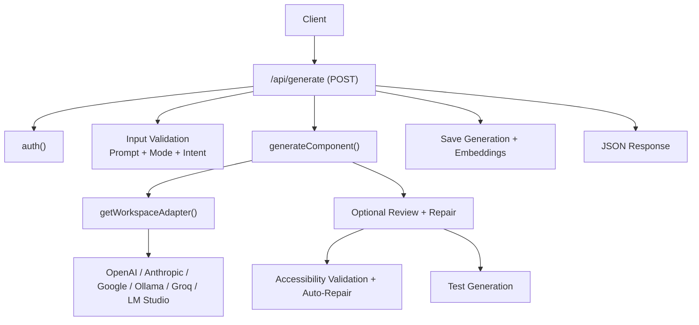
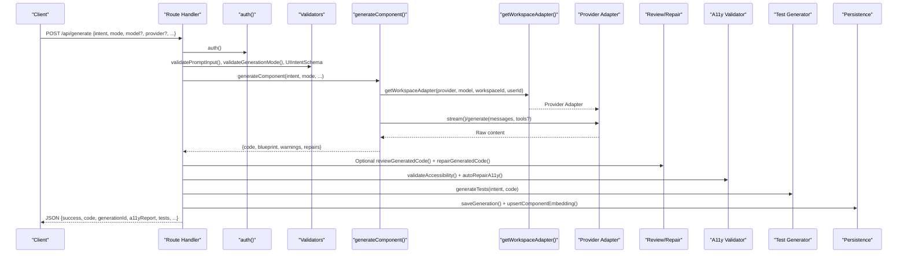
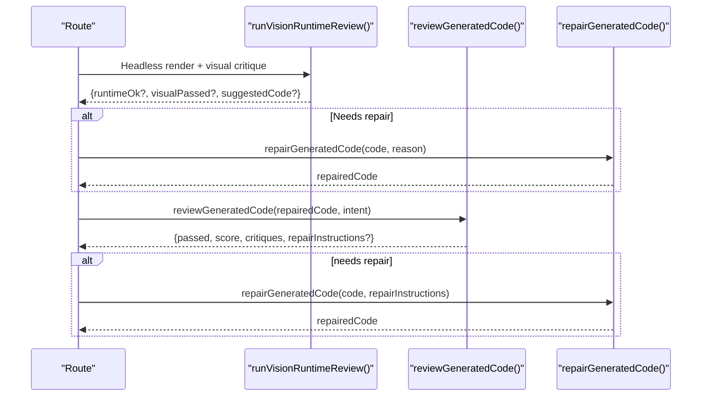
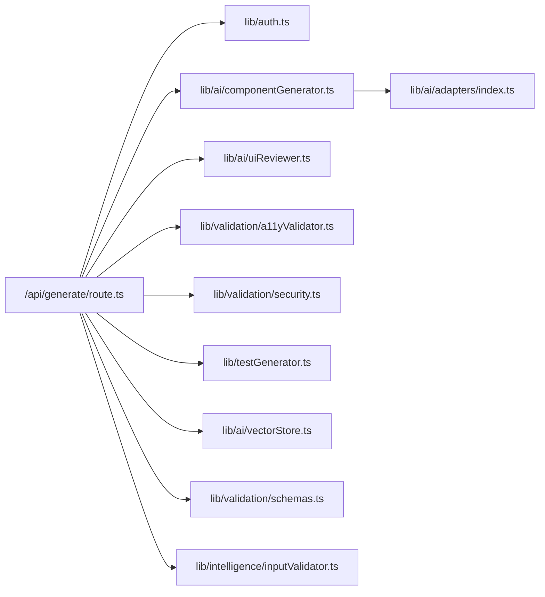

# Generation API

<cite>
**Referenced Files in This Document**
- [route.ts](file://app/api/generate/route.ts)
- [componentGenerator.ts](file://lib/ai/componentGenerator.ts)
- [schemas.ts](file://lib/validation/schemas.ts)
- [inputValidator.ts](file://lib/intelligence/inputValidator.ts)
- [a11yValidator.ts](file://lib/validation/a11yValidator.ts)
- [security.ts](file://lib/validation/security.ts)
- [uiReviewer.ts](file://lib/ai/uiReviewer.ts)
- [adapters/index.ts](file://lib/ai/adapters/index.ts)
- [vectorStore.ts](file://lib/ai/vectorStore.ts)
- [testGenerator.ts](file://lib/testGenerator.ts)
- [auth.ts](file://lib/auth.ts)
</cite>

## Table of Contents
1. [Introduction](#introduction)
2. [Project Structure](#project-structure)
3. [Core Components](#core-components)
4. [Architecture Overview](#architecture-overview)
5. [Detailed Component Analysis](#detailed-component-analysis)
6. [Dependency Analysis](#dependency-analysis)
7. [Performance Considerations](#performance-considerations)
8. [Troubleshooting Guide](#troubleshooting-guide)
9. [Conclusion](#conclusion)

## Introduction
This document describes the Generation API endpoint responsible for transforming user intent into production-ready, accessible React components or applications. It covers HTTP semantics, request/response schemas, authentication, validation, streaming, and the integrated AI generation pipeline. It also explains how the system integrates with the AI generation engine, validation systems, and optional review/repair loops.

## Project Structure
The Generation API is implemented as a Next.js route handler that orchestrates:
- Authentication and workspace context
- Request validation and normalization
- AI generation via a provider adapter
- Optional review and repair loops
- Accessibility validation and auto-repairs
- Test generation
- Persistence and embeddings

**Diagram sources**
- [route.ts:25-439](file://app/api/generate/route.ts#L25-L439)
- [componentGenerator.ts:60-391](file://lib/ai/componentGenerator.ts#L60-L391)
- [adapters/index.ts:236-278](file://lib/ai/adapters/index.ts#L236-L278)

**Section sources**
- [route.ts:25-439](file://app/api/generate/route.ts#L25-L439)

## Core Components
- Endpoint: POST /api/generate
- Authentication: JWT-based session via NextAuth
- Streaming: Optional SSE stream for raw model tokens
- Validation: Prompt, generation mode, intent schema, browser safety, deterministic code checks
- Generation: Orchestrated by generateComponent(), using provider adapters
- Review/Repair: Optional UI expert review and automated repair
- Accessibility: Static analysis and auto-repair
- Tests: RTL and Playwright scaffolding
- Persistence: Memory storage and vector embeddings

**Section sources**
- [route.ts:25-439](file://app/api/generate/route.ts#L25-L439)
- [componentGenerator.ts:60-391](file://lib/ai/componentGenerator.ts#L60-L391)
- [adapters/index.ts:236-278](file://lib/ai/adapters/index.ts#L236-L278)

## Architecture Overview
The Generation API composes multiple subsystems:
- Authentication and workspace context
- Input sanitization and schema validation
- Generation pipeline with model-aware prompting and tool loops
- Optional review loop with vision/runtime checks
- Parallelized accessibility and test generation
- Persistence and embeddings for feedback learning

**Diagram sources**
- [route.ts:25-439](file://app/api/generate/route.ts#L25-L439)
- [componentGenerator.ts:60-391](file://lib/ai/componentGenerator.ts#L60-L391)
- [uiReviewer.ts:58-126](file://lib/ai/uiReviewer.ts#L58-L126)
- [a11yValidator.ts:264-297](file://lib/validation/a11yValidator.ts#L264-L297)
- [testGenerator.ts:8-15](file://lib/testGenerator.ts#L8-L15)
- [vectorStore.ts:124-155](file://lib/ai/vectorStore.ts#L124-L155)

## Detailed Component Analysis

### HTTP Endpoint: POST /api/generate
- Method: POST
- Path: app/api/generate/route.ts
- Purpose: Generate UI components or apps from structured intent and optional prompt

Authentication
- Uses NextAuth JWT session. The route calls auth() to retrieve session and user/workspace context.
- Headers:
  - x-workspace-id (recommended) or workspaceId in body
- Behavior:
  - For streaming mode, requires model; otherwise, model is optional for non-streaming.

Request Body (JSON)
- Required
  - intent: Object conforming to UIIntentSchema
- Optional
  - mode: "component" | "app" | "depth_ui"
  - model: string (provider/model selection)
  - provider: string (e.g., openai, anthropic, google, ollama, groq, lmstudio)
  - maxTokens: number
  - isMultiSlide: boolean
  - prompt: string (optional; validated if present)
  - stream: boolean (enables SSE streaming)
  - thinkingPlan: arbitrary JSON (optional expert reasoning alignment)
  - workspaceId: string (alternative to header)

Response (JSON)
- success: boolean
- code: string or Record<string, string> (TSX code; multi-file outputs supported)
- generationId: string (UUID for correlation)
- a11yReport: Object with fields passed, score, violations, suggestions, timestamp
- critique: Optional review result (when available)
- tests: Object with rtl and playwright test code
- mode: "component" | "app" | "depth_ui"
- generatorMeta: Object with blueprint, validationWarnings, repairsApplied, feedbackEnriched

Streaming (SSE)
- When stream=true, returns a text/event-stream with incremental token deltas.
- Requires model; provider defaults to openai if omitted.
- Errors are emitted as text fragments prefixed with "[Stream Error: ...]".

Common Status Codes
- 200: Successful generation
- 400: Invalid JSON, missing required fields, validation failures
- 403: Provider not configured (no API key)
- 422: Generation result error or browser safety violation
- 500: Unexpected server error

**Section sources**
- [route.ts:25-439](file://app/api/generate/route.ts#L25-L439)
- [schemas.ts:150-168](file://lib/validation/schemas.ts#L150-L168)
- [inputValidator.ts:53-117](file://lib/intelligence/inputValidator.ts#L53-L117)
- [adapters/index.ts:236-278](file://lib/ai/adapters/index.ts#L236-L278)

### Request Validation
- Prompt validation: validatePromptInput()
  - Checks emptiness, length, low-signal patterns, and UI-related signal
  - Sanitizes input and may suggest improvements
- Generation mode validation: validateGenerationMode()
  - Accepts "component", "app", "depth_ui"
- Intent schema validation: UIIntentSchema
  - Enforces componentType, componentName, description, fields, layout, interactions, theme, and optional refinement fields

**Section sources**
- [route.ts:99-129](file://app/api/generate/route.ts#L99-L129)
- [inputValidator.ts:53-125](file://lib/intelligence/inputValidator.ts#L53-L125)
- [schemas.ts:150-168](file://lib/validation/schemas.ts#L150-L168)

### Generation Pipeline Integration
- Entry: generateComponent(intent, mode, model, maxTokens, isMultiSlide, refinementContext, ...)
- Provider resolution: getWorkspaceAdapter(providerId, modelId, workspaceId, userId)
  - Resolves credentials server-side via workspaceKeyService or environment variables
  - Supports OpenAI, Anthropic, Google, Ollama, Groq, LM Studio
- Prompt building: model-aware prompt construction with blueprint, design rules, memory, and optional feedback enrichment
- Tool loop: optional tool-calls for agentic refinement (subject to model capabilities)
- Extraction and beautification: code extraction strategies and deterministic formatting
- Deterministic validation and repair: runRepairPipeline() guided by model tier and repair strategy

**Diagram sources**
- [componentGenerator.ts:60-391](file://lib/ai/componentGenerator.ts#L60-L391)
- [adapters/index.ts:236-278](file://lib/ai/adapters/index.ts#L236-L278)

**Section sources**
- [componentGenerator.ts:60-391](file://lib/ai/componentGenerator.ts#L60-L391)
- [adapters/index.ts:236-278](file://lib/ai/adapters/index.ts#L236-L278)

### Review and Repair Loop
- Triggered only for non-local models (cloud reviewers available)
- Two phases:
  1) Vision/Runtime review: runVisionRuntimeReview() plus visual critique
  2) Text-based review: reviewGeneratedCode() with JSON schema output
- Repair: repairGeneratedCode() applies targeted fixes
- Timeout protection: 60-second aggregate budget for review phase
- Graceful fallback: failures do not block successful code delivery

**Diagram sources**
- [route.ts:242-312](file://app/api/generate/route.ts#L242-L312)
- [uiReviewer.ts:58-126](file://lib/ai/uiReviewer.ts#L58-L126)

**Section sources**
- [route.ts:242-312](file://app/api/generate/route.ts#L242-L312)
- [uiReviewer.ts:58-126](file://lib/ai/uiReviewer.ts#L58-L126)

### Accessibility Validation and Auto-Repair
- Static analysis: validateAccessibility() checks WCAG rules and computes a score
- Auto-repair: autoRepairA11y() applies common fixes (focus indicators, labels, roles)
- Parallel execution: runs alongside test generation

**Section sources**
- [a11yValidator.ts:264-297](file://lib/validation/a11yValidator.ts#L264-L297)
- [route.ts:329-352](file://app/api/generate/route.ts#L329-L352)

### Security and Browser Safety
- Browser safety validation: validateBrowserSafeCode() rejects Node/TTY APIs and invalid exports
- Code sanitizer: sanitizeGeneratedCode() flattens template literals and removes artifacts that break Sandpack/Babel
- Deterministic validation: validateGeneratedCode() runs before expensive review calls

**Section sources**
- [security.ts:6-34](file://lib/validation/security.ts#L6-L34)
- [route.ts:214-327](file://app/api/generate/route.ts#L214-L327)

### Test Generation
- generateTests() produces:
  - RTL tests (React Testing Library)
  - Playwright E2E tests
- Tests are generated in parallel with accessibility checks

**Section sources**
- [testGenerator.ts:8-15](file://lib/testGenerator.ts#L8-L15)
- [route.ts:329-352](file://app/api/generate/route.ts#L329-L352)

### Persistence and Embeddings
- Memory: saveGeneration() persists generation metadata and results
- Embeddings: upsertComponentEmbedding() stores repair patterns and feedback for reuse
- Vector search: used for retrieval-augmented generation and knowledge base queries

**Section sources**
- [route.ts:358-383](file://app/api/generate/route.ts#L358-L383)
- [vectorStore.ts:124-155](file://lib/ai/vectorStore.ts#L124-L155)

### Authentication and Authorization
- Authentication: NextAuth JWT strategy
- Authorization: auth() returns session; workspaceId derived from header/body
- Provider credentials: resolved server-side; never accept apiKey/baseUrl from client

**Section sources**
- [auth.ts:11-86](file://lib/auth.ts#L11-L86)
- [route.ts:57-180](file://app/api/generate/route.ts#L57-L180)
- [adapters/index.ts:236-278](file://lib/ai/adapters/index.ts#L236-L278)

## Dependency Analysis

**Diagram sources**
- [route.ts:1-23](file://app/api/generate/route.ts#L1-L23)
- [componentGenerator.ts:1-42](file://lib/ai/componentGenerator.ts#L1-L42)
- [adapters/index.ts:1-306](file://lib/ai/adapters/index.ts#L1-L306)
- [uiReviewer.ts:1-199](file://lib/ai/uiReviewer.ts#L1-L199)
- [a11yValidator.ts:1-376](file://lib/validation/a11yValidator.ts#L1-L376)
- [security.ts:1-129](file://lib/validation/security.ts#L1-L129)
- [testGenerator.ts:1-265](file://lib/testGenerator.ts#L1-L265)
- [vectorStore.ts:1-378](file://lib/ai/vectorStore.ts#L1-L378)
- [schemas.ts:1-340](file://lib/validation/schemas.ts#L1-L340)
- [inputValidator.ts:1-137](file://lib/intelligence/inputValidator.ts#L1-L137)

**Section sources**
- [route.ts:1-23](file://app/api/generate/route.ts#L1-L23)
- [componentGenerator.ts:1-42](file://lib/ai/componentGenerator.ts#L1-L42)

## Performance Considerations
- Streaming: Enables immediate token delivery for long generations; requires model parameter.
- Parallelization: Accessibility and test generation run concurrently with review/repair.
- Timeouts: Review phase bounded by a 60-second aggregate timeout to prevent exceeding platform limits.
- Local model handling: Review/repair skipped for local/Ollama/Groq/LM Studio to avoid extra inference costs.
- Caching: Adapter responses cached to reduce repeated calls.

[No sources needed since this section provides general guidance]

## Troubleshooting Guide
Common issues and resolutions:
- Invalid JSON or missing intent
  - Ensure the request body is valid JSON and includes intent.
  - Status: 400
- Missing model for streaming
  - Provide model when stream=true.
  - Status: 400
- Prompt validation failures
  - Improve specificity and avoid low-signal phrases.
  - Status: 400
- Generation result error
  - Indicates provider/model issues or extraction problems.
  - Status: 422
- Provider not configured
  - Configure API key in workspace settings or environment.
  - Status: 403
- Browser safety violation
  - Remove Node/TTY imports and ensure a valid React export.
  - Status: 422
- Unexpected server error
  - Check server logs for stack traces.
  - Status: 500

**Section sources**
- [route.ts:34-46](file://app/api/generate/route.ts#L34-L46)
- [route.ts:61-63](file://app/api/generate/route.ts#L61-L63)
- [route.ts:100-108](file://app/api/generate/route.ts#L100-L108)
- [route.ts:196-208](file://app/api/generate/route.ts#L196-L208)
- [route.ts:321-326](file://app/api/generate/route.ts#L321-L326)
- [route.ts:432-438](file://app/api/generate/route.ts#L432-L438)

## Conclusion
The Generation API provides a robust, validated, and secure pathway from user intent to production-ready UI code. It integrates an extensible AI generation engine, optional expert review and repair, comprehensive accessibility validation, automated testing scaffolding, and persistent knowledge capture through embeddings. Proper configuration of provider credentials and adherence to validation rules ensure reliable outcomes.