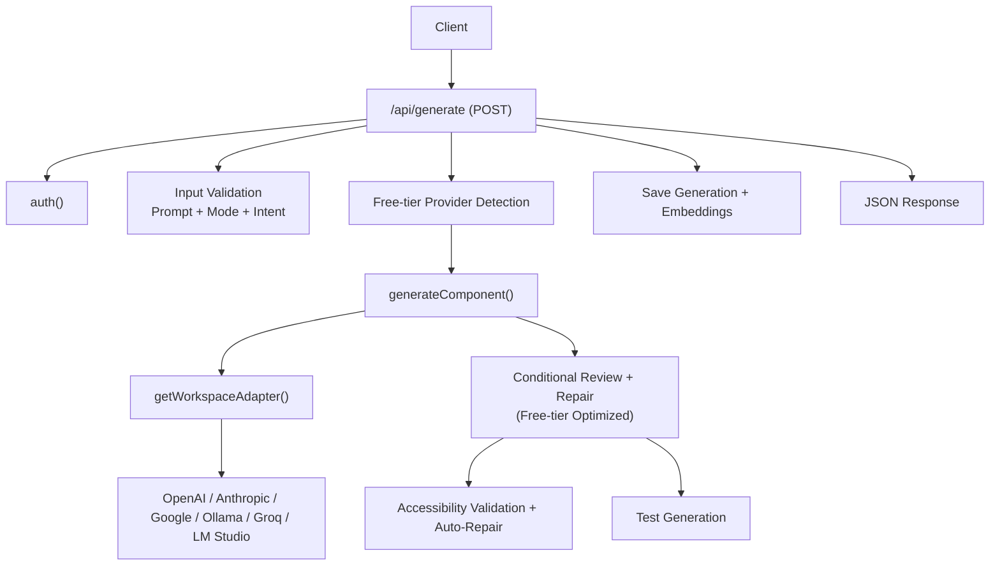
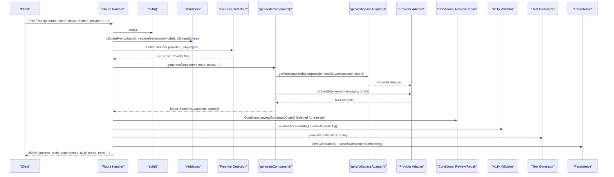
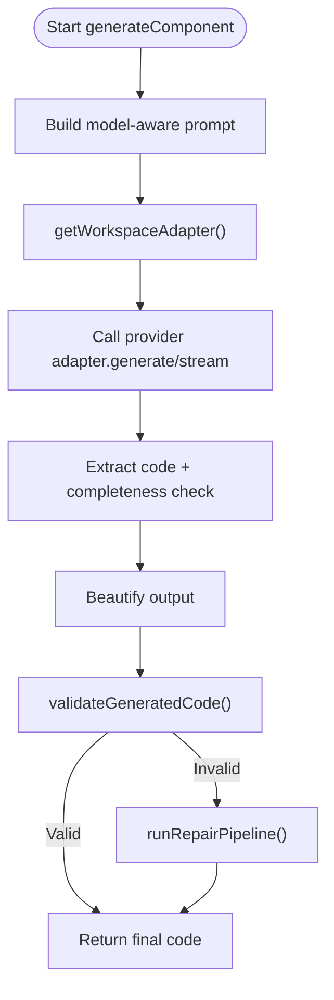
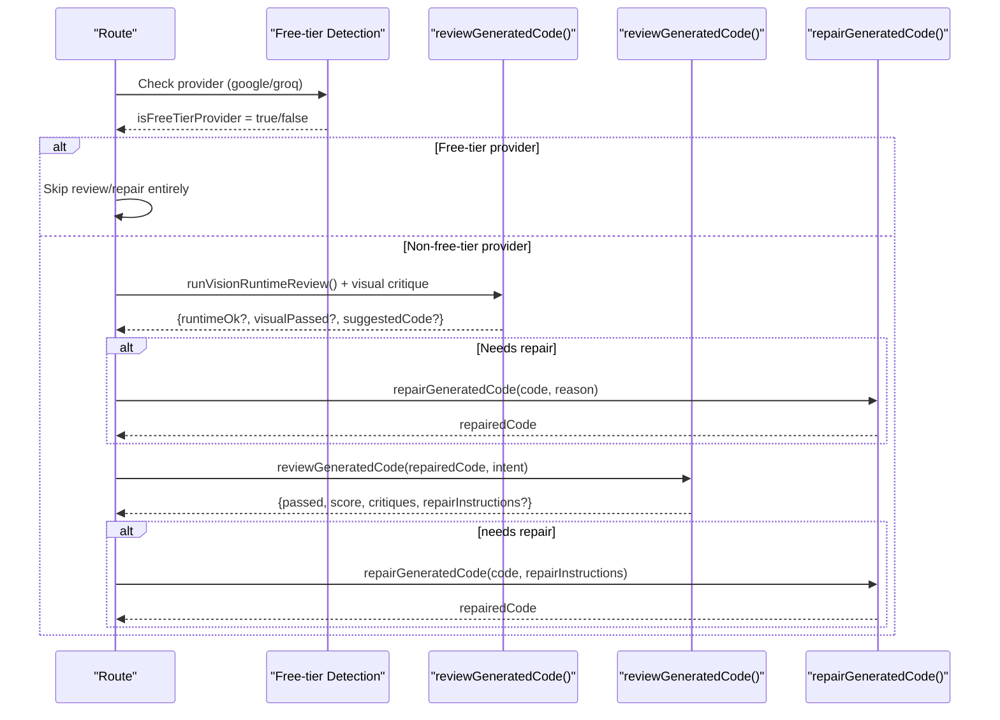
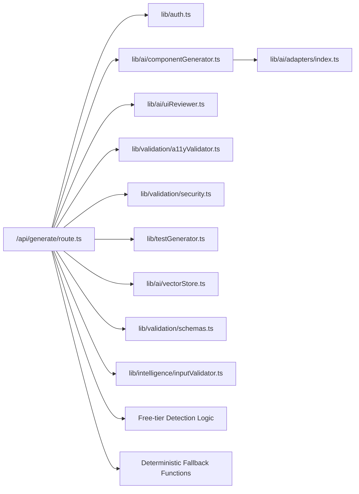

# Generation API

<cite>
**Referenced Files in This Document**
- [route.ts](file://app/api/generate/route.ts)
- [componentGenerator.ts](file://lib/ai/componentGenerator.ts)
- [schemas.ts](file://lib/validation/schemas.ts)
- [inputValidator.ts](file://lib/intelligence/inputValidator.ts)
- [a11yValidator.ts](file://lib/validation/a11yValidator.ts)
- [security.ts](file://lib/validation/security.ts)
- [uiReviewer.ts](file://lib/ai/uiReviewer.ts)
- [adapters/index.ts](file://lib/ai/adapters/index.ts)
- [vectorStore.ts](file://lib/ai/vectorStore.ts)
- [testGenerator.ts](file://lib/testGenerator.ts)
- [auth.ts](file://lib/auth.ts)
- [thinkingEngine.ts](file://lib/ai/thinkingEngine.ts)
- [think/route.ts](file://app/api/think/route.ts)
- [classify/route.ts](file://app/api/classify/route.ts)
- [parse/route.ts](file://app/api/parse/route.ts)
</cite>

## Update Summary
**Changes Made**
- Enhanced free-tier provider detection logic with conditional execution of expensive operations
- Added deterministic fallback functions for classify, think, and parse operations
- Removed browserless rendering dependencies and simplified timeout mechanisms
- Integrated comprehensive free-tier fast-path optimizations across the generation pipeline

## Table of Contents
1. [Introduction](#introduction)
2. [Project Structure](#project-structure)
3. [Core Components](#core-components)
4. [Architecture Overview](#architecture-overview)
5. [Detailed Component Analysis](#detailed-component-analysis)
6. [Dependency Analysis](#dependency-analysis)
7. [Performance Considerations](#performance-considerations)
8. [Troubleshooting Guide](#troubleshooting-guide)
9. [Conclusion](#conclusion)

## Introduction
This document describes the Generation API endpoint responsible for transforming user intent into production-ready, accessible React components or applications. It covers HTTP semantics, request/response schemas, authentication, validation, streaming, and the integrated AI generation pipeline. The system now includes enhanced free-tier provider detection logic and deterministic fallback functions to optimize performance and reduce API costs for users on constrained provider tiers.

## Project Structure
The Generation API is implemented as a Next.js route handler that orchestrates:
- Authentication and workspace context
- Request validation and normalization
- AI generation via a provider adapter
- Optional review and repair loops with free-tier optimization
- Accessibility validation and auto-repairs
- Test generation
- Persistence and embeddings



**Diagram sources**
- [route.ts:25-439](file://app/api/generate/route.ts#L25-L439)
- [componentGenerator.ts:60-391](file://lib/ai/componentGenerator.ts#L60-L391)
- [adapters/index.ts:236-278](file://lib/ai/adapters/index.ts#L236-L278)

**Section sources**
- [route.ts:25-439](file://app/api/generate/route.ts#L25-L439)

## Core Components
- Endpoint: POST /api/generate
- Authentication: JWT-based session via NextAuth
- Streaming: Optional SSE stream for raw model tokens
- Validation: Prompt, generation mode, intent schema, browser safety, deterministic code checks
- Generation: Orchestrated by generateComponent(), using provider adapters with free-tier optimization
- Review/Repair: Conditional UI expert review and automated repair with quota conservation
- Accessibility: Static analysis and auto-repair
- Tests: RTL and Playwright scaffolding
- Persistence: Memory storage and vector embeddings
- Free-tier Optimization: Deterministic fallback functions for expensive operations

**Section sources**
- [route.ts:25-439](file://app/api/generate/route.ts#L25-L439)
- [componentGenerator.ts:60-391](file://lib/ai/componentGenerator.ts#L60-L391)
- [adapters/index.ts:236-278](file://lib/ai/adapters/index.ts#L236-L278)

## Architecture Overview
The Generation API composes multiple subsystems with enhanced free-tier provider detection:
- Authentication and workspace context
- Input sanitization and schema validation
- Generation pipeline with model-aware prompting and tool loops
- Conditional review loop with vision/runtime checks (optimized for free-tier)
- Parallelized accessibility and test generation
- Persistence and embeddings for feedback learning



**Diagram sources**
- [route.ts:25-439](file://app/api/generate/route.ts#L25-L439)
- [componentGenerator.ts:60-391](file://lib/ai/componentGenerator.ts#L60-L391)
- [uiReviewer.ts:58-126](file://lib/ai/uiReviewer.ts#L58-L126)
- [a11yValidator.ts:264-297](file://lib/validation/a11yValidator.ts#L264-L297)
- [testGenerator.ts:8-15](file://lib/testGenerator.ts#L8-L15)
- [vectorStore.ts:124-155](file://lib/ai/vectorStore.ts#L124-L155)

## Detailed Component Analysis

### HTTP Endpoint: POST /api/generate
- Method: POST
- Path: app/api/generate/route.ts
- Purpose: Generate UI components or apps from structured intent and optional prompt

Authentication
- Uses NextAuth JWT session. The route calls auth() to retrieve session and user/workspace context.
- Headers:
  - x-workspace-id (recommended) or workspaceId in body
- Behavior:
  - For streaming mode, requires model; otherwise, model is optional for non-streaming.

Request Body (JSON)
- Required
  - intent: Object conforming to UIIntentSchema
- Optional
  - mode: "component" | "app" | "depth_ui"
  - model: string (provider/model selection)
  - provider: string (e.g., openai, anthropic, google, ollama, groq, lmstudio)
  - maxTokens: number
  - isMultiSlide: boolean
  - prompt: string (optional; validated if present)
  - stream: boolean (enables SSE streaming)
  - thinkingPlan: arbitrary JSON (optional expert reasoning alignment)
  - workspaceId: string (alternative to header)

Response (JSON)
- success: boolean
- code: string or Record<string, string> (TSX code; multi-file outputs supported)
- generationId: string (UUID for correlation)
- a11yReport: Object with fields passed, score, violations, suggestions, timestamp
- critique: Optional review result (when available)
- tests: Object with rtl and playwright test code
- mode: "component" | "app" | "depth_ui"
- generatorMeta: Object with blueprint, validationWarnings, repairsApplied, feedbackEnriched

Streaming (SSE)
- When stream=true, returns a text/event-stream with incremental token deltas.
- Requires model; provider defaults to openai if omitted.
- Errors are emitted as text fragments prefixed with "[Stream Error: ...]".

Common Status Codes
- 200: Successful generation
- 400: Invalid JSON, missing required fields, validation failures
- 403: Provider not configured (no API key)
- 422: Generation result error or browser safety violation
- 500: Unexpected server error

**Section sources**
- [route.ts:25-439](file://app/api/generate/route.ts#L25-L439)
- [schemas.ts:150-168](file://lib/validation/schemas.ts#L150-L168)
- [inputValidator.ts:53-117](file://lib/intelligence/inputValidator.ts#L53-L117)
- [adapters/index.ts:236-278](file://lib/ai/adapters/index.ts#L236-L278)

### Free-tier Provider Detection and Optimization
The system now includes sophisticated free-tier provider detection logic to optimize resource usage and prevent quota exhaustion:

**Free-tier Detection Logic**
- Providers considered free-tier: `google` and `groq`
- Detection occurs in three key operations:
  1. Generation endpoint: Skips expensive review/repair operations
  2. Think endpoint: Uses deterministic fallback plan builder
  3. Classify endpoint: Uses local classification function
  4. Parse endpoint: Builds local intent fallback

**Conditional Execution Strategy**
- Free-tier providers automatically skip:
  - UI expert review and repair loops
  - Browserless rendering dependencies
  - Complex timeout mechanisms
  - Additional API calls beyond generation
- This optimization preserves API quotas while maintaining functionality

**Section sources**
- [route.ts:210-259](file://app/api/generate/route.ts#L210-L259)
- [think/route.ts:45-53](file://app/api/think/route.ts#L45-L53)
- [classify/route.ts:42-50](file://app/api/classify/route.ts#L42-L50)
- [parse/route.ts:85-119](file://app/api/parse/route.ts#L85-L119)

### Deterministic Fallback Functions
Enhanced with comprehensive fallback functions for expensive operations:

**Think Endpoint Fallback**
- `buildFallbackPlan()` creates deterministic thinking plans instantly
- Uses blueprint selection and intent analysis without LLM calls
- Ensures non-blocking operation even with provider limitations

**Classify Endpoint Fallback**
- `buildLocalClassification()` performs intent classification locally
- Provides reasonable defaults for Google/Groq free-tier constraints
- Maintains user experience continuity

**Parse Endpoint Fallback**
- Creates local intent objects with sensible defaults
- Validates against appropriate schemas for different generation modes
- Enables seamless generation flow without external dependencies

**Section sources**
- [thinkingEngine.ts:118-157](file://lib/ai/thinkingEngine.ts#L118-L157)
- [think/route.ts:45-53](file://app/api/think/route.ts#L45-L53)
- [classify/route.ts:42-50](file://app/api/classify/route.ts#L42-L50)
- [parse/route.ts:85-119](file://app/api/parse/route.ts#L85-L119)

### Request Validation
- Prompt validation: validatePromptInput()
  - Checks emptiness, length, low-signal patterns, and UI-related signal
  - Sanitizes input and may suggest improvements
- Generation mode validation: validateGenerationMode()
  - Accepts "component", "app", "depth_ui"
- Intent schema validation: UIIntentSchema
  - Enforces componentType, componentName, description, fields, layout, interactions, theme, and optional refinement fields

**Section sources**
- [route.ts:99-129](file://app/api/generate/route.ts#L99-L129)
- [inputValidator.ts:53-125](file://lib/intelligence/inputValidator.ts#L53-L125)
- [schemas.ts:150-168](file://lib/validation/schemas.ts#L150-L168)

### Generation Pipeline Integration
- Entry: generateComponent(intent, mode, model, maxTokens, isMultiSlide, refinementContext, ...)
- Provider resolution: getWorkspaceAdapter(providerId, modelId, workspaceId, userId)
  - Resolves credentials server-side via workspaceKeyService or environment variables
  - Supports OpenAI, Anthropic, Google, Ollama, Groq, LM Studio
- Prompt building: model-aware prompt construction with blueprint, design rules, memory, and optional feedback enrichment
- Tool loop: optional tool-calls for agentic refinement (subject to model capabilities)
- Extraction and beautification: code extraction strategies and deterministic formatting
- Deterministic validation and repair: runRepairPipeline() guided by model tier and repair strategy



**Diagram sources**
- [componentGenerator.ts:60-391](file://lib/ai/componentGenerator.ts#L60-L391)
- [adapters/index.ts:236-278](file://lib/ai/adapters/index.ts#L236-L278)

**Section sources**
- [componentGenerator.ts:60-391](file://lib/ai/componentGenerator.ts#L60-L391)
- [adapters/index.ts:236-278](file://lib/ai/adapters/index.ts#L236-L278)

### Conditional Review and Repair Loop
- **Enhanced**: Review loop now conditionally executes based on provider tier
- **Free-tier optimization**: Automatically skipped for Google/Groq free-tier providers
- **Quota conservation**: Prevents guaranteed 429 errors for constrained providers
- **Graceful degradation**: Falls back to deterministic validation and repair

**Free-tier Detection Logic**
```typescript
const isFreeTierProvider = !process.env.REVIEW_MODEL && (
  provider === 'google' || provider === 'groq'
);
```

**Conditional Execution**
- Non-free-tier providers: Full review/repair pipeline with vision/runtime checks
- Free-tier providers: Skip review/repair entirely, rely on deterministic validation
- Timeout protection: 60-second aggregate budget for review phase (not applicable for free-tier)



**Diagram sources**
- [route.ts:210-259](file://app/api/generate/route.ts#L210-L259)
- [uiReviewer.ts:58-126](file://lib/ai/uiReviewer.ts#L58-L126)

**Section sources**
- [route.ts:210-259](file://app/api/generate/route.ts#L210-L259)
- [uiReviewer.ts:58-126](file://lib/ai/uiReviewer.ts#L58-L126)

### Accessibility Validation and Auto-Repair
- Static analysis: validateAccessibility() checks WCAG rules and computes a score
- Auto-repair: autoRepairA11y() applies common fixes (focus indicators, labels, roles)
- Parallel execution: runs alongside test generation

**Section sources**
- [a11yValidator.ts:264-297](file://lib/validation/a11yValidator.ts#L264-L297)
- [route.ts:329-352](file://app/api/generate/route.ts#L329-L352)

### Security and Browser Safety
- Browser safety validation: validateBrowserSafeCode() rejects Node/TTY APIs and invalid exports
- Code sanitizer: sanitizeGeneratedCode() flattens template literals and removes artifacts that break Sandpack/Babel
- Deterministic validation: validateGeneratedCode() runs before expensive review calls

**Section sources**
- [security.ts:6-34](file://lib/validation/security.ts#L6-L34)
- [route.ts:214-327](file://app/api/generate/route.ts#L214-L327)

### Test Generation
- generateTests() produces:
  - RTL tests (React Testing Library)
  - Playwright E2E tests
- Tests are generated in parallel with accessibility checks

**Section sources**
- [testGenerator.ts:8-15](file://lib/testGenerator.ts#L8-L15)
- [route.ts:329-352](file://app/api/generate/route.ts#L329-L352)

### Persistence and Embeddings
- Memory: saveGeneration() persists generation metadata and results
- Embeddings: upsertComponentEmbedding() stores repair patterns and feedback for reuse
- Vector search: used for retrieval-augmented generation and knowledge base queries

**Section sources**
- [route.ts:358-383](file://app/api/generate/route.ts#L358-L383)
- [vectorStore.ts:124-155](file://lib/ai/vectorStore.ts#L124-L155)

### Authentication and Authorization
- Authentication: NextAuth JWT strategy
- Authorization: auth() returns session; workspaceId derived from header/body
- Provider credentials: resolved server-side; never accept apiKey/baseUrl from client

**Section sources**
- [auth.ts:11-86](file://lib/auth.ts#L11-L86)
- [route.ts:57-180](file://app/api/generate/route.ts#L57-L180)
- [adapters/index.ts:236-278](file://lib/ai/adapters/index.ts#L236-L278)

## Dependency Analysis


**Diagram sources**
- [route.ts:1-23](file://app/api/generate/route.ts#L1-L23)
- [componentGenerator.ts:1-42](file://lib/ai/componentGenerator.ts#L1-L42)
- [adapters/index.ts:1-306](file://lib/ai/adapters/index.ts#L1-L306)
- [uiReviewer.ts:1-199](file://lib/ai/uiReviewer.ts#L1-L199)
- [a11yValidator.ts:1-376](file://lib/validation/a11yValidator.ts#L1-L376)
- [security.ts:1-129](file://lib/validation/security.ts#L1-L129)
- [testGenerator.ts:1-265](file://lib/testGenerator.ts#L1-L265)
- [vectorStore.ts:1-378](file://lib/ai/vectorStore.ts#L1-L378)
- [schemas.ts:1-340](file://lib/validation/schemas.ts#L1-L340)
- [inputValidator.ts:1-137](file://lib/intelligence/inputValidator.ts#L1-L137)

**Section sources**
- [route.ts:1-23](file://app/api/generate/route.ts#L1-L23)
- [componentGenerator.ts:1-42](file://lib/ai/componentGenerator.ts#L1-L42)

## Performance Considerations
- **Enhanced Free-tier Optimization**: Automatic detection and optimization for Google/Groq free-tier providers
- **Deterministic Fallbacks**: Instant fallback functions eliminate expensive LLM calls for think/classify/parse operations
- **Conditional Review**: Review/repair loops skipped for free-tier providers to conserve API quotas
- **Streaming**: Enables immediate token delivery for long generations; requires model parameter.
- **Parallelization**: Accessibility and test generation run concurrently with review/repair.
- **Local Model Handling**: Review/repair skipped for local/Ollama/Groq/LM Studio to avoid extra inference costs.
- **Caching**: Adapter responses cached to reduce repeated calls.

## Troubleshooting Guide
Common issues and resolutions:
- Invalid JSON or missing intent
  - Ensure the request body is valid JSON and includes intent.
  - Status: 400
- Missing model for streaming
  - Provide model when stream=true.
  - Status: 400
- Prompt validation failures
  - Improve specificity and avoid low-signal phrases.
  - Status: 400
- Generation result error
  - Indicates provider/model issues or extraction problems.
  - Status: 422
- Provider not configured
  - Configure API key in workspace settings or environment.
  - Status: 403
- Browser safety violation
  - Remove Node/TTY imports and ensure a valid React export.
  - Status: 422
- **Free-tier quota conservation**
  - Free-tier providers automatically skip expensive operations to prevent 429 errors.
  - Expected behavior: Faster response times with reduced functionality for constrained providers.
  - Status: 200 (successful generation)
- Unexpected server error
  - Check server logs for stack traces.
  - Status: 500

**Section sources**
- [route.ts:34-46](file://app/api/generate/route.ts#L34-L46)
- [route.ts:61-63](file://app/api/generate/route.ts#L61-L63)
- [route.ts:100-108](file://app/api/generate/route.ts#L100-L108)
- [route.ts:196-208](file://app/api/generate/route.ts#L196-L208)
- [route.ts:321-326](file://app/api/generate/route.ts#L321-L326)
- [route.ts:432-438](file://app/api/generate/route.ts#L432-L438)

## Conclusion
The Generation API provides a robust, validated, and secure pathway from user intent to production-ready UI code with enhanced free-tier provider optimization. The system now includes sophisticated free-tier detection logic that automatically optimizes resource usage, deterministic fallback functions that eliminate expensive LLM calls, and conditional execution of expensive operations. This ensures reliable outcomes for all provider tiers while maximizing efficiency and preventing quota exhaustion for constrained users. The integration of an extensible AI generation engine, optional expert review and repair, comprehensive accessibility validation, automated testing scaffolding, and persistent knowledge capture through embeddings makes it a comprehensive solution for modern UI development workflows.