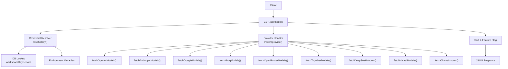
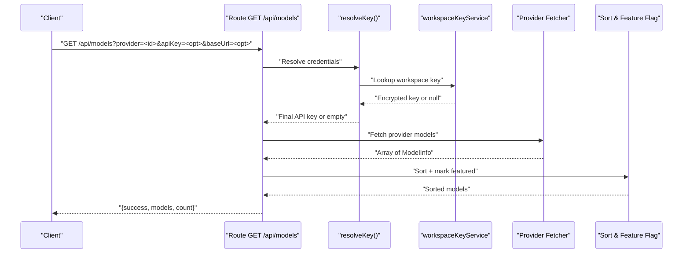
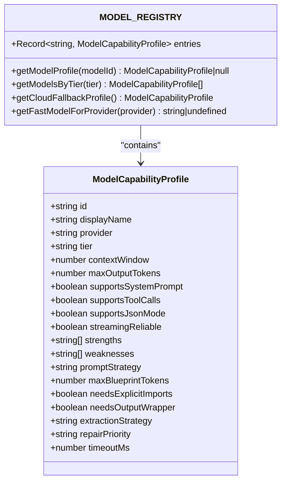
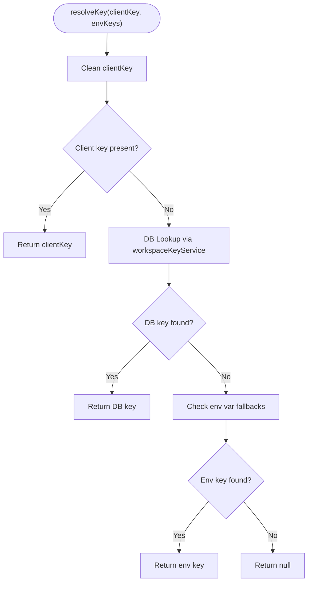
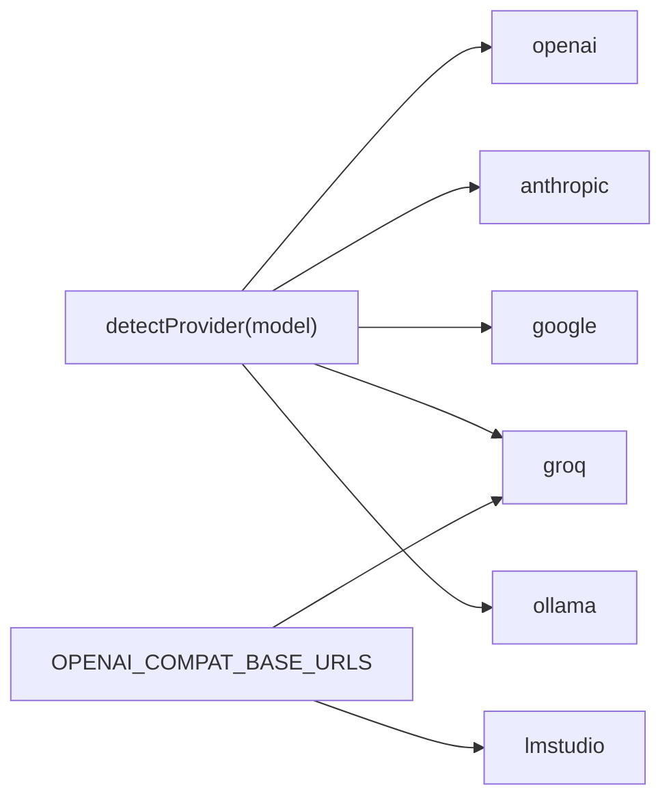
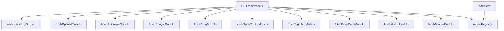

# Models API

<cite>
**Referenced Files in This Document**
- [route.ts](file://app/api/models/route.ts)
- [modelRegistry.ts](file://lib/ai/modelRegistry.ts)
- [workspaceKeyService.ts](file://lib/security/workspaceKeyService.ts)
- [adapters/index.ts](file://lib/ai/adapters/index.ts)
- [types.ts](file://lib/ai/types.ts)
- [ProviderSelector.tsx](file://components/ProviderSelector.tsx)
- [AIEngineConfigPanel.tsx](file://components/AIEngineConfigPanel.tsx)
- [ENV_SETUP.md](file://docs/ENV_SETUP.md)
</cite>

## Table of Contents
1. [Introduction](#introduction)
2. [Project Structure](#project-structure)
3. [Core Components](#core-components)
4. [Architecture Overview](#architecture-overview)
5. [Detailed Component Analysis](#detailed-component-analysis)
6. [Dependency Analysis](#dependency-analysis)
7. [Performance Considerations](#performance-considerations)
8. [Troubleshooting Guide](#troubleshooting-guide)
9. [Conclusion](#conclusion)

## Introduction
This document describes the Models API endpoint that lists available AI models across multiple providers and local engines. It covers the HTTP GET method, query parameters, response format, provider-specific behaviors, model capability metadata, and integration with the model registry and credential resolution system.

## Project Structure
The Models API is implemented as a Next.js route handler under the app router. It integrates with:
- Provider-specific model fetchers
- Credential resolution (client-provided, stored in DB, or environment variables)
- Static fallbacks for providers without live listings
- Sorting and feature-flagging logic
- The model capability registry for downstream pipeline decisions

**Diagram sources**
- [route.ts:206-456](file://app/api/models/route.ts#L206-L456)
- [workspaceKeyService.ts:32-67](file://lib/security/workspaceKeyService.ts#L32-L67)

**Section sources**
- [route.ts:1-457](file://app/api/models/route.ts#L1-L457)

## Core Components
- Endpoint: GET /api/models
- Query parameters:
  - provider (required): One of the supported provider IDs
  - apiKey (optional): Client-supplied API key (masked in storage)
  - baseUrl (optional): Base URL for custom/OpenAI-compatible providers
- Response shape:
  - success: boolean
  - models: array of ModelInfo
  - count: number
- ModelInfo fields:
  - id: string (provider model identifier)
  - name: string (human-friendly display name)
  - description?: string
  - contextWindow?: number
  - isFeatured?: boolean

Behavior highlights:
- Provider-specific model fetching with timeouts
- Static fallback lists when live listing is unavailable
- Sorting: featured models first, then alphabetically by id
- Authentication errors surfaced distinctly (401) for client UX

**Section sources**
- [route.ts:8-14](file://app/api/models/route.ts#L8-L14)
- [route.ts:206-456](file://app/api/models/route.ts#L206-L456)

## Architecture Overview
The route handler orchestrates provider-specific fetchers and applies a unified response format. It resolves credentials through a prioritized strategy and falls back to static lists when providers are unavailable.

**Diagram sources**
- [route.ts:206-456](file://app/api/models/route.ts#L206-L456)
- [workspaceKeyService.ts:32-67](file://lib/security/workspaceKeyService.ts#L32-L67)

## Detailed Component Analysis

### HTTP GET /api/models
- Purpose: Return a list of available models for a given provider, with capability hints and feature flags.
- Required query parameter:
  - provider: lowercase provider identifier (e.g., openai, anthropic, google, groq, openrouter, together, deepseek, mistral, meta, qwen, gemma, ollama, lmstudio)
- Optional query parameters:
  - apiKey: client-supplied key (masked in storage)
  - baseUrl: base URL for custom/OpenAI-compatible providers
- Response:
  - success: boolean
  - models: ModelInfo[]
  - count: number
- Error handling:
  - Missing provider: 400 with error message
  - Authentication failure: 401 with authError flag and cleaned message
  - Other failures: 400 with error message

Credential resolution order:
1. Use client-provided apiKey if present and valid
2. Lookup workspace-stored key via DB (encrypted)
3. Fallback to environment variable for the provider
4. If none available, return static fallback list for that provider

Sorting:
- Featured models first (provider-specific list)
- Then sorted by id alphabetically

**Section sources**
- [route.ts:206-456](file://app/api/models/route.ts#L206-L456)

### Provider-Specific Fetchers
- OpenAI: Filters chat models, sorts by creation date, marks featured models
- Anthropic: Uses x-api-key header and anthropic-version
- Google: Uses API key query param; includes inputTokenLimit as contextWindow
- Groq: Returns 401 with a specific message for invalid/expired keys
- OpenRouter: Returns combined multi-provider catalog
- Together: Filters by type='chat' and supports both array and data-wrapped responses
- DeepSeek: Minimal profile with isFeatured
- Mistral: Basic profile with isFeatured
- Ollama: Attempts /api/tags; falls back to curated local models if offline

Timeouts:
- All remote fetchers use AbortSignal.timeout to prevent slow responses

**Section sources**
- [route.ts:18-202](file://app/api/models/route.ts#L18-L202)

### Model Capability Metadata Integration
While the models endpoint returns a minimal ModelInfo shape, the broader system maintains a comprehensive model capability registry. This registry defines:
- Capability tiers (tiny, small, medium, large, cloud)
- Prompt strategies, extraction strategies, and repair priorities
- Context windows, output caps, and streaming reliability
- Provider-specific quirks and fallbacks

The registry is consulted by adapters and pipeline logic to optimize generation behavior per model.

**Diagram sources**
- [modelRegistry.ts:69-128](file://lib/ai/modelRegistry.ts#L69-L128)
- [modelRegistry.ts:132-1031](file://lib/ai/modelRegistry.ts#L132-L1031)
- [modelRegistry.ts:1046-1137](file://lib/ai/modelRegistry.ts#L1046-L1137)

**Section sources**
- [modelRegistry.ts:1-1138](file://lib/ai/modelRegistry.ts#L1-L1138)

### Credential Resolution and Storage
The route’s resolveKey function implements a strict hierarchy:
1. Client-provided apiKey (masked indicators ignored)
2. Workspace-stored encrypted key via DB lookup
3. Environment variable fallbacks

Workspace keys are cached in-process with a TTL and require workspace membership verification when a userId is provided.

**Diagram sources**
- [route.ts:220-229](file://app/api/models/route.ts#L220-L229)
- [workspaceKeyService.ts:32-67](file://lib/security/workspaceKeyService.ts#L32-L67)

**Section sources**
- [route.ts:220-229](file://app/api/models/route.ts#L220-L229)
- [workspaceKeyService.ts:1-67](file://lib/security/workspaceKeyService.ts#L1-L67)

### Adapter Integration and Provider Detection
The adapter system determines provider from either explicit configuration or model name heuristics. It also manages OpenAI-compatible base URLs and local adapters.

**Diagram sources**
- [adapters/index.ts:56-64](file://lib/ai/adapters/index.ts#L56-L64)
- [adapters/index.ts:45-48](file://lib/ai/adapters/index.ts#L45-L48)

**Section sources**
- [adapters/index.ts:1-306](file://lib/ai/adapters/index.ts#L1-L306)

### UI Integration and Configuration Options
- ProviderSelector and AIEngineConfigPanel define provider metadata, environment variable keys, and model suggestions used across the UI.
- Environment variables required for production deployment are documented in ENV_SETUP.md.

**Section sources**
- [ProviderSelector.tsx:87-93](file://components/ProviderSelector.tsx#L87-L93)
- [AIEngineConfigPanel.tsx:29-59](file://components/AIEngineConfigPanel.tsx#L29-L59)
- [ENV_SETUP.md:44-89](file://docs/ENV_SETUP.md#L44-L89)

## Dependency Analysis
- Route depends on:
  - workspaceKeyService for secure credential resolution
  - Provider-specific fetchers for live model catalogs
  - Static fallback lists for resilience
- Adapters depend on:
  - Environment variables and DB-stored keys
  - Model capability registry for runtime behavior tuning

**Diagram sources**
- [route.ts:18-202](file://app/api/models/route.ts#L18-L202)
- [modelRegistry.ts:1046-1137](file://lib/ai/modelRegistry.ts#L1046-L1137)
- [adapters/index.ts:146-215](file://lib/ai/adapters/index.ts#L146-L215)

**Section sources**
- [route.ts:18-202](file://app/api/models/route.ts#L18-L202)
- [modelRegistry.ts:1046-1137](file://lib/ai/modelRegistry.ts#L1046-L1137)
- [adapters/index.ts:146-215](file://lib/ai/adapters/index.ts#L146-L215)

## Performance Considerations
- Timeout strategy: Remote fetchers use AbortSignal.timeout to bound latency.
- Fast listing: maxDuration is set to 15 seconds for the route.
- Sorting cost: O(n log n) due to sorting by feature flag and id.
- Caching: workspaceKeyService caches decrypted keys per workspace/provider with TTL to reduce DB lookups.

Recommendations:
- Prefer static fallbacks for providers that are frequently offline.
- Use baseUrl for custom providers to avoid extra DNS and routing overhead.
- Monitor provider quotas and consider rate-limiting in clients.

**Section sources**
- [route.ts:4](file://app/api/models/route.ts#L4)
- [route.ts:20-22](file://app/api/models/route.ts#L20-L22)
- [route.ts:182-184](file://app/api/models/route.ts#L182-L184)
- [workspaceKeyService.ts:12-24](file://lib/security/workspaceKeyService.ts#L12-L24)

## Troubleshooting Guide
Common issues and resolutions:
- Missing provider parameter: Ensure provider is included in the query string.
- Authentication failure (401): Verify the API key is valid and not expired. For Groq, the endpoint returns a specific AUTH_INVALID message.
- Provider offline or unreachable: The route falls back to static lists for known providers; for custom providers, ensure baseUrl is correct.
- Local models unavailable: Ollama fetcher attempts /api/tags and falls back to curated local models if localhost is unreachable.

Operational tips:
- Check environment variables in Vercel dashboard for production deployments.
- Confirm workspace membership when using DB-stored keys.
- Validate provider-specific API keys in the AI Engine Config panel.

**Section sources**
- [route.ts:212-214](file://app/api/models/route.ts#L212-L214)
- [route.ts:89](file://app/api/models/route.ts#L89)
- [route.ts:192-202](file://app/api/models/route.ts#L192-L202)
- [ENV_SETUP.md:44-89](file://docs/ENV_SETUP.md#L44-L89)
- [workspaceKeyService.ts:37-46](file://lib/security/workspaceKeyService.ts#L37-L46)

## Conclusion
The Models API provides a unified, resilient way to discover available models across providers and local engines. It integrates securely with credential resolution, offers predictable sorting and feature flags, and gracefully degrades to static lists when providers are unavailable. The model capability registry further enables optimized generation behavior downstream.