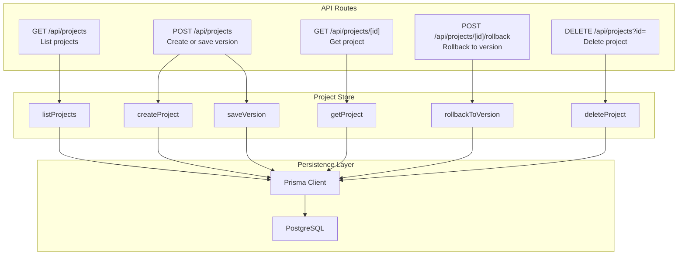
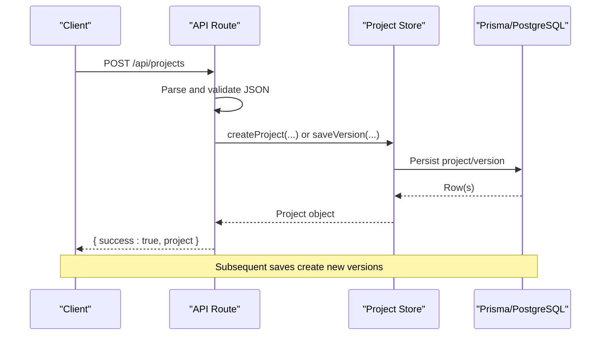
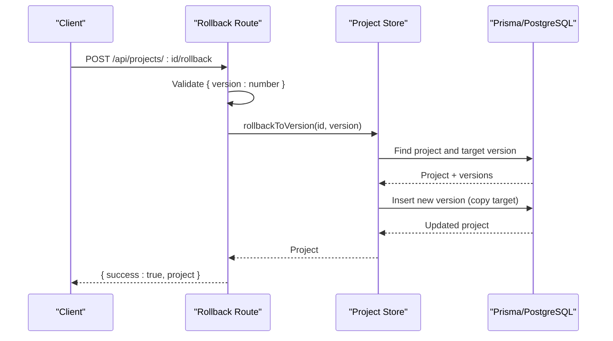
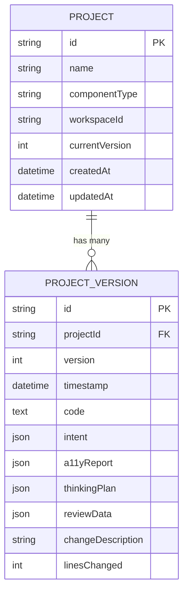
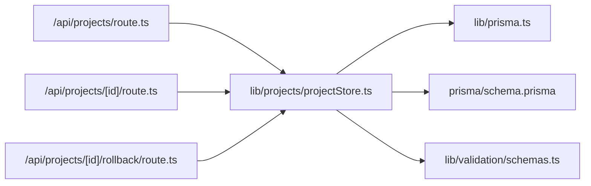

# Project API

<cite>
**Referenced Files in This Document**
- [route.ts](file://app/api/projects/route.ts)
- [route.ts](file://app/api/projects/[id]/route.ts)
- [route.ts](file://app/api/projects/[id]/rollback/route.ts)
- [projectStore.ts](file://lib/projects/projectStore.ts)
- [schemas.ts](file://lib/validation/schemas.ts)
- [prisma.ts](file://lib/prisma.ts)
- [schema.prisma](file://prisma/schema.prisma)
- [ProjectManager.tsx](file://components/ProjectManager.tsx)
- [ProjectWorkspace.tsx](file://components/ProjectWorkspace.tsx)
- [VersionTimeline.tsx](file://components/VersionTimeline.tsx)
</cite>

## Update Summary
**Changes Made**
- Updated multi-file project line counting calculations in project store
- Enhanced linesChanged computation for improved version synchronization
- Added proper handling of multi-file project structures in version control
- Updated examples to reflect enhanced multi-file project support

## Table of Contents
1. [Introduction](#introduction)
2. [Project Structure](#project-structure)
3. [Core Components](#core-components)
4. [Architecture Overview](#architecture-overview)
5. [Detailed Component Analysis](#detailed-component-analysis)
6. [Dependency Analysis](#dependency-analysis)
7. [Performance Considerations](#performance-considerations)
8. [Troubleshooting Guide](#troubleshooting-guide)
9. [Conclusion](#conclusion)

## Introduction
This document provides comprehensive API documentation for project management endpoints. It covers project CRUD operations, version control, and collaboration features. It explains project persistence, history tracking, and rollback functionality, and includes examples of project creation, modification, and retrieval operations.

## Project Structure
The project management API is organized under the Next.js App Router at `/app/api/projects`. The routes delegate to a centralized project store that persists data using Prisma with PostgreSQL.

**Diagram sources**
- [route.ts:7-14](file://app/api/projects/route.ts#L7-L14)
- [route.ts:16-82](file://app/api/projects/route.ts#L16-L82)
- [route.ts:4-11](file://app/api/projects/[id]/route.ts#L4-L11)
- [route.ts:4-22](file://app/api/projects/[id]/rollback/route.ts#L4-L22)
- [projectStore.ts:222-245](file://lib/projects/projectStore.ts#L222-L245)
- [projectStore.ts:105-160](file://lib/projects/projectStore.ts#L105-L160)
- [projectStore.ts:162-208](file://lib/projects/projectStore.ts#L162-L208)
- [projectStore.ts:210-220](file://lib/projects/projectStore.ts#L210-L220)
- [projectStore.ts:247-281](file://lib/projects/projectStore.ts#L247-L281)
- [projectStore.ts:283-290](file://lib/projects/projectStore.ts#L283-L290)
- [prisma.ts:20-27](file://lib/prisma.ts#L20-L27)

**Section sources**
- [route.ts:1-92](file://app/api/projects/route.ts#L1-L92)
- [route.ts:1-12](file://app/api/projects/[id]/route.ts#L1-L12)
- [route.ts:1-23](file://app/api/projects/[id]/rollback/route.ts#L1-L23)
- [projectStore.ts:1-294](file://lib/projects/projectStore.ts#L1-L294)
- [prisma.ts:1-70](file://lib/prisma.ts#L1-L70)

## Core Components
- API Routes: Define HTTP endpoints for project operations.
- Project Store: Implements CRUD and versioning logic using Prisma.
- Validation Schemas: Define the shape of intent, accessibility reports, and related data.
- Persistence Layer: Prisma client with automatic reconnection for transient Neon errors.
- Database Schema: Defines Project and ProjectVersion entities with relations.

Key responsibilities:
- Project CRUD: Create, list, retrieve, and delete projects.
- Version Control: Save new versions and compute line changes.
- Collaboration: Projects can be associated with workspaces; listing supports filtering by workspace.
- History Tracking: Full version history with timestamps and descriptions.
- Rollback: Create a new version that mirrors a previous one.
- Multi-file Support: Enhanced support for multi-file project structures with accurate line counting.

**Updated** Enhanced multi-file project support with improved line counting calculations across all file types.

**Section sources**
- [route.ts:7-14](file://app/api/projects/route.ts#L7-L14)
- [route.ts:16-82](file://app/api/projects/route.ts#L16-L82)
- [route.ts:4-11](file://app/api/projects/[id]/route.ts#L4-L11)
- [route.ts:4-22](file://app/api/projects/[id]/rollback/route.ts#L4-L22)
- [projectStore.ts:105-160](file://lib/projects/projectStore.ts#L105-L160)
- [projectStore.ts:162-208](file://lib/projects/projectStore.ts#L162-L208)
- [projectStore.ts:210-220](file://lib/projects/projectStore.ts#L210-L220)
- [projectStore.ts:222-245](file://lib/projects/projectStore.ts#L222-L245)
- [projectStore.ts:247-281](file://lib/projects/projectStore.ts#L247-L281)
- [projectStore.ts:283-290](file://lib/projects/projectStore.ts#L283-L290)
- [prisma.ts:20-70](file://lib/prisma.ts#L20-L70)
- [schema.prisma:158-187](file://prisma/schema.prisma#L158-L187)

## Architecture Overview
The API follows a layered architecture:
- HTTP layer: Next.js route handlers convert requests to domain operations.
- Domain layer: Project store encapsulates business logic and data transformations.
- Persistence layer: Prisma client manages database operations with reconnection logic.
- Data contracts: Zod schemas define request/response shapes.

**Diagram sources**
- [route.ts:16-82](file://app/api/projects/route.ts#L16-L82)
- [projectStore.ts:105-160](file://lib/projects/projectStore.ts#L105-L160)
- [projectStore.ts:162-208](file://lib/projects/projectStore.ts#L162-L208)
- [prisma.ts:20-27](file://lib/prisma.ts#L20-L27)

## Detailed Component Analysis

### Project CRUD Endpoints

#### List Projects
- Method: GET
- Path: /api/projects
- Query parameters:
  - workspaceId: Optional string to filter projects by workspace
- Response: { success: boolean, projects: ProjectSummary[] }
- Behavior:
  - Lists projects ordered by last updated, with latest version and version count included

**Section sources**
- [route.ts:7-14](file://app/api/projects/route.ts#L7-L14)
- [projectStore.ts:222-245](file://lib/projects/projectStore.ts#L222-L245)

#### Create or Save Version
- Method: POST
- Path: /api/projects
- Request body fields:
  - id: string (required)
  - name: string (optional)
  - componentType: 'component' | 'app' | 'depth_ui' (optional)
  - code: string | Record<string, string> (required)
  - intent: UIIntent (required)
  - a11yReport: A11yReport (required)
  - changeDescription: string (optional, defaults to 'Refinement')
  - isNewProject: boolean (optional)
  - thinkingPlan: unknown (optional)
  - reviewData: unknown (optional)
  - workspaceId: string (optional)
- Behavior:
  - If isNewProject is true: createProject with enhanced multi-file line counting
  - Else: saveVersion; if project not found, fallback to createProject
- Response: { success: boolean, project: Project }

**Updated** Enhanced line counting for multi-file projects during creation and improved version synchronization.

Validation highlights:
- Required fields: id, code, intent
- Code can be a single string or a file-map object; stored as JSON when applicable
- Multi-file projects: Lines are calculated across all files using `Object.values(code).reduce()`

**Section sources**
- [route.ts:16-82](file://app/api/projects/route.ts#L16-L82)
- [projectStore.ts:105-160](file://lib/projects/projectStore.ts#L105-L160)
- [projectStore.ts:162-208](file://lib/projects/projectStore.ts#L162-L208)
- [schemas.ts:148-168](file://lib/validation/schemas.ts#L148-L168)
- [schemas.ts:312-318](file://lib/validation/schemas.ts#L312-L318)

#### Get Project
- Method: GET
- Path: /api/projects/[id]
- Path parameter: id (required)
- Response: { success: boolean, project: Project } or 404 if not found

**Section sources**
- [route.ts:4-11](file://app/api/projects/[id]/route.ts#L4-L11)
- [projectStore.ts:210-220](file://lib/projects/projectStore.ts#L210-L220)

#### Delete Project
- Method: DELETE
- Path: /api/projects
- Query parameter: id (required)
- Response: { success: boolean }

**Section sources**
- [route.ts:84-91](file://app/api/projects/route.ts#L84-L91)
- [projectStore.ts:283-290](file://lib/projects/projectStore.ts#L283-L290)

### Version Control Endpoints

#### Rollback to Version
- Method: POST
- Path: /api/projects/[id]/rollback
- Path parameter: id (required)
- Request body:
  - version: number (required)
- Behavior:
  - Creates a new version copying the selected version's code/intent/a11yReport
  - Sets changeDescription to indicate rollback
  - Sets linesChanged to 0 for rollback operations
- Response: { success: boolean, project: Project } or 404 if not found

**Diagram sources**
- [route.ts:4-22](file://app/api/projects/[id]/rollback/route.ts#L4-L22)
- [projectStore.ts:247-281](file://lib/projects/projectStore.ts#L247-L281)

**Section sources**
- [route.ts:4-22](file://app/api/projects/[id]/rollback/route.ts#L4-L22)
- [projectStore.ts:247-281](file://lib/projects/projectStore.ts#L247-L281)

### Data Models and Validation

**Diagram sources**
- [schema.prisma:158-187](file://prisma/schema.prisma#L158-L187)

Validation schemas define:
- UIIntent: component/app/depth_ui intent with fields, layout, interactions, themes, and refinement metadata
- A11yReport: accessibility report with score, violations, suggestions, and timestamp

**Section sources**
- [schema.prisma:158-187](file://prisma/schema.prisma#L158-L187)
- [schemas.ts:148-168](file://lib/validation/schemas.ts#L148-L168)
- [schemas.ts:312-318](file://lib/validation/schemas.ts#L312-L318)

### Collaboration Features
- Workspace association: Projects can be linked to a workspace via workspaceId during creation.
- Listing by workspace: The list endpoint supports filtering by workspaceId.
- UI integration: ProjectManager and ProjectWorkspace components consume the API to render project lists and manage versions.

**Section sources**
- [projectStore.ts:105-160](file://lib/projects/projectStore.ts#L105-L160)
- [projectStore.ts:222-245](file://lib/projects/projectStore.ts#L222-L245)
- [ProjectManager.tsx:31-42](file://components/ProjectManager.tsx#L31-L42)
- [ProjectWorkspace.tsx:111-133](file://components/ProjectWorkspace.tsx#L111-L133)

### Enhanced Multi-file Project Support

**Updated** The project store now provides comprehensive support for multi-file projects with accurate line counting and improved version synchronization.

#### Multi-file Line Counting
The system now properly calculates linesChanged for both single file and multi-file projects:

- **Single File Projects**: Lines are calculated using `code.split('\n').length`
- **Multi-file Projects**: Lines are calculated using `Object.values(code).reduce((total, fileContent) => total + fileContent.split('\n').length, 0)`

#### Improved Version Synchronization
The saveVersion function now correctly handles multi-file projects by:
- Properly parsing the previous version's code structure
- Calculating accurate line differences across all files
- Maintaining consistent version numbering

**Section sources**
- [projectStore.ts:105-160](file://lib/projects/projectStore.ts#L105-L160)
- [projectStore.ts:162-208](file://lib/projects/projectStore.ts#L162-L208)

### Examples

#### Example: Create a New Multi-file Project
- Endpoint: POST /api/projects
- Body fields:
  - id: unique project identifier
  - name: human-readable project name
  - componentType: 'component' | 'app' | 'depth_ui'
  - code: file-map object with multiple files
  - intent: UIIntent object
  - a11yReport: A11yReport object
  - isNewProject: true
  - workspaceId: optional workspace identifier

Response:
- { success: true, project: Project }

**Updated** Enhanced multi-file support with accurate line counting across all project files.

Notes:
- Code can be a file-map object where keys are filenames and values are file contents
- LinesChanged is calculated across all files in the project structure
- If isNewProject is omitted or false, the endpoint attempts to save a new version; if the project does not exist, it falls back to creating the project.

**Section sources**
- [route.ts:16-82](file://app/api/projects/route.ts#L16-L82)
- [projectStore.ts:105-160](file://lib/projects/projectStore.ts#L105-L160)

#### Example: Save a New Version with Multi-file Changes
- Endpoint: POST /api/projects
- Body fields:
  - id: existing project identifier
  - code: updated code (can be single file or multi-file)
  - intent: updated intent
  - a11yReport: updated accessibility report
  - changeDescription: description of changes
  - isNewProject: false or omitted

Response:
- { success: true, project: Project }

**Updated** Improved version synchronization with accurate line counting for multi-file projects.

Behavior:
- Computes linesChanged based on difference between previous and new code lengths across all files
- Handles both single file and multi-file project structures
- Increments currentVersion and appends a new version record

**Section sources**
- [route.ts:16-82](file://app/api/projects/route.ts#L16-L82)
- [projectStore.ts:162-208](file://lib/projects/projectStore.ts#L162-L208)

#### Example: Retrieve a Project
- Endpoint: GET /api/projects/[id]
- Path parameter: id

Response:
- { success: true, project: Project }

**Section sources**
- [route.ts:4-11](file://app/api/projects/[id]/route.ts#L4-L11)
- [projectStore.ts:210-220](file://lib/projects/projectStore.ts#L210-L220)

#### Example: Rollback to a Previous Version
- Endpoint: POST /api/projects/[id]/rollback
- Path parameter: id
- Body: { version: number }

Response:
- { success: true, project: Project }

Behavior:
- Creates a new version copying the selected version's data
- Updates currentVersion and sets changeDescription indicating rollback
- Sets linesChanged to 0 for rollback operations

**Section sources**
- [route.ts:4-22](file://app/api/projects/[id]/rollback/route.ts#L4-L22)
- [projectStore.ts:247-281](file://lib/projects/projectStore.ts#L247-L281)

## Dependency Analysis
The API depends on:
- Next.js App Router for routing
- Project store for business logic
- Prisma client for database operations
- Zod schemas for validation

**Diagram sources**
- [route.ts:1-4](file://app/api/projects/route.ts#L1-L4)
- [route.ts:1-2](file://app/api/projects/[id]/route.ts#L1-L2)
- [route.ts:1-2](file://app/api/projects/[id]/rollback/route.ts#L1-L2)
- [projectStore.ts:1-3](file://lib/projects/projectStore.ts#L1-L3)
- [prisma.ts:1-1](file://lib/prisma.ts#L1-L1)
- [schema.prisma:1-9](file://prisma/schema.prisma#L1-L9)

**Section sources**
- [route.ts:1-4](file://app/api/projects/route.ts#L1-L4)
- [route.ts:1-2](file://app/api/projects/[id]/route.ts#L1-L2)
- [route.ts:1-2](file://app/api/projects/[id]/rollback/route.ts#L1-L2)
- [projectStore.ts:1-3](file://lib/projects/projectStore.ts#L1-L3)
- [prisma.ts:1-1](file://lib/prisma.ts#L1-L1)
- [schema.prisma:1-9](file://prisma/schema.prisma#L1-L9)

## Performance Considerations
- Database connection pooling: Prisma client is a singleton to avoid exhausting connections; includes automatic reconnection for transient Neon errors.
- Query optimization: Listing projects fetches latest version and counts efficiently; rollback inserts a new version without scanning entire history.
- Payload sizes: Code can be stored as JSON for multi-file projects; consider compression or streaming for very large payloads.
- Caching: Not implemented; consider adding cache headers or CDN for read-heavy scenarios.
- Multi-file optimization: Enhanced line counting algorithm efficiently processes multi-file structures without performance degradation.

**Updated** Enhanced performance considerations for multi-file project processing with optimized line counting algorithms.

**Section sources**
- [prisma.ts:20-70](file://lib/prisma.ts#L20-L70)
- [projectStore.ts:222-245](file://lib/projects/projectStore.ts#L222-L245)
- [projectStore.ts:247-281](file://lib/projects/projectStore.ts#L247-L281)

## Troubleshooting Guide
Common issues and resolutions:
- Missing required fields in POST /api/projects:
  - Ensure id, code, and intent are provided; otherwise respond with 400 and error message
- Invalid JSON:
  - API routes return 400 for malformed JSON
- Project not found:
  - GET /api/projects/[id] returns 404; DELETE returns success=false; rollback returns 404 if project/version missing
- Database migration pending:
  - Project store handles missing table gracefully by returning an in-memory stub for UI; full functionality requires applying migrations
- Transient database errors:
  - Prisma wrapper retries on transient Neon errors; if persistent, check connection settings and logs
- Multi-file project issues:
  - Ensure code is provided as a proper file-map object with string filenames as keys
  - Verify that all file contents are valid strings for accurate line counting

**Updated** Added troubleshooting guidance for multi-file project issues and enhanced line counting problems.

**Section sources**
- [route.ts:16-82](file://app/api/projects/route.ts#L16-L82)
- [route.ts:7-10](file://app/api/projects/[id]/route.ts#L7-L10)
- [route.ts:12-19](file://app/api/projects/[id]/rollback/route.ts#L12-L19)
- [projectStore.ts:6-8](file://lib/projects/projectStore.ts#L6-L8)
- [projectStore.ts:142-159](file://lib/projects/projectStore.ts#L142-L159)
- [prisma.ts:36-69](file://lib/prisma.ts#L36-L69)

## Conclusion
The project management API provides robust CRUD and versioning capabilities backed by a relational schema. It supports collaboration via workspace associations, tracks full history, and enables safe rollbacks. The enhanced multi-file project support ensures accurate line counting across complex project structures, while improved version synchronization maintains data integrity. The design leverages Prisma for reliability and Zod for strong typing, ensuring predictable behavior across client integrations.

**Updated** Enhanced conclusion reflecting improved multi-file project support and version synchronization capabilities.