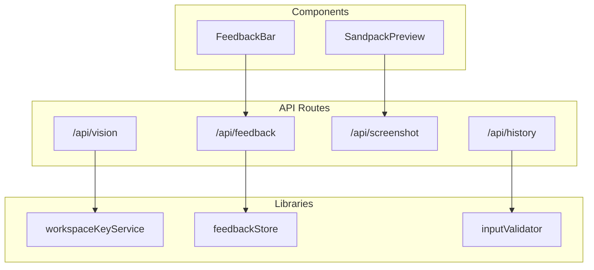
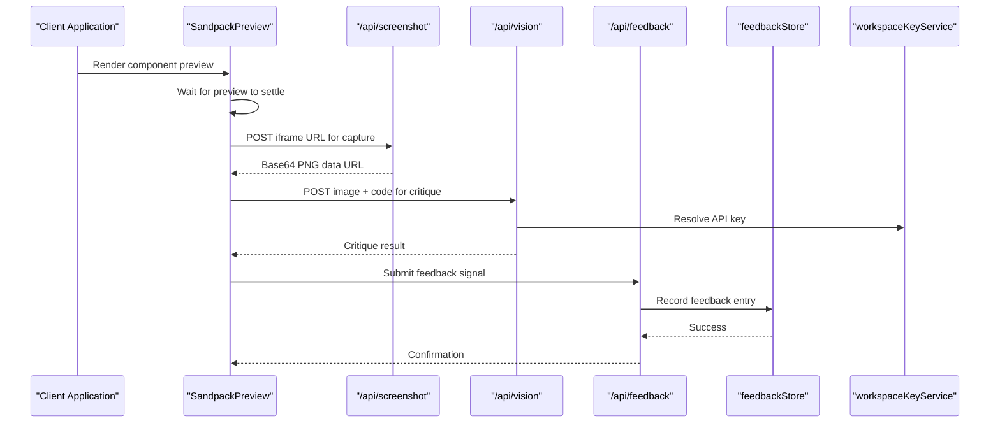
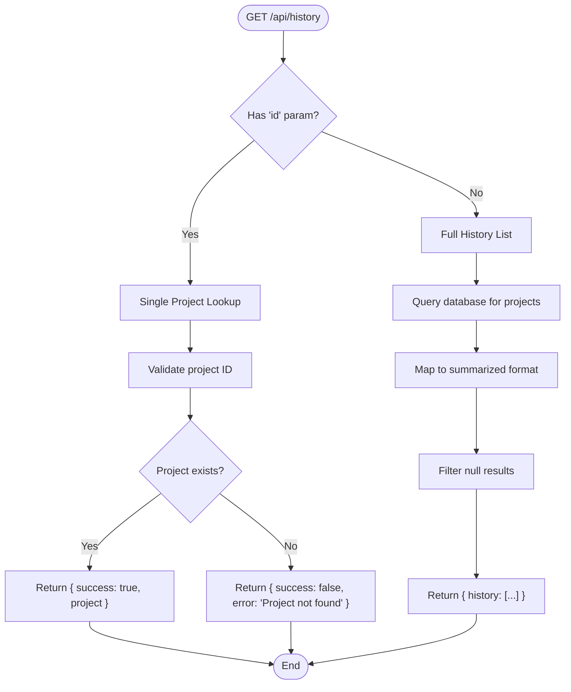
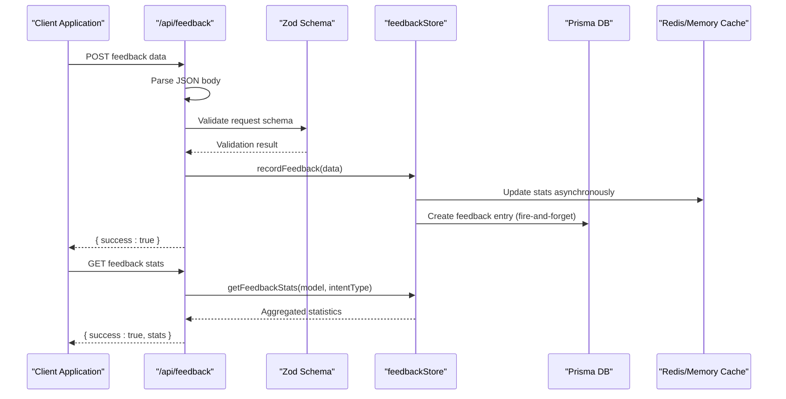
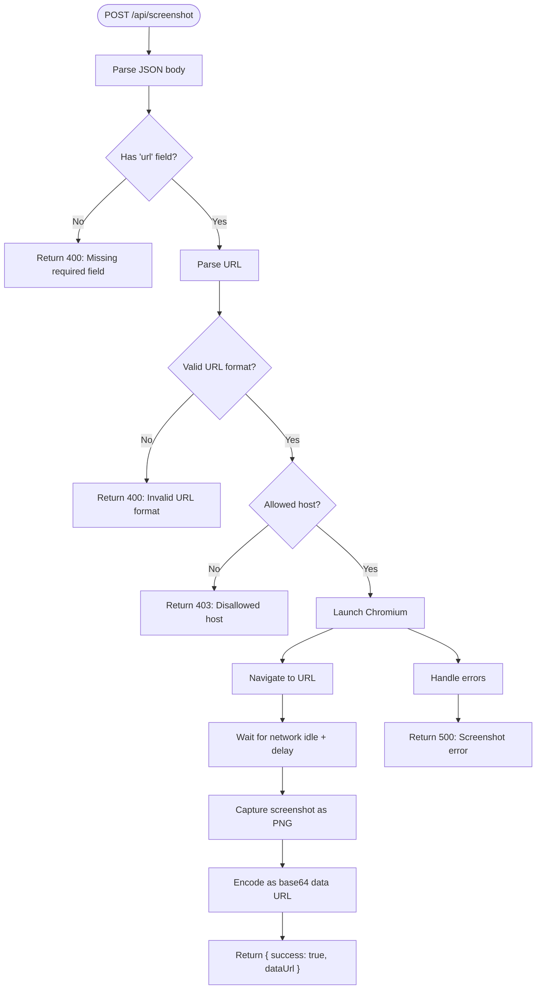
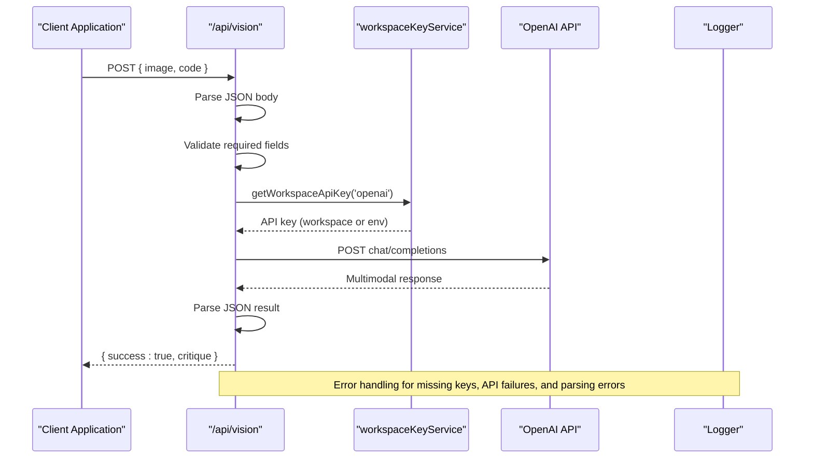
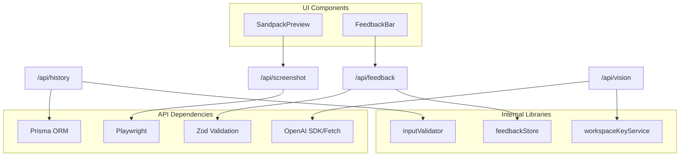

# Utility APIs

<cite>
**Referenced Files in This Document**
- [history route](file://app/api/history/route.ts)
- [feedback route](file://app/api/feedback/route.ts)
- [screenshot route](file://app/api/screenshot/route.ts)
- [vision route](file://app/api/vision/route.ts)
- [workspace key service](file://lib/security/workspaceKeyService.ts)
- [feedback store](file://lib/ai/feedbackStore.ts)
- [sandpack preview](file://components/SandpackPreview.tsx)
- [feedback bar](file://components/FeedbackBar.tsx)
- [input validator](file://lib/intelligence/inputValidator.ts)
</cite>

## Table of Contents
1. [Introduction](#introduction)
2. [Project Structure](#project-structure)
3. [Core Components](#core-components)
4. [Architecture Overview](#architecture-overview)
5. [Detailed Component Analysis](#detailed-component-analysis)
6. [Dependency Analysis](#dependency-analysis)
7. [Performance Considerations](#performance-considerations)
8. [Troubleshooting Guide](#troubleshooting-guide)
9. [Conclusion](#conclusion)

## Introduction
This document provides comprehensive API documentation for the utility endpoints that power the AI-powered accessibility-first UI engine. The focus areas include:
- History endpoint: retrieving project generation history and summaries
- Feedback endpoint: collecting user feedback signals and metrics
- Screenshot endpoint: capturing server-side screenshots of preview frames
- Vision endpoint: performing visual UI critiques using multimodal models

These endpoints integrate with validation systems, preview functionality, and user feedback collection to provide a cohesive development experience for generating and refining UI components.

## Project Structure
The utility APIs are implemented as Next.js App Router API routes under the `/app/api` directory. Each endpoint encapsulates specific functionality:
- History: database-backed project history retrieval
- Feedback: user feedback collection with validation and persistence
- Screenshot: server-side screenshot capture using Playwright
- Vision: visual critique using OpenAI multimodal models

**Diagram sources**
- [history route:1-60](file://app/api/history/route.ts#L1-L60)
- [feedback route:1-85](file://app/api/feedback/route.ts#L1-L85)
- [screenshot route:1-137](file://app/api/screenshot/route.ts#L1-L137)
- [vision route:1-145](file://app/api/vision/route.ts#L1-L145)
- [workspace key service:1-138](file://lib/security/workspaceKeyService.ts#L1-L138)
- [feedback store:1-356](file://lib/ai/feedbackStore.ts#L1-L356)
- [sandpack preview:1-287](file://components/SandpackPreview.tsx#L1-L287)
- [feedback bar:1-227](file://components/FeedbackBar.tsx#L1-L227)
- [input validator:1-137](file://lib/intelligence/inputValidator.ts#L1-L137)

**Section sources**
- [history route:1-60](file://app/api/history/route.ts#L1-L60)
- [feedback route:1-85](file://app/api/feedback/route.ts#L1-L85)
- [screenshot route:1-137](file://app/api/screenshot/route.ts#L1-L137)
- [vision route:1-145](file://app/api/vision/route.ts#L1-L145)

## Core Components
This section documents each utility endpoint with its purpose, request/response formats, validation, and integration points.

### History Endpoint
Purpose: Retrieve project generation history with optional single-project lookup.

- Method: GET
- Path: `/api/history`
- Query Parameters:
  - `id`: Optional project identifier for single project retrieval

Response Formats:
- Success (single project): `{ success: true, project: Project }`
- Success (history list): `{ history: HistoryItem[] }`
- Error (project not found): `{ success: false, error: string }`
- Error (database failure): `{ history: [] }`

History Item Fields:
- `id`: Project identifier
- `timestamp`: ISO string of latest version creation
- `componentType`: Component type from project metadata
- `componentName`: Project name
- `promptSnippet`: First 60 characters of intent description (truncated if longer)

Integration Notes:
- Uses project retrieval by ID for single project lookup
- Returns summarized history for the frontend's previous history.json consumption format
- Limits results to 200 entries with latest version ordering

**Section sources**
- [history route:5-59](file://app/api/history/route.ts#L5-L59)

### Feedback Endpoint
Purpose: Collect user feedback signals and provide aggregated statistics.

- Method: POST
- Path: `/api/feedback`
- Request Body (validated):
  - `generationId`: Non-empty string identifying the generation
  - `signal`: Enum value from ['thumbs_up', 'thumbs_down', 'corrected', 'discarded']
  - `model`: Provider model identifier
  - `provider`: Provider name
  - `intentType`: Intent category (e.g., 'dashboard', 'landing_page')
  - `promptHash`: First 16 hex characters of SHA-256 hash of prompt
  - `a11yScore`: Integer accessibility score (0-100, default 0)
  - `critiqueScore`: Integer aesthetic score (0-100, default 0)
  - `latencyMs`: Integer latency in milliseconds (default 0)
  - `workspaceId`: Optional workspace identifier
  - `correctionNote`: Optional correction note (max 2000 characters)
  - `correctedCode`: Optional corrected code (max 200000 characters)

Response Formats:
- Success: `{ success: true }`
- Error (invalid JSON): `{ success: false, error: string }`
- Error (validation failure): `{ success: false, error: string }`
- Error (internal): `{ success: false, error: string }`

- Method: GET
- Path: `/api/feedback`
- Query Parameters:
  - `model`: Optional model filter
  - `intentType`: Optional intent type filter

Response Formats:
- Success (filtered): `{ success: true, stats: FeedbackStats }`
- Success (all stats): `{ success: true, stats: Record<string, FeedbackStats> }`
- Error: `{ success: false, error: string }`

Feedback Statistics Fields:
- `model`: Provider model identifier
- `intentType`: Intent category
- `thumbsUp`: Count of positive signals
- `thumbsDown`: Count of negative signals
- `corrected`: Count of corrections
- `discarded`: Count of discards
- `total`: Total feedback count
- `successRate`: Ratio of positive signals to total
- `avgA11yScore`: Average accessibility score
- `avgCritiqueScore`: Average aesthetic score
- `avgLatencyMs`: Average latency in milliseconds
- `lastUpdated`: ISO timestamp of last update

Integration Notes:
- Uses Zod schema validation for request body
- Records feedback asynchronously with dual-write strategy (DB + stats cache)
- Provides aggregated statistics for metrics display
- Quality-gated embedding for corrected code entries

**Section sources**
- [feedback route:11-84](file://app/api/feedback/route.ts#L11-L84)
- [feedback store:23-56](file://lib/ai/feedbackStore.ts#L23-L56)
- [feedback store:286-315](file://lib/ai/feedbackStore.ts#L286-L315)

### Screenshot Endpoint
Purpose: Capture server-side screenshots of preview frames using Playwright Chromium.

- Method: POST
- Path: `/api/screenshot`
- Request Body:
  - `url`: Target URL (must be localhost or Sandpack domains)
  - `delayMs`: Optional delay in milliseconds before capture (default 2500)
  - `viewportWidth`: Optional viewport width (default 1280)
  - `viewportHeight`: Optional viewport height (default 800)

Response Formats:
- Success: `{ success: true, dataUrl: string }`
- Error (invalid JSON): `{ success: false, error: string }`
- Error (missing url): `{ success: false, error: string }`
- Error (invalid URL): `{ success: false, error: string }`
- Error (disallowed host): `{ success: false, error: string }`
- Error (capture failure): `{ success: false, error: string }`

Security and Validation:
- Validates JSON body and required fields
- Restricts URLs to localhost and Sandpack domains
- Uses Playwright Chromium for reliable cross-origin iframe capture
- Implements timeout handling and resource cleanup

Integration Notes:
- Designed for capturing Sandpack preview frames
- Supports both external iframe URLs and internal preview URLs
- Returns base64 PNG data URL suitable for immediate display
- Maximum execution duration set to 60 seconds

**Section sources**
- [screenshot route:36-136](file://app/api/screenshot/route.ts#L36-L136)

### Vision Endpoint
Purpose: Perform visual UI critique using multimodal models (primarily OpenAI GPT-4o).

- Method: POST
- Path: `/api/vision`
- Request Body:
  - `image`: Base64 data URL or image URL
  - `code`: String or object containing current component code

Response Formats:
- Success: `{ success: true, critique: VisionCritiqueResult }`
- Error (invalid JSON): `{ success: false, error: string }`
- Error (missing fields): `{ success: false, error: string }`
- Error (API key missing): `{ success: false, error: string }`
- Error (vision API failure): `{ success: false, error: string }`
- Error (internal): `{ success: false, error: string }`

Vision Critique Result Fields:
- `passed`: Boolean indicating if UI passes critique
- `critique`: Text describing identified issues or praise
- `suggestedCode`: Exact code fix if applicable, otherwise null

Integration Notes:
- Resolves API key from workspace settings or environment variables
- Uses OpenAI REST API directly for multimodal content
- Supports both single-file and multi-file code contexts
- Returns structured JSON response parsed from model output
- Configurable model via VISION_MODEL environment variable

**Section sources**
- [vision route:36-144](file://app/api/vision/route.ts#L36-L144)

## Architecture Overview
The utility APIs integrate with validation systems, preview functionality, and feedback collection to create a cohesive development workflow.

**Diagram sources**
- [sandpack preview:65-103](file://components/SandpackPreview.tsx#L65-L103)
- [screenshot route:43-136](file://app/api/screenshot/route.ts#L43-L136)
- [vision route:47-144](file://app/api/vision/route.ts#L47-L144)
- [feedback route:28-84](file://app/api/feedback/route.ts#L28-L84)
- [feedback store:211-276](file://lib/ai/feedbackStore.ts#L211-L276)
- [workspace key service:32-95](file://lib/security/workspaceKeyService.ts#L32-L95)

## Detailed Component Analysis

### History Endpoint Analysis
The history endpoint provides two distinct retrieval modes with different data structures and use cases.

**Diagram sources**
- [history route:5-59](file://app/api/history/route.ts#L5-L59)

**Section sources**
- [history route:5-59](file://app/api/history/route.ts#L5-L59)

### Feedback Endpoint Analysis
The feedback endpoint implements robust validation and dual-write persistence for reliability and performance.

**Diagram sources**
- [feedback route:28-84](file://app/api/feedback/route.ts#L28-L84)
- [feedback store:211-276](file://lib/ai/feedbackStore.ts#L211-L276)
- [feedback store:286-315](file://lib/ai/feedbackStore.ts#L286-L315)

**Section sources**
- [feedback route:28-84](file://app/api/feedback/route.ts#L28-L84)
- [feedback store:211-276](file://lib/ai/feedbackStore.ts#L211-L276)

### Screenshot Endpoint Analysis
The screenshot endpoint implements secure, controlled server-side capture with robust error handling.

**Diagram sources**
- [screenshot route:43-136](file://app/api/screenshot/route.ts#L43-L136)

**Section sources**
- [screenshot route:43-136](file://app/api/screenshot/route.ts#L43-L136)

### Vision Endpoint Analysis
The vision endpoint integrates with external multimodal models while maintaining security and reliability.

**Diagram sources**
- [vision route:47-144](file://app/api/vision/route.ts#L47-L144)
- [workspace key service:32-95](file://lib/security/workspaceKeyService.ts#L32-L95)

**Section sources**
- [vision route:47-144](file://app/api/vision/route.ts#L47-L144)
- [workspace key service:32-95](file://lib/security/workspaceKeyService.ts#L32-L95)

## Dependency Analysis
The utility endpoints depend on several core libraries and components for validation, security, and persistence.

**Diagram sources**
- [history route:1-60](file://app/api/history/route.ts#L1-L60)
- [feedback route:1-85](file://app/api/feedback/route.ts#L1-L85)
- [screenshot route:1-137](file://app/api/screenshot/route.ts#L1-L137)
- [vision route:1-145](file://app/api/vision/route.ts#L1-L145)
- [workspace key service:1-138](file://lib/security/workspaceKeyService.ts#L1-L138)
- [feedback store:1-356](file://lib/ai/feedbackStore.ts#L1-L356)
- [input validator:1-137](file://lib/intelligence/inputValidator.ts#L1-L137)
- [sandpack preview:1-287](file://components/SandpackPreview.tsx#L1-L287)
- [feedback bar:1-227](file://components/FeedbackBar.tsx#L1-L227)

**Section sources**
- [workspace key service:1-138](file://lib/security/workspaceKeyService.ts#L1-L138)
- [feedback store:1-356](file://lib/ai/feedbackStore.ts#L1-L356)
- [input validator:1-137](file://lib/intelligence/inputValidator.ts#L1-L137)

## Performance Considerations
- Screenshot endpoint: Maximum 60-second execution duration to prevent resource exhaustion
- Feedback storage: Asynchronous dual-write strategy (stats cache + DB) for improved responsiveness
- Vision endpoint: Direct OpenAI REST API calls avoid SDK overhead while maintaining reliability
- Input validation: Early rejection of low-signal prompts reduces downstream processing costs
- Browser automation: Headless Chromium launch with sandbox arguments for security and stability

## Troubleshooting Guide
Common issues and resolutions:

### Screenshot Issues
- **Playwright not installed**: Ensure `npx playwright install chromium` is executed
- **Disallowed host**: Verify URL uses localhost or Sandpack domains
- **Timeout errors**: Increase delayMs parameter for complex previews
- **Memory issues**: Check browser cleanup in finally block

### Vision Issues
- **API key errors**: Configure workspace API key or environment variable
- **Model availability**: Verify VISION_MODEL environment variable
- **Network timeouts**: Check OpenAI API connectivity and rate limits
- **Parsing failures**: Validate image format and code structure

### Feedback Issues
- **Validation errors**: Check Zod schema compliance for all required fields
- **Missing statistics**: Ensure Redis is configured for production deployments
- **Persistence failures**: Monitor DB connection and Prisma migrations
- **Quality gates**: Corrected code must meet minimum accessibility and critique scores

**Section sources**
- [screenshot route:24-34](file://app/api/screenshot/route.ts#L24-L34)
- [vision route:73-79](file://app/api/vision/route.ts#L73-L79)
- [feedback route:40-49](file://app/api/feedback/route.ts#L40-L49)
- [feedback store:66-69](file://lib/ai/feedbackStore.ts#L66-L69)

## Conclusion
The utility APIs provide a robust foundation for UI generation workflows, combining reliable history management, comprehensive feedback collection, secure screenshot capture, and advanced visual critique capabilities. The integration with validation systems, preview functionality, and user feedback ensures a cohesive development experience while maintaining security and performance standards.