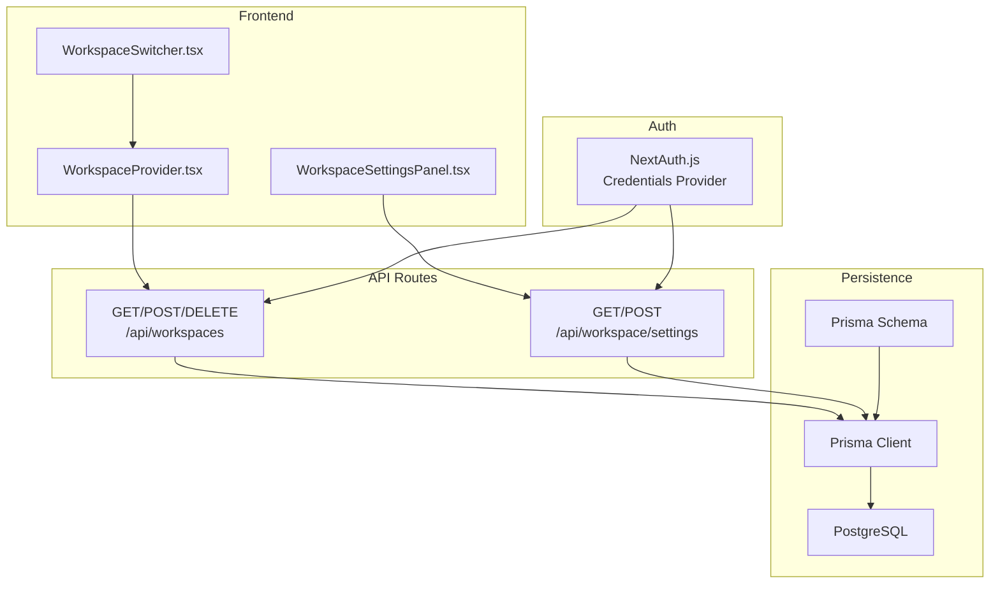
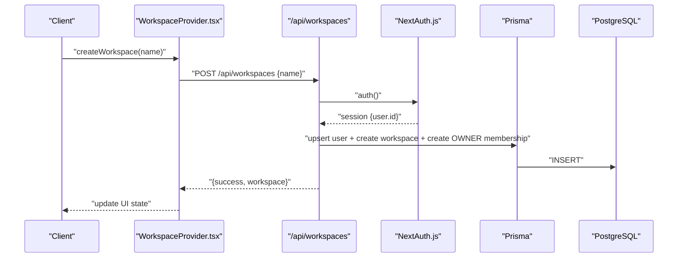
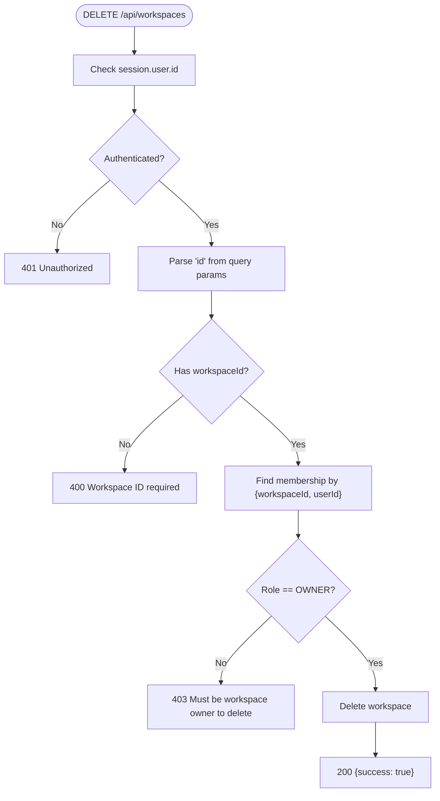
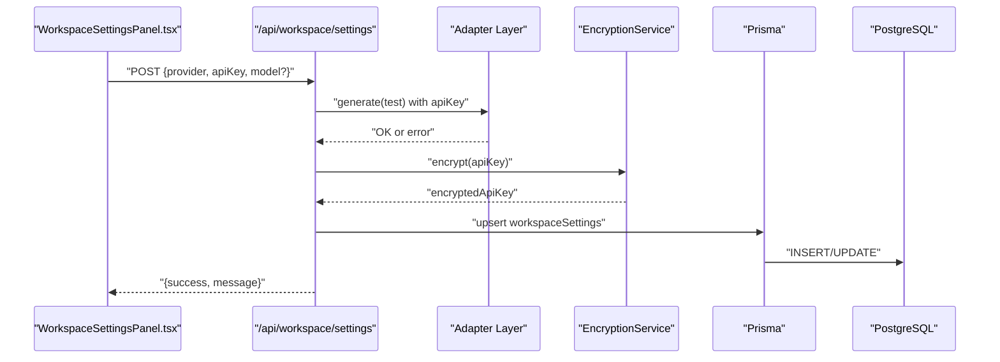
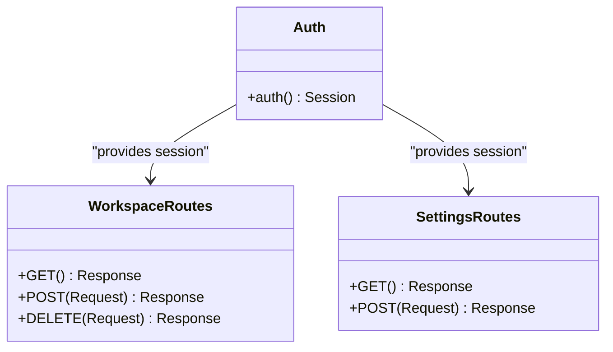
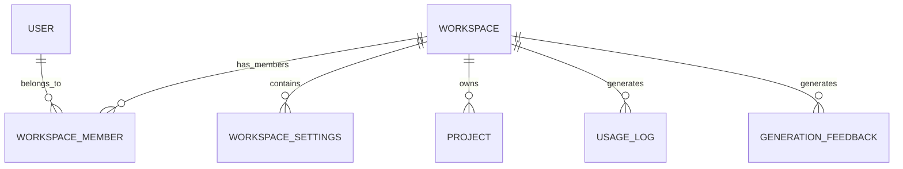
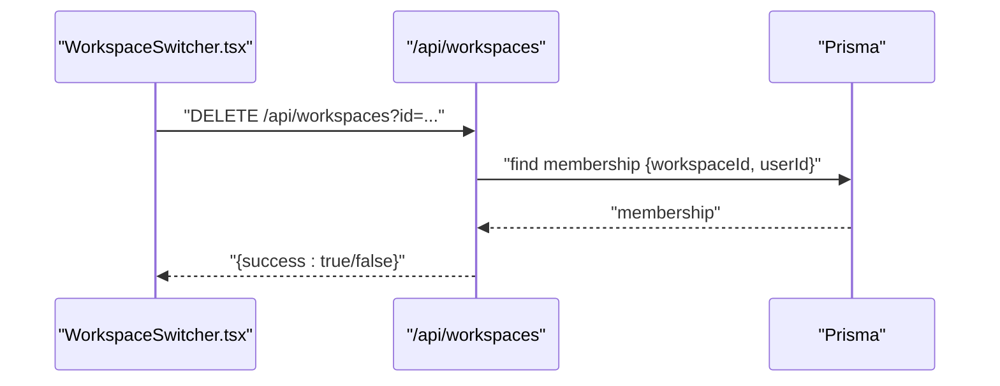
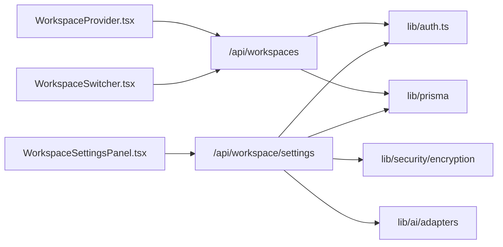

# Workspace API

<cite>
**Referenced Files in This Document**
- [route.ts](file://app/api/workspaces/route.ts)
- [route.ts](file://app/api/workspace/settings/route.ts)
- [schema.prisma](file://prisma/schema.prisma)
- [auth.ts](file://lib/auth.ts)
- [WorkspaceProvider.tsx](file://components/workspace/WorkspaceProvider.tsx)
- [WorkspaceSwitcher.tsx](file://components/workspace/WorkspaceSwitcher.tsx)
- [WorkspaceSettingsPanel.tsx](file://components/WorkspaceSettingsPanel.tsx)
- [route.ts](file://app/api/projects/route.ts)
- [verify_multitenancy.ts](file://tmp/verify_multitenancy.ts)
</cite>

## Table of Contents
1. [Introduction](#introduction)
2. [Project Structure](#project-structure)
3. [Core Components](#core-components)
4. [Architecture Overview](#architecture-overview)
5. [Detailed Component Analysis](#detailed-component-analysis)
6. [Dependency Analysis](#dependency-analysis)
7. [Performance Considerations](#performance-considerations)
8. [Troubleshooting Guide](#troubleshooting-guide)
9. [Conclusion](#conclusion)

## Introduction
This document describes the Workspace Management API, covering:
- Workspace CRUD operations (list, create, delete)
- Workspace settings management (provider/model configuration and secure storage)
- Authentication and authorization requirements
- Role-based access control (RBAC) and workspace isolation
- Practical examples for creation, deletion, and configuration updates

The backend is implemented as Next.js App Router API routes with database persistence via Prisma and a PostgreSQL data source. Frontend components integrate with these APIs to provide a seamless user experience.

## Project Structure
The Workspace API surface consists of:
- Workspace listing and lifecycle endpoints under `/api/workspaces`
- Workspace settings endpoint under `/api/workspace/settings`
- Supporting Prisma schema defining multi-tenant relations
- Authentication via NextAuth.js with a credentials provider
- Frontend integrations in React components

**Diagram sources**
- [route.ts:31-144](file://app/api/workspaces/route.ts#L31-L144)
- [route.ts:34-146](file://app/api/workspace/settings/route.ts#L34-L146)
- [WorkspaceProvider.tsx:27-98](file://components/workspace/WorkspaceProvider.tsx#L27-L98)
- [WorkspaceSwitcher.tsx:100-141](file://components/workspace/WorkspaceSwitcher.tsx#L100-L141)
- [WorkspaceSettingsPanel.tsx:97-190](file://components/WorkspaceSettingsPanel.tsx#L97-L190)
- [auth.ts:11-86](file://lib/auth.ts#L11-L86)
- [schema.prisma:64-110](file://prisma/schema.prisma#L64-L110)

**Section sources**
- [route.ts:1-145](file://app/api/workspaces/route.ts#L1-L145)
- [route.ts:1-147](file://app/api/workspace/settings/route.ts#L1-L147)
- [schema.prisma:64-110](file://prisma/schema.prisma#L64-L110)
- [auth.ts:11-86](file://lib/auth.ts#L11-L86)
- [WorkspaceProvider.tsx:27-98](file://components/workspace/WorkspaceProvider.tsx#L27-L98)
- [WorkspaceSwitcher.tsx:100-141](file://components/workspace/WorkspaceSwitcher.tsx#L100-L141)
- [WorkspaceSettingsPanel.tsx:97-190](file://components/WorkspaceSettingsPanel.tsx#L97-L190)

## Core Components
- Workspace API (list/create/delete)
  - GET /api/workspaces: Lists workspaces for the authenticated user
  - POST /api/workspaces: Creates a new workspace and assigns OWNER role to the creator
  - DELETE /api/workspaces?id=...: Deletes a workspace (OWNER only)
- Workspace Settings API
  - GET /api/workspace/settings: Returns configured providers/models (without exposing raw keys)
  - POST /api/workspace/settings: Validates and stores encrypted keys; supports clearing entries

These endpoints enforce:
- Authentication via NextAuth.js JWT session
- Authorization checks (OWNER-only delete)
- Workspace isolation via membership joins and unique constraints

**Section sources**
- [route.ts:31-144](file://app/api/workspaces/route.ts#L31-L144)
- [route.ts:34-146](file://app/api/workspace/settings/route.ts#L34-L146)
- [schema.prisma:64-110](file://prisma/schema.prisma#L64-L110)
- [auth.ts:11-86](file://lib/auth.ts#L11-L86)

## Architecture Overview
The Workspace API follows a layered architecture:
- Presentation: Next.js App Router API routes
- Domain: Authorization and validation logic
- Persistence: Prisma ORM with PostgreSQL
- Security: Encrypted storage for API keys, RBAC via membership roles

**Diagram sources**
- [WorkspaceProvider.tsx:35-58](file://components/workspace/WorkspaceProvider.tsx#L35-L58)
- [route.ts:47-108](file://app/api/workspaces/route.ts#L47-L108)
- [auth.ts:11-86](file://lib/auth.ts#L11-L86)
- [schema.prisma:64-95](file://prisma/schema.prisma#L64-L95)

**Section sources**
- [route.ts:31-144](file://app/api/workspaces/route.ts#L31-L144)
- [WorkspaceProvider.tsx:27-98](file://components/workspace/WorkspaceProvider.tsx#L27-L98)
- [auth.ts:11-86](file://lib/auth.ts#L11-L86)
- [schema.prisma:64-95](file://prisma/schema.prisma#L64-L95)

## Detailed Component Analysis

### Workspace CRUD Endpoints
- Endpoint: GET /api/workspaces
  - Purpose: List workspaces and membership roles for the authenticated user
  - Behavior: Returns a compact array of workspace metadata including role and settings count
  - Access control: Requires authenticated session
  - Response shape: { success: boolean, workspaces: [{ id, name, slug, role, settingsCount }] }

- Endpoint: POST /api/workspaces
  - Purpose: Create a new workspace and assign the caller as OWNER
  - Behavior:
    - Validates name length and presence
    - Generates a unique slug
    - Upserts the user record (ensures DB presence before FK constraint)
    - Atomically creates workspace and OWNER membership
  - Access control: Requires authenticated session
  - Response shape: { success: boolean, workspace: { id, name, slug, role: "OWNER" } }

- Endpoint: DELETE /api/workspaces?id={id}
  - Purpose: Delete a workspace
  - Behavior:
    - Requires authenticated session
    - Validates presence of workspaceId query param
    - Confirms membership role is OWNER
    - Deletes workspace and cascades related records
  - Access control: OWNER only
  - Response shape: { success: boolean }

**Diagram sources**
- [route.ts:111-144](file://app/api/workspaces/route.ts#L111-L144)

**Section sources**
- [route.ts:31-144](file://app/api/workspaces/route.ts#L31-L144)

### Workspace Settings Management
- Endpoint: GET /api/workspace/settings
  - Purpose: Retrieve provider configurations for the default workspace
  - Behavior:
    - Returns a map keyed by provider with model, hasApiKey, and updatedAt
    - Never exposes raw API keys
  - Response shape: { settings: { [provider]: { model, hasApiKey, updatedAt } } }

- Endpoint: POST /api/workspace/settings
  - Purpose: Save or clear provider API keys
  - Behavior:
    - Validation: provider and model optional; apiKey required unless clear: true
    - Key validation: For non-local providers, performs a lightweight test call using a default or provided model
    - Encryption: Stores encryptedApiKey in the database
    - Upsert: Updates existing provider config or creates a new one
    - Cache: Invalidates in-memory cache for immediate effect
  - Response shape: { success: boolean, message: string } on success; error payload on failure

**Diagram sources**
- [route.ts:59-146](file://app/api/workspace/settings/route.ts#L59-L146)
- [WorkspaceSettingsPanel.tsx:138-190](file://components/WorkspaceSettingsPanel.tsx#L138-L190)

**Section sources**
- [route.ts:34-146](file://app/api/workspace/settings/route.ts#L34-L146)
- [WorkspaceSettingsPanel.tsx:97-190](file://components/WorkspaceSettingsPanel.tsx#L97-L190)

### Authentication and Authorization
- Authentication
  - Implemented via NextAuth.js with a custom credentials provider
  - On successful authorization, a JWT session is issued with user identity
  - The workspace routes call the auth helper to extract session info

- Authorization
  - Workspace listing: Any authenticated user can list their workspaces
  - Workspace creation: Any authenticated user can create a workspace and becomes OWNER
  - Workspace deletion: Only OWNER can delete a workspace
  - Settings management: Uses the same session-based identity for scoping

**Diagram sources**
- [auth.ts:11-86](file://lib/auth.ts#L11-L86)
- [route.ts:31-144](file://app/api/workspaces/route.ts#L31-L144)
- [route.ts:34-146](file://app/api/workspace/settings/route.ts#L34-L146)

**Section sources**
- [auth.ts:11-86](file://lib/auth.ts#L11-L86)
- [route.ts:31-144](file://app/api/workspaces/route.ts#L31-L144)
- [route.ts:34-146](file://app/api/workspace/settings/route.ts#L34-L146)

### Workspace Isolation and RBAC
- Multi-tenancy model
  - Users belong to multiple workspaces via WorkspaceMember
  - Workspace contains settings, projects, usage logs, and feedback
  - Unique constraints ensure user/workspace uniqueness and provider/workspace uniqueness for settings

- Roles
  - OWNER: Can delete the workspace
  - ADMIN: Not enforced in the reviewed routes (no ADMIN-specific checks)
  - MEMBER: Default role when joining; not used for workspace deletion in the reviewed routes

- Isolation
  - Membership checks ensure users operate within their assigned workspaces
  - Settings are scoped to workspaceId/provider pairs

**Diagram sources**
- [schema.prisma:64-110](file://prisma/schema.prisma#L64-L110)

**Section sources**
- [schema.prisma:64-110](file://prisma/schema.prisma#L64-L110)
- [route.ts:126-133](file://app/api/workspaces/route.ts#L126-L133)

### Frontend Integration Examples
- Creating a workspace
  - Call POST /api/workspaces with { name }
  - The frontend component handles success/error and updates active workspace

- Deleting a workspace
  - Call DELETE /api/workspaces?id={id} (OWNER only)
  - The frontend component removes the workspace from state and switches active workspace if needed

- Managing settings
  - Load current settings via GET /api/workspace/settings
  - Save a key via POST /api/workspace/settings with { provider, apiKey }
  - Clear a key via POST /api/workspace/settings with { provider, clear: true }

**Diagram sources**
- [WorkspaceSwitcher.tsx:47-55](file://components/workspace/WorkspaceSwitcher.tsx#L47-L55)
- [route.ts:111-144](file://app/api/workspaces/route.ts#L111-L144)

**Section sources**
- [WorkspaceProvider.tsx:35-86](file://components/workspace/WorkspaceProvider.tsx#L35-L86)
- [WorkspaceSwitcher.tsx:47-55](file://components/workspace/WorkspaceSwitcher.tsx#L47-L55)
- [WorkspaceSettingsPanel.tsx:107-190](file://components/WorkspaceSettingsPanel.tsx#L107-L190)

## Dependency Analysis
- Internal dependencies
  - Workspace routes depend on the auth helper and Prisma client
  - Settings routes depend on encryption and adapter layers for validation
  - Frontend components depend on the API routes for state synchronization

- External dependencies
  - NextAuth.js for session management
  - Prisma for database operations
  - PostgreSQL for persistence

**Diagram sources**
- [route.ts:1-145](file://app/api/workspaces/route.ts#L1-L145)
- [route.ts:1-147](file://app/api/workspace/settings/route.ts#L1-L147)
- [auth.ts:11-86](file://lib/auth.ts#L11-L86)
- [WorkspaceProvider.tsx:27-98](file://components/workspace/WorkspaceProvider.tsx#L27-L98)
- [WorkspaceSwitcher.tsx:100-141](file://components/workspace/WorkspaceSwitcher.tsx#L100-L141)
- [WorkspaceSettingsPanel.tsx:97-190](file://components/WorkspaceSettingsPanel.tsx#L97-L190)

**Section sources**
- [route.ts:1-145](file://app/api/workspaces/route.ts#L1-L145)
- [route.ts:1-147](file://app/api/workspace/settings/route.ts#L1-L147)
- [WorkspaceProvider.tsx:27-98](file://components/workspace/WorkspaceProvider.tsx#L27-L98)
- [WorkspaceSwitcher.tsx:100-141](file://components/workspace/WorkspaceSwitcher.tsx#L100-L141)
- [WorkspaceSettingsPanel.tsx:97-190](file://components/WorkspaceSettingsPanel.tsx#L97-L190)

## Performance Considerations
- Database queries
  - Workspace listing uses a join with counts; ensure appropriate indexing on workspaceMember.userId and workspaceMember.workspaceId
  - Settings retrieval uses a simple filter by workspaceId/provider uniqueness

- Encryption overhead
  - Key encryption occurs on write; consider caching decrypted values only in memory for short-lived operations

- Network efficiency
  - Frontend components batch requests and update state optimistically after successful API calls

[No sources needed since this section provides general guidance]

## Troubleshooting Guide
Common issues and resolutions:
- 401 Unauthorized when calling workspace endpoints
  - Ensure the user is authenticated via the credentials provider
  - Verify the session is present and valid

- 403 Forbidden on workspace deletion
  - Confirm the user has OWNER role for the target workspace
  - Only OWNER can delete a workspace

- Settings validation failures
  - For non-local providers, ensure the API key is valid and reachable
  - For local providers (e.g., Ollama), no key is required

- Multitenancy verification
  - Tests demonstrate workspace isolation and membership checks; confirm similar logic applies in production

**Section sources**
- [route.ts:34-51](file://app/api/workspaces/route.ts#L34-L51)
- [route.ts:131-133](file://app/api/workspaces/route.ts#L131-L133)
- [route.ts:91-119](file://app/api/workspace/settings/route.ts#L91-L119)
- [verify_multitenancy.ts:53-69](file://tmp/verify_multitenancy.ts#L53-L69)

## Conclusion
The Workspace API provides a secure, multi-tenant foundation for managing workspaces and their settings. It enforces authentication and role-based access control, isolates data per workspace, and offers straightforward CRUD and configuration endpoints. Frontend components integrate seamlessly with these APIs to deliver a cohesive user experience.