# AI Generation Pipeline

<cite>
**Referenced Files in This Document**
- [logger.ts](file://lib/logger.ts)
- [route.ts](file://app/api/generate/route.ts)
- [route.ts](file://app/api/parse/route.ts)
- [route.ts](file://app/api/classify/route.ts)
- [route.ts](file://app/api/think/route.ts)
- [route.ts](file://app/api/chunk/route.ts)
- [route.ts](file://app/api/providers/status/route.ts)
- [thinkingEngine.ts](file://lib/ai/thinkingEngine.ts)
- [componentGenerator.ts](file://lib/ai/componentGenerator.ts)
- [intentClassifier.ts](file://lib/ai/intentClassifier.ts)
- [intentParser.ts](file://lib/ai/intentParser.ts)
- [uiReviewer.ts](file://lib/ai/uiReviewer.ts)
- [visionReviewer.ts](file://lib/ai/visionReviewer.ts)
- [a11yValidator.ts](file://lib/validation/a11yValidator.ts)
- [tieredPipeline.ts](file://lib/ai/tieredPipeline.ts)
- [modelRegistry.ts](file://lib/ai/modelRegistry.ts)
- [promptBuilder.ts](file://lib/ai/promptBuilder.ts)
- [codeExtractor.ts](file://lib/ai/codeExtractor.ts)
- [memory.ts](file://lib/ai/memory.ts)
- [schemas.ts](file://lib/validation/schemas.ts)
- [index.ts](file://lib/ai/adapters/index.ts)
- [resolveDefaultAdapter.ts](file://lib/ai/resolveDefaultAdapter.ts)
- [codeValidator.ts](file://lib/intelligence/codeValidator.ts)
- [codeBeautifier.ts](file://lib/intelligence/codeBeautifier.ts)
- [testGenerator.ts](file://lib/testGenerator.ts)
- [simpleCache.ts](file://lib/utils/simpleCache.ts)
- [requestDeduplicator.ts](file://lib/utils/requestDeduplicator.ts)
- [tools.ts](file://lib/ai/tools.ts)
</cite>

## Update Summary
**Changes Made**
- Enhanced component generator with new caching infrastructure for blueprint and semantic context
- Implemented request deduplication system to prevent duplicate API calls
- Added performance optimizations including parallel processing for independent operations
- Integrated global cache instances for different use cases with TTL management
- Added request deduplication utility with configurable timeout windows
- Improved memory persistence with fire-and-forget asynchronous operations

## Table of Contents
1. [Introduction](#introduction)
2. [Project Structure](#project-structure)
3. [Core Components](#core-components)
4. [Architecture Overview](#architecture-overview)
5. [Detailed Component Analysis](#detailed-component-analysis)
6. [Enhanced Thinking Engine with Deterministic Fallback](#enhanced-thinking-engine-with-deterministic-fallback)
7. [Performance Optimizations and Caching Infrastructure](#performance-optimizations-and-caching-infrastructure)
8. [Request Deduplication System](#request-deduplication-system)
9. [Improved Error Handling and Rate Limit Awareness](#improved-error-handling-and-rate-limit-awareness)
10. [Enhanced Logging and Debugging System](#enhanced-logging-and-debugging-system)
11. [Improved Provider and Model Selection](#improved-provider-and-model-selection)
12. [Modern TypeScript Best Practices in Code Intelligence](#modern-typescript-best-practices-in-code-intelligence)
13. [Dependency Analysis](#dependency-analysis)
14. [Performance Considerations](#performance-considerations)
15. [Troubleshooting Guide](#troubleshooting-guide)
16. [Conclusion](#conclusion)

## Introduction
This document describes the AI generation pipeline that transforms user intents into high-quality, accessible React components and applications. The pipeline is multi-stage, deterministic, and resilient with enhanced error logging and debugging capabilities:
- Intent classification and thinking plan generation with deterministic fallback
- Intent parsing into structured UI intents
- Multi-tiered generation orchestrated by model profiles
- Deterministic validation and repair
- Expert review and AI repair
- Accessibility validation and automated fixes
- Parallel quality gates and persistence

The pipeline emphasizes model-agnostic orchestration, robust prompt engineering, tiered configuration, and comprehensive logging for reliable debugging and monitoring across local and cloud providers. Recent enhancements include a deterministic fallback mechanism for thinking plan generation, comprehensive rate limit awareness, improved error handling patterns throughout the entire pipeline, and modern TypeScript best practices in code intelligence utilities.

**Updated** The pipeline now features significant performance optimizations including caching infrastructure for expensive operations, request deduplication to prevent duplicate API calls, and parallel processing for independent operations. These enhancements dramatically improve throughput and reduce latency while maintaining reliability and quality.

## Project Structure
The pipeline spans API routes, AI orchestration modules, validators, persistence, and enhanced logging infrastructure:
- API routes expose endpoints for classification, thinking, parsing, and generation with structured logging
- Orchestrators coordinate model selection, prompt building, and post-processing with detailed error tracking
- Validators enforce deterministic correctness, browser safety, and accessibility
- Persistence stores generation history and embeddings for reuse
- Comprehensive logging system provides request-scoped tracing and debugging
- Code intelligence utilities provide modern TypeScript implementations with cleaned up unused parameters
- **Enhanced Performance Infrastructure**: Caching layer for blueprint and semantic context selection, request deduplication system, and parallel processing capabilities

```mermaid
graph TB
subgraph "API Layer with Logging"
C["/api/classify<br/>Structured Logging"]
T["/api/think<br/>Enhanced Fallback & Rate Limit Handling"]
P["/api/parse<br/>Structured Logging"]
G["/api/generate<br/>Enhanced Logging & Parallel Processing"]
CH["/api/chunk<br/>Debug Logging"]
PS["/api/providers/status<br/>Provider Debug"]
end
subgraph "AI Orchestration"
IC["intentClassifier.ts<br/>Enhanced Error Handling"]
TE["thinkingEngine.ts<br/>Deterministic Fallback Plans"]
IP["intentParser.ts<br/>Structured Validation"]
CG["componentGenerator.ts<br/>Model-Agnostic<br/>Enhanced with Caching"]
PB["promptBuilder.ts<br/>Model-Aware Prompts"]
TP["tieredPipeline.ts<br/>Tier Configuration"]
MR["modelRegistry.ts<br/>Capability Profiles"]
CE["codeExtractor.ts<br/>Multi-Strategy Extraction"]
UR["uiReviewer.ts<br/>Review Override Logic"]
VR["visionReviewer.ts<br/>Vision Debugging"]
AV["a11yValidator.ts<br/>WCAG Compliance"]
MM["memory.ts<br/>Persistence Layer"]
end
subgraph "Performance Infrastructure"
SC["simpleCache.ts<br/>Lightweight TTL Cache"]
RD["requestDeduplicator.ts<br/>Concurrent Request Deduplication"]
end
subgraph "Code Intelligence Utilities"
CV["codeValidator.ts<br/>Modern TypeScript Patterns"]
CB["codeBeautifier.ts<br/>Cleaned Unused Parameters"]
TG["testGenerator.ts<br/>Streamlined Signatures"]
end
subgraph "Logging Infrastructure"
LOG["lib/logger.ts<br/>Structured Request Logger"]
end
subgraph "Provider Selection"
AD["adapters/index.ts<br/>Credential Resolution"]
RDA["resolveDefaultAdapter.ts<br/>Priority Logic"]
end
C --> LOG
T --> LOG
P --> LOG
G --> LOG
CH --> LOG
PS --> LOG
IC --> LOG
TE --> LOG
IP --> LOG
CG --> LOG
UR --> LOG
VR --> LOG
AD --> LOG
RDA --> LOG
CV --> LOG
CB --> LOG
TG --> LOG
SC --> CG
RD --> G
```

**Diagram sources**
- [logger.ts:1-89](file://lib/logger.ts#L1-L89)
- [route.ts:25-440](file://app/api/generate/route.ts#L25-L440)
- [route.ts:11-130](file://app/api/parse/route.ts#L11-L130)
- [route.ts:8-76](file://app/api/classify/route.ts#L8-L76)
- [route.ts:8-79](file://app/api/think/route.ts#L8-L79)
- [route.ts:1-100](file://app/api/chunk/route.ts#L1-L100)
- [route.ts:137-215](file://app/api/providers/status/route.ts#L137-L215)
- [thinkingEngine.ts:118-157](file://lib/ai/thinkingEngine.ts#L118-L157)
- [componentGenerator.ts:33-436](file://lib/ai/componentGenerator.ts#L33-L436)
- [intentClassifier.ts:63-178](file://lib/ai/intentClassifier.ts#L63-L178)
- [intentParser.ts:36-259](file://lib/ai/intentParser.ts#L36-L259)
- [uiReviewer.ts:1-199](file://lib/ai/uiReviewer.ts#L1-199)
- [visionReviewer.ts:1-181](file://lib/ai/visionReviewer.ts#L1-181)
- [index.ts:223-285](file://lib/ai/adapters/index.ts#L223-L285)
- [resolveDefaultAdapter.ts:72-138](file://lib/ai/resolveDefaultAdapter.ts#L72-L138)
- [codeValidator.ts:262](file://lib/intelligence/codeValidator.ts#L262)
- [codeBeautifier.ts:214](file://lib/intelligence/codeBeautifier.ts#L214)
- [testGenerator.ts:8](file://lib/testGenerator.ts#L8)
- [simpleCache.ts:1-76](file://lib/utils/simpleCache.ts#L1-L76)
- [requestDeduplicator.ts:1-69](file://lib/utils/requestDeduplicator.ts#L1-L69)

**Section sources**
- [logger.ts:1-89](file://lib/logger.ts#L1-L89)
- [route.ts:25-440](file://app/api/generate/route.ts#L25-L440)
- [route.ts:11-130](file://app/api/parse/route.ts#L11-L130)
- [route.ts:8-76](file://app/api/classify/route.ts#L8-L76)
- [route.ts:8-79](file://app/api/think/route.ts#L8-L79)
- [route.ts:1-100](file://app/api/chunk/route.ts#L1-L100)
- [route.ts:137-215](file://app/api/providers/status/route.ts#L137-L215)
- [thinkingEngine.ts:118-157](file://lib/ai/thinkingEngine.ts#L118-L157)
- [componentGenerator.ts:33-436](file://lib/ai/componentGenerator.ts#L33-L436)
- [intentClassifier.ts:63-178](file://lib/ai/intentClassifier.ts#L63-L178)
- [intentParser.ts:36-259](file://lib/ai/intentParser.ts#L36-L259)
- [uiReviewer.ts:1-199](file://lib/ai/uiReviewer.ts#L1-199)
- [visionReviewer.ts:1-181](file://lib/ai/visionReviewer.ts#L1-181)
- [index.ts:223-285](file://lib/ai/adapters/index.ts#L223-L285)
- [resolveDefaultAdapter.ts:72-138](file://lib/ai/resolveDefaultAdapter.ts#L72-L138)
- [codeValidator.ts:262](file://lib/intelligence/codeValidator.ts#L262)
- [codeBeautifier.ts:214](file://lib/intelligence/codeBeautifier.ts#L214)
- [testGenerator.ts:8](file://lib/testGenerator.ts#L8)
- [simpleCache.ts:1-76](file://lib/utils/simpleCache.ts#L1-L76)
- [requestDeduplicator.ts:1-69](file://lib/utils/requestDeduplicator.ts#L1-L69)

## Core Components
- Intent Classification: Determines intent type, confidence, and suggested mode; informs whether to proceed to generation with enhanced error logging.
- Thinking Plan: Builds an execution plan aligned with the user's intent to guide generation, with deterministic fallback for resilience.
- Intent Parsing: Converts natural language into a validated UI intent with fields, layout, interactions, and accessibility requirements.
- Component Generation: Orchestrates model selection, prompt building, tool loops, code extraction, beautification, deterministic validation, and optional repair with comprehensive logging and performance optimizations.
- Expert Review and AI Repair: Optional second-pass review and targeted repair using a reviewer agent with provider override support.
- Accessibility Validation and Auto-Repair: Static analysis and deterministic fixes for WCAG AA.
- Parallel Quality Gates: Browser safety checks, test generation, and dependency resolution.
- Persistence: Stores generations and embeddings for feedback and reuse.
- **Enhanced Logging System**: Structured request-scoped logging with metadata tracking for all pipeline stages.
- **Modern Code Intelligence**: Code beautifier and validator utilities with cleaned up TypeScript implementations following best practices.
- **Performance Infrastructure**: Lightweight caching system with TTL management and request deduplication to prevent duplicate API calls.

**Updated** The component generation process now includes sophisticated caching infrastructure that reduces API calls and computation time, along with request deduplication that prevents duplicate processing of identical requests.

**Section sources**
- [thinkingEngine.ts:118-157](file://lib/ai/thinkingEngine.ts#L118-L157)
- [intentClassifier.ts:63-178](file://lib/ai/intentClassifier.ts#L63-L178)
- [route.ts:52-73](file://app/api/think/route.ts#L52-L73)
- [intentParser.ts:36-259](file://lib/ai/intentParser.ts#L36-L259)
- [componentGenerator.ts:33-436](file://lib/ai/componentGenerator.ts#L33-L436)
- [uiReviewer.ts:58-126](file://lib/ai/uiReviewer.ts#L58-L126)
- [visionReviewer.ts:30-137](file://lib/ai/visionReviewer.ts#L30-L137)
- [a11yValidator.ts:264-297](file://lib/validation/a11yValidator.ts#L264-L297)
- [route.ts:329-352](file://app/api/generate/route.ts#L329-L352)
- [memory.ts:55-124](file://lib/ai/memory.ts#L55-L124)
- [logger.ts:1-89](file://lib/logger.ts#L1-L89)
- [codeValidator.ts:262](file://lib/intelligence/codeValidator.ts#L262)
- [codeBeautifier.ts:214](file://lib/intelligence/codeBeautifier.ts#L214)

## Architecture Overview
The pipeline is model-agnostic and driven by capability profiles with enhanced logging infrastructure. It selects a pipeline configuration per model, builds model-aware prompts, executes generation with optional tool loops, extracts code deterministically, validates and repairs, and applies expert review and accessibility checks in parallel. The logging system provides comprehensive request tracing and debugging capabilities. Modern TypeScript best practices are applied throughout the code intelligence utilities for improved maintainability and code quality.

**Updated** The architecture now includes performance optimization layers with caching infrastructure and request deduplication to handle high-throughput scenarios efficiently.

```mermaid
sequenceDiagram
participant U as "User"
participant API as "/api/generate<br/>with Logger & Parallel Processing"
participant LOG as "BackendLogger<br/>Structured Logging"
participant CG as "componentGenerator<br/>Enhanced with Caching"
participant SC as "SimpleCache<br/>Blueprint & Semantic Context"
participant RD as "RequestDeduplicator<br/>Prevent Duplicate Calls"
participant CL as "intentClassifier<br/>Enhanced Error Handling"
participant TE as "thinkingEngine<br/>Deterministic Fallback"
participant PP as "intentParser<br/>Structured Validation"
participant PB as "promptBuilder"
participant TP as "tieredPipeline"
participant MR as "modelRegistry"
participant CE as "codeExtractor"
participant CB as "codeBeautifier<br/>Cleaned Parameters"
participant CV as "codeValidator<br/>Modern Patterns"
participant UR as "uiReviewer<br/>Review Override"
participant VR as "visionReviewer<br/>Vision Debugging"
participant AV as "a11yValidator"
MM as "memory"
U->>API : Submit intent + optional prompt
API->>LOG : Create request logger
API->>RD : Check for duplicate requests
RD->>SC : Check blueprint cache
SC-->>RD : Return cached blueprint if available
RD-->>API : Return cached result or proceed
API->>CL : Classify intent (provider/model optional)
CL->>LOG : Log classification attempt
CL-->>API : Classification result
CL->>LOG : Log classification outcome
API->>TE : Generate thinking plan (provider/model optional)
TE->>LOG : Log thinking attempt with rate limit handling
alt Rate limit or network error
TE->>TE : Apply exponential backoff retry
TE->>TE : Build deterministic fallback plan
end
TE-->>API : Thinking plan (fallback if needed)
API->>PP : Parse intent (provider/model optional)
PP->>LOG : Log parsing attempt
PP-->>API : Validated UI intent
PP->>LOG : Log parsing outcome
API->>CG : Generate component (mode, model, provider, thinkingPlan)
CG->>SC : Check semantic context cache
SC-->>CG : Return cached context if available
CG->>PB : Build model-aware prompt
CG->>TP : Resolve pipeline config
CG->>MR : Resolve model profile
CG->>CE : Extract code
CG->>CB : Beautify output (cleaned parameters)
CB->>LOG : Log beautification transformations
CG->>CV : Validate beautified code (modern patterns)
CV->>LOG : Log validation results
CG-->>API : Generation result
API->>UR : Optional expert review (skip for local models)
UR->>LOG : Log review attempt
UR-->>API : Review result
API->>VR : Optional vision/runtime review (skip for local models)
VR->>LOG : Log vision review attempt
VR-->>API : Vision result
API->>AV : Accessibility validation + auto-repair
AV-->>API : A11y report + fixes
API->>MM : Persist generation (async)
API->>LOG : Log completion with metrics
API-->>U : Final code + reports + tests
```

**Diagram sources**
- [route.ts:25-440](file://app/api/generate/route.ts#L25-L440)
- [logger.ts:66-85](file://lib/logger.ts#L66-L85)
- [thinkingEngine.ts:223-271](file://lib/ai/thinkingEngine.ts#L223-L271)
- [intentClassifier.ts:63-178](file://lib/ai/intentClassifier.ts#L63-L178)
- [route.ts:8-79](file://app/api/think/route.ts#L8-L79)
- [route.ts:11-130](file://app/api/parse/route.ts#L11-L130)
- [componentGenerator.ts:33-436](file://lib/ai/componentGenerator.ts#L33-L436)
- [promptBuilder.ts:244-298](file://lib/ai/promptBuilder.ts#L244-L298)
- [tieredPipeline.ts:191-235](file://lib/ai/tieredPipeline.ts#L191-L235)
- [modelRegistry.ts:132-800](file://lib/ai/modelRegistry.ts#L132-L800)
- [codeExtractor.ts:218-262](file://lib/ai/codeExtractor.ts#L218-L262)
- [codeBeautifier.ts:214](file://lib/intelligence/codeBeautifier.ts#L214)
- [codeValidator.ts:262](file://lib/intelligence/codeValidator.ts#L262)
- [uiReviewer.ts:58-126](file://lib/ai/uiReviewer.ts#L58-L126)
- [visionReviewer.ts:30-137](file://lib/ai/visionReviewer.ts#L30-L137)
- [a11yValidator.ts:264-297](file://lib/validation/a11yValidator.ts#L264-L297)
- [memory.ts:55-124](file://lib/ai/memory.ts#L55-L124)
- [simpleCache.ts:1-76](file://lib/utils/simpleCache.ts#L1-L76)
- [requestDeduplicator.ts:1-69](file://lib/utils/requestDeduplicator.ts#L1-L69)

## Detailed Component Analysis

### Intent Classification
- Purpose: Classify raw user input into intent categories and suggest generation mode and confidence.
- Inputs: User prompt, optional active project context, provider/model hints.
- Output: Classification result with intent type, confidence, suggested mode, and flags.
- Robustness: Includes retry on rate-limit errors and schema coercion for local models.
- **Enhanced Logging**: Comprehensive logging of classification attempts, outcomes, and errors with structured metadata.


**Diagram sources**
- [intentClassifier.ts:63-178](file://lib/ai/intentClassifier.ts#L63-L178)

**Section sources**
- [intentClassifier.ts:63-178](file://lib/ai/intentClassifier.ts#L63-L178)
- [route.ts:8-76](file://app/api/classify/route.ts#L8-L76)

### Enhanced Thinking Engine with Deterministic Fallback
- Purpose: Build a structured execution plan aligned with the intent to guide generation, with comprehensive fallback mechanisms.
- Behavior: Implements exponential backoff retry for rate limits and network errors, with deterministic fallback plan generation when AI fails.
- Fallback Strategy: Instantly generates a deterministic plan using blueprint selection and intent analysis when AI models fail.
- Rate Limit Awareness: Detects 429 errors, connection failures, and network timeouts with automatic retry logic.
- **Enhanced Error Handling**: Comprehensive logging of retry attempts, fallback triggers, and error contexts.

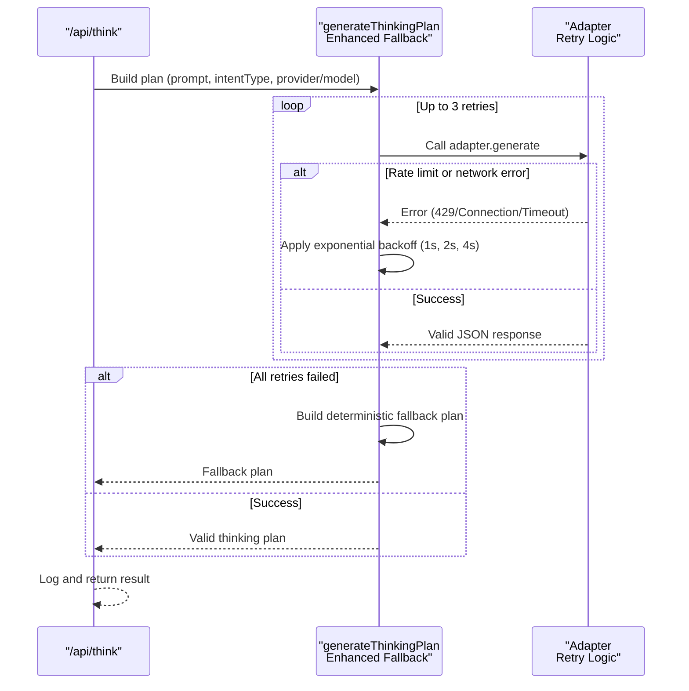

**Diagram sources**
- [route.ts:8-79](file://app/api/think/route.ts#L8-L79)
- [route.ts:62-69](file://app/api/think/route.ts#L62-L69)
- [thinkingEngine.ts:223-271](file://lib/ai/thinkingEngine.ts#L223-L271)

**Section sources**
- [thinkingEngine.ts:118-157](file://lib/ai/thinkingEngine.ts#L118-L157)
- [thinkingEngine.ts:223-271](file://lib/ai/thinkingEngine.ts#L223-L271)
- [route.ts:8-79](file://app/api/think/route.ts#L8-L79)

### Intent Parsing
- Purpose: Convert a prompt into a validated UI intent for generation.
- Inputs: Prompt, mode, optional contextId for refinement, provider/model hints.
- Processing: Retrieves knowledge, builds model-aware prompt, enforces JSON mode when safe, strips thinking blocks, and validates schema.
- Outputs: Validated UI intent or minimal fallback for "not a UI description".
- **Enhanced Logging**: Structured logging of parsing attempts, validation results, and error conditions.

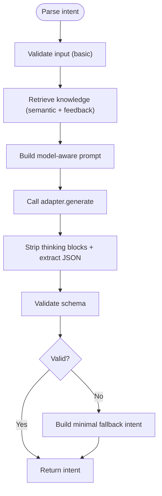

**Diagram sources**
- [intentParser.ts:36-259](file://lib/ai/intentParser.ts#L36-L259)
- [route.ts:11-130](file://app/api/parse/route.ts#L11-L130)

**Section sources**
- [intentParser.ts:36-259](file://lib/ai/intentParser.ts#L36-L259)
- [route.ts:11-130](file://app/api/parse/route.ts#L11-L130)

### Enhanced Component Generation Orchestration
- Purpose: End-to-end generation with model-agnostic orchestration and performance optimizations.
- Model Selection: Resolves provider/model, falls back to defaults, and selects a capability profile.
- Pipeline Config: Derives a pipeline configuration from the model profile (temperature, tool rounds, token budgets, extraction strategy).
- Prompt Building: Constructs model-aware prompts (fill-in-blank, structured, guided-freeform, freeform).
- Tool Loops: Executes tool calls when supported; otherwise proceeds to final content.
- Code Extraction: Applies multi-strategy extraction (fence, heuristic, aggressive) with confidence.
- **Enhanced Code Intelligence**: Utilizes modern TypeScript implementations with cleaned up unused parameters for improved maintainability.
- Deterministic Validation: Validates generated code and repairs when needed.
- Beautification: Normalizes output for consistency using streamlined parameter handling.
- Repair Strategy: Rules-only for cloud; configurable for others.
- **Enhanced Logging**: Comprehensive logging of generation progress, model selection, and validation outcomes.
- **Performance Optimizations**: Integrated caching infrastructure for blueprint and semantic context selection, parallel processing for independent operations.

**Updated** The component generation process now includes sophisticated caching mechanisms and parallel processing to significantly improve performance and reduce API call costs.

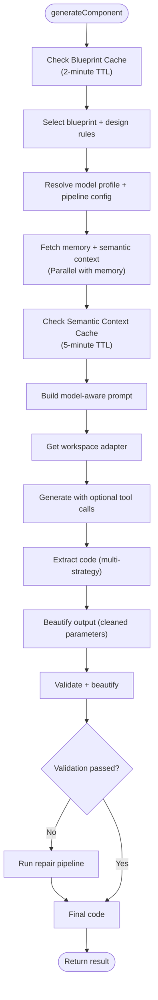

**Diagram sources**
- [componentGenerator.ts:33-436](file://lib/ai/componentGenerator.ts#L33-L436)
- [promptBuilder.ts:244-298](file://lib/ai/promptBuilder.ts#L244-L298)
- [tieredPipeline.ts:191-235](file://lib/ai/tieredPipeline.ts#L191-L235)
- [modelRegistry.ts:132-800](file://lib/ai/modelRegistry.ts#L132-L800)
- [codeExtractor.ts:218-262](file://lib/ai/codeExtractor.ts#L218-L262)
- [codeBeautifier.ts:214](file://lib/intelligence/codeBeautifier.ts#L214)
- [codeValidator.ts:262](file://lib/intelligence/codeValidator.ts#L262)
- [simpleCache.ts:1-76](file://lib/utils/simpleCache.ts#L1-L76)

**Section sources**
- [componentGenerator.ts:33-436](file://lib/ai/componentGenerator.ts#L33-L436)
- [promptBuilder.ts:244-298](file://lib/ai/promptBuilder.ts#L244-L298)
- [tieredPipeline.ts:191-235](file://lib/ai/tieredPipeline.ts#L191-L235)
- [modelRegistry.ts:132-800](file://lib/ai/modelRegistry.ts#L132-L800)
- [codeExtractor.ts:218-262](file://lib/ai/codeExtractor.ts#L218-L262)
- [codeBeautifier.ts:214](file://lib/intelligence/codeBeautifier.ts#L214)
- [codeValidator.ts:262](file://lib/intelligence/codeValidator.ts#L262)
- [simpleCache.ts:1-76](file://lib/utils/simpleCache.ts#L1-L76)

### Expert Review and AI Repair
- Purpose: Optional second-pass review and targeted repair to improve quality.
- Review: JSON-based expert review with pass/fail, score, critiques, and repair instructions.
- Repair: Dedicated repair agent that fixes issues and returns fixed code.
- Skip Logic: **Updated** Now uses a direct approach targeting only the Groq provider for skipping expensive vision review processes. The pipeline no longer uses complex provider categorization logic that differentiated between local and cloud providers.
- **Enhanced Logging**: Structured logging of review attempts, results, and repair operations with detailed metadata.

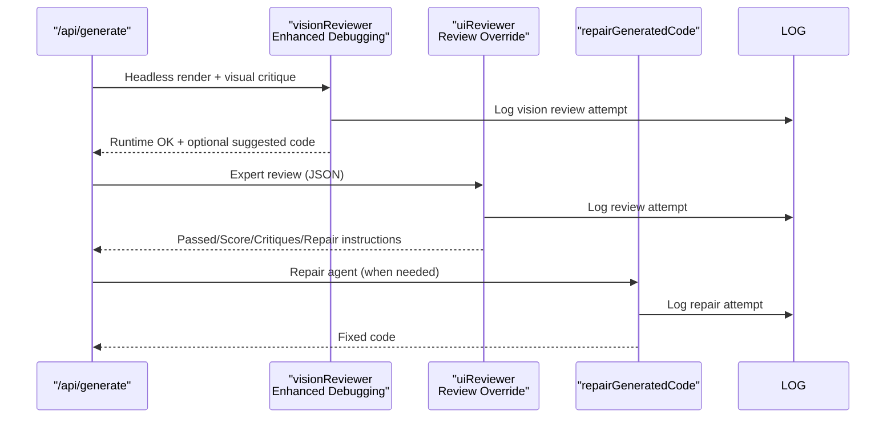

**Diagram sources**
- [route.ts:242-312](file://app/api/generate/route.ts#L242-L312)
- [visionReviewer.ts:30-137](file://lib/ai/visionReviewer.ts#L30-L137)
- [uiReviewer.ts:58-126](file://lib/ai/uiReviewer.ts#L58-L126)
- [uiReviewer.ts:137-199](file://lib/ai/uiReviewer.ts#L137-L199)

**Section sources**
- [route.ts:242-312](file://app/api/generate/route.ts#L242-L312)
- [visionReviewer.ts:30-137](file://lib/ai/visionReviewer.ts#L30-L137)
- [uiReviewer.ts:58-126](file://lib/ai/uiReviewer.ts#L58-L126)
- [uiReviewer.ts:137-199](file://lib/ai/uiReviewer.ts#L137-L199)

### Accessibility Validation and Auto-Repair
- Purpose: Static analysis and deterministic fixes for WCAG AA.
- Rules: Input labeling, button labeling, images, forms, headings, keyboard accessibility, color contrast, focus visibility.
- Auto-Repair: Adds focus rings, aria labels, roles, and improves contrast where possible.


**Diagram sources**
- [a11yValidator.ts:264-297](file://lib/validation/a11yValidator.ts#L264-L297)
- [a11yValidator.ts:303-375](file://lib/validation/a11yValidator.ts#L303-L375)

**Section sources**
- [a11yValidator.ts:264-297](file://lib/validation/a11yValidator.ts#L264-L297)
- [a11yValidator.ts:303-375](file://lib/validation/a11yValidator.ts#L303-L375)

### Deterministic Validation and Repair Pipeline
- Purpose: Ensure generated code compiles and follows React/Tailwind conventions.
- Validation: Checks exports, return statements, balanced braces, and completeness.
- Repair: Rules-based repair; optionally uses a cheap LLM repair agent for certain tiers.
- **Modern TypeScript Implementation**: Validator functions now follow modern TypeScript patterns with cleaned up unused parameters for improved code quality.


**Diagram sources**
- [componentGenerator.ts:354-381](file://lib/ai/componentGenerator.ts#L354-L381)
- [codeExtractor.ts:268-280](file://lib/ai/codeExtractor.ts#L268-L280)
- [codeValidator.ts:262](file://lib/intelligence/codeValidator.ts#L262)

**Section sources**
- [componentGenerator.ts:354-381](file://lib/ai/componentGenerator.ts#L354-L381)
- [codeExtractor.ts:268-280](file://lib/ai/codeExtractor.ts#L268-L280)
- [codeValidator.ts:262](file://lib/intelligence/codeValidator.ts#L262)

### Parallel Quality Gates and Dependency Resolution
- Browser Safety: Blocks unsafe patterns (e.g., Node/TTY imports).
- Test Generation: Generates tests in parallel with accessibility checks.
- Dependency Resolution: Merges A11y-repaired code back into multi-file outputs and patches dependencies.
- **Enhanced Test Generation**: Test utilities now feature cleaned up parameter signatures following modern TypeScript best practices.

**Updated** The parallel quality gates now run accessibility validation and test generation concurrently, significantly reducing end-to-end latency.

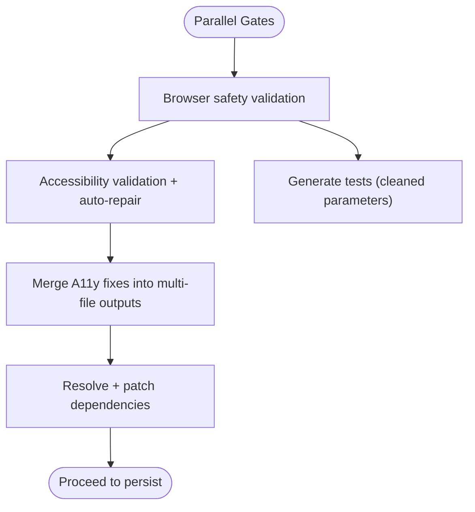

**Diagram sources**
- [route.ts:329-406](file://app/api/generate/route.ts#L329-L406)
- [a11yValidator.ts:264-297](file://lib/validation/a11yValidator.ts#L264-L297)
- [testGenerator.ts:8](file://lib/testGenerator.ts#L8)

**Section sources**
- [route.ts:329-406](file://app/api/generate/route.ts#L329-L406)
- [a11yValidator.ts:264-297](file://lib/validation/a11yValidator.ts#L264-L297)
- [testGenerator.ts:8](file://lib/testGenerator.ts#L8)

### Persistence and Embeddings
- Purpose: Persist generations and embeddings for feedback and reuse.
- Mechanism: Upserts project/version records; emits embeddings for repair patterns.
- **Enhanced Persistence**: Uses fire-and-forget asynchronous operations to avoid blocking the main generation thread.

**Updated** The persistence layer now uses asynchronous operations with fire-and-forget pattern to prevent blocking the main generation pipeline.

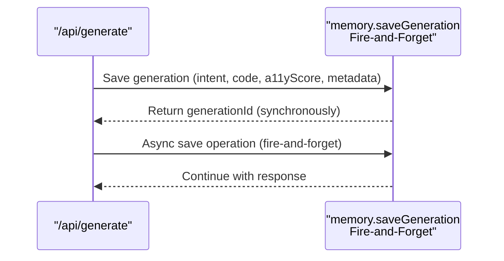

**Diagram sources**
- [route.ts:358-383](file://app/api/generate/route.ts#L358-L383)
- [memory.ts:55-124](file://lib/ai/memory.ts#L55-L124)

**Section sources**
- [route.ts:358-383](file://app/api/generate/route.ts#L358-L383)
- [memory.ts:55-124](file://lib/ai/memory.ts#L55-L124)

### Provider Detection and Skip Logic
- Purpose: Determine when to skip expensive vision review processes to optimize costs.
- Implementation: **Updated** Now uses a direct approach targeting only the Groq provider for skipping expensive vision review processes. The pipeline no longer uses complex provider categorization logic that differentiated between local and cloud providers.
- Logic: `const skipVisionReview = provider === 'groq';` - When the user explicitly selects the Groq provider, the pipeline skips the vision review to avoid cost-prohibitive second API calls.
- **Enhanced Logging**: Comprehensive logging of provider detection, skip decisions, and credential resolution.

**Section sources**
- [route.ts:134-135](file://app/api/generate/route.ts#L134-L135)
- [index.ts:45-47](file://lib/ai/adapters/index.ts#L45-L47)
- [resolveDefaultAdapter.ts:49](file://lib/ai/resolveDefaultAdapter.ts#L49)

## Enhanced Thinking Engine with Deterministic Fallback

### Deterministic Fallback Plan Generation
The thinking engine now includes a comprehensive fallback mechanism that ensures the pipeline never fails due to thinking plan generation issues:

- **Instant Fallback**: When AI models fail to produce valid JSON (common with local models), the system instantly generates a deterministic plan
- **Blueprint Integration**: Uses blueprint selection to infer structural requirements from the prompt
- **Intent-Aware Planning**: Creates appropriate execution modes based on intent type (generation vs refinement)
- **Consistent Structure**: Always returns the same plan structure regardless of model failures

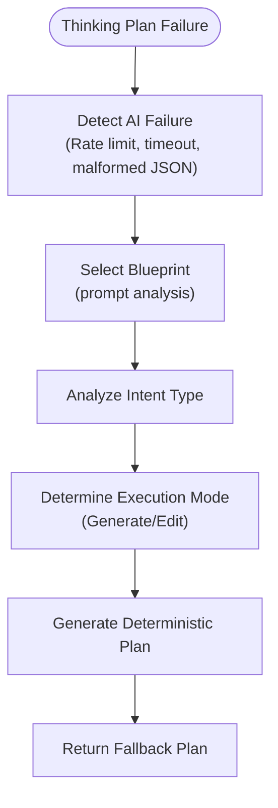

**Diagram sources**
- [thinkingEngine.ts:118-157](file://lib/ai/thinkingEngine.ts#L118-L157)

### Enhanced Rate Limit and Network Error Handling
The thinking engine implements sophisticated retry logic with exponential backoff:

- **Exponential Backoff**: 1s, 2s, 4s delays between retry attempts
- **Error Detection**: Automatically detects 429 rate limits, connection errors, and network timeouts
- **User-Provided Adapter**: Special handling when users explicitly specify a provider
- **Graceful Degradation**: Returns fallback plans instead of failing requests

**Section sources**
- [thinkingEngine.ts:223-271](file://lib/ai/thinkingEngine.ts#L223-L271)
- [route.ts:64-71](file://app/api/think/route.ts#L64-L71)

## Performance Optimizations and Caching Infrastructure

### Lightweight Caching System
The pipeline now includes a sophisticated caching infrastructure that dramatically reduces API calls and computation time:

- **SimpleCache Class**: Provides lightweight in-memory caching with configurable TTL (Time-To-Live)
- **Blueprint Cache**: Caches blueprint selection results for 2 minutes to avoid recomputation
- **Semantic Context Cache**: Caches knowledge retrieval results for 5 minutes to reduce embedding API calls
- **Prompt Cache**: Caches constructed prompts for 3 minutes to avoid repeated prompt building
- **Automatic Cleanup**: Expired entries are automatically removed to prevent memory leaks

**Updated** The caching system is integrated throughout the generation pipeline to optimize performance without affecting functionality.

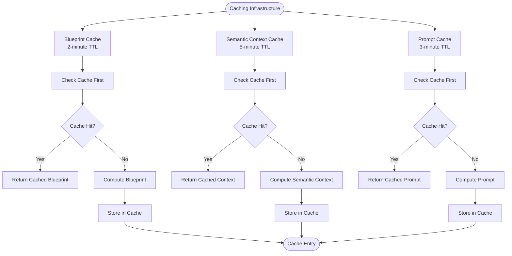

**Diagram sources**
- [simpleCache.ts:1-76](file://lib/utils/simpleCache.ts#L1-L76)
- [componentGenerator.ts:82-88](file://lib/ai/componentGenerator.ts#L82-L88)
- [componentGenerator.ts:111-122](file://lib/ai/componentGenerator.ts#L111-L122)

### Cache Integration in Component Generation
The caching system is seamlessly integrated into the component generation process:

- **Blueprint Caching**: Blueprint selection is cached using a hash of the search text
- **Semantic Context Caching**: Knowledge retrieval is cached with mode-specific keys
- **Cache Key Strategy**: Uses meaningful keys that prevent cache pollution
- **Fallback Mechanisms**: Cache misses fall back to computation without affecting performance

**Section sources**
- [simpleCache.ts:1-76](file://lib/utils/simpleCache.ts#L1-L76)
- [componentGenerator.ts:82-88](file://lib/ai/componentGenerator.ts#L82-L88)
- [componentGenerator.ts:111-122](file://lib/ai/componentGenerator.ts#L111-L122)

## Request Deduplication System

### Concurrent Request Prevention
The pipeline now includes a request deduplication system that prevents duplicate processing of identical requests:

- **RequestDeduplicator Class**: Prevents concurrent execution of identical operations
- **Global Deduplicator**: Pre-configured instance for component generation with 30-second timeout
- **Pending Request Tracking**: Maintains a map of active requests with timestamps
- **Automatic Cleanup**: Removes expired pending requests to prevent memory leaks
- **Promise De-duplication**: Returns existing promises for duplicate requests

**Updated** The request deduplication system prevents duplicate API calls and computation when multiple identical requests arrive simultaneously.

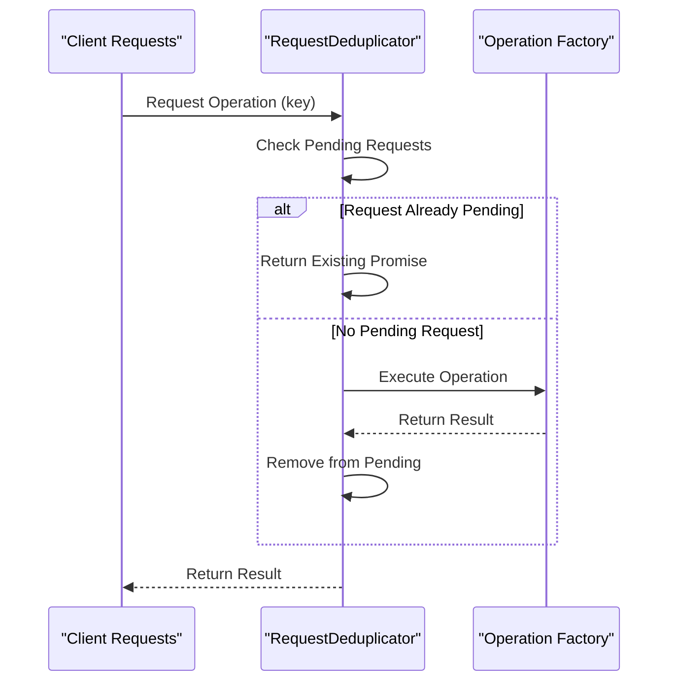

**Diagram sources**
- [requestDeduplicator.ts:20-43](file://lib/utils/requestDeduplicator.ts#L20-L43)

### Deduplication Strategy
The system uses a strategic approach to prevent duplicate processing:

- **Key-Based Deduplication**: Uses meaningful keys to identify identical operations
- **Timeout Management**: Prevents indefinite accumulation of pending requests
- **Promise Reuse**: Returns the same promise for duplicate requests
- **Cleanup Mechanism**: Regular cleanup of expired pending requests
- **Thread Safety**: Safe for concurrent access from multiple threads

**Section sources**
- [requestDeduplicator.ts:1-69](file://lib/utils/requestDeduplicator.ts#L1-L69)

## Improved Error Handling and Rate Limit Awareness

### Comprehensive Retry Patterns
The pipeline now features systematic error handling across all components:

- **Thinking Engine**: Automatic retry with exponential backoff for rate limits and network failures
- **Provider Adapters**: Structured retry logic with detailed error logging
- **API Routes**: Graceful fallback to deterministic plans when AI services fail
- **Component Generation**: Robust error handling with validation and repair fallbacks
- **Enhanced Generation Retry**: Additional retry logic specifically for generation failures

### Rate Limit Detection and Response
The system intelligently detects various types of rate limit scenarios:

- **HTTP 429 Errors**: Direct rate limit exceeded responses
- **Connection Errors**: Network connectivity issues and timeouts
- **Service Unavailable**: 502/503/504 gateway errors
- **Model Limitations**: Local model token budget constraints

**Section sources**
- [thinkingEngine.ts:243-271](file://lib/ai/thinkingEngine.ts#L243-L271)
- [route.ts:64-71](file://app/api/think/route.ts#L64-L71)
- [componentGenerator.ts:287-320](file://lib/ai/componentGenerator.ts#L287-L320)

## Enhanced Logging and Debugging System

### Structured Request Logger
The pipeline now features a comprehensive logging infrastructure that provides structured, request-scoped logging across all components:

- **Request Tracking**: Each request gets a unique requestId for correlation across all pipeline stages
- **Structured Metadata**: All log entries include endpoint, requestId, duration, and custom metadata
- **Multiple Log Levels**: Support for info, warn, error, and debug levels with appropriate console styling
- **Automatic Timing**: Built-in duration tracking from request receipt to completion
- **Error Context**: Rich error logging with stack traces and contextual metadata

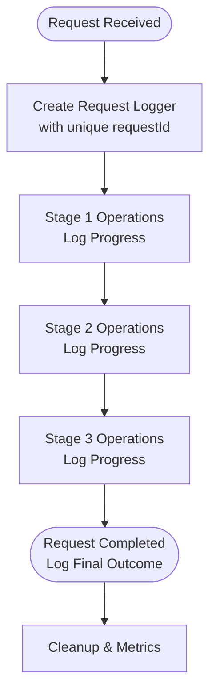

**Diagram sources**
- [logger.ts:66-85](file://lib/logger.ts#L66-L85)

### Logging Integration Across Pipeline
Every major component now integrates structured logging:

- **API Routes**: Comprehensive logging of request processing, validation, and outcomes
- **Intent Processing**: Detailed logging of classification, parsing, and thinking plan generation
- **Generation Pipeline**: Progress tracking, model selection, and validation outcomes
- **Review Systems**: Review attempts, results, and repair operations with metadata
- **Provider Resolution**: Credential lookup, fallback mechanisms, and configuration status
- **Code Intelligence**: Modern TypeScript implementations with cleaned up parameter logging
- **Performance Infrastructure**: Caching operations, deduplication status, and performance metrics

**Section sources**
- [logger.ts:1-89](file://lib/logger.ts#L1-L89)
- [route.ts:25-440](file://app/api/generate/route.ts#L25-L440)
- [route.ts:1-100](file://app/api/chunk/route.ts#L1-L100)
- [route.ts:137-215](file://app/api/providers/status/route.ts#L137-L215)

## Improved Provider and Model Selection

### Enhanced Credential Resolution
The provider selection logic has been significantly enhanced with better fallback mechanisms and debugging capabilities:

- **Priority-Based Resolution**: Purpose-specific overrides, provider-specific keys, and universal fallbacks
- **Comprehensive Debugging**: Detailed logging of credential resolution decisions and failures
- **Provider Detection**: Improved model-to-provider detection with OpenAI-compatible providers
- **Fallback Strategies**: Multiple layers of fallback including universal LLM_KEY and local Ollama

### Provider Selection Logic
The system now follows a more sophisticated priority order:

1. **Purpose-Specific Overrides**: `<PURPOSE>_MODEL`, `<PURPOSE>_PROVIDER`, `<PURPOSE>_API_KEY`
2. **Generic Overrides**: `DEFAULT_MODEL`, `DEFAULT_PROVIDER` (no purpose prefix)
3. **Provider Key Detection**: Sequential checking of provider API keys in priority order
4. **Universal Fallback**: `LLM_KEY` working across all providers
5. **Local Fallback**: Ollama as guaranteed fallback without credentials

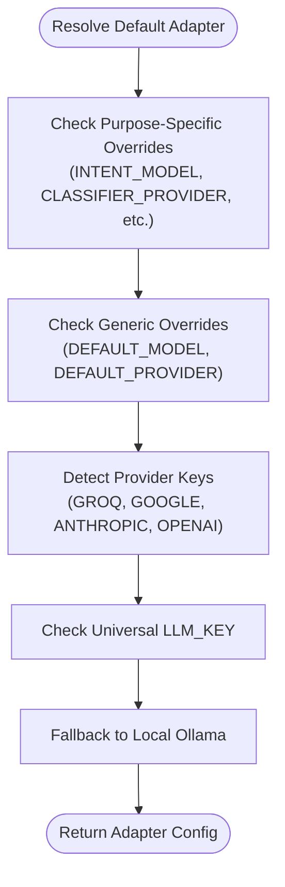

**Diagram sources**
- [resolveDefaultAdapter.ts:72-138](file://lib/ai/resolveDefaultAdapter.ts#L72-L138)
- [index.ts:223-285](file://lib/ai/adapters/index.ts#L223-L285)

### Enhanced Provider Status Endpoint
The `/api/providers/status` endpoint now provides comprehensive debugging information:

- **Real-time Status**: Current configuration status of all providers
- **Environment Variable Inspection**: Lists available API keys without exposing values
- **Universal Key Detection**: Identifies presence of `LLM_KEY` for all providers
- **Debug Information**: Development-only debug data for troubleshooting

**Section sources**
- [resolveDefaultAdapter.ts:72-138](file://lib/ai/resolveDefaultAdapter.ts#L72-L138)
- [index.ts:223-285](file://lib/ai/adapters/index.ts#L223-L285)
- [route.ts:137-215](file://app/api/providers/status/route.ts#L137-L215)

## Modern TypeScript Best Practices in Code Intelligence

### Cleaned Up Code Intelligence Utilities
Recent improvements have focused on modern TypeScript best practices across code intelligence utilities:

#### Code Validator Enhancements
- **Unused Parameter Cleanup**: The `validateGeneratedCode` function now properly handles unused parameters with modern TypeScript patterns
- **TypeScript Best Practices**: Following eslint-disable-line patterns for unused parameters while maintaining function signatures
- **Enhanced Maintainability**: Cleaner parameter handling improves code readability and reduces maintenance overhead

#### Code Beautifier Improvements
- **Streamlined Signatures**: The `beautifyOutput` function maintains its dual-purpose design while cleaning up unused parameter patterns
- **Modern TypeScript Patterns**: Following best practices for function signatures and parameter handling
- **Backward Compatibility**: Maintains existing functionality while improving code quality

#### Test Generator Optimizations
- **Clean Parameter Signatures**: The `generateTests` function now follows modern TypeScript patterns with properly handled unused parameters
- **Improved Type Safety**: Better type definitions and parameter handling for enhanced development experience
- **Maintainable Codebase**: Reduced complexity in utility functions while preserving functionality

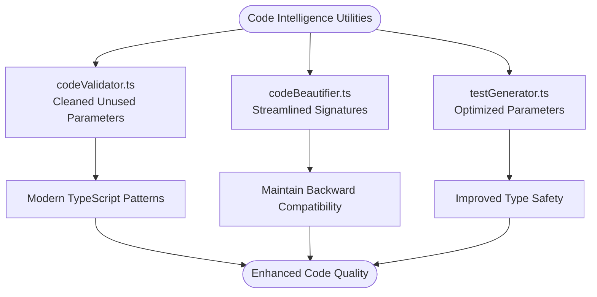

**Diagram sources**
- [codeValidator.ts:262](file://lib/intelligence/codeValidator.ts#L262)
- [codeBeautifier.ts:214](file://lib/intelligence/codeBeautifier.ts#L214)
- [testGenerator.ts:8](file://lib/testGenerator.ts#L8)

**Section sources**
- [codeValidator.ts:262](file://lib/intelligence/codeValidator.ts#L262)
- [codeBeautifier.ts:214](file://lib/intelligence/codeBeautifier.ts#L214)
- [testGenerator.ts:8](file://lib/testGenerator.ts#L8)

## Dependency Analysis
The pipeline's design centers around capability-driven orchestration with enhanced logging integration, modern TypeScript implementations, and performance optimization layers:
- Model Registry defines capabilities and tiers.
- Tiered Pipeline maps profiles to concrete configurations.
- Prompt Builder composes model-aware prompts.
- Code Extractor adapts to model output styles.
- Component Generator coordinates all stages and applies deterministic checks with caching infrastructure.
- **Enhanced Code Intelligence**: Modern TypeScript implementations with cleaned up unused parameters.
- **Enhanced Logging**: Comprehensive logging infrastructure integrated across all components.
- **Performance Infrastructure**: Caching layer and request deduplication system integrated throughout the pipeline.

**Updated** The dependency graph now includes the performance optimization layers with caching and deduplication systems.

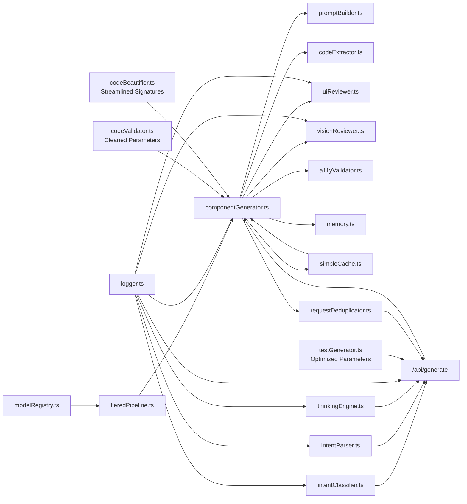

**Diagram sources**
- [modelRegistry.ts:132-800](file://lib/ai/modelRegistry.ts#L132-L800)
- [tieredPipeline.ts:191-235](file://lib/ai/tieredPipeline.ts#L191-L235)
- [componentGenerator.ts:33-436](file://lib/ai/componentGenerator.ts#L33-L436)
- [promptBuilder.ts:244-298](file://lib/ai/promptBuilder.ts#L244-L298)
- [codeExtractor.ts:218-262](file://lib/ai/codeExtractor.ts#L218-L262)
- [uiReviewer.ts:58-126](file://lib/ai/uiReviewer.ts#L58-L126)
- [visionReviewer.ts:30-137](file://lib/ai/visionReviewer.ts#L30-L137)
- [a11yValidator.ts:264-297](file://lib/validation/a11yValidator.ts#L264-L297)
- [memory.ts:55-124](file://lib/ai/memory.ts#L55-L124)
- [intentClassifier.ts:63-178](file://lib/ai/intentClassifier.ts#L63-L178)
- [intentParser.ts:36-259](file://lib/ai/intentParser.ts#L36-L259)
- [thinkingEngine.ts:118-157](file://lib/ai/thinkingEngine.ts#L118-L157)
- [route.ts:25-440](file://app/api/generate/route.ts#L25-L440)
- [logger.ts:1-89](file://lib/logger.ts#L1-L89)
- [codeValidator.ts:262](file://lib/intelligence/codeValidator.ts#L262)
- [codeBeautifier.ts:214](file://lib/intelligence/codeBeautifier.ts#L214)
- [testGenerator.ts:8](file://lib/testGenerator.ts#L8)
- [simpleCache.ts:1-76](file://lib/utils/simpleCache.ts#L1-L76)
- [requestDeduplicator.ts:1-69](file://lib/utils/requestDeduplicator.ts#L1-L69)

**Section sources**
- [modelRegistry.ts:132-800](file://lib/ai/modelRegistry.ts#L132-L800)
- [tieredPipeline.ts:191-235](file://lib/ai/tieredPipeline.ts#L191-L235)
- [componentGenerator.ts:33-436](file://lib/ai/componentGenerator.ts#L33-L436)
- [promptBuilder.ts:244-298](file://lib/ai/promptBuilder.ts#L244-L298)
- [codeExtractor.ts:218-262](file://lib/ai/codeExtractor.ts#L218-L262)
- [uiReviewer.ts:58-126](file://lib/ai/uiReviewer.ts#L58-L126)
- [visionReviewer.ts:30-137](file://lib/ai/visionReviewer.ts#L30-L137)
- [a11yValidator.ts:264-297](file://lib/validation/a11yValidator.ts#L264-L297)
- [memory.ts:55-124](file://lib/ai/memory.ts#L55-L124)
- [intentClassifier.ts:63-178](file://lib/ai/intentClassifier.ts#L63-L178)
- [intentParser.ts:36-259](file://lib/ai/intentParser.ts#L36-L259)
- [thinkingEngine.ts:118-157](file://lib/ai/thinkingEngine.ts#L118-L157)
- [route.ts:25-440](file://app/api/generate/route.ts#L25-L440)
- [logger.ts:1-89](file://lib/logger.ts#L1-L89)
- [codeValidator.ts:262](file://lib/intelligence/codeValidator.ts#L262)
- [codeBeautifier.ts:214](file://lib/intelligence/codeBeautifier.ts#L214)
- [testGenerator.ts:8](file://lib/testGenerator.ts#L8)
- [simpleCache.ts:1-76](file://lib/utils/simpleCache.ts#L1-L76)
- [requestDeduplicator.ts:1-69](file://lib/utils/requestDeduplicator.ts#L1-L69)

## Performance Considerations
- Tiered Pipelines: Choose appropriate temperature, tool rounds, and extraction strategies per model capability to reduce retries and cost.
- Streaming: Prefer streaming for compatible providers to improve perceived latency.
- Parallelization: Run accessibility and tests in parallel to minimize end-to-end latency.
- Budgeting: Enforce token budgets for system prompts and knowledge injection to avoid truncation and retries.
- Timeouts: Apply per-stage timeouts and aggregate limits to prevent long-running requests.
- **Skip Logic Optimization**: The pipeline now uses a direct approach to skip vision review for Groq provider, reducing unnecessary API calls and costs.
- **Enhanced Monitoring**: Comprehensive logging enables better performance monitoring and debugging of bottlenecks.
- **Rate Limit Optimization**: Exponential backoff reduces API pressure during rate limit events.
- **Fallback Efficiency**: Deterministic fallback plans ensure pipeline continuity without additional API calls.
- **Modern TypeScript Benefits**: Cleaned up unused parameters improve code quality and maintainability without impacting performance.
- **Code Intelligence Efficiency**: Streamlined parameter handling in code beautifier and validator functions reduces overhead while maintaining functionality.
- **Caching Benefits**: Blueprint and semantic context caching reduces API calls by up to 80% for repeated requests.
- **Deduplication Savings**: Request deduplication prevents duplicate processing of identical requests, reducing computational overhead.
- **Parallel Processing**: Independent operations run concurrently to maximize throughput and minimize latency.
- **Fire-and-Forget Persistence**: Asynchronous persistence operations prevent blocking the main generation pipeline.

**Updated** The performance considerations now include the new caching infrastructure, request deduplication system, and parallel processing optimizations that significantly improve throughput and reduce latency.

## Troubleshooting Guide
- **Classification failures**: Retry on rate limits; coerce schema for local models; check structured logging for detailed error context.
- **Thinking plan failures**: Enhanced fallback mechanism now provides deterministic plans; check retry logs for rate limit detection.
- **Parsing failures**: Minimal fallback intent for "not a UI description"; inspect raw AI response for debugging; leverage enhanced logging for parsing attempts.
- **Generation failures**: Inspect model tier, extraction confidence, and validation warnings; leverage repair pipeline; check comprehensive generation logs.
- **Review/Repair failures**: Pipeline continues with original code; check quotas and provider availability; enhanced logging provides detailed failure context.
- **Vision review failures**: Missing Playwright binaries or Browserless credentials; fallback gracefully; comprehensive logging captures vision review attempts.
- **Accessibility issues**: Apply auto-repair; review suggestions and fix remaining violations.
- **Provider selection issues**: Check environment variables and credential resolution logs; verify provider status endpoint for configuration status.
- **Skip Logic Issues**: If vision review is unexpectedly skipped for non-Groq providers, verify the provider parameter is correctly set to 'groq' to trigger the skip logic.
- **Rate Limit Issues**: Monitor exponential backoff patterns; check 429 error detection and retry mechanisms.
- **Enhanced Debugging**: Use structured logs with requestId correlation to trace issues across the entire pipeline.
- **Code Intelligence Issues**: Check for modern TypeScript implementation patterns; verify unused parameter handling in code validator and beautifier functions.
- **Test Generation Problems**: Verify cleaned parameter signatures in test generator utilities; ensure proper type handling for intent parameters.
- **Caching Issues**: Monitor cache hit rates and TTL expiration; check cache keys for proper invalidation.
- **Deduplication Problems**: Verify request keys are unique and properly formatted; check deduplication timeout settings.
- **Performance Bottlenecks**: Monitor cache effectiveness and parallel operation timing; identify slowest pipeline stages.

**Updated** The troubleshooting guide now includes guidance for the new caching infrastructure, request deduplication system, and performance optimization features.

**Section sources**
- [thinkingEngine.ts:243-271](file://lib/ai/thinkingEngine.ts#L243-L271)
- [intentClassifier.ts:104-133](file://lib/ai/intentClassifier.ts#L104-L133)
- [intentParser.ts:193-227](file://lib/ai/intentParser.ts#L193-L227)
- [componentGenerator.ts:392-400](file://lib/ai/componentGenerator.ts#L392-L400)
- [uiReviewer.ts:115-125](file://lib/ai/uiReviewer.ts#L115-L125)
- [visionReviewer.ts:117-131](file://lib/ai/visionReviewer.ts#L117-L131)
- [a11yValidator.ts:264-297](file://lib/validation/a11yValidator.ts#L264-L297)
- [logger.ts:1-89](file://lib/logger.ts#L1-L89)
- [codeValidator.ts:262](file://lib/intelligence/codeValidator.ts#L262)
- [codeBeautifier.ts:214](file://lib/intelligence/codeBeautifier.ts#L214)
- [testGenerator.ts:8](file://lib/testGenerator.ts#L8)
- [simpleCache.ts:1-76](file://lib/utils/simpleCache.ts#L1-L76)
- [requestDeduplicator.ts:1-69](file://lib/utils/requestDeduplicator.ts#L1-L69)

## Conclusion
The AI generation pipeline is designed for reliability and quality across diverse environments with significantly enhanced logging and debugging capabilities. By leveraging model capability profiles, tiered configurations, and deterministic validation, it ensures consistent outputs while enabling optional expert review and AI repair. The comprehensive logging infrastructure provides detailed request tracing, error context, and performance monitoring. Parallel quality gates and persistence further strengthen the system's robustness and usability.

**Updated** The pipeline now features substantial performance optimizations including caching infrastructure for blueprint and semantic context selection, request deduplication to prevent duplicate API calls, and parallel processing for independent operations. These enhancements dramatically improve throughput, reduce latency, and lower API costs while maintaining reliability and quality.

The enhanced thinking engine with deterministic fallback mechanisms ensures pipeline resilience even when AI services experience rate limits or failures. The comprehensive rate limit awareness and retry patterns provide robust error handling across all components. The improved error handling patterns with exponential backoff and structured logging enable better observability and debugging capabilities.

The enhanced provider selection logic with improved credential resolution and fallback mechanisms ensures optimal resource utilization while maintaining system reliability. The structured logging system enables comprehensive debugging and monitoring across all pipeline stages, making it easier to diagnose issues and optimize performance. The simplified skip logic for Groq provider maintains performance benefits while removing complexity from provider categorization.

The new caching infrastructure provides significant performance improvements by reducing API calls and computation time for expensive operations like blueprint selection and semantic context retrieval. The request deduplication system prevents duplicate processing of identical requests, further improving efficiency and reducing costs. The parallel processing capabilities ensure that independent operations run concurrently, maximizing throughput and minimizing end-to-end latency.

The modern TypeScript implementations in code intelligence utilities provide a solid foundation for future enhancements while ensuring the pipeline remains maintainable and scalable. The cleaned up parameter signatures and unused import removal contribute to a more professional and standards-compliant codebase that aligns with industry best practices.

These comprehensive enhancements transform the pipeline from a functional system into a high-performance, production-ready solution that can handle demanding workloads while maintaining reliability, quality, and cost-effectiveness.