# AI Generation Pipeline

<cite>
**Referenced Files in This Document**
- [route.ts](file://app/api/generate/route.ts)
- [route.ts](file://app/api/parse/route.ts)
- [route.ts](file://app/api/classify/route.ts)
- [route.ts](file://app/api/think/route.ts)
- [componentGenerator.ts](file://lib/ai/componentGenerator.ts)
- [intentClassifier.ts](file://lib/ai/intentClassifier.ts)
- [intentParser.ts](file://lib/ai/intentParser.ts)
- [uiReviewer.ts](file://lib/ai/uiReviewer.ts)
- [visionReviewer.ts](file://lib/ai/visionReviewer.ts)
- [a11yValidator.ts](file://lib/validation/a11yValidator.ts)
- [tieredPipeline.ts](file://lib/ai/tieredPipeline.ts)
- [modelRegistry.ts](file://lib/ai/modelRegistry.ts)
- [promptBuilder.ts](file://lib/ai/promptBuilder.ts)
- [codeExtractor.ts](file://lib/ai/codeExtractor.ts)
- [memory.ts](file://lib/ai/memory.ts)
- [schemas.ts](file://lib/validation/schemas.ts)
- [index.ts](file://lib/ai/adapters/index.ts)
- [resolveDefaultAdapter.ts](file://lib/ai/resolveDefaultAdapter.ts)
</cite>

## Table of Contents
1. [Introduction](#introduction)
2. [Project Structure](#project-structure)
3. [Core Components](#core-components)
4. [Architecture Overview](#architecture-overview)
5. [Detailed Component Analysis](#detailed-component-analysis)
6. [Dependency Analysis](#dependency-analysis)
7. [Performance Considerations](#performance-considerations)
8. [Troubleshooting Guide](#troubleshooting-guide)
9. [Conclusion](#conclusion)

## Introduction
This document describes the AI generation pipeline that transforms user intents into high-quality, accessible React components and applications. The pipeline is multi-stage, deterministic, and resilient:
- Intent classification and thinking plan generation
- Intent parsing into structured UI intents
- Multi-tiered generation orchestrated by model profiles
- Deterministic validation and repair
- Expert review and AI repair
- Accessibility validation and automated fixes
- Parallel quality gates and persistence

It emphasizes model-agnostic orchestration, robust prompt engineering, and tiered configuration to ensure consistent, high-quality output across local and cloud providers.

## Project Structure
The pipeline spans API routes, AI orchestration modules, validators, and persistence:
- API routes expose endpoints for classification, thinking, parsing, and generation
- Orchestrators coordinate model selection, prompt building, and post-processing
- Validators enforce deterministic correctness, browser safety, and accessibility
- Persistence stores generation history and embeddings for reuse

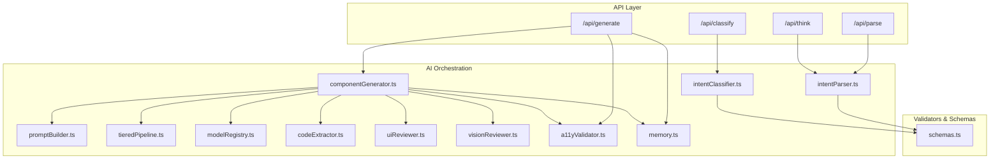

**Diagram sources**
- [route.ts:25-440](file://app/api/generate/route.ts#L25-L440)
- [route.ts:11-130](file://app/api/parse/route.ts#L11-L130)
- [route.ts:8-76](file://app/api/classify/route.ts#L8-L76)
- [route.ts:8-79](file://app/api/think/route.ts#L8-L79)
- [componentGenerator.ts:60-402](file://lib/ai/componentGenerator.ts#L60-L402)
- [intentClassifier.ts:63-178](file://lib/ai/intentClassifier.ts#L63-L178)
- [intentParser.ts:36-259](file://lib/ai/intentParser.ts#L36-L259)
- [promptBuilder.ts:244-298](file://lib/ai/promptBuilder.ts#L244-L298)
- [tieredPipeline.ts:191-235](file://lib/ai/tieredPipeline.ts#L191-L235)
- [modelRegistry.ts:132-800](file://lib/ai/modelRegistry.ts#L132-L800)
- [codeExtractor.ts:218-262](file://lib/ai/codeExtractor.ts#L218-L262)
- [uiReviewer.ts:58-126](file://lib/ai/uiReviewer.ts#L58-L126)
- [visionReviewer.ts:30-137](file://lib/ai/visionReviewer.ts#L30-L137)
- [a11yValidator.ts:264-297](file://lib/validation/a11yValidator.ts#L264-L297)
- [memory.ts:55-124](file://lib/ai/memory.ts#L55-L124)
- [schemas.ts:14-340](file://lib/validation/schemas.ts#L14-L340)

**Section sources**
- [route.ts:25-440](file://app/api/generate/route.ts#L25-L440)
- [route.ts:11-130](file://app/api/parse/route.ts#L11-L130)
- [route.ts:8-76](file://app/api/classify/route.ts#L8-L76)
- [route.ts:8-79](file://app/api/think/route.ts#L8-L79)
- [componentGenerator.ts:60-402](file://lib/ai/componentGenerator.ts#L60-L402)
- [intentClassifier.ts:63-178](file://lib/ai/intentClassifier.ts#L63-L178)
- [intentParser.ts:36-259](file://lib/ai/intentParser.ts#L36-L259)
- [promptBuilder.ts:244-298](file://lib/ai/promptBuilder.ts#L244-L298)
- [tieredPipeline.ts:191-235](file://lib/ai/tieredPipeline.ts#L191-L235)
- [modelRegistry.ts:132-800](file://lib/ai/modelRegistry.ts#L132-L800)
- [codeExtractor.ts:218-262](file://lib/ai/codeExtractor.ts#L218-L262)
- [uiReviewer.ts:58-126](file://lib/ai/uiReviewer.ts#L58-L126)
- [visionReviewer.ts:30-137](file://lib/ai/visionReviewer.ts#L30-L137)
- [a11yValidator.ts:264-297](file://lib/validation/a11yValidator.ts#L264-L297)
- [memory.ts:55-124](file://lib/ai/memory.ts#L55-L124)
- [schemas.ts:14-340](file://lib/validation/schemas.ts#L14-L340)

## Core Components
- Intent Classification: Determines intent type, confidence, and suggested mode; informs whether to proceed to generation.
- Thinking Plan: Builds an execution plan aligned with the user's intent to guide generation.
- Intent Parsing: Converts natural language into a validated UI intent with fields, layout, interactions, and accessibility requirements.
- Component Generation: Orchestrates model selection, prompt building, tool loops, code extraction, beautification, deterministic validation, and optional repair.
- Expert Review and AI Repair: Optional second-pass review and targeted repair using a reviewer agent.
- Accessibility Validation and Auto-Repair: Static analysis and deterministic fixes for WCAG AA.
- Parallel Quality Gates: Browser safety checks, test generation, and dependency resolution.
- Persistence: Stores generations and embeddings for feedback and reuse.

**Section sources**
- [intentClassifier.ts:63-178](file://lib/ai/intentClassifier.ts#L63-L178)
- [route.ts:52-73](file://app/api/think/route.ts#L52-L73)
- [intentParser.ts:36-259](file://lib/ai/intentParser.ts#L36-L259)
- [componentGenerator.ts:60-402](file://lib/ai/componentGenerator.ts#L60-L402)
- [uiReviewer.ts:58-126](file://lib/ai/uiReviewer.ts#L58-L126)
- [visionReviewer.ts:30-137](file://lib/ai/visionReviewer.ts#L30-L137)
- [a11yValidator.ts:264-297](file://lib/validation/a11yValidator.ts#L264-L297)
- [route.ts:329-352](file://app/api/generate/route.ts#L329-L352)
- [memory.ts:55-124](file://lib/ai/memory.ts#L55-L124)

## Architecture Overview
The pipeline is model-agnostic and driven by capability profiles. It selects a pipeline configuration per model, builds model-aware prompts, executes generation with optional tool loops, extracts code deterministically, validates and repairs, and applies expert review and accessibility checks in parallel.

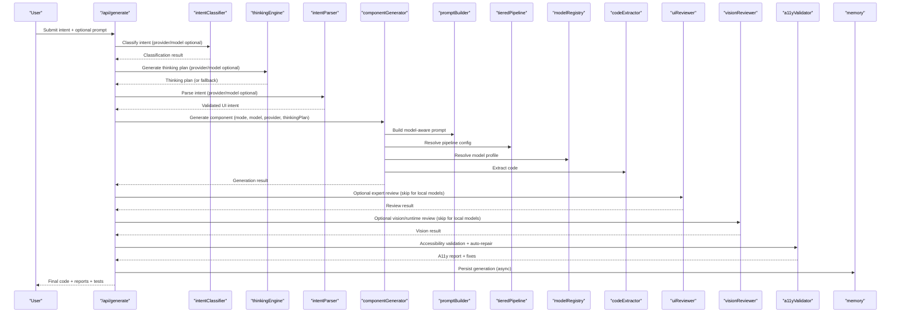

**Diagram sources**
- [route.ts:25-440](file://app/api/generate/route.ts#L25-L440)
- [route.ts:8-76](file://app/api/classify/route.ts#L8-L76)
- [route.ts:8-79](file://app/api/think/route.ts#L8-L79)
- [route.ts:11-130](file://app/api/parse/route.ts#L11-L130)
- [componentGenerator.ts:60-402](file://lib/ai/componentGenerator.ts#L60-L402)
- [promptBuilder.ts:244-298](file://lib/ai/promptBuilder.ts#L244-L298)
- [tieredPipeline.ts:191-235](file://lib/ai/tieredPipeline.ts#L191-L235)
- [modelRegistry.ts:132-800](file://lib/ai/modelRegistry.ts#L132-L800)
- [codeExtractor.ts:218-262](file://lib/ai/codeExtractor.ts#L218-L262)
- [uiReviewer.ts:58-126](file://lib/ai/uiReviewer.ts#L58-L126)
- [visionReviewer.ts:30-137](file://lib/ai/visionReviewer.ts#L30-L137)
- [a11yValidator.ts:264-297](file://lib/validation/a11yValidator.ts#L264-L297)
- [memory.ts:55-124](file://lib/ai/memory.ts#L55-L124)

## Detailed Component Analysis

### Intent Classification
- Purpose: Classify raw user input into intent categories and suggest generation mode and confidence.
- Inputs: User prompt, optional active project context, provider/model hints.
- Output: Classification result with intent type, confidence, suggested mode, and flags.
- Robustness: Includes retry on rate-limit errors and schema coercion for local models.

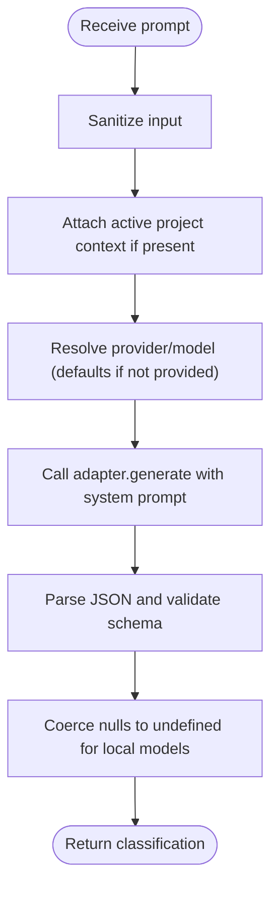

**Diagram sources**
- [intentClassifier.ts:63-178](file://lib/ai/intentClassifier.ts#L63-L178)

**Section sources**
- [intentClassifier.ts:63-178](file://lib/ai/intentClassifier.ts#L63-L178)
- [route.ts:8-76](file://app/api/classify/route.ts#L8-L76)

### Thinking Plan
- Purpose: Build a structured execution plan aligned with the intent to guide generation.
- Behavior: On failure, returns a deterministic fallback plan to keep the flow uninterrupted.

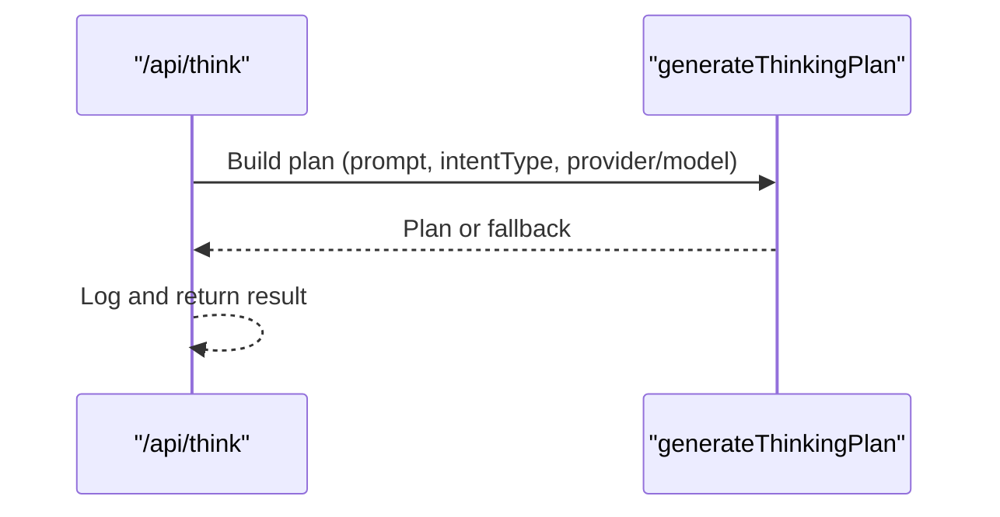

**Diagram sources**
- [route.ts:8-79](file://app/api/think/route.ts#L8-L79)
- [route.ts:62-69](file://app/api/think/route.ts#L62-L69)

**Section sources**
- [route.ts:8-79](file://app/api/think/route.ts#L8-L79)

### Intent Parsing
- Purpose: Convert a prompt into a validated UI intent for generation.
- Inputs: Prompt, mode, optional contextId for refinement, provider/model hints.
- Processing: Retrieves knowledge, builds model-aware prompt, enforces JSON mode when safe, strips thinking blocks, and validates schema.
- Outputs: Validated UI intent or minimal fallback for "not a UI description".

**Diagram sources**
- [intentParser.ts:36-259](file://lib/ai/intentParser.ts#L36-L259)
- [route.ts:11-130](file://app/api/parse/route.ts#L11-L130)

**Section sources**
- [intentParser.ts:36-259](file://lib/ai/intentParser.ts#L36-L259)
- [route.ts:11-130](file://app/api/parse/route.ts#L11-L130)

### Component Generation Orchestration
- Purpose: End-to-end generation with model-agnostic orchestration.
- Model Selection: Resolves provider/model, falls back to defaults, and selects a capability profile.
- Pipeline Config: Derives a pipeline configuration from the model profile (temperature, tool rounds, token budgets, extraction strategy).
- Prompt Building: Constructs model-aware prompts (fill-in-blank, structured, guided-freeform, freeform).
- Tool Loops: Executes tool calls when supported; otherwise proceeds to final content.
- Code Extraction: Applies multi-strategy extraction (fence, heuristic, aggressive) with confidence.
- Deterministic Validation: Validates generated code and repairs when needed.
- Beautification: Normalizes output for consistency.
- Repair Strategy: Rules-only for cloud; configurable for others.

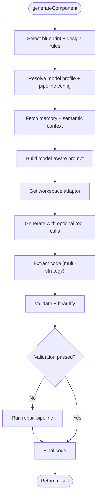

**Diagram sources**
- [componentGenerator.ts:60-402](file://lib/ai/componentGenerator.ts#L60-L402)
- [promptBuilder.ts:244-298](file://lib/ai/promptBuilder.ts#L244-L298)
- [tieredPipeline.ts:191-235](file://lib/ai/tieredPipeline.ts#L191-L235)
- [modelRegistry.ts:132-800](file://lib/ai/modelRegistry.ts#L132-L800)
- [codeExtractor.ts:218-262](file://lib/ai/codeExtractor.ts#L218-L262)

**Section sources**
- [componentGenerator.ts:60-402](file://lib/ai/componentGenerator.ts#L60-L402)
- [promptBuilder.ts:244-298](file://lib/ai/promptBuilder.ts#L244-L298)
- [tieredPipeline.ts:191-235](file://lib/ai/tieredPipeline.ts#L191-L235)
- [modelRegistry.ts:132-800](file://lib/ai/modelRegistry.ts#L132-L800)
- [codeExtractor.ts:218-262](file://lib/ai/codeExtractor.ts#L218-L262)

### Expert Review and AI Repair
- Purpose: Optional second-pass review and targeted repair to improve quality.
- Review: JSON-based expert review with pass/fail, score, critiques, and repair instructions.
- Repair: Dedicated repair agent that fixes issues and returns fixed code.
- Skip Logic: **Updated** Now uses a direct approach targeting only the Groq provider for skipping expensive vision review processes. The pipeline no longer uses complex provider categorization logic that differentiated between local and cloud providers.

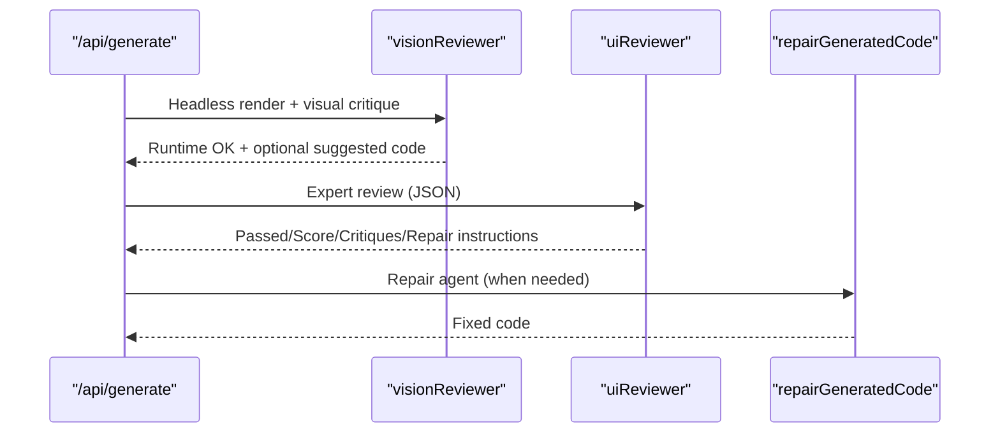

**Diagram sources**
- [route.ts:242-312](file://app/api/generate/route.ts#L242-L312)
- [visionReviewer.ts:30-137](file://lib/ai/visionReviewer.ts#L30-L137)
- [uiReviewer.ts:58-126](file://lib/ai/uiReviewer.ts#L58-L126)
- [uiReviewer.ts:137-199](file://lib/ai/uiReviewer.ts#L137-L199)

**Section sources**
- [route.ts:242-312](file://app/api/generate/route.ts#L242-L312)
- [visionReviewer.ts:30-137](file://lib/ai/visionReviewer.ts#L30-L137)
- [uiReviewer.ts:58-126](file://lib/ai/uiReviewer.ts#L58-L126)
- [uiReviewer.ts:137-199](file://lib/ai/uiReviewer.ts#L137-L199)

### Accessibility Validation and Auto-Repair
- Purpose: Static analysis and deterministic fixes for WCAG AA.
- Rules: Input labeling, button labeling, images, forms, headings, keyboard accessibility, color contrast, focus visibility.
- Auto-Repair: Adds focus rings, aria labels, roles, and improves contrast where possible.

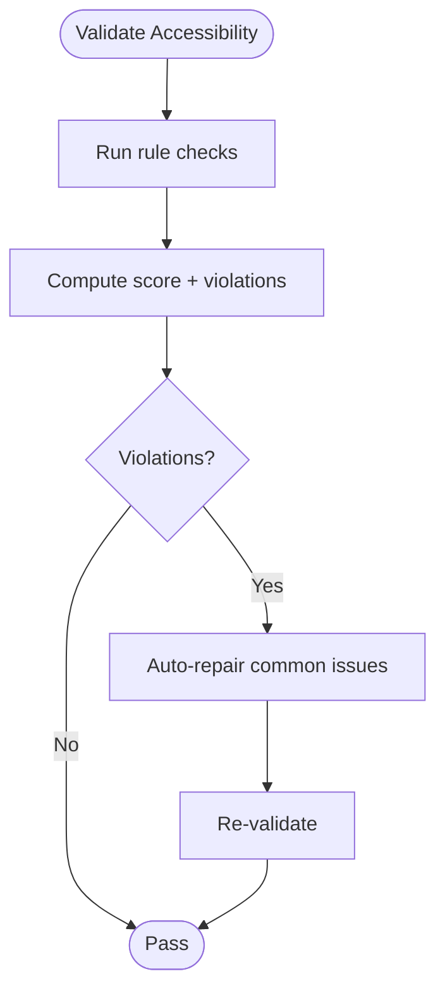

**Diagram sources**
- [a11yValidator.ts:264-297](file://lib/validation/a11yValidator.ts#L264-L297)
- [a11yValidator.ts:303-375](file://lib/validation/a11yValidator.ts#L303-L375)

**Section sources**
- [a11yValidator.ts:264-297](file://lib/validation/a11yValidator.ts#L264-L297)
- [a11yValidator.ts:303-375](file://lib/validation/a11yValidator.ts#L303-L375)

### Deterministic Validation and Repair Pipeline
- Purpose: Ensure generated code compiles and follows React/Tailwind conventions.
- Validation: Checks exports, return statements, balanced braces, and completeness.
- Repair: Rules-based repair; optionally uses a cheap LLM repair agent for certain tiers.

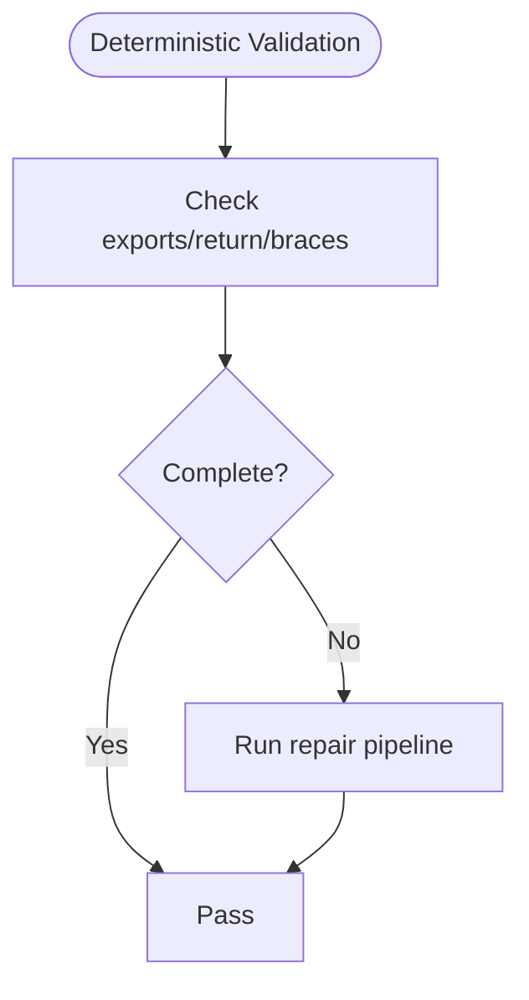

**Diagram sources**
- [componentGenerator.ts:354-381](file://lib/ai/componentGenerator.ts#L354-L381)
- [codeExtractor.ts:268-280](file://lib/ai/codeExtractor.ts#L268-L280)

**Section sources**
- [componentGenerator.ts:354-381](file://lib/ai/componentGenerator.ts#L354-L381)
- [codeExtractor.ts:268-280](file://lib/ai/codeExtractor.ts#L268-L280)

### Parallel Quality Gates and Dependency Resolution
- Browser Safety: Blocks unsafe patterns (e.g., Node/TTY imports).
- Test Generation: Generates tests in parallel with accessibility checks.
- Dependency Resolution: Merges A11y-repaired code back into multi-file outputs and patches dependencies.

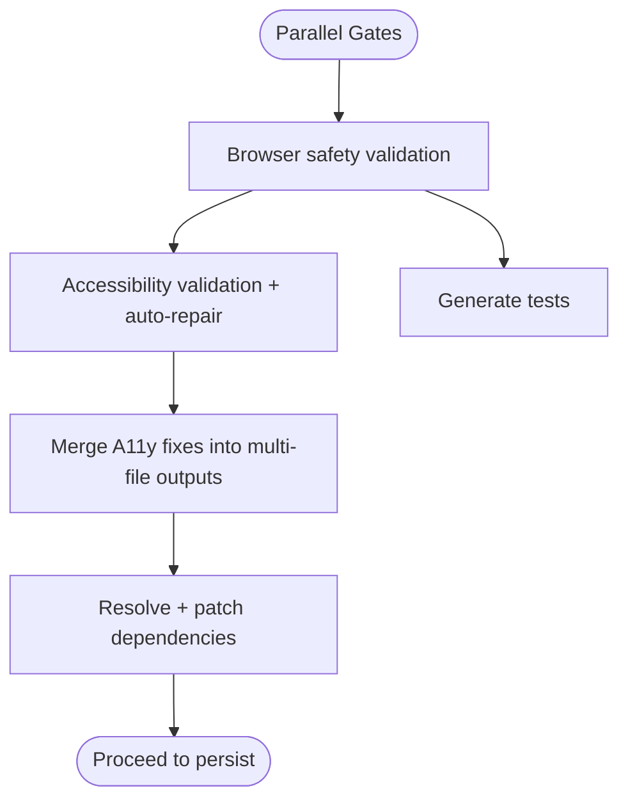

**Diagram sources**
- [route.ts:329-406](file://app/api/generate/route.ts#L329-L406)
- [a11yValidator.ts:264-297](file://lib/validation/a11yValidator.ts#L264-L297)

**Section sources**
- [route.ts:329-406](file://app/api/generate/route.ts#L329-L406)
- [a11yValidator.ts:264-297](file://lib/validation/a11yValidator.ts#L264-L297)

### Persistence and Embeddings
- Purpose: Persist generations and embeddings for feedback and reuse.
- Mechanism: Upserts project/version records; emits embeddings for repair patterns.

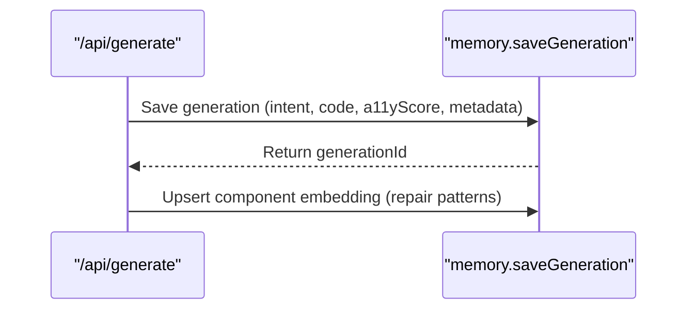

**Diagram sources**
- [route.ts:358-383](file://app/api/generate/route.ts#L358-L383)
- [memory.ts:55-124](file://lib/ai/memory.ts#L55-L124)

**Section sources**
- [route.ts:358-383](file://app/api/generate/route.ts#L358-L383)
- [memory.ts:55-124](file://lib/ai/memory.ts#L55-L124)

### Provider Detection and Skip Logic
- Purpose: Determine when to skip expensive vision review processes to optimize costs.
- Implementation: **Updated** Now uses a direct approach targeting only the Groq provider for skipping expensive vision review processes. The pipeline no longer uses complex provider categorization logic that differentiated between local and cloud providers.
- Logic: `const skipVisionReview = provider === 'groq';` - When the user explicitly selects the Groq provider, the pipeline skips the vision review to avoid cost-prohibitive second API calls.

**Section sources**
- [route.ts:134-135](file://app/api/generate/route.ts#L134-L135)
- [index.ts:45-47](file://lib/ai/adapters/index.ts#L45-L47)
- [resolveDefaultAdapter.ts:49](file://lib/ai/resolveDefaultAdapter.ts#L49)

## Dependency Analysis
The pipeline's design centers around capability-driven orchestration:
- Model Registry defines capabilities and tiers.
- Tiered Pipeline maps profiles to concrete configurations.
- Prompt Builder composes model-aware prompts.
- Code Extractor adapts to model output styles.
- Component Generator coordinates all stages and applies deterministic checks.

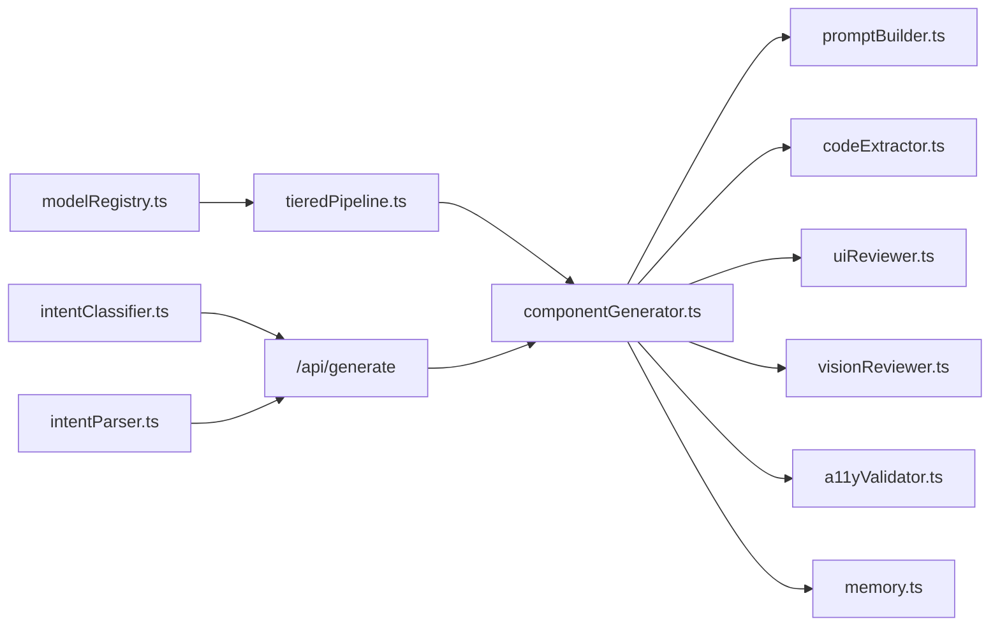

**Diagram sources**
- [modelRegistry.ts:132-800](file://lib/ai/modelRegistry.ts#L132-L800)
- [tieredPipeline.ts:191-235](file://lib/ai/tieredPipeline.ts#L191-L235)
- [componentGenerator.ts:60-402](file://lib/ai/componentGenerator.ts#L60-L402)
- [promptBuilder.ts:244-298](file://lib/ai/promptBuilder.ts#L244-L298)
- [codeExtractor.ts:218-262](file://lib/ai/codeExtractor.ts#L218-L262)
- [uiReviewer.ts:58-126](file://lib/ai/uiReviewer.ts#L58-L126)
- [visionReviewer.ts:30-137](file://lib/ai/visionReviewer.ts#L30-L137)
- [a11yValidator.ts:264-297](file://lib/validation/a11yValidator.ts#L264-L297)
- [memory.ts:55-124](file://lib/ai/memory.ts#L55-L124)
- [intentClassifier.ts:63-178](file://lib/ai/intentClassifier.ts#L63-L178)
- [intentParser.ts:36-259](file://lib/ai/intentParser.ts#L36-L259)
- [route.ts:25-440](file://app/api/generate/route.ts#L25-L440)

**Section sources**
- [modelRegistry.ts:132-800](file://lib/ai/modelRegistry.ts#L132-L800)
- [tieredPipeline.ts:191-235](file://lib/ai/tieredPipeline.ts#L191-L235)
- [componentGenerator.ts:60-402](file://lib/ai/componentGenerator.ts#L60-L402)
- [promptBuilder.ts:244-298](file://lib/ai/promptBuilder.ts#L244-L298)
- [codeExtractor.ts:218-262](file://lib/ai/codeExtractor.ts#L218-L262)
- [uiReviewer.ts:58-126](file://lib/ai/uiReviewer.ts#L58-L126)
- [visionReviewer.ts:30-137](file://lib/ai/visionReviewer.ts#L30-L137)
- [a11yValidator.ts:264-297](file://lib/validation/a11yValidator.ts#L264-L297)
- [memory.ts:55-124](file://lib/ai/memory.ts#L55-L124)
- [intentClassifier.ts:63-178](file://lib/ai/intentClassifier.ts#L63-L178)
- [intentParser.ts:36-259](file://lib/ai/intentParser.ts#L36-L259)
- [route.ts:25-440](file://app/api/generate/route.ts#L25-L440)

## Performance Considerations
- Tiered Pipelines: Choose appropriate temperature, tool rounds, and extraction strategies per model capability to reduce retries and cost.
- Streaming: Prefer streaming for compatible providers to improve perceived latency.
- Parallelization: Run accessibility and tests in parallel to minimize end-to-end latency.
- Budgeting: Enforce token budgets for system prompts and knowledge injection to avoid truncation and retries.
- Timeouts: Apply per-stage timeouts and aggregate limits to prevent long-running requests.
- **Skip Logic Optimization**: **Updated** The pipeline now uses a direct approach to skip vision review for Groq provider, reducing unnecessary API calls and costs.

## Troubleshooting Guide
- Classification failures: Retry on rate limits; coerce schema for local models.
- Parsing failures: Minimal fallback intent for "not a UI description"; inspect raw AI response for debugging.
- Generation failures: Inspect model tier, extraction confidence, and validation warnings; leverage repair pipeline.
- Review/Repair failures: Pipeline continues with original code; check quotas and provider availability.
- Vision review failures: Missing Playwright binaries or Browserless credentials; fallback gracefully.
- Accessibility issues: Apply auto-repair; review suggestions and fix remaining violations.
- **Skip Logic Issues**: **Updated** If vision review is unexpectedly skipped for non-Groq providers, verify the provider parameter is correctly set to 'groq' to trigger the skip logic.

**Section sources**
- [intentClassifier.ts:104-133](file://lib/ai/intentClassifier.ts#L104-L133)
- [intentParser.ts:193-227](file://lib/ai/intentParser.ts#L193-L227)
- [componentGenerator.ts:392-400](file://lib/ai/componentGenerator.ts#L392-L400)
- [uiReviewer.ts:115-125](file://lib/ai/uiReviewer.ts#L115-L125)
- [visionReviewer.ts:117-131](file://lib/ai/visionReviewer.ts#L117-L131)
- [a11yValidator.ts:264-297](file://lib/validation/a11yValidator.ts#L264-L297)

## Conclusion
The AI generation pipeline is designed for reliability and quality across diverse environments. By leveraging model capability profiles, tiered configurations, and deterministic validation, it ensures consistent outputs while enabling optional expert review and AI repair. Parallel quality gates and persistence further strengthen the system's robustness and usability.

**Updated** The pipeline now uses a simplified, direct approach for skip logic optimization, focusing specifically on the Groq provider to avoid unnecessary vision review costs. This change removes the complexity of provider categorization while maintaining the essential performance benefits of selective review skipping.