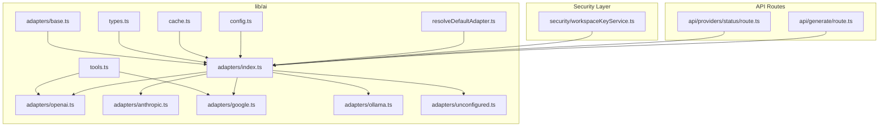
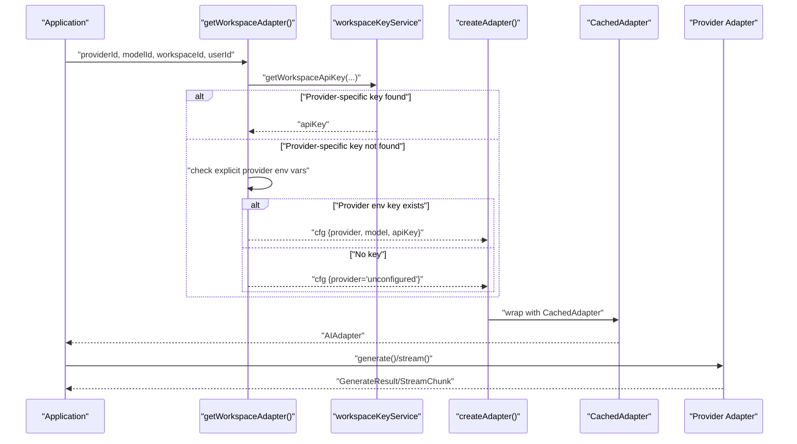
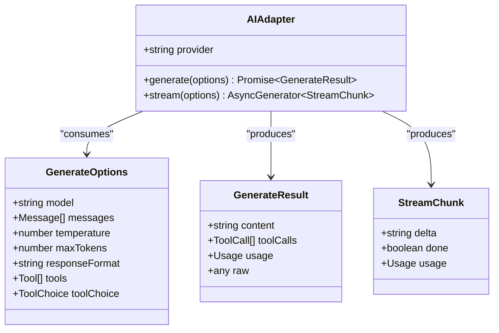
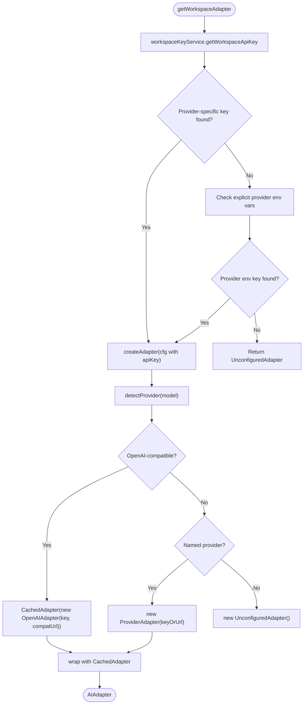
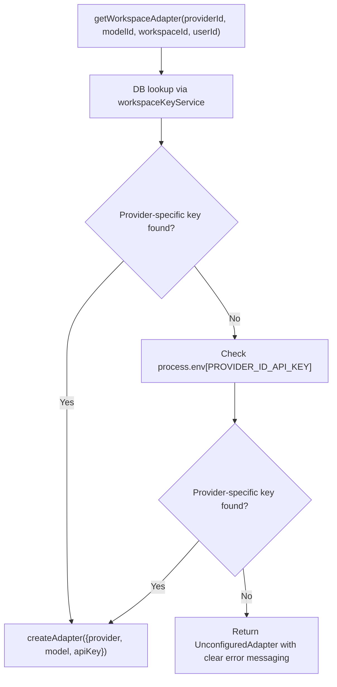
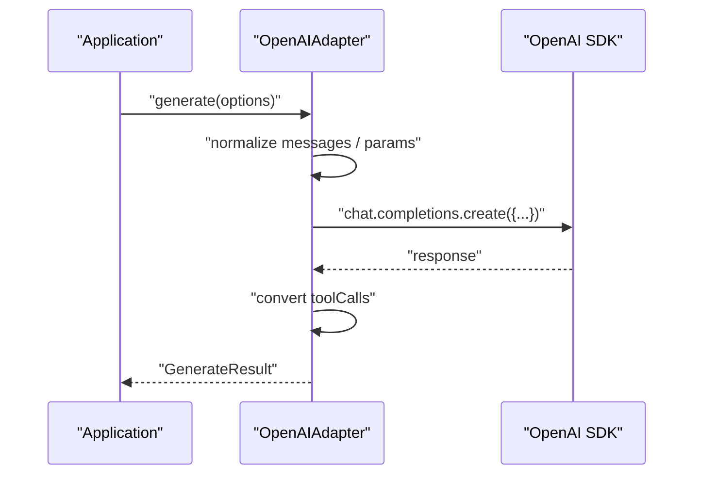
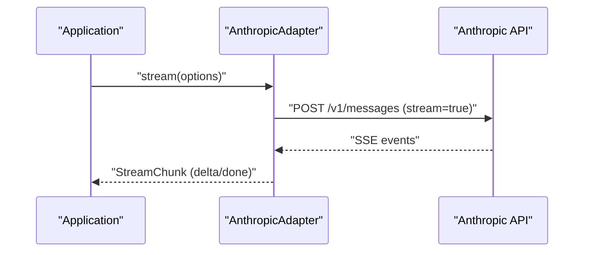
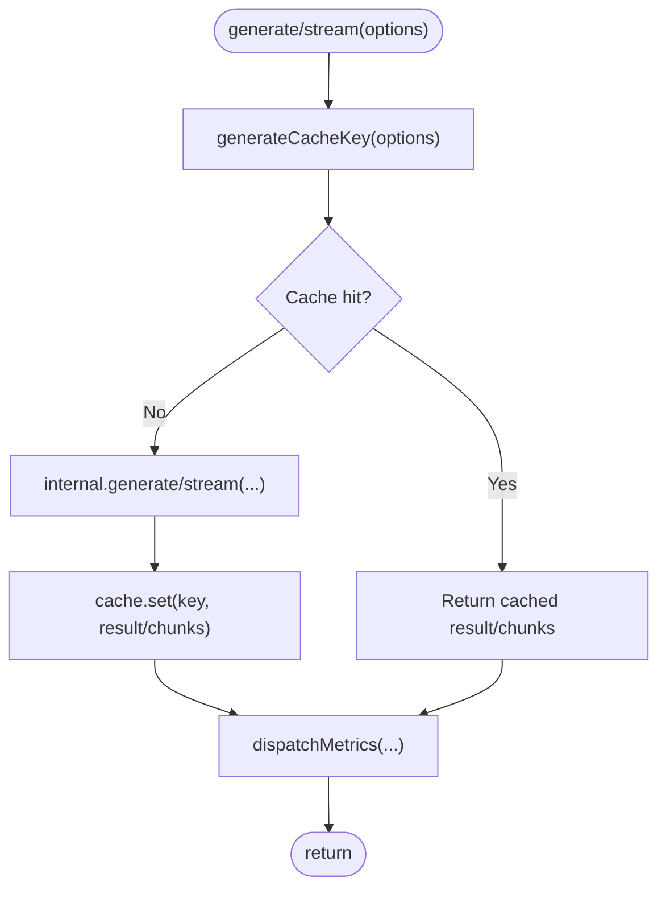
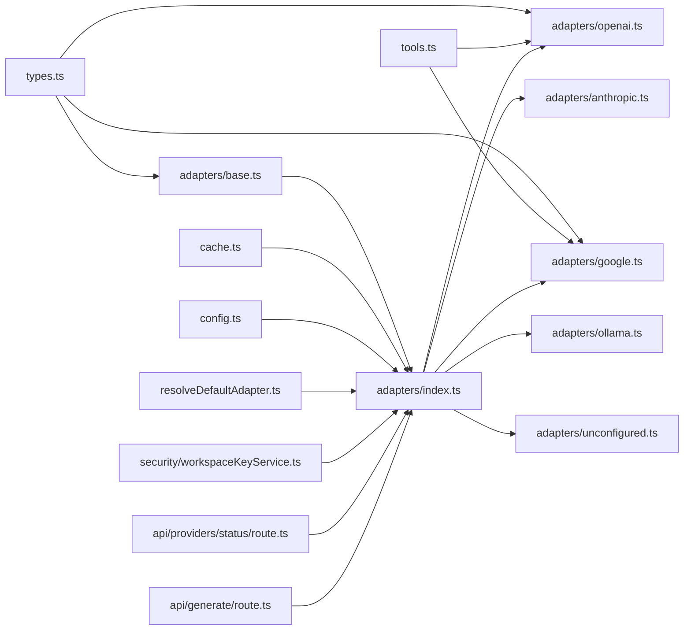

# AI Provider Adapter System

<cite>
**Referenced Files in This Document**
- [lib/ai/adapters/base.ts](file://lib/ai/adapters/base.ts)
- [lib/ai/adapters/index.ts](file://lib/ai/adapters/index.ts)
- [lib/ai/types.ts](file://lib/ai/types.ts)
- [lib/ai/adapters/openai.ts](file://lib/ai/adapters/openai.ts)
- [lib/ai/adapters/anthropic.ts](file://lib/ai/adapters/anthropic.ts)
- [lib/ai/adapters/google.ts](file://lib/ai/adapters/google.ts)
- [lib/ai/adapters/ollama.ts](file://lib/ai/adapters/ollama.ts)
- [lib/ai/adapters/unconfigured.ts](file://lib/ai/adapters/unconfigured.ts)
- [lib/ai/tools.ts](file://lib/ai/tools.ts)
- [lib/ai/cache.ts](file://lib/ai/cache.ts)
- [lib/ai/resolveDefaultAdapter.ts](file://lib/ai/resolveDefaultAdapter.ts)
- [lib/security/workspaceKeyService.ts](file://lib/security/workspaceKeyService.ts)
- [app/api/providers/status/route.ts](file://app/api/providers/status/route.ts)
- [app/api/generate/route.ts](file://app/api/generate/route.ts)
</cite>

## Update Summary
**Changes Made**
- Updated to reflect the removal of universal LLM_KEY support and automatic provider detection
- Enhanced documentation to clarify the current explicit provider configuration requirement
- Updated credential resolution hierarchy to only include workspace keys and provider-specific environment variables
- Removed references to universal fallback mechanism and automatic provider detection
- Enhanced error messaging documentation for missing provider-specific keys
- Updated troubleshooting guidance to reflect current explicit configuration requirements

## Table of Contents
1. [Introduction](#introduction)
2. [Project Structure](#project-structure)
3. [Core Components](#core-components)
4. [Architecture Overview](#architecture-overview)
5. [Detailed Component Analysis](#detailed-component-analysis)
6. [Dependency Analysis](#dependency-analysis)
7. [Performance Considerations](#performance-considerations)
8. [Troubleshooting Guide](#troubleshooting-guide)
9. [Conclusion](#conclusion)
10. [Appendices](#appendices)

## Introduction
This document describes the universal AI adapter system that powers the AI engine. The system currently supports five distinct AI providers: OpenAI, Anthropic, Google, Groq (OpenAI-compatible), and Ollama (local). The adapter pattern isolates provider-specific logic behind a shared interface while maintaining robust credential resolution, standardized request/response formats, and comprehensive error handling. **Current State**: The system requires explicit provider configuration through dedicated environment variables for each provider, with enhanced security measures and improved error messaging.

**Important Note**: The universal LLM_KEY fallback mechanism and automatic provider detection have been completely removed from the codebase. The system now enforces explicit provider configuration for all providers.

## Project Structure
The AI adapter system lives under lib/ai and is composed of:
- A base adapter interface and shared types
- Provider-specific adapters (OpenAI, Anthropic, Google, Groq, Ollama)
- A factory and registry that selects and instantiates adapters with explicit provider configuration
- A pluggable cache layer for generation results and streams
- Tool definitions and conversion helpers for function calling
- Configuration shims and environment-based resolver utilities
- Enhanced credential resolution with explicit provider scoping

**Diagram sources**
- [lib/ai/adapters/base.ts](file://lib/ai/adapters/base.ts)
- [lib/ai/adapters/index.ts](file://lib/ai/adapters/index.ts)
- [lib/ai/types.ts](file://lib/ai/types.ts)
- [lib/ai/tools.ts](file://lib/ai/tools.ts)
- [lib/ai/cache.ts](file://lib/ai/cache.ts)
- [lib/ai/adapters/openai.ts](file://lib/ai/adapters/openai.ts)
- [lib/ai/adapters/anthropic.ts](file://lib/ai/adapters/anthropic.ts)
- [lib/ai/adapters/google.ts](file://lib/ai/adapters/google.ts)
- [lib/ai/adapters/ollama.ts](file://lib/ai/adapters/ollama.ts)
- [lib/ai/adapters/unconfigured.ts](file://lib/ai/adapters/unconfigured.ts)
- [lib/ai/resolveDefaultAdapter.ts](file://lib/ai/resolveDefaultAdapter.ts)
- [lib/security/workspaceKeyService.ts](file://lib/security/workspaceKeyService.ts)
- [app/api/providers/status/route.ts](file://app/api/providers/status/route.ts)
- [app/api/generate/route.ts](file://app/api/generate/route.ts)

**Section sources**
- [lib/ai/adapters/index.ts](file://lib/ai/adapters/index.ts)

## Core Components
- Base adapter interface: Defines the provider-agnostic contract for generating and streaming completions.
- Shared types: Provide client-safe message, generation, streaming, and pricing types.
- Provider adapters: Implementations for OpenAI, Anthropic, Google, Groq (cloud providers), and Ollama (local provider); plus a fallback adapter for unconfigured environments.
- Factory and registry: Securely resolves credentials through explicit provider configuration and instantiates adapters.
- Caching: Adds a pluggable cache around generation and streaming calls.
- Tools: Canonical tool schema and conversion helpers for cross-provider function calling.
- Configuration shims: Backward-compatible exports and environment-based adapter resolver with explicit provider validation.
- Enhanced credential resolution: Explicit provider configuration system with dedicated environment variables for each provider.

**Section sources**
- [lib/ai/adapters/base.ts](file://lib/ai/adapters/base.ts)
- [lib/ai/types.ts](file://lib/ai/types.ts)
- [lib/ai/adapters/index.ts](file://lib/ai/adapters/index.ts)
- [lib/ai/cache.ts](file://lib/ai/cache.ts)
- [lib/ai/tools.ts](file://lib/ai/tools.ts)
- [lib/ai/resolveDefaultAdapter.ts](file://lib/ai/resolveDefaultAdapter.ts)

## Architecture Overview
The system separates concerns with enhanced credential resolution supporting both cloud providers and local Ollama execution, now with explicit provider configuration:
- Application code interacts with the AIAdapter interface.
- The factory selects a concrete adapter based on explicit provider configuration.
- Adapters normalize provider differences and expose a unified request/response model.
- A caching layer improves performance and reduces costs.
- Tools enable function calling across providers with a single canonical schema.
- **Current State**: Explicit provider configuration system supports all five providers including Ollama.
- **Enhanced Security**: Provider-specific environment variables prevent cross-provider credential leakage.

**Diagram sources**
- [lib/ai/adapters/index.ts](file://lib/ai/adapters/index.ts)

## Detailed Component Analysis

### Base Adapter Interface and Shared Types
- AIAdapter defines provider, generate(), and stream().
- GenerateOptions and GenerateResult define the standardized request/response contract.
- StreamChunk captures incremental deltas and optional usage on the final chunk.
- ProviderName enumerates supported providers (OpenAI, Anthropic, Google, Groq, Ollama, unconfigured).
- Pricing utilities estimate USD cost based on provider/model.

**Diagram sources**
- [lib/ai/adapters/base.ts](file://lib/ai/adapters/base.ts)
- [lib/ai/types.ts](file://lib/ai/types.ts)

**Section sources**
- [lib/ai/adapters/base.ts](file://lib/ai/adapters/base.ts)
- [lib/ai/types.ts](file://lib/ai/types.ts)

### Factory Pattern and Dynamic Adapter Instantiation
- getWorkspaceAdapter resolves credentials from workspace storage or explicit environment variables, then delegates to createAdapter.
- createAdapter detects provider from explicit configuration and validates API keys, returning a CachedAdapter-wrapped provider adapter.
- For unknown providers, it falls back to UnconfiguredAdapter to avoid hard failures.
- Legacy getAdapter remains for backward compatibility but should be migrated to getWorkspaceAdapter.
- **Enhanced Security**: Provider-specific environment variables prevent cross-provider credential leakage.

**Diagram sources**
- [lib/ai/adapters/index.ts](file://lib/ai/adapters/index.ts)

**Section sources**
- [lib/ai/adapters/index.ts](file://lib/ai/adapters/index.ts)

### Enhanced Credential Resolution System

#### Explicit Provider Configuration Only
**Current State** The system requires explicit provider-specific API keys for all providers:

**Enhanced Credential Resolution Hierarchy:**
1. **Database Check**: Workspace-scoped keys via workspaceKeyService
2. **Environment Variable Check**: Provider-specific keys (OPENAI_API_KEY, ANTHROPIC_API_KEY, GOOGLE_API_KEY, GROQ_API_KEY, OLLAMA_API_KEY)
3. **Failure**: UnconfiguredAdapter for graceful degradation

**Explicit Provider Configuration Implementation:**
- The system checks for provider-specific environment variables for all providers
- Each provider has its own dedicated environment variable including Ollama
- If no provider-specific key is found, the system returns UnconfiguredAdapter with clear error messaging
- Works transparently across all cloud providers with proper validation
- Provides simplified deployment configuration with explicit provider scoping

**Diagram sources**
- [lib/ai/adapters/index.ts](file://lib/ai/adapters/index.ts)

**Section sources**
- [lib/ai/adapters/index.ts](file://lib/ai/adapters/index.ts)

### Enhanced Provider Detection Logic

#### Current Provider Support Matrix
**Current State** The system supports five providers with explicit configuration:

**resolveLlmProvider Function:**
- Analyzes provider-specific environment variables for explicit provider specification
- Supports all five providers: OpenAI, Anthropic, Google, Groq, and Ollama
- Returns clear error messages when provider-specific keys are missing

**Enhanced Security Features:**
- Provider-specific environment variables prevent cross-provider credential leakage
- No universal key validation occurs
- Clear error messages guide users to fix configuration issues
- Comprehensive logging helps diagnose provider detection problems

**Key Format Patterns:**
- **OpenAI**: OPENAI_API_KEY (sk-proj-..., sk-..., sk_live_...)
- **Anthropic**: ANTHROPIC_API_KEY (sk-ant-..., sk-ant-api...)
- **Google**: GOOGLE_API_KEY (AIzaSy...) or GEMINI_API_KEY (AIzaSy...)
- **Groq**: GROQ_API_KEY (gsk_..., gsk_live_...)
- **Ollama**: OLLAMA_API_KEY (supports local models at localhost:11434)

**Enhanced Debugging Output:**
- Console logs show provider resolution process with explicit configuration
- Clear error messages indicate when provider-specific keys are missing
- Detailed logging helps diagnose configuration issues
- Guidance messages direct users to set provider-specific environment variables

**Section sources**
- [lib/ai/resolveDefaultAdapter.ts](file://lib/ai/resolveDefaultAdapter.ts)

### Provider-Specific Implementations

#### OpenAIAdapter
- Supports GPT reasoning models with special parameter handling (no temperature, different max token field).
- Normalizes system/user messages for models that disallow system role.
- Applies provider-specific caps and flags (e.g., Hugging Face token cap, aggregator/tool restrictions).
- Converts tool definitions and tool choices to OpenAI format and back.

**Diagram sources**
- [lib/ai/adapters/openai.ts](file://lib/ai/adapters/openai.ts)

**Section sources**
- [lib/ai/adapters/openai.ts](file://lib/ai/adapters/openai.ts)

#### AnthropicAdapter
- Uses the native Anthropic /v1/messages API via fetch.
- Converts messages to Anthropic's expected shape and enforces per-model output caps.
- Streams via SSE-like events and yields delta chunks.

**Diagram sources**
- [lib/ai/adapters/anthropic.ts](file://lib/ai/adapters/anthropic.ts)

**Section sources**
- [lib/ai/adapters/anthropic.ts](file://lib/ai/adapters/anthropic.ts)

#### GoogleAdapter
- Wraps Google AI Studio via OpenAI-compatible endpoint.
- Applies provider-specific constraints (e.g., response_format rejected).

**Section sources**
- [lib/ai/adapters/google.ts](file://lib/ai/adapters/google.ts)

#### OllamaAdapter
- Uses the OpenAI-compatible API exposed by Ollama at http://localhost:11434/v1.
- Supports local model execution with tool calling for compatible models.
- Works independently of other credential resolution mechanisms.

**Section sources**
- [lib/ai/adapters/ollama.ts](file://lib/ai/adapters/ollama.ts)

#### UnconfiguredAdapter
- Graceful fallback when no credentials are available.
- Returns either structured JSON for JSON mode or a React alert component for UI.
- **Enhanced**: Now provides structured JSON responses for API calls with clear configuration guidance.

**Section sources**
- [lib/ai/adapters/unconfigured.ts](file://lib/ai/adapters/unconfigured.ts)

### Configuration Management and Authentication Handling
- getWorkspaceAdapter prioritizes workspace-scoped keys, then environment variables, and finally returns UnconfiguredAdapter.
- Environment variables are checked per provider using dedicated environment variables.
- **Enhanced Security**: Provider-specific environment variables prevent cross-provider credential leakage.
- ConfigurationError is thrown when a provider requires a key but none is found.

**Diagram sources**
- [lib/ai/adapters/index.ts](file://lib/ai/adapters/index.ts)

**Section sources**
- [lib/ai/adapters/index.ts](file://lib/ai/adapters/index.ts)

### Standardized Request/Response Formats
- Messages: role and content.
- GenerateOptions: model, messages, temperature, maxTokens, responseFormat, tools, toolChoice.
- GenerateResult: content, optional toolCalls, optional usage, raw provider response.
- StreamChunk: delta text, done flag, optional usage on the final chunk.

**Section sources**
- [lib/ai/types.ts](file://lib/ai/types.ts)

### Error Handling Strategies and Fallback Mechanisms
- ConfigurationError surfaces missing keys with actionable messages.
- UnconfiguredAdapter prevents server crashes and guides users to configure credentials.
- Upstash Redis initialization failure is handled gracefully; cache writes are best-effort.
- Provider adapters handle HTTP errors and malformed responses.
- **Enhanced Security**: Cross-provider credential leakage prevention through explicit provider configuration.
- **New**: Clear error messages for missing provider-specific environment variables.

**Section sources**
- [lib/ai/adapters/index.ts](file://lib/ai/adapters/index.ts)
- [lib/ai/adapters/anthropic.ts](file://lib/ai/adapters/anthropic.ts)
- [lib/ai/cache.ts](file://lib/ai/cache.ts)

### Caching and Metrics
- CachedAdapter wraps any AIAdapter to cache full results and streamed chunks.
- Cache keys are deterministically derived from model, messages, temperature, and tools.
- Metrics are dispatched after each call with provider, model, token usage, latency, and cache hit status.

**Diagram sources**
- [lib/ai/adapters/index.ts](file://lib/ai/adapters/index.ts)
- [lib/ai/cache.ts](file://lib/ai/cache.ts)

**Section sources**
- [lib/ai/adapters/index.ts](file://lib/ai/adapters/index.ts)
- [lib/ai/cache.ts](file://lib/ai/cache.ts)

### Tools and Function Calling
- Canonical Tool schema with name, description, JSON Schema parameters, and execute function.
- Conversion helpers translate between unified tools and provider-specific formats.
- executeToolCalls runs requested tool calls in parallel and returns results formatted for continuation.

**Section sources**
- [lib/ai/tools.ts](file://lib/ai/tools.ts)

### Environment-Based Defaults and Backward Compatibility
- config.ts re-exports factory and resolver for backward compatibility.
- resolveDefaultAdapter chooses the first available provider key based on explicit configuration.
- **Enhanced Security**: Provider-specific environment variables prevent cross-provider credential leakage.

**Section sources**
- [lib/ai/resolveDefaultAdapter.ts](file://lib/ai/resolveDefaultAdapter.ts)

## Dependency Analysis
The adapter system exhibits low coupling and high cohesion with enhanced credential resolution and security measures:
- Adapters depend on shared types and tools.
- The factory depends on workspace key service, environment variables, adapters.
- Caching is orthogonal and composable via decorator pattern.
- Tools are isolated and converted at adapter boundaries.

**Diagram sources**
- [lib/ai/adapters/base.ts](file://lib/ai/adapters/base.ts)
- [lib/ai/adapters/index.ts](file://lib/ai/adapters/index.ts)
- [lib/ai/types.ts](file://lib/ai/types.ts)
- [lib/ai/tools.ts](file://lib/ai/tools.ts)
- [lib/ai/cache.ts](file://lib/ai/cache.ts)
- [lib/ai/adapters/openai.ts](file://lib/ai/adapters/openai.ts)
- [lib/ai/adapters/anthropic.ts](file://lib/ai/adapters/anthropic.ts)
- [lib/ai/adapters/google.ts](file://lib/ai/adapters/google.ts)
- [lib/ai/adapters/ollama.ts](file://lib/ai/adapters/ollama.ts)
- [lib/ai/adapters/unconfigured.ts](file://lib/ai/adapters/unconfigured.ts)
- [lib/ai/resolveDefaultAdapter.ts](file://lib/ai/resolveDefaultAdapter.ts)
- [lib/security/workspaceKeyService.ts](file://lib/security/workspaceKeyService.ts)
- [app/api/providers/status/route.ts](file://app/api/providers/status/route.ts)
- [app/api/generate/route.ts](file://app/api/generate/route.ts)

**Section sources**
- [lib/ai/adapters/index.ts](file://lib/ai/adapters/index.ts)

## Performance Considerations
- Prefer CachedAdapter to reduce repeated calls for identical prompts.
- Tune temperature and maxTokens to balance quality and cost.
- Use streaming for long-form generation to improve perceived latency.
- Monitor token usage via pricing utilities and metrics.
- For cloud providers, ensure network connectivity to provider endpoints; otherwise use UnconfiguredAdapter for graceful UX.
- **Current State**: Explicit provider configuration provides consistent performance across all five providers with simplified credential management.
- **Enhanced Security**: Provider-specific environment variables add minimal overhead while preventing costly authentication failures.

## Troubleshooting Guide
- Missing API key: Expect UnconfiguredAdapter behavior. Configure provider-specific key in workspace settings or environment variables.
- **Enhanced Security**: Cross-provider credential issues: Verify the correct provider-specific environment variable is set.
- **New**: Provider-specific environment variable configuration: Set the appropriate environment variable (OPENAI_API_KEY, ANTHROPIC_API_KEY, GOOGLE_API_KEY, GROQ_API_KEY, OLLAMA_API_KEY) for each provider.
- Provider-specific constraints: Some providers reject certain parameters (e.g., response_format, tools, temperature). The adapters normalize these differences.
- Network connectivity: All providers require internet access for cloud-based execution except Ollama which runs locally.
- Tool execution: Ensure tool names match and parameters conform to the declared schema; mismatches are handled gracefully.
- **Enhanced**: Provider-specific key troubleshooting: Verify the correct environment variable is set and accessible to all provider adapters.
- **New**: Explicit provider configuration: Set the appropriate provider-specific environment variable when configuring credentials.
- **New**: Enhanced error messages: The system now provides specific environment variable instructions when credentials are missing.
- **New**: Debug logging: Enable development mode to see detailed provider resolution logs including explicit provider configuration results.

**Section sources**
- [lib/ai/adapters/index.ts](file://lib/ai/adapters/index.ts)
- [lib/ai/adapters/anthropic.ts](file://lib/ai/adapters/anthropic.ts)
- [lib/ai/adapters/openai.ts](file://lib/ai/adapters/openai.ts)
- [lib/ai/adapters/unconfigured.ts](file://lib/ai/adapters/unconfigured.ts)

## Conclusion
The AI adapter system cleanly separates provider logic behind a unified interface, enforces secure credential resolution, and standardizes request/response formats. **Current State**: The system supports five distinct provider options: OpenAI, Anthropic, Google, Groq (cloud providers), and Ollama (local provider). The enhanced security features prevent cross-provider credential leakage through explicit provider configuration. It offers robust caching, streaming, tool calling, and graceful fallbacks. Extending the system with new providers is straightforward: implement an adapter, register it in the factory, add provider-specific environment variable handling with proper validation, and leverage the enhanced security features.

## Appendices

### How to Add a New AI Provider
- Define a new adapter class implementing AIAdapter in lib/ai/adapters/<provider>.ts.
- Normalize provider-specific message and parameter formats inside the adapter.
- Export the adapter from lib/ai/adapters/index.ts and update the factory switch to handle the new provider id.
- Add environment variable checks and error messages for missing keys.
- **Enhanced Security**: Ensure proper provider-specific environment variable configuration.
- Optionally integrate tool conversion helpers if the provider supports function calling.
- Add pricing entries in types.ts if cost estimation is desired.

**Section sources**
- [lib/ai/adapters/index.ts](file://lib/ai/adapters/index.ts)
- [lib/ai/types.ts](file://lib/ai/types.ts)

### Best Practices for Custom Integrations
- Keep credentials server-only; never accept API keys from clients.
- Use getWorkspaceAdapter for secure resolution and UnconfiguredAdapter for graceful UX.
- Wrap adapters with CachedAdapter to reduce latency and cost.
- Validate tool schemas and handle tool execution errors.
- Instrument metrics and logging for observability.
- **Enhanced Security**: Always set the correct provider-specific environment variable for each provider.

### Enhanced Provider Configuration Guide
**Setting Up Provider-Specific Keys:**
1. Set the appropriate environment variable for each provider in your deployment platform:
   - OPENAI_API_KEY for OpenAI
   - ANTHROPIC_API_KEY for Anthropic
   - GOOGLE_API_KEY or GEMINI_API_KEY for Google
   - GROQ_API_KEY for Groq
   - OLLAMA_API_KEY for Ollama (supports local models)
2. The system will automatically detect and use the correct provider-specific key
3. Check console logs for confirmation: "[getWorkspaceAdapter] ✓ Using [PROVIDER]_API_KEY for [provider]"

**Benefits:**
- Simplified deployment configuration with explicit provider scoping
- Reduced environment variable management complexity
- Transparent fallback across all cloud providers
- Enhanced security through provider isolation
- Easier team onboarding and credential sharing

**Security Features:**
- Provider-specific environment variables prevent cross-provider credential leakage
- No universal key validation occurs
- Enhanced troubleshooting with detailed logging
- Clear error messages guide users to fix configuration issues

**Enhanced Troubleshooting:**
- The system provides specific environment variable instructions when keys are missing
- Console logs show detailed provider configuration results
- Clear error messages guide users to fix configuration issues

**Enhanced Key Format Patterns:**
- **OpenAI**: sk-proj-... (specific) | sk-... (generic) | sk_live_...
- **Anthropic**: sk-ant-... | sk-ant-api...
- **Google**: AIzaSy... (GOOGLE_API_KEY) | AIzaSy... (GEMINI_API_KEY)
- **Groq**: gsk_... | gsk_live_...
- **Ollama**: Supports local models at localhost:11434 with dedicated OLLAMA_API_KEY

**Section sources**
- [lib/ai/adapters/index.ts](file://lib/ai/adapters/index.ts)
- [app/api/providers/status/route.ts](file://app/api/providers/status/route.ts)

### Enhanced Provider Detection Logic
**Current State** The system now uses an improved provider detection approach:
- Provider detection prioritizes explicit provider-specific environment variables over model-based inference
- **Enhanced Security**: Provider-specific environment variables prevent cross-provider credential usage
- **Enhanced Error Messaging**: Comprehensive logging helps diagnose provider configuration issues
- This prevents conflicts between local Ollama models and cloud provider models

**Section sources**
- [lib/ai/adapters/index.ts](file://lib/ai/adapters/index.ts)
- [lib/ai/resolveDefaultAdapter.ts](file://lib/ai/resolveDefaultAdapter.ts)

### Vision Review Optimization
**Current State** The system now uses a simplified skipVisionReview approach:
- Vision review is skipped for Groq provider to avoid cost-prohibitive second API call
- This replaces the previous complex isLocalModel detection across multiple providers
- Reduces latency and cost for local model execution scenarios
- Maintains quality assurance through cloud-based review when available

**Section sources**
- [app/api/generate/route.ts](file://app/api/generate/route.ts)

### Enhanced Security Features
**Current State** The system now includes several enhanced security features:

**Provider-Specific Credential Isolation:**
- Provider-specific environment variables are validated before being accepted
- Prevents accidental cross-provider authentication failures and security breaches

**Explicit Provider Configuration:**
- Provider-specific environment variables are required for each provider
- Default fallback to unconfigured when provider-specific environment variables are missing
- Comprehensive logging helps diagnose credential configuration issues

**Enhanced Logging and Debugging:**
- Detailed console logs show provider-specific key validation results
- Provider configuration decisions are clearly logged for troubleshooting
- Debug information helps identify configuration issues quickly

**Enhanced Error Messaging:**
- Specific environment variable instructions when credentials are missing
- Clear guidance on how to fix configuration issues
- Comprehensive logging for debugging adapter selection problems

**Section sources**
- [lib/ai/adapters/index.ts](file://lib/ai/adapters/index.ts)
- [lib/ai/resolveDefaultAdapter.ts](file://lib/ai/resolveDefaultAdapter.ts)
- [app/api/providers/status/route.ts](file://app/api/providers/status/route.ts)

### Enhanced UnconfiguredAdapter with Structured Responses
**New** The UnconfiguredAdapter now provides enhanced user experience:

**Structured JSON Responses:**
- For API calls with JSON response format, returns structured JSON with clear configuration guidance
- Includes fields like intentType, confidence, summary, needsClarification, and clarificationQuestion
- Provides fallback fields for Thinking schemas with steps array

**Enhanced UI Experience:**
- Returns React components with clear instructions for manual configuration
- Includes step-by-step guidance with numbered instructions
- Provides quick start instructions for common providers (Groq, OpenAI)
- Uses visual elements like colored alerts and icons for better user experience

**Section sources**
- [lib/ai/adapters/unconfigured.ts](file://lib/ai/adapters/unconfigured.ts)

### Enhanced Provider Status API
**Current State** The providers/status API now includes enhanced provider configuration:

**Explicit Provider Configuration Integration:**
- The API checks for provider-specific environment variables
- All providers appear configured in the UI when provider-specific environment variables are valid
- Backend validates provider-specific key configuration with enhanced error messaging

**Enhanced Debugging:**
- Logs available environment variables for troubleshooting
- Shows provider-specific key presence and validation results
- Provides detailed configuration status for each provider
- Includes debug information in development mode with clear error messages

**Section sources**
- [app/api/providers/status/route.ts](file://app/api/providers/status/route.ts)