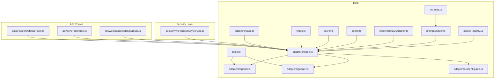
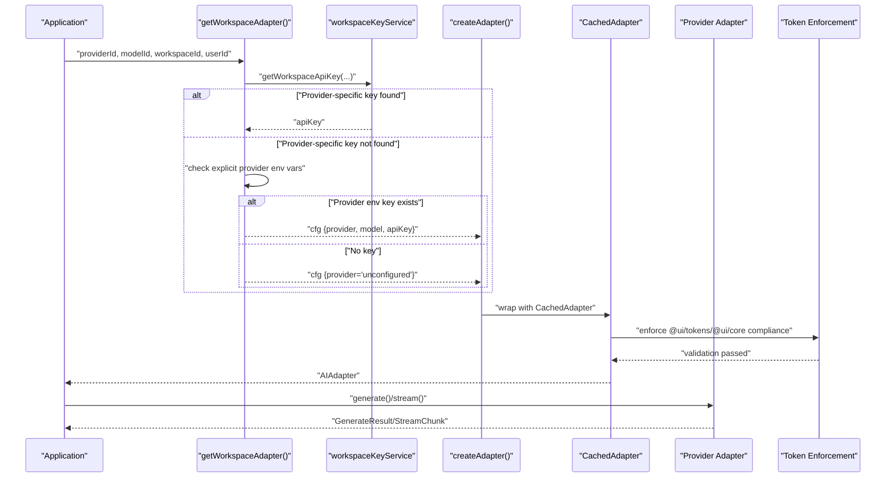
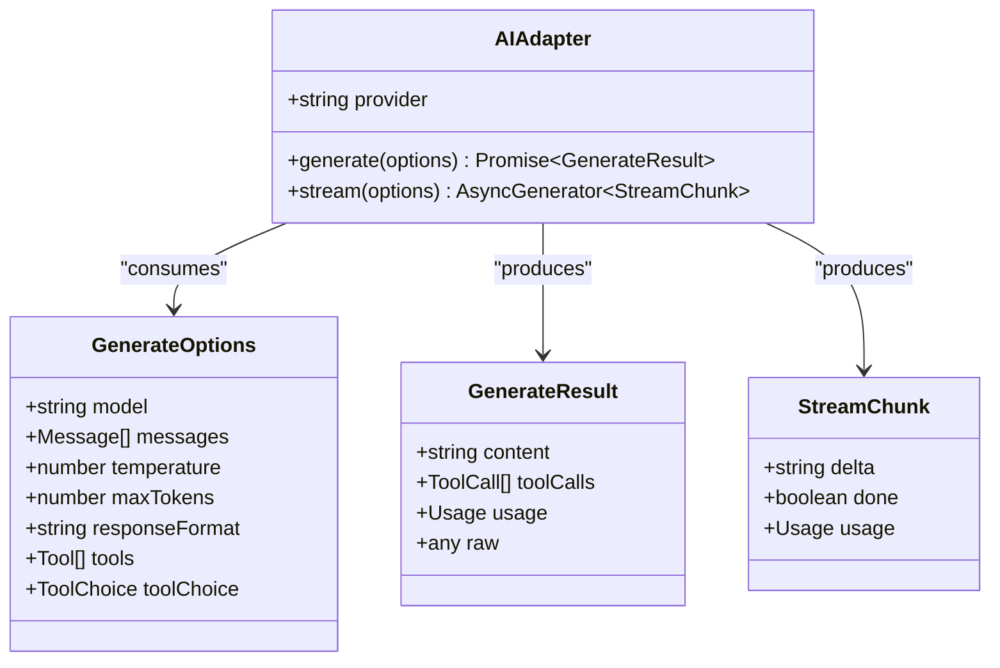
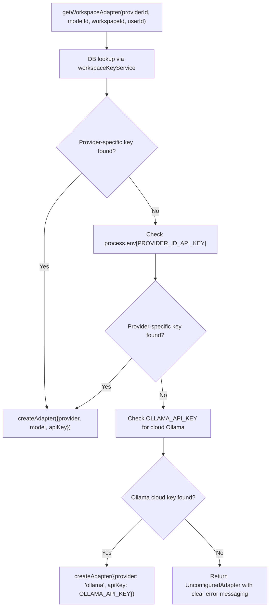
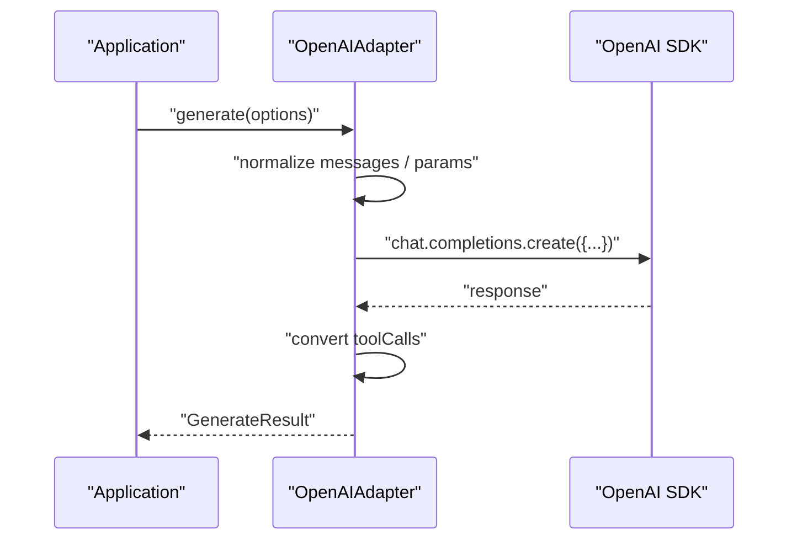
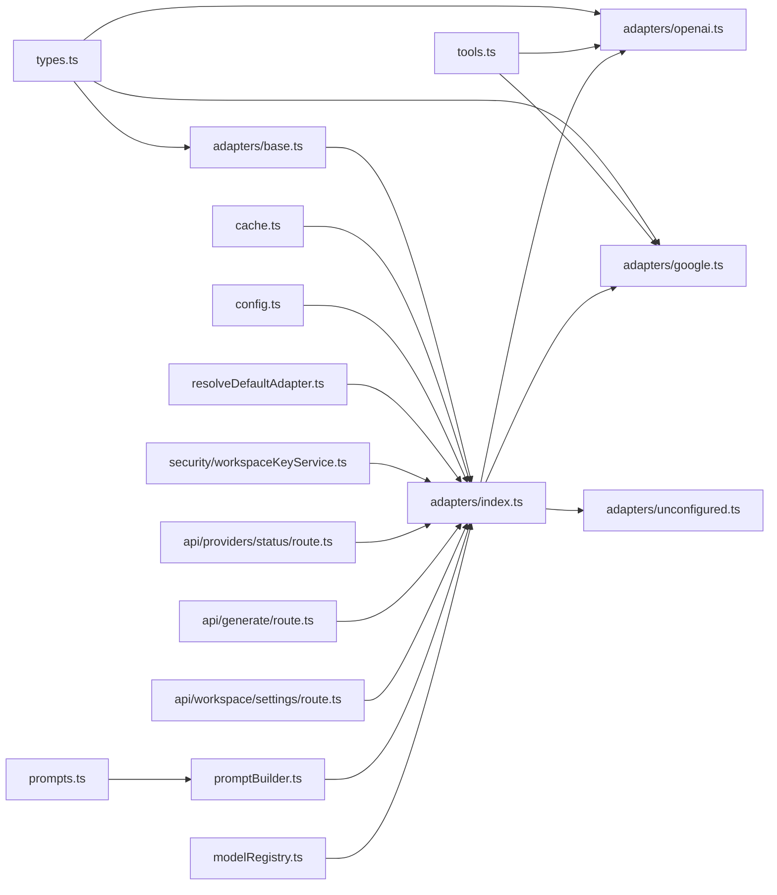

# AI Provider Adapter System

<cite>
**Referenced Files in This Document**
- [lib/ai/adapters/base.ts](file://lib/ai/adapters/base.ts)
- [lib/ai/adapters/index.ts](file://lib/ai/adapters/index.ts)
- [lib/ai/types.ts](file://lib/ai/types.ts)
- [lib/ai/adapters/openai.ts](file://lib/ai/adapters/openai.ts)
- [lib/ai/adapters/google.ts](file://lib/ai/adapters/google.ts)
- [lib/ai/adapters/unconfigured.ts](file://lib/ai/adapters/unconfigured.ts)
- [lib/ai/tools.ts](file://lib/ai/tools.ts)
- [lib/ai/cache.ts](file://lib/ai/cache.ts)
- [lib/ai/resolveDefaultAdapter.ts](file://lib/ai/resolveDefaultAdapter.ts)
- [lib/security/workspaceKeyService.ts](file://lib/security/workspaceKeyService.ts)
- [app/api/providers/status/route.ts](file://app/api/providers/status/route.ts)
- [app/api/generate/route.ts](file://app/api/generate/route.ts)
- [app/api/workspace/settings/route.ts](file://app/api/workspace/settings/route.ts)
- [lib/ai/prompts.ts](file://lib/ai/prompts.ts)
- [lib/ai/promptBuilder.ts](file://lib/ai/promptBuilder.ts)
- [lib/ai/modelRegistry.ts](file://lib/ai/modelRegistry.ts)
</cite>

## Update Summary
**Changes Made**
- Updated Ollama Cloud model naming from 'gemma4:e2b' to 'gemma4' for base model identification
- Corrected model registry entries to use base model names for Ollama Cloud integration
- Updated default adapter configuration to reflect the new base model naming convention
- Enhanced model resolution logic to handle base model names consistently across the system
- Improved model identification and lookup mechanisms for Ollama Cloud models

## Table of Contents
1. [Introduction](#introduction)
2. [Project Structure](#project-structure)
3. [Core Components](#core-components)
4. [Architecture Overview](#architecture-overview)
5. [Detailed Component Analysis](#detailed-component-analysis)
6. [Dependency Analysis](#dependency-analysis)
7. [Performance Considerations](#performance-considerations)
8. [Troubleshooting Guide](#troubleshooting-guide)
9. [Conclusion](#conclusion)
10. [Appendices](#appendices)

## Introduction
This document describes the universal AI adapter system that powers the AI engine. The system now supports four distinct AI providers: OpenAI, Google, Groq (OpenAI-compatible), and Ollama (cloud-based OpenAI-compatible). The adapter pattern isolates provider-specific logic behind a shared interface while maintaining robust credential resolution, standardized request/response formats, and comprehensive error handling. **Current State**: The system supports explicit provider configuration through dedicated environment variables for each provider, with enhanced security measures and improved error messaging.

**Important Note**: The universal LLM_KEY fallback mechanism and automatic provider detection have been completely removed from the codebase. The system now enforces explicit provider configuration for all providers. Ollama cloud integration has been added as the fourth provider option, replacing the previous self-hosted Ollama configuration with cloud-based authentication. **Critical Enhancement**: Strict design system enforcement now requires @ui/tokens and @ui/core usage with 'VIOLATION = REJECT' penalties for non-compliance.

## Project Structure
The AI adapter system lives under lib/ai and is composed of:
- A base adapter interface and shared types
- Provider-specific adapters (OpenAI, Google, Groq, Ollama)
- A factory and registry that selects and instantiates adapters with explicit provider configuration
- A pluggable cache layer for generation results and streams
- Tool definitions and conversion helpers for function calling
- Configuration shims and environment-based resolver utilities
- Enhanced credential resolution with explicit provider scoping
- **New**: Critical token rule enforcement for design system compliance

**Diagram sources**
- [lib/ai/adapters/base.ts](file://lib/ai/adapters/base.ts)
- [lib/ai/adapters/index.ts](file://lib/ai/adapters/index.ts)
- [lib/ai/types.ts](file://lib/ai/types.ts)
- [lib/ai/tools.ts](file://lib/ai/tools.ts)
- [lib/ai/cache.ts](file://lib/ai/cache.ts)
- [lib/ai/adapters/openai.ts](file://lib/ai/adapters/openai.ts)
- [lib/ai/adapters/google.ts](file://lib/ai/adapters/google.ts)
- [lib/ai/adapters/unconfigured.ts](file://lib/ai/adapters/unconfigured.ts)
- [lib/ai/resolveDefaultAdapter.ts](file://lib/ai/resolveDefaultAdapter.ts)
- [lib/security/workspaceKeyService.ts](file://lib/security/workspaceKeyService.ts)
- [app/api/providers/status/route.ts](file://app/api/providers/status/route.ts)
- [app/api/generate/route.ts](file://app/api/generate/route.ts)
- [app/api/workspace/settings/route.ts](file://app/api/workspace/settings/route.ts)
- [lib/ai/prompts.ts](file://lib/ai/prompts.ts)
- [lib/ai/promptBuilder.ts](file://lib/ai/promptBuilder.ts)
- [lib/ai/modelRegistry.ts](file://lib/ai/modelRegistry.ts)

**Section sources**
- [lib/ai/adapters/index.ts](file://lib/ai/adapters/index.ts)

## Core Components
- Base adapter interface: Defines the provider-agnostic contract for generating and streaming completions.
- Shared types: Provide client-safe message, generation, streaming, and pricing types.
- Provider adapters: Implementations for OpenAI, Google, Groq (cloud providers), and Ollama (cloud-based); plus a fallback adapter for unconfigured environments.
- Factory and registry: Securely resolves credentials through explicit provider configuration and instantiates adapters.
- Caching: Adds a pluggable cache around generation and streaming calls.
- Tools: Canonical tool schema and conversion helpers for cross-provider function calling.
- Configuration shims: Backward-compatible exports and environment-based adapter resolver with explicit provider validation.
- Enhanced credential resolution: Explicit provider configuration system with dedicated environment variables for each provider.
- **New**: Critical token rule enforcement: Strict design system compliance requiring @ui/tokens and @ui/core usage with 'VIOLATION = REJECT' penalties.

**Section sources**
- [lib/ai/adapters/base.ts](file://lib/ai/adapters/base.ts)
- [lib/ai/types.ts](file://lib/ai/types.ts)
- [lib/ai/adapters/index.ts](file://lib/ai/adapters/index.ts)
- [lib/ai/cache.ts](file://lib/ai/cache.ts)
- [lib/ai/tools.ts](file://lib/ai/tools.ts)
- [lib/ai/resolveDefaultAdapter.ts](file://lib/ai/resolveDefaultAdapter.ts)

## Architecture Overview
The system separates concerns with enhanced credential resolution supporting four providers, now with explicit provider configuration:
- Application code interacts with the AIAdapter interface.
- The factory selects a concrete adapter based on explicit provider configuration.
- Adapters normalize provider differences and expose a unified request/response model.
- A caching layer improves performance and reduces costs.
- Tools enable function calling across providers with a single canonical schema.
- **Current State**: Explicit provider configuration system supports four providers including Ollama cloud integration.
- **Enhanced Security**: Provider-specific environment variables prevent cross-provider credential leakage.
- **New**: Critical token enforcement ensures design system compliance with strict penalties for violations.

**Diagram sources**
- [lib/ai/adapters/index.ts](file://lib/ai/adapters/index.ts)

## Detailed Component Analysis

### Base Adapter Interface and Shared Types
- AIAdapter defines provider, generate(), and stream().
- GenerateOptions and GenerateResult define the standardized request/response contract.
- StreamChunk captures incremental deltas and optional usage on the final chunk.
- ProviderName enumerates supported providers (OpenAI, Google, Groq, Ollama, unconfigured).
- Pricing utilities estimate USD cost based on provider/model.

**Diagram sources**
- [lib/ai/adapters/base.ts](file://lib/ai/adapters/base.ts)
- [lib/ai/types.ts](file://lib/ai/types.ts)

**Section sources**
- [lib/ai/adapters/base.ts](file://lib/ai/adapters/base.ts)
- [lib/ai/types.ts](file://lib/ai/types.ts)

### Factory Pattern and Dynamic Adapter Instantiation
- getWorkspaceAdapter resolves credentials from workspace storage or explicit environment variables, then delegates to createAdapter.
- createAdapter detects provider from explicit configuration and validates API keys, returning a CachedAdapter-wrapped provider adapter.
- For unknown providers, it falls back to UnconfiguredAdapter to avoid hard failures.
- **Enhanced Security**: Provider-specific environment variables prevent cross-provider credential leakage.
- **New**: Critical token enforcement integrated into adapter creation process.

**Diagram sources**
- [lib/ai/adapters/index.ts](file://lib/ai/adapters/index.ts)

**Section sources**
- [lib/ai/adapters/index.ts](file://lib/ai/adapters/index.ts)

### Enhanced Credential Resolution System

#### Explicit Provider Configuration for Four Providers
**Current State** The system requires explicit provider-specific API keys for all four providers:

**Enhanced Credential Resolution Hierarchy:**
1. **Database Check**: Workspace-scoped keys via workspaceKeyService
2. **Environment Variable Check**: Provider-specific keys (OPENAI_API_KEY, GOOGLE_API_KEY, GROQ_API_KEY, OLLAMA_API_KEY)
3. **Failure**: UnconfiguredAdapter for graceful degradation

**Updated Ollama Cloud Configuration:**
- **Cloud Integration**: Ollama now uses OLLAMA_API_KEY environment variable for cloud authentication
- **Health Endpoint**: Standardized to 'https://ollama.com/v1/models'
- **Base URL**: No longer configurable via OLLAMA_BASE_URL - uses cloud API directly
- **Authentication**: Required for all Ollama requests with clear error messaging
- **Model Naming**: Now uses base model names (e.g., 'gemma4') instead of tagged formats (e.g., 'gemma4:e2b')

**Explicit Provider Configuration Implementation:**
- The system checks for provider-specific environment variables for all providers
- Each provider has its own dedicated environment variable
- Ollama cloud configuration requires API key authentication
- If no provider-specific key is found, the system returns UnconfiguredAdapter with clear error messaging
- Works transparently across all four providers with proper validation
- Provides simplified deployment configuration with explicit provider scoping

**Diagram sources**
- [lib/ai/adapters/index.ts](file://lib/ai/adapters/index.ts)

**Section sources**
- [lib/ai/adapters/index.ts](file://lib/ai/adapters/index.ts)

### Enhanced Provider Detection Logic

#### Current Provider Support Matrix
**Current State** The system supports four providers with explicit configuration:

**resolveLlmProvider Function:**
- Analyzes provider-specific environment variables for explicit provider specification
- Supports four providers: OpenAI, Google, Groq, and Ollama (cloud)
- Returns clear error messages when provider-specific keys are missing

**Enhanced Security Features:**
- Provider-specific environment variables prevent cross-provider credential leakage
- No universal key validation occurs
- Clear error messages guide users to fix configuration issues
- Comprehensive logging helps diagnose provider detection problems

**Updated Key Format Patterns:**
- **OpenAI**: OPENAI_API_KEY (sk-proj-..., sk-..., sk_live_...)
- **Google**: GOOGLE_API_KEY (AIzaSy...) or GEMINI_API_KEY (AIzaSy...)
- **Groq**: GROQ_API_KEY (gsk_..., gsk_live_...)
- **Ollama**: OLLAMA_API_KEY (required for cloud authentication)

**Enhanced Debugging Output:**
- Console logs show provider resolution process with explicit configuration
- Clear error messages indicate when provider-specific keys are missing
- Detailed logging helps diagnose configuration issues
- Guidance messages direct users to set provider-specific environment variables

**Section sources**
- [lib/ai/resolveDefaultAdapter.ts](file://lib/ai/resolveDefaultAdapter.ts)

### Provider-Specific Implementations

#### OpenAIAdapter
- Supports GPT reasoning models with special parameter handling (no temperature, different max token field).
- Normalizes system/user messages for models that disallow system role.
- Applies provider-specific caps and flags (e.g., Hugging Face token cap, aggregator/tool restrictions).
- Converts tool definitions and tool choices to OpenAI format and back.

**Diagram sources**
- [lib/ai/adapters/openai.ts](file://lib/ai/adapters/openai.ts)

**Section sources**
- [lib/ai/adapters/openai.ts](file://lib/ai/adapters/openai.ts)

#### GoogleAdapter
- Wraps Google AI Studio via OpenAI-compatible endpoint.
- Applies provider-specific constraints (e.g., response_format rejected).

**Section sources**
- [lib/ai/adapters/google.ts](file://lib/ai/adapters/google.ts)

#### OllamaAdapter (Cloud-Based)
- **Updated**: Supports cloud-based Ollama inference via OpenAI-compatible API with authentication.
- Uses OLLAMA_API_KEY environment variable for cloud authentication.
- Health check endpoint standardized to 'https://ollama.com/v1/models'.
- API key is required for all Ollama cloud requests with clear error messaging.
- Recognizes Ollama-specific model patterns (llama3.2, qwen2.5-coder, deepseek-coder, phi4, mistral).
- Integrates seamlessly with the existing OpenAI-compatible adapter infrastructure.
- **New**: Critical token enforcement ensures design system compliance with strict penalties.
- **Updated**: Model naming now uses base model names (e.g., 'gemma4') instead of tagged formats (e.g., 'gemma4:e2b').

**Section sources**
- [lib/ai/adapters/index.ts](file://lib/ai/adapters/index.ts)

#### UnconfiguredAdapter
- Graceful fallback when no credentials are available.
- Returns either structured JSON for JSON mode or a React alert component for UI.
- **Enhanced**: Now provides structured JSON responses for API calls with clear configuration guidance.

**Section sources**
- [lib/ai/adapters/unconfigured.ts](file://lib/ai/adapters/unconfigured.ts)

### Configuration Management and Authentication Handling
- getWorkspaceAdapter prioritizes workspace-scoped keys, then environment variables, and finally returns UnconfiguredAdapter.
- Environment variables are checked per provider using dedicated environment variables.
- **Enhanced Security**: Provider-specific environment variables prevent cross-provider credential leakage.
- ConfigurationError is thrown when a provider requires a key but none is found.

**Diagram sources**
- [lib/ai/adapters/index.ts](file://lib/ai/adapters/index.ts)

**Section sources**
- [lib/ai/adapters/index.ts](file://lib/ai/adapters/index.ts)

### Standardized Request/Response Formats
- Messages: role and content.
- GenerateOptions: model, messages, temperature, maxTokens, responseFormat, tools, toolChoice.
- GenerateResult: content, optional toolCalls, optional usage, raw provider response.
- StreamChunk: delta text, done flag, optional usage on the final chunk.

**Section sources**
- [lib/ai/types.ts](file://lib/ai/types.ts)

### Error Handling Strategies and Fallback Mechanisms
- ConfigurationError surfaces missing keys with actionable messages.
- UnconfiguredAdapter prevents server crashes and guides users to configure credentials.
- Upstash Redis initialization failure is handled gracefully; cache writes are best-effort.
- Provider adapters handle HTTP errors and malformed responses.
- **Enhanced Security**: Cross-provider credential leakage prevention through explicit provider configuration.
- **Updated**: Clear error messages for missing Ollama API key with cloud authentication requirement.
- **New**: Enhanced error handling for Ollama cloud integration with standardized health check endpoint.
- **New**: Critical token enforcement with 'VIOLATION = REJECT' penalties for design system non-compliance.

**Section sources**
- [lib/ai/adapters/index.ts](file://lib/ai/adapters/index.ts)
- [lib/ai/cache.ts](file://lib/ai/cache.ts)

### Caching and Metrics
- CachedAdapter wraps any AIAdapter to cache full results and streamed chunks.
- Cache keys are deterministically derived from model, messages, temperature, and tools.
- Metrics are dispatched after each call with provider, model, token usage, latency, and cache hit status.

**Diagram sources**
- [lib/ai/adapters/index.ts](file://lib/ai/adapters/index.ts)
- [lib/ai/cache.ts](file://lib/ai/cache.ts)

**Section sources**
- [lib/ai/adapters/index.ts](file://lib/ai/adapters/index.ts)
- [lib/ai/cache.ts](file://lib/ai/cache.ts)

### Tools and Function Calling
- Canonical Tool schema with name, description, JSON Schema parameters, and execute function.
- Conversion helpers translate between unified tools and provider-specific formats.
- executeToolCalls runs requested tool calls in parallel and returns results formatted for continuation.

**Section sources**
- [lib/ai/tools.ts](file://lib/ai/tools.ts)

### Environment-Based Defaults and Backward Compatibility
- config.ts re-exports factory and resolver for backward compatibility.
- resolveDefaultAdapter chooses the first available provider key based on explicit configuration.
- **Enhanced Security**: Provider-specific environment variables prevent cross-provider credential leakage.

**Section sources**
- [lib/ai/resolveDefaultAdapter.ts](file://lib/ai/resolveDefaultAdapter.ts)

### Critical Token Rule Enforcement
**New**: The system now enforces strict design system compliance with critical token rules:

**Token Enforcement Rules:**
- **@ui/tokens RULES (CRITICAL — VIOLATION = REJECT)**: If the user mentions colors.primary, colors.surface, space.stackMd, radius.xl, shadow.md, toStyle(), transition.normal, or ANY token name → you MUST import and use those exact tokens. Do NOT substitute with raw Tailwind values.
- **@ui/core RULES (CRITICAL)**: Use Card, CardHeader, CardContent, CardFooter instead of raw 
 containers when building card layouts. Use Badge instead of  for status badges, tags, and labels. Use Button instead of <button> for all interactive buttons. Use Input/Textarea instead of <input>/<textarea> for form fields.
- **Penalty System**: VIOLATION = REJECT - Non-compliant code generation is rejected outright with clear error messages.

**Implementation Details:**
- Enforced in both component generator and app mode prompts
- Integrated into prompt building process with strict validation
- Penalties apply to both generated code and system prompts
- Critical for maintaining design system consistency across all AI-generated components

**Section sources**
- [lib/ai/prompts.ts](file://lib/ai/prompts.ts)
- [lib/ai/promptBuilder.ts](file://lib/ai/promptBuilder.ts)

## Dependency Analysis
The adapter system exhibits low coupling and high cohesion with enhanced credential resolution and security measures:
- Adapters depend on shared types and tools.
- The factory depends on workspace key service, environment variables, adapters.
- Caching is orthogonal and composable via decorator pattern.
- Tools are isolated and converted at adapter boundaries.
- **New**: Critical token enforcement adds dependency on design system packages (@ui/tokens, @ui/core).

**Diagram sources**
- [lib/ai/adapters/base.ts](file://lib/ai/adapters/base.ts)
- [lib/ai/adapters/index.ts](file://lib/ai/adapters/index.ts)
- [lib/ai/types.ts](file://lib/ai/types.ts)
- [lib/ai/tools.ts](file://lib/ai/tools.ts)
- [lib/ai/cache.ts](file://lib/ai/cache.ts)
- [lib/ai/adapters/openai.ts](file://lib/ai/adapters/openai.ts)
- [lib/ai/adapters/google.ts](file://lib/ai/adapters/google.ts)
- [lib/ai/adapters/unconfigured.ts](file://lib/ai/adapters/unconfigured.ts)
- [lib/ai/resolveDefaultAdapter.ts](file://lib/ai/resolveDefaultAdapter.ts)
- [lib/security/workspaceKeyService.ts](file://lib/security/workspaceKeyService.ts)
- [app/api/providers/status/route.ts](file://app/api/providers/status/route.ts)
- [app/api/generate/route.ts](file://app/api/generate/route.ts)
- [app/api/workspace/settings/route.ts](file://app/api/workspace/settings/route.ts)
- [lib/ai/prompts.ts](file://lib/ai/prompts.ts)
- [lib/ai/promptBuilder.ts](file://lib/ai/promptBuilder.ts)
- [lib/ai/modelRegistry.ts](file://lib/ai/modelRegistry.ts)

**Section sources**
- [lib/ai/adapters/index.ts](file://lib/ai/adapters/index.ts)

## Performance Considerations
- Prefer CachedAdapter to reduce repeated calls for identical prompts.
- Tune temperature and maxTokens to balance quality and cost.
- Use streaming for long-form generation to improve perceived latency.
- Monitor token usage via pricing utilities and metrics.
- For cloud providers, ensure network connectivity to provider endpoints; otherwise use UnconfiguredAdapter for graceful UX.
- **Current State**: Explicit provider configuration provides consistent performance across four providers with simplified credential management.
- **Enhanced Security**: Provider-specific environment variables add minimal overhead while preventing costly authentication failures.
- **New**: Critical token enforcement adds minimal validation overhead with significant benefits for design system consistency.

## Troubleshooting Guide
- Missing API key: Expect UnconfiguredAdapter behavior. Configure provider-specific key in workspace settings or environment variables.
- **Enhanced Security**: Cross-provider credential issues: Verify the correct provider-specific environment variable is set.
- **Updated**: Ollama cloud configuration: Set OLLAMA_API_KEY environment variable for cloud authentication. OLLAMA_BASE_URL is no longer supported.
- **Updated**: Ollama cloud authentication: Ollama now requires API key authentication with clear error messages when missing.
- **Updated**: Ollama health check: Uses standardized endpoint 'https://ollama.com/v1/models'.
- **Updated**: Ollama model naming: Ensure you're using base model names (e.g., 'gemma4') instead of tagged formats (e.g., 'gemma4:e2b').
- Provider-specific constraints: Some providers reject certain parameters (e.g., response_format, tools, temperature). The adapters normalize these differences.
- Network connectivity: All providers require internet access for cloud-based execution.
- Tool execution: Ensure tool names match and parameters conform to the declared schema; mismatches are handled gracefully.
- **Enhanced**: Provider-specific key troubleshooting: Verify the correct environment variable is set and accessible to all provider adapters.
- **Updated**: Ollama cloud troubleshooting: Ensure OLLAMA_API_KEY is set for cloud Ollama integration. Remove any OLLAMA_BASE_URL configuration.
- **Updated**: Enhanced error messages: The system now provides specific Ollama cloud authentication instructions when keys are missing.
- **Updated**: Debug logging: Enable development mode to see detailed provider resolution logs including explicit provider configuration results.
- **New**: Critical token enforcement troubleshooting: If generation is rejected, check that @ui/tokens and @ui/core imports are used instead of raw Tailwind classes. The system will reject any violations with clear error messages.

**Section sources**
- [lib/ai/adapters/index.ts](file://lib/ai/adapters/index.ts)
- [lib/ai/adapters/openai.ts](file://lib/ai/adapters/openai.ts)
- [lib/ai/adapters/unconfigured.ts](file://lib/ai/adapters/unconfigured.ts)

## Conclusion
The AI adapter system cleanly separates provider logic behind a unified interface, enforces secure credential resolution, and standardizes request/response formats. **Current State**: The system supports four distinct provider options: OpenAI, Google, Groq, and Ollama (cloud-based). The enhanced security features prevent cross-provider credential leakage through explicit provider configuration. It offers robust caching, streaming, tool calling, and graceful fallbacks. Extending the system with new providers is straightforward: implement an adapter, register it in the factory, add provider-specific environment variable handling with proper validation, and leverage the enhanced security features.

**New**: The addition of critical token rule enforcement ensures design system compliance across all AI-generated components, maintaining consistency and accessibility standards throughout the UI ecosystem.

## Appendices

### How to Add a New AI Provider
- Define a new adapter class implementing AIAdapter in lib/ai/adapters/<provider>.ts.
- Normalize provider-specific message and parameter formats inside the adapter.
- Export the adapter from lib/ai/adapters/index.ts and update the factory switch to handle the new provider id.
- Add environment variable checks and error messages for missing keys.
- **Enhanced Security**: Ensure proper provider-specific environment variable configuration.
- Optionally integrate tool conversion helpers if the provider supports function calling.
- Add pricing entries in types.ts if cost estimation is desired.
- **New**: Ensure critical token enforcement compatibility if the provider generates UI components.

**Section sources**
- [lib/ai/adapters/index.ts](file://lib/ai/adapters/index.ts)
- [lib/ai/types.ts](file://lib/ai/types.ts)

### Best Practices for Custom Integrations
- Keep credentials server-only; never accept API keys from clients.
- Use getWorkspaceAdapter for secure resolution and UnconfiguredAdapter for graceful UX.
- Wrap adapters with CachedAdapter to reduce latency and cost.
- Validate tool schemas and handle tool execution errors.
- Instrument metrics and logging for observability.
- **Enhanced Security**: Always set the correct provider-specific environment variable for each provider.
- **New**: Ensure design system compliance when generating UI components - use @ui/tokens and @ui/core exclusively.

### Enhanced Provider Configuration Guide
**Setting Up Provider-Specific Keys:**
1. Set the appropriate environment variable for each provider in your deployment platform:
   - OPENAI_API_KEY for OpenAI
   - GOOGLE_API_KEY or GEMINI_API_KEY for Google
   - GROQ_API_KEY for Groq
   - OLLAMA_API_KEY for Ollama cloud authentication
2. The system will automatically detect and use the correct provider-specific key
3. Check console logs for confirmation: "[getWorkspaceAdapter] ✓ Using [PROVIDER]_API_KEY for [provider]"

**Benefits:**
- Simplified deployment configuration with explicit provider scoping
- Reduced environment variable management complexity
- Transparent fallback across all four providers
- Enhanced security through provider isolation
- Easier team onboarding and credential sharing

**Security Features:**
- Provider-specific environment variables prevent cross-provider credential leakage
- No universal key validation occurs
- Enhanced troubleshooting with detailed logging
- Clear error messages guide users to fix configuration issues

**Enhanced Troubleshooting:**
- The system provides specific environment variable instructions when keys are missing
- Console logs show detailed provider configuration results
- Clear error messages guide users to fix configuration issues

**Updated Key Format Patterns:**
- **OpenAI**: sk-proj-... (specific) | sk-... (generic) | sk_live_...
- **Google**: AIzaSy... (GOOGLE_API_KEY) | AIzaSy... (GEMINI_API_KEY)
- **Groq**: gsk_... | gsk_live_...
- **Ollama**: OLLAMA_API_KEY (required for cloud authentication)

**Section sources**
- [lib/ai/adapters/index.ts](file://lib/ai/adapters/index.ts)
- [app/api/providers/status/route.ts](file://app/api/providers/status/route.ts)

### Enhanced Provider Detection Logic
**Current State** The system now uses an improved provider detection approach:
- Provider detection prioritizes explicit provider-specific environment variables over model-based inference
- **Enhanced Security**: Provider-specific environment variables prevent cross-provider credential usage
- **Enhanced Error Messaging**: Comprehensive logging helps diagnose provider configuration issues

**Section sources**
- [lib/ai/adapters/index.ts](file://lib/ai/adapters/index.ts)
- [lib/ai/resolveDefaultAdapter.ts](file://lib/ai/resolveDefaultAdapter.ts)

### Vision Review Optimization
**Current State** The system now uses a simplified approach:
- Vision review considerations are streamlined for the current four-provider configuration
- Reduces complexity while maintaining quality assurance through cloud-based review when available

**Section sources**
- [app/api/generate/route.ts](file://app/api/generate/route.ts)

### Enhanced Security Features
**Current State** The system now includes several enhanced security features:

**Provider-Specific Credential Isolation:**
- Provider-specific environment variables are validated before being accepted
- Prevents accidental cross-provider authentication failures and security breaches

**Explicit Provider Configuration:**
- Provider-specific environment variables are required for each provider
- Default fallback to unconfigured when provider-specific environment variables are missing
- Comprehensive logging helps diagnose credential configuration issues

**Enhanced Logging and Debugging:**
- Detailed console logs show provider-specific key validation results
- Provider configuration decisions are clearly logged for troubleshooting
- Debug information helps identify configuration issues quickly

**Enhanced Error Messaging:**
- Specific environment variable instructions when credentials are missing
- Clear guidance on how to fix configuration issues
- Comprehensive logging for debugging adapter selection problems

**New**: Critical Token Enforcement Security:
- Strict design system compliance enforced with 'VIOLATION = REJECT' penalties
- Prevents design system bypass through AI-generated code
- Ensures consistent accessibility and visual standards across all components

**Section sources**
- [lib/ai/adapters/index.ts](file://lib/ai/adapters/index.ts)
- [lib/ai/resolveDefaultAdapter.ts](file://lib/ai/resolveDefaultAdapter.ts)
- [app/api/providers/status/route.ts](file://app/api/providers/status/route.ts)

### Enhanced UnconfiguredAdapter with Structured Responses
**New** The UnconfiguredAdapter now provides enhanced user experience:

**Structured JSON Responses:**
- For API calls with JSON response format, returns structured JSON with clear configuration guidance
- Includes fields like intentType, confidence, summary, needsClarification, and clarificationQuestion
- Provides fallback fields for Thinking schemas with steps array

**Enhanced UI Experience:**
- Returns React components with clear instructions for manual configuration
- Includes step-by-step guidance with numbered instructions
- Provides quick start instructions for common providers (Groq, OpenAI, Ollama)
- Uses visual elements like colored alerts and icons for better user experience

**Section sources**
- [lib/ai/adapters/unconfigured.ts](file://lib/ai/adapters/unconfigured.ts)

### Enhanced Provider Status API
**Current State** The providers/status API now includes enhanced provider configuration:

**Explicit Provider Configuration Integration:**
- The API checks for provider-specific environment variables
- All four providers appear configured in the UI when provider-specific environment variables are valid
- Backend validates provider-specific key configuration with enhanced error messaging

**Enhanced Debugging:**
- Logs available environment variables for troubleshooting
- Shows provider-specific key presence and validation results
- Provides detailed configuration status for each provider
- Includes debug information in development mode with clear error messages

**Section sources**
- [app/api/providers/status/route.ts](file://app/api/providers/status/route.ts)

### Ollama Cloud Integration Details
**Updated** The system now includes comprehensive Ollama cloud integration:

**Cloud-Based LLM Support:**
- Ollama integration via OpenAI-compatible API with authentication
- Configurable via OLLAMA_API_KEY environment variable (no longer OLLAMA_BASE_URL)
- API key is required for all Ollama cloud requests with clear error messaging
- Health check endpoint standardized to 'https://ollama.com/v1/models'
- **Updated**: Model naming now uses base model names (e.g., 'gemma4') instead of tagged formats (e.g., 'gemma4:e2b')

**Configuration Examples:**
- Ollama Cloud: OLLAMA_API_KEY=your-ollama-cloud-key
- Health Check: Uses 'https://ollama.com/v1/models'

**Model Recognition Patterns:**
- Llama 3.x: llama3, llama3.1, llama3.2
- Code models: codellama, deepseek-coder, qwen2.5-coder
- Other models: phi4, mistral, gemma2
- **Updated**: Base model names: gemma4 (replaces 'gemma4:e2b')

**Section sources**
- [lib/ai/adapters/index.ts](file://lib/ai/adapters/index.ts)
- [app/api/providers/status/route.ts](file://app/api/providers/status/route.ts)
- [app/api/workspace/settings/route.ts](file://app/api/workspace/settings/route.ts)

### Enhanced Default Adapter Resolution
**Updated** The system now supports four providers in default configuration:

**Priority Order (by capability tier and cost efficiency):**
1. Purpose-specific env override (e.g. INTENT_MODEL / INTENT_PROVIDER / INTENT_API_KEY)
2. Groq (fast, generous free-tier — ideal for CLASSIFIER/REVIEW/REPAIR)
3. Ollama (cloud-based, requires API key)
4. Google Gemini
5. OpenAI (deprioritized — quota exhausts easily on free/trial keys)

**Updated Default Model Selection:**
- INTENT: llama3.2 (Ollama) or gpt-4o-mini (OpenAI)
- CLASSIFIER: llama3.2 (Ollama) or gpt-4o-mini (OpenAI)
- GENERATION: qwen2.5-coder (Ollama) or gpt-4o (OpenAI)
- THINKING: qwen3.5:9b (Ollama) or gpt-4o-mini (OpenAI)
- REVIEW: llama3.2 (Ollama) or gpt-4o-mini (OpenAI)
- REPAIR: llama3.2 (Ollama) or gpt-4o-mini (OpenAI)

**Updated Model Naming Convention:**
- **Ollama Cloud Models**: Using base model names (e.g., 'gemma4', 'qwen3-coder-next', 'qwen3.5:9b')
- **Non-Ollama Models**: Using standard model identifiers (e.g., 'gpt-4o-mini', 'gpt-4o', 'gemini-2.0-flash', 'gemini-1.5-pro')
- **Consistent Model Resolution**: All models use base names for reliable identification and lookup

**Section sources**
- [lib/ai/resolveDefaultAdapter.ts](file://lib/ai/resolveDefaultAdapter.ts)

### Critical Token Enforcement Implementation
**New**: The system now enforces strict design system compliance:

**Enforcement Mechanism:**
- Integrated into prompt building process for both component and app generation
- Validates that @ui/tokens and @ui/core imports are used instead of raw Tailwind classes
- Rejects any code generation that violates token rules with 'VIOLATION = REJECT' penalty
- Provides clear error messages explaining the specific violation

**Comprehensive Coverage:**
- Color tokens: colors.primary.bg, colors.surface, brand, etc.
- Spacing tokens: space.stackMd, space.pageMd, etc.
- Layout tokens: radius.xl, shadow.md, etc.
- Typography tokens: text.h3, text.body, etc.
- Transition tokens: transition.normal, transition.fast, etc.

**Integration Points:**
- Component generator system prompts
- App mode system prompts  
- Depth UI system prompts
- All prompt building functions

**Section sources**
- [lib/ai/prompts.ts](file://lib/ai/prompts.ts)
- [lib/ai/promptBuilder.ts](file://lib/ai/promptBuilder.ts)

### Model Registry and Naming Conventions
**Updated** The model registry now follows consistent naming conventions:

**Model Naming Standards:**
- **Base Model Names**: Use base model identifiers (e.g., 'gemma4', 'qwen3-coder-next', 'qwen3.5:9b')
- **Tagged Models**: Only use tagged formats when necessary (e.g., 'qwen3.5:9b' for specific variants)
- **Consistent Lookup**: All model lookups use base names for reliable identification

**Ollama Cloud Model Profiles:**
- **gemma4**: Base model profile with tool support and good performance
- **qwen3-coder-next**: Code-focused model for generation tasks
- **qwen3.5:9b**: Balanced model with multimodal capabilities
- **devstral-small-2**: Large context model for complex tasks
- **deepseek-v3.2**: Strong reasoning model for advanced tasks

**Model Resolution Logic:**
- Exact match lookup for base model names
- Partial match for tagged model variants
- Fallback to cloud defaults when model not found
- Consistent behavior across all provider integrations

**Section sources**
- [lib/ai/modelRegistry.ts](file://lib/ai/modelRegistry.ts)