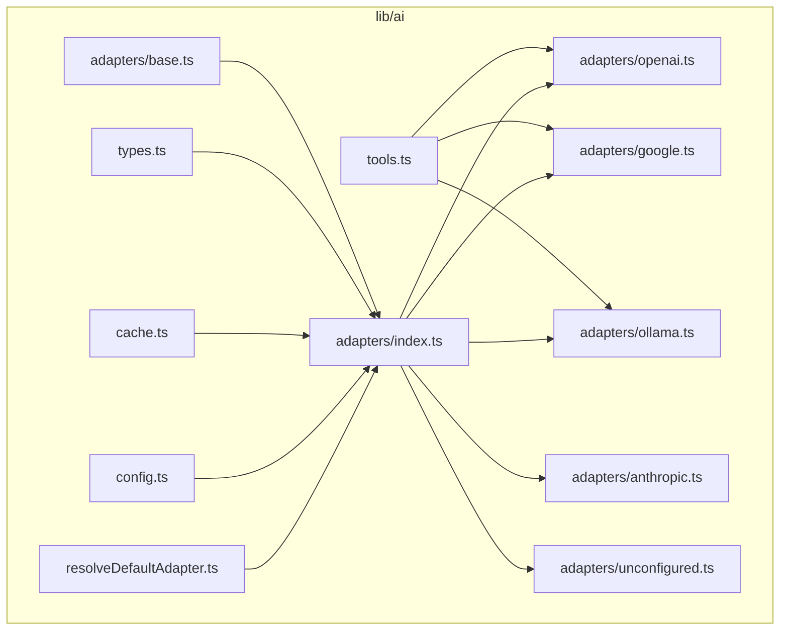
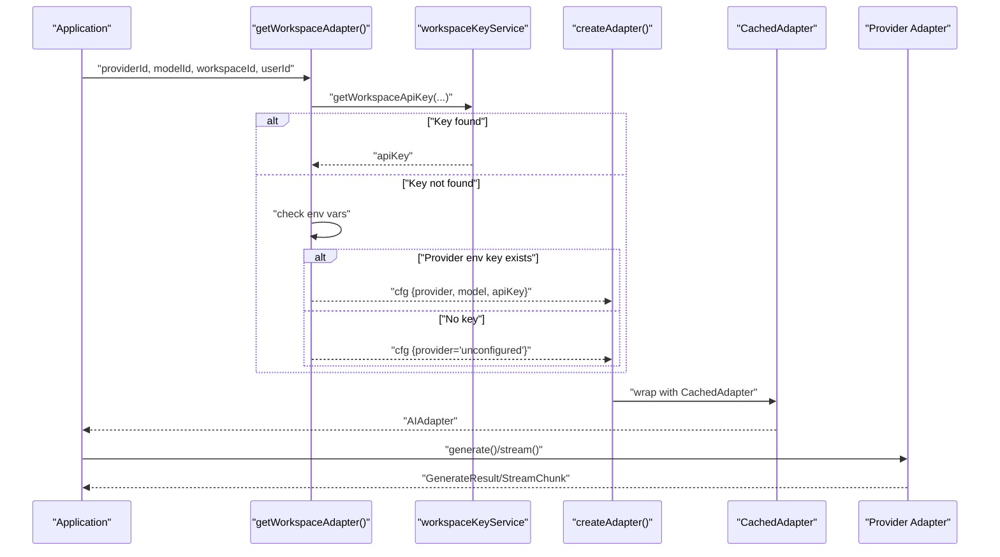
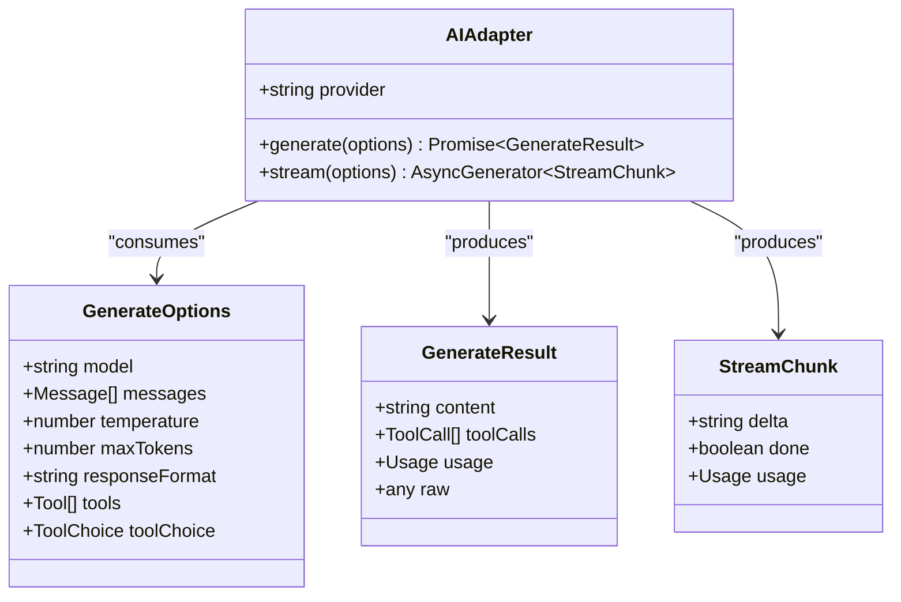
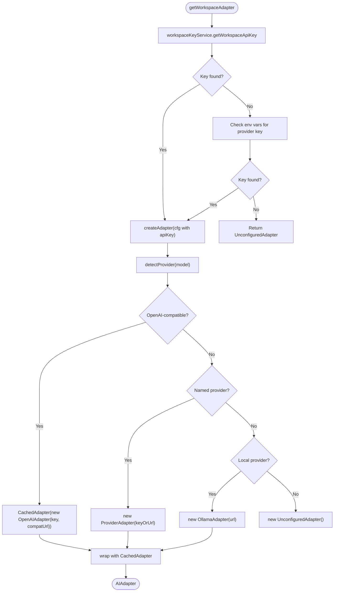
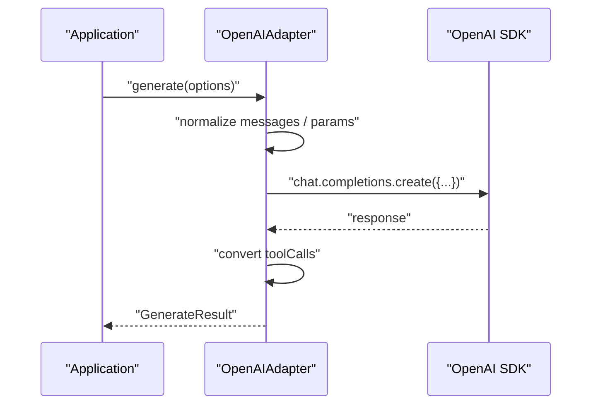
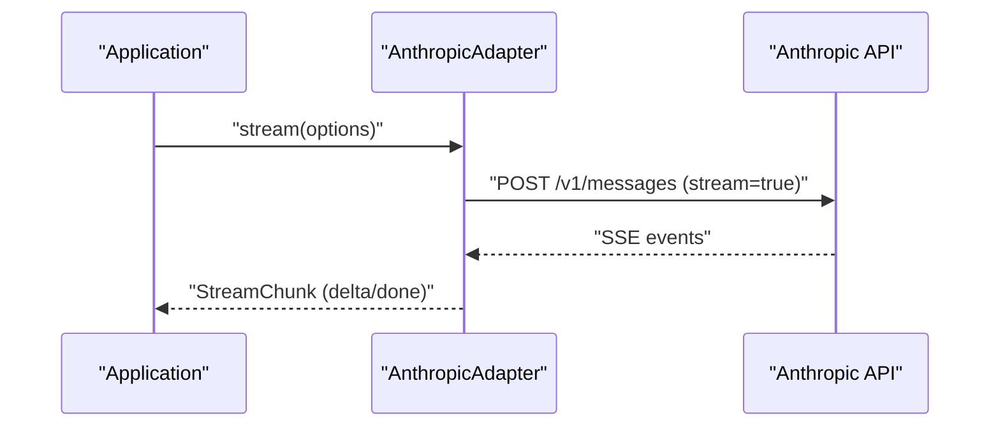
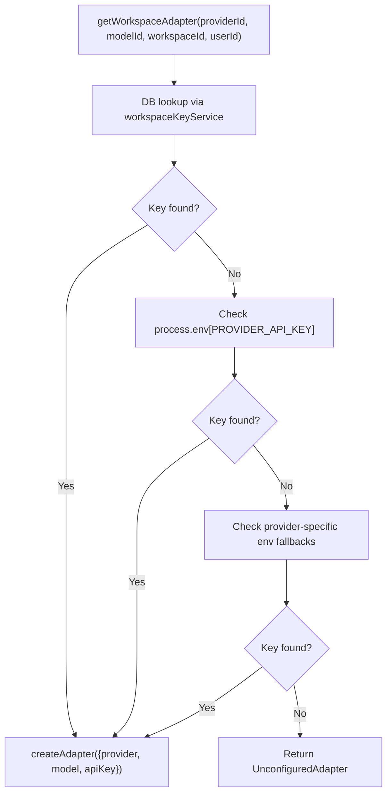
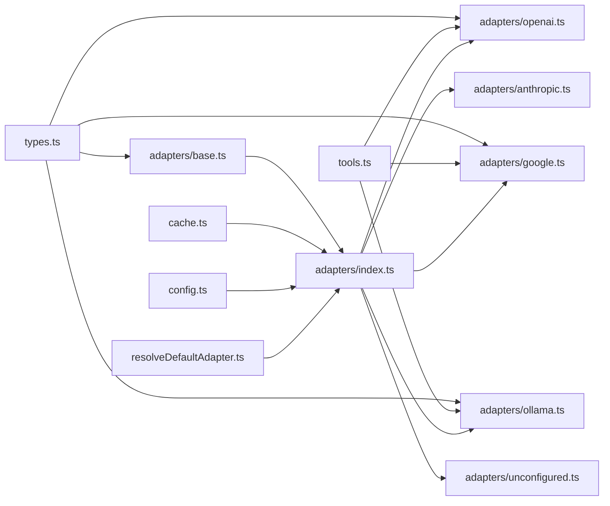

# AI Provider Adapter System

<cite>
**Referenced Files in This Document**
- [README.md](file://README.md)
- [lib/ai/adapters/base.ts](file://lib/ai/adapters/base.ts)
- [lib/ai/adapters/index.ts](file://lib/ai/adapters/index.ts)
- [lib/ai/types.ts](file://lib/ai/types.ts)
- [lib/ai/adapters/openai.ts](file://lib/ai/adapters/openai.ts)
- [lib/ai/adapters/anthropic.ts](file://lib/ai/adapters/anthropic.ts)
- [lib/ai/adapters/google.ts](file://lib/ai/adapters/google.ts)
- [lib/ai/adapters/ollama.ts](file://lib/ai/adapters/ollama.ts)
- [lib/ai/adapters/unconfigured.ts](file://lib/ai/adapters/unconfigured.ts)
- [lib/ai/tools.ts](file://lib/ai/tools.ts)
- [lib/ai/cache.ts](file://lib/ai/cache.ts)
- [lib/ai/config.ts](file://lib/ai/config.ts)
- [lib/ai/resolveDefaultAdapter.ts](file://lib/ai/resolveDefaultAdapter.ts)
</cite>

## Table of Contents
1. [Introduction](#introduction)
2. [Project Structure](#project-structure)
3. [Core Components](#core-components)
4. [Architecture Overview](#architecture-overview)
5. [Detailed Component Analysis](#detailed-component-analysis)
6. [Dependency Analysis](#dependency-analysis)
7. [Performance Considerations](#performance-considerations)
8. [Troubleshooting Guide](#troubleshooting-guide)
9. [Conclusion](#conclusion)
10. [Appendices](#appendices)

## Introduction
This document describes the universal AI adapter system that powers the AI engine. It explains how the adapter pattern isolates provider-specific logic behind a shared interface, how the factory resolves credentials securely, and how standardized request/response formats unify interactions across providers. It also covers configuration management, authentication handling, streaming and caching, error handling, fallback mechanisms, and practical guidance for adding new providers and extending the system.

## Project Structure
The AI adapter system lives under lib/ai and is composed of:
- A base adapter interface and shared types
- Provider-specific adapters (OpenAI, Anthropic, Google, Ollama)
- A factory and registry that selects and instantiates adapters
- A pluggable cache layer for generation results and streams
- Tool definitions and conversion helpers for function calling
- Configuration shims and environment-based resolver utilities

**Diagram sources**
- [lib/ai/adapters/base.ts](file://lib/ai/adapters/base.ts)
- [lib/ai/adapters/index.ts](file://lib/ai/adapters/index.ts)
- [lib/ai/types.ts](file://lib/ai/types.ts)
- [lib/ai/tools.ts](file://lib/ai/tools.ts)
- [lib/ai/cache.ts](file://lib/ai/cache.ts)
- [lib/ai/adapters/openai.ts](file://lib/ai/adapters/openai.ts)
- [lib/ai/adapters/anthropic.ts](file://lib/ai/adapters/anthropic.ts)
- [lib/ai/adapters/google.ts](file://lib/ai/adapters/google.ts)
- [lib/ai/adapters/ollama.ts](file://lib/ai/adapters/ollama.ts)
- [lib/ai/adapters/unconfigured.ts](file://lib/ai/adapters/unconfigured.ts)
- [lib/ai/config.ts](file://lib/ai/config.ts)
- [lib/ai/resolveDefaultAdapter.ts](file://lib/ai/resolveDefaultAdapter.ts)

**Section sources**
- [README.md](file://README.md)
- [lib/ai/adapters/index.ts](file://lib/ai/adapters/index.ts)

## Core Components
- Base adapter interface: Defines the provider-agnostic contract for generating and streaming completions.
- Shared types: Provide client-safe message, generation, streaming, and pricing types.
- Provider adapters: Implementations for OpenAI, Anthropic, Google, and Ollama; plus a fallback adapter for unconfigured environments.
- Factory and registry: Securely resolves credentials, detects provider, and instantiates adapters.
- Caching: Adds a pluggable cache around generation and streaming calls.
- Tools: Canonical tool schema and conversion helpers for cross-provider function calling.
- Configuration shims: Backward-compatible exports and environment-based adapter resolver.

**Section sources**
- [lib/ai/adapters/base.ts](file://lib/ai/adapters/base.ts)
- [lib/ai/types.ts](file://lib/ai/types.ts)
- [lib/ai/adapters/index.ts](file://lib/ai/adapters/index.ts)
- [lib/ai/cache.ts](file://lib/ai/cache.ts)
- [lib/ai/tools.ts](file://lib/ai/tools.ts)
- [lib/ai/config.ts](file://lib/ai/config.ts)
- [lib/ai/resolveDefaultAdapter.ts](file://lib/ai/resolveDefaultAdapter.ts)

## Architecture Overview
The system separates concerns:
- Application code interacts with the AIAdapter interface.
- The factory selects a concrete adapter based on configuration and environment.
- Adapters normalize provider differences and expose a unified request/response model.
- A caching layer improves performance and reduces costs.
- Tools enable function calling across providers with a single canonical schema.

**Diagram sources**
- [lib/ai/adapters/index.ts](file://lib/ai/adapters/index.ts)

## Detailed Component Analysis

### Base Adapter Interface and Shared Types
- AIAdapter defines provider, generate(), and stream().
- GenerateOptions and GenerateResult define the standardized request/response contract.
- StreamChunk captures incremental deltas and optional usage on the final chunk.
- ProviderName enumerates supported providers.
- Pricing utilities estimate USD cost based on provider/model.

**Diagram sources**
- [lib/ai/adapters/base.ts](file://lib/ai/adapters/base.ts)
- [lib/ai/types.ts](file://lib/ai/types.ts)

**Section sources**
- [lib/ai/adapters/base.ts](file://lib/ai/adapters/base.ts)
- [lib/ai/types.ts](file://lib/ai/types.ts)

### Factory Pattern and Dynamic Adapter Instantiation
- getWorkspaceAdapter resolves credentials from workspace storage or environment variables, then delegates to createAdapter.
- createAdapter detects provider from config or model name, validates API keys, and returns a CachedAdapter-wrapped provider adapter.
- For unknown providers, it falls back to UnconfiguredAdapter to avoid hard failures.
- Legacy getAdapter remains for backward compatibility but should be migrated to getWorkspaceAdapter.

**Diagram sources**
- [lib/ai/adapters/index.ts](file://lib/ai/adapters/index.ts)

**Section sources**
- [lib/ai/adapters/index.ts](file://lib/ai/adapters/index.ts)

### Provider-Specific Implementations

#### OpenAIAdapter
- Supports GPT reasoning models with special parameter handling (no temperature, different max token field).
- Normalizes system/user messages for models that disallow system role.
- Applies provider-specific caps and flags (e.g., Hugging Face token cap, aggregator/tool restrictions).
- Converts tool definitions and tool choices to OpenAI format and back.

**Diagram sources**
- [lib/ai/adapters/openai.ts](file://lib/ai/adapters/openai.ts)

**Section sources**
- [lib/ai/adapters/openai.ts](file://lib/ai/adapters/openai.ts)

#### AnthropicAdapter
- Uses the native Anthropic /v1/messages API via fetch.
- Converts messages to Anthropic’s expected shape and enforces per-model output caps.
- Streams via SSE-like events and yields delta chunks.

**Diagram sources**
- [lib/ai/adapters/anthropic.ts](file://lib/ai/adapters/anthropic.ts)

**Section sources**
- [lib/ai/adapters/anthropic.ts](file://lib/ai/adapters/anthropic.ts)

#### GoogleAdapter
- Wraps Google AI Studio via OpenAI-compatible endpoint.
- Applies provider-specific constraints (e.g., response_format rejected).

**Section sources**
- [lib/ai/adapters/google.ts](file://lib/ai/adapters/google.ts)

#### OllamaAdapter
- Uses OpenAI-compatible endpoint of local Ollama daemon.
- Supports tool calling when the model supports it.

**Section sources**
- [lib/ai/adapters/ollama.ts](file://lib/ai/adapters/ollama.ts)

#### UnconfiguredAdapter
- Graceful fallback when no credentials are available.
- Returns either structured JSON for JSON mode or a React alert component for UI.

**Section sources**
- [lib/ai/adapters/unconfigured.ts](file://lib/ai/adapters/unconfigured.ts)

### Configuration Management and Authentication Handling
- getWorkspaceAdapter prioritizes workspace-scoped keys, then environment variables, and finally returns UnconfiguredAdapter.
- Environment variables are checked per provider, including Groq and Google/Gemini aliases.
- ConfigurationError is thrown when a provider requires a key but none is found.

**Diagram sources**
- [lib/ai/adapters/index.ts](file://lib/ai/adapters/index.ts)

**Section sources**
- [lib/ai/adapters/index.ts](file://lib/ai/adapters/index.ts)

### Standardized Request/Response Formats
- Messages: role and content.
- GenerateOptions: model, messages, temperature, maxTokens, responseFormat, tools, toolChoice.
- GenerateResult: content, optional toolCalls, optional usage, raw provider response.
- StreamChunk: delta text, done flag, optional usage on the final chunk.

**Section sources**
- [lib/ai/types.ts](file://lib/ai/types.ts)

### Error Handling Strategies and Fallback Mechanisms
- ConfigurationError surfaces missing keys with actionable messages.
- UnconfiguredAdapter prevents server crashes and guides users to configure credentials.
- Upstash Redis initialization failure is handled gracefully; cache writes are best-effort.
- Provider adapters handle HTTP errors and malformed responses.

**Section sources**
- [lib/ai/adapters/index.ts](file://lib/ai/adapters/index.ts)
- [lib/ai/adapters/anthropic.ts](file://lib/ai/adapters/anthropic.ts)
- [lib/ai/cache.ts](file://lib/ai/cache.ts)

### Caching and Metrics
- CachedAdapter wraps any AIAdapter to cache full results and streamed chunks.
- Cache keys are deterministically derived from model, messages, temperature, and tools.
- Metrics are dispatched after each call with provider, model, token usage, latency, and cache hit status.

**Diagram sources**
- [lib/ai/adapters/index.ts](file://lib/ai/adapters/index.ts)
- [lib/ai/cache.ts](file://lib/ai/cache.ts)

**Section sources**
- [lib/ai/adapters/index.ts](file://lib/ai/adapters/index.ts)
- [lib/ai/cache.ts](file://lib/ai/cache.ts)

### Tools and Function Calling
- Canonical Tool schema with name, description, JSON Schema parameters, and execute function.
- Conversion helpers translate between unified tools and provider-specific formats.
- executeToolCalls runs requested tool calls in parallel and returns results formatted for continuation.

**Section sources**
- [lib/ai/tools.ts](file://lib/ai/tools.ts)

### Environment-Based Defaults and Backward Compatibility
- config.ts re-exports factory and resolver for backward compatibility.
- resolveDefaultAdapter chooses the first available provider key based on priority tiers.

**Section sources**
- [lib/ai/config.ts](file://lib/ai/config.ts)
- [lib/ai/resolveDefaultAdapter.ts](file://lib/ai/resolveDefaultAdapter.ts)

## Dependency Analysis
The adapter system exhibits low coupling and high cohesion:
- Adapters depend on shared types and tools.
- The factory depends on workspace key service, environment variables, and adapters.
- Caching is orthogonal and composable via decorator pattern.
- Tools are isolated and converted at adapter boundaries.

**Diagram sources**
- [lib/ai/adapters/base.ts](file://lib/ai/adapters/base.ts)
- [lib/ai/adapters/index.ts](file://lib/ai/adapters/index.ts)
- [lib/ai/types.ts](file://lib/ai/types.ts)
- [lib/ai/tools.ts](file://lib/ai/tools.ts)
- [lib/ai/cache.ts](file://lib/ai/cache.ts)
- [lib/ai/adapters/openai.ts](file://lib/ai/adapters/openai.ts)
- [lib/ai/adapters/anthropic.ts](file://lib/ai/adapters/anthropic.ts)
- [lib/ai/adapters/google.ts](file://lib/ai/adapters/google.ts)
- [lib/ai/adapters/ollama.ts](file://lib/ai/adapters/ollama.ts)
- [lib/ai/adapters/unconfigured.ts](file://lib/ai/adapters/unconfigured.ts)
- [lib/ai/config.ts](file://lib/ai/config.ts)
- [lib/ai/resolveDefaultAdapter.ts](file://lib/ai/resolveDefaultAdapter.ts)

**Section sources**
- [lib/ai/adapters/index.ts](file://lib/ai/adapters/index.ts)

## Performance Considerations
- Prefer CachedAdapter to reduce repeated calls for identical prompts.
- Tune temperature and maxTokens to balance quality and cost.
- Use streaming for long-form generation to improve perceived latency.
- Monitor token usage via pricing utilities and metrics.
- For local providers, ensure the daemon is reachable; otherwise use cloud providers or UnconfiguredAdapter for graceful UX.

[No sources needed since this section provides general guidance]

## Troubleshooting Guide
- Missing API key: Expect ConfigurationError or UnconfiguredAdapter behavior. Configure provider key in workspace settings or environment variables.
- Provider-specific constraints: Some providers reject certain parameters (e.g., response_format, tools, temperature). The adapters normalize these differences.
- Network connectivity: Local Ollama/LM Studio may be unreachable on serverless platforms; UnconfiguredAdapter will guide users to configure cloud providers.
- Tool execution: Ensure tool names match and parameters conform to the declared schema; mismatches are handled gracefully.

**Section sources**
- [lib/ai/adapters/index.ts](file://lib/ai/adapters/index.ts)
- [lib/ai/adapters/anthropic.ts](file://lib/ai/adapters/anthropic.ts)
- [lib/ai/adapters/openai.ts](file://lib/ai/adapters/openai.ts)
- [lib/ai/adapters/unconfigured.ts](file://lib/ai/adapters/unconfigured.ts)

## Conclusion
The AI adapter system cleanly separates provider logic behind a unified interface, enforces secure credential resolution, and standardizes request/response formats. It offers robust caching, streaming, tool calling, and graceful fallbacks. Extending the system with new providers is straightforward: implement an adapter, register it in the factory, and add provider-specific environment handling.

[No sources needed since this section summarizes without analyzing specific files]

## Appendices

### How to Add a New AI Provider
- Define a new adapter class implementing AIAdapter in lib/ai/adapters/<provider>.ts.
- Normalize provider-specific message and parameter formats inside the adapter.
- Export the adapter from lib/ai/adapters/index.ts and update the factory switch to handle the new provider id.
- Add environment variable checks and error messages for missing keys.
- Optionally integrate tool conversion helpers if the provider supports function calling.
- Add pricing entries in types.ts if cost estimation is desired.

**Section sources**
- [lib/ai/adapters/index.ts](file://lib/ai/adapters/index.ts)
- [lib/ai/types.ts](file://lib/ai/types.ts)

### Best Practices for Custom Integrations
- Keep credentials server-only; never accept API keys from clients.
- Use getWorkspaceAdapter for secure resolution and UnconfiguredAdapter for graceful UX.
- Wrap adapters with CachedAdapter to reduce latency and cost.
- Validate tool schemas and handle tool execution errors.
- Instrument metrics and logging for observability.

[No sources needed since this section provides general guidance]