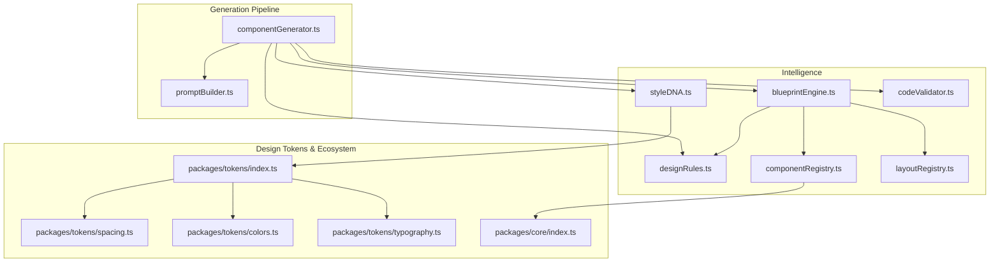
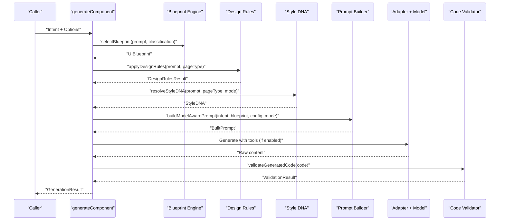
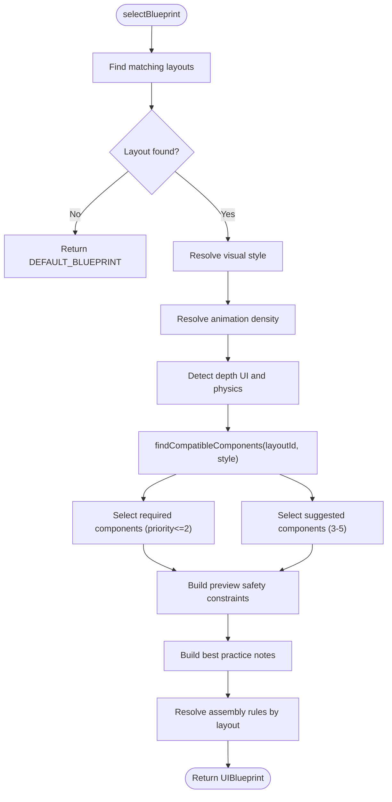
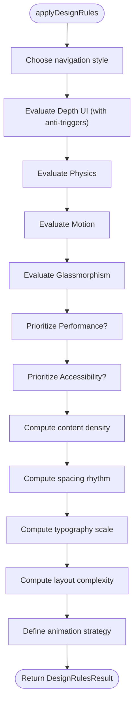
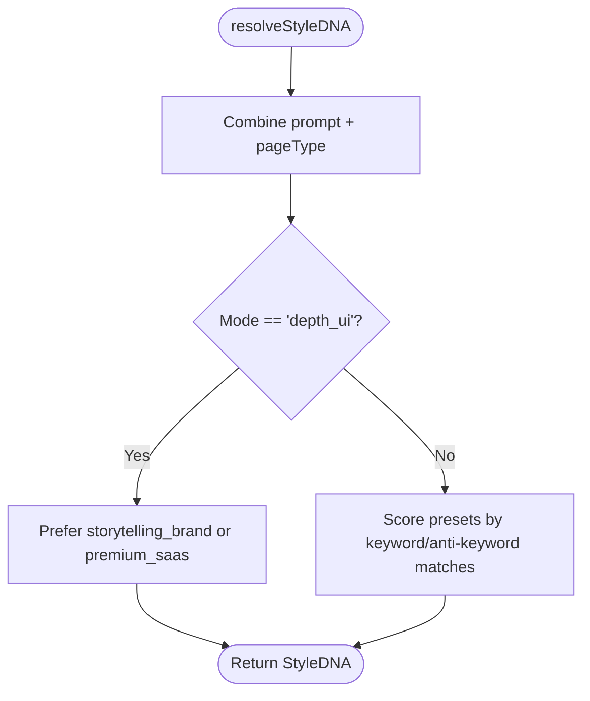
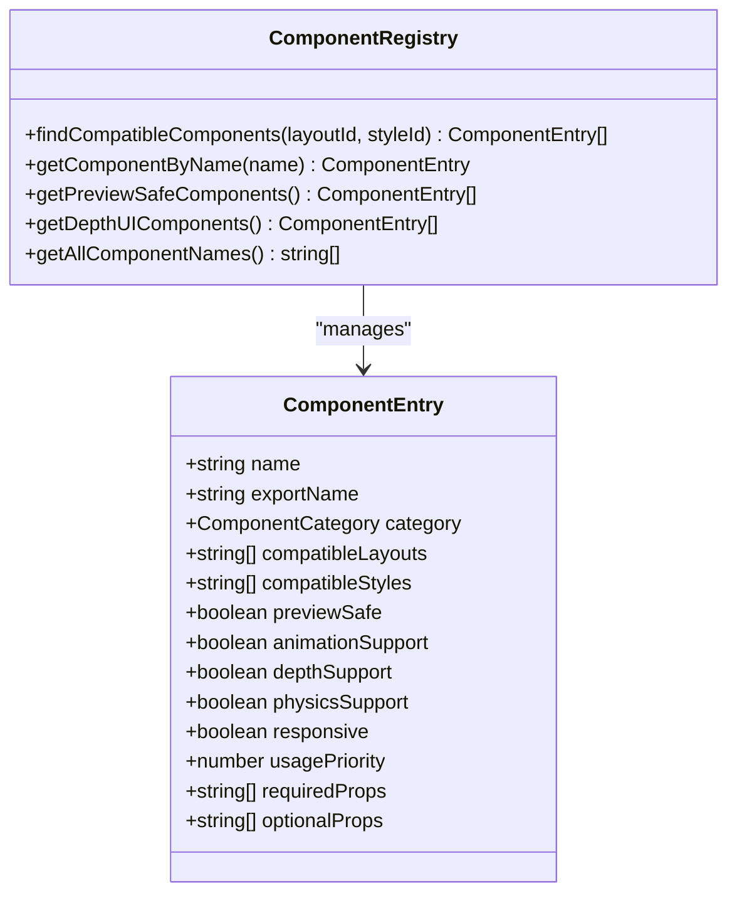
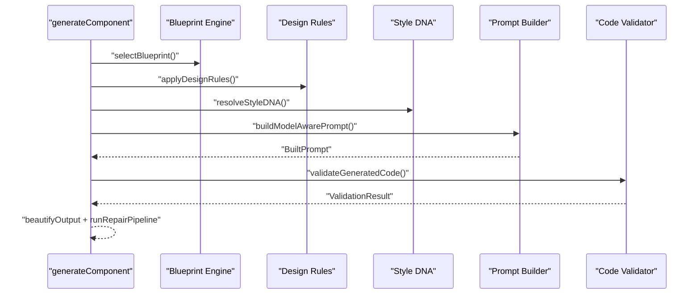
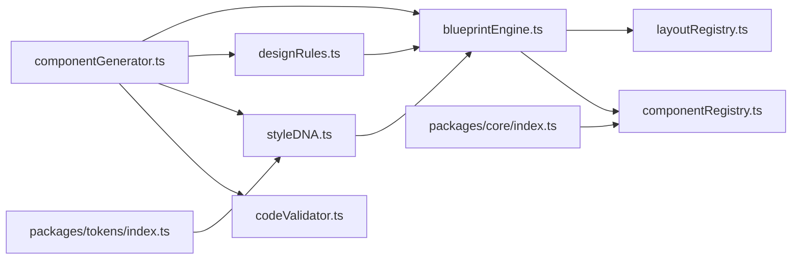

# Blueprint Engine & Design System

<cite>
**Referenced Files in This Document**
- [blueprintEngine.ts](file://lib/intelligence/blueprintEngine.ts)
- [designRules.ts](file://lib/intelligence/designRules.ts)
- [styleDNA.ts](file://lib/intelligence/styleDNA.ts)
- [componentRegistry.ts](file://lib/intelligence/componentRegistry.ts)
- [layoutRegistry.ts](file://lib/intelligence/layoutRegistry.ts)
- [componentGenerator.ts](file://lib/ai/componentGenerator.ts)
- [promptBuilder.ts](file://lib/ai/promptBuilder.ts)
- [codeValidator.ts](file://lib/intelligence/codeValidator.ts)
- [tokens/index.ts](file://packages/tokens/index.ts)
- [tokens/spacing.ts](file://packages/tokens/spacing.ts)
- [tokens/colors.ts](file://packages/tokens/colors.ts)
- [tokens/typography.ts](file://packages/tokens/typography.ts)
- [core/index.ts](file://packages/core/index.ts)
</cite>

## Table of Contents
1. [Introduction](#introduction)
2. [Project Structure](#project-structure)
3. [Core Components](#core-components)
4. [Architecture Overview](#architecture-overview)
5. [Detailed Component Analysis](#detailed-component-analysis)
6. [Dependency Analysis](#dependency-analysis)
7. [Performance Considerations](#performance-considerations)
8. [Troubleshooting Guide](#troubleshooting-guide)
9. [Conclusion](#conclusion)
10. [Appendices](#appendices)

## Introduction
This document explains the blueprint engine and design system enforcement capabilities that govern how UI components are selected, assembled, styled, and validated during generation. It covers:
- Design rule enforcement and reasoning
- Style DNA implementation and visual personality resolution
- Component registry and compatibility filtering
- Brand guideline enforcement and design consistency
- Relationship between the blueprint engine and the generation pipeline
- Examples of custom design rules, style customization, and component extension mechanisms

## Project Structure
The blueprint engine and design system live under the intelligence subsystem and integrate with the generation pipeline. Supporting design tokens and component ecosystems are provided by the packages directory.

**Diagram sources**
- [blueprintEngine.ts:1-215](file://lib/intelligence/blueprintEngine.ts#L1-L215)
- [designRules.ts:1-245](file://lib/intelligence/designRules.ts#L1-L245)
- [styleDNA.ts:1-290](file://lib/intelligence/styleDNA.ts#L1-L290)
- [componentRegistry.ts:1-117](file://lib/intelligence/componentRegistry.ts#L1-L117)
- [layoutRegistry.ts:1-79](file://lib/intelligence/layoutRegistry.ts#L1-L79)
- [componentGenerator.ts:1-402](file://lib/ai/componentGenerator.ts#L1-L402)
- [promptBuilder.ts:30-262](file://lib/ai/promptBuilder.ts#L30-L262)
- [codeValidator.ts:1-200](file://lib/intelligence/codeValidator.ts#L1-L200)
- [tokens/index.ts:1-5](file://packages/tokens/index.ts#L1-L5)
- [tokens/spacing.ts:1-18](file://packages/tokens/spacing.ts#L1-L18)
- [tokens/colors.ts:1-12](file://packages/tokens/colors.ts#L1-L12)
- [tokens/typography.ts:1-11](file://packages/tokens/typography.ts#L1-L11)
- [core/index.ts:1-5](file://packages/core/index.ts#L1-L5)

**Section sources**
- [blueprintEngine.ts:1-215](file://lib/intelligence/blueprintEngine.ts#L1-L215)
- [designRules.ts:1-245](file://lib/intelligence/designRules.ts#L1-L245)
- [styleDNA.ts:1-290](file://lib/intelligence/styleDNA.ts#L1-L290)
- [componentRegistry.ts:1-117](file://lib/intelligence/componentRegistry.ts#L1-L117)
- [layoutRegistry.ts:1-79](file://lib/intelligence/layoutRegistry.ts#L1-L79)
- [componentGenerator.ts:1-402](file://lib/ai/componentGenerator.ts#L1-L402)
- [promptBuilder.ts:30-262](file://lib/ai/promptBuilder.ts#L30-L262)
- [codeValidator.ts:1-200](file://lib/intelligence/codeValidator.ts#L1-L200)
- [tokens/index.ts:1-5](file://packages/tokens/index.ts#L1-L5)
- [tokens/spacing.ts:1-18](file://packages/tokens/spacing.ts#L1-L18)
- [tokens/colors.ts:1-12](file://packages/tokens/colors.ts#L1-L12)
- [tokens/typography.ts:1-11](file://packages/tokens/typography.ts#L1-L11)
- [core/index.ts:1-5](file://packages/core/index.ts#L1-L5)

## Core Components
- Blueprint Engine: Selects a UI blueprint from layout, style, components, and constraints based on intent and classification.
- Design Rules: Applies heuristics to decide navigation, depth UI, motion, glassmorphism, performance/accessibility priorities, and animation strategy.
- Style DNA: Resolves a deterministic visual personality (preset) and Tailwind hints to enforce brand consistency.
- Component Registry: Provides metadata for all known components, enabling compatibility checks and safe selection.
- Layout Registry: Defines layout categories, structures, animation/depth/physics suitability, and best-fit scenarios.
- Generation Pipeline: Orchestrates blueprint + design rules + style DNA + prompt building + model execution + validation + beautification.

**Section sources**
- [blueprintEngine.ts:9-27](file://lib/intelligence/blueprintEngine.ts#L9-L27)
- [designRules.ts:9-32](file://lib/intelligence/designRules.ts#L9-L32)
- [styleDNA.ts:23-51](file://lib/intelligence/styleDNA.ts#L23-L51)
- [componentRegistry.ts:6-29](file://lib/intelligence/componentRegistry.ts#L6-L29)
- [layoutRegistry.ts:1-11](file://lib/intelligence/layoutRegistry.ts#L1-L11)
- [componentGenerator.ts:60-84](file://lib/ai/componentGenerator.ts#L60-L84)

## Architecture Overview
The blueprint engine and design system are invoked early in the generation pipeline to produce structured context injected into the model prompt. The system enforces brand guidelines, accessibility, and component compatibility through multiple layers: registry metadata, design heuristics, style DNA presets, and post-generation validation.

**Diagram sources**
- [componentGenerator.ts:60-391](file://lib/ai/componentGenerator.ts#L60-L391)
- [blueprintEngine.ts:122-176](file://lib/intelligence/blueprintEngine.ts#L122-L176)
- [designRules.ts:100-223](file://lib/intelligence/designRules.ts#L100-L223)
- [styleDNA.ts:218-250](file://lib/intelligence/styleDNA.ts#L218-L250)
- [promptBuilder.ts:244-262](file://lib/ai/promptBuilder.ts#L244-L262)
- [codeValidator.ts:1-200](file://lib/intelligence/codeValidator.ts#L1-L200)

## Detailed Component Analysis

### Blueprint Engine
Responsibilities:
- Match layouts to the prompt
- Resolve visual style and animation density
- Determine depth UI and physics needs
- Assemble required/suggested components by compatibility
- Define preview safety constraints and assembly rules
- Produce a formatted blueprint for injection into prompts

Key behaviors:
- Uses layout registry to find matching layouts and resolves style/animation/physics from prompt and classification.
- Queries component registry to filter compatible components by layout and style.
- Builds assembly rules tailored to layout categories (e.g., dashboard, auth).
- Produces a blueprint with structural sections, responsive strategy, and best practice notes.

**Diagram sources**
- [blueprintEngine.ts:122-176](file://lib/intelligence/blueprintEngine.ts#L122-L176)
- [layoutRegistry.ts:56-66](file://lib/intelligence/layoutRegistry.ts#L56-L66)
- [componentRegistry.ts:94-100](file://lib/intelligence/componentRegistry.ts#L94-L100)

**Section sources**
- [blueprintEngine.ts:9-27](file://lib/intelligence/blueprintEngine.ts#L9-L27)
- [blueprintEngine.ts:122-176](file://lib/intelligence/blueprintEngine.ts#L122-L176)
- [blueprintEngine.ts:178-214](file://lib/intelligence/blueprintEngine.ts#L178-L214)
- [layoutRegistry.ts:13-54](file://lib/intelligence/layoutRegistry.ts#L13-L54)
- [componentRegistry.ts:94-100](file://lib/intelligence/componentRegistry.ts#L94-L100)

### Design Rules
Responsibilities:
- Encode design heuristics for navigation style, layout complexity, depth UI, motion, physics, glassmorphism, accessibility/performance priorities, content density, spacing rhythm, typography scale, and animation strategy.
- Provide decisions and warnings to guide the blueprint and prompt.

Implementation highlights:
- Uses trigger/anti-trigger lists keyed to prompt keywords.
- Computes layout complexity from depth UI and motion.
- Emits warnings for potential conflicts (e.g., performance-first vs depth UI).

**Diagram sources**
- [designRules.ts:100-223](file://lib/intelligence/designRules.ts#L100-L223)

**Section sources**
- [designRules.ts:9-32](file://lib/intelligence/designRules.ts#L9-L32)
- [designRules.ts:100-223](file://lib/intelligence/designRules.ts#L100-L223)
- [designRules.ts:225-244](file://lib/intelligence/designRules.ts#L225-L244)

### Style DNA
Responsibilities:
- Resolve a deterministic visual personality (preset) from prompt and page type.
- Provide Tailwind hints and a concise description for consistent styling.
- Bias toward storytelling or premium presets for depth UI mode.

Implementation highlights:
- Preset triggers with keywords and anti-keywords mapped to priority scores.
- Special-case logic for depth_ui mode to prefer storytelling_brand or premium_saas.
- Formatted injection into the system prompt as a design constraint.

**Diagram sources**
- [styleDNA.ts:218-250](file://lib/intelligence/styleDNA.ts#L218-L250)

**Section sources**
- [styleDNA.ts:23-51](file://lib/intelligence/styleDNA.ts#L23-L51)
- [styleDNA.ts:218-250](file://lib/intelligence/styleDNA.ts#L218-L250)
- [styleDNA.ts:265-289](file://lib/intelligence/styleDNA.ts#L265-L289)

### Component Registry
Responsibilities:
- Maintain structured metadata for all known components.
- Filter compatible components by layout and style.
- Provide helpers for preview-safe and depth UI components.

Implementation highlights:
- ComponentEntry defines compatibility, dependencies, animation/depth/physics support, responsiveness, usage priority, and props.
- findCompatibleComponents sorts by usagePriority to prioritize common components.

**Diagram sources**
- [componentRegistry.ts:6-29](file://lib/intelligence/componentRegistry.ts#L6-L29)
- [componentRegistry.ts:94-117](file://lib/intelligence/componentRegistry.ts#L94-L117)

**Section sources**
- [componentRegistry.ts:6-29](file://lib/intelligence/componentRegistry.ts#L6-L29)
- [componentRegistry.ts:94-117](file://lib/intelligence/componentRegistry.ts#L94-L117)

### Layout Registry
Responsibilities:
- Define layout categories, structures, animation/depth/physics suitability, responsive flags, and best-fit scenarios.
- Provide utilities to find matching layouts and filter by depth UI compatibility.

Implementation highlights:
- LayoutEntry includes keywords, structure, complexity, and suitability flags.
- findMatchingLayouts computes a score based on keyword overlap.

**Section sources**
- [layoutRegistry.ts:1-11](file://lib/intelligence/layoutRegistry.ts#L1-L11)
- [layoutRegistry.ts:13-54](file://lib/intelligence/layoutRegistry.ts#L13-L54)
- [layoutRegistry.ts:56-79](file://lib/intelligence/layoutRegistry.ts#L56-L79)

### Generation Pipeline Integration
Responsibilities:
- Orchestrate blueprint selection, design rules application, style DNA resolution, prompt construction, model execution, code extraction, beautification, validation, and auto-repair.
- Enforce token budgets and system prompt caps.
- Inject intelligence context into prompts for cloud/freeform modes.

Key integration points:
- Blueprint and design rules are formatted and appended to the user prompt for freeform modes.
- Style DNA and UX state contract are injected into the system prompt for component and depth_ui modes.
- CodeValidator runs after beautification to ensure browser safety and structural correctness.

**Diagram sources**
- [componentGenerator.ts:60-391](file://lib/ai/componentGenerator.ts#L60-L391)
- [promptBuilder.ts:244-262](file://lib/ai/promptBuilder.ts#L244-L262)
- [codeValidator.ts:1-200](file://lib/intelligence/codeValidator.ts#L1-L200)

**Section sources**
- [componentGenerator.ts:60-391](file://lib/ai/componentGenerator.ts#L60-L391)
- [promptBuilder.ts:230-262](file://lib/ai/promptBuilder.ts#L230-L262)
- [codeValidator.ts:1-200](file://lib/intelligence/codeValidator.ts#L1-L200)

## Dependency Analysis
The blueprint engine depends on the layout and component registries. The generation pipeline composes blueprint, design rules, and style DNA into prompts and enforces validation afterward. Design tokens and the core component index provide shared constraints and exports.

**Diagram sources**
- [blueprintEngine.ts:5-7](file://lib/intelligence/blueprintEngine.ts#L5-L7)
- [designRules.ts:1-245](file://lib/intelligence/designRules.ts#L1-L245)
- [styleDNA.ts:1-290](file://lib/intelligence/styleDNA.ts#L1-L290)
- [componentRegistry.ts:1-117](file://lib/intelligence/componentRegistry.ts#L1-L117)
- [layoutRegistry.ts:1-79](file://lib/intelligence/layoutRegistry.ts#L1-L79)
- [componentGenerator.ts:1-402](file://lib/ai/componentGenerator.ts#L1-L402)
- [codeValidator.ts:1-200](file://lib/intelligence/codeValidator.ts#L1-L200)
- [tokens/index.ts:1-5](file://packages/tokens/index.ts#L1-L5)
- [core/index.ts:1-5](file://packages/core/index.ts#L1-L5)

**Section sources**
- [blueprintEngine.ts:5-7](file://lib/intelligence/blueprintEngine.ts#L5-L7)
- [componentGenerator.ts:1-402](file://lib/ai/componentGenerator.ts#L1-L402)
- [tokens/index.ts:1-5](file://packages/tokens/index.ts#L1-L5)
- [core/index.ts:1-5](file://packages/core/index.ts#L1-L5)

## Performance Considerations
- Token budget enforcement: The pipeline measures and trims optional context to fit model-specific limits, prioritizing essential blocks.
- Tool-call rounds: Controlled by pipeline config; expensive tools are only used when supported and budget allows.
- Validation and repair: Early detection of unsafe or invalid code reduces runtime failures and preview iterations.
- Style DNA and design rules: Deterministic resolution avoids costly iterative prompting and ensures consistent outcomes.

[No sources needed since this section provides general guidance]

## Troubleshooting Guide
Common issues and remedies:
- Browser safety violations: Detected by code validator; ensure no Node.js/Terminal-only imports and avoid unsafe APIs.
- Registry hallucinations: Imports of unavailable libraries (e.g., Three.js, Material UI) are flagged; replace with supported alternatives.
- Missing exports or JSX: Structural checks enforce a default export and JSX presence.
- Accessibility warnings: Address missing alt attributes and aria labels proactively.
- Excessive dynamic imports: May not resolve correctly in Sandpack; reduce reliance on dynamic imports.

**Section sources**
- [codeValidator.ts:28-178](file://lib/intelligence/codeValidator.ts#L28-L178)

## Conclusion
The blueprint engine and design system form a robust, deterministic framework for generating consistent, accessible, and brand-aligned UI components. Through layout and component registries, design heuristics, style DNA presets, and strict validation, the system enforces design consistency, brand guidelines, and compatibility while remaining adaptable to custom rules and extensions.

[No sources needed since this section summarizes without analyzing specific files]

## Appendices

### Design Rule Enforcement Examples
- Navigation style: Choose sidebar for dashboard/admin; top-nav for landing pages; bottom-nav for mobile apps.
- Depth UI: Enable for immersive storytelling; avoid for data-heavy or utility UIs.
- Motion and physics: Use motion for brand expression; avoid in performance-critical or enterprise contexts.
- Accessibility/performance: Prioritize accessibility for government/healthcare; prioritize performance for SEO/public pages.

**Section sources**
- [designRules.ts:38-87](file://lib/intelligence/designRules.ts#L38-L87)
- [designRules.ts:100-223](file://lib/intelligence/designRules.ts#L100-L223)

### Style Customization Options
- Style DNA presets encode spacing density, radius softness, card elevation, typography scale, contrast mood, CTA emphasis, and motion restraint.
- Tailwind hints guide color palettes and class usage for consistent visuals.
- For depth_ui mode, storytelling_brand or premium_saas are preferred defaults.

**Section sources**
- [styleDNA.ts:23-51](file://lib/intelligence/styleDNA.ts#L23-L51)
- [styleDNA.ts:218-250](file://lib/intelligence/styleDNA.ts#L218-L250)
- [styleDNA.ts:265-289](file://lib/intelligence/styleDNA.ts#L265-L289)

### Component Extension Mechanisms
- Extend component registry: Add new ComponentEntry with compatibleLayouts/styles, dependencies, and usagePriority.
- Extend layout registry: Add new LayoutEntry with keywords, structure, and suitability flags.
- Extend design rules: Add new triggers/anti-triggers to influence navigation, depth UI, motion, and other decisions.
- Extend style DNA: Add new preset with Tailwind hints and description; update resolver to incorporate new keywords.

**Section sources**
- [componentRegistry.ts:31-92](file://lib/intelligence/componentRegistry.ts#L31-L92)
- [layoutRegistry.ts:13-54](file://lib/intelligence/layoutRegistry.ts#L13-L54)
- [designRules.ts:38-87](file://lib/intelligence/designRules.ts#L38-L87)
- [styleDNA.ts:55-160](file://lib/intelligence/styleDNA.ts#L55-L160)

### Design Tokens and Brand Guidelines
- Tokens define spacing, colors, and typography scales; enforced by the AI system prompt to prevent arbitrary values and ensure consistency.
- Core component exports provide a unified API surface for generated components.

**Section sources**
- [tokens/spacing.ts:10-15](file://packages/tokens/spacing.ts#L10-L15)
- [tokens/colors.ts:1-12](file://packages/tokens/colors.ts#L1-L12)
- [tokens/typography.ts:1-11](file://packages/tokens/typography.ts#L1-L11)
- [core/index.ts:1-5](file://packages/core/index.ts#L1-L5)