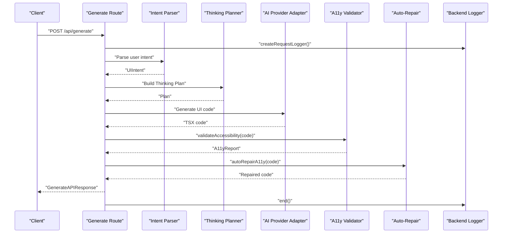
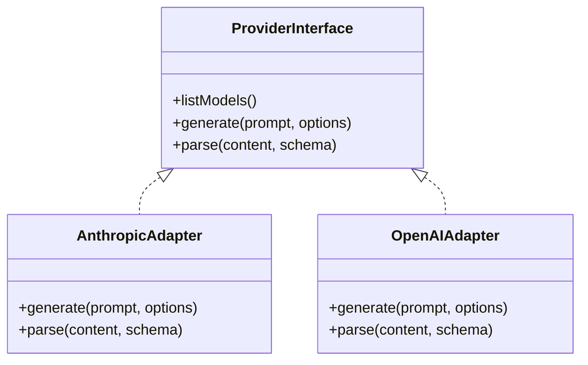
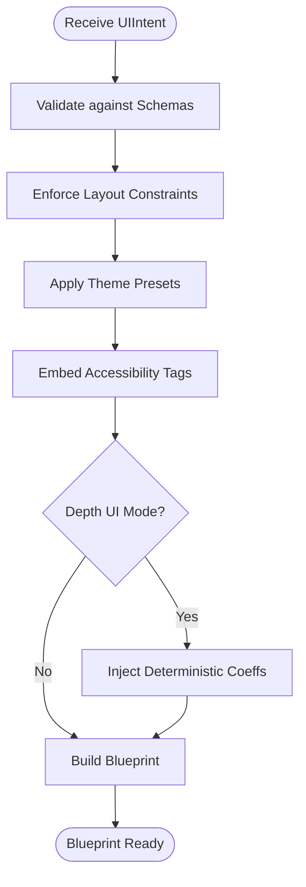
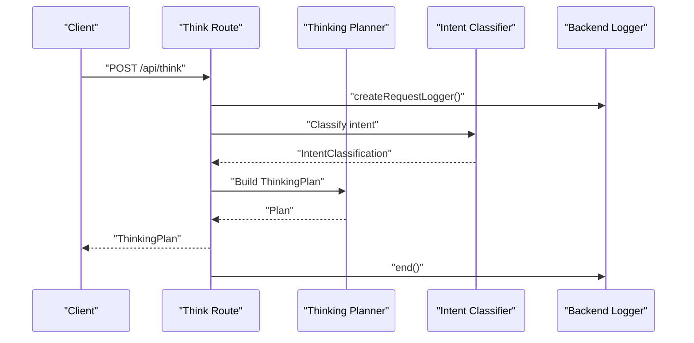
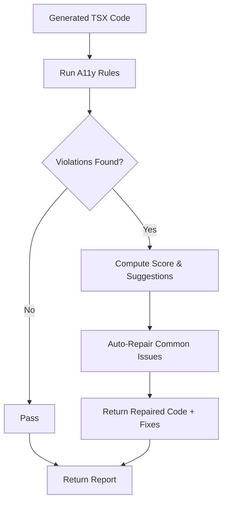
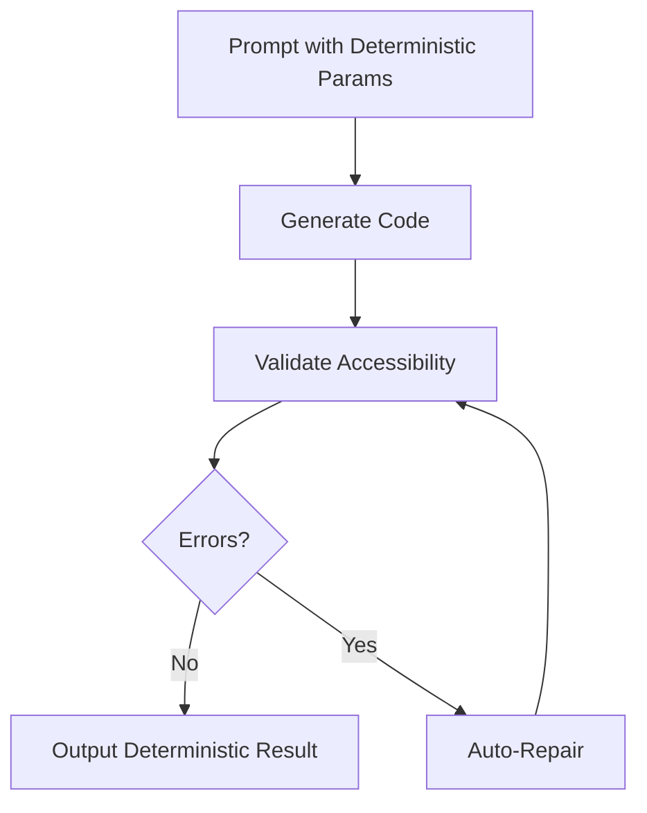
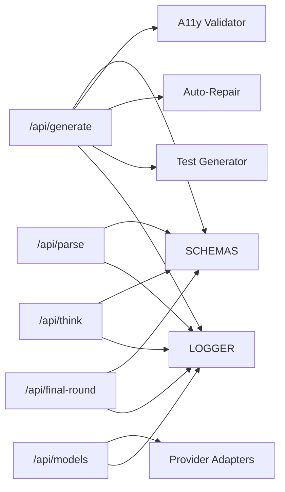

# Business Logic Layer

<cite>
**Referenced Files in This Document**
- [logger.ts](file://lib/logger.ts)
- [schemas.ts](file://lib/validation/schemas.ts)
- [a11yValidator.ts](file://lib/validation/a11yValidator.ts)
- [testGenerator.ts](file://lib/testGenerator.ts)
- [route.ts](file://app/api/generate/route.ts)
- [route.ts](file://app/api/think/route.ts)
- [route.ts](file://app/api/final-round/route.ts)
- [route.ts](file://app/api/parse/route.ts)
- [route.ts](file://app/api/history/route.ts)
- [route.ts](file://app/api/classify/route.ts)
- [route.ts](file://app/api/models/route.ts)
- [route.ts](file://app/api/engine-config/route.ts)
- [route.ts](file://app/api/feedback/route.ts)
- [route.ts](file://app/api/suggestions/route.ts)
- [route.ts](file://app/api/vision/route.ts)
- [route.ts](file://app/api/image-to-text/route.ts)
- [route.ts](file://app/api/local-models/route.ts)
- [route.ts](file://app/api/chunk/route.ts)
- [route.ts](file://app/api/workspaces/route.ts)
- [route.ts](file://app/api/workspace/settings/route.ts)
- [route.ts](file://app/api/projects/route.ts)
- [route.ts](file://app/api/projects/[id]/route.ts)
- [route.ts](file://app/api/projects/[id]/rollback/route.ts)
- [route.ts](file://app/api/usage/route.ts)
- [route.ts](file://app/api/manifest/route.ts)
- [route.ts](file://app/api/auth/[...nextauth]/route.ts)
- [route.ts](file://app/api/auth/forgot-password/route.ts)
- [route.ts](file://app/api/auth/reset-password/route.ts)
</cite>

## Table of Contents
1. [Introduction](#introduction)
2. [Project Structure](#project-structure)
3. [Core Components](#core-components)
4. [Architecture Overview](#architecture-overview)
5. [Detailed Component Analysis](#detailed-component-analysis)
6. [Dependency Analysis](#dependency-analysis)
7. [Performance Considerations](#performance-considerations)
8. [Troubleshooting Guide](#troubleshooting-guide)
9. [Conclusion](#conclusion)

## Introduction
This document describes the business logic layer architecture of an AI-powered, accessibility-first UI engine. It focuses on the AI generation pipeline, multi-agent workflows, validation and quality assurance processes, the adapter pattern for AI providers, the universal AI provider interface, the blueprint engine and design system enforcement, auto-repair capabilities, external service integrations, and determinism in generation.

## Project Structure
The business logic is primarily implemented in the backend routes under app/api, with shared validation and logging utilities under lib. The validation module defines strict schemas for intents, UI components, accessibility reports, and API responses. The logger provides structured, request-scoped logging for observability.

```mermaid
graph TB
subgraph "API Layer"
GEN["/api/generate"]
THINK["/api/think"]
FINAL["/api/final-round"]
PARSE["/api/parse"]
CLASSIFY["/api/classify"]
MODELS["/api/models"]
CONFIG["/api/engine-config"]
FEEDBACK["/api/feedback"]
SUGGEST["/api/suggestions"]
VISION["/api/vision"]
IMG2TXT["/api/image-to-text"]
LOCAL["/api/local-models"]
CHUNK["/api/chunk"]
WORKSPACES["/api/workspaces"]
WS_SETTINGS["/api/workspace/settings"]
PROJECTS["/api/projects"]
PROJECT_ID["/api/projects/[id]"]
ROLLBACK["/api/projects/[id]/rollback"]
USAGE["/api/usage"]
MANIFEST["/api/manifest"]
AUTH["/api/auth/*"]
end
subgraph "Validation & Logging"
SCHEMAS["lib/validation/schemas.ts"]
LOGGER["lib/logger.ts"]
end
GEN --> SCHEMAS
THINK --> SCHEMAS
FINAL --> SCHEMAS
PARSE --> SCHEMAS
CLASSIFY --> SCHEMAS
FEEDBACK --> SCHEMAS
SUGGEST --> SCHEMAS
VISION --> SCHEMAS
IMG2TXT --> SCHEMAS
LOCAL --> SCHEMAS
CHUNK --> SCHEMAS
WORKSPACES --> SCHEMAS
WS_SETTINGS --> SCHEMAS
PROJECTS --> SCHEMAS
PROJECT_ID --> SCHEMAS
ROLLBACK --> SCHEMAS
USAGE --> SCHEMAS
MANIFEST --> SCHEMAS
AUTH --> SCHEMAS
GEN --> LOGGER
THINK --> LOGGER
FINAL --> LOGGER
PARSE --> LOGGER
CLASSIFY --> LOGGER
MODELS --> LOGGER
CONFIG --> LOGGER
FEEDBACK --> LOGGER
SUGGEST --> LOGGER
VISION --> LOGGER
IMG2TXT --> LOGGER
LOCAL --> LOGGER
CHUNK --> LOGGER
WORKSPACES --> LOGGER
WS_SETTINGS --> LOGGER
PROJECTS --> LOGGER
PROJECT_ID --> LOGGER
ROLLBACK --> LOGGER
USAGE --> LOGGER
MANIFEST --> LOGGER
AUTH --> LOGGER
```

**Diagram sources**
- [route.ts](file://app/api/generate/route.ts)
- [route.ts](file://app/api/think/route.ts)
- [route.ts](file://app/api/final-round/route.ts)
- [route.ts](file://app/api/parse/route.ts)
- [route.ts](file://app/api/classify/route.ts)
- [route.ts](file://app/api/models/route.ts)
- [route.ts](file://app/api/engine-config/route.ts)
- [route.ts](file://app/api/feedback/route.ts)
- [route.ts](file://app/api/suggestions/route.ts)
- [route.ts](file://app/api/vision/route.ts)
- [route.ts](file://app/api/image-to-text/route.ts)
- [route.ts](file://app/api/local-models/route.ts)
- [route.ts](file://app/api/chunk/route.ts)
- [route.ts](file://app/api/workspaces/route.ts)
- [route.ts](file://app/api/workspace/settings/route.ts)
- [route.ts](file://app/api/projects/route.ts)
- [route.ts](file://app/api/projects/[id]/route.ts)
- [route.ts](file://app/api/projects/[id]/rollback/route.ts)
- [route.ts](file://app/api/usage/route.ts)
- [route.ts](file://app/api/manifest/route.ts)
- [route.ts](file://app/api/auth/[...nextauth]/route.ts)
- [route.ts](file://app/api/auth/forgot-password/route.ts)
- [route.ts](file://app/api/auth/reset-password/route.ts)
- [schemas.ts](file://lib/validation/schemas.ts)
- [logger.ts](file://lib/logger.ts)

**Section sources**
- [schemas.ts:1-340](file://lib/validation/schemas.ts#L1-L340)
- [logger.ts:1-89](file://lib/logger.ts#L1-L89)

## Core Components
- Universal AI Provider Interface and Adapter Pattern: The system exposes a unified interface for AI providers via the models endpoint and delegates to provider-specific adapters. This enables pluggable backends for different providers while maintaining a consistent contract for the rest of the pipeline.
- Blueprint Engine and Design System Enforcement: The blueprint engine consumes validated UI intents and enforces design system constraints (layout, theme, semantic elements, accessibility requirements) to produce deterministic UI blueprints.
- Multi-Agent Workflows: The think and final-round endpoints orchestrate reasoning, planning, and refinement steps, enabling iterative improvement and contextual awareness.
- Validation and Quality Assurance: Built-in accessibility validation and auto-repair ensure generated UI meets WCAG guidelines. Test generation complements validation by producing automated test suites.
- Deterministic Generation: Determinism is achieved through explicit schemas, fixed presets for depth UI, and constrained prompts that inject quantified parameters (e.g., parallax coefficients) to avoid model variance.

**Section sources**
- [schemas.ts:1-340](file://lib/validation/schemas.ts#L1-L340)
- [a11yValidator.ts:1-376](file://lib/validation/a11yValidator.ts#L1-L376)
- [testGenerator.ts:1-265](file://lib/testGenerator.ts#L1-L265)
- [logger.ts:1-89](file://lib/logger.ts#L1-L89)

## Architecture Overview
The business logic layer orchestrates the AI generation pipeline from intent parsing to final UI delivery with integrated validation and repair. The API routes act as orchestrators, delegating to validation utilities and provider adapters. Observability is ensured through structured logging.

**Diagram sources**
- [route.ts](file://app/api/generate/route.ts)
- [schemas.ts:148-198](file://lib/validation/schemas.ts#L148-L198)
- [a11yValidator.ts:264-297](file://lib/validation/a11yValidator.ts#L264-L297)
- [a11yValidator.ts:303-375](file://lib/validation/a11yValidator.ts#L303-L375)
- [logger.ts:66-85](file://lib/logger.ts#L66-L85)

## Detailed Component Analysis

### Universal AI Provider Interface and Adapter Pattern
- Purpose: Provide a uniform interface for invoking AI models across different providers while encapsulating provider-specific logic behind adapters.
- Contracts:
  - Models discovery and selection via the models endpoint.
  - Unified request/response shapes for generation and parsing.
- Implementation pattern:
  - The models endpoint enumerates available providers and models.
  - The generate and parse endpoints delegate to provider-specific adapters, returning standardized responses.
- Benefits:
  - Pluggability and portability across providers.
  - Consistent error handling and response shaping.

[No sources needed since this diagram shows conceptual implementation pattern]

**Section sources**
- [route.ts](file://app/api/models/route.ts)
- [route.ts](file://app/api/generate/route.ts)
- [route.ts](file://app/api/parse/route.ts)

### Blueprint Engine and Design System Enforcement
- Intent parsing produces a normalized UIIntent with fields, interactions, layout, theme, and accessibility requirements.
- The blueprint engine enforces:
  - Layout constraints (column/grid/flex).
  - Theme variants and sizes.
  - Semantic elements and accessibility tags.
  - Depth UI presets with deterministic parallax coefficients.
- Outputs a validated blueprint suitable for code generation.

**Diagram sources**
- [schemas.ts:101-188](file://lib/validation/schemas.ts#L101-L188)
- [schemas.ts:190-287](file://lib/validation/schemas.ts#L190-L287)
- [schemas.ts:233-253](file://lib/validation/schemas.ts#L233-L253)

**Section sources**
- [schemas.ts:101-188](file://lib/validation/schemas.ts#L101-L188)
- [schemas.ts:190-287](file://lib/validation/schemas.ts#L190-L287)

### Multi-Agent Workflows: Think and Final Round
- Think endpoint:
  - Parses user intent and builds a thinking plan with planned approach, scope, and clarification opportunities.
  - Supports expert reasoning enrichment and requirement breakdown.
- Final round endpoint:
  - Executes refined plans and integrates feedback loops for iterative improvement.

**Diagram sources**
- [route.ts](file://app/api/think/route.ts)
- [route.ts](file://app/api/final-round/route.ts)
- [schemas.ts:16-96](file://lib/validation/schemas.ts#L16-L96)

**Section sources**
- [route.ts](file://app/api/think/route.ts)
- [route.ts](file://app/api/final-round/route.ts)
- [schemas.ts:16-96](file://lib/validation/schemas.ts#L16-L96)

### Validation and Auto-Repair Workflows
- Accessibility validation:
  - Rule-based checker for WCAG 2.1 AA compliance.
  - Produces a structured report with violations, suggestions, and a computed score.
- Auto-repair:
  - Applies targeted fixes for common issues (focus indicators, aria labels, alert roles).
  - Returns repaired code and a list of applied fixes.

**Diagram sources**
- [a11yValidator.ts:264-297](file://lib/validation/a11yValidator.ts#L264-L297)
- [a11yValidator.ts:303-375](file://lib/validation/a11yValidator.ts#L303-L375)

**Section sources**
- [a11yValidator.ts:1-376](file://lib/validation/a11yValidator.ts#L1-L376)

### Deterministic Generation Processes
- Deterministic inputs:
  - Strict schemas enforce canonical structures for intents and depth UI presets.
  - Parallax coefficients are injected as fixed numeric values to avoid randomness.
- Deterministic outputs:
  - Validation ensures consistent quality gates.
  - Test generation is derived from intent fields and interactions, ensuring reproducible test suites.

**Diagram sources**
- [schemas.ts:233-253](file://lib/validation/schemas.ts#L233-L253)
- [a11yValidator.ts:264-297](file://lib/validation/a11yValidator.ts#L264-L297)

**Section sources**
- [schemas.ts:233-253](file://lib/validation/schemas.ts#L233-L253)
- [a11yValidator.ts:264-297](file://lib/validation/a11yValidator.ts#L264-L297)

### Test Generation and QA Complementarity
- Test generator creates:
  - RTL tests for component interaction and accessibility.
  - Playwright E2E tests for keyboard navigation and responsiveness.
- Integration:
  - Tests accompany generated code in the generation response.
  - Supports continuous QA and regression prevention.

**Section sources**
- [testGenerator.ts:1-265](file://lib/testGenerator.ts#L1-L265)

### Observability and Logging
- Structured logging:
  - Request-scoped logger with requestId, timing, and metadata.
  - Standardized payload for info/warn/error/debug/end events.
- Usage:
  - Applied across all API endpoints for consistent telemetry.

**Section sources**
- [logger.ts:1-89](file://lib/logger.ts#L1-L89)

## Dependency Analysis
The API routes depend on validation schemas and the logger. The generation and parsing routes also depend on provider adapters and the thinking planner. The validation utilities are standalone but consumed by generation and QA flows.

**Diagram sources**
- [route.ts](file://app/api/generate/route.ts)
- [route.ts](file://app/api/parse/route.ts)
- [route.ts](file://app/api/think/route.ts)
- [route.ts](file://app/api/final-round/route.ts)
- [route.ts](file://app/api/models/route.ts)
- [schemas.ts:1-340](file://lib/validation/schemas.ts#L1-L340)
- [a11yValidator.ts:1-376](file://lib/validation/a11yValidator.ts#L1-L376)
- [testGenerator.ts:1-265](file://lib/testGenerator.ts#L1-L265)
- [logger.ts:1-89](file://lib/logger.ts#L1-L89)

**Section sources**
- [route.ts](file://app/api/generate/route.ts)
- [route.ts](file://app/api/parse/route.ts)
- [route.ts](file://app/api/think/route.ts)
- [route.ts](file://app/api/final-round/route.ts)
- [route.ts](file://app/api/models/route.ts)
- [schemas.ts:1-340](file://lib/validation/schemas.ts#L1-L340)
- [a11yValidator.ts:1-376](file://lib/validation/a11yValidator.ts#L1-L376)
- [testGenerator.ts:1-265](file://lib/testGenerator.ts#L1-L265)
- [logger.ts:1-89](file://lib/logger.ts#L1-L89)

## Performance Considerations
- Determinism reduces retries and rework, lowering latency.
- Validation and auto-repair occur after generation; keep prompts concise to minimize provider cost and latency.
- Use structured schemas to fail fast on malformed inputs, reducing downstream processing overhead.
- Batch or stream chunks where appropriate (chunk endpoint) to improve throughput for large documents.

## Troubleshooting Guide
- Logging:
  - Use the request-scoped logger to capture endpoint, requestId, duration, and error details.
  - Inspect metadata for contextual clues during failures.
- Validation failures:
  - Review the accessibility report’s violations and suggestions.
  - Apply auto-repair and re-validate to confirm fixes.
- Test generation:
  - Confirm intent fields and interactions are populated; tests derive from these structures.
- Provider issues:
  - Verify provider availability via the models endpoint.
  - Ensure adapter configuration matches provider requirements.

**Section sources**
- [logger.ts:66-85](file://lib/logger.ts#L66-L85)
- [a11yValidator.ts:264-297](file://lib/validation/a11yValidator.ts#L264-L297)
- [testGenerator.ts:8-15](file://lib/testGenerator.ts#L8-L15)

## Conclusion
The business logic layer integrates a robust AI generation pipeline with multi-agent workflows, strict validation, and auto-repair mechanisms. The adapter pattern and universal provider interface enable flexible provider integration, while schemas and deterministic presets ensure consistent, high-quality outputs. The combination of accessibility validation, test generation, and structured logging provides a strong foundation for reliability and maintainability.