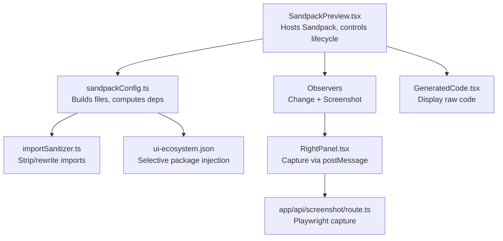
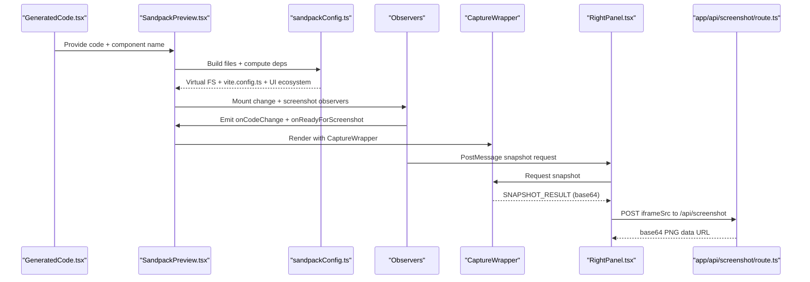
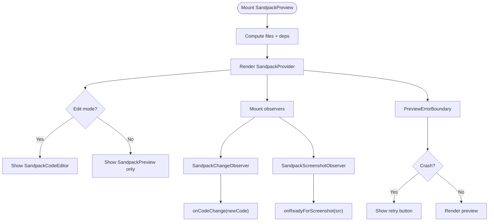
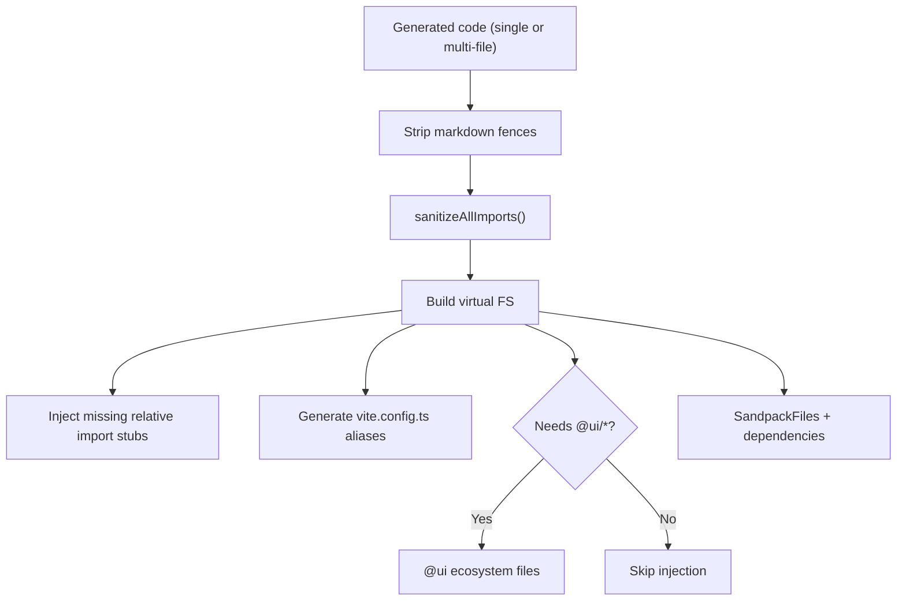
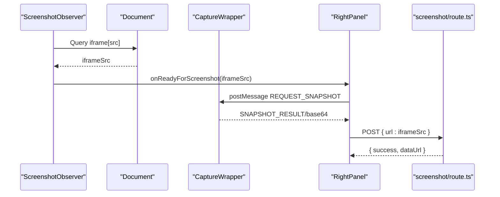
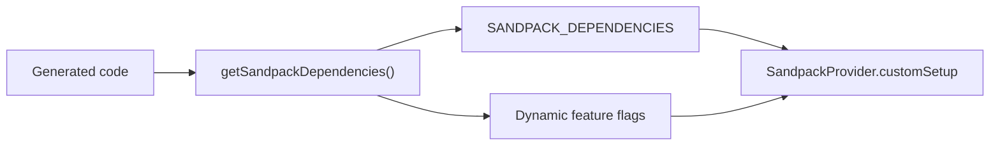

# Live Preview & Sandbox Integration

<cite>
**Referenced Files in This Document**
- [SandpackPreview.tsx](file://components/SandpackPreview.tsx)
- [sandpackConfig.ts](file://lib/sandbox/sandpackConfig.ts)
- [importSanitizer.ts](file://lib/sandbox/importSanitizer.ts)
- [ui-ecosystem.json](file://lib/sandbox/ui-ecosystem.json)
- [RightPanel.tsx](file://components/ide/RightPanel.tsx)
- [route.ts](file://app/api/screenshot/route.ts)
- [GeneratedCode.tsx](file://components/GeneratedCode.tsx)
</cite>

## Table of Contents
1. [Introduction](#introduction)
2. [Project Structure](#project-structure)
3. [Core Components](#core-components)
4. [Architecture Overview](#architecture-overview)
5. [Detailed Component Analysis](#detailed-component-analysis)
6. [Dependency Analysis](#dependency-analysis)
7. [Performance Considerations](#performance-considerations)
8. [Troubleshooting Guide](#troubleshooting-guide)
9. [Conclusion](#conclusion)

## Introduction
This document explains the live preview and sandbox integration system that powers real-time rendering of AI-generated UI components. It covers the CodeSandbox Sandpack configuration, dependency management, component isolation, environment setup, security safeguards, and the integration pipeline that connects generated code to the preview system. It also details hot reloading, error handling, screenshot capture, and practical guidance for customizing the sandbox environment and extending preview capabilities.

## Project Structure
The live preview system spans several modules:
- A presentation component that hosts the Sandpack sandbox and exposes editing and screenshot capabilities
- A configuration module that builds the virtual file system and computes dependencies
- A sanitization module that guards against unsafe or unsupported imports
- An ecosystem injection mechanism that selectively adds UI packages when referenced
- A screenshot pipeline that captures previews reliably across origins

**Diagram sources**
- [SandpackPreview.tsx:144-286](file://components/SandpackPreview.tsx#L144-L286)
- [sandpackConfig.ts:112-401](file://lib/sandbox/sandpackConfig.ts#L112-L401)
- [importSanitizer.ts:16-224](file://lib/sandbox/importSanitizer.ts#L16-L224)
- [ui-ecosystem.json:1-49](file://lib/sandbox/ui-ecosystem.json#L1-L49)
- [RightPanel.tsx:129-391](file://components/ide/RightPanel.tsx#L129-L391)
- [route.ts:1-45](file://app/api/screenshot/route.ts#L1-L45)
- [GeneratedCode.tsx:1-149](file://components/GeneratedCode.tsx#L1-L149)

**Section sources**
- [SandpackPreview.tsx:1-287](file://components/SandpackPreview.tsx#L1-L287)
- [sandpackConfig.ts:1-485](file://lib/sandbox/sandpackConfig.ts#L1-L485)
- [importSanitizer.ts:1-224](file://lib/sandbox/importSanitizer.ts#L1-L224)
- [ui-ecosystem.json:1-49](file://lib/sandbox/ui-ecosystem.json#L1-L49)
- [RightPanel.tsx:129-391](file://components/ide/RightPanel.tsx#L129-L391)
- [route.ts:1-45](file://app/api/screenshot/route.ts#L1-L45)
- [GeneratedCode.tsx:1-149](file://components/GeneratedCode.tsx#L1-L149)

## Core Components
- SandpackPreview component: Provides a live preview pane powered by Sandpack, with optional inline editor, custom reload, and screenshot readiness detection.
- Sandpack configuration builder: Constructs the virtual file system, injects UI ecosystem packages conditionally, and generates Vite-compatible bootstrap files.
- Import sanitizer: Filters and replaces unknown or hallucinated imports to maintain sandbox stability.
- Screenshot pipeline: Captures previews reliably using a postMessage bridge and Playwright server-side capture.

**Section sources**
- [SandpackPreview.tsx:144-286](file://components/SandpackPreview.tsx#L144-L286)
- [sandpackConfig.ts:112-401](file://lib/sandbox/sandpackConfig.ts#L112-L401)
- [importSanitizer.ts:16-224](file://lib/sandbox/importSanitizer.ts#L16-L224)
- [RightPanel.tsx:129-391](file://components/ide/RightPanel.tsx#L129-L391)
- [route.ts:1-45](file://app/api/screenshot/route.ts#L1-L45)

## Architecture Overview
The system orchestrates code generation, sandbox setup, and preview capture:

**Diagram sources**
- [GeneratedCode.tsx:1-149](file://components/GeneratedCode.tsx#L1-L149)
- [SandpackPreview.tsx:144-286](file://components/SandpackPreview.tsx#L144-L286)
- [sandpackConfig.ts:112-401](file://lib/sandbox/sandpackConfig.ts#L112-L401)
- [RightPanel.tsx:129-391](file://components/ide/RightPanel.tsx#L129-L391)
- [route.ts:1-45](file://app/api/screenshot/route.ts#L1-L45)

## Detailed Component Analysis

### SandpackPreview Component
Responsibilities:
- Host the SandpackProvider with a Vite-based template and dark theme
- Build the virtual file system and dynamic dependencies from generated code
- Expose an inline editor and a custom reload button
- Observe code changes and preview readiness for screenshot capture
- Wrap the preview in an error boundary to gracefully handle mount failures

Key behaviors:
- Active file selection depends on whether the input is single-file or multi-file
- Uses a stable callback reference to avoid re-firing screenshot events
- Custom reload toggles a key to force Sandpack rebuild/reload
- Error boundary displays a friendly retry UI when the preview crashes

**Diagram sources**
- [SandpackPreview.tsx:144-286](file://components/SandpackPreview.tsx#L144-L286)

**Section sources**
- [SandpackPreview.tsx:144-286](file://components/SandpackPreview.tsx#L144-L286)

### Sandpack Configuration Builder
Responsibilities:
- Strip markdown fences from generated code
- Sanitize imports to prevent unresolved references
- Inject missing relative imports as stub components
- Build a Vite-compatible file tree with HTML, entry, styles, configs, and a capture wrapper
- Conditionally inject the UI ecosystem packages when referenced
- Generate vite.config.ts aliases for @ui/* packages

Dependency management:
- Maintains a curated list of production and dev dependencies
- Dynamically resolves dependencies based on code content
- Ensures critical packages (e.g., html2canvas, radix-ui, tailwind helpers) are always present

**Diagram sources**
- [sandpackConfig.ts:112-401](file://lib/sandbox/sandpackConfig.ts#L112-L401)

**Section sources**
- [sandpackConfig.ts:112-401](file://lib/sandbox/sandpackConfig.ts#L112-L401)

### Import Sanitizer
Responsibilities:
- Parse import statements and detect unknown packages
- Replace hallucinated or disallowed packages with inline stubs
- Drop side-effect-only imports from unknown packages
- Generate appropriate stubs for default imports, named exports, hooks, providers, and generic components

Security and isolation:
- Restricts imports to an allow-list of known-safe packages and internal aliases
- Warns on common hallucinations (e.g., chakra-ui, antd) to aid debugging
- Preserves relative imports and Next.js-style aliases configured in vite.config.ts

**Section sources**
- [importSanitizer.ts:16-224](file://lib/sandbox/importSanitizer.ts#L16-L224)

### UI Ecosystem Injection
Mechanism:
- Loads a curated set of UI component files from ui-ecosystem.json
- Injects them into the virtual FS only when the generated code references @ui/* or related aliases
- Reduces cold-start overhead and avoids timeouts in Sandpack’s node environment

**Section sources**
- [ui-ecosystem.json:1-49](file://lib/sandbox/ui-ecosystem.json#L1-L49)
- [sandpackConfig.ts:386-398](file://lib/sandbox/sandpackConfig.ts#L386-L398)

### Screenshot Pipeline
Workflow:
- SandpackScreenshotObserver detects when the preview is ready and emits a sentinel URL
- RightPanel listens for postMessage snapshots from the preview
- When needed, RightPanel requests a snapshot from the preview and receives base64 data
- RightPanel posts the iframe URL to /api/screenshot for server-side capture via Playwright
- The server navigates to the URL, waits for the UI to settle, and returns a base64 PNG

**Diagram sources**
- [SandpackPreview.tsx:65-103](file://components/SandpackPreview.tsx#L65-L103)
- [RightPanel.tsx:129-391](file://components/ide/RightPanel.tsx#L129-L391)
- [route.ts:1-45](file://app/api/screenshot/route.ts#L1-L45)

**Section sources**
- [SandpackPreview.tsx:65-103](file://components/SandpackPreview.tsx#L65-L103)
- [RightPanel.tsx:129-391](file://components/ide/RightPanel.tsx#L129-L391)
- [route.ts:1-45](file://app/api/screenshot/route.ts#L1-L45)

## Dependency Analysis
The system balances flexibility and safety:
- Production dependencies are curated and versioned to ensure reproducibility
- Dynamic dependency resolution ensures only required packages are included
- Dev dependencies are separated to avoid polluting the preview runtime
- Aliases in vite.config.ts align with tsconfig paths for predictable resolution

**Diagram sources**
- [sandpackConfig.ts:427-472](file://lib/sandbox/sandpackConfig.ts#L427-L472)

**Section sources**
- [sandpackConfig.ts:403-482](file://lib/sandbox/sandpackConfig.ts#L403-L482)

## Performance Considerations
- Conditional UI ecosystem injection prevents unnecessary file graph loading
- Postponed screenshot capture reduces server load and improves responsiveness
- Custom reload avoids Sandpack’s built-in refresh issues and reduces flicker
- html2canvas snapshot is delayed to ensure UI stability before capture

## Troubleshooting Guide
Common issues and remedies:
- Preview crashes: Use the retry button in the error boundary; verify that the generated code mounts without external dependencies not present in the sandbox
- Missing components: The import sanitizer replaces unknown packages with stubs; confirm that @ui/* packages are properly aliased and injected
- Screenshot capture fails: Ensure the iframe URL is passed to the screenshot endpoint; for local frames, the system uses a sentinel URL to trigger client-side capture
- Slow cold starts: Reduce unnecessary @ui/* references or split multi-file outputs to minimize injected files

**Section sources**
- [SandpackPreview.tsx:109-140](file://components/SandpackPreview.tsx#L109-L140)
- [importSanitizer.ts:16-224](file://lib/sandbox/importSanitizer.ts#L16-L224)
- [RightPanel.tsx:380-391](file://components/ide/RightPanel.tsx#L380-L391)

## Conclusion
The live preview and sandbox integration system provides a robust, secure, and extensible environment for rendering AI-generated UI components. By combining a configurable virtual file system, targeted dependency management, import sanitization, and a resilient screenshot pipeline, it enables real-time iteration, accurate previews, and reliable automation. Extensibility is achieved through selective ecosystem injection, dynamic dependency resolution, and a modular observer pattern that integrates seamlessly with the broader IDE workflow.