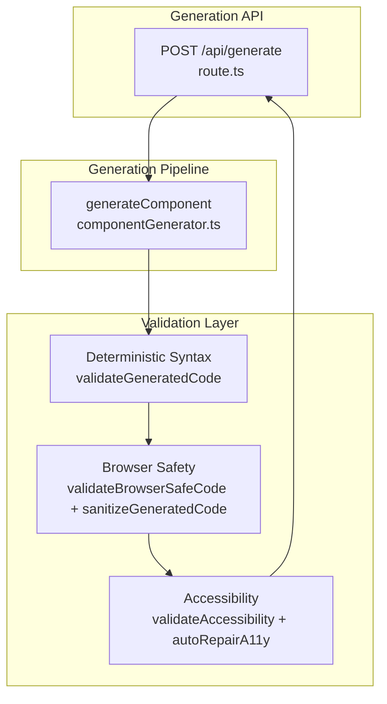
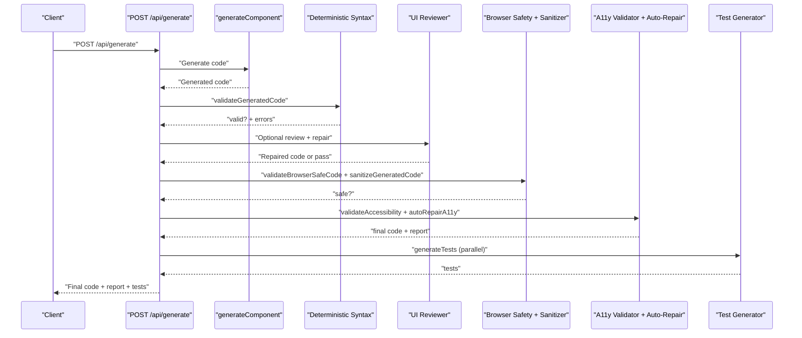
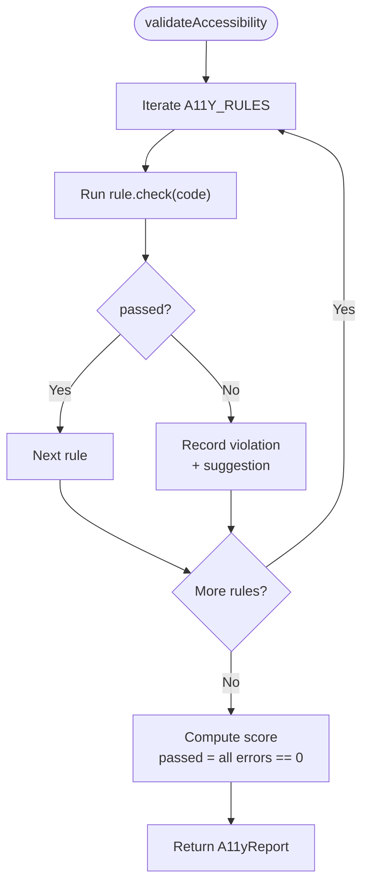
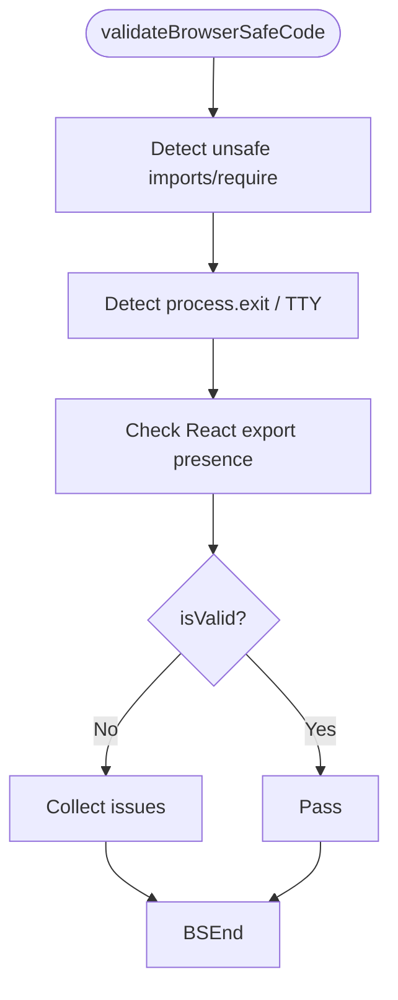
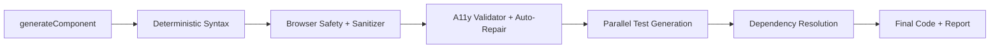
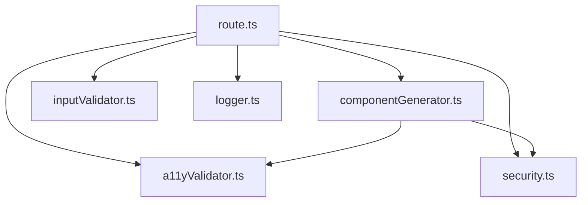

# Validation & Quality Assurance

<cite>
**Referenced Files in This Document**
- [a11yValidator.ts](file://lib/validation/a11yValidator.ts)
- [security.ts](file://lib/validation/security.ts)
- [schemas.ts](file://lib/validation/schemas.ts)
- [route.ts](file://app/api/generate/route.ts)
- [componentGenerator.ts](file://lib/ai/componentGenerator.ts)
- [a11yValidator.test.ts](file://__tests__/a11yValidator.test.ts)
- [security.test.ts](file://__tests__/security.test.ts)
- [PipelineStatus.tsx](file://components/PipelineStatus.tsx)
- [inputValidator.ts](file://lib/intelligence/inputValidator.ts)
- [logger.ts](file://lib/logger.ts)
</cite>

## Table of Contents
1. [Introduction](#introduction)
2. [Project Structure](#project-structure)
3. [Core Components](#core-components)
4. [Architecture Overview](#architecture-overview)
5. [Detailed Component Analysis](#detailed-component-analysis)
6. [Dependency Analysis](#dependency-analysis)
7. [Performance Considerations](#performance-considerations)
8. [Troubleshooting Guide](#troubleshooting-guide)
9. [Conclusion](#conclusion)

## Introduction
This document describes the validation and quality assurance system that ensures generated UI code meets WCAG 2.1 AA accessibility standards, remains browser-safe, and passes deterministic syntax checks. It explains the multi-layer validation approach, auto-repair capabilities, deterministic rules, and error correction mechanisms. It also details how validation integrates with the generation pipeline, including examples of validation failures and automatic repairs, and outlines configuration options for customizing validation rules.

## Project Structure
The validation system spans several modules:
- Accessibility validation: rule-based checker and auto-repair for WCAG 2.1 AA
- Browser safety validation: detects unsafe Node.js/TTY APIs and enforces React export correctness
- Deterministic syntax validation: catches common AI generation artifacts that break parsers
- Integration: orchestrated in the generation API route and component generator

**Diagram sources**
- [route.ts:182-431](file://app/api/generate/route.ts#L182-L431)
- [componentGenerator.ts:353-391](file://lib/ai/componentGenerator.ts#L353-L391)
- [security.ts:6-34](file://lib/validation/security.ts#L6-L34)
- [security.ts:44-128](file://lib/validation/security.ts#L44-L128)
- [a11yValidator.ts:264-297](file://lib/validation/a11yValidator.ts#L264-L297)
- [a11yValidator.ts:303-375](file://lib/validation/a11yValidator.ts#L303-L375)

**Section sources**
- [route.ts:182-431](file://app/api/generate/route.ts#L182-L431)
- [componentGenerator.ts:353-391](file://lib/ai/componentGenerator.ts#L353-L391)

## Core Components
- Accessibility Validator: Implements WCAG 2.1 AA rules and computes a pass/fail score. It reports violations with severity and suggestions.
- Auto-Repair: Applies targeted, deterministic fixes for common accessibility issues.
- Browser Safety Validator: Ensures generated code is safe for the browser sandbox and sanitizes problematic constructs.
- Deterministic Syntax Validator: Identifies and repairs common AI artifacts that break parsers.

**Section sources**
- [a11yValidator.ts:10-260](file://lib/validation/a11yValidator.ts#L10-L260)
- [a11yValidator.ts:264-297](file://lib/validation/a11yValidator.ts#L264-L297)
- [a11yValidator.ts:303-375](file://lib/validation/a11yValidator.ts#L303-L375)
- [security.ts:6-34](file://lib/validation/security.ts#L6-L34)
- [security.ts:44-128](file://lib/validation/security.ts#L44-L128)

## Architecture Overview
The generation pipeline applies validation and repair in a staged, parallelized manner:
- Deterministic syntax validation and optional repair
- UI Expert Review and Repair Agent (skipped for local/Ollama models)
- Browser safety validation and sanitization
- Accessibility validation and auto-repair
- Test generation (parallel)
- Dependency resolution for multi-file outputs

**Diagram sources**
- [route.ts:182-431](file://app/api/generate/route.ts#L182-L431)
- [componentGenerator.ts:353-391](file://lib/ai/componentGenerator.ts#L353-L391)

## Detailed Component Analysis

### Accessibility Validation and Auto-Repair
- Rule-based enforcement: The validator evaluates generated TSX against WCAG 2.1 AA rules and categorizes violations by severity.
- Scoring: Computes a pass/fail score based on the number and severity of violations.
- Suggestions: Provides actionable suggestions for each violation.
- Auto-repair: Applies deterministic fixes for common issues such as focus indicators, error announcements, missing aria labels, and icon-only buttons.

**Diagram sources**
- [a11yValidator.ts:264-297](file://lib/validation/a11yValidator.ts#L264-L297)

Auto-repair focuses on:
- Adding focus ring replacements for elements using outline removal
- Announcing error messages to assistive technologies
- Supplying aria-labels for unlabeled inputs and icon-only buttons
- Suggesting improvements for color contrast and heading hierarchy

```mermaid
flowchart TD
ARStart(["autoRepairA11y"]) --> F1["Replace outline-none<br/>with focus:ring-*"]
F1 --> F2["Add role='alert' + aria-live<br/>to error text"]
F2 --> F3["Add aria-label to <input>"]
F3 --> F4["Add aria-label to icon-only <button>"]
F4 --> AREnd["Return {code, appliedFixes}"]
```

**Diagram sources**
- [a11yValidator.ts:303-375](file://lib/validation/a11yValidator.ts#L303-L375)

Validation failures and automatic repairs are covered by unit tests, including:
- Missing alt attributes on images
- Buttons without accessible names
- Inputs without labels
- Heading hierarchy violations
- Low-contrast color tokens
- Focus visibility issues

**Section sources**
- [a11yValidator.ts:10-260](file://lib/validation/a11yValidator.ts#L10-L260)
- [a11yValidator.ts:264-297](file://lib/validation/a11yValidator.ts#L264-L297)
- [a11yValidator.ts:303-375](file://lib/validation/a11yValidator.ts#L303-L375)
- [a11yValidator.test.ts:1-110](file://__tests__/a11yValidator.test.ts#L1-L110)

### Browser Safety Validation and Sanitization
- Safety checks: Detects Node.js standard library imports, process exit, terminal/TTY manipulation, and missing React exports.
- Sanitization: Normalizes multi-line template literals inside JSX attributes, removes carriage returns, and cleans AI-generated comment artifacts that break parsers.

**Diagram sources**
- [security.ts:6-34](file://lib/validation/security.ts#L6-L34)

Sanitization steps:
- Flatten multi-line template literals in JSX attributes
- Remove carriage returns
- Replace comment-only arrow function bodies and attribute values
- Repair multiline comment artifacts and stray semicolons

**Section sources**
- [security.ts:6-34](file://lib/validation/security.ts#L6-L34)
- [security.ts:44-128](file://lib/validation/security.ts#L44-L128)
- [security.test.ts:1-60](file://__tests__/security.test.ts#L1-L60)

### Deterministic Syntax Validation
- Purpose: Catch AI artifacts that cause parsing failures before expensive review steps.
- Behavior: Validates generated code deterministically and triggers a repair pass when needed.

Integration in the generation pipeline:
- Runs early to fail fast on syntax errors
- Uses a repair instruction set derived from validation errors

**Section sources**
- [route.ts:214-228](file://app/api/generate/route.ts#L214-L228)
- [componentGenerator.ts:353-391](file://lib/ai/componentGenerator.ts#L353-L391)

### Integration with the Generation Pipeline
- Route orchestration: The generation route coordinates deterministic validation, optional reviewer-based repair, browser safety checks, accessibility validation and auto-repair, and parallel test generation.
- Parallelism: Accessibility and test generation run concurrently to reduce latency.
- Dependency resolution: After validation, multi-file outputs are patched to incorporate accessibility repairs.

**Diagram sources**
- [route.ts:182-431](file://app/api/generate/route.ts#L182-L431)

**Section sources**
- [route.ts:182-431](file://app/api/generate/route.ts#L182-L431)
- [PipelineStatus.tsx:29-78](file://components/PipelineStatus.tsx#L29-L78)

## Dependency Analysis
- Validation modules depend on:
  - Accessibility rules and auto-repair logic
  - Browser safety and sanitization logic
  - Deterministic syntax validation
- Generation route depends on:
  - Component generator
  - Reviewer and repair agent
  - Test generator
  - Logger for observability

**Diagram sources**
- [route.ts:182-431](file://app/api/generate/route.ts#L182-L431)
- [componentGenerator.ts:353-391](file://lib/ai/componentGenerator.ts#L353-L391)
- [a11yValidator.ts:264-297](file://lib/validation/a11yValidator.ts#L264-L297)
- [security.ts:6-34](file://lib/validation/security.ts#L6-L34)
- [inputValidator.ts:1-39](file://lib/intelligence/inputValidator.ts#L1-L39)
- [logger.ts:36-88](file://lib/logger.ts#L36-L88)

**Section sources**
- [route.ts:182-431](file://app/api/generate/route.ts#L182-L431)
- [componentGenerator.ts:353-391](file://lib/ai/componentGenerator.ts#L353-L391)

## Performance Considerations
- Early deterministic validation reduces unnecessary downstream work.
- Parallel execution of accessibility and test generation minimizes latency.
- Local/Ollama models bypass the reviewer to avoid expensive inference calls.
- Streaming support allows progressive delivery of code chunks.

[No sources needed since this section provides general guidance]

## Troubleshooting Guide
Common validation failures and resolutions:
- Accessibility failures:
  - Missing alt attributes on images: Add descriptive alt text.
  - Buttons without accessible names: Provide visible text or aria-label.
  - Inputs without labels: Add matching label or aria-label.
  - Focus visibility: Replace outline removal with focus ring utilities.
  - Heading hierarchy: Ensure sequential heading levels.
- Browser safety failures:
  - Unsafe imports or process.exit: Remove unsupported APIs.
  - Missing React export: Ensure a valid default or named export.
  - Comment-only JSX attributes: Replace with valid expressions or undefined.
- Deterministic syntax failures:
  - Multi-line template literals in JSX attributes: Flatten to single line.
  - Carriage returns: Remove to prevent parser errors.

Logs and observability:
- The logger records request-scoped events with timing and metadata to aid debugging.

**Section sources**
- [a11yValidator.test.ts:1-110](file://__tests__/a11yValidator.test.ts#L1-L110)
- [security.test.ts:1-60](file://__tests__/security.test.ts#L1-L60)
- [logger.ts:36-88](file://lib/logger.ts#L36-L88)

## Conclusion
The validation and quality assurance system enforces WCAG 2.1 AA accessibility, ensures browser safety, and performs deterministic syntax checks. It integrates tightly with the generation pipeline, applying auto-repairs where possible and parallelizing tasks for performance. The system’s modular design and deterministic rules enable predictable outcomes and reliable code generation.