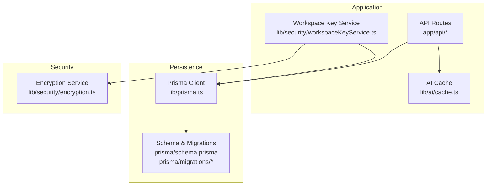
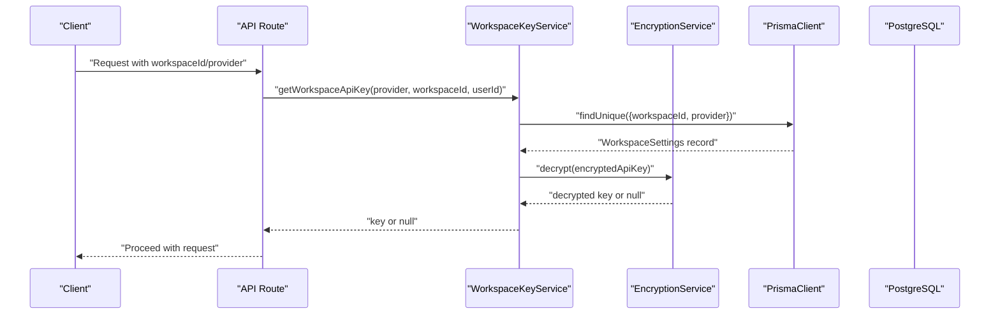
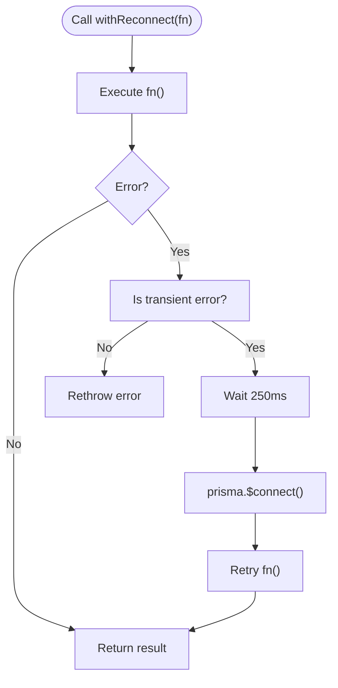
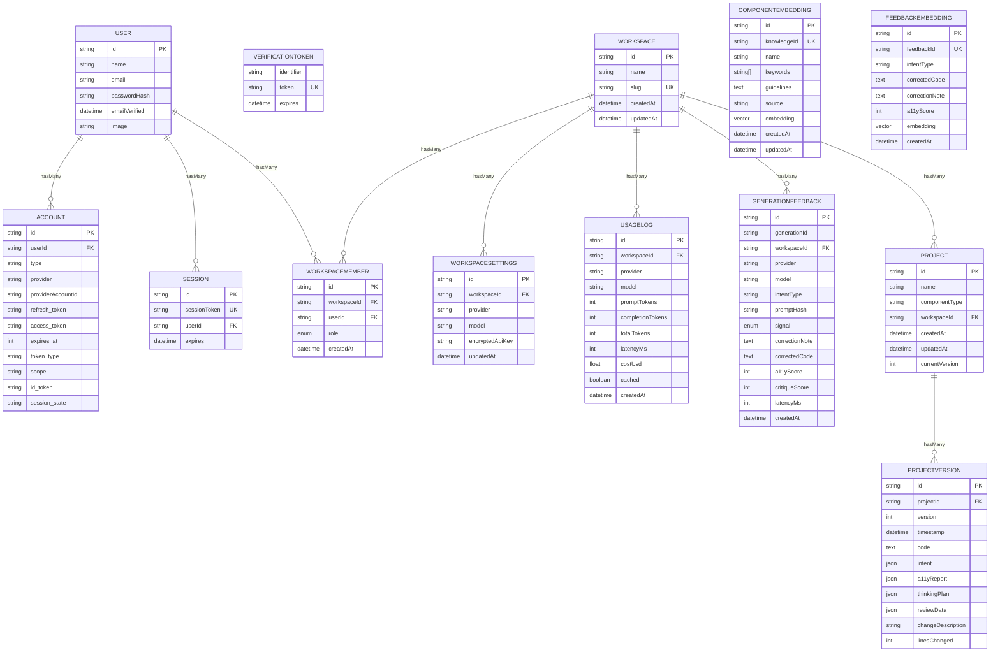
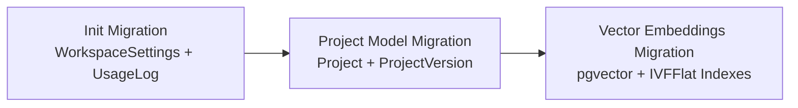
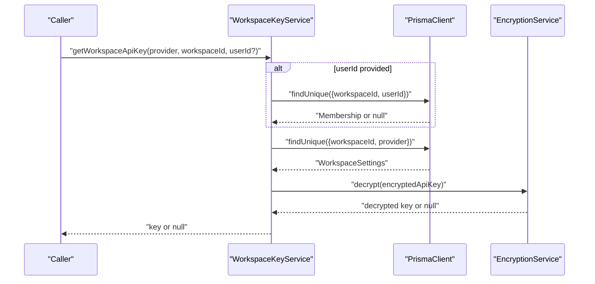
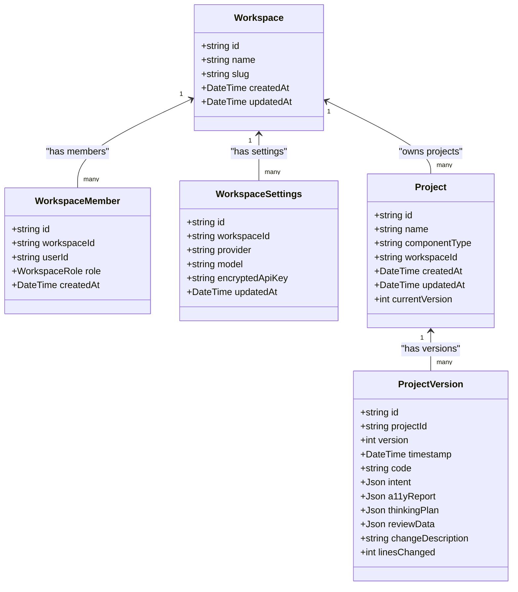
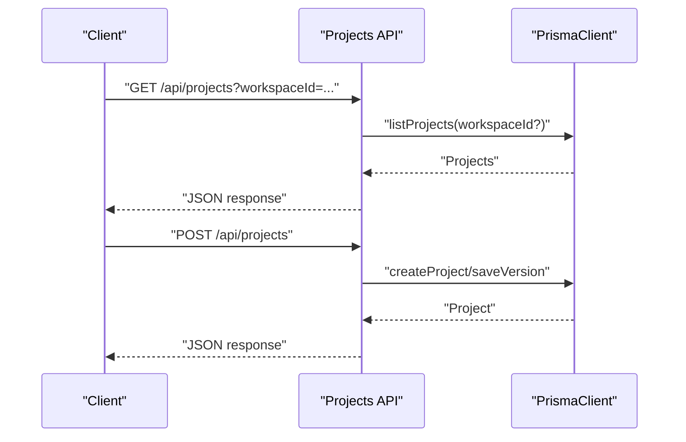
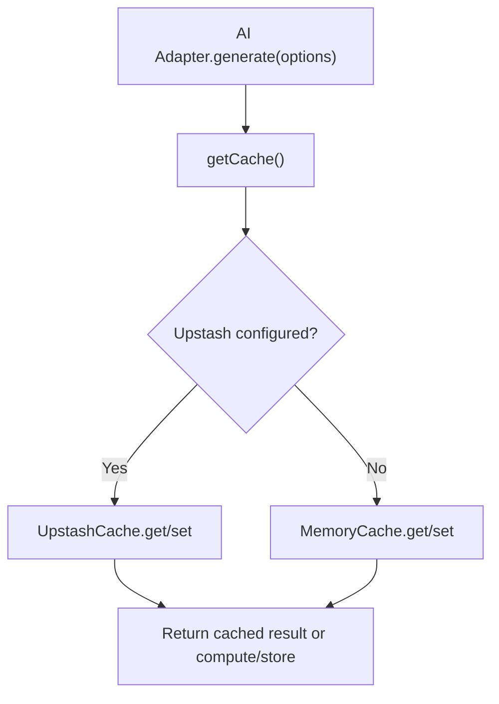
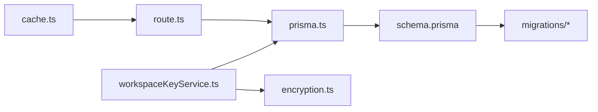

# Data Access Layer

<cite>
**Referenced Files in This Document**
- [prisma.ts](file://lib/prisma.ts)
- [schema.prisma](file://prisma/schema.prisma)
- [encryption.ts](file://lib/security/encryption.ts)
- [workspaceKeyService.ts](file://lib/security/workspaceKeyService.ts)
- [cache.ts](file://lib/ai/cache.ts)
- [route.ts](file://app/api/projects/route.ts)
- [20260403065359_init_workspace_settings/migration.sql](file://prisma/migrations/20260403065359_init_workspace_settings/migration.sql)
- [20260407120000_add_project_model/migration.sql](file://prisma/migrations/20260407120000_add_project_model/migration.sql)
- [20260409100000_add_vector_embeddings/migration.sql](file://prisma/migrations/20260409100000_add_vector_embeddings/migration.sql)
- [encryption.test.ts](file://__tests__/encryption.test.ts)
- [workspaceKeyService.test.ts](file://__tests__/workspaceKeyService.test.ts)
</cite>

## Table of Contents
1. [Introduction](#introduction)
2. [Project Structure](#project-structure)
3. [Core Components](#core-components)
4. [Architecture Overview](#architecture-overview)
5. [Detailed Component Analysis](#detailed-component-analysis)
6. [Dependency Analysis](#dependency-analysis)
7. [Performance Considerations](#performance-considerations)
8. [Troubleshooting Guide](#troubleshooting-guide)
9. [Conclusion](#conclusion)

## Introduction
This document describes the data access layer architecture, focusing on Prisma ORM usage, database schema design, migration management, encryption and security, workspace-aware models, query patterns, and caching strategies. It explains how encrypted data is stored and accessed, and how application logic integrates with the persistence layer.

## Project Structure
The data access layer is organized around:
- Prisma client singleton and transient error handling
- A declarative schema modeling multi-tenant workspaces, projects, embeddings, and usage metrics
- Encryption utilities and a workspace-scoped key service with in-memory caching
- Pluggable caching for AI generation results
- API routes that drive persistence operations

**Diagram sources**
- [prisma.ts:1-70](file://lib/prisma.ts#L1-L70)
- [schema.prisma:1-222](file://prisma/schema.prisma#L1-L222)
- [encryption.ts:1-95](file://lib/security/encryption.ts#L1-L95)
- [workspaceKeyService.ts:1-138](file://lib/security/workspaceKeyService.ts#L1-L138)
- [cache.ts:1-140](file://lib/ai/cache.ts#L1-L140)
- [route.ts:1-92](file://app/api/projects/route.ts#L1-L92)

**Section sources**
- [prisma.ts:1-70](file://lib/prisma.ts#L1-L70)
- [schema.prisma:1-222](file://prisma/schema.prisma#L1-L222)

## Core Components
- Prisma client singleton with automatic reconnection for transient Neon errors
- Workspace-aware models with multi-tenancy via WorkspaceMember relations
- Encrypted storage for sensitive keys in WorkspaceSettings
- In-memory TTL cache for workspace API keys
- Pluggable cache for AI generation results (memory or Upstash Redis)
- Migration-driven schema evolution for projects and vector embeddings

**Section sources**
- [prisma.ts:20-70](file://lib/prisma.ts#L20-L70)
- [schema.prisma:64-110](file://prisma/schema.prisma#L64-L110)
- [workspaceKeyService.ts:1-138](file://lib/security/workspaceKeyService.ts#L1-L138)
- [cache.ts:1-140](file://lib/ai/cache.ts#L1-L140)

## Architecture Overview
The data access layer follows a layered pattern:
- Application routes orchestrate persistence operations
- Prisma handles ORM mapping and database connectivity
- Encryption service secures sensitive data at rest
- Workspace key service enforces authorization and caches decrypted keys
- AI cache reduces repeated compute by storing generation results

**Diagram sources**
- [route.ts:1-92](file://app/api/projects/route.ts#L1-L92)
- [workspaceKeyService.ts:32-95](file://lib/security/workspaceKeyService.ts#L32-L95)
- [encryption.ts:46-68](file://lib/security/encryption.ts#L46-L68)
- [prisma.ts:58-69](file://lib/prisma.ts#L58-L69)

## Detailed Component Analysis

### Prisma Client Singleton and Reconnection
- A global singleton ensures a single PrismaClient per Node process, preventing connection exhaustion on serverless platforms.
- Automatic reconnection wraps operations to handle transient Neon errors by reconnecting and retrying once after a short delay.

**Diagram sources**
- [prisma.ts:58-69](file://lib/prisma.ts#L58-L69)

**Section sources**
- [prisma.ts:20-70](file://lib/prisma.ts#L20-L70)

### Database Schema Design
- Authentication models: Account, Session, User, VerificationToken
- Multi-tenancy core: Workspace, WorkspaceMember with roles
- Workspace settings: provider/model and encrypted API key
- Usage logging: provider/model/token counts/cost/cached timestamps
- Feedback loop: GenerationFeedback with intent metadata and scores
- Projects: Project and ProjectVersion with JSON intent/a11y reports
- Vector embeddings: ComponentEmbedding and FeedbackEmbedding with pgvector

**Diagram sources**
- [schema.prisma:13-222](file://prisma/schema.prisma#L13-L222)

**Section sources**
- [schema.prisma:1-222](file://prisma/schema.prisma#L1-L222)

### Migration Management
- Initial workspace settings and usage logs
- Project model and versioning with foreign keys and unique constraints
- Vector embeddings with pgvector extension and IVFFlat indexes

**Diagram sources**
- [20260403065359_init_workspace_settings/migration.sql:1-32](file://prisma/migrations/20260403065359_init_workspace_settings/migration.sql#L1-L32)
- [20260407120000_add_project_model/migration.sql:1-37](file://prisma/migrations/20260407120000_add_project_model/migration.sql#L1-L37)
- [20260409100000_add_vector_embeddings/migration.sql:1-43](file://prisma/migrations/20260409100000_add_vector_embeddings/migration.sql#L1-L43)

**Section sources**
- [20260403065359_init_workspace_settings/migration.sql:1-32](file://prisma/migrations/20260403065359_init_workspace_settings/migration.sql#L1-L32)
- [20260407120000_add_project_model/migration.sql:1-37](file://prisma/migrations/20260407120000_add_project_model/migration.sql#L1-L37)
- [20260409100000_add_vector_embeddings/migration.sql:1-43](file://prisma/migrations/20260409100000_add_vector_embeddings/migration.sql#L1-L43)

### Encryption Layer and Security Measures
- AES-256-GCM encryption with random IV and auth tag
- Flexible key derivation supporting base64 or raw 32-byte secrets, with a safe fallback
- Workspace API keys stored encrypted in WorkspaceSettings.encryptedApiKey
- Workspace key service validates user membership and caches decrypted keys with TTL

**Diagram sources**
- [workspaceKeyService.ts:32-95](file://lib/security/workspaceKeyService.ts#L32-L95)
- [encryption.ts:46-68](file://lib/security/encryption.ts#L46-L68)
- [schema.prisma:99-110](file://prisma/schema.prisma#L99-L110)

**Section sources**
- [encryption.ts:1-95](file://lib/security/encryption.ts#L1-L95)
- [workspaceKeyService.ts:1-138](file://lib/security/workspaceKeyService.ts#L1-L138)
- [schema.prisma:99-110](file://prisma/schema.prisma#L99-L110)

### Workspace-Aware Data Models
- Workspace holds members, settings, projects, usage logs, and feedback
- WorkspaceMember links users to workspaces with role enforcement
- WorkspaceSettings stores provider-specific model and encrypted API key
- Projects and ProjectVersions are scoped to a workspace with cascade deletes

**Diagram sources**
- [schema.prisma:64-187](file://prisma/schema.prisma#L64-L187)

**Section sources**
- [schema.prisma:64-187](file://prisma/schema.prisma#L64-L187)

### Query Patterns and Authorization
- Workspace key retrieval validates membership when a userId is provided
- Global fallback scans across workspaces for a usable key when using a default workspace
- Project APIs accept workspaceId filters and enforce presence of required fields

**Diagram sources**
- [route.ts:7-92](file://app/api/projects/route.ts#L7-L92)

**Section sources**
- [route.ts:1-92](file://app/api/projects/route.ts#L1-L92)

### Caching Strategies
- In-memory cache with TTL for workspace API keys to reduce DB and decryption overhead
- Pluggable cache provider: Upstash Redis in production, memory cache in development
- Deterministic cache keys derived from generation options

**Diagram sources**
- [cache.ts:108-140](file://lib/ai/cache.ts#L108-L140)
- [workspaceKeyService.ts:19-24](file://lib/security/workspaceKeyService.ts#L19-L24)

**Section sources**
- [workspaceKeyService.ts:1-138](file://lib/security/workspaceKeyService.ts#L1-L138)
- [cache.ts:1-140](file://lib/ai/cache.ts#L1-L140)

## Dependency Analysis
- Workspace key service depends on Prisma for membership and settings lookup, and on encryption service for decryption
- Prisma client depends on the schema and migrations for model definitions and indexes
- AI cache depends on environment variables for Upstash configuration
- API routes depend on project store functions and Prisma for persistence

**Diagram sources**
- [workspaceKeyService.ts:8-9](file://lib/security/workspaceKeyService.ts#L8-L9)
- [prisma.ts:1-2](file://lib/prisma.ts#L1-L2)
- [encryption.ts](file://lib/security/encryption.ts#L1)
- [route.ts:3-4](file://app/api/projects/route.ts#L3-L4)
- [cache.ts:1-140](file://lib/ai/cache.ts#L1-L140)
- [schema.prisma:1-222](file://prisma/schema.prisma#L1-L222)

**Section sources**
- [workspaceKeyService.ts:1-138](file://lib/security/workspaceKeyService.ts#L1-L138)
- [prisma.ts:1-70](file://lib/prisma.ts#L1-L70)
- [cache.ts:1-140](file://lib/ai/cache.ts#L1-L140)
- [schema.prisma:1-222](file://prisma/schema.prisma#L1-L222)

## Performance Considerations
- Use the Prisma singleton to avoid connection exhaustion on serverless platforms
- Apply withReconnect for operations susceptible to transient Neon errors
- Leverage TTL caching for workspace API keys to minimize DB and decryption calls
- Use Upstash Redis for AI generation caching to reduce compute costs and latency
- Keep vector indexes tuned (IVFFlat lists) as data scales

## Troubleshooting Guide
- Encryption secret validation: The encryption module logs a critical warning if the key is missing or invalid at startup; requests will fail-safe at runtime
- Workspace key cache invalidation: Use the provided invalidation function to evict stale entries
- Neon transient errors: The withReconnect wrapper retries once after a brief delay; ensure environment variables are set for production stability
- Testing: Unit tests validate encryption correctness and workspace key service caching behavior

**Section sources**
- [encryption.ts:81-94](file://lib/security/encryption.ts#L81-L94)
- [workspaceKeyService.ts:100-106](file://lib/security/workspaceKeyService.ts#L100-L106)
- [prisma.ts:58-69](file://lib/prisma.ts#L58-L69)
- [encryption.test.ts:1-49](file://__tests__/encryption.test.ts#L1-L49)
- [workspaceKeyService.test.ts:1-69](file://__tests__/workspaceKeyService.test.ts#L1-L69)

## Conclusion
The data access layer combines a robust Prisma client singleton, a secure encryption layer for sensitive keys, workspace-aware models, and pragmatic caching strategies. Together, these components deliver reliable, scalable, and secure persistence for multi-tenant workspaces, project versioning, and vector-backed retrieval.