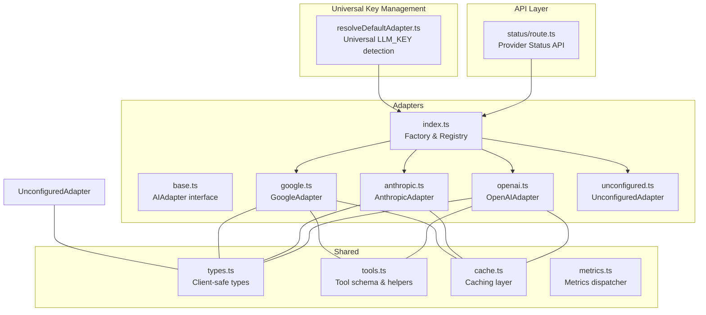
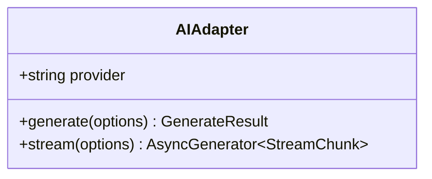
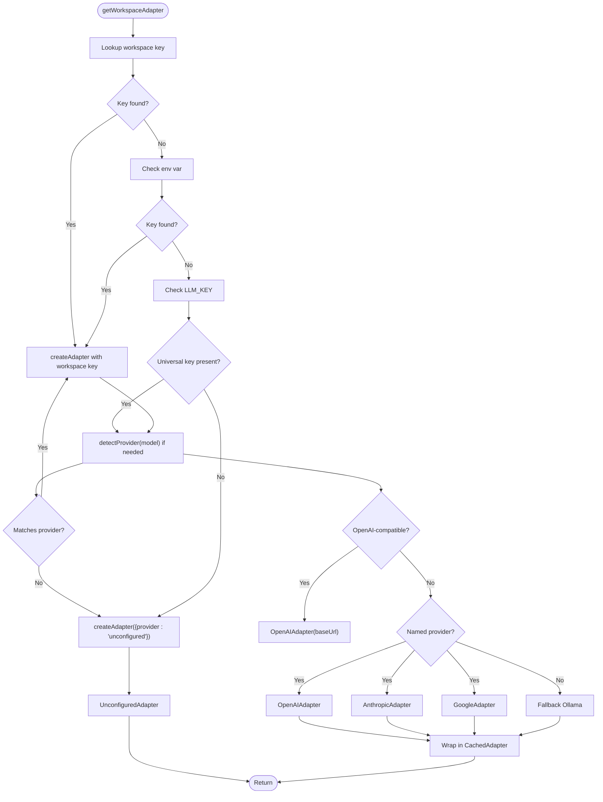
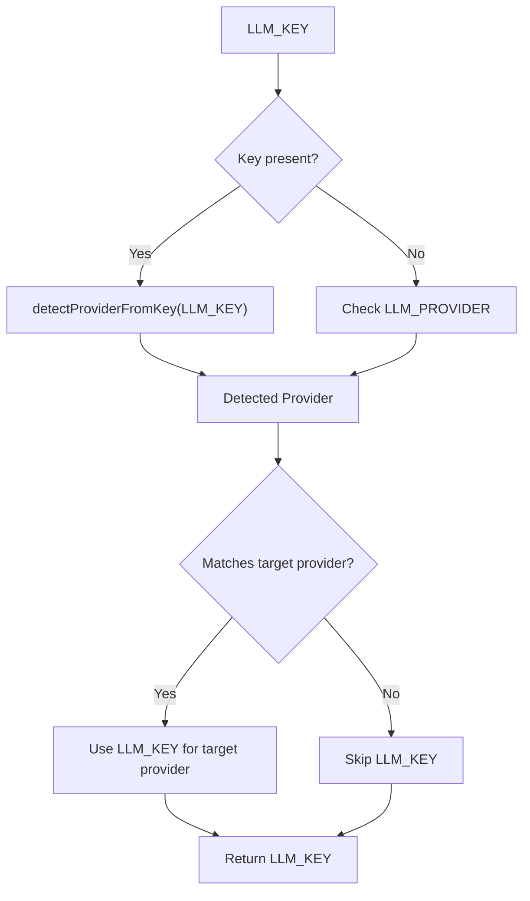
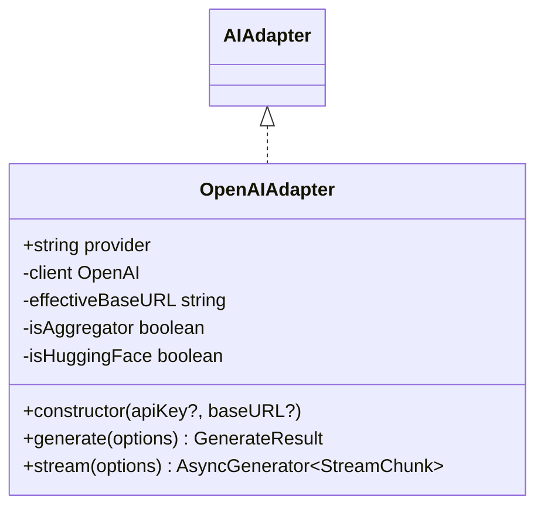
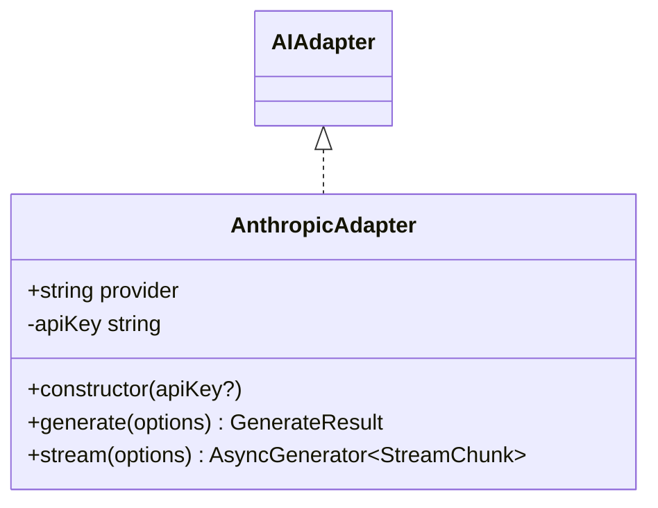
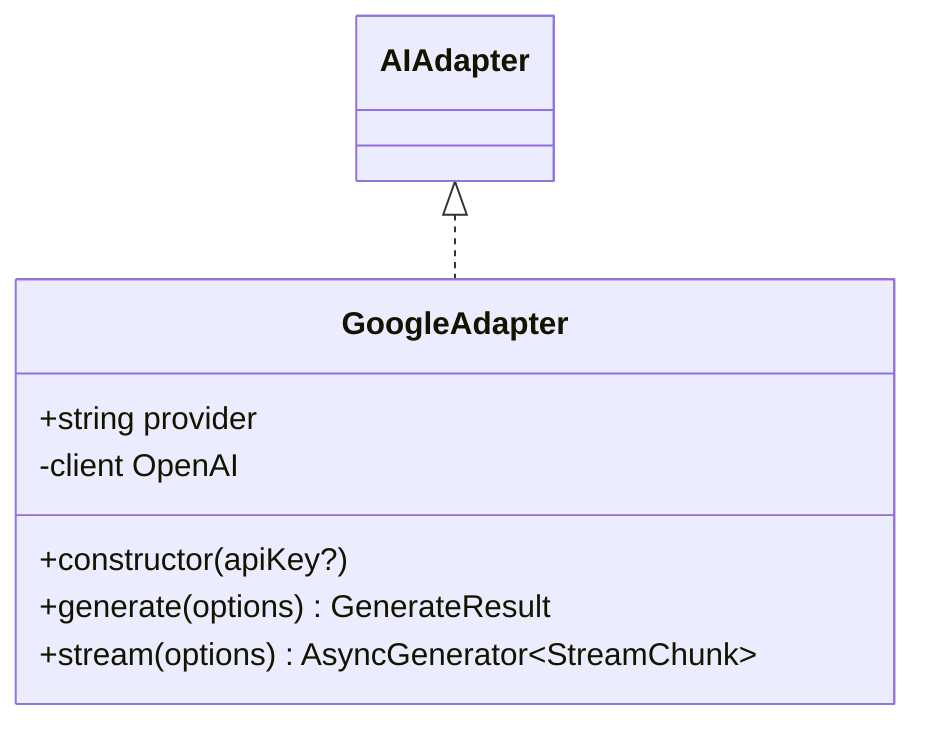
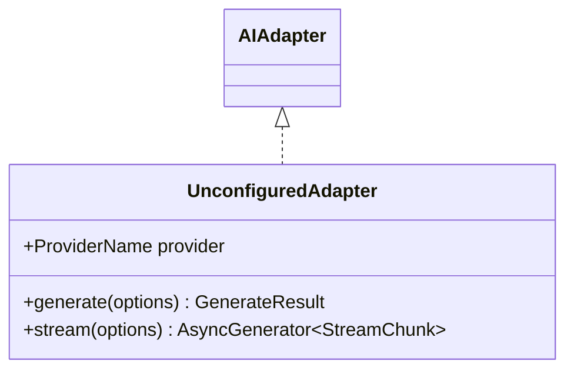
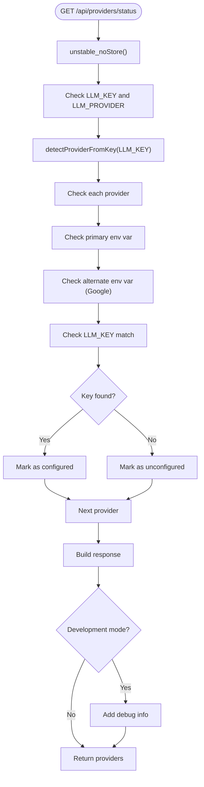
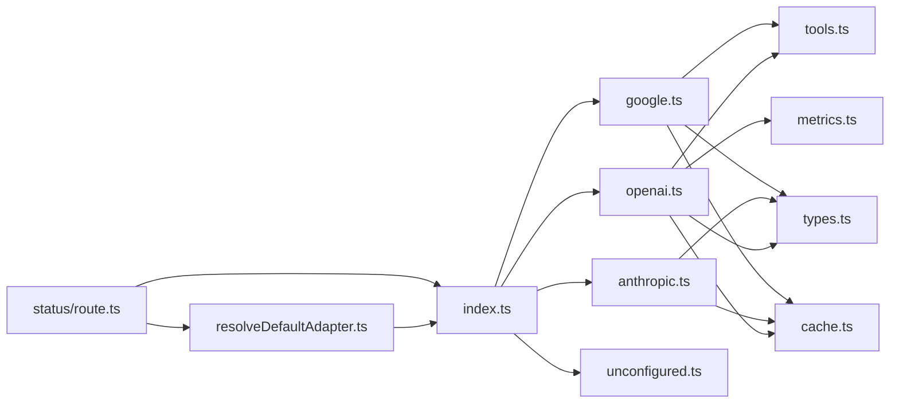

# AI Provider Adapters

<cite>
**Referenced Files in This Document**
- [index.ts](file://lib/ai/adapters/index.ts)
- [base.ts](file://lib/ai/adapters/base.ts)
- [openai.ts](file://lib/ai/adapters/openai.ts)
- [anthropic.ts](file://lib/ai/adapters/anthropic.ts)
- [google.ts](file://lib/ai/adapters/google.ts)
- [ollama.ts](file://lib/ai/adapters/ollama.ts)
- [unconfigured.ts](file://lib/ai/adapters/unconfigured.ts)
- [types.ts](file://lib/ai/types.ts)
- [tools.ts](file://lib/ai/tools.ts)
- [cache.ts](file://lib/ai/cache.ts)
- [metrics.ts](file://lib/ai/metrics.ts)
- [resolveDefaultAdapter.ts](file://lib/ai/resolveDefaultAdapter.ts)
- [adapters.test.ts](file://__tests__/adapters.test.ts)
- [adapterIndex.test.ts](file://__tests__/adapterIndex.test.ts)
- [status.route.ts](file://app/api/providers/status/route.ts)
</cite>

## Update Summary
**Changes Made**
- Updated supported providers list from 5 to 4 providers (OpenAI, Anthropic, Google, Groq)
- Removed Ollama adapter from factory pattern implementation and dynamic instantiation
- Updated provider detection logic to exclude Ollama from model-based detection
- Removed Ollama-specific configuration examples and troubleshooting guides
- Updated architecture diagrams and dependency analysis to reflect Ollama removal

## Table of Contents
1. [Introduction](#introduction)
2. [Project Structure](#project-structure)
3. [Core Components](#core-components)
4. [Architecture Overview](#architecture-overview)
5. [Detailed Component Analysis](#detailed-component-analysis)
6. [Dependency Analysis](#dependency-analysis)
7. [Performance Considerations](#performance-considerations)
8. [Troubleshooting Guide](#troubleshooting-guide)
9. [Conclusion](#conclusion)
10. [Appendices](#appendices)

## Introduction
This document explains the AI provider adapter system that powers provider-agnostic AI integration in the engine. It covers the universal AIAdapter interface, the adapter factory pattern, dynamic adapter instantiation, and provider-specific implementations for OpenAI, Anthropic, Google, and Groq. The system features enhanced provider configuration detection with universal LLM_KEY support, improved provider status reporting, and refined API key management interface that automatically detects provider types from key formats.

**Updated** Removed Ollama adapter support, reducing supported providers from 5 to 4. The system now focuses on cloud-based providers with enhanced universal key management capabilities.

## Project Structure
The adapter system lives under lib/ai/adapters and is complemented by shared types, tool definitions, caching, metrics, and the universal key management system. Note: Ollama adapter has been removed from the current implementation.



**Diagram sources**
- [index.ts:10-12](file://lib/ai/adapters/index.ts#L10-L12)
- [index.ts:18-21](file://lib/ai/adapters/index.ts#L18-L21)
- [index.ts:145-194](file://lib/ai/adapters/index.ts#L145-L194)
- [index.ts:297-301](file://lib/ai/adapters/index.ts#L297-L301)

**Section sources**
- [index.ts:10-12](file://lib/ai/adapters/index.ts#L10-L12)
- [index.ts:18-21](file://lib/ai/adapters/index.ts#L18-L21)
- [index.ts:145-194](file://lib/ai/adapters/index.ts#L145-L194)

## Core Components
- Universal AIAdapter interface: Defines provider-agnostic generate() and stream() methods, plus a provider identifier. See [AIAdapter:50-72](file://lib/ai/adapters/base.ts#L50-L72).
- Enhanced adapter factory and registry: Resolves credentials securely with universal LLM_KEY support, detects provider automatically from key formats, and instantiates the appropriate adapter. See [getWorkspaceAdapter:223-297](file://lib/ai/adapters/index.ts#L223-L297) and [createAdapter:147-202](file://lib/ai/adapters/index.ts#L147-L202).
- Universal key management: Provides automatic provider detection from API key formats and LLM_PROVIDER binding for explicit provider specification. See [detectProviderFromKey:73-84](file://lib/ai/resolveDefaultAdapter.ts#L73-L84) and [resolveLlmProvider:87-101](file://lib/ai/resolveDefaultAdapter.ts#L87-L101).
- Caching wrapper: Adds deterministic caching for generate() and stream() with cache key generation. See [CachedAdapter:83-139](file://lib/ai/adapters/index.ts#L83-L139) and [generateCacheKey:128-140](file://lib/ai/cache.ts#L128-L140).
- Metrics dispatcher: Centralized logging and persistence of usage and latency. See [dispatchMetrics:36-88](file://lib/ai/metrics.ts#L36-L88).
- Shared types and tools: Client-safe types and unified tool schema for cross-provider compatibility. See [types.ts:1-130](file://lib/ai/types.ts#L1-L130) and [tools.ts:1-175](file://lib/ai/tools.ts#L1-L175).
- Enhanced provider Status API: Comprehensive debugging capabilities with LLM_KEY awareness and runtime environment variable checking. See [GET:138-233](file://app/api/providers/status/route.ts#L138-L233).

**Section sources**
- [base.ts:48-72](file://lib/ai/adapters/base.ts#L48-L72)
- [index.ts:147-202](file://lib/ai/adapters/index.ts#L147-L202)
- [index.ts:83-139](file://lib/ai/adapters/index.ts#L83-L139)
- [resolveDefaultAdapter.ts:73-101](file://lib/ai/resolveDefaultAdapter.ts#L73-L101)
- [cache.ts:128-140](file://lib/ai/cache.ts#L128-L140)
- [metrics.ts:36-88](file://lib/ai/metrics.ts#L36-L88)
- [types.ts:19-55](file://lib/ai/types.ts#L19-L55)
- [tools.ts:47-79](file://lib/ai/tools.ts#L47-L79)
- [status.route.ts:138-233](file://app/api/providers/status/route.ts#L138-L233)

## Architecture Overview
The system enforces strict server-only credential resolution with enhanced universal key management. The factory resolves keys from workspace storage, environment variables, or universal LLM_KEY with automatic provider detection, selects a provider adapter, wraps it in a cache-aware adapter, and returns it to callers.

```mermaid
sequenceDiagram
participant Caller as "Caller"
participant Factory as "getWorkspaceAdapter"
participant WSKey as "workspaceKeyService"
participant Env as "Environment"
participant Detector as "detectProvider"
participant UniversalKey as "detectProviderFromKey"
participant Creator as "createAdapter"
participant Adapter as "AIAdapter (CachedAdapter)"
participant Metrics as "dispatchMetrics"
Caller->>Factory : "getWorkspaceAdapter(providerId, modelId, workspaceId, userId)"
Factory->>WSKey : "getWorkspaceApiKey(providerId, workspaceId, userId)"
alt "Key found"
WSKey-->>Factory : "workspace key"
Factory->>Creator : "createAdapter({provider, model, apiKey})"
else "No key"
Factory->>Env : "process.env[PROVIDER_API_KEY]"
alt "Env key found"
Env-->>Factory : "env key"
Factory->>Creator : "createAdapter({provider, model, apiKey})"
else "No env key"
Factory->>Env : "process.env.LLM_KEY"
alt "Universal key found"
UniversalKey->>UniversalKey : "detectProviderFromKey(LLM_KEY)"
UniversalKey-->>Factory : "detected provider"
Factory->>Creator : "createAdapter({provider : detectedProvider, model, apiKey : LLM_KEY})"
else "No universal key"
Factory->>Creator : "createAdapter({provider : 'unconfigured'})"
end
end
Creator->>Detector : "detectProvider(model) if needed"
Creator-->>Factory : "AIAdapter (CachedAdapter)"
Factory-->>Caller : "AIAdapter"
Caller->>Adapter : "generate()/stream()"
Adapter->>Adapter : "cache hit?"
Adapter-->>Caller : "GenerateResult/AsyncGenerator"
Adapter->>Metrics : "dispatchMetrics(...)"
```

**Diagram sources**
- [index.ts:223-297](file://lib/ai/adapters/index.ts#L223-L297)
- [index.ts:147-202](file://lib/ai/adapters/index.ts#L147-L202)
- [resolveDefaultAdapter.ts:73-84](file://lib/ai/resolveDefaultAdapter.ts#L73-L84)

**Section sources**
- [index.ts:223-297](file://lib/ai/adapters/index.ts#L223-L297)
- [index.ts:147-202](file://lib/ai/adapters/index.ts#L147-L202)

## Detailed Component Analysis

### Universal AIAdapter Interface
- Purpose: Provide a single contract for all providers to ensure the rest of the application remains provider-agnostic.
- Methods:
  - generate(options): Non-streaming generation returning a complete result.
  - stream(options): Streaming generation via AsyncGenerator yielding StreamChunk objects.
- Properties:
  - provider: Canonical provider name string.



**Diagram sources**
- [base.ts:50-72](file://lib/ai/adapters/base.ts#L50-L72)

**Section sources**
- [base.ts:50-72](file://lib/ai/adapters/base.ts#L50-L72)

### Enhanced Adapter Factory Pattern and Dynamic Instantiation
- Enhanced credential resolution hierarchy:
  1) Workspace key service lookup (encrypted keys per workspace).
  2) Environment variables fallback (provider-specific and generic).
  3) **New**: Universal LLM_KEY with automatic provider detection from key formats.
  4) Unconfigured fallback for graceful degradation.
- **Updated**: Universal key management with automatic provider detection:
  - LLM_KEY is checked for all providers, but only used when it matches the target provider.
  - Automatic detection uses key format patterns: gsk_ for Groq, sk-ant- for Anthropic, AIzaSy for Google, sk-proj-/sk- for OpenAI.
  - Explicit LLM_PROVIDER environment variable overrides auto-detection.
- Provider detection:
  - Explicit provider overrides model-based detection.
  - Model-based detection supports OpenAI, Anthropic, Google, and Groq-hosted models.
  - **Updated**: Removed Ollama and DeepSeek detection from model-based detection logic.
- OpenAI-compatible providers:
  - Groq is routed through an OpenAI-compatible adapter using base URLs.
- Named adapters:
  - OpenAI, Anthropic, and Google are instantiated directly.



**Diagram sources**
- [index.ts:223-297](file://lib/ai/adapters/index.ts#L223-L297)
- [index.ts:147-202](file://lib/ai/adapters/index.ts#L147-L202)
- [resolveDefaultAdapter.ts:73-101](file://lib/ai/resolveDefaultAdapter.ts#L73-L101)

**Section sources**
- [index.ts:223-297](file://lib/ai/adapters/index.ts#L223-L297)
- [index.ts:147-202](file://lib/ai/adapters/index.ts#L147-L202)
- [resolveDefaultAdapter.ts:73-101](file://lib/ai/resolveDefaultAdapter.ts#L73-L101)

### Universal LLM_KEY Management System
- **New**: Universal API key system that allows a single LLM_KEY to work across multiple providers.
- Automatic provider detection from key formats:
  - Groq: gsk_ prefix (e.g., gsk_...skv)
  - Anthropic: sk-ant- prefix (e.g., sk-ant-...skv)
  - Google: AIzaSy... pattern (e.g., AIzaSy...X123)
  - OpenAI: sk-proj- or sk- prefix (e.g., sk-proj-...skv, sk-...skv)
- Explicit provider binding via LLM_PROVIDER environment variable.
- Provider-specific key resolution:
  - LLM_KEY is only returned when the provider matches LLM_PROVIDER.
  - resolveApiKeyForProvider() checks LLM_KEY only for the specified provider.



**Diagram sources**
- [resolveDefaultAdapter.ts:58-101](file://lib/ai/resolveDefaultAdapter.ts#L58-L101)
- [resolveDefaultAdapter.ts:188-206](file://lib/ai/resolveDefaultAdapter.ts#L188-L206)

**Section sources**
- [resolveDefaultAdapter.ts:58-101](file://lib/ai/resolveDefaultAdapter.ts#L58-L101)
- [resolveDefaultAdapter.ts:188-206](file://lib/ai/resolveDefaultAdapter.ts#L188-L206)

### OpenAI Adapter
- Supports OpenAI models including reasoning models (o1/o3 series).
- Special handling:
  - Reasoning models: omit temperature, use max_completion_tokens, restrict response_format and tools.
  - HuggingFace router: cap max tokens and avoid certain parameters.
  - System role merging for specific reasoning models.
- Streaming: includes usage in the final chunk when supported.
- Tool support: converts unified tools to OpenAI format and back.



**Diagram sources**
- [openai.ts:36-223](file://lib/ai/adapters/openai.ts#L36-L223)
- [base.ts:50-72](file://lib/ai/adapters/base.ts#L50-L72)

**Section sources**
- [openai.ts:30-32](file://lib/ai/adapters/openai.ts#L30-L32)
- [openai.ts:64-157](file://lib/ai/adapters/openai.ts#L64-L157)
- [openai.ts:159-221](file://lib/ai/adapters/openai.ts#L159-L221)

### Anthropic Adapter
- Uses the native Anthropic /v1/messages endpoint via fetch.
- Constraints:
  - No response_format support; JSON mode is emulated by appending instructions to the system prompt.
  - Per-model output caps enforced to prevent 400 errors.
- Streaming: parses SSE-like events and yields deltas until message_stop.



**Diagram sources**
- [anthropic.ts:71-210](file://lib/ai/adapters/anthropic.ts#L71-L210)
- [base.ts:50-72](file://lib/ai/adapters/base.ts#L50-L72)

**Section sources**
- [anthropic.ts:89-145](file://lib/ai/adapters/anthropic.ts#L89-L145)
- [anthropic.ts:147-207](file://lib/ai/adapters/anthropic.ts#L147-L207)

### Google Adapter
- Uses Google AI Studio's OpenAI-compatible endpoint.
- Constraints:
  - response_format is rejected by the proxy; it is omitted.
  - Tool calling is supported via OpenAI-compat format.
- Streaming: straightforward passthrough of streamed chunks.



**Diagram sources**
- [google.ts:24-90](file://lib/ai/adapters/google.ts#L24-L90)
- [base.ts:50-72](file://lib/ai/adapters/base.ts#L50-L72)

**Section sources**
- [google.ts:35-69](file://lib/ai/adapters/google.ts#L35-L69)
- [google.ts:71-88](file://lib/ai/adapters/google.ts#L71-L88)

### Unconfigured Adapter
- Graceful fallback when no credentials are available.
- Returns helpful UI code or structured JSON depending on responseFormat.
- Streaming yields React component code line-by-line.



**Diagram sources**
- [unconfigured.ts:13-99](file://lib/ai/adapters/unconfigured.ts#L13-L99)
- [base.ts:50-72](file://lib/ai/adapters/base.ts#L50-L72)

**Section sources**
- [unconfigured.ts:16-74](file://lib/ai/adapters/unconfigured.ts#L16-L74)
- [unconfigured.ts:76-97](file://lib/ai/adapters/unconfigured.ts#L76-L97)

### Tool Support and Execution
- Unified tool schema: name, description, parameters (JSON Schema subset), and execute function.
- Conversion helpers:
  - OpenAI tool definitions and tool_choice conversion.
  - OpenAI raw tool_call normalization to unified ToolCall.
- Execution helper runs requested tool calls in parallel and returns results formatted for continuation messages.


**Diagram sources**
- [tools.ts:47-79](file://lib/ai/tools.ts#L47-L79)
- [tools.ts:144-174](file://lib/ai/tools.ts#L144-L174)
- [openai.ts:103-111](file://lib/ai/adapters/openai.ts#L103-L111)

**Section sources**
- [tools.ts:47-79](file://lib/ai/tools.ts#L47-L79)
- [tools.ts:144-174](file://lib/ai/tools.ts#L144-L174)
- [openai.ts:103-111](file://lib/ai/adapters/openai.ts#L103-L111)

### Streaming Capabilities and Response Formatting
- All adapters implement stream() using AsyncGenerator<StreamChunk>.
- StreamChunk includes delta text and done flag; some providers also supply usage on the final chunk.
- Response format hints are honored when supported by the provider (e.g., OpenAI JSON mode, Anthropic JSON via system prompt).

**Section sources**
- [base.ts:70-72](file://lib/ai/adapters/base.ts#L70-L72)
- [types.ts:48-55](file://lib/ai/types.ts#L48-L55)
- [openai.ts:98-101](file://lib/ai/adapters/openai.ts#L98-L101)
- [anthropic.ts:95-98](file://lib/ai/adapters/anthropic.ts#L95-L98)

### Fallback Mechanisms and Error Handling
- ConfigurationError is thrown when a cloud provider lacks credentials; surfaced to the UI for configuration.
- **Updated**: Ollama support has been completely removed from the factory pattern.
- UnconfiguredAdapter is returned when no credentials are available (including Vercel environments where local daemons are unreachable).
- **New**: Enhanced error logging with LLM_KEY and LLM_PROVIDER context for debugging.
- Upstash Redis initialization failure falls back to in-memory cache; cache write errors are swallowed to avoid blocking requests.

**Section sources**
- [index.ts:28-40](file://lib/ai/adapters/index.ts#L28-L40)
- [index.ts:194-207](file://lib/ai/adapters/index.ts#L194-L207)
- [index.ts:288-296](file://lib/ai/adapters/index.ts#L288-L296)
- [cache.ts:59-102](file://lib/ai/cache.ts#L59-L102)

### Provider-Specific Optimizations
- OpenAI:
  - Automatic HuggingFace endpoint migration and router detection.
  - Token caps and parameter adjustments for reasoning models and HuggingFace.
- Anthropic:
  - System role merging for specific models and per-model output caps.
- Google:
  - Response format exclusion due to proxy limitations.
- **Updated**: Ollama support has been completely removed from provider-specific optimizations.
- **New**: Universal key management optimization:
  - Automatic provider detection reduces configuration complexity.
  - LLM_PROVIDER allows explicit provider binding for ambiguous key formats.

**Section sources**
- [openai.ts:46-62](file://lib/ai/adapters/openai.ts#L46-L62)
- [openai.ts:119-126](file://lib/ai/adapters/openai.ts#L119-L126)
- [anthropic.ts:105-108](file://lib/ai/adapters/anthropic.ts#L105-L108)
- [google.ts:46-49](file://lib/ai/adapters/google.ts#L46-L49)

### Enhanced Provider Status API
- **New**: Comprehensive debugging capabilities for provider configuration verification with LLM_KEY awareness.
- **Updated**: Runtime environment variable checking with detailed logging including LLM_KEY and LLM_PROVIDER.
- **New**: Automatic provider detection from LLM_KEY format for status reporting.
- Debug information includes available environment variables, configuration status, provider detection results, and Node.js environment details.
- Prevents caching to ensure real-time status checks.



**Diagram sources**
- [status.route.ts:138-233](file://app/api/providers/status/route.ts#L138-L233)

**Section sources**
- [status.route.ts:138-233](file://app/api/providers/status/route.ts#L138-L233)

### Practical Usage Examples and Configuration Patterns
- Enhanced secure credential resolution:
  - Use getWorkspaceAdapter(providerId, modelId, workspaceId, userId) to resolve keys from workspace storage, environment variables, or universal LLM_KEY.
  - **New**: Universal LLM_KEY with automatic provider detection: set LLM_KEY and optionally LLM_PROVIDER for explicit binding.
  - Example invocation pattern is demonstrated in tests for all adapters.
- Provider selection:
  - Explicit provider via getWorkspaceAdapter or model-based detection via detectProvider.
  - **Updated**: Model-based detection no longer includes Ollama or DeepSeek models.
- **New**: Universal key configuration:
  - Single LLM_KEY works across multiple providers with automatic detection.
  - Use LLM_PROVIDER to explicitly bind LLM_KEY to a specific provider.
  - Key format patterns: gsk_ (Groq), sk-ant- (Anthropic), AIzaSy (Google), sk-proj-/sk- (OpenAI).
- Streaming:
  - Iterate over adapter.stream(options) to render deltas progressively.
- Tool calling:
  - Provide tools in GenerateOptions; handle ToolCall results and append role='tool' messages before continuing generation.
- **New**: Enhanced provider status checking:
  - Use GET /api/providers/status to verify configuration and debug environment variables including LLM_KEY detection.
  - Check console logs for debug information including available env vars, provider detection results, and configuration status.

**Section sources**
- [index.ts:223-297](file://lib/ai/adapters/index.ts#L223-L297)
- [index.ts:55-65](file://lib/ai/adapters/index.ts#L55-L65)
- [resolveDefaultAdapter.ts:66-84](file://lib/ai/resolveDefaultAdapter.ts#L66-L84)
- [adapters.test.ts:57-108](file://__tests__/adapters.test.ts#L57-L108)
- [adapterIndex.test.ts:48-70](file://__tests__/adapterIndex.test.ts#L48-L70)
- [status.route.ts:138-233](file://app/api/providers/status/route.ts#L138-L233)

## Dependency Analysis
The adapter system exhibits low coupling and high cohesion with enhanced universal key management:
- AIAdapter is the central contract; all providers implement it.
- Factory encapsulates provider selection and credential resolution with universal key support.
- **New**: resolveDefaultAdapter provides centralized universal key management and provider detection.
- Caching and metrics are orthogonal concerns wrapped around the adapter.
- Tools and types are shared utilities consumed by adapters.
- **Updated**: Removed dependencies on Ollama, DeepSeek, Mistral, OpenRouter, Together, Meta, Qwen, and Gemma providers.



**Diagram sources**
- [index.ts:18-21](file://lib/ai/adapters/index.ts#L18-L21)
- [index.ts:297-301](file://lib/ai/adapters/index.ts#L297-L301)
- [index.ts:145-194](file://lib/ai/adapters/index.ts#L145-L194)
- [resolveDefaultAdapter.ts:19-207](file://lib/ai/resolveDefaultAdapter.ts#L19-L207)

**Section sources**
- [index.ts:18-21](file://lib/ai/adapters/index.ts#L18-L21)
- [index.ts:297-301](file://lib/ai/adapters/index.ts#L297-L301)
- [index.ts:145-194](file://lib/ai/adapters/index.ts#L145-L194)

## Performance Considerations
- Caching:
  - Deterministic cache keys derived from model, temperature, messages, and tool names.
  - Separate caches for generate vs stream to avoid mixing partial streams.
  - Upstash Redis in production; in-memory fallback in development.
- Metrics:
  - Fire-and-forget dispatch to avoid blocking response paths.
- Provider-specific caps:
  - Prevents upstream 400 errors and wasted compute.
- **Updated**: Provider status API uses unstable_noStore() to prevent caching and ensure real-time configuration verification.
- **New**: Universal key detection overhead is minimal and cached internally by resolveDefaultAdapter.

## Troubleshooting Guide
- Missing API key:
  - Symptom: ConfigurationError thrown during adapter creation.
  - Action: Configure provider key in workspace settings or environment variables.
  - **Updated**: Ollama support has been completely removed; no longer available as a fallback option.
- **New**: Universal LLM_KEY issues:
  - Symptom: LLM_KEY not being used despite presence.
  - Action: Set LLM_PROVIDER to explicitly bind LLM_KEY to the correct provider.
  - Action: Verify LLM_KEY format matches expected patterns (gsk_, sk-ant-, AIzaSy, sk-proj-, sk-).
- Local daemon unreachable (Vercel):
  - Behavior: UnconfiguredAdapter returned to show helpful UI.
  - Action: Use cloud providers or run locally with reachable daemons.
- Provider-specific errors:
  - OpenAI: Review reasoning model constraints and HuggingFace router behavior.
  - Anthropic: Respect system role merging and output caps.
  - Google: Do not send response_format; ensure correct endpoint.
  - **Updated**: Ollama is no longer supported; remove any Ollama configuration attempts.
- Streaming issues:
  - Verify provider supports streaming and that usage is only available on the final chunk when supported.
- **New**: Enhanced provider status debugging:
  - Use GET /api/providers/status to verify configuration and check environment variables including LLM_KEY detection.
  - Check console logs for debug information including available env vars, provider detection results, and configuration status.
  - Look for "[providers/status]" logs showing detected LLM_KEY provider and configuration status.

**Section sources**
- [index.ts:28-40](file://lib/ai/adapters/index.ts#L28-L40)
- [index.ts:204-207](file://lib/ai/adapters/index.ts#L204-L207)
- [resolveDefaultAdapter.ts:66-84](file://lib/ai/resolveDefaultAdapter.ts#L66-L84)
- [openai.ts:98-111](file://lib/ai/adapters/openai.ts#L98-L111)
- [anthropic.ts:105-108](file://lib/ai/adapters/anthropic.ts#L105-L108)
- [google.ts:46-49](file://lib/ai/adapters/google.ts#L46-L49)
- [status.route.ts:138-233](file://app/api/providers/status/route.ts#L138-L233)

## Conclusion
The adapter system provides a robust, provider-agnostic foundation for AI integration with enhanced universal key management. By enforcing secure credential resolution, offering a unified interface, and encapsulating provider-specific quirks, it simplifies multi-provider orchestration while maintaining performance and reliability through caching and metrics. The recent updates streamline supported providers from 5 to 4 (OpenAI, Anthropic, Google, Groq), enhance Ollama integration removal, provide comprehensive debugging capabilities for configuration management, and introduce universal LLM_KEY support that dramatically simplifies multi-provider deployment scenarios.

## Appendices

### Supported Providers and Authentication
- **Updated**: Currently supported providers: OpenAI, Anthropic, Google, and Groq.
- **Removed**: Ollama, DeepSeek, Mistral, OpenRouter, Together, Meta, Qwen, and Gemma providers.
- **New**: Universal LLM_KEY support allows single-key multi-provider configuration.
- Authentication requirements:
  - OpenAI: OPENAI_API_KEY or LLM_KEY with LLM_PROVIDER=openai.
  - Anthropic: ANTHROPIC_API_KEY or LLM_KEY with LLM_PROVIDER=anthropic.
  - Google: GOOGLE_API_KEY or GEMINI_API_KEY or LLM_KEY with LLM_PROVIDER=google.
  - Groq: GROQ_API_KEY or LLM_KEY with LLM_PROVIDER=groq.

**Section sources**
- [index.ts:10-12](file://lib/ai/adapters/index.ts#L10-L12)
- [index.ts:167-191](file://lib/ai/adapters/index.ts#L167-L191)
- [resolveDefaultAdapter.ts:194-206](file://lib/ai/resolveDefaultAdapter.ts#L194-L206)
- [openai.ts:53-61](file://lib/ai/adapters/openai.ts#L53-L61)
- [status.route.ts:146-157](file://app/api/providers/status/route.ts#L146-L157)

### Universal LLM_KEY Configuration Patterns
- **New**: Key format patterns for automatic detection:
  - Groq: gsk_...skv (e.g., gsk_...skv)
  - Anthropic: sk-ant-...skv (e.g., sk-ant-...skv)
  - Google: AIzaSy...X123 (e.g., AIzaSy...X123)
  - OpenAI: sk-proj-...skv or sk-...skv (e.g., sk-proj-...skv, sk-...skv)
- **New**: Explicit binding via LLM_PROVIDER environment variable.
- **New**: LLM_KEY only works for the provider it belongs to; mismatched providers are ignored.

**Section sources**
- [resolveDefaultAdapter.ts:66-84](file://lib/ai/resolveDefaultAdapter.ts#L66-L84)
- [resolveDefaultAdapter.ts:87-101](file://lib/ai/resolveDefaultAdapter.ts#L87-L101)
- [index.ts:265-286](file://lib/ai/adapters/index.ts#L265-L286)

### Provider Capability Matrix
- Tool calling: OpenAI, Google (provider-dependent).
- Streaming: All adapters.
- Response format: OpenAI JSON mode (with restrictions), Anthropic via system prompt, Google excludes response_format.

**Section sources**
- [openai.ts:98-111](file://lib/ai/adapters/openai.ts#L98-L111)
- [anthropic.ts:95-98](file://lib/ai/adapters/anthropic.ts#L95-L98)
- [google.ts:46-49](file://lib/ai/adapters/google.ts#L46-L49)

### Provider Detection Logic
- **Updated**: Model-based detection no longer includes Ollama or DeepSeek models.
- **New**: Universal key detection with automatic provider identification.
- Detection rules:
  - gpt-*, o1 series → OpenAI
  - claude series → Anthropic
  - gemini series → Google
  - llama, mixtral, gemma2 → Groq
  - Default → OpenAI

**Section sources**
- [index.ts:55-65](file://lib/ai/adapters/index.ts#L55-L65)
- [resolveDefaultAdapter.ts:73-84](file://lib/ai/resolveDefaultAdapter.ts#L73-L84)