# AI Provider Adapters

<cite>
**Referenced Files in This Document**
- [index.ts](file://lib/ai/adapters/index.ts)
- [base.ts](file://lib/ai/adapters/base.ts)
- [openai.ts](file://lib/ai/adapters/openai.ts)
- [anthropic.ts](file://lib/ai/adapters/anthropic.ts)
- [google.ts](file://lib/ai/adapters/google.ts)
- [ollama.ts](file://lib/ai/adapters/ollama.ts)
- [unconfigured.ts](file://lib/ai/adapters/unconfigured.ts)
- [types.ts](file://lib/ai/types.ts)
- [tools.ts](file://lib/ai/tools.ts)
- [cache.ts](file://lib/ai/cache.ts)
- [metrics.ts](file://lib/ai/metrics.ts)
- [adapters.test.ts](file://__tests__/adapters.test.ts)
- [adapterIndex.test.ts](file://__tests__/adapterIndex.test.ts)
- [status.route.ts](file://app/api/providers/status/route.ts)
</cite>

## Update Summary
**Changes Made**
- Updated supported providers list to reflect removal of DeepSeek, Mistral, OpenRouter, Together, Meta, Qwen, and Gemma providers
- Updated Ollama provider requirements to mandate API key like other cloud providers
- Enhanced provider status API with debugging capabilities and runtime environment variable checking
- Updated provider detection logic to remove support for removed providers
- Revised authentication matrix to reflect new Ollama API key requirement

## Table of Contents
1. [Introduction](#introduction)
2. [Project Structure](#project-structure)
3. [Core Components](#core-components)
4. [Architecture Overview](#architecture-overview)
5. [Detailed Component Analysis](#detailed-component-analysis)
6. [Dependency Analysis](#dependency-analysis)
7. [Performance Considerations](#performance-considerations)
8. [Troubleshooting Guide](#troubleshooting-guide)
9. [Conclusion](#conclusion)
10. [Appendices](#appendices)

## Introduction
This document explains the AI provider adapter system that powers provider-agnostic AI integration in the engine. It covers the universal AIAdapter interface, the adapter factory pattern, dynamic adapter instantiation, and provider-specific implementations for OpenAI, Anthropic, Google, and Ollama. It also documents tool support, streaming capabilities, response formatting, fallback mechanisms, error handling, and practical usage patterns.

**Updated** Removed support for DeepSeek, Mistral, OpenRouter, Together, Meta, Qwen, and Gemma providers. Ollama now requires API key like other cloud providers.

## Project Structure
The adapter system lives under lib/ai/adapters and is complemented by shared types, tool definitions, caching, and metrics.

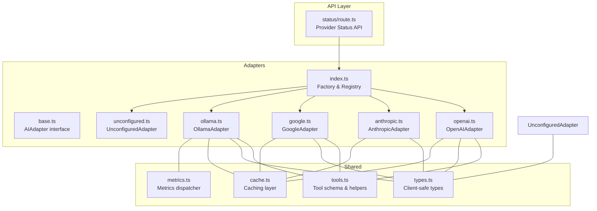

**Diagram sources**
- [index.ts:1-306](file://lib/ai/adapters/index.ts#L1-L306)
- [base.ts:1-73](file://lib/ai/adapters/base.ts#L1-L73)
- [openai.ts:1-223](file://lib/ai/adapters/openai.ts#L1-L223)
- [anthropic.ts:1-210](file://lib/ai/adapters/anthropic.ts#L1-L210)
- [google.ts:1-90](file://lib/ai/adapters/google.ts#L1-L90)
- [ollama.ts:1-87](file://lib/ai/adapters/ollama.ts#L1-L87)
- [unconfigured.ts:1-99](file://lib/ai/adapters/unconfigured.ts#L1-L99)
- [types.ts:1-130](file://lib/ai/types.ts#L1-L130)
- [tools.ts:1-175](file://lib/ai/tools.ts#L1-L175)
- [cache.ts:1-141](file://lib/ai/cache.ts#L1-L141)
- [metrics.ts:1-89](file://lib/ai/metrics.ts#L1-L89)
- [status.route.ts:1-157](file://app/api/providers/status/route.ts#L1-L157)

**Section sources**
- [index.ts:1-306](file://lib/ai/adapters/index.ts#L1-L306)
- [base.ts:1-73](file://lib/ai/adapters/base.ts#L1-L73)
- [types.ts:1-130](file://lib/ai/types.ts#L1-L130)

## Core Components
- Universal AIAdapter interface: Defines provider-agnostic generate() and stream() methods, plus a provider identifier. See [AIAdapter:50-72](file://lib/ai/adapters/base.ts#L50-L72).
- Adapter factory and registry: Resolves credentials securely, detects provider, and instantiates the appropriate adapter. See [getWorkspaceAdapter:236-278](file://lib/ai/adapters/index.ts#L236-L278) and [createAdapter:146-215](file://lib/ai/adapters/index.ts#L146-L215).
- Caching wrapper: Adds deterministic caching for generate() and stream() with cache key generation. See [CachedAdapter:82-138](file://lib/ai/adapters/index.ts#L82-L138) and [generateCacheKey:128-140](file://lib/ai/cache.ts#L128-L140).
- Metrics dispatcher: Centralized logging and persistence of usage and latency. See [dispatchMetrics:36-88](file://lib/ai/metrics.ts#L36-L88).
- Shared types and tools: Client-safe types and unified tool schema for cross-provider compatibility. See [types.ts:1-130](file://lib/ai/types.ts#L1-L130) and [tools.ts:1-175](file://lib/ai/tools.ts#L1-L175).
- Provider Status API: Enhanced with debugging capabilities and runtime environment variable checking. See [GET:83-156](file://app/api/providers/status/route.ts#L83-L156).

**Section sources**
- [base.ts:48-72](file://lib/ai/adapters/base.ts#L48-L72)
- [index.ts:146-215](file://lib/ai/adapters/index.ts#L146-L215)
- [index.ts:82-138](file://lib/ai/adapters/index.ts#L82-L138)
- [cache.ts:128-140](file://lib/ai/cache.ts#L128-L140)
- [metrics.ts:36-88](file://lib/ai/metrics.ts#L36-L88)
- [types.ts:19-55](file://lib/ai/types.ts#L19-L55)
- [tools.ts:47-79](file://lib/ai/tools.ts#L47-L79)
- [status.route.ts:83-156](file://app/api/providers/status/route.ts#L83-L156)

## Architecture Overview
The system enforces strict server-only credential resolution and provider-agnostic behavior. The factory resolves keys from workspace storage or environment variables, selects a provider adapter, wraps it in a cache-aware adapter, and returns it to callers.

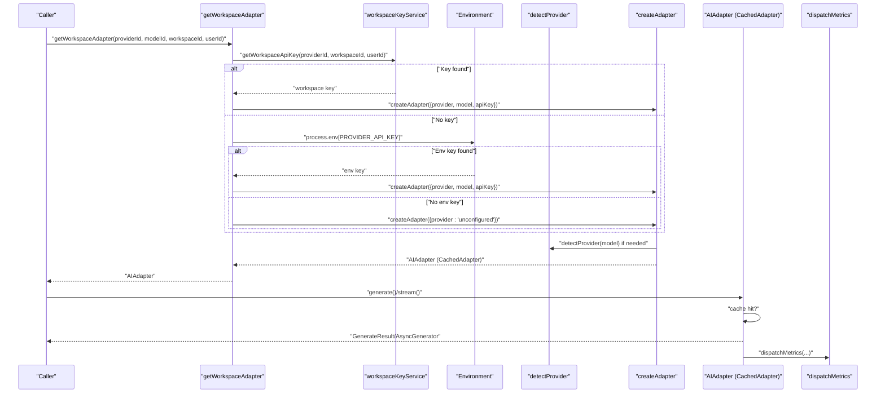

**Diagram sources**
- [index.ts:236-278](file://lib/ai/adapters/index.ts#L236-L278)
- [index.ts:146-215](file://lib/ai/adapters/index.ts#L146-L215)
- [index.ts:56-64](file://lib/ai/adapters/index.ts#L56-L64)

**Section sources**
- [index.ts:236-278](file://lib/ai/adapters/index.ts#L236-L278)
- [index.ts:146-215](file://lib/ai/adapters/index.ts#L146-L215)

## Detailed Component Analysis

### Universal AIAdapter Interface
- Purpose: Provide a single contract for all providers to ensure the rest of the application remains provider-agnostic.
- Methods:
  - generate(options): Non-streaming generation returning a complete result.
  - stream(options): Streaming generation via AsyncGenerator yielding StreamChunk objects.
- Properties:
  - provider: Canonical provider name string.

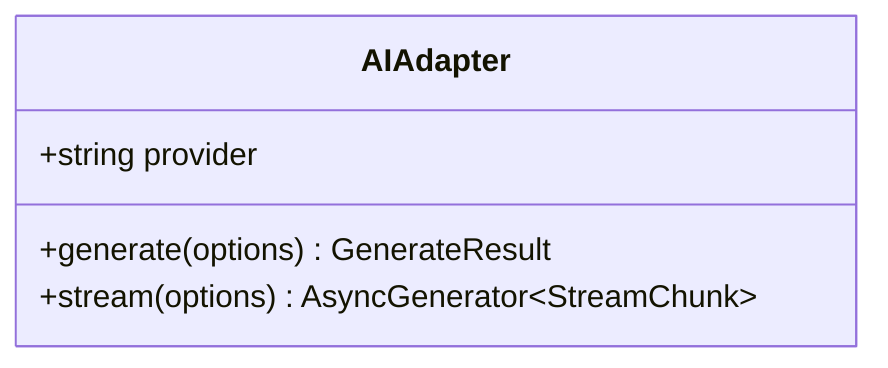

**Diagram sources**
- [base.ts:50-72](file://lib/ai/adapters/base.ts#L50-L72)

**Section sources**
- [base.ts:50-72](file://lib/ai/adapters/base.ts#L50-L72)

### Adapter Factory Pattern and Dynamic Instantiation
- Credential resolution hierarchy:
  1) Workspace key service lookup (encrypted keys per workspace).
  2) Environment variables fallback (provider-specific and generic).
  3) Unconfigured fallback for graceful degradation.
- Provider detection:
  - Explicit provider overrides model-based detection.
  - Model-based detection supports OpenAI, Anthropic, Google, Groq-hosted models, and defaults to Ollama for local models.
  - **Updated**: Removed DeepSeek detection from model-based detection logic.
- OpenAI-compatible providers:
  - Groq is routed through an OpenAI-compatible adapter using base URLs.
- Named adapters:
  - OpenAI, Anthropic, Google, and Ollama are instantiated directly.

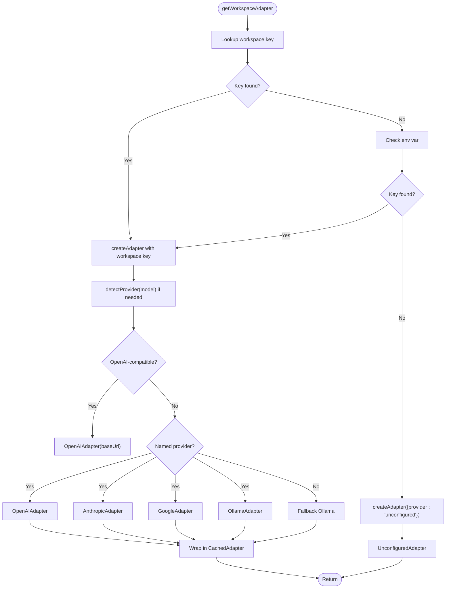

**Diagram sources**
- [index.ts:236-278](file://lib/ai/adapters/index.ts#L236-L278)
- [index.ts:146-215](file://lib/ai/adapters/index.ts#L146-L215)
- [index.ts:56-64](file://lib/ai/adapters/index.ts#L56-L64)

**Section sources**
- [index.ts:236-278](file://lib/ai/adapters/index.ts#L236-L278)
- [index.ts:146-215](file://lib/ai/adapters/index.ts#L146-L215)
- [index.ts:56-64](file://lib/ai/adapters/index.ts#L56-L64)

### OpenAI Adapter
- Supports OpenAI models including reasoning models (o1/o3 series).
- Special handling:
  - Reasoning models: omit temperature, use max_completion_tokens, restrict response_format and tools.
  - HuggingFace router: cap max tokens and avoid certain parameters.
  - System role merging for specific reasoning models.
- Streaming: includes usage in the final chunk when supported.
- Tool support: converts unified tools to OpenAI format and back.

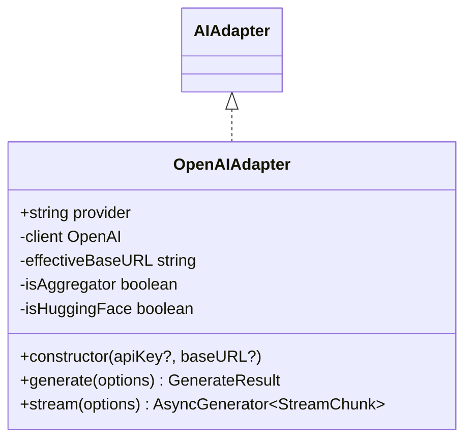

**Diagram sources**
- [openai.ts:36-223](file://lib/ai/adapters/openai.ts#L36-L223)
- [base.ts:50-72](file://lib/ai/adapters/base.ts#L50-L72)

**Section sources**
- [openai.ts:30-32](file://lib/ai/adapters/openai.ts#L30-L32)
- [openai.ts:64-157](file://lib/ai/adapters/openai.ts#L64-L157)
- [openai.ts:159-221](file://lib/ai/adapters/openai.ts#L159-L221)

### Anthropic Adapter
- Uses the native Anthropic /v1/messages endpoint via fetch.
- Constraints:
  - No response_format support; JSON mode is emulated by appending instructions to the system prompt.
  - Per-model output caps enforced to prevent 400 errors.
- Streaming: parses SSE-like events and yields deltas until message_stop.

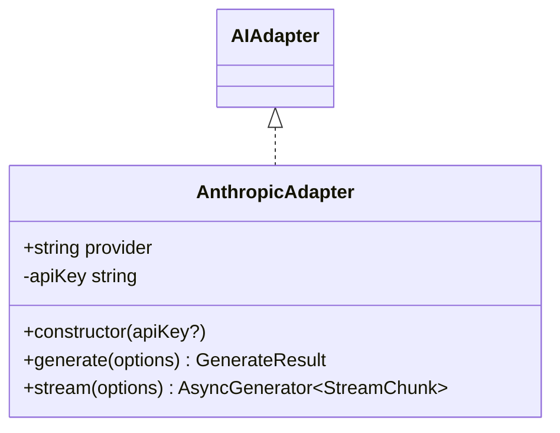

**Diagram sources**
- [anthropic.ts:71-210](file://lib/ai/adapters/anthropic.ts#L71-L210)
- [base.ts:50-72](file://lib/ai/adapters/base.ts#L50-L72)

**Section sources**
- [anthropic.ts:89-145](file://lib/ai/adapters/anthropic.ts#L89-L145)
- [anthropic.ts:147-207](file://lib/ai/adapters/anthropic.ts#L147-L207)

### Google Adapter
- Uses Google AI Studio's OpenAI-compatible endpoint.
- Constraints:
  - response_format is rejected by the proxy; it is omitted.
  - Tool calling is supported via OpenAI-compat format.
- Streaming: straightforward passthrough of streamed chunks.

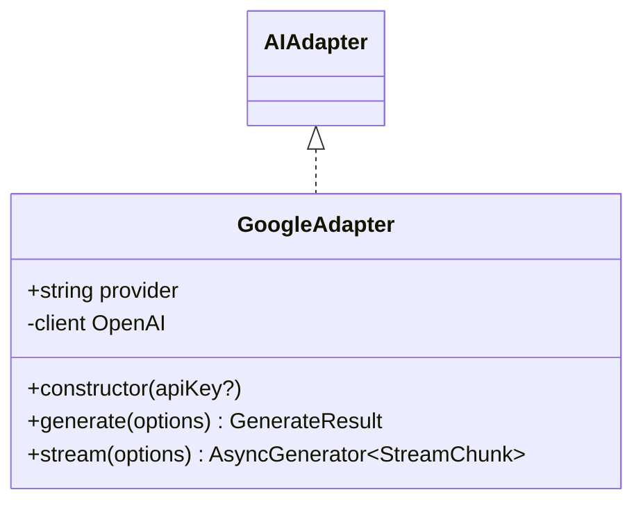

**Diagram sources**
- [google.ts:24-90](file://lib/ai/adapters/google.ts#L24-L90)
- [base.ts:50-72](file://lib/ai/adapters/base.ts#L50-L72)

**Section sources**
- [google.ts:35-69](file://lib/ai/adapters/google.ts#L35-L69)
- [google.ts:71-88](file://lib/ai/adapters/google.ts#L71-L88)

### Ollama Adapter
- **Updated**: Now requires API key like other cloud providers.
- Uses the OpenAI-compatible API exposed by Ollama (default http://localhost:11434/v1).
- Tool support: function calling is passed through OpenAI-compat format; models without tool support ignore definitions gracefully.
- Streaming: standard OpenAI-compat streaming.

**Diagram sources**
- [ollama.ts:21-87](file://lib/ai/adapters/ollama.ts#L21-L87)
- [base.ts:50-72](file://lib/ai/adapters/base.ts#L50-L72)

**Section sources**
- [ollama.ts:32-66](file://lib/ai/adapters/ollama.ts#L32-L66)
- [ollama.ts:68-85](file://lib/ai/adapters/ollama.ts#L68-L85)

### Unconfigured Adapter
- Graceful fallback when no credentials are available.
- Returns helpful UI code or structured JSON depending on responseFormat.
- Streaming yields React component code line-by-line.

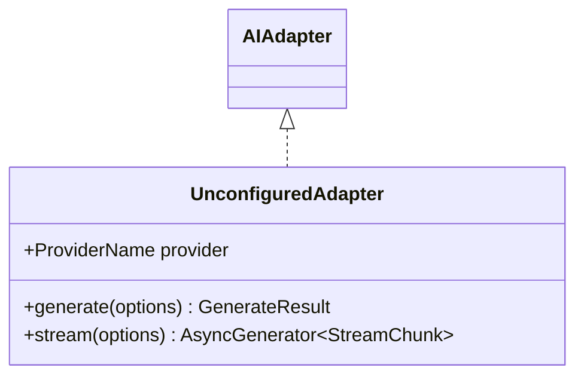

**Diagram sources**
- [unconfigured.ts:13-99](file://lib/ai/adapters/unconfigured.ts#L13-L99)
- [base.ts:50-72](file://lib/ai/adapters/base.ts#L50-L72)

**Section sources**
- [unconfigured.ts:16-74](file://lib/ai/adapters/unconfigured.ts#L16-L74)
- [unconfigured.ts:76-97](file://lib/ai/adapters/unconfigured.ts#L76-L97)

### Tool Support and Execution
- Unified tool schema: name, description, parameters (JSON Schema subset), and execute function.
- Conversion helpers:
  - OpenAI tool definitions and tool_choice conversion.
  - OpenAI raw tool_call normalization to unified ToolCall.
- Execution helper runs requested tool calls in parallel and returns results formatted for continuation messages.

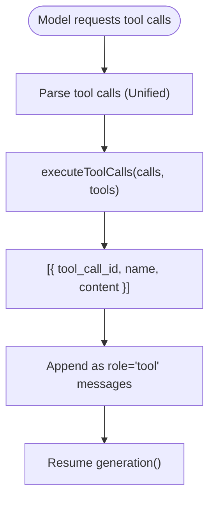

**Diagram sources**
- [tools.ts:47-79](file://lib/ai/tools.ts#L47-L79)
- [tools.ts:144-174](file://lib/ai/tools.ts#L144-L174)
- [openai.ts:103-111](file://lib/ai/adapters/openai.ts#L103-L111)

**Section sources**
- [tools.ts:47-79](file://lib/ai/tools.ts#L47-L79)
- [tools.ts:144-174](file://lib/ai/tools.ts#L144-L174)
- [openai.ts:103-111](file://lib/ai/adapters/openai.ts#L103-L111)

### Streaming Capabilities and Response Formatting
- All adapters implement stream() using AsyncGenerator<StreamChunk>.
- StreamChunk includes delta text and done flag; some providers also supply usage on the final chunk.
- Response format hints are honored when supported by the provider (e.g., OpenAI JSON mode, Anthropic JSON via system prompt).

**Section sources**
- [base.ts:70-72](file://lib/ai/adapters/base.ts#L70-L72)
- [types.ts:48-55](file://lib/ai/types.ts#L48-L55)
- [openai.ts:98-101](file://lib/ai/adapters/openai.ts#L98-L101)
- [anthropic.ts:95-98](file://lib/ai/adapters/anthropic.ts#L95-L98)

### Fallback Mechanisms and Error Handling
- ConfigurationError is thrown when a cloud provider lacks credentials; surfaced to the UI for configuration.
- **Updated**: Ollama now throws ConfigurationError when no API key is configured, unlike previous behavior where it would work without credentials.
- UnconfiguredAdapter is returned when no credentials are available (including Vercel environments where local daemons are unreachable).
- Upstash Redis initialization failure falls back to in-memory cache; cache write errors are swallowed to avoid blocking requests.

**Section sources**
- [index.ts:28-40](file://lib/ai/adapters/index.ts#L28-L40)
- [index.ts:194-207](file://lib/ai/adapters/index.ts#L194-L207)
- [cache.ts:59-102](file://lib/ai/cache.ts#L59-L102)

### Provider-Specific Optimizations
- OpenAI:
  - Automatic HuggingFace endpoint migration and router detection.
  - Token caps and parameter adjustments for reasoning models and HuggingFace.
- Anthropic:
  - System role merging for specific models and per-model output caps.
- Google:
  - Response format exclusion due to proxy limitations.
- Ollama:
  - **Updated**: Now requires API key like other cloud providers.
  - OpenAI-compat streaming and tool-pass-through.

**Section sources**
- [openai.ts:46-62](file://lib/ai/adapters/openai.ts#L46-L62)
- [openai.ts:119-126](file://lib/ai/adapters/openai.ts#L119-L126)
- [anthropic.ts:105-108](file://lib/ai/adapters/anthropic.ts#L105-L108)
- [google.ts:46-49](file://lib/ai/adapters/google.ts#L46-L49)
- [ollama.ts:43-46](file://lib/ai/adapters/ollama.ts#L43-L46)

### Enhanced Provider Status API
- **New**: Comprehensive debugging capabilities for provider configuration verification.
- Runtime environment variable checking with detailed logging.
- Debug information includes available environment variables, configuration status, and Node.js environment details.
- Prevents caching to ensure real-time status checks.

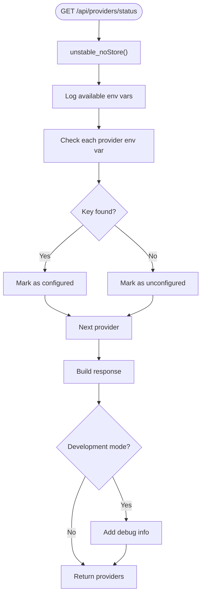

**Diagram sources**
- [status.route.ts:83-156](file://app/api/providers/status/route.ts#L83-L156)

**Section sources**
- [status.route.ts:83-156](file://app/api/providers/status/route.ts#L83-L156)

### Practical Usage Examples and Configuration Patterns
- Secure credential resolution:
  - Use getWorkspaceAdapter(providerId, modelId, workspaceId, userId) to resolve keys from workspace storage or environment variables.
  - Example invocation pattern is demonstrated in tests for all adapters.
- Provider selection:
  - Explicit provider via getWorkspaceAdapter or model-based detection via detectProvider.
  - **Updated**: Model-based detection no longer includes DeepSeek models.
- Streaming:
  - Iterate over adapter.stream(options) to render deltas progressively.
- Tool calling:
  - Provide tools in GenerateOptions; handle ToolCall results and append role='tool' messages before continuing generation.
- **New**: Provider status checking:
  - Use GET /api/providers/status to verify configuration and debug environment variables.

**Section sources**
- [index.ts:236-278](file://lib/ai/adapters/index.ts#L236-L278)
- [index.ts:56-64](file://lib/ai/adapters/index.ts#L56-L64)
- [adapters.test.ts:57-108](file://__tests__/adapters.test.ts#L57-L108)
- [adapterIndex.test.ts:48-70](file://__tests__/adapterIndex.test.ts#L48-L70)
- [status.route.ts:83-156](file://app/api/providers/status/route.ts#L83-L156)

## Dependency Analysis
The adapter system exhibits low coupling and high cohesion:
- AIAdapter is the central contract; all providers implement it.
- Factory encapsulates provider selection and credential resolution.
- Caching and metrics are orthogonal concerns wrapped around the adapter.
- Tools and types are shared utilities consumed by adapters.
- **Updated**: Removed dependencies on DeepSeek, Mistral, OpenRouter, Together, Meta, Qwen, and Gemma providers.

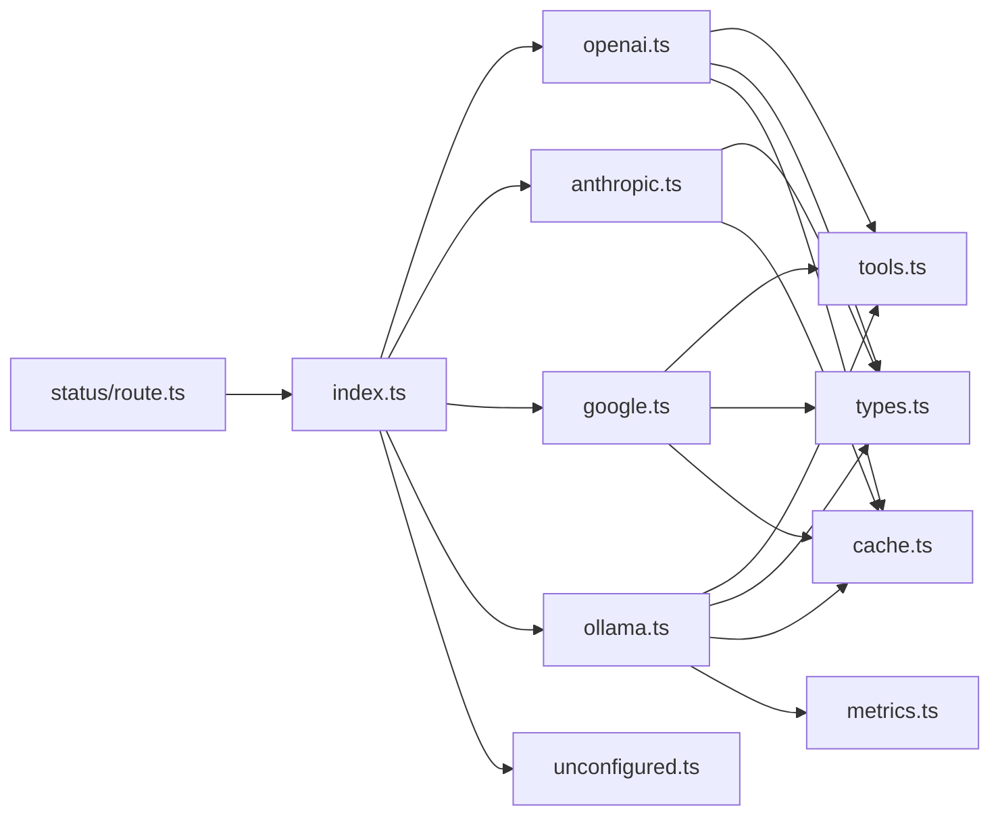

**Diagram sources**
- [index.ts:19-306](file://lib/ai/adapters/index.ts#L19-L306)
- [openai.ts:15-223](file://lib/ai/adapters/openai.ts#L15-L223)
- [anthropic.ts:16-210](file://lib/ai/adapters/anthropic.ts#L16-L210)
- [google.ts:16-90](file://lib/ai/adapters/google.ts#L16-L90)
- [ollama.ts:13-87](file://lib/ai/adapters/ollama.ts#L13-L87)
- [unconfigured.ts:3-99](file://lib/ai/adapters/unconfigured.ts#L3-L99)
- [tools.ts:11-175](file://lib/ai/tools.ts#L11-L175)
- [types.ts:14-130](file://lib/ai/types.ts#L14-L130)
- [cache.ts:18-141](file://lib/ai/cache.ts#L18-L141)
- [metrics.ts:17-89](file://lib/ai/metrics.ts#L17-L89)
- [status.route.ts:14-67](file://app/api/providers/status/route.ts#L14-L67)

**Section sources**
- [index.ts:19-306](file://lib/ai/adapters/index.ts#L19-L306)

## Performance Considerations
- Caching:
  - Deterministic cache keys derived from model, temperature, messages, and tool names.
  - Separate caches for generate vs stream to avoid mixing partial streams.
  - Upstash Redis in production; in-memory fallback in development.
- Metrics:
  - Fire-and-forget dispatch to avoid blocking response paths.
- Provider-specific caps:
  - Prevents upstream 400 errors and wasted compute.
- **Updated**: Provider status API uses unstable_noStore() to prevent caching and ensure real-time configuration verification.

[No sources needed since this section provides general guidance]

## Troubleshooting Guide
- Missing API key:
  - Symptom: ConfigurationError thrown during adapter creation.
  - Action: Configure provider key in workspace settings or environment variables.
  - **Updated**: Ollama now requires API key like other cloud providers.
- Local daemon unreachable (Vercel):
  - Behavior: UnconfiguredAdapter returned to show helpful UI.
  - Action: Use cloud providers or run locally with reachable daemons.
- Provider-specific errors:
  - OpenAI: Review reasoning model constraints and HuggingFace router behavior.
  - Anthropic: Respect system role merging and output caps.
  - Google: Do not send response_format; ensure correct endpoint.
  - Ollama: **Updated**: Ensure API key is configured; confirm model supports tools; check base URL.
- Streaming issues:
  - Verify provider supports streaming and that usage is only available on the final chunk when supported.
- **New**: Provider status debugging:
  - Use GET /api/providers/status to verify configuration and check environment variables.
  - Check console logs for debug information including available env vars and configuration status.

**Section sources**
- [index.ts:28-40](file://lib/ai/adapters/index.ts#L28-L40)
- [index.ts:204-207](file://lib/ai/adapters/index.ts#L204-L207)
- [openai.ts:98-111](file://lib/ai/adapters/openai.ts#L98-L111)
- [anthropic.ts:105-108](file://lib/ai/adapters/anthropic.ts#L105-L108)
- [google.ts:46-49](file://lib/ai/adapters/google.ts#L46-L49)
- [ollama.ts:43-46](file://lib/ai/adapters/ollama.ts#L43-L46)
- [status.route.ts:83-156](file://app/api/providers/status/route.ts#L83-L156)

## Conclusion
The adapter system provides a robust, provider-agnostic foundation for AI integration. By enforcing secure credential resolution, offering a unified interface, and encapsulating provider-specific quirks, it simplifies multi-provider orchestration while maintaining performance and reliability through caching and metrics. The recent updates streamline supported providers, enhance Ollama integration, and provide comprehensive debugging capabilities for configuration management.

[No sources needed since this section summarizes without analyzing specific files]

## Appendices

### Supported Providers and Authentication
- **Updated**: Currently supported providers: OpenAI, Anthropic, Google, and Ollama.
- **Removed**: DeepSeek, Mistral, OpenRouter, Together, Meta, Qwen, and Gemma providers.
- Authentication requirements:
  - OpenAI: OPENAI_API_KEY or workspace key.
  - Anthropic: ANTHROPIC_API_KEY or workspace key.
  - Google: GOOGLE_API_KEY or GEMINI_API_KEY or workspace key.
  - **Updated**: Ollama: OLLAMA_API_KEY or workspace key (now requires API key like other providers).

**Section sources**
- [index.ts:10-12](file://lib/ai/adapters/index.ts#L10-L12)
- [index.ts:170-184](file://lib/ai/adapters/index.ts#L170-L184)
- [index.ts:204-209](file://lib/ai/adapters/index.ts#L204-L209)
- [openai.ts:53-61](file://lib/ai/adapters/openai.ts#L53-L61)
- [status.route.ts:64](file://app/api/providers/status/route.ts#L64)

### Provider Capability Matrix
- Tool calling: OpenAI, Google, Ollama (provider-dependent).
- Streaming: All adapters.
- Response format: OpenAI JSON mode (with restrictions), Anthropic via system prompt, Google excludes response_format.

**Section sources**
- [openai.ts:98-111](file://lib/ai/adapters/openai.ts#L98-L111)
- [anthropic.ts:95-98](file://lib/ai/adapters/anthropic.ts#L95-L98)
- [google.ts:46-49](file://lib/ai/adapters/google.ts#L46-L49)

### Provider Detection Logic
- **Updated**: Model-based detection no longer includes DeepSeek models.
- Detection rules:
  - gpt-*, o1 series → OpenAI
  - claude series → Anthropic
  - gemini series → Google
  - llama, mixtral, gemma2 → Groq
  - Default → Ollama

**Section sources**
- [index.ts:56-64](file://lib/ai/adapters/index.ts#L56-L64)