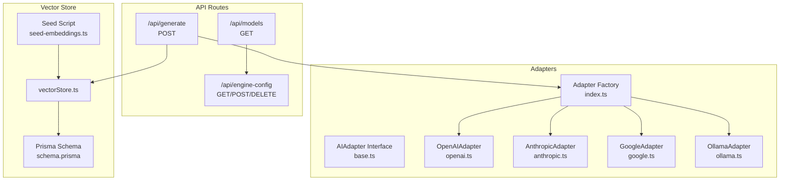
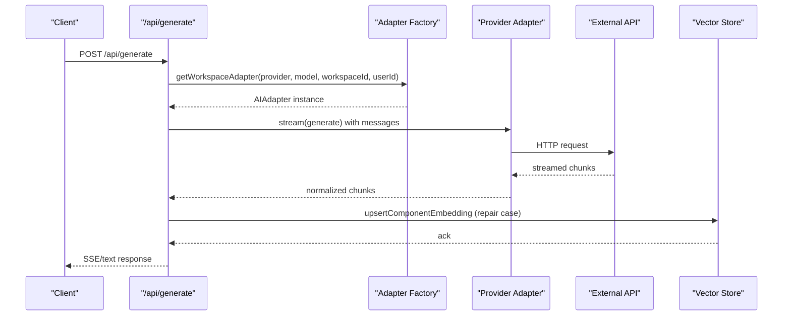
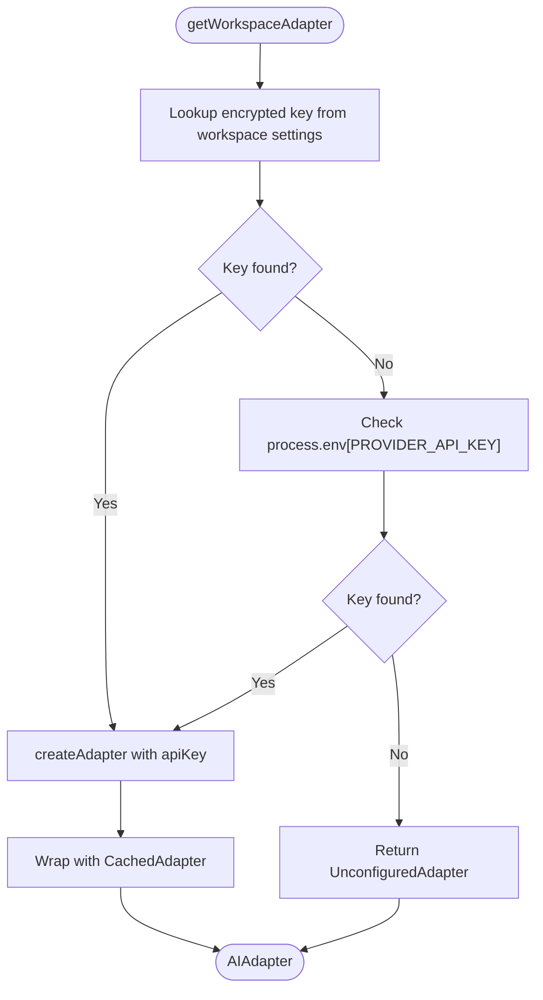
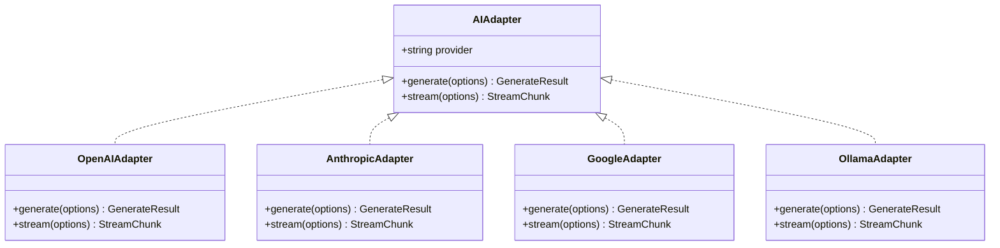
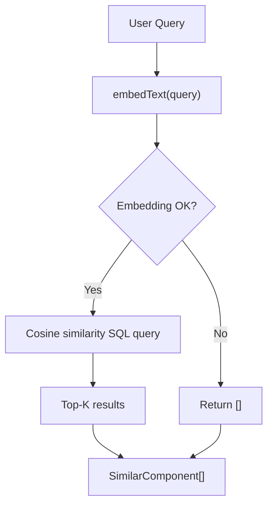
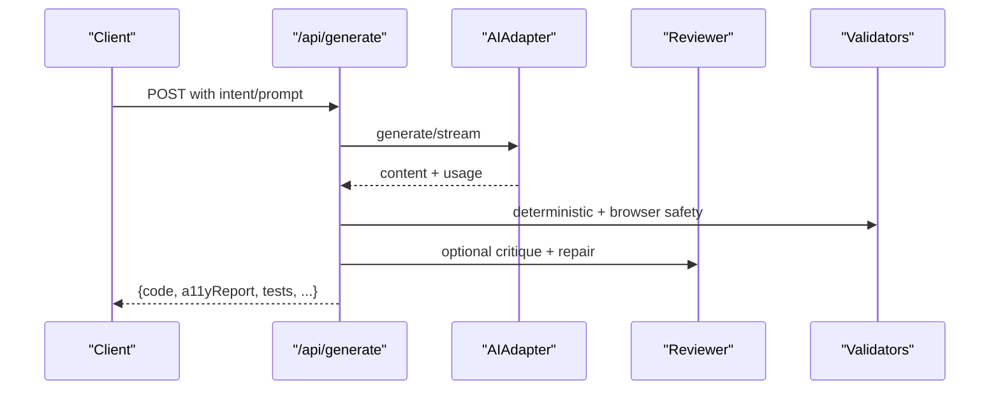
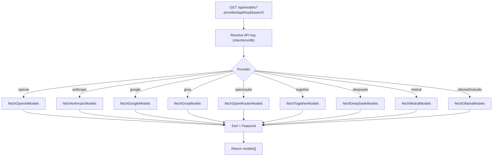
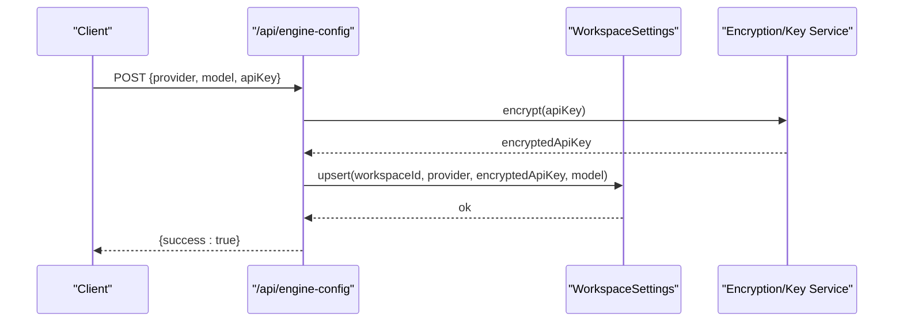
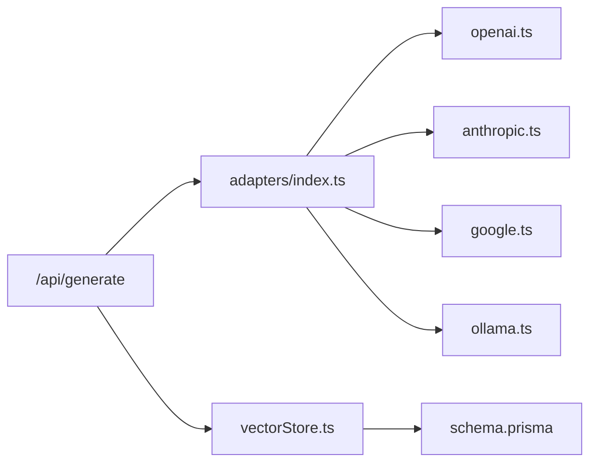

# Integration Layer

<cite>
**Referenced Files in This Document**
- [route.ts](file://app/api/generate/route.ts)
- [route.ts](file://app/api/models/route.ts)
- [route.ts](file://app/api/engine-config/route.ts)
- [index.ts](file://lib/ai/adapters/index.ts)
- [base.ts](file://lib/ai/adapters/base.ts)
- [openai.ts](file://lib/ai/adapters/openai.ts)
- [anthropic.ts](file://lib/ai/adapters/anthropic.ts)
- [google.ts](file://lib/ai/adapters/google.ts)
- [ollama.ts](file://lib/ai/adapters/ollama.ts)
- [vectorStore.ts](file://lib/ai/vectorStore.ts)
- [types.ts](file://lib/ai/types.ts)
- [tools.ts](file://lib/ai/tools.ts)
- [schema.prisma](file://prisma/schema.prisma)
- [seed-embeddings.ts](file://scripts/seed-embeddings.ts)
</cite>

## Table of Contents
1. [Introduction](#introduction)
2. [Project Structure](#project-structure)
3. [Core Components](#core-components)
4. [Architecture Overview](#architecture-overview)
5. [Detailed Component Analysis](#detailed-component-analysis)
6. [Dependency Analysis](#dependency-analysis)
7. [Performance Considerations](#performance-considerations)
8. [Troubleshooting Guide](#troubleshooting-guide)
9. [Conclusion](#conclusion)

## Introduction
This document explains the integration layer architecture that powers AI-driven UI generation. It covers the AI provider adapter system, external service integrations, and third-party API connections. It also documents fallback mechanisms, retry strategies, resilience patterns, vector embeddings and semantic search, live preview system configuration, and security considerations for external API usage and data transmission.

## Project Structure
The integration layer spans several modules:
- API routes orchestrate generation, model discovery, and engine configuration.
- Adapter factory and provider adapters encapsulate external API integrations.
- Vector store integrates with pgvector for semantic search and retrieval-augmented generation (RAG).
- Prisma schema defines persistent models, including vector embeddings.

**Diagram sources**
- [route.ts:25-440](file://app/api/generate/route.ts#L25-L440)
- [route.ts:206-457](file://app/api/models/route.ts#L206-L457)
- [route.ts:36-154](file://app/api/engine-config/route.ts#L36-L154)
- [index.ts:236-278](file://lib/ai/adapters/index.ts#L236-L278)
- [base.ts:50-72](file://lib/ai/adapters/base.ts#L50-L72)
- [openai.ts:36-223](file://lib/ai/adapters/openai.ts#L36-L223)
- [anthropic.ts:71-210](file://lib/ai/adapters/anthropic.ts#L71-L210)
- [google.ts:24-90](file://lib/ai/adapters/google.ts#L24-L90)
- [ollama.ts:21-87](file://lib/ai/adapters/ollama.ts#L21-L87)
- [vectorStore.ts:1-378](file://lib/ai/vectorStore.ts#L1-L378)
- [schema.prisma:194-222](file://prisma/schema.prisma#L194-L222)
- [seed-embeddings.ts:29-69](file://scripts/seed-embeddings.ts#L29-L69)

**Section sources**
- [route.ts:25-440](file://app/api/generate/route.ts#L25-L440)
- [route.ts:206-457](file://app/api/models/route.ts#L206-L457)
- [route.ts:36-154](file://app/api/engine-config/route.ts#L36-L154)
- [index.ts:1-306](file://lib/ai/adapters/index.ts#L1-L306)
- [base.ts:1-73](file://lib/ai/adapters/base.ts#L1-L73)
- [openai.ts:1-223](file://lib/ai/adapters/openai.ts#L1-L223)
- [anthropic.ts:1-210](file://lib/ai/adapters/anthropic.ts#L1-L210)
- [google.ts:1-90](file://lib/ai/adapters/google.ts#L1-L90)
- [ollama.ts:1-87](file://lib/ai/adapters/ollama.ts#L1-L87)
- [vectorStore.ts:1-378](file://lib/ai/vectorStore.ts#L1-L378)
- [schema.prisma:1-222](file://prisma/schema.prisma#L1-L222)
- [seed-embeddings.ts:1-69](file://scripts/seed-embeddings.ts#L1-L69)

## Core Components
- Adapter Factory and Registry: Selects the appropriate provider adapter based on configuration and environment, with caching and graceful fallbacks.
- Provider Adapters: Encapsulate provider-specific APIs (OpenAI, Anthropic, Google, Ollama) and normalize responses.
- Vector Store: Embeds text, stores vectors in pgvector, and performs similarity search for semantic retrieval.
- API Orchestration: Generates UI code, validates outputs, runs accessibility and testing, and persists results.

**Section sources**
- [index.ts:236-278](file://lib/ai/adapters/index.ts#L236-L278)
- [base.ts:50-72](file://lib/ai/adapters/base.ts#L50-L72)
- [vectorStore.ts:1-378](file://lib/ai/vectorStore.ts#L1-L378)
- [route.ts:25-440](file://app/api/generate/route.ts#L25-L440)

## Architecture Overview
The integration layer follows a layered design:
- API routes receive requests and enforce security and validation.
- The adapter factory resolves credentials and constructs provider adapters.
- Providers communicate with external APIs; responses are normalized.
- Vector store supports semantic search and RAG during generation.
- Results are validated, sanitized, and persisted.

**Diagram sources**
- [route.ts:55-97](file://app/api/generate/route.ts#L55-L97)
- [index.ts:236-278](file://lib/ai/adapters/index.ts#L236-L278)
- [openai.ts:159-221](file://lib/ai/adapters/openai.ts#L159-L221)
- [vectorStore.ts:124-155](file://lib/ai/vectorStore.ts#L124-L155)

## Detailed Component Analysis

### Adapter Factory and Provider Resolution
The adapter factory selects the correct adapter based on provider and model, resolving credentials from workspace settings, environment variables, or returning an unconfigured adapter for graceful degradation. It caches results and metrics.

**Diagram sources**
- [index.ts:236-278](file://lib/ai/adapters/index.ts#L236-L278)
- [index.ts:146-215](file://lib/ai/adapters/index.ts#L146-L215)

**Section sources**
- [index.ts:236-278](file://lib/ai/adapters/index.ts#L236-L278)
- [index.ts:146-215](file://lib/ai/adapters/index.ts#L146-L215)

### Provider Adapters
- OpenAIAdapter: Handles reasoning models, tool calling, and OpenAI-compatible providers (e.g., Groq, HuggingFace).
- AnthropicAdapter: Uses native REST API (/v1/messages) with streaming and JSON mode handling.
- GoogleAdapter: Uses OpenAI-compatible endpoint for Gemini models.
- OllamaAdapter: Uses OpenAI-compatible endpoint for local models.

**Diagram sources**
- [base.ts:50-72](file://lib/ai/adapters/base.ts#L50-L72)
- [openai.ts:36-223](file://lib/ai/adapters/openai.ts#L36-L223)
- [anthropic.ts:71-210](file://lib/ai/adapters/anthropic.ts#L71-L210)
- [google.ts:24-90](file://lib/ai/adapters/google.ts#L24-L90)
- [ollama.ts:21-87](file://lib/ai/adapters/ollama.ts#L21-L87)

**Section sources**
- [openai.ts:36-223](file://lib/ai/adapters/openai.ts#L36-L223)
- [anthropic.ts:71-210](file://lib/ai/adapters/anthropic.ts#L71-L210)
- [google.ts:24-90](file://lib/ai/adapters/google.ts#L24-L90)
- [ollama.ts:21-87](file://lib/ai/adapters/ollama.ts#L21-L87)

### Vector Embeddings and Semantic Search
The vector store generates 768-dimension embeddings using Google’s embedding API, stores them in pgvector, and supports similarity search and filtered retrieval. A seed script loads the knowledge base into the vector store.

**Diagram sources**
- [vectorStore.ts:174-212](file://lib/ai/vectorStore.ts#L174-L212)
- [vectorStore.ts:223-263](file://lib/ai/vectorStore.ts#L223-L263)
- [seed-embeddings.ts:29-69](file://scripts/seed-embeddings.ts#L29-L69)

**Section sources**
- [vectorStore.ts:1-378](file://lib/ai/vectorStore.ts#L1-L378)
- [schema.prisma:194-222](file://prisma/schema.prisma#L194-L222)
- [seed-embeddings.ts:1-69](file://scripts/seed-embeddings.ts#L1-L69)

### Live Preview System Configuration
Live preview is integrated into the generation pipeline:
- Non-streaming generation uses a 300-second max duration.
- Streaming generation uses a ReadableStream with SSE.
- The pipeline sanitizes code, validates browser safety, and runs accessibility and tests in parallel.

**Diagram sources**
- [route.ts:25-440](file://app/api/generate/route.ts#L25-L440)

**Section sources**
- [route.ts:25-440](file://app/api/generate/route.ts#L25-L440)

### Model Discovery and Provider Integrations
The models endpoint aggregates provider-specific model lists with timeouts and fallbacks. It supports OpenAI, Anthropic, Google, Groq, OpenRouter, Together, DeepSeek, Mistral, and local providers (Ollama/LM Studio).

**Diagram sources**
- [route.ts:206-457](file://app/api/models/route.ts#L206-L457)

**Section sources**
- [route.ts:206-457](file://app/api/models/route.ts#L206-L457)

### Engine Configuration and Security
Engine configuration persists provider, model, and encrypted API keys per workspace. Keys are never returned to the client and are resolved server-side for adapter creation.

**Diagram sources**
- [route.ts:69-127](file://app/api/engine-config/route.ts#L69-L127)

**Section sources**
- [route.ts:36-154](file://app/api/engine-config/route.ts#L36-L154)

## Dependency Analysis
- API routes depend on the adapter factory and vector store.
- Adapters depend on provider SDKs or REST endpoints.
- Vector store depends on Neon and Google embedding API.
- Prisma schema defines persistence for embeddings and related models.

**Diagram sources**
- [route.ts:17-21](file://app/api/generate/route.ts#L17-L21)
- [index.ts:19-24](file://lib/ai/adapters/index.ts#L19-L24)
- [vectorStore.ts:20-39](file://lib/ai/vectorStore.ts#L20-L39)
- [schema.prisma:194-222](file://prisma/schema.prisma#L194-L222)

**Section sources**
- [route.ts:17-21](file://app/api/generate/route.ts#L17-L21)
- [index.ts:19-24](file://lib/ai/adapters/index.ts#L19-L24)
- [vectorStore.ts:20-39](file://lib/ai/vectorStore.ts#L20-L39)
- [schema.prisma:194-222](file://prisma/schema.prisma#L194-L222)

## Performance Considerations
- Caching: The adapter factory wraps adapters with a cache to reduce repeated calls and lower latency and cost.
- Streaming: SSE streaming reduces perceived latency and allows early termination.
- Parallelization: Accessibility validation, test generation, and optional reviewer steps run concurrently where safe.
- Timeouts: Provider model discovery uses timeouts to prevent slow external calls from blocking UI.
- Rate limiting: Embedding seeding script throttles requests to respect free-tier limits.

[No sources needed since this section provides general guidance]

## Troubleshooting Guide
Common issues and mitigations:
- Missing API keys: The adapter factory throws a configuration error or returns an unconfigured adapter. Verify workspace settings and environment variables.
- Provider-specific constraints: Some providers reject certain parameters (e.g., response_format, tools, temperature for reasoning models). The adapters handle these differences internally.
- Network failures: Model discovery endpoints use timeouts and fallback lists. Review logs for HTTP errors and authentication failures.
- Vector embedding failures: If GOOGLE_API_KEY is missing or the embedding API fails, embedding functions return null and logging captures warnings. Ensure proper configuration and retry.

**Section sources**
- [index.ts:28-40](file://lib/ai/adapters/index.ts#L28-L40)
- [openai.ts:98-126](file://lib/ai/adapters/openai.ts#L98-L126)
- [anthropic.ts:93-108](file://lib/ai/adapters/anthropic.ts#L93-L108)
- [route.ts:445-455](file://app/api/models/route.ts#L445-L455)
- [vectorStore.ts:49-97](file://lib/ai/vectorStore.ts#L49-L97)

## Conclusion
The integration layer provides a robust, provider-agnostic system for generating UI components with strong resilience, security, and extensibility. It leverages adapters for external APIs, caches results, and integrates semantic search for intelligent knowledge reuse. Engine configuration is secure and auditable, while vector embeddings enable contextual retrieval and RAG.