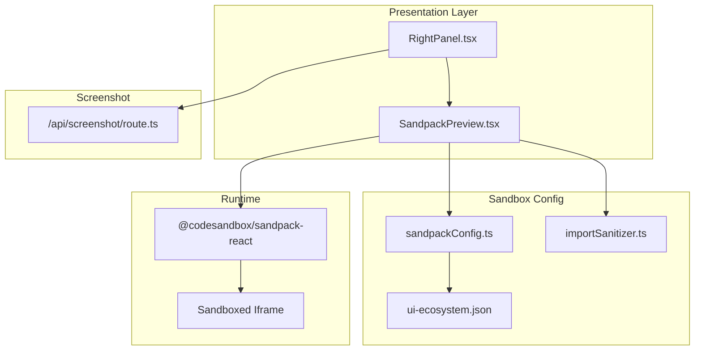
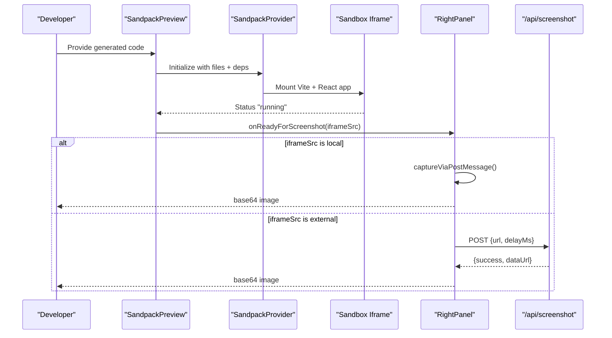
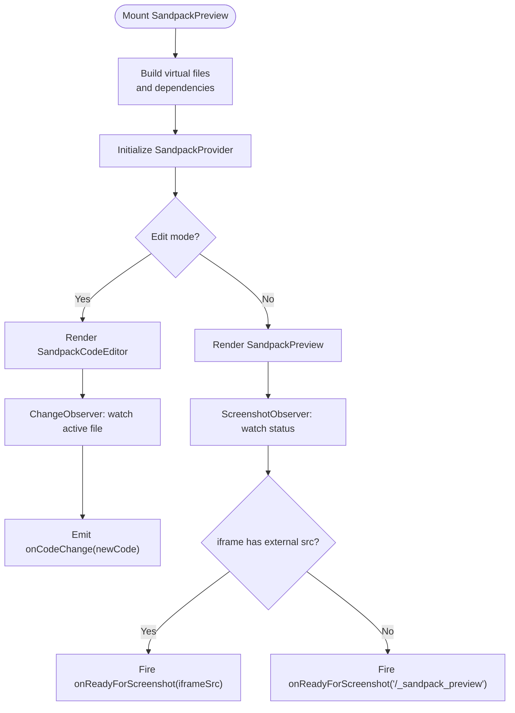
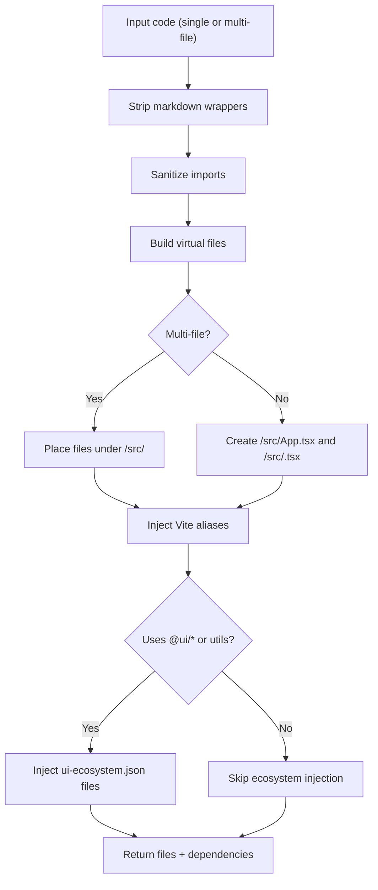
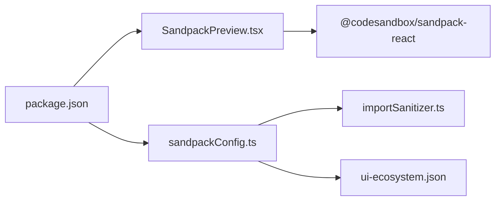

# Live Preview Integration

<cite>
**Referenced Files in This Document**
- [SandpackPreview.tsx](file://components/SandpackPreview.tsx)
- [sandpackConfig.ts](file://lib/sandbox/sandpackConfig.ts)
- [importSanitizer.ts](file://lib/sandbox/importSanitizer.ts)
- [ui-ecosystem.json](file://lib/sandbox/ui-ecosystem.json)
- [RightPanel.tsx](file://components/ide/RightPanel.tsx)
- [route.ts](file://app/api/screenshot/route.ts)
- [package.json](file://package.json)
</cite>

## Table of Contents
1. [Introduction](#introduction)
2. [Project Structure](#project-structure)
3. [Core Components](#core-components)
4. [Architecture Overview](#architecture-overview)
5. [Detailed Component Analysis](#detailed-component-analysis)
6. [Dependency Analysis](#dependency-analysis)
7. [Performance Considerations](#performance-considerations)
8. [Troubleshooting Guide](#troubleshooting-guide)
9. [Conclusion](#conclusion)

## Introduction
This document explains the live preview system that integrates CodeSandbox Sandpack to render generated UI components in real time. It covers sandbox configuration, dependency management, code isolation, security boundaries, and performance characteristics. It also documents how the preview environment captures screenshots for automated quality review, how assets and CSS are loaded, and how interactive elements behave within the sandboxed iframe.

## Project Structure
The live preview spans several modules:
- Presentation and orchestration: a React component that hosts Sandpack and coordinates observers
- Sandboxing configuration: builds the virtual file system, resolves imports, and injects UI ecosystem packages
- Security: sanitizes unknown imports and limits allowed hosts for screenshot capture
- Screenshot pipeline: captures previews either via a postMessage protocol from within the sandbox or via a server-side Playwright process

**Diagram sources**
- [SandpackPreview.tsx:144-286](file://components/SandpackPreview.tsx#L144-L286)
- [sandpackConfig.ts:112-401](file://lib/sandbox/sandpackConfig.ts#L112-L401)
- [importSanitizer.ts:16-224](file://lib/sandbox/importSanitizer.ts#L16-L224)
- [ui-ecosystem.json:1-49](file://lib/sandbox/ui-ecosystem.json#L1-49)
- [RightPanel.tsx:380-476](file://components/ide/RightPanel.tsx#L380-L476)
- [route.ts:1-92](file://app/api/screenshot/route.ts#L1-L92)

**Section sources**
- [SandpackPreview.tsx:144-286](file://components/SandpackPreview.tsx#L144-L286)
- [sandpackConfig.ts:112-401](file://lib/sandbox/sandpackConfig.ts#L112-L401)
- [importSanitizer.ts:16-224](file://lib/sandbox/importSanitizer.ts#L16-L224)
- [ui-ecosystem.json:1-49](file://lib/sandbox/ui-ecosystem.json#L1-49)
- [RightPanel.tsx:380-476](file://components/ide/RightPanel.tsx#L380-L476)
- [route.ts:1-92](file://app/api/screenshot/route.ts#L1-L92)

## Core Components
- SandpackPreview: Hosts the SandpackProvider, manages edit mode, exposes a code editor, and coordinates observers for change capture and screenshot readiness.
- Sandpack configuration builder: Constructs the virtual file system, injects HTML/CSS/Tailwind/Vite config, wraps the generated App with a capture wrapper, and conditionally injects the UI ecosystem packages.
- Import sanitizer: Scrubs unknown or hallucinated imports and replaces them with safe inline stubs.
- Screenshot pipeline: Either captures via postMessage from within the sandbox or delegates to a server-side endpoint using Playwright.

**Section sources**
- [SandpackPreview.tsx:144-286](file://components/SandpackPreview.tsx#L144-L286)
- [sandpackConfig.ts:112-401](file://lib/sandbox/sandpackConfig.ts#L112-L401)
- [importSanitizer.ts:16-224](file://lib/sandbox/importSanitizer.ts#L16-L224)
- [RightPanel.tsx:380-476](file://components/ide/RightPanel.tsx#L380-L476)

## Architecture Overview
The preview system composes a sandboxed React application inside Sandpack. The generated component is injected into a Vite-based environment with Tailwind and a capture wrapper for screenshots. Observers detect when the preview is ready and notify the parent to capture a screenshot. The capture method depends on whether the preview runs locally or externally.

**Diagram sources**
- [SandpackPreview.tsx:65-103](file://components/SandpackPreview.tsx#L65-L103)
- [RightPanel.tsx:380-415](file://components/ide/RightPanel.tsx#L380-L415)
- [route.ts:43-92](file://app/api/screenshot/route.ts#L43-L92)

## Detailed Component Analysis

### SandpackPreview Component
Responsibilities:
- Build the file tree and dependencies for Sandpack
- Toggle edit mode and expose an inline editor
- Observe code changes from the editor and forward them upstream
- Detect when the preview is ready and emit a single callback with the iframe URL
- Wrap preview rendering in an error boundary to surface mount errors

Key behaviors:
- Uses a change observer to compare the active file’s current code against its initial state and emit changes when meaningful diffs occur.
- Uses a screenshot observer to detect when the preview reaches a “running” state, then inspects the DOM to extract the iframe src and invokes the callback once.

**Diagram sources**
- [SandpackPreview.tsx:144-286](file://components/SandpackPreview.tsx#L144-L286)
- [SandpackPreview.tsx:38-55](file://components/SandpackPreview.tsx#L38-L55)
- [SandpackPreview.tsx:65-103](file://components/SandpackPreview.tsx#L65-L103)

**Section sources**
- [SandpackPreview.tsx:144-286](file://components/SandpackPreview.tsx#L144-L286)

### Sandpack Configuration Builder
Responsibilities:
- Construct a minimal Vite + React + Tailwind environment
- Inject a capture wrapper around the App to enable screenshot capture
- Inject the UI ecosystem packages only when referenced by the generated code
- Inject Vite aliases to resolve @ui/* packages at runtime
- Inject missing file stubs for relative imports that are not present in the virtual FS

Key outputs:
- Virtual file system including index.html, index.tsx, App.tsx, styles, Tailwind and PostCSS configs, and vite.config.ts with aliases
- Dynamic dependency map computed from the generated code

**Diagram sources**
- [sandpackConfig.ts:112-401](file://lib/sandbox/sandpackConfig.ts#L112-L401)
- [ui-ecosystem.json:1-49](file://lib/sandbox/ui-ecosystem.json#L1-49)

**Section sources**
- [sandpackConfig.ts:112-401](file://lib/sandbox/sandpackConfig.ts#L112-L401)
- [ui-ecosystem.json:1-49](file://lib/sandbox/ui-ecosystem.json#L1-49)

### Import Sanitizer
Responsibilities:
- Parse import statements and detect unknown packages
- Replace unknown imports with inline stubs or remove side-effect-only imports from unknown packages
- Warn on common hallucinations (e.g., shadcn, MUI, Ant Design)

Approach:
- Maintain an allow-list of known prefixes and packages
- For each import, if not allowed, generate a minimal inline stub and replace the import line
- Drop side-effect imports from unknown packages to avoid breaking builds

**Section sources**
- [importSanitizer.ts:16-224](file://lib/sandbox/importSanitizer.ts#L16-L224)

### Screenshot Pipeline
Two capture modes:
- Local sandbox capture: When the preview runs in a local iframe, the capture wrapper posts a message with a base64 image. The parent listens and consumes it.
- External capture: When the preview runs on an external domain, the parent calls the server-side screenshot endpoint, which uses Playwright to navigate to the URL, wait for the UI to settle, and return a base64 image.

Security:
- The server endpoint validates the URL and restricts allowed hosts to prevent abuse.

**Section sources**
- [RightPanel.tsx:129-167](file://components/ide/RightPanel.tsx#L129-L167)
- [RightPanel.tsx:380-415](file://components/ide/RightPanel.tsx#L380-L415)
- [route.ts:69-92](file://app/api/screenshot/route.ts#L69-L92)

## Dependency Analysis
- Sandpack runtime: The preview relies on @codesandbox/sandpack-react for the provider, layout, editor, and preview panel.
- Build-time dependencies: The configuration computes a minimal set of dependencies based on the generated code, ensuring only what is needed is included.
- UI ecosystem: The @ui/* packages are injected conditionally when referenced, reducing cold-start overhead.

**Diagram sources**
- [package.json:13-44](file://package.json#L13-L44)
- [SandpackPreview.tsx:3-11](file://components/SandpackPreview.tsx#L3-L11)
- [sandpackConfig.ts:1-4](file://lib/sandbox/sandpackConfig.ts#L1-L4)

**Section sources**
- [package.json:13-44](file://package.json#L13-L44)
- [sandpackConfig.ts:403-472](file://lib/sandbox/sandpackConfig.ts#L403-L472)

## Performance Considerations
- Conditional UI ecosystem injection: The system checks for @ui/* usage and only injects the ecosystem when needed, avoiding unnecessary cold-start overhead.
- Lazy Vite alias resolution: Aliases are configured in vite.config.ts so Vite can resolve @ui/* packages without scanning the entire workspace.
- Minimal dependency set: Dependencies are computed from the code to reduce bundle size and startup time.
- Single-shot screenshot callback: The screenshot observer fires only once per preview lifecycle to avoid redundant captures.

[No sources needed since this section provides general guidance]

## Troubleshooting Guide
Common issues and resolutions:
- Preview crashes or fails to mount:
  - The error boundary displays a concise error message and a retry button. Inspect the console for the underlying error and fix the generated code.
  - Verify that the generated component exports a default function and that all imports are valid or sanitized.
- Missing assets or styles:
  - Ensure Tailwind directives are ordered correctly; the repair pipeline reorders @import before @tailwind when needed.
  - Confirm that the capture wrapper is present and that the index.tsx properly wraps the App.
- Cross-origin screenshot failures:
  - When the preview runs on an external domain, ensure the server-side endpoint is reachable and that the URL host is allowed.
  - For local previews, confirm the postMessage protocol is working and that the capture wrapper posted a result.
- Slow preview startup:
  - Reduce unnecessary @ui/* references to avoid injecting the ecosystem.
  - Keep the generated code minimal and avoid heavy third-party dependencies.

**Section sources**
- [SandpackPreview.tsx:109-140](file://components/SandpackPreview.tsx#L109-L140)
- [importSanitizer.ts:16-224](file://lib/sandbox/importSanitizer.ts#L16-L224)
- [RightPanel.tsx:380-415](file://components/ide/RightPanel.tsx#L380-L415)
- [route.ts:69-92](file://app/api/screenshot/route.ts#L69-L92)

## Conclusion
The live preview system integrates Sandpack to provide a secure, isolated, and responsive environment for rendering generated UI components. It sanitizes imports, injects only necessary dependencies, and supports two robust screenshot capture strategies. The modular design enables customization of the preview environment, while safeguards protect against misuse and maintain performance.