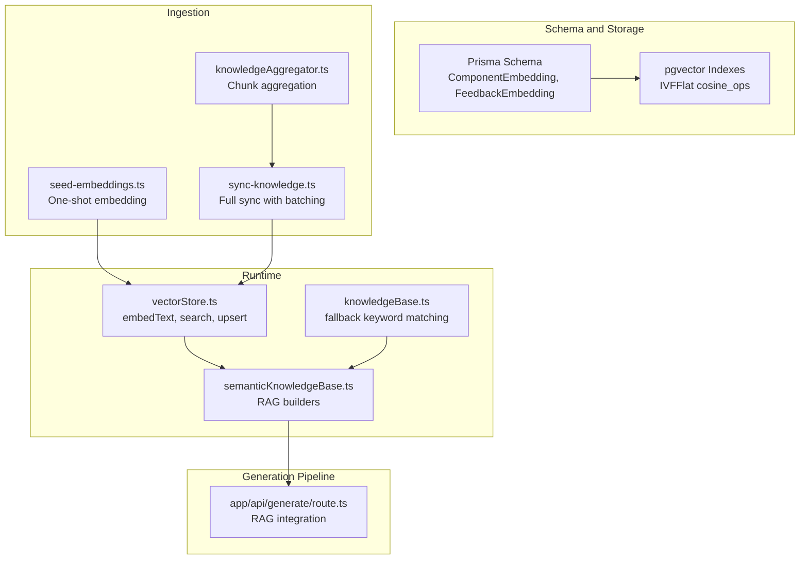
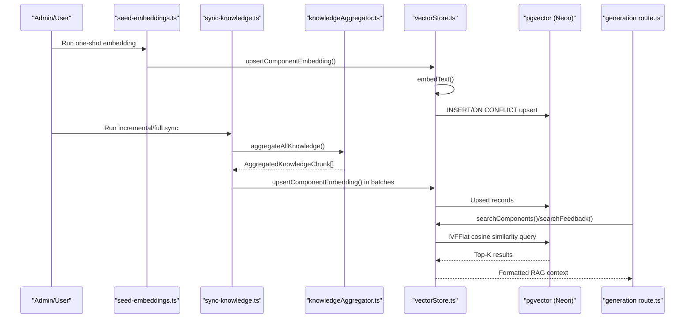
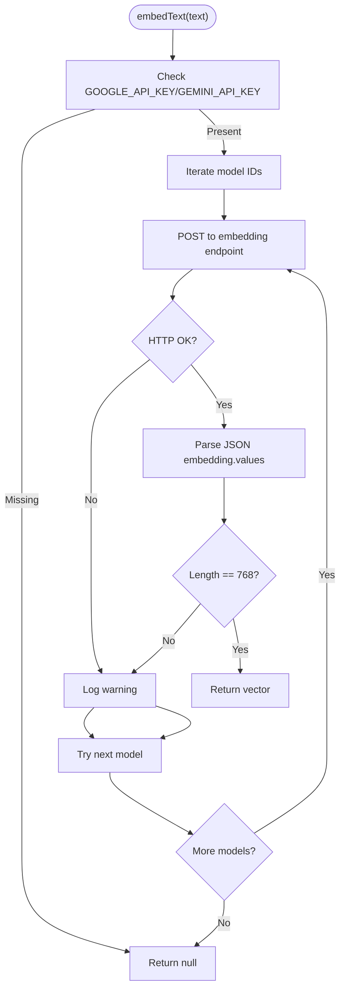
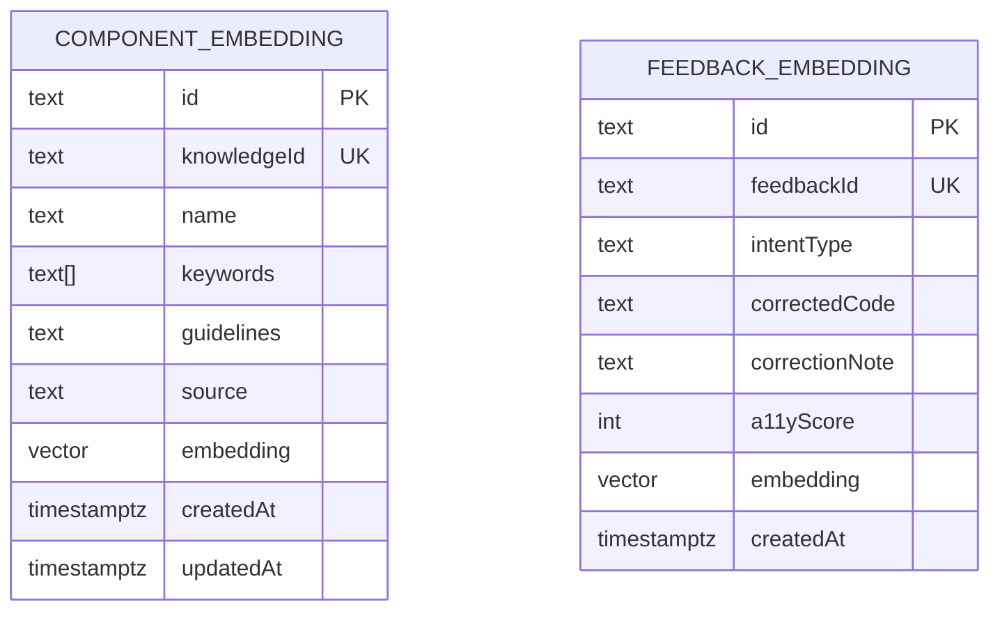
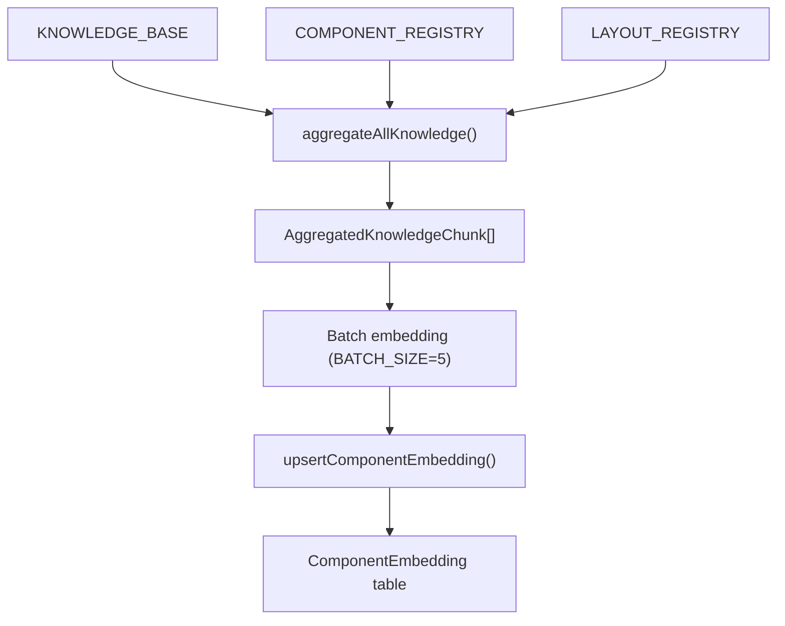
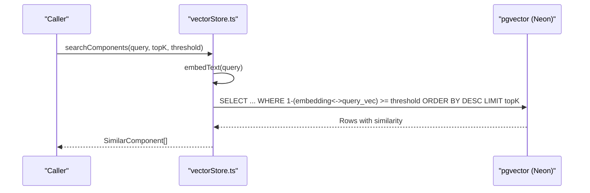
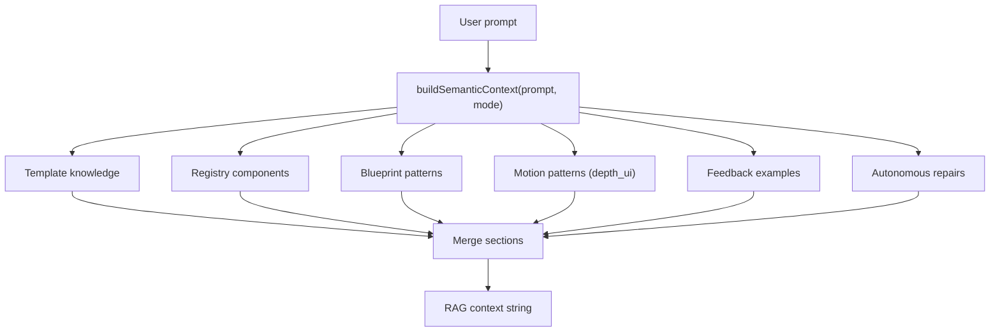
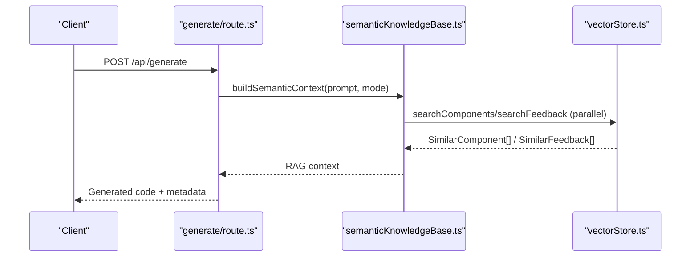
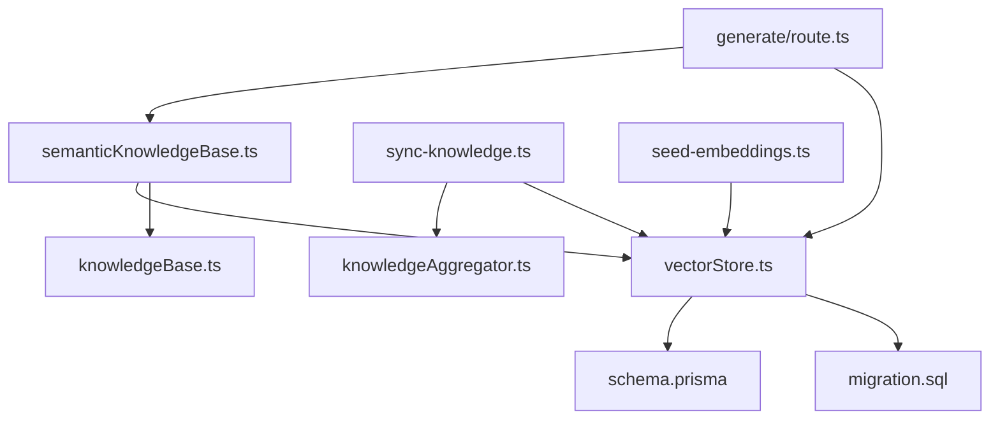

# Vector Embeddings System

<cite>
**Referenced Files in This Document**
- [schema.prisma](file://prisma/schema.prisma)
- [migration.sql](file://prisma/migrations/20260409100000_add_vector_embeddings/migration.sql)
- [vectorStore.ts](file://lib/ai/vectorStore.ts)
- [semanticKnowledgeBase.ts](file://lib/ai/semanticKnowledgeBase.ts)
- [knowledgeBase.ts](file://lib/ai/knowledgeBase.ts)
- [knowledgeAggregator.ts](file://lib/ai/knowledgeAggregator.ts)
- [seed-embeddings.ts](file://scripts/seed-embeddings.ts)
- [sync-knowledge.ts](file://scripts/sync-knowledge.ts)
- [route.ts](file://app/api/generate/route.ts)
- [componentRegistry.ts](file://lib/intelligence/componentRegistry.ts)
- [layoutRegistry.ts](file://lib/intelligence/layoutRegistry.ts)
</cite>

## Table of Contents
1. [Introduction](#introduction)
2. [Project Structure](#project-structure)
3. [Core Components](#core-components)
4. [Architecture Overview](#architecture-overview)
5. [Detailed Component Analysis](#detailed-component-analysis)
6. [Dependency Analysis](#dependency-analysis)
7. [Performance Considerations](#performance-considerations)
8. [Troubleshooting Guide](#troubleshooting-guide)
9. [Conclusion](#conclusion)
10. [Appendices](#appendices)

## Introduction
This document explains the vector embeddings and semantic search system powering the AI UI engine. It covers how knowledge is ingested, embedded, stored, and searched to enable Retrieval-Augmented Generation (RAG). The system integrates:
- Embedding model integration (Google text-embedding-004)
- Vector storage architecture (pgvector on Neon)
- Semantic search with cosine similarity
- Knowledge ingestion pipeline (manual templates, component registry, layout registry, motion/archetype patterns)
- RAG patterns for generation prompts

## Project Structure
The vector embeddings system spans schema definitions, ingestion scripts, runtime vector store utilities, semantic knowledge retrieval, and integration into the generation pipeline.

**Diagram sources**
- [schema.prisma](file://prisma/schema.prisma)
- [migration.sql](file://prisma/migrations/20260409100000_add_vector_embeddings/migration.sql)
- [seed-embeddings.ts](file://scripts/seed-embeddings.ts)
- [sync-knowledge.ts](file://scripts/sync-knowledge.ts)
- [knowledgeAggregator.ts](file://lib/ai/knowledgeAggregator.ts)
- [vectorStore.ts](file://lib/ai/vectorStore.ts)
- [semanticKnowledgeBase.ts](file://lib/ai/semanticKnowledgeBase.ts)
- [knowledgeBase.ts](file://lib/ai/knowledgeBase.ts)
- [route.ts](file://app/api/generate/route.ts)

**Section sources**
- [schema.prisma](file://prisma/schema.prisma)
- [migration.sql](file://prisma/migrations/20260409100000_add_vector_embeddings/migration.sql)
- [seed-embeddings.ts](file://scripts/seed-embeddings.ts)
- [sync-knowledge.ts](file://scripts/sync-knowledge.ts)
- [knowledgeAggregator.ts](file://lib/ai/knowledgeAggregator.ts)
- [vectorStore.ts](file://lib/ai/vectorStore.ts)
- [semanticKnowledgeBase.ts](file://lib/ai/semanticKnowledgeBase.ts)
- [knowledgeBase.ts](file://lib/ai/knowledgeBase.ts)
- [route.ts](file://app/api/generate/route.ts)

## Core Components
- Embedding model integration: Generates 768-dimension vectors using Google’s text-embedding-004 via REST API, with fallback model selection and graceful error handling.
- Vector storage: pgvector column on Neon with IVFFlat index for approximate nearest neighbor cosine similarity search.
- Knowledge ingestion: Two scripts to embed and upsert knowledge entries; supports one-shot seeding and incremental/full sync.
- Semantic search: Cosine similarity search over ComponentEmbedding and FeedbackEmbedding with configurable thresholds and top-K results.
- RAG builders: Asynchronous semantic retrieval functions that combine results from multiple knowledge domains and format them for generation prompts.
- Generation pipeline integration: The generation route conditionally enriches prompts with semantic context and repair patterns.

**Section sources**
- [vectorStore.ts](file://lib/ai/vectorStore.ts)
- [semanticKnowledgeBase.ts](file://lib/ai/semanticKnowledgeBase.ts)
- [seed-embeddings.ts](file://scripts/seed-embeddings.ts)
- [sync-knowledge.ts](file://scripts/sync-knowledge.ts)
- [route.ts](file://app/api/generate/route.ts)

## Architecture Overview
The system separates concerns across ingestion, storage, runtime search, and generation enrichment.

**Diagram sources**
- [seed-embeddings.ts](file://scripts/seed-embeddings.ts)
- [sync-knowledge.ts](file://scripts/sync-knowledge.ts)
- [knowledgeAggregator.ts](file://lib/ai/knowledgeAggregator.ts)
- [vectorStore.ts](file://lib/ai/vectorStore.ts)
- [migration.sql](file://prisma/migrations/20260409100000_add_vector_embeddings/migration.sql)
- [route.ts](file://app/api/generate/route.ts)

## Detailed Component Analysis

### Embedding Model Integration
- Model selection: Attempts multiple model IDs to maximize compatibility.
- Dimensions: 768 (text-embedding-004).
- API: Calls Google Generative Language REST endpoint with output dimensionality set to 768.
- Fallback: Returns null on API errors or unexpected shapes; downstream code handles gracefully.

**Diagram sources**
- [vectorStore.ts](file://lib/ai/vectorStore.ts)

**Section sources**
- [vectorStore.ts](file://lib/ai/vectorStore.ts)

### Vector Storage Architecture
- Tables:
  - ComponentEmbedding: knowledgeId (unique), name, keywords, guidelines, source, embedding(vector 768), timestamps.
  - FeedbackEmbedding: feedbackId (unique), intentType, correctedCode, correctionNote, a11yScore, embedding(vector 768), timestamps.
- Indexing: IVFFlat with vector_cosine_ops and lists=10 for fast ANN search.
- Raw SQL: Queries use the <-> operator for cosine distance and convert vectors to vector literals.

**Diagram sources**
- [schema.prisma](file://prisma/schema.prisma)
- [migration.sql](file://prisma/migrations/20260409100000_add_vector_embeddings/migration.sql)

**Section sources**
- [schema.prisma](file://prisma/schema.prisma)
- [migration.sql](file://prisma/migrations/20260409100000_add_vector_embeddings/migration.sql)

### Knowledge Ingestion Pipeline
- seed-embeddings.ts: One-time script to embed all KNOWLEDGE_BASE entries and upsert into ComponentEmbedding.
- sync-knowledge.ts: Full sync script that aggregates knowledge from multiple sources, supports filtering by source, dry-run, and verbose logging, and embeds in batches.
- knowledgeAggregator.ts: Converts structured knowledge into source-tagged semantic chunks designed for embedding.

**Diagram sources**
- [seed-embeddings.ts](file://scripts/seed-embeddings.ts)
- [sync-knowledge.ts](file://scripts/sync-knowledge.ts)
- [knowledgeAggregator.ts](file://lib/ai/knowledgeAggregator.ts)
- [knowledgeBase.ts](file://lib/ai/knowledgeBase.ts)
- [componentRegistry.ts](file://lib/intelligence/componentRegistry.ts)
- [layoutRegistry.ts](file://lib/intelligence/layoutRegistry.ts)

**Section sources**
- [seed-embeddings.ts](file://scripts/seed-embeddings.ts)
- [sync-knowledge.ts](file://scripts/sync-knowledge.ts)
- [knowledgeAggregator.ts](file://lib/ai/knowledgeAggregator.ts)
- [knowledgeBase.ts](file://lib/ai/knowledgeBase.ts)
- [componentRegistry.ts](file://lib/intelligence/componentRegistry.ts)
- [layoutRegistry.ts](file://lib/intelligence/layoutRegistry.ts)

### Semantic Search Implementation
- searchComponents(): Cosine similarity search over ComponentEmbedding with configurable topK and threshold.
- searchComponentsBySource(): Source-filtered search for fine-grained retrieval across domains (template, registry, blueprint, motion, feedback, repair).
- searchFeedback(): Retrieves past user-corrected examples semantically similar to the prompt for RAG.

**Diagram sources**
- [vectorStore.ts](file://lib/ai/vectorStore.ts)

**Section sources**
- [vectorStore.ts](file://lib/ai/vectorStore.ts)

### Retrieval-Augmented Generation (RAG) Patterns
- semanticKnowledgeBase.ts builds multi-source RAG context:
  - Template knowledge (general)
  - Component registry discovery
  - Layout blueprint matching
  - Motion patterns (depth_ui mode)
  - User-corrected examples (feedback RAG)
  - Autonomous repair memory
- The buildSemanticContext() function runs retrievals in parallel and merges results into a single formatted context string.

**Diagram sources**
- [semanticKnowledgeBase.ts](file://lib/ai/semanticKnowledgeBase.ts)

**Section sources**
- [semanticKnowledgeBase.ts](file://lib/ai/semanticKnowledgeBase.ts)

### Generation Pipeline Integration
- The generation route integrates semantic context into the UI generation flow:
  - Builds RAG context via semanticKnowledgeBase
  - Enriches prompts with registry/blueprint/motion/feedback/repair patterns
  - Saves repair patterns as embeddings for future retrieval

**Diagram sources**
- [route.ts](file://app/api/generate/route.ts)
- [semanticKnowledgeBase.ts](file://lib/ai/semanticKnowledgeBase.ts)
- [vectorStore.ts](file://lib/ai/vectorStore.ts)

**Section sources**
- [route.ts](file://app/api/generate/route.ts)
- [semanticKnowledgeBase.ts](file://lib/ai/semanticKnowledgeBase.ts)
- [vectorStore.ts](file://lib/ai/vectorStore.ts)

## Dependency Analysis
- Coupling:
  - vectorStore.ts depends on Neon SQL client and environment variables for credentials.
  - semanticKnowledgeBase.ts depends on vectorStore.ts and knowledgeBase.ts for fallback.
  - sync-knowledge.ts and seed-embeddings.ts depend on knowledgeAggregator.ts and vectorStore.ts.
  - Generation route depends on semanticKnowledgeBase.ts and vectorStore.ts for RAG.
- Cohesion:
  - Each module encapsulates a single responsibility: embedding, storage, retrieval, or RAG building.
- External dependencies:
  - Google Generative Language API for embeddings.
  - Neon/pgvector for vector storage and IVFFlat indexing.

**Diagram sources**
- [vectorStore.ts](file://lib/ai/vectorStore.ts)
- [semanticKnowledgeBase.ts](file://lib/ai/semanticKnowledgeBase.ts)
- [knowledgeBase.ts](file://lib/ai/knowledgeBase.ts)
- [sync-knowledge.ts](file://scripts/sync-knowledge.ts)
- [seed-embeddings.ts](file://scripts/seed-embeddings.ts)
- [knowledgeAggregator.ts](file://lib/ai/knowledgeAggregator.ts)
- [schema.prisma](file://prisma/schema.prisma)
- [migration.sql](file://prisma/migrations/20260409100000_add_vector_embeddings/migration.sql)
- [route.ts](file://app/api/generate/route.ts)

**Section sources**
- [vectorStore.ts](file://lib/ai/vectorStore.ts)
- [semanticKnowledgeBase.ts](file://lib/ai/semanticKnowledgeBase.ts)
- [knowledgeBase.ts](file://lib/ai/knowledgeBase.ts)
- [sync-knowledge.ts](file://scripts/sync-knowledge.ts)
- [seed-embeddings.ts](file://scripts/seed-embeddings.ts)
- [knowledgeAggregator.ts](file://lib/ai/knowledgeAggregator.ts)
- [schema.prisma](file://prisma/schema.prisma)
- [migration.sql](file://prisma/migrations/20260409100000_add_vector_embeddings/migration.sql)
- [route.ts](file://app/api/generate/route.ts)

## Performance Considerations
- Embedding API rate limits:
  - Scripts throttle requests (sleep between items/batches) to avoid quota exhaustion.
- Index scaling:
  - IVFFlat lists=10 is suitable for small datasets; increase lists as data grows.
- ANN search:
  - IVFFlat with cosine_ops provides fast approximate nearest neighbors; tune lists for recall/performance balance.
- Parallelization:
  - Semantic retrieval runs multiple searches concurrently to reduce latency.
- Dimensionality:
  - 768 dimensions align with text-embedding-004; maintain consistent dimensionality across embeddings.

[No sources needed since this section provides general guidance]

## Troubleshooting Guide
- Missing API key:
  - embedText returns null when GOOGLE_API_KEY is not set; downstream logic should handle gracefully.
- Unexpected embedding shape:
  - embedText logs warnings and tries next model; ensure model output dimensionality matches expectations.
- Database connectivity:
  - vectorStore.ts throws if DATABASE_URL is missing; ensure environment variable is configured.
- Rate limit exceeded:
  - Scripts include delays and batched operations; adjust throttling if encountering quota errors.
- No results:
  - Lower thresholds or broaden sources; verify that knowledge has been embedded and indexed.

**Section sources**
- [vectorStore.ts](file://lib/ai/vectorStore.ts)
- [seed-embeddings.ts](file://scripts/seed-embeddings.ts)
- [sync-knowledge.ts](file://scripts/sync-knowledge.ts)

## Conclusion
The vector embeddings system integrates structured knowledge from multiple sources into a pgvector-backed semantic search layer. It provides robust RAG capabilities that enhance the generation pipeline with contextual patterns, component discovery, layout guidance, motion expertise, and user-corrected examples. With careful configuration of embedding dimensions, thresholds, and indexing strategies, the system scales to support production-grade UI generation workflows.

[No sources needed since this section summarizes without analyzing specific files]

## Appendices

### Configuration and Thresholds
- Embedding dimensions: 768
- Similarity thresholds:
  - Component/template: 0.50
  - Registry/blueprint: 0.48
  - Feedback: 0.62
  - Repair: 0.58
- Index: IVFFlat with vector_cosine_ops and lists=10

**Section sources**
- [vectorStore.ts](file://lib/ai/vectorStore.ts)
- [semanticKnowledgeBase.ts](file://lib/ai/semanticKnowledgeBase.ts)
- [migration.sql](file://prisma/migrations/20260409100000_add_vector_embeddings/migration.sql)

### Example Semantic Search Queries
- General knowledge retrieval: “Build a login page with validation and error handling”
- Component registry discovery: “Show me accessible data table components with sorting and pagination”
- Layout blueprint matching: “Find a dashboard layout with sidebar and metrics grid”
- Motion pattern suggestion: “Create a scroll-driven hero with layered parallax”
- Feedback RAG: “Generate a pricing page similar to previous user-corrected examples”

[No sources needed since this section provides general guidance]