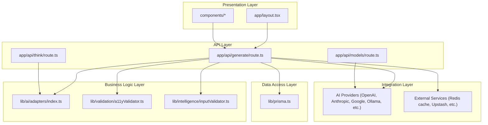
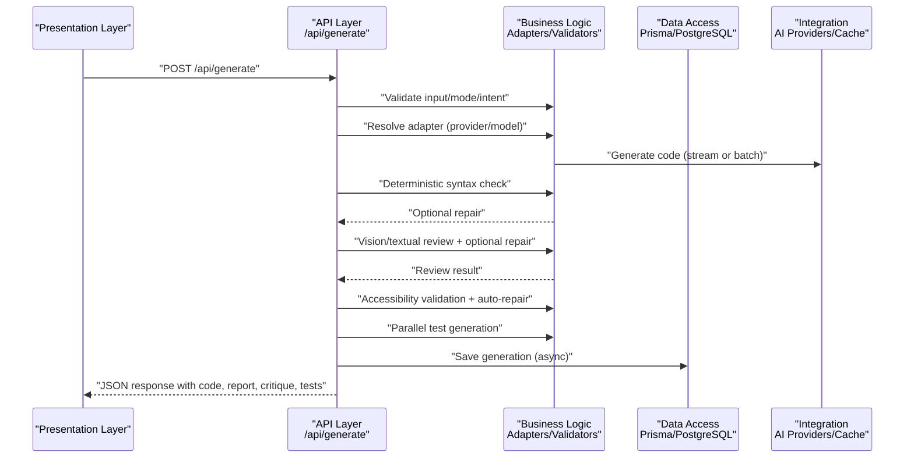
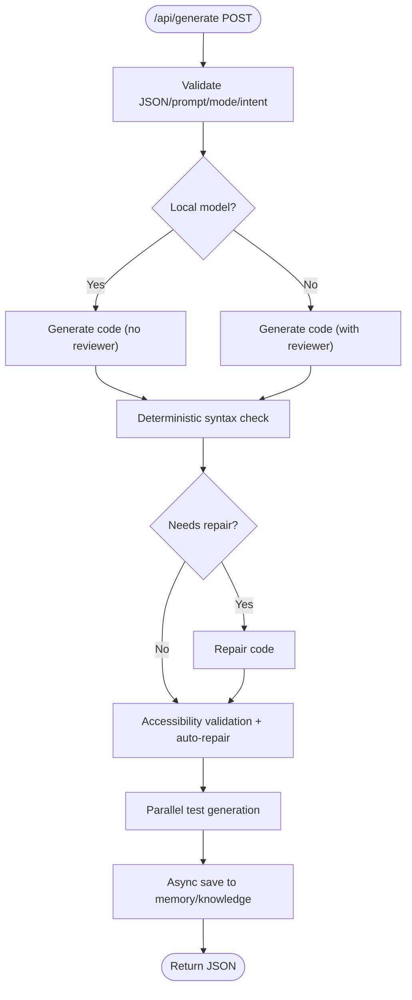
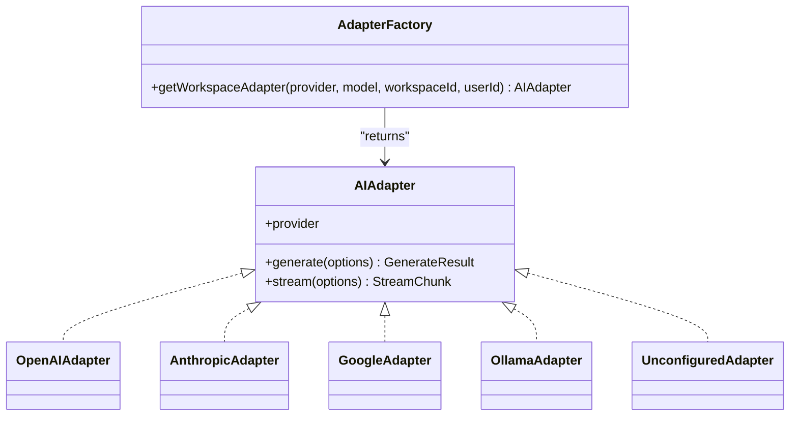
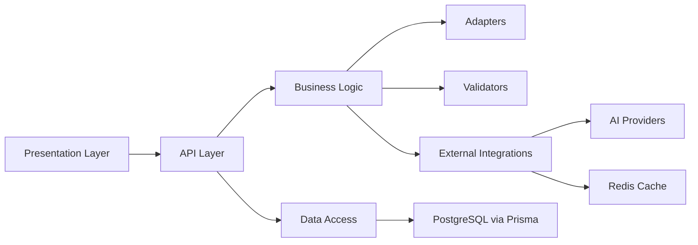

# Layered Architecture

<cite>
**Referenced Files in This Document**
- [README.md](file://README.md)
- [ARCHITECTURE.md](file://docs/ARCHITECTURE.md)
- [package.json](file://package.json)
- [app/layout.tsx](file://app/layout.tsx)
- [app/api/generate/route.ts](file://app/api/generate/route.ts)
- [app/api/think/route.ts](file://app/api/think/route.ts)
- [app/api/models/route.ts](file://app/api/models/route.ts)
- [lib/prisma.ts](file://lib/prisma.ts)
- [lib/ai/adapters/index.ts](file://lib/ai/adapters/index.ts)
- [lib/validation/a11yValidator.ts](file://lib/validation/a11yValidator.ts)
- [lib/intelligence/inputValidator.ts](file://lib/intelligence/inputValidator.ts)
</cite>

## Table of Contents
1. [Introduction](#introduction)
2. [Project Structure](#project-structure)
3. [Core Components](#core-components)
4. [Architecture Overview](#architecture-overview)
5. [Detailed Component Analysis](#detailed-component-analysis)
6. [Dependency Analysis](#dependency-analysis)
7. [Performance Considerations](#performance-considerations)
8. [Troubleshooting Guide](#troubleshooting-guide)
9. [Conclusion](#conclusion)

## Introduction
This document describes the layered architecture of an AI-powered, accessibility-first UI engine built with Next.js. The system is designed around a strict separation of concerns across five layers:
- Presentation layer (Next.js pages and components)
- API layer (serverless routes under Next.js App Router)
- Business logic layer (AI generation, validation, and orchestration)
- Data access layer (Prisma ORM and PostgreSQL)
- Integration layer (AI providers and external services)

The generation pipeline is deterministic and resilient, incorporating intent classification, blueprint enforcement, multi-stage review and repair, automated accessibility validation, and parallel quality gates.

## Project Structure
The repository follows a Next.js App Router layout with:
- app/: Pages, layouts, and serverless API routes
- components/: UI components and providers
- lib/: Shared libraries for AI adapters, validation, security, metrics, and persistence
- prisma/: Database schema and migrations
- docs/: Architectural and environment documentation

**Diagram sources**
- [app/layout.tsx:1-57](file://app/layout.tsx#L1-L57)
- [app/api/generate/route.ts:1-440](file://app/api/generate/route.ts#L1-L440)
- [app/api/think/route.ts:1-79](file://app/api/think/route.ts#L1-L79)
- [app/api/models/route.ts:1-457](file://app/api/models/route.ts#L1-L457)
- [lib/ai/adapters/index.ts:1-306](file://lib/ai/adapters/index.ts#L1-L306)
- [lib/validation/a11yValidator.ts:1-376](file://lib/validation/a11yValidator.ts#L1-L376)
- [lib/intelligence/inputValidator.ts:1-137](file://lib/intelligence/inputValidator.ts#L1-L137)
- [lib/prisma.ts:1-70](file://lib/prisma.ts#L1-L70)

**Section sources**
- [README.md:1-37](file://README.md#L1-L37)
- [docs/ARCHITECTURE.md:1-82](file://docs/ARCHITECTURE.md#L1-L82)
- [package.json:1-68](file://package.json#L1-L68)

## Core Components
- Presentation layer: Root layout composes providers for sessions and workspaces, and renders UI components that consume the API layer.
- API layer: Serverless routes implement the generation, thinking plan, and model discovery workflows with strict input validation and security.
- Business logic layer: Adapters encapsulate AI providers behind a universal interface; validators enforce accessibility and input quality; orchestrator coordinates deterministic stages.
- Data access layer: Prisma client with singleton and transient-error resilience for Neon serverless PostgreSQL.
- Integration layer: AI adapters connect to cloud providers and local models; caching via Upstash Redis; telemetry and metrics.

**Section sources**
- [app/layout.tsx:34-56](file://app/layout.tsx#L34-L56)
- [app/api/generate/route.ts:25-439](file://app/api/generate/route.ts#L25-L439)
- [app/api/think/route.ts:8-78](file://app/api/think/route.ts#L8-L78)
- [app/api/models/route.ts:206-456](file://app/api/models/route.ts#L206-L456)
- [lib/ai/adapters/index.ts:236-278](file://lib/ai/adapters/index.ts#L236-L278)
- [lib/validation/a11yValidator.ts:264-297](file://lib/validation/a11yValidator.ts#L264-L297)
- [lib/intelligence/inputValidator.ts:53-125](file://lib/intelligence/inputValidator.ts#L53-L125)
- [lib/prisma.ts:20-70](file://lib/prisma.ts#L20-L70)

## Architecture Overview
The system is serverless-first, deploying Next.js App Router routes on Vercel and connecting to Neon PostgreSQL via Prisma. The AI generation pipeline is deterministic and multi-stage:
- Intent classification and blueprint enforcement
- Code generation via a universal adapter
- Deterministic syntax validation and optional repair
- Vision and textual review with optional repair
- Accessibility validation and auto-repair
- Parallel test generation
- Persistence and embeddings for knowledge reuse

**Diagram sources**
- [app/api/generate/route.ts:25-439](file://app/api/generate/route.ts#L25-L439)
- [lib/ai/adapters/index.ts:236-278](file://lib/ai/adapters/index.ts#L236-L278)
- [lib/validation/a11yValidator.ts:264-297](file://lib/validation/a11yValidator.ts#L264-L297)
- [lib/prisma.ts:20-70](file://lib/prisma.ts#L20-L70)

## Detailed Component Analysis

### Presentation Layer
- Root layout composes providers for session and workspace contexts, enabling multi-tenant awareness and user-scoped operations.
- UI components render the engine’s panels, editors, and previews, driven by API responses.

**Section sources**
- [app/layout.tsx:34-56](file://app/layout.tsx#L34-L56)

### API Layer
- Generation endpoint orchestrates the deterministic pipeline, including input validation, adapter resolution, streaming support, review/repair, accessibility checks, and parallel test generation.
- Thinking endpoint builds a reasoning plan for complex intents with deterministic fallbacks.
- Models endpoint enumerates provider models with secure key resolution and static fallbacks.

**Diagram sources**
- [app/api/generate/route.ts:25-439](file://app/api/generate/route.ts#L25-L439)

**Section sources**
- [app/api/generate/route.ts:25-439](file://app/api/generate/route.ts#L25-L439)
- [app/api/think/route.ts:8-78](file://app/api/think/route.ts#L8-L78)
- [app/api/models/route.ts:206-456](file://app/api/models/route.ts#L206-L456)

### Business Logic Layer
- Adapters: A universal interface maps multiple providers (OpenAI, Anthropic, Google, Ollama/LM Studio/Groq) to a single adapter factory. Credentials are resolved server-side and cached.
- Validators: Input validator rejects weak prompts; accessibility validator statically enforces WCAG 2.1 AA rules and auto-repairs common issues.
- Orchestrator: The generation route coordinates deterministic stages, timeouts, and fallbacks to ensure reliability.

**Diagram sources**
- [lib/ai/adapters/index.ts:17-306](file://lib/ai/adapters/index.ts#L17-L306)

**Section sources**
- [lib/ai/adapters/index.ts:236-278](file://lib/ai/adapters/index.ts#L236-L278)
- [lib/validation/a11yValidator.ts:264-297](file://lib/validation/a11yValidator.ts#L264-L297)
- [lib/intelligence/inputValidator.ts:53-125](file://lib/intelligence/inputValidator.ts#L53-L125)

### Data Access Layer
- Prisma client is a singleton per-process to avoid exhausting Neon connection limits on Vercel. A helper wraps operations with transient-error detection and retry logic.

**Section sources**
- [lib/prisma.ts:20-70](file://lib/prisma.ts#L20-L70)

### Integration Layer
- AI adapters integrate with cloud providers and local models via a unified interface. The models endpoint resolves keys from client input, database storage, or environment variables, with static fallbacks.
- Caching integrates with Upstash Redis to cache identical prompts and reduce token usage.

**Section sources**
- [app/api/models/route.ts:206-456](file://app/api/models/route.ts#L206-L456)
- [lib/ai/adapters/index.ts:82-138](file://lib/ai/adapters/index.ts#L82-L138)

## Dependency Analysis
The API layer depends on the business logic layer for orchestration and on the data access layer for persistence. The business logic layer depends on adapters and validators. The adapters depend on external integrations and caching.

**Diagram sources**
- [app/api/generate/route.ts:25-439](file://app/api/generate/route.ts#L25-L439)
- [lib/ai/adapters/index.ts:236-278](file://lib/ai/adapters/index.ts#L236-L278)
- [lib/validation/a11yValidator.ts:264-297](file://lib/validation/a11yValidator.ts#L264-L297)
- [lib/prisma.ts:20-70](file://lib/prisma.ts#L20-L70)

**Section sources**
- [package.json:13-44](file://package.json#L13-L44)

## Performance Considerations
- Streaming generation reduces perceived latency for long outputs.
- TTL caching of identical prompts reduces token usage and latency.
- Parallel execution of accessibility validation and test generation minimizes end-to-end time.
- Singleton Prisma client prevents connection exhaustion on serverless platforms.
- Deterministic stages and timeouts bound resource usage and prevent cascading failures.

[No sources needed since this section provides general guidance]

## Troubleshooting Guide
- Authentication and provider configuration: Ensure workspace keys are configured or environment variables are set; the models endpoint surfaces clear 401 messages for invalid keys.
- Input validation: Weak prompts are rejected early with actionable suggestions.
- Adapter resolution: If no credentials are found, the system returns an unconfigured adapter to avoid crashes.
- Database connectivity: Transient errors from Neon are handled with a reconnect helper.
- Review phase timeouts: The generation pipeline bounds the review/repair window to protect maxDuration limits.

**Section sources**
- [app/api/models/route.ts:445-455](file://app/api/models/route.ts#L445-L455)
- [lib/intelligence/inputValidator.ts:53-125](file://lib/intelligence/inputValidator.ts#L53-L125)
- [lib/ai/adapters/index.ts:236-278](file://lib/ai/adapters/index.ts#L236-L278)
- [lib/prisma.ts:58-70](file://lib/prisma.ts#L58-L70)
- [app/api/generate/route.ts:246-310](file://app/api/generate/route.ts#L246-L310)

## Conclusion
The system’s layered architecture cleanly separates concerns, enabling a deterministic, resilient, and scalable AI-driven UI generation pipeline. The presentation layer remains thin, delegating all orchestration to the API layer, which coordinates the business logic, data access, and integrations. The result is a production-grade solution optimized for accessibility, performance, and maintainability.