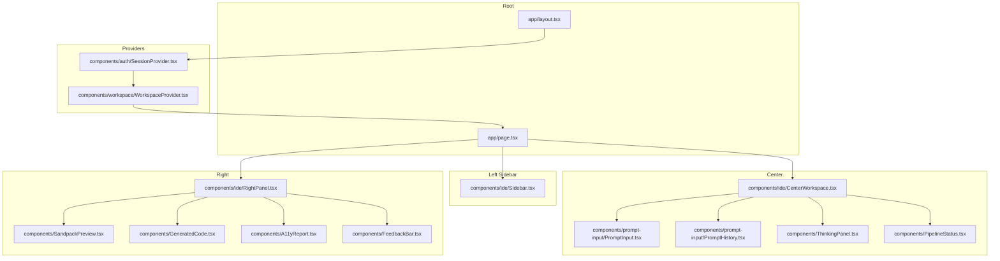
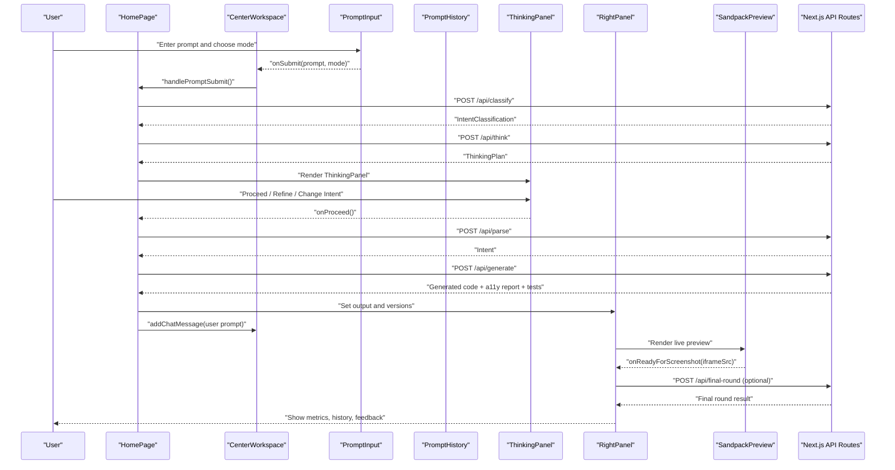
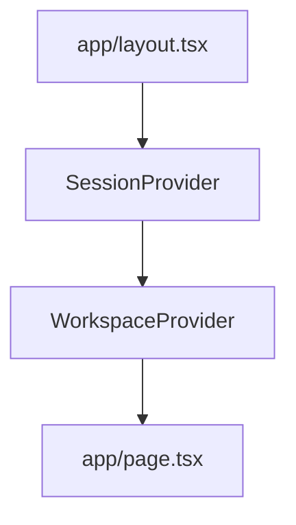
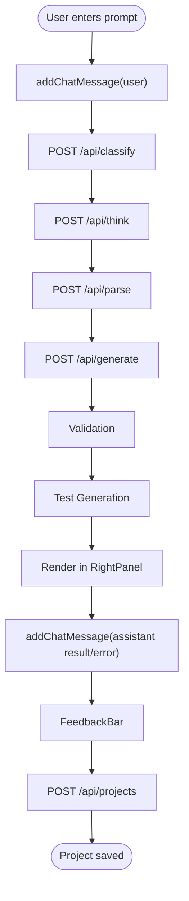
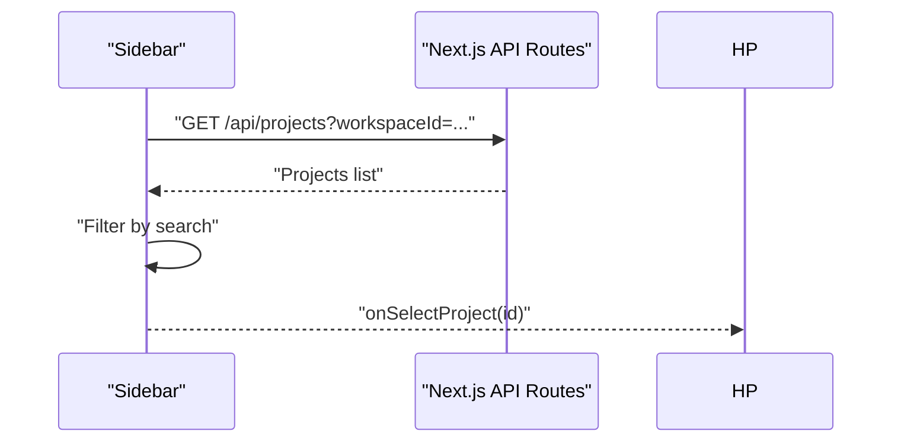
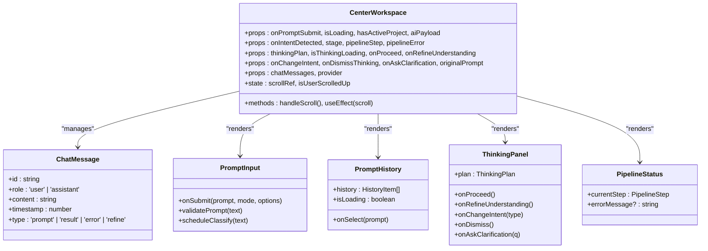
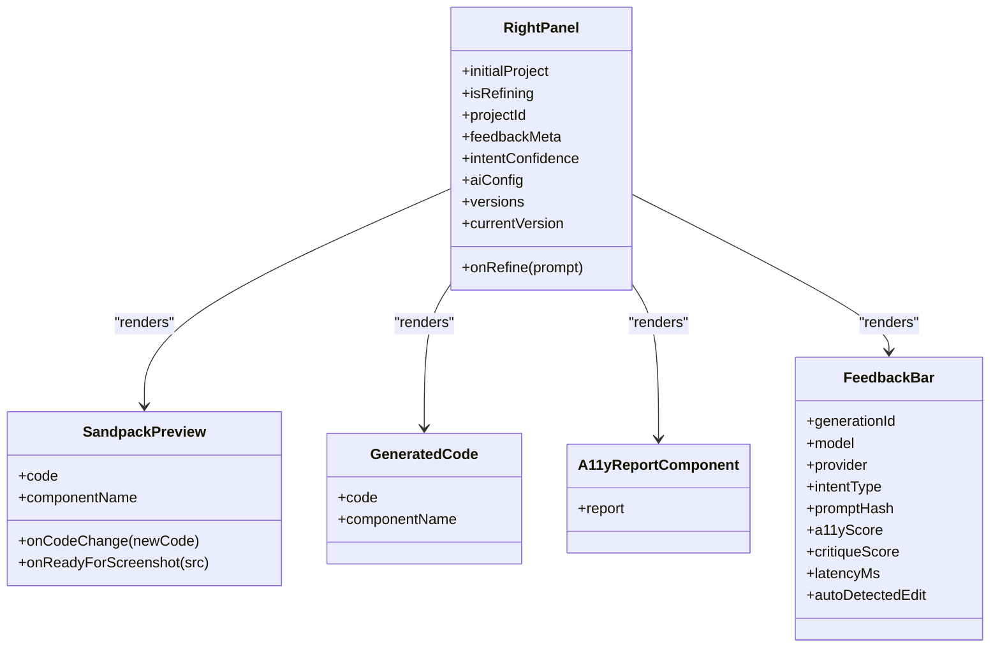
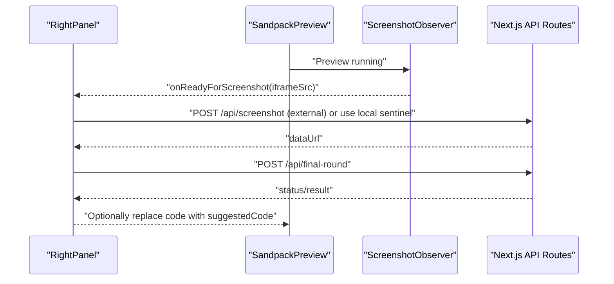
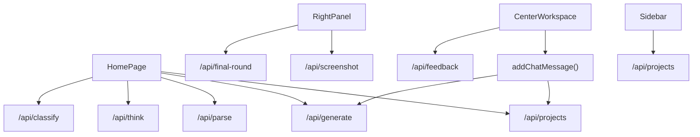
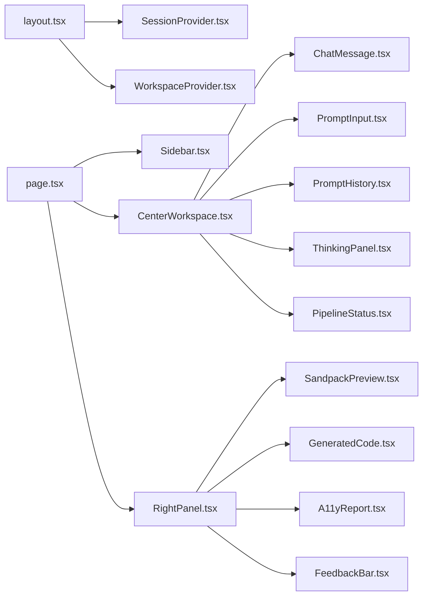

# Presentation Layer

<cite>
**Referenced Files in This Document**
- [app/layout.tsx](file://app/layout.tsx)
- [app/page.tsx](file://app/page.tsx)
- [components/ide/Sidebar.tsx](file://components/ide/Sidebar.tsx)
- [components/ide/CenterWorkspace.tsx](file://components/ide/CenterWorkspace.tsx)
- [components/ide/RightPanel.tsx](file://components/ide/RightPanel.tsx)
- [components/prompt-input/PromptInput.tsx](file://components/prompt-input/PromptInput.tsx)
- [components/prompt-input/PromptHistory.tsx](file://components/prompt-input/PromptHistory.tsx)
- [components/prompt-input/types.ts](file://components/prompt-input/types.ts)
- [components/ThinkingPanel.tsx](file://components/ThinkingPanel.tsx)
- [components/PipelineStatus.tsx](file://components/PipelineStatus.tsx)
- [components/SandpackPreview.tsx](file://components/SandpackPreview.tsx)
- [components/GeneratedCode.tsx](file://components/GeneratedCode.tsx)
- [components/A11yReport.tsx](file://components/A11yReport.tsx)
- [components/FeedbackBar.tsx](file://components/FeedbackBar.tsx)
- [components/auth/SessionProvider.tsx](file://components/auth/SessionProvider.tsx)
- [components/workspace/WorkspaceProvider.tsx](file://components/workspace/WorkspaceProvider.tsx)
</cite>

## Update Summary
**Changes Made**
- Added new chat interface system with persistent message history
- Enhanced CenterWorkspace component with ChatMessage interface and conversation-like interactions
- Implemented automatic scrolling and context preservation for chat threads
- Added visual styling differentiation between user and AI messages
- Integrated chat history state management throughout the generation pipeline

## Table of Contents
1. [Introduction](#introduction)
2. [Project Structure](#project-structure)
3. [Core Components](#core-components)
4. [Architecture Overview](#architecture-overview)
5. [Detailed Component Analysis](#detailed-component-analysis)
6. [Chat Interface System](#chat-interface-system)
7. [Dependency Analysis](#dependency-analysis)
8. [Performance Considerations](#performance-considerations)
9. [Troubleshooting Guide](#troubleshooting-guide)
10. [Conclusion](#conclusion)

## Introduction
This document explains the presentation layer architecture of the AI-powered accessibility-first UI engine. It focuses on the Next.js App Router implementation, React component hierarchy, and user interface design patterns. It also documents how frontend components interact with backend API routes, the role of the IDE workspace interface, and the live preview system. The document covers component composition, state management, and user interaction patterns, and ties together pages, components, and the overall user experience flow.

**Updated** Added comprehensive coverage of the new chat interface system with persistent message history and conversation-like interactions.

## Project Structure
The presentation layer is organized around:
- Root layout and global styles
- A single-page application shell with a three-pane IDE-like interface featuring a chat-based workflow
- Provider-based context for session and workspace
- Specialized panels for prompting, thinking, pipeline status, preview, code, metrics, and feedback
- Persistent chat history management throughout the generation pipeline

**Diagram sources**
- [app/layout.tsx:34-56](file://app/layout.tsx#L34-L56)
- [app/page.tsx:48-521](file://app/page.tsx#L48-L521)
- [components/ide/Sidebar.tsx:31-215](file://components/ide/Sidebar.tsx#L31-L215)
- [components/ide/CenterWorkspace.tsx:34-245](file://components/ide/CenterWorkspace.tsx#L34-L245)
- [components/ide/RightPanel.tsx:175-830](file://components/ide/RightPanel.tsx#L175-L830)
- [components/prompt-input/PromptInput.tsx:42-563](file://components/prompt-input/PromptInput.tsx#L42-L563)
- [components/prompt-input/PromptHistory.tsx:1-37](file://components/prompt-input/PromptHistory.tsx#L1-L37)
- [components/ThinkingPanel.tsx:139-358](file://components/ThinkingPanel.tsx#L139-L358)
- [components/PipelineStatus.tsx:77-219](file://components/PipelineStatus.tsx#L77-L219)
- [components/SandpackPreview.tsx:144-287](file://components/SandpackPreview.tsx#L144-L287)
- [components/GeneratedCode.tsx:14-149](file://components/GeneratedCode.tsx#L14-L149)
- [components/A11yReport.tsx:97-193](file://components/A11yReport.tsx#L97-L193)
- [components/FeedbackBar.tsx:36-227](file://components/FeedbackBar.tsx#L36-L227)
- [components/auth/SessionProvider.tsx:3-7](file://components/auth/SessionProvider.tsx#L3-L7)
- [components/workspace/WorkspaceProvider.tsx:27-155](file://components/workspace/WorkspaceProvider.tsx#L27-L155)

**Section sources**
- [app/layout.tsx:1-57](file://app/layout.tsx#L1-L57)
- [app/page.tsx:1-522](file://app/page.tsx#L1-L522)

## Core Components
- Root layout establishes fonts, metadata, and providers for session and workspace.
- Home page orchestrates the entire UX: prompts, AI pipeline, preview, and feedback with persistent chat history.
- Sidebar manages projects, workspace switching, and user settings.
- Center workspace hosts the chat interface, prompt input, thinking panel, and pipeline status with conversation-like interactions.
- Right panel renders live preview, code, version history, metrics, and feedback bar.
- Providers manage session and workspace state across the app.
- Chat system maintains persistent message history with automatic scrolling and context preservation.

**Updated** Enhanced CenterWorkspace with chat interface capabilities and persistent message history management.

**Section sources**
- [app/layout.tsx:19-56](file://app/layout.tsx#L19-L56)
- [app/page.tsx:48-521](file://app/page.tsx#L48-L521)
- [components/ide/Sidebar.tsx:31-215](file://components/ide/Sidebar.tsx#L31-L215)
- [components/ide/CenterWorkspace.tsx:34-245](file://components/ide/CenterWorkspace.tsx#L34-L245)
- [components/ide/RightPanel.tsx:175-830](file://components/ide/RightPanel.tsx#L175-L830)
- [components/auth/SessionProvider.tsx:3-7](file://components/auth/SessionProvider.tsx#L3-L7)
- [components/workspace/WorkspaceProvider.tsx:27-155](file://components/workspace/WorkspaceProvider.tsx#L27-L155)

## Architecture Overview
The presentation layer follows a client-driven flow with enhanced chat-based interactions:
- The root layout initializes providers and global styles.
- The home page composes the three-pane UI and coordinates state across components with persistent chat history.
- Components communicate with backend APIs via fetch calls to Next.js API routes.
- The IDE workspace interface (sidebar, center, right) provides a cohesive authoring experience with conversation-like interactions.
- The live preview system integrates with a sandboxed React renderer and captures screenshots for AI-driven quality checks.
- Chat messages are automatically persisted and displayed in the center workspace with visual differentiation between user and AI responses.

**Diagram sources**
- [app/page.tsx:313-397](file://app/page.tsx#L313-L397)
- [components/ide/CenterWorkspace.tsx:67-83](file://components/ide/CenterWorkspace.tsx#L67-L83)
- [components/prompt-input/PromptInput.tsx:190-230](file://components/prompt-input/PromptInput.tsx#L190-L230)
- [components/prompt-input/PromptHistory.tsx:18-37](file://components/prompt-input/PromptHistory.tsx#L18-L37)
- [components/ThinkingPanel.tsx:139-358](file://components/ThinkingPanel.tsx#L139-L358)
- [components/ide/RightPanel.tsx:366-476](file://components/ide/RightPanel.tsx#L366-L476)
- [components/SandpackPreview.tsx:65-103](file://components/SandpackPreview.tsx#L65-L103)

## Detailed Component Analysis

### Root Layout and Providers
- Root layout defines metadata, fonts, and wraps children in SessionProvider and WorkspaceProvider.
- Providers supply session and workspace context to the entire app.

**Diagram sources**
- [app/layout.tsx:34-56](file://app/layout.tsx#L34-L56)
- [components/auth/SessionProvider.tsx:3-7](file://components/auth/SessionProvider.tsx#L3-L7)
- [components/workspace/WorkspaceProvider.tsx:27-155](file://components/workspace/WorkspaceProvider.tsx#L27-L155)

**Section sources**
- [app/layout.tsx:19-56](file://app/layout.tsx#L19-L56)
- [components/auth/SessionProvider.tsx:3-7](file://components/auth/SessionProvider.tsx#L3-L7)
- [components/workspace/WorkspaceProvider.tsx:27-155](file://components/workspace/WorkspaceProvider.tsx#L27-L155)

### Home Page Composition and State Management
- Orchestrates the entire UI: mobile sidebar, center workspace, and right panel with persistent chat history.
- Manages stages, pipeline steps, and errors.
- Coordinates AI engine configuration, project persistence, and refinement.
- Handles classification, thinking, and generation pipeline calls to API routes.
- Maintains chat message history state with automatic ID generation and timestamping.

**Updated** Enhanced with chat history state management and integration throughout the generation pipeline.

**Diagram sources**
- [app/page.tsx:166-310](file://app/page.tsx#L166-L310)
- [app/page.tsx:312-397](file://app/page.tsx#L312-L397)
- [app/page.tsx:454-520](file://app/page.tsx#L454-L520)
- [app/page.tsx:523-594](file://app/page.tsx#L523-L594)

**Section sources**
- [app/page.tsx:48-521](file://app/page.tsx#L48-L521)

### Sidebar: Project Management and Workspace Switching
- Lists projects, supports search, and triggers project selection.
- Integrates workspace switching and user navigation.
- Loads projects via API route and reflects active workspace.

**Diagram sources**
- [components/ide/Sidebar.tsx:50-59](file://components/ide/Sidebar.tsx#L50-L59)
- [components/ide/Sidebar.tsx:164-197](file://components/ide/Sidebar.tsx#L164-L197)

**Section sources**
- [components/ide/Sidebar.tsx:31-215](file://components/ide/Sidebar.tsx#L31-L215)

### Center Workspace: Chat Interface, Prompt, Thinking, and Pipeline
- Hosts ChatMessage interface, PromptInput, ThinkingPanel, and PipelineStatus.
- Manages persistent chat history with automatic scrolling and context preservation.
- Provides visual differentiation between user and AI messages with distinct styling.
- Handles visibility and scroll behavior based on stage and thinking plan.
- Provides actions to refine understanding, change intent, and ask clarifications.

**Updated** Enhanced with comprehensive chat interface system featuring persistent message history and conversation-like interactions.

**Diagram sources**
- [components/ide/CenterWorkspace.tsx:14-52](file://components/ide/CenterWorkspace.tsx#L14-L52)
- [components/ide/CenterWorkspace.tsx:18-24](file://components/ide/CenterWorkspace.tsx#L18-L24)
- [components/prompt-input/PromptInput.tsx:34-40](file://components/prompt-input/PromptInput.tsx#L34-L40)
- [components/prompt-input/PromptHistory.tsx:12-16](file://components/prompt-input/PromptHistory.tsx#L12-L16)
- [components/ThinkingPanel.tsx:128-137](file://components/ThinkingPanel.tsx#L128-L137)
- [components/PipelineStatus.tsx:29-32](file://components/PipelineStatus.tsx#L29-L32)

**Section sources**
- [components/ide/CenterWorkspace.tsx:34-245](file://components/ide/CenterWorkspace.tsx#L34-L245)
- [components/prompt-input/PromptInput.tsx:42-563](file://components/prompt-input/PromptInput.tsx#L42-L563)
- [components/prompt-input/PromptHistory.tsx:1-37](file://components/prompt-input/PromptHistory.tsx#L1-L37)
- [components/ThinkingPanel.tsx:139-358](file://components/ThinkingPanel.tsx#L139-L358)
- [components/PipelineStatus.tsx:77-219](file://components/PipelineStatus.tsx#L77-L219)

### Right Panel: Preview, Code, Versions, Metrics, Feedback
- Renders live preview via SandpackPreview, code viewer, version timeline, and metrics.
- Implements confidence scoring combining intent, accessibility, critique, and feedback signals.
- Supports Final Round AI review and screenshot capture.
- Integrates FeedbackBar for user signals.

**Diagram sources**
- [components/ide/RightPanel.tsx:36-60](file://components/ide/RightPanel.tsx#L36-L60)
- [components/SandpackPreview.tsx:14-26](file://components/SandpackPreview.tsx#L14-L26)
- [components/GeneratedCode.tsx:9-12](file://components/GeneratedCode.tsx#L9-L12)
- [components/A11yReport.tsx:7-9](file://components/A11yReport.tsx#L7-L9)
- [components/FeedbackBar.tsx:11-21](file://components/FeedbackBar.tsx#L11-L21)

**Section sources**
- [components/ide/RightPanel.tsx:175-830](file://components/ide/RightPanel.tsx#L175-L830)
- [components/SandpackPreview.tsx:144-287](file://components/SandpackPreview.tsx#L144-L287)
- [components/GeneratedCode.tsx:14-149](file://components/GeneratedCode.tsx#L14-L149)
- [components/A11yReport.tsx:97-193](file://components/A11yReport.tsx#L97-L193)
- [components/FeedbackBar.tsx:36-227](file://components/FeedbackBar.tsx#L36-L227)

### Live Preview System and Final Round
- SandpackPreview embeds a Vite + React sandbox with error boundary and change observer.
- Captures iframe URL after preview settles and posts it to the backend for screenshot capture.
- RightPanel orchestrates Final Round AI review using the captured screenshot and current code.

**Diagram sources**
- [components/SandpackPreview.tsx:65-103](file://components/SandpackPreview.tsx#L65-L103)
- [components/ide/RightPanel.tsx:366-476](file://components/ide/RightPanel.tsx#L366-L476)

**Section sources**
- [components/SandpackPreview.tsx:144-287](file://components/SandpackPreview.tsx#L144-L287)
- [components/ide/RightPanel.tsx:366-476](file://components/ide/RightPanel.tsx#L366-L476)

### Backend API Route Integration
- Frontend components call Next.js API routes for classification, thinking, parsing, generation, validation, testing, feedback, final round, and project persistence.
- The home page coordinates these calls and updates state accordingly.
- Chat messages are automatically persisted through the generation pipeline.

**Updated** Enhanced API integration to support chat message persistence throughout the generation process.

**Diagram sources**
- [app/page.tsx:326-375](file://app/page.tsx#L326-L375)
- [app/page.tsx:180-310](file://app/page.tsx#L180-L310)
- [components/ide/RightPanel.tsx:421-432](file://components/ide/RightPanel.tsx#L421-L432)
- [components/ide/RightPanel.tsx:403-415](file://components/ide/RightPanel.tsx#L403-L415)
- [components/ide/Sidebar.tsx:50-59](file://components/ide/Sidebar.tsx#L50-L59)
- [components/FeedbackBar.tsx:53-83](file://components/FeedbackBar.tsx#L53-L83)

**Section sources**
- [app/page.tsx:122-310](file://app/page.tsx#L122-L310)
- [components/ide/RightPanel.tsx:287-311](file://components/ide/RightPanel.tsx#L287-L311)
- [components/ide/Sidebar.tsx:50-59](file://components/ide/Sidebar.tsx#L50-L59)
- [components/FeedbackBar.tsx:53-83](file://components/FeedbackBar.tsx#L53-L83)

## Chat Interface System

### ChatMessage Interface and State Management
The chat system introduces a comprehensive messaging framework with persistent history:

- **ChatMessage Interface**: Defines structured message format with role, content, timestamp, and type
- **State Management**: Centralized chat history state in HomePage with automatic ID generation and timestamping
- **Visual Styling**: Distinct styling for user vs AI messages with role-based color schemes
- **Automatic Scrolling**: Intelligent scroll behavior that preserves user position while auto-scrolling to new messages
- **Context Preservation**: Chat history maintained throughout the generation pipeline with conversation-like flow

### Conversation Flow Integration
The chat interface seamlessly integrates with the generation pipeline:

- **User Messages**: Automatically added when prompts are submitted, with type 'prompt'
- **AI Responses**: Added after successful generation with type 'result' or error states with type 'error'
- **Refinement Messages**: Special handling for direct refinement operations with type 'refine'
- **Thinking Panel**: Integrated within chat thread with animated transitions
- **Pipeline Status**: Displayed alongside chat messages during processing stages

### Visual Design Elements
The chat interface features sophisticated visual design:

- **Role-Based Styling**: User messages use provider theme colors with reversed layout order
- **AI Message Styling**: Assistant messages use subtle backgrounds with error-specific styling for failures
- **Avatar System**: Custom avatars with role-appropriate icons (User/Bot) and styling
- **Animation System**: Smooth fade-in and slide-up animations for new messages
- **Responsive Layout**: Flexible message positioning that adapts to different screen sizes

**Section sources**
- [components/ide/CenterWorkspace.tsx:18-24](file://components/ide/CenterWorkspace.tsx#L18-L24)
- [components/ide/CenterWorkspace.tsx:79-83](file://components/ide/CenterWorkspace.tsx#L79-L83)
- [components/ide/CenterWorkspace.tsx:204-231](file://components/ide/CenterWorkspace.tsx#L204-L231)
- [app/page.tsx:77-83](file://app/page.tsx#L77-L83)
- [app/page.tsx:454-462](file://app/page.tsx#L454-L462)
- [app/page.tsx:427](file://app/page.tsx#L427)

## Dependency Analysis
- Provider coupling: Root layout depends on SessionProvider and WorkspaceProvider to enable authentication and workspace-aware UI.
- Component coupling: HomePage composes Sidebar, CenterWorkspace, and RightPanel; CenterWorkspace composes ChatMessage interface, PromptInput, PromptHistory, ThinkingPanel, and PipelineStatus; RightPanel composes SandpackPreview, GeneratedCode, A11yReport, and FeedbackBar.
- External dependencies: SandpackPreview relies on @codesandbox/sandpack-react; CodeMirror is used for code rendering.
- Chat system dependencies: CenterWorkspace depends on ChatMessage interface and uses sophisticated scroll management with useRef and useEffect hooks.

**Updated** Enhanced dependency analysis to include chat interface system and its integration points.

**Diagram sources**
- [app/layout.tsx:34-56](file://app/layout.tsx#L34-L56)
- [app/page.tsx:48-521](file://app/page.tsx#L48-L521)
- [components/ide/Sidebar.tsx:31-215](file://components/ide/Sidebar.tsx#L31-L215)
- [components/ide/CenterWorkspace.tsx:34-245](file://components/ide/CenterWorkspace.tsx#L34-L245)
- [components/ide/RightPanel.tsx:175-830](file://components/ide/RightPanel.tsx#L175-L830)
- [components/prompt-input/PromptInput.tsx:42-563](file://components/prompt-input/PromptInput.tsx#L42-L563)
- [components/prompt-input/PromptHistory.tsx:1-37](file://components/prompt-input/PromptHistory.tsx#L1-L37)
- [components/ThinkingPanel.tsx:139-358](file://components/ThinkingPanel.tsx#L139-L358)
- [components/PipelineStatus.tsx:77-219](file://components/PipelineStatus.tsx#L77-L219)
- [components/SandpackPreview.tsx:144-287](file://components/SandpackPreview.tsx#L144-L287)
- [components/GeneratedCode.tsx:14-149](file://components/GeneratedCode.tsx#L14-L149)
- [components/A11yReport.tsx:97-193](file://components/A11yReport.tsx#L97-L193)
- [components/FeedbackBar.tsx:36-227](file://components/FeedbackBar.tsx#L36-L227)

**Section sources**
- [app/layout.tsx:34-56](file://app/layout.tsx#L34-L56)
- [app/page.tsx:48-521](file://app/page.tsx#L48-L521)

## Performance Considerations
- Debounced intent classification reduces API calls during typing.
- Conditional rendering avoids unnecessary re-renders (e.g., suppressing center workspace during direct refinement).
- Sandpack preview refresh and error boundaries prevent crashes and reduce reload overhead.
- Confidence gauges and suggestion chips are lazy-loaded to minimize initial payload.
- **Chat System Optimizations**: Efficient chat message rendering with memoization and optimized scroll handling to maintain performance with long conversation histories.
- **State Management**: Centralized chat state prevents prop drilling and reduces re-renders across components.

**Updated** Added performance considerations specific to the chat interface system.

## Troubleshooting Guide
- Authentication errors: PipelineStatus displays an "Unauthorized" message and offers a sign-in action.
- Preview crashes: SandpackPreview's error boundary shows a retry option.
- Network errors: HomePage sets pipeline errors and stages to error; users can retry from the prompt input.
- Feedback submission failures: FeedbackBar surfaces error messages with a retry option.
- **Chat History Issues**: If chat messages don't appear, check that addChatMessage is being called correctly and that chatMessages state is properly passed to CenterWorkspace.
- **Scroll Position Problems**: If the chat doesn't auto-scroll to new messages, verify that handleScroll and useEffect are functioning correctly with the scrollRef reference.

**Updated** Added troubleshooting guidance for chat interface issues.

**Section sources**
- [components/PipelineStatus.tsx:166-215](file://components/PipelineStatus.tsx#L166-L215)
- [components/SandpackPreview.tsx:109-140](file://components/SandpackPreview.tsx#L109-L140)
- [app/page.tsx:344-347](file://app/page.tsx#L344-L347)
- [components/FeedbackBar.tsx:212-224](file://components/FeedbackBar.tsx#L212-L224)

## Conclusion
The presentation layer combines a robust provider model, a three-pane IDE-style interface with enhanced chat-based interactions, and a tightly integrated live preview system. Components coordinate through a clear pipeline that spans classification, thinking, parsing, generation, validation, and testing, with persistent chat history throughout the process. The right panel elevates the developer experience with metrics, version history, and AI-driven feedback and final review. The new chat interface system provides conversation-like interactions with automatic scrolling and context preservation, creating a more intuitive and engaging user experience. Together, these patterns deliver a responsive, accessible, and highly interactive authoring environment with sophisticated state management and visual design.