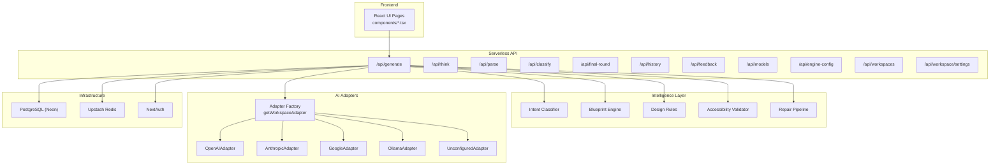
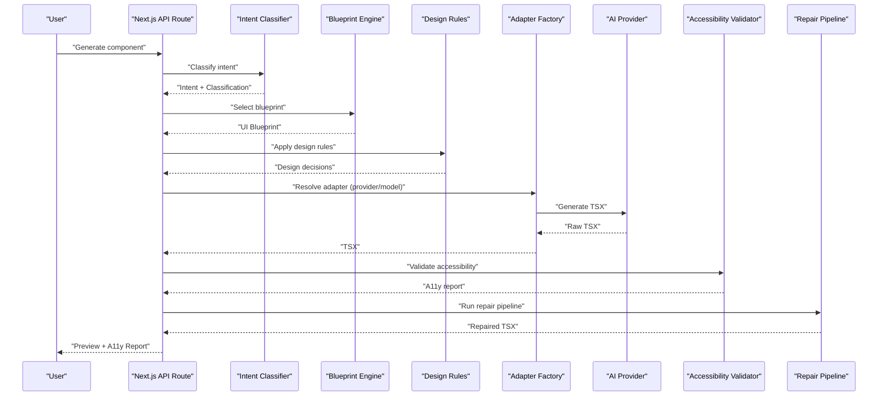
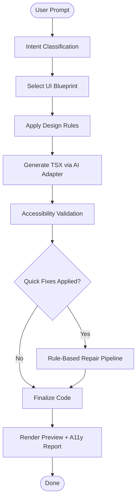
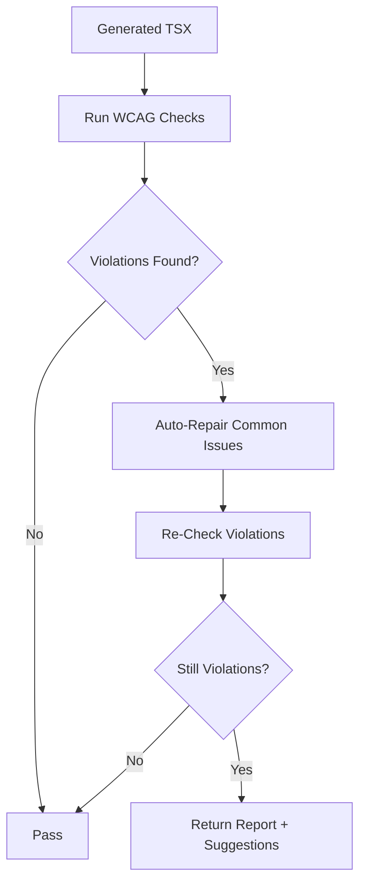
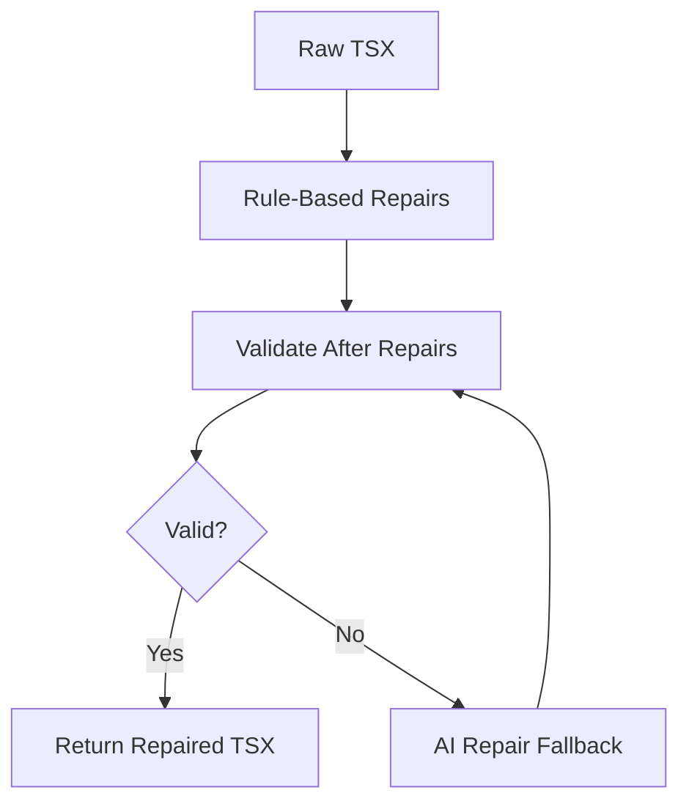
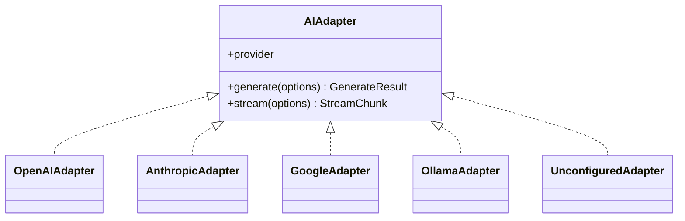
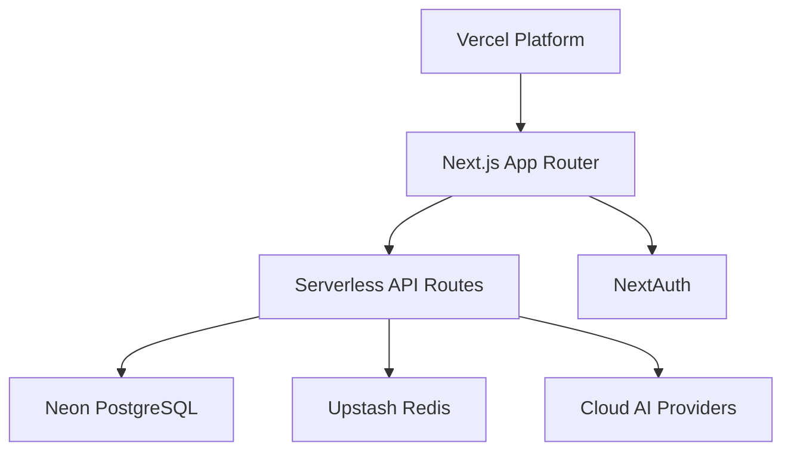
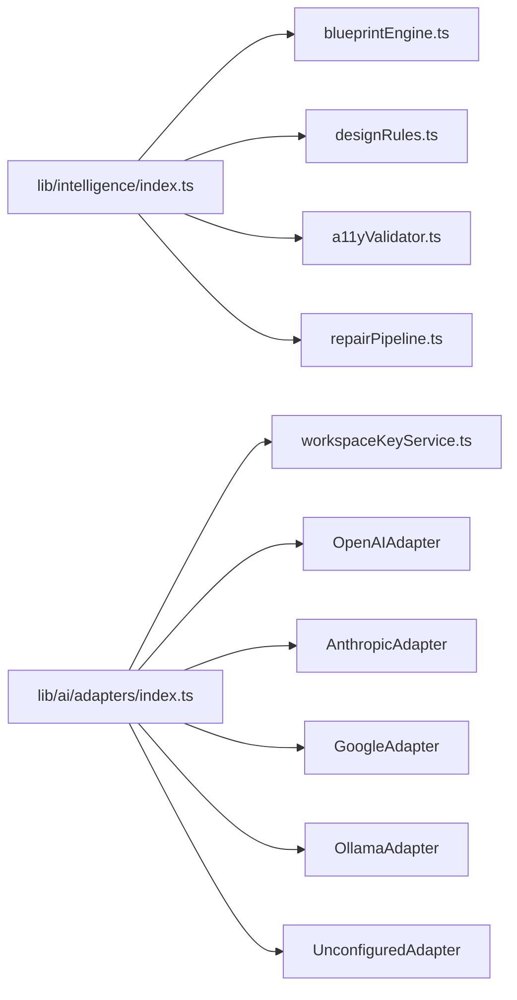

# System Overview

<cite>
**Referenced Files in This Document**
- [README.md](file://README.md)
- [ARCHITECTURE.md](file://docs/ARCHITECTURE.md)
- [package.json](file://package.json)
- [lib/intelligence/index.ts](file://lib/intelligence/index.ts)
- [lib/validation/a11yValidator.ts](file://lib/validation/a11yValidator.ts)
- [lib/intelligence/blueprintEngine.ts](file://lib/intelligence/blueprintEngine.ts)
- [lib/intelligence/designRules.ts](file://lib/intelligence/designRules.ts)
- [lib/intelligence/repairPipeline.ts](file://lib/intelligence/repairPipeline.ts)
- [lib/ai/adapters/index.ts](file://lib/ai/adapters/index.ts)
- [lib/security/workspaceKeyService.ts](file://lib/security/workspaceKeyService.ts)
- [lib/logger.ts](file://lib/logger.ts)
- [app/api/generate/route.ts](file://app/api/generate/route.ts)
- [app/api/think/route.ts](file://app/api/think/route.ts)
- [app/api/parse/route.ts](file://app/api/parse/route.ts)
- [app/api/classify/route.ts](file://app/api/classify/route.ts)
- [app/api/final-round/route.ts](file://app/api/final-round/route.ts)
- [app/api/history/route.ts](file://app/api/history/route.ts)
- [app/api/feedback/route.ts](file://app/api/feedback/route.ts)
- [app/api/models/route.ts](file://app/api/models/route.ts)
- [app/api/engine-config/route.ts](file://app/api/engine-config/route.ts)
- [app/api/workspaces/route.ts](file://app/api/workspaces/route.ts)
- [app/api/workspace/settings/route.ts](file://app/api/workspace/settings/route.ts)
- [components/PipelineStatus.tsx](file://components/PipelineStatus.tsx)
- [components/ThinkingPanel.tsx](file://components/ThinkingPanel.tsx)
- [components/FinalRoundPanel.tsx](file://components/FinalRoundPanel.tsx)
- [components/GeneratedCode.tsx](file://components/GeneratedCode.tsx)
- [components/A11yReport.tsx](file://components/A11yReport.tsx)
- [components/FeedbackBar.tsx](file://components/FeedbackBar.tsx)
- [components/SandpackPreview.tsx](file://components/SandpackPreview.tsx)
</cite>

## Table of Contents
1. [Introduction](#introduction)
2. [Project Structure](#project-structure)
3. [Core Components](#core-components)
4. [Architecture Overview](#architecture-overview)
5. [Detailed Component Analysis](#detailed-component-analysis)
6. [Dependency Analysis](#dependency-analysis)
7. [Performance Considerations](#performance-considerations)
8. [Troubleshooting Guide](#troubleshooting-guide)
9. [Conclusion](#conclusion)

## Introduction
This document presents the system overview for an AI-powered, accessibility-first UI engine that generates production-grade React components from natural language. Unlike basic AI wrappers, the system enforces a deterministic multi-agent pipeline, strict design system blueprints, and multi-provider AI resilience. It is built for serverless scalability and emphasizes accessibility compliance, observability, and security.

## Project Structure
The project is a Next.js 14+ application using the App Router. The backend is composed of serverless API routes under app/api, with a modular intelligence layer in lib/, and a cohesive set of UI components in components/.

**Diagram sources**
- [README.md:1-37](file://README.md#L1-L37)
- [package.json:13-44](file://package.json#L13-L44)
- [lib/intelligence/index.ts:1-13](file://lib/intelligence/index.ts#L1-L13)
- [lib/ai/adapters/index.ts:15-306](file://lib/ai/adapters/index.ts#L15-L306)
- [lib/validation/a11yValidator.ts:1-376](file://lib/validation/a11yValidator.ts#L1-L376)
- [lib/intelligence/repairPipeline.ts:1-287](file://lib/intelligence/repairPipeline.ts#L1-L287)
- [lib/security/workspaceKeyService.ts:1-138](file://lib/security/workspaceKeyService.ts#L1-L138)
- [lib/logger.ts:1-89](file://lib/logger.ts#L1-L89)

**Section sources**
- [README.md:1-37](file://README.md#L1-L37)
- [package.json:13-44](file://package.json#L13-L44)

## Core Components
- Multi-Agent Pipeline: The system orchestrates a deterministic flow: intent classification, blueprint assembly, design reasoning, code generation, validation, and repair.
- Accessibility-First Validation: A rule-based validator checks WCAG 2.1 AA criteria and auto-applies quick fixes.
- Repair Pipeline: Applies rule-based and AI-assisted repairs to ensure runtime safety and preview readiness.
- Universal Adapter Pattern: A single interface supports multiple providers (OpenAI, Anthropic, Google, Ollama/LM Studio/Groq) with automatic fallback and retry.
- Serverless Deployment: Built for Vercel with Neon and Upstash Redis for scalable, cost-efficient operations.
- Security and Workspace Awareness: Per-workspace API keys, encryption, and authorization checks.
- Observability: Structured logging and metrics for latency, token usage, and cost estimation.

**Section sources**
- [ARCHITECTURE.md:7-82](file://docs/ARCHITECTURE.md#L7-L82)
- [lib/validation/a11yValidator.ts:1-376](file://lib/validation/a11yValidator.ts#L1-L376)
- [lib/intelligence/repairPipeline.ts:1-287](file://lib/intelligence/repairPipeline.ts#L1-L287)
- [lib/ai/adapters/index.ts:15-306](file://lib/ai/adapters/index.ts#L15-L306)
- [lib/security/workspaceKeyService.ts:1-138](file://lib/security/workspaceKeyService.ts#L1-L138)
- [lib/logger.ts:1-89](file://lib/logger.ts#L1-L89)

## Architecture Overview
The system transforms natural language into accessible React components through a multi-stage, deterministic pipeline executed in serverless routes. The pipeline integrates design blueprints, accessibility validation, and a resilient AI adapter layer.

**Diagram sources**
- [app/api/generate/route.ts](file://app/api/generate/route.ts)
- [lib/intelligence/blueprintEngine.ts:122-176](file://lib/intelligence/blueprintEngine.ts#L122-L176)
- [lib/intelligence/designRules.ts:100-223](file://lib/intelligence/designRules.ts#L100-L223)
- [lib/validation/a11yValidator.ts:264-297](file://lib/validation/a11yValidator.ts#L264-L297)
- [lib/intelligence/repairPipeline.ts:238-286](file://lib/intelligence/repairPipeline.ts#L238-L286)
- [lib/ai/adapters/index.ts:236-278](file://lib/ai/adapters/index.ts#L236-L278)

## Detailed Component Analysis

### Multi-Agent Pipeline
- Intent Classification: Determines whether the request targets a single component, a full layout, or a WebGL scene.
- Blueprint Assembly: Selects a UI blueprint with layout, components, assembly rules, and constraints.
- Design Reasoning: Applies heuristics to decide navigation style, motion, depth UI, and accessibility priorities.
- Code Generation: Sends an augmented prompt to the selected AI adapter to produce raw TSX.
- Validation and Repair: Validates accessibility, auto-applies quick fixes, and runs a repair pipeline with optional AI repair fallback.

**Diagram sources**
- [lib/intelligence/blueprintEngine.ts:122-176](file://lib/intelligence/blueprintEngine.ts#L122-L176)
- [lib/intelligence/designRules.ts:100-223](file://lib/intelligence/designRules.ts#L100-L223)
- [lib/validation/a11yValidator.ts:264-297](file://lib/validation/a11yValidator.ts#L264-L297)
- [lib/intelligence/repairPipeline.ts:238-286](file://lib/intelligence/repairPipeline.ts#L238-L286)

**Section sources**
- [lib/intelligence/blueprintEngine.ts:122-176](file://lib/intelligence/blueprintEngine.ts#L122-L176)
- [lib/intelligence/designRules.ts:100-223](file://lib/intelligence/designRules.ts#L100-L223)
- [lib/intelligence/repairPipeline.ts:238-286](file://lib/intelligence/repairPipeline.ts#L238-L286)

### Accessibility-First Validation
- Rule-Based Validator: Enforces WCAG 2.1 AA rules including labels, buttons, images, headings, keyboard accessibility, color contrast, focus visibility, and error announcements.
- Auto-Repair: Automatically applies targeted fixes for common issues (e.g., adding alt text, ARIA labels, focus rings).

**Diagram sources**
- [lib/validation/a11yValidator.ts:264-297](file://lib/validation/a11yValidator.ts#L264-L297)
- [lib/validation/a11yValidator.ts:303-375](file://lib/validation/a11yValidator.ts#L303-L375)

**Section sources**
- [lib/validation/a11yValidator.ts:19-260](file://lib/validation/a11yValidator.ts#L19-L260)
- [lib/validation/a11yValidator.ts:303-375](file://lib/validation/a11yValidator.ts#L303-L375)

### Repair Pipeline
- Rule-Based Repairs: Removes unsafe imports, normalizes JSX template literals, adds missing exports, and replaces unavailable libraries with available ones.
- Accessibility Quick Repairs: Adds alt attributes and role/tabIndex to interactive elements.
- AI-Assisted Repair: If rule-based repairs do not fully resolve issues, an optional AI repair agent can fix remaining errors.

**Diagram sources**
- [lib/intelligence/repairPipeline.ts:210-229](file://lib/intelligence/repairPipeline.ts#L210-L229)
- [lib/intelligence/repairPipeline.ts:238-286](file://lib/intelligence/repairPipeline.ts#L238-L286)

**Section sources**
- [lib/intelligence/repairPipeline.ts:18-113](file://lib/intelligence/repairPipeline.ts#L18-L113)
- [lib/intelligence/repairPipeline.ts:119-179](file://lib/intelligence/repairPipeline.ts#L119-L179)
- [lib/intelligence/repairPipeline.ts:184-203](file://lib/intelligence/repairPipeline.ts#L184-L203)
- [lib/intelligence/repairPipeline.ts:238-286](file://lib/intelligence/repairPipeline.ts#L238-L286)

### Universal Adapter & Resilience
- Single Interface: All providers (OpenAI, Anthropic, Google, Ollama/LM Studio/Groq) implement a shared AIAdapter interface.
- Credential Resolution: Securely resolves keys per workspace via workspaceKeyService, with environment variable fallbacks.
- Fallback & Retry: Automatic exponential backoff with jitter and provider chaining; local Ollama fallback when cloud providers fail.
- Caching: TTL-based caching of generation results to reduce latency and costs.

**Diagram sources**
- [lib/ai/adapters/index.ts:19-306](file://lib/ai/adapters/index.ts#L19-L306)

**Section sources**
- [lib/ai/adapters/index.ts:15-306](file://lib/ai/adapters/index.ts#L15-L306)
- [lib/security/workspaceKeyService.ts:32-95](file://lib/security/workspaceKeyService.ts#L32-L95)

### Serverless Deployment Strategy
- Frontend & API: Next.js App Router pages and serverless routes deployed on Vercel.
- Database: PostgreSQL via Neon with Prisma ORM.
- Caching: Upstash Redis for HTTP-based caching of identical prompts.
- Authentication: NextAuth integration for session-based access.

**Diagram sources**
- [ARCHITECTURE.md:12-20](file://docs/ARCHITECTURE.md#L12-L20)
- [package.json:19,25,33,34](file://package.json#L19,L25,L33,L34)

**Section sources**
- [ARCHITECTURE.md:12-20](file://docs/ARCHITECTURE.md#L12-L20)
- [package.json:19,25,33,34](file://package.json#L19,L25,L33,L34)

### Accessibility-First Design & Production-Grade Components
- Design System Enforcement: Blueprints and assembly rules enforce consistent imports from the @ui/* ecosystem, Tailwind usage, and semantic HTML.
- Accessibility Compliance: WCAG 2.1 AA validation and auto-repairs ensure components are accessible by default.
- Preview Safety: The repair pipeline removes unsafe browser-unsafe imports and ensures preview compatibility.

**Section sources**
- [lib/intelligence/blueprintEngine.ts:45-62](file://lib/intelligence/blueprintEngine.ts#L45-L62)
- [lib/intelligence/blueprintEngine.ts:181-214](file://lib/intelligence/blueprintEngine.ts#L181-L214)
- [lib/validation/a11yValidator.ts:19-260](file://lib/validation/a11yValidator.ts#L19-L260)
- [lib/intelligence/repairPipeline.ts:18-113](file://lib/intelligence/repairPipeline.ts#L18-L113)

### Multi-Provider AI Resilience
- Provider Diversity: Supports OpenAI, Anthropic, Google, and Ollama/LM Studio/Groq via a unified adapter.
- Fault Tolerance: Automatic retries with exponential backoff and provider fallback; local model fallback when cloud providers fail.
- Transparent Fallbacks: UnconfiguredAdapter gracefully informs users when no credentials are present.

**Section sources**
- [lib/ai/adapters/index.ts:15-306](file://lib/ai/adapters/index.ts#L15-L306)

### Deterministic Pipeline & Design System Enforcement
- Deterministic Stages: Intent classification, blueprint selection, design rules, generation, validation, and repair occur in a fixed order.
- Design System Enforcement: Assembly rules mandate imports from @ui/* packages and Tailwind usage, ensuring consistent, production-ready components.

**Section sources**
- [lib/intelligence/blueprintEngine.ts:181-214](file://lib/intelligence/blueprintEngine.ts#L181-L214)
- [lib/intelligence/designRules.ts:225-244](file://lib/intelligence/designRules.ts#L225-L244)

## Dependency Analysis
The intelligence layer aggregates core modules for blueprinting, design rules, validation, and repair. The adapter layer depends on workspaceKeyService for secure credential resolution and integrates with multiple providers.

**Diagram sources**
- [lib/intelligence/index.ts:5-12](file://lib/intelligence/index.ts#L5-L12)
- [lib/ai/adapters/index.ts:19-306](file://lib/ai/adapters/index.ts#L19-L306)
- [lib/security/workspaceKeyService.ts:8-137](file://lib/security/workspaceKeyService.ts#L8-L137)

**Section sources**
- [lib/intelligence/index.ts:5-12](file://lib/intelligence/index.ts#L5-L12)
- [lib/ai/adapters/index.ts:19-306](file://lib/ai/adapters/index.ts#L19-L306)

## Performance Considerations
- Caching: Use Upstash Redis to cache identical prompts and reduce latency and API costs.
- Deterministic Pipeline: Fixed stages and rule-based repairs minimize rework and improve throughput.
- Provider Fallback: Automatic fallback reduces downtime and improves availability.
- Observability: Structured logs and metrics enable performance monitoring and cost tracking.

[No sources needed since this section provides general guidance]

## Troubleshooting Guide
- Missing API Keys: ConfigurationError indicates a missing key; configure workspace settings or environment variables.
- Provider Failures: Automatic retries and fallbacks mitigate transient errors; monitor logs for provider-specific issues.
- Accessibility Violations: Review A11yReport suggestions and ensure auto-repairs are applied.
- Preview Errors: Use the repair pipeline to remove unsafe imports and normalize JSX.

**Section sources**
- [lib/ai/adapters/index.ts:28-40](file://lib/ai/adapters/index.ts#L28-L40)
- [lib/security/workspaceKeyService.ts:32-95](file://lib/security/workspaceKeyService.ts#L32-L95)
- [lib/validation/a11yValidator.ts:264-297](file://lib/validation/a11yValidator.ts#L264-L297)
- [lib/intelligence/repairPipeline.ts:238-286](file://lib/intelligence/repairPipeline.ts#L238-L286)

## Conclusion
This system delivers a production-grade, accessibility-first UI generation pipeline that is deterministic, resilient, and serverless-friendly. By enforcing design system blueprints, validating for WCAG 2.1 AA, and supporting multiple AI providers with automatic fallbacks, it transforms natural language into accessible React components reliably and scalably.