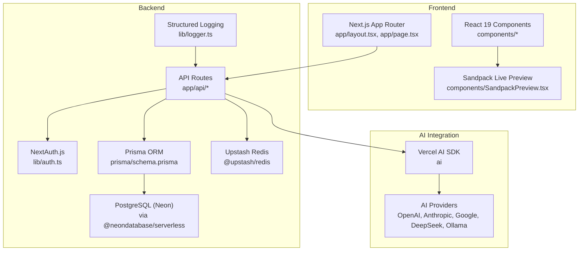
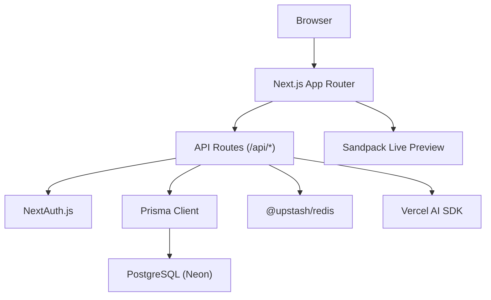
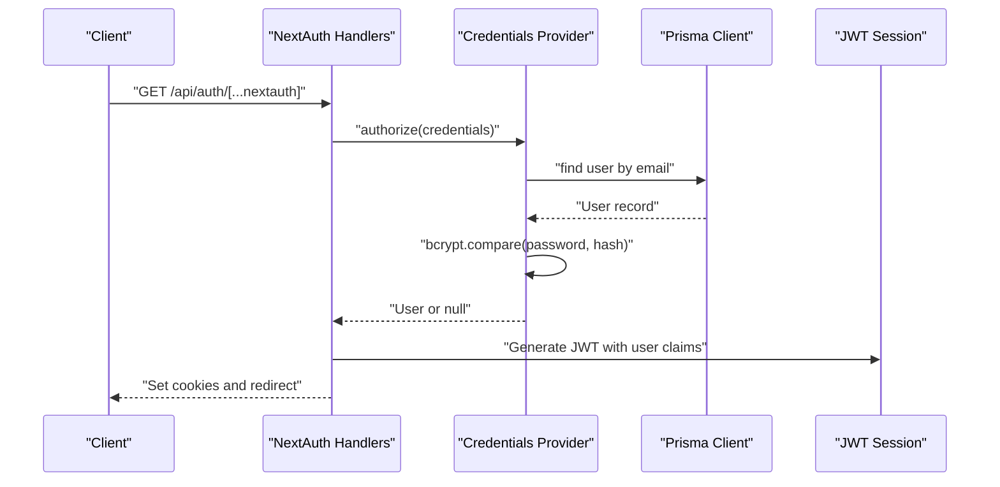
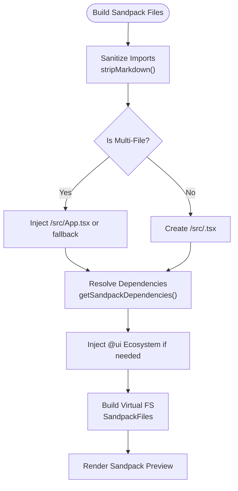
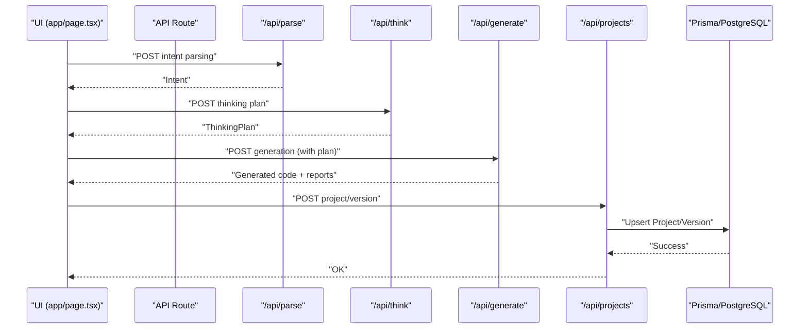
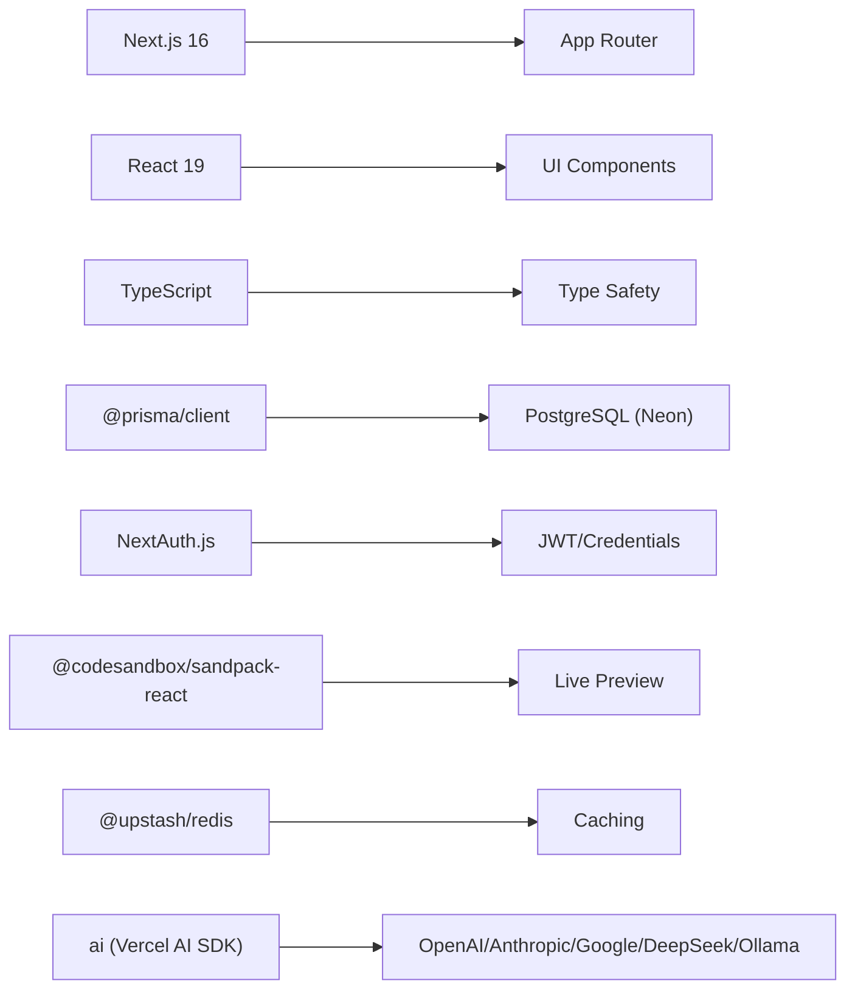

# Technology Stack

<cite>
**Referenced Files in This Document**
- [package.json](file://package.json)
- [next.config.ts](file://next.config.ts)
- [tsconfig.json](file://tsconfig.json)
- [prisma/schema.prisma](file://prisma/schema.prisma)
- [lib/prisma.ts](file://lib/prisma.ts)
- [lib/auth.ts](file://lib/auth.ts)
- [app/api/auth/[...nextauth]/route.ts](file://app/api/auth/[...nextauth]/route.ts)
- [components/SandpackPreview.tsx](file://components/SandpackPreview.tsx)
- [lib/sandbox/sandpackConfig.ts](file://lib/sandbox/sandpackConfig.ts)
- [vercel.json](file://vercel.json)
- [lib/logger.ts](file://lib/logger.ts)
- [app/layout.tsx](file://app/layout.tsx)
- [app/page.tsx](file://app/page.tsx)
</cite>

## Table of Contents
1. [Introduction](#introduction)
2. [Project Structure](#project-structure)
3. [Core Technologies](#core-technologies)
4. [Architecture Overview](#architecture-overview)
5. [Detailed Component Analysis](#detailed-component-analysis)
6. [Dependency Analysis](#dependency-analysis)
7. [Performance Considerations](#performance-considerations)
8. [Troubleshooting Guide](#troubleshooting-guide)
9. [Conclusion](#conclusion)

## Introduction
This document provides comprehensive technology stack documentation for the AI-powered accessibility-first UI engine. It covers the full-stack framework (Next.js App Router), component architecture (React 19), type safety (TypeScript), database abstraction (Prisma ORM), data persistence (PostgreSQL via Neon), AI integration (Vercel AI SDK), authentication (NextAuth.js), live preview (CodeSandbox Sandpack), caching (Upstash Redis), and support for multiple AI providers (OpenAI, Anthropic, Google, DeepSeek, Ollama). The document explains technology choices, version compatibility, and integration patterns used across the codebase.

## Project Structure
The project follows a modern Next.js 16 monorepo-like structure with a layered architecture:
- Application shell and routing powered by Next.js App Router
- UI components organized under components/ and reusable packages under packages/
- Full-stack API routes under app/api/
- Database schema and Prisma client under prisma/
- AI orchestration and live preview logic under lib/ and components/

**Diagram sources**
- [app/layout.tsx:34-56](file://app/layout.tsx#L34-L56)
- [app/page.tsx:48-521](file://app/page.tsx#L48-L521)
- [components/SandpackPreview.tsx:1-287](file://components/SandpackPreview.tsx#L1-L287)
- [lib/auth.ts:11-86](file://lib/auth.ts#L11-L86)
- [prisma/schema.prisma:1-222](file://prisma/schema.prisma#L1-L222)
- [lib/prisma.ts:1-70](file://lib/prisma.ts#L1-L70)
- [lib/logger.ts:23-88](file://lib/logger.ts#L23-L88)

**Section sources**
- [package.json:13-44](file://package.json#L13-L44)
- [next.config.ts:1-38](file://next.config.ts#L1-L38)
- [tsconfig.json:1-36](file://tsconfig.json#L1-L36)

## Core Technologies
This section documents the primary technologies and their roles in the system.

- Next.js 16 with App Router
  - Provides the full-stack web framework, file-system routing, server actions, and SSR/SSG capabilities.
  - Configuration includes standalone output, serverExternalPackages for Vercel, React compiler, and security headers.
  - Version compatibility: Next.js 16.2.1 aligns with TypeScript 5.x and React 19.x.

- React 19
  - Component architecture with concurrent features and React compiler enabled for performance improvements.
  - Used across UI components and live preview rendering.

- TypeScript
  - Strict type checking with ESNext target, bundler resolution, and path aliases for modular code organization.
  - Ensures type safety across API routes, Prisma models, and component props.

- Prisma ORM
  - Database abstraction with PostgreSQL provider and Neon serverless connectivity.
  - Includes multi-tenant workspace models, usage logging, feedback loops, and vector embeddings for similarity search.

- PostgreSQL (Neon)
  - Serverless Postgres hosting with Prisma client and custom reconnection logic for transient connection errors.
  - Vector embeddings supported via raw SQL with pgvector.

- Vercel AI SDK
  - AI orchestration and provider-agnostic integration enabling OpenAI, Anthropic, Google, DeepSeek, and Ollama.
  - Used in API routes for generation, classification, and vision tasks.

- NextAuth.js
  - Authentication with JWT strategy, credentials provider, and bcrypt-based password verification.
  - Integrates with Prisma adapter for account/session storage.

- CodeSandbox Sandpack
  - Live preview environment for generated React components with Vite and TypeScript.
  - Dynamically builds file trees, resolves imports, and injects UI ecosystem packages.

- Upstash Redis
  - Caching layer for performance optimization (e.g., rate limiting, session caching).
  - Integrated via @upstash/redis client.

- Supporting Libraries
  - ai, openai, @huggingface/inference, lucide-react, radix-ui, resend, zod, bcryptjs, and others for AI, UI, and utilities.

**Section sources**
- [package.json:13-44](file://package.json#L13-L44)
- [next.config.ts:3-35](file://next.config.ts#L3-L35)
- [tsconfig.json:2-24](file://tsconfig.json#L2-L24)
- [prisma/schema.prisma:5-9](file://prisma/schema.prisma#L5-L9)
- [lib/prisma.ts:1-70](file://lib/prisma.ts#L1-L70)
- [lib/auth.ts:11-86](file://lib/auth.ts#L11-L86)
- [components/SandpackPreview.tsx:1-287](file://components/SandpackPreview.tsx#L1-L287)
- [lib/sandbox/sandpackConfig.ts:112-401](file://lib/sandbox/sandpackConfig.ts#L112-L401)

## Architecture Overview
The system is a full-stack React application orchestrated by Next.js App Router. The frontend renders the AI generation pipeline and live preview, while backend API routes handle orchestration, persistence, and AI provider integrations. Prisma manages relational data and vector embeddings, and Redis provides caching. NextAuth.js secures the platform with JWT-based sessions.

**Diagram sources**
- [app/layout.tsx:34-56](file://app/layout.tsx#L34-L56)
- [app/page.tsx:166-310](file://app/page.tsx#L166-L310)
- [lib/auth.ts:11-86](file://lib/auth.ts#L11-L86)
- [lib/prisma.ts:1-70](file://lib/prisma.ts#L1-L70)
- [components/SandpackPreview.tsx:1-287](file://components/SandpackPreview.tsx#L1-L287)

## Detailed Component Analysis

### Next.js App Router and Build Configuration
- Standalone output reduces bundle size and improves cold start performance on Vercel.
- serverExternalPackages ensures Prisma client compatibility in serverless environments.
- React Compiler and cacheComponents enable performance optimizations.
- Security headers are applied globally for all routes.

**Section sources**
- [next.config.ts:3-35](file://next.config.ts#L3-L35)
- [vercel.json:1-19](file://vercel.json#L1-L19)

### TypeScript Configuration and Path Aliases
- Strict compilation with ESNext target and bundler resolution.
- Path aliases (@/* and @ui/*) streamline imports across the monorepo-like packages directory.
- Incremental builds and isolated modules improve developer experience.

**Section sources**
- [tsconfig.json:2-24](file://tsconfig.json#L2-L24)

### Prisma ORM and PostgreSQL (Neon)
- Datasource configured for PostgreSQL with DATABASE_URL and DIRECT_URL.
- Multi-tenant workspace models with memberships and settings.
- Usage logging, feedback loop, and vector embeddings for similarity search.
- Singleton Prisma client with automatic reconnection for transient Neon errors.

**Diagram sources**
- [prisma/schema.prisma:13-222](file://prisma/schema.prisma#L13-L222)

**Section sources**
- [prisma/schema.prisma:5-9](file://prisma/schema.prisma#L5-L9)
- [lib/prisma.ts:1-70](file://lib/prisma.ts#L1-L70)

### NextAuth.js Authentication
- JWT strategy with 7-day max age.
- Credentials provider using bcrypt for password verification.
- Pages configured for login and error handling.
- Integration with Prisma adapter for account/session persistence.

**Diagram sources**
- [lib/auth.ts:11-86](file://lib/auth.ts#L11-L86)
- [app/api/auth/[...nextauth]/route.ts](file://app/api/auth/[...nextauth]/route.ts#L1-L4)

**Section sources**
- [lib/auth.ts:11-86](file://lib/auth.ts#L11-L86)
- [app/api/auth/[...nextauth]/route.ts](file://app/api/auth/[...nextauth]/route.ts#L1-L4)

### Sandpack Live Preview Integration
- Builds a virtual file system for generated components and bootstraps them with Vite and React.
- Resolves relative imports, injects missing stubs, and supports multi-file apps.
- Provides error boundary, change observer, and screenshot observers for feedback and capture.

**Diagram sources**
- [lib/sandbox/sandpackConfig.ts:112-401](file://lib/sandbox/sandpackConfig.ts#L112-L401)
- [components/SandpackPreview.tsx:144-287](file://components/SandpackPreview.tsx#L144-L287)

**Section sources**
- [components/SandpackPreview.tsx:1-287](file://components/SandpackPreview.tsx#L1-L287)
- [lib/sandbox/sandpackConfig.ts:112-401](file://lib/sandbox/sandpackConfig.ts#L112-L401)

### AI Orchestration and Provider Integration
- Vercel AI SDK orchestrates generation, classification, and vision APIs.
- Provider-agnostic configuration allows switching between OpenAI, Anthropic, Google, DeepSeek, and Ollama.
- API routes coordinate intent parsing, manifest generation, chunked code assembly, validation, testing, and persistence.

**Diagram sources**
- [app/page.tsx:166-310](file://app/page.tsx#L166-L310)
- [prisma/schema.prisma:158-187](file://prisma/schema.prisma#L158-L187)

**Section sources**
- [app/page.tsx:166-310](file://app/page.tsx#L166-L310)

### Structured Logging
- Centralized logger with request-scoped IDs, timing, and structured JSON output.
- Supports info, warn, error, and debug levels with environment gating.

**Section sources**
- [lib/logger.ts:23-88](file://lib/logger.ts#L23-L88)

## Dependency Analysis
The project maintains clear separation of concerns with explicit dependencies:
- Frontend depends on Next.js, React 19, and UI packages.
- Backend depends on Next.js API routes, Prisma, Redis, and AI SDK.
- Authentication depends on NextAuth.js and Prisma adapter.
- Live preview depends on Sandpack and Vite configuration.

**Diagram sources**
- [package.json:13-44](file://package.json#L13-L44)
- [lib/auth.ts:11-86](file://lib/auth.ts#L11-L86)
- [lib/sandbox/sandpackConfig.ts:403-482](file://lib/sandbox/sandpackConfig.ts#L403-L482)

**Section sources**
- [package.json:13-44](file://package.json#L13-L44)

## Performance Considerations
- Next.js standalone output and serverExternalPackages optimize Vercel deployments.
- React Compiler and cacheComponents reduce runtime overhead.
- Prisma singleton with automatic reconnection mitigates transient Neon connection drops.
- Sandpack virtual file system avoids loading unnecessary packages until referenced.
- Structured logging enables observability and performance monitoring.

[No sources needed since this section provides general guidance]

## Troubleshooting Guide
- Authentication failures
  - Verify NEXTAUTH_SECRET or AUTH_SECRET is set and consistent.
  - Ensure OWNER_PASSWORD_HASH is properly formatted bcrypt hash.
  - Confirm trustHost is enabled for Vercel preview and production domains.

- Database connectivity
  - Check DATABASE_URL/DIRECT_URL for Neon.
  - Use withReconnect wrapper for transient connection errors.
  - Validate Prisma client initialization and global singleton pattern.

- Live preview issues
  - Confirm Sandpack files include required bootstrap files and Tailwind config.
  - Verify Vite aliases for @ui packages are injected when needed.
  - Use error boundary to surface preview crashes.

- Logging and debugging
  - Use logger.createRequestLogger to track endpoint performance and errors.
  - Enable debug logs in development for detailed insights.

**Section sources**
- [lib/auth.ts:11-86](file://lib/auth.ts#L11-L86)
- [lib/prisma.ts:54-70](file://lib/prisma.ts#L54-L70)
- [lib/sandbox/sandpackConfig.ts:345-401](file://lib/sandbox/sandpackConfig.ts#L345-L401)
- [lib/logger.ts:65-88](file://lib/logger.ts#L65-L88)

## Conclusion
The AI-powered accessibility-first UI engine leverages a modern, scalable stack centered on Next.js 16 App Router, React 19, and TypeScript. Prisma ORM with PostgreSQL (Neon) provides robust data persistence, while Vercel AI SDK integrates multiple AI providers seamlessly. NextAuth.js secures the platform, and CodeSandbox Sandpack delivers a powerful live preview experience. Upstash Redis enhances performance, and structured logging ensures operational visibility. Together, these technologies enable rapid iteration, reliable deployment, and a superior developer and user experience.