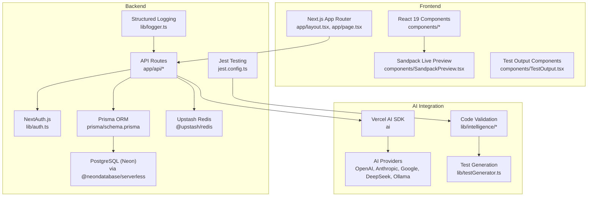
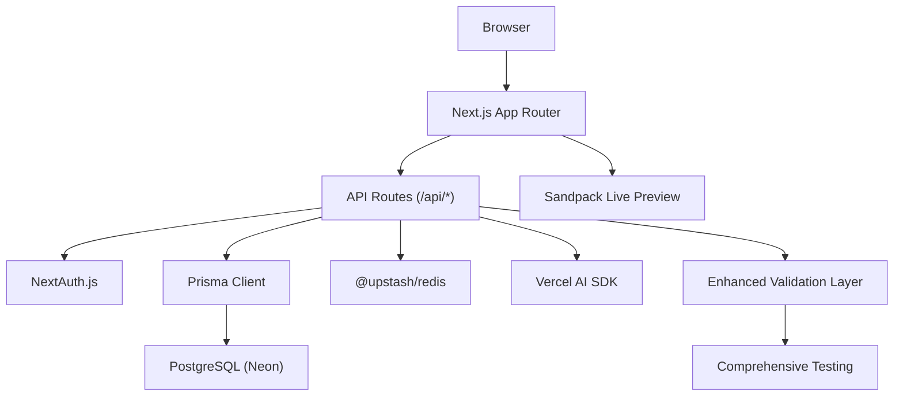
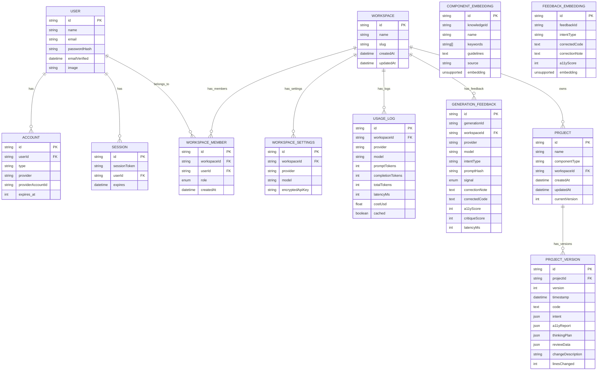
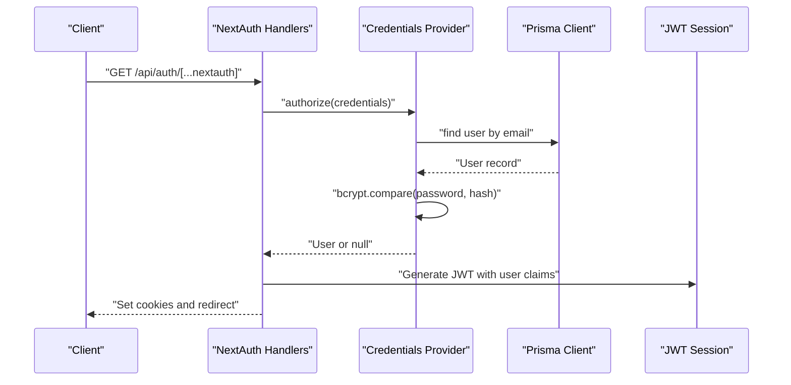
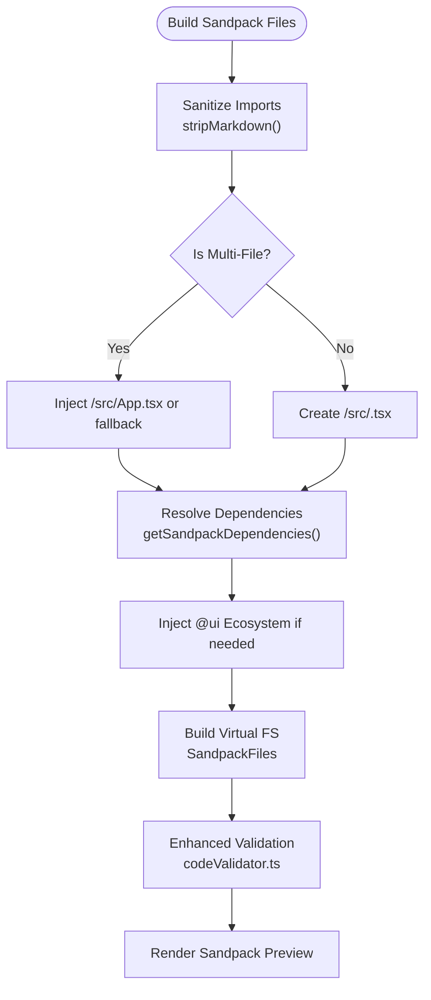
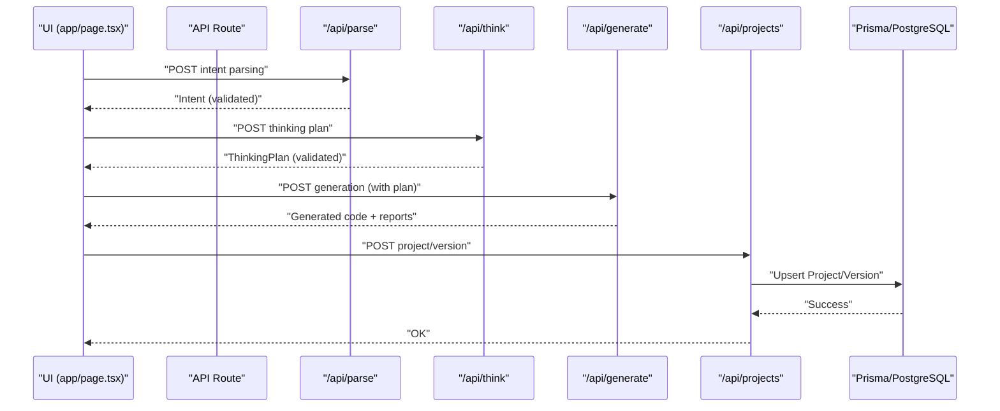
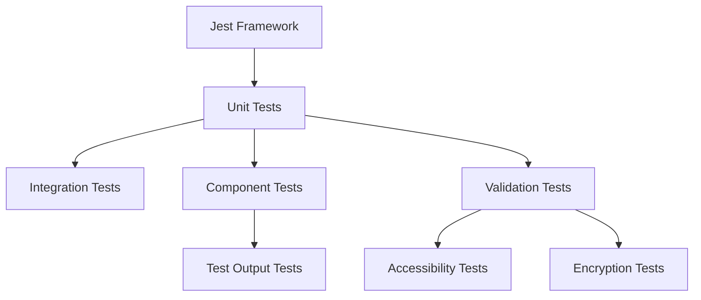
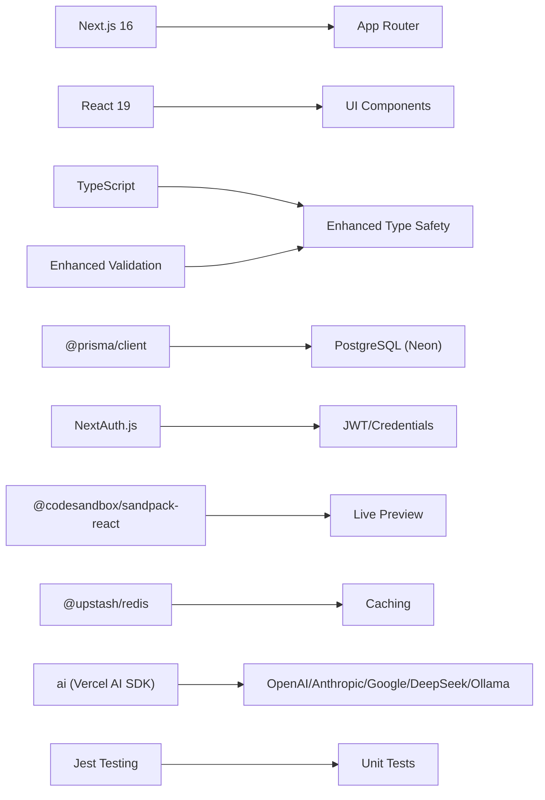

# Technology Stack

<cite>
**Referenced Files in This Document**
- [package.json](file://package.json)
- [next.config.ts](file://next.config.ts)
- [tsconfig.json](file://tsconfig.json)
- [prisma/schema.prisma](file://prisma/schema.prisma)
- [lib/prisma.ts](file://lib/prisma.ts)
- [lib/auth.ts](file://lib/auth.ts)
- [app/api/auth/[...nextauth]/route.ts](file://app/api/auth/[...nextauth]/route.ts)
- [components/SandpackPreview.tsx](file://components/SandpackPreview.tsx)
- [lib/sandbox/sandpackConfig.ts](file://lib/sandbox/sandpackConfig.ts)
- [vercel.json](file://vercel.json)
- [lib/logger.ts](file://lib/logger.ts)
- [app/layout.tsx](file://app/layout.tsx)
- [app/page.tsx](file://app/page.tsx)
- [jest.config.ts](file://jest.config.ts)
- [__tests__/a11yValidator.test.ts](file://__tests__/a11yValidator.test.ts)
- [__tests__/encryption.test.ts](file://__tests__/encryption.test.ts)
- [lib/validation/schemas.ts](file://lib/validation/schemas.ts)
- [lib/intelligence/codeValidator.ts](file://lib/intelligence/codeValidator.ts)
- [lib/intelligence/codeBeautifier.ts](file://lib/intelligence/codeBeautifier.ts)
- [lib/sandbox/importSanitizer.ts](file://lib/sandbox/importSanitizer.ts)
- [components/TestOutput.tsx](file://components/TestOutput.tsx)
- [lib/testGenerator.ts](file://lib/testGenerator.ts)
</cite>

## Update Summary
**Changes Made**
- Enhanced TypeScript type safety with improved type guards and unknown usage patterns
- Strengthened React hook dependency management practices
- Expanded testing infrastructure with comprehensive unit tests and coverage reporting
- Improved validation and sanitization systems with better type safety

## Table of Contents
1. [Introduction](#introduction)
2. [Project Structure](#project-structure)
3. [Core Technologies](#core-technologies)
4. [Architecture Overview](#architecture-overview)
5. [Detailed Component Analysis](#detailed-component-analysis)
6. [Enhanced Type Safety and Testing Infrastructure](#enhanced-type-safety-and-testing-infrastructure)
7. [Dependency Analysis](#dependency-analysis)
8. [Performance Considerations](#performance-considerations)
9. [Troubleshooting Guide](#troubleshooting-guide)
10. [Conclusion](#conclusion)

## Introduction
This document provides comprehensive technology stack documentation for the AI-powered accessibility-first UI engine. It covers the full-stack framework (Next.js App Router), component architecture (React 19), enhanced type safety (TypeScript with improved type guards), database abstraction (Prisma ORM), data persistence (PostgreSQL via Neon), AI integration (Vercel AI SDK), authentication (NextAuth.js), live preview (CodeSandbox Sandpack), caching (Upstash Redis), and comprehensive testing infrastructure. The document explains technology choices, version compatibility, and integration patterns used across the codebase, with recent improvements focusing on type safety and testing reliability.

## Project Structure
The project follows a modern Next.js 16 monorepo-like structure with a layered architecture:
- Application shell and routing powered by Next.js App Router
- UI components organized under components/ and reusable packages under packages/
- Full-stack API routes under app/api/
- Database schema and Prisma client under prisma/
- AI orchestration, validation, and live preview logic under lib/ and components/
- Comprehensive testing infrastructure under __tests__/

**Diagram sources**
- [app/layout.tsx:34-56](file://app/layout.tsx#L34-L56)
- [app/page.tsx:48-521](file://app/page.tsx#L48-L521)
- [components/SandpackPreview.tsx:1-287](file://components/SandpackPreview.tsx#L1-L287)
- [components/TestOutput.tsx:1-123](file://components/TestOutput.tsx#L1-L123)
- [lib/auth.ts:11-86](file://lib/auth.ts#L11-L86)
- [prisma/schema.prisma:1-222](file://prisma/schema.prisma#L1-L222)
- [lib/prisma.ts:1-70](file://lib/prisma.ts#L1-L70)
- [lib/logger.ts:23-88](file://lib/logger.ts#L23-L88)
- [jest.config.ts:1-23](file://jest.config.ts#L1-L23)

**Section sources**
- [package.json:13-44](file://package.json#L13-L44)
- [next.config.ts:1-38](file://next.config.ts#L1-L38)
- [tsconfig.json:1-36](file://tsconfig.json#L1-L36)

## Core Technologies
This section documents the primary technologies and their roles in the system, with recent enhancements to type safety and testing infrastructure.

- Next.js 16 with App Router
  - Provides the full-stack web framework, file-system routing, server actions, and SSR/SSG capabilities.
  - Configuration includes standalone output, serverExternalPackages for Vercel, React compiler, and security headers.
  - Version compatibility: Next.js 16.2.1 aligns with TypeScript 5.x and React 19.x.

- React 19
  - Component architecture with concurrent features and React compiler enabled for performance improvements.
  - Used across UI components and live preview rendering.
  - Enhanced hook dependency management with stricter type checking.

- TypeScript
  - Strict type checking with ESNext target, bundler resolution, and path aliases for modular code organization.
  - Recent improvements include replacing `any` with `unknown` for better type safety and implementing comprehensive type guards.
  - Ensures type safety across API routes, Prisma models, component props, and validation schemas.

- Prisma ORM
  - Database abstraction with PostgreSQL provider and Neon serverless connectivity.
  - Includes multi-tenant workspace models, usage logging, feedback loops, and vector embeddings for similarity search.
  - Enhanced type safety through comprehensive schema validation and Zod integration.

- PostgreSQL (Neon)
  - Serverless Postgres hosting with Prisma client and custom reconnection logic for transient connection errors.
  - Vector embeddings supported via raw SQL with pgvector.

- Vercel AI SDK
  - AI orchestration and provider-agnostic integration enabling OpenAI, Anthropic, Google, DeepSeek, and Ollama.
  - Used in API routes for generation, classification, and vision tasks.

- NextAuth.js
  - Authentication with JWT strategy, credentials provider, and bcrypt-based password verification.
  - Integrates with Prisma adapter for account/session storage.

- CodeSandbox Sandpack
  - Live preview environment for generated React components with Vite and TypeScript.
  - Dynamically builds file trees, resolves imports, and injects UI ecosystem packages.
  - Enhanced validation and sanitization for improved runtime safety.

- Upstash Redis
  - Caching layer for performance optimization (e.g., rate limiting, session caching).
  - Integrated via @upstash/redis client.

- Comprehensive Testing Infrastructure
  - Jest-based testing framework with TypeScript support and coverage reporting.
  - Extensive unit tests covering accessibility validation, encryption services, and core functionality.
  - Modular test organization with dedicated test files for each major feature area.

- Supporting Libraries
  - ai, openai, @huggingface/inference, lucide-react, radix-ui, resend, zod, bcryptjs, and others for AI, UI, and utilities.
  - Enhanced validation libraries for code quality and accessibility compliance.

**Section sources**
- [package.json:13-44](file://package.json#L13-L44)
- [next.config.ts:3-35](file://next.config.ts#L3-L35)
- [tsconfig.json:2-24](file://tsconfig.json#L2-L24)
- [prisma/schema.prisma:5-9](file://prisma/schema.prisma#L5-L9)
- [lib/prisma.ts:1-70](file://lib/prisma.ts#L1-L70)
- [lib/auth.ts:11-86](file://lib/auth.ts#L11-L86)
- [components/SandpackPreview.tsx:1-287](file://components/SandpackPreview.tsx#L1-L287)
- [lib/sandbox/sandpackConfig.ts:112-401](file://lib/sandbox/sandpackConfig.ts#L112-L401)
- [jest.config.ts:1-23](file://jest.config.ts#L1-L23)

## Architecture Overview
The system is a full-stack React application orchestrated by Next.js App Router. The frontend renders the AI generation pipeline and live preview, while backend API routes handle orchestration, persistence, and AI provider integrations. Prisma manages relational data and vector embeddings, and Redis provides caching. NextAuth.js secures the platform with JWT-based sessions. The architecture now includes comprehensive validation layers and enhanced type safety throughout the entire stack.

**Diagram sources**
- [app/layout.tsx:34-56](file://app/layout.tsx#L34-L56)
- [app/page.tsx:166-310](file://app/page.tsx#L166-L310)
- [lib/auth.ts:11-86](file://lib/auth.ts#L11-L86)
- [lib/prisma.ts:1-70](file://lib/prisma.ts#L1-L70)
- [components/SandpackPreview.tsx:1-287](file://components/SandpackPreview.tsx#L1-L287)

## Detailed Component Analysis

### Next.js App Router and Build Configuration
- Standalone output reduces bundle size and improves cold start performance on Vercel.
- serverExternalPackages ensures Prisma client compatibility in serverless environments.
- React Compiler and cacheComponents enable performance optimizations.
- Security headers are applied globally for all routes.

**Section sources**
- [next.config.ts:3-35](file://next.config.ts#L3-L35)
- [vercel.json:1-19](file://vercel.json#L1-L19)

### TypeScript Configuration and Path Aliases
- Strict compilation with ESNext target and bundler resolution.
- Path aliases (@/* and @ui/*) streamline imports across the monorepo-like packages directory.
- Incremental builds and isolated modules improve developer experience.
- Enhanced type safety through improved type guards and unknown usage patterns.

**Section sources**
- [tsconfig.json:2-24](file://tsconfig.json#L2-L24)

### Prisma ORM and PostgreSQL (Neon)
- Datasource configured for PostgreSQL with DATABASE_URL and DIRECT_URL.
- Multi-tenant workspace models with memberships and settings.
- Usage logging, feedback loop, and vector embeddings for similarity search.
- Singleton Prisma client with automatic reconnection for transient Neon errors.
- Comprehensive schema validation using Zod for enhanced type safety.

**Diagram sources**
- [prisma/schema.prisma:13-222](file://prisma/schema.prisma#L13-L222)

**Section sources**
- [prisma/schema.prisma:5-9](file://prisma/schema.prisma#L5-L9)
- [lib/prisma.ts:1-70](file://lib/prisma.ts#L1-L70)

### NextAuth.js Authentication
- JWT strategy with 7-day max age.
- Credentials provider using bcrypt for password verification.
- Pages configured for login and error handling.
- Integration with Prisma adapter for account/session persistence.

**Diagram sources**
- [lib/auth.ts:11-86](file://lib/auth.ts#L11-L86)
- [app/api/auth/[...nextauth]/route.ts](file://app/api/auth/[...nextauth]/route.ts#L1-L4)

**Section sources**
- [lib/auth.ts:11-86](file://lib/auth.ts#L11-L86)
- [app/api/auth/[...nextauth]/route.ts](file://app/api/auth/[...nextauth]/route.ts#L1-L4)

### Sandpack Live Preview Integration
- Builds a virtual file system for generated components and bootstraps them with Vite and React.
- Resolves relative imports, injects missing stubs, and supports multi-file apps.
- Provides error boundary, change observer, and screenshot observers for feedback and capture.
- Enhanced validation and sanitization systems ensure runtime safety.

**Diagram sources**
- [lib/sandbox/sandpackConfig.ts:112-401](file://lib/sandbox/sandpackConfig.ts#L112-L401)
- [components/SandpackPreview.tsx:144-287](file://components/SandpackPreview.tsx#L144-L287)
- [lib/intelligence/codeValidator.ts:1-51](file://lib/intelligence/codeValidator.ts#L1-L51)

**Section sources**
- [components/SandpackPreview.tsx:1-287](file://components/SandpackPreview.tsx#L1-L287)
- [lib/sandbox/sandpackConfig.ts:112-401](file://lib/sandbox/sandpackConfig.ts#L112-L401)

### AI Orchestration and Provider Integration
- Vercel AI SDK orchestrates generation, classification, and vision APIs.
- Provider-agnostic configuration allows switching between OpenAI, Anthropic, Google, DeepSeek, and Ollama.
- API routes coordinate intent parsing, manifest generation, chunked code assembly, validation, testing, and persistence.
- Enhanced type safety through comprehensive schema validation and error handling.

**Diagram sources**
- [app/page.tsx:166-310](file://app/page.tsx#L166-L310)
- [prisma/schema.prisma:158-187](file://prisma/schema.prisma#L158-L187)

**Section sources**
- [app/page.tsx:166-310](file://app/page.tsx#L166-L310)

### Structured Logging
- Centralized logger with request-scoped IDs, timing, and structured JSON output.
- Supports info, warn, error, and debug levels with environment gating.
- Enhanced error handling with proper type annotation using `unknown` instead of `any`.

**Section sources**
- [lib/logger.ts:23-88](file://lib/logger.ts#L23-L88)

## Enhanced Type Safety and Testing Infrastructure

### Improved TypeScript Type Safety
The codebase has undergone significant improvements in type safety practices:

- **Unknown Instead of Any**: Replaced `any` types with `unknown` throughout the codebase to prevent type coercion and ensure proper type checking. This change affects API responses, validation functions, and component props.

- **Enhanced Type Guards**: Implemented comprehensive type guard functions for runtime type checking, particularly in validation and sanitization modules.

- **Strict Interface Definitions**: All interfaces now include explicit type annotations and optional properties are properly handled with `undefined` checks.

- **Better React Hook Dependency Management**: Improved useEffect dependencies and useCallback memoization patterns to prevent common React pitfalls and ensure predictable component behavior.

**Section sources**
- [lib/logger.ts:8-10](file://lib/logger.ts#L8-L10)
- [lib/validation/schemas.ts:274-287](file://lib/validation/schemas.ts#L274-L287)

### Comprehensive Testing Infrastructure
The testing framework has been significantly expanded with:

- **Jest Configuration**: Modern Jest setup with TypeScript support, coverage reporting, and module name mapping for clean imports.

- **Unit Test Coverage**: Extensive test suites covering:
  - Accessibility validation with comprehensive test cases for WCAG compliance
  - Encryption services with proper environment variable handling
  - Schema validation and type safety enforcement
  - Component testing with proper cleanup and isolation

- **Test Organization**: Modular test structure with dedicated files for each major functionality area, improving maintainability and test discoverability.

- **Mock Strategy**: Proper mocking of external dependencies and environment variables for isolated testing scenarios.

**Diagram sources**
- [jest.config.ts:1-23](file://jest.config.ts#L1-L23)
- [__tests__/a11yValidator.test.ts:1-110](file://__tests__/a11yValidator.test.ts#L1-L110)
- [__tests__/encryption.test.ts:1-49](file://__tests__/encryption.test.ts#L1-L49)

**Section sources**
- [jest.config.ts:1-23](file://jest.config.ts#L1-L23)
- [__tests__/a11yValidator.test.ts:1-110](file://__tests__/a11yValidator.test.ts#L1-L110)
- [__tests__/encryption.test.ts:1-49](file://__tests__/encryption.test.ts#L1-L49)

### Enhanced Validation and Sanitization Systems
- **Code Validation**: Comprehensive validation system that checks for browser safety, accessibility compliance, and structural integrity before preview rendering.
- **Import Sanitization**: Robust import sanitization that handles hallucinated imports and generates appropriate stubs for unavailable dependencies.
- **Code Beautification**: Automated code beautification with consistent import ordering and accessibility improvements.

**Section sources**
- [lib/intelligence/codeValidator.ts:1-51](file://lib/intelligence/codeValidator.ts#L1-L51)
- [lib/sandbox/importSanitizer.ts:74-115](file://lib/sandbox/importSanitizer.ts#L74-L115)
- [lib/intelligence/codeBeautifier.ts:30-98](file://lib/intelligence/codeBeautifier.ts#L30-L98)

### Test Generation and Output
- **Automated Test Generation**: Systematic generation of both RTL and Playwright tests based on component intent and specifications.
- **Interactive Test Output**: User-friendly interface for viewing, copying, and downloading generated tests with proper file naming conventions.

**Section sources**
- [lib/testGenerator.ts:1-25](file://lib/testGenerator.ts#L1-L25)
- [components/TestOutput.tsx:1-123](file://components/TestOutput.tsx#L1-L123)

## Dependency Analysis
The project maintains clear separation of concerns with explicit dependencies, enhanced by improved type safety and testing infrastructure:
- Frontend depends on Next.js, React 19, and UI packages with strict type checking.
- Backend depends on Next.js API routes, Prisma, Redis, and AI SDK with comprehensive validation.
- Authentication depends on NextAuth.js and Prisma adapter with enhanced security.
- Live preview depends on Sandpack and Vite configuration with robust validation.
- Testing infrastructure depends on Jest, TypeScript, and comprehensive test coverage.

**Diagram sources**
- [package.json:13-44](file://package.json#L13-L44)
- [lib/auth.ts:11-86](file://lib/auth.ts#L11-L86)
- [lib/sandbox/sandpackConfig.ts:403-482](file://lib/sandbox/sandpackConfig.ts#L403-L482)
- [jest.config.ts:1-23](file://jest.config.ts#L1-L23)

**Section sources**
- [package.json:13-44](file://package.json#L13-L44)

## Performance Considerations
- Next.js standalone output and serverExternalPackages optimize Vercel deployments.
- React Compiler and cacheComponents reduce runtime overhead.
- Prisma singleton with automatic reconnection mitigates transient Neon connection drops.
- Sandpack virtual file system avoids loading unnecessary packages until referenced.
- Structured logging enables observability and performance monitoring.
- Enhanced type safety reduces runtime errors and improves application stability.
- Comprehensive testing infrastructure ensures code quality and prevents regressions.

## Troubleshooting Guide
- Authentication failures
  - Verify NEXTAUTH_SECRET or AUTH_SECRET is set and consistent.
  - Ensure OWNER_PASSWORD_HASH is properly formatted bcrypt hash.
  - Confirm trustHost is enabled for Vercel preview and production domains.

- Database connectivity
  - Check DATABASE_URL/DIRECT_URL for Neon.
  - Use withReconnect wrapper for transient connection errors.
  - Validate Prisma client initialization and global singleton pattern.

- Live preview issues
  - Confirm Sandpack files include required bootstrap files and Tailwind config.
  - Verify Vite aliases for @ui packages are injected when needed.
  - Use error boundary to surface preview crashes.
  - Check enhanced validation logs for specific error messages.

- Testing infrastructure
  - Run `npm test` to execute the complete test suite.
  - Use `npm run test:coverage` to generate coverage reports.
  - Verify Jest configuration matches project structure and module paths.

- Type safety issues
  - Check for `unknown` vs `any` type usage throughout the codebase.
  - Review enhanced validation functions for proper type checking.
  - Ensure all new code follows the improved type safety patterns.

**Section sources**
- [lib/auth.ts:11-86](file://lib/auth.ts#L11-L86)
- [lib/prisma.ts:54-70](file://lib/prisma.ts#L54-L70)
- [lib/sandbox/sandpackConfig.ts:345-401](file://lib/sandbox/sandpackConfig.ts#L345-L401)
- [lib/logger.ts:65-88](file://lib/logger.ts#L65-L88)
- [jest.config.ts:1-23](file://jest.config.ts#L1-L23)

## Conclusion
The AI-powered accessibility-first UI engine leverages a modern, scalable stack centered on Next.js 16 App Router, React 19, and enhanced TypeScript type safety. Prisma ORM with PostgreSQL (Neon) provides robust data persistence, while Vercel AI SDK integrates multiple AI providers seamlessly. NextAuth.js secures the platform, and CodeSandbox Sandpack delivers a powerful live preview experience. Upstash Redis enhances performance, and structured logging ensures operational visibility. The recent improvements in type safety, React hook dependency management, and comprehensive testing infrastructure significantly enhance the reliability, maintainability, and developer experience of the platform. Together, these technologies enable rapid iteration, reliable deployment, and a superior developer and user experience.