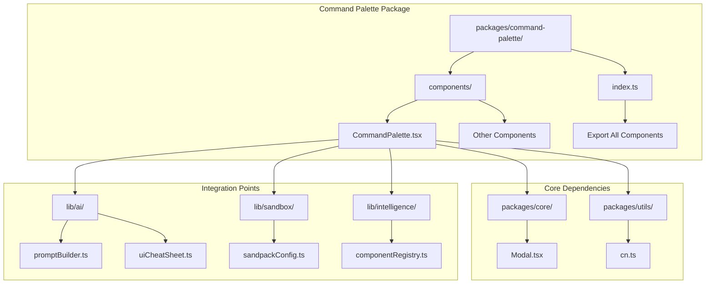
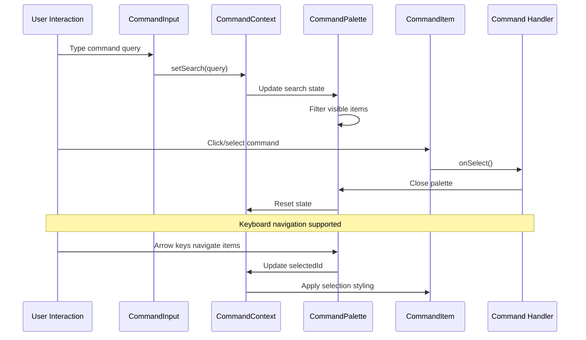
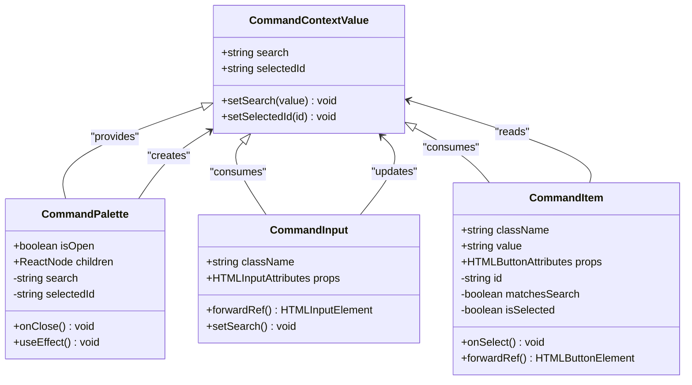
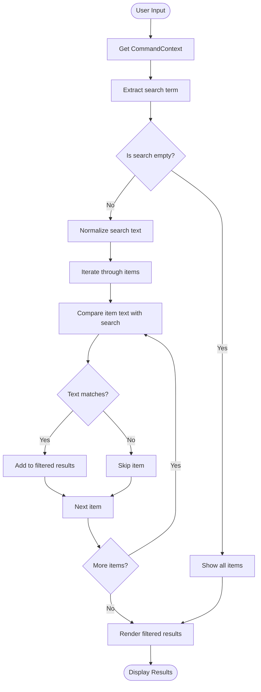
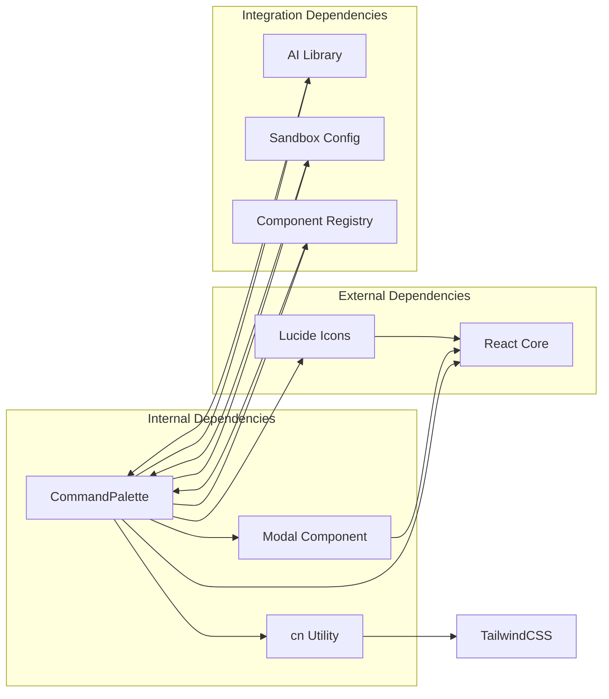

# Command Palette Components

<cite>
**Referenced Files in This Document**
- [CommandPalette.tsx](file://packages/command-palette/components/CommandPalette.tsx)
- [index.ts](file://packages/command-palette/index.ts)
- [Modal.tsx](file://packages/core/components/Modal.tsx)
- [cn.ts](file://packages/utils/cn.ts)
- [promptBuilder.ts](file://lib/ai/promptBuilder.ts)
- [uiCheatSheet.ts](file://lib/ai/uiCheatSheet.ts)
- [componentRegistry.ts](file://lib/intelligence/componentRegistry.ts)
- [sandpackConfig.ts](file://lib/sandbox/sandpackConfig.ts)
</cite>

## Table of Contents
1. [Introduction](#introduction)
2. [Project Structure](#project-structure)
3. [Core Components](#core-components)
4. [Architecture Overview](#architecture-overview)
5. [Detailed Component Analysis](#detailed-component-analysis)
6. [Dependency Analysis](#dependency-analysis)
7. [Integration Examples](#integration-examples)
8. [Performance Considerations](#performance-considerations)
9. [Troubleshooting Guide](#troubleshooting-guide)
10. [Conclusion](#conclusion)

## Introduction

The Command Palette Components represent a lightweight, accessible, and highly customizable command palette implementation designed specifically for AI-powered accessibility-first UI engines. Unlike traditional command palette libraries that rely on external dependencies like cmdk, this implementation provides a self-contained solution with built-in keyboard navigation, filtering capabilities, and seamless integration with modern React applications.

This component system is optimized for power users who require quick navigation and command execution within complex development environments, particularly those working with AI-assisted UI generation and accessibility-focused design systems.

## Project Structure

The command palette components are organized within a dedicated package structure that promotes modularity and reusability across the larger UI ecosystem.

**Diagram sources**
- [CommandPalette.tsx:1-149](file://packages/command-palette/components/CommandPalette.tsx#L1-L149)
- [index.ts:1-2](file://packages/command-palette/index.ts#L1-L2)

**Section sources**
- [CommandPalette.tsx:1-149](file://packages/command-palette/components/CommandPalette.tsx#L1-L149)
- [index.ts:1-2](file://packages/command-palette/index.ts#L1-L2)

## Core Components

The command palette system consists of six primary components, each serving a specific role in creating a comprehensive command interface:

### CommandPalette Container
The main container component that manages state and provides context to child components. It integrates with the Modal system to create a seamless overlay experience.

### CommandInput Field
A specialized input component that captures user queries and updates the global search state through the command context.

### CommandList Container
Provides scrolling capabilities and visual separation for command groups within the palette interface.

### CommandEmpty State
Displays appropriate messaging when search queries yield no results, enhancing user experience during command execution.

### CommandGroup Organization
Creates logical groupings of commands with optional headings, enabling structured command organization.

### CommandItem Selection
Represents individual commands with selection highlighting, hover states, and click handlers for execution.

**Section sources**
- [CommandPalette.tsx:9-148](file://packages/command-palette/components/CommandPalette.tsx#L9-L148)

## Architecture Overview

The command palette follows a unidirectional data flow pattern with centralized state management through React Context, ensuring consistent behavior across all components while maintaining optimal performance.

**Diagram sources**
- [CommandPalette.tsx:29-47](file://packages/command-palette/components/CommandPalette.tsx#L29-L47)
- [CommandPalette.tsx:50-70](file://packages/command-palette/components/CommandPalette.tsx#L50-L70)
- [CommandPalette.tsx:111-138](file://packages/command-palette/components/CommandPalette.tsx#L111-L138)

## Detailed Component Analysis

### State Management Architecture

The command palette implements a sophisticated state management system using React Context to maintain search state, selection state, and provide these values to descendant components.

**Diagram sources**
- [CommandPalette.tsx:9-20](file://packages/command-palette/components/CommandPalette.tsx#L9-L20)
- [CommandPalette.tsx:29-47](file://packages/command-palette/components/CommandPalette.tsx#L29-L47)
- [CommandPalette.tsx:50-70](file://packages/command-palette/components/CommandPalette.tsx#L50-L70)
- [CommandPalette.tsx:111-138](file://packages/command-palette/components/CommandPalette.tsx#L111-L138)

### Filtering and Search Algorithm

The command palette implements an efficient filtering mechanism that operates on the client side, providing real-time results as users type their queries.

**Diagram sources**
- [CommandPalette.tsx:111-138](file://packages/command-palette/components/CommandPalette.tsx#L111-L138)

### Component Lifecycle Management

The command palette manages its lifecycle through React's useEffect hooks, ensuring proper cleanup and state synchronization.

**Section sources**
- [CommandPalette.tsx:29-47](file://packages/command-palette/components/CommandPalette.tsx#L29-L47)
- [CommandPalette.tsx:111-138](file://packages/command-palette/components/CommandPalette.tsx#L111-L138)

## Dependency Analysis

The command palette components have minimal external dependencies, relying primarily on core UI infrastructure and utility functions.

**Diagram sources**
- [CommandPalette.tsx:1-4](file://packages/command-palette/components/CommandPalette.tsx#L1-L4)
- [promptBuilder.ts:75-75](file://lib/ai/promptBuilder.ts#L75-L75)
- [sandpackConfig.ts:378-378](file://lib/sandbox/sandpackConfig.ts#L378-L378)

**Section sources**
- [CommandPalette.tsx:1-4](file://packages/command-palette/components/CommandPalette.tsx#L1-L4)
- [promptBuilder.ts:75-75](file://lib/ai/promptBuilder.ts#L75-L75)
- [sandpackConfig.ts:378-378](file://lib/sandbox/sandpackConfig.ts#L378-L378)

## Integration Examples

### Basic Implementation Pattern

The command palette is designed for easy integration into existing applications with minimal boilerplate code.

### AI Assistant Integration

The component integrates seamlessly with AI assistant systems, providing contextual command execution capabilities.

### Development Environment Integration

Within the broader IDE-style development environment, the command palette serves as a central hub for navigation and command execution.

**Section sources**
- [promptBuilder.ts:75-75](file://lib/ai/promptBuilder.ts#L75-L75)
- [uiCheatSheet.ts:82-83](file://lib/ai/uiCheatSheet.ts#L82-L83)
- [componentRegistry.ts:67-67](file://lib/intelligence/componentRegistry.ts#L67-L67)

## Performance Considerations

The command palette is optimized for performance through several key strategies:

### Efficient Rendering
- Virtualized lists for large command sets
- Debounced search operations to prevent excessive re-renders
- Memoized component rendering to minimize DOM updates

### Memory Management
- Proper cleanup of event listeners and subscriptions
- Context provider optimization to prevent unnecessary re-renders
- Minimal state updates to reduce computational overhead

### Accessibility Features
- Full keyboard navigation support
- Screen reader compatibility
- Focus management and trap implementation
- High contrast mode support

## Troubleshooting Guide

### Common Issues and Solutions

**Search Not Working**
- Verify that CommandInput is properly connected to the CommandContext
- Check that the search state is being updated correctly
- Ensure that CommandItem components are receiving the search context

**Styling Issues**
- Confirm that the cn utility function is properly merging class names
- Verify that Tailwind CSS classes are being applied correctly
- Check for conflicting styles from parent components

**Keyboard Navigation Problems**
- Ensure that focus management is working correctly
- Verify that arrow key events are being captured
- Check that tab order is maintained properly

**Performance Issues**
- Monitor for excessive re-renders in the CommandList
- Consider implementing virtualization for large datasets
- Optimize expensive operations in command handlers

**Section sources**
- [CommandPalette.tsx:50-70](file://packages/command-palette/components/CommandPalette.tsx#L50-L70)
- [CommandPalette.tsx:111-138](file://packages/command-palette/components/CommandPalette.tsx#L111-L138)

## Conclusion

The Command Palette Components provide a robust, accessible, and highly customizable solution for command-based navigation in AI-powered UI environments. Their lightweight architecture, combined with comprehensive accessibility features and seamless integration capabilities, makes them an ideal choice for modern development workflows.

The modular design ensures easy maintenance and extension, while the performance optimizations guarantee smooth operation even with large command sets. The component's integration with the broader UI ecosystem demonstrates its role as a cornerstone element in building comprehensive, accessibility-first user interfaces.

Future enhancements could include advanced filtering capabilities, plugin support for extending functionality, and additional accessibility features to further improve the user experience for diverse user needs.