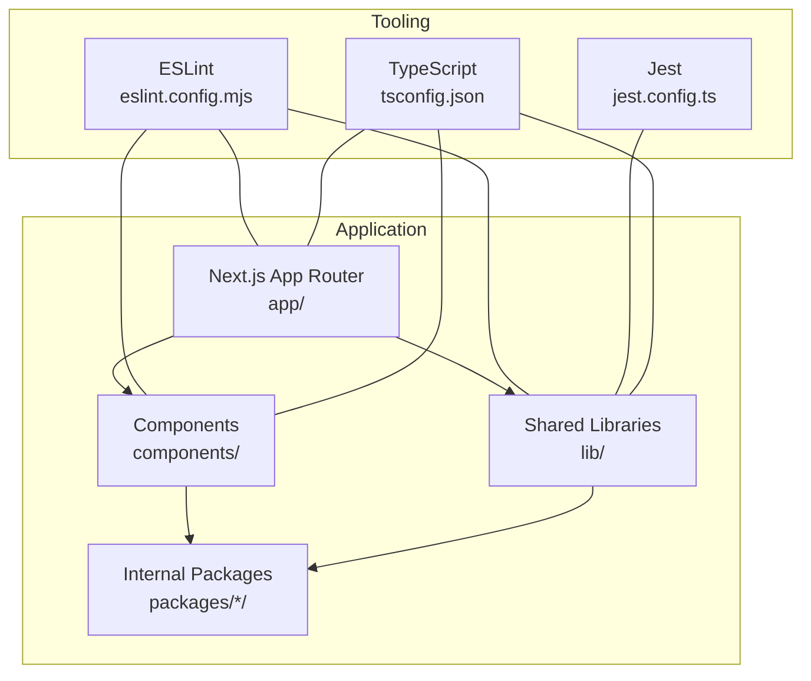
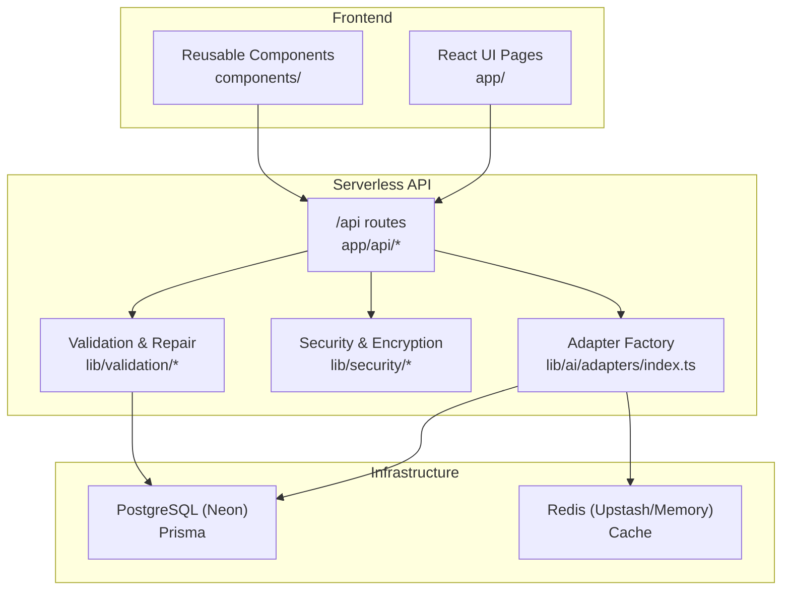
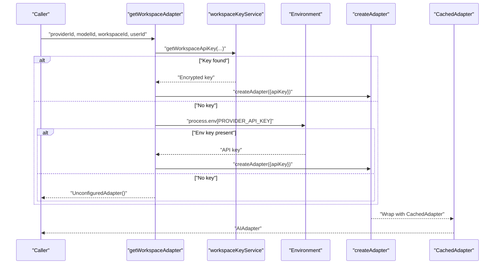
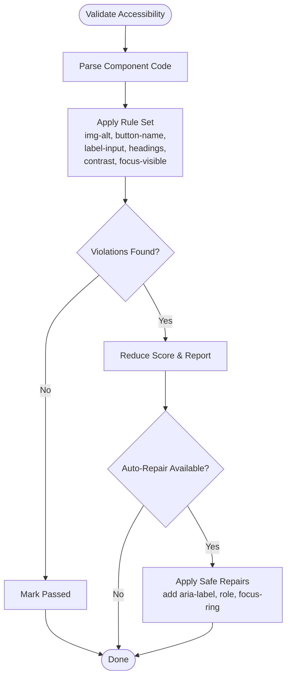
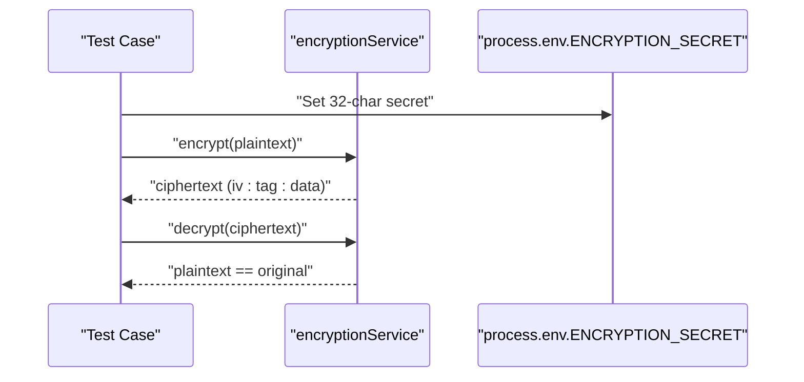
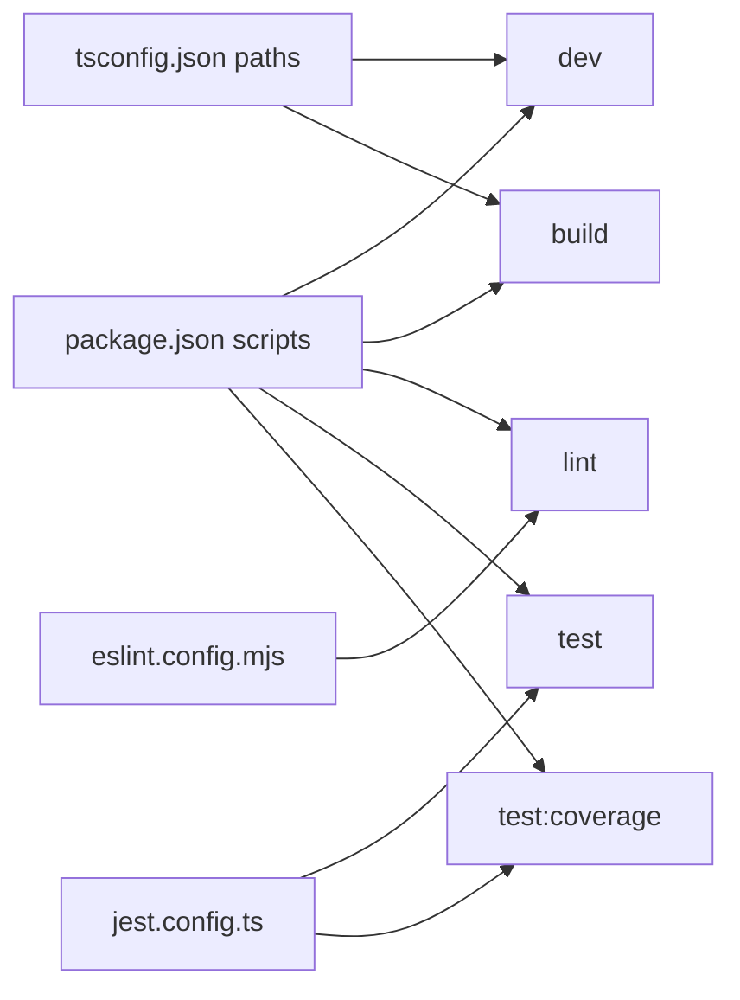

# Contributing & Development

<cite>
**Referenced Files in This Document**
- [README.md](file://README.md)
- [package.json](file://package.json)
- [eslint.config.mjs](file://eslint.config.mjs)
- [jest.config.ts](file://jest.config.ts)
- [tsconfig.json](file://tsconfig.json)
- [docs/ENV_SETUP.md](file://docs/ENV_SETUP.md)
- [docs/ARCHITECTURE.md](file://docs/ARCHITECTURE.md)
- [lib/ai/adapters/index.ts](file://lib/ai/adapters/index.ts)
- [__tests__/adapters.test.ts](file://__tests__/adapters.test.ts)
- [__tests__/encryption.test.ts](file://__tests__/encryption.test.ts)
- [__tests__/a11yValidator.test.ts](file://__tests__/a11yValidator.test.ts)
</cite>

## Table of Contents
1. [Introduction](#introduction)
2. [Project Structure](#project-structure)
3. [Core Components](#core-components)
4. [Architecture Overview](#architecture-overview)
5. [Detailed Component Analysis](#detailed-component-analysis)
6. [Dependency Analysis](#dependency-analysis)
7. [Performance Considerations](#performance-considerations)
8. [Troubleshooting Guide](#troubleshooting-guide)
9. [Conclusion](#conclusion)
10. [Appendices](#appendices)

## Introduction
This document provides comprehensive contributing and development guidelines for the AI-powered accessibility-first UI engine. It covers code style and conventions, pull request and code review standards, development workflow (branching, issue tracking, feature cycles), component and adapter development, validation extension, environment setup, debugging, local testing, internal package system, and continuous integration expectations. The goal is to enable contributors to build high-quality, maintainable features while preserving the system’s reliability, security, and accessibility guarantees.

## Project Structure
The repository is a Next.js 16 application with a monorepo-style internal package system under packages/. The frontend UI is located under app/, reusable UI components under components/, shared libraries under lib/, and internal packages under packages/. Testing is centralized under __tests__/, with Jest configuration in jest.config.ts. Linting is configured via ESLint in eslint.config.mjs, and TypeScript is configured in tsconfig.json.

**Diagram sources**
- [tsconfig.json:1-36](file://tsconfig.json#L1-L36)
- [jest.config.ts:1-23](file://jest.config.ts#L1-L23)
- [eslint.config.mjs:1-19](file://eslint.config.mjs#L1-L19)

**Section sources**
- [README.md:1-37](file://README.md#L1-L37)
- [tsconfig.json:1-36](file://tsconfig.json#L1-L36)
- [jest.config.ts:1-23](file://jest.config.ts#L1-L23)
- [eslint.config.mjs:1-19](file://eslint.config.mjs#L1-L19)

## Core Components
- AI Adapter Factory and Registry: Centralized adapter selection and credential resolution with caching and metrics. See [lib/ai/adapters/index.ts](file://lib/ai/adapters/index.ts).
- Validation and Accessibility: Accessibility scanning and auto-repair utilities. See [__tests__/a11yValidator.test.ts](file://__tests__/a11yValidator.test.ts).
- Security: Encryption service tests demonstrate secure handling of secrets. See [__tests__/encryption.test.ts](file://__tests__/encryption.test.ts).
- Testing Coverage: Jest configuration targets specific library modules for coverage collection. See [jest.config.ts:14-19](file://jest.config.ts#L14-L19).

**Section sources**
- [lib/ai/adapters/index.ts:1-306](file://lib/ai/adapters/index.ts#L1-L306)
- [__tests__/a11yValidator.test.ts:1-110](file://__tests__/a11yValidator.test.ts#L1-L110)
- [__tests__/encryption.test.ts:1-49](file://__tests__/encryption.test.ts#L1-L49)
- [jest.config.ts:14-19](file://jest.config.ts#L14-L19)

## Architecture Overview
The system is a serverless-first Next.js application with a multi-agent AI pipeline, strict validation, and a resilient adapter layer supporting multiple providers and local inference. The adapter factory resolves credentials securely and caches results for performance.

**Diagram sources**
- [docs/ARCHITECTURE.md:10-46](file://docs/ARCHITECTURE.md#L10-L46)
- [lib/ai/adapters/index.ts:140-278](file://lib/ai/adapters/index.ts#L140-L278)

**Section sources**
- [docs/ARCHITECTURE.md:1-82](file://docs/ARCHITECTURE.md#L1-L82)
- [lib/ai/adapters/index.ts:1-306](file://lib/ai/adapters/index.ts#L1-L306)

## Detailed Component Analysis

### AI Adapter Factory and Credential Resolution
The adapter factory enforces secure credential resolution and provider selection. It supports explicit provider configuration, environment fallbacks, and graceful unconfigured behavior on serverless platforms. It also wraps adapters with caching and metrics.

**Diagram sources**
- [lib/ai/adapters/index.ts:236-278](file://lib/ai/adapters/index.ts#L236-L278)
- [lib/ai/adapters/index.ts:146-215](file://lib/ai/adapters/index.ts#L146-L215)

**Section sources**
- [lib/ai/adapters/index.ts:1-306](file://lib/ai/adapters/index.ts#L1-L306)

### Accessibility Validation and Auto-Repair
Accessibility validation detects common WCAG issues and can auto-repair certain patterns. Tests assert detection and repair behavior for images, buttons, labels, headings, color contrast, keyboard focus, and alert roles.

**Diagram sources**
- [__tests__/a11yValidator.test.ts:1-110](file://__tests__/a11yValidator.test.ts#L1-L110)

**Section sources**
- [__tests__/a11yValidator.test.ts:1-110](file://__tests__/a11yValidator.test.ts#L1-L110)

### Security: Encryption Service
Encryption tests validate AES-256-GCM encryption and decryption with proper IV handling and empty-string behavior.

**Diagram sources**
- [__tests__/encryption.test.ts:1-49](file://__tests__/encryption.test.ts#L1-L49)

**Section sources**
- [__tests__/encryption.test.ts:1-49](file://__tests__/encryption.test.ts#L1-L49)

## Dependency Analysis
- Build and Dev Scripts: The project defines dev, build, start, lint, test, and test:coverage scripts. See [package.json:5-11](file://package.json#L5-L11).
- Linting: ESLint configuration extends Next.js recommended configs and overrides default ignores. See [eslint.config.mjs:1-19](file://eslint.config.mjs#L1-L19).
- Testing: Jest configuration sets node environment, module name mapping, and coverage collection for specific library paths. See [jest.config.ts:8-19](file://jest.config.ts#L8-L19).
- TypeScript Paths: Path aliases @/* and @ui/* are defined for root and packages respectively. See [tsconfig.json:21-24](file://tsconfig.json#L21-L24).

**Diagram sources**
- [package.json:5-11](file://package.json#L5-L11)
- [eslint.config.mjs:1-19](file://eslint.config.mjs#L1-L19)
- [jest.config.ts:8-19](file://jest.config.ts#L8-L19)
- [tsconfig.json:21-24](file://tsconfig.json#L21-L24)

**Section sources**
- [package.json:1-68](file://package.json#L1-L68)
- [eslint.config.mjs:1-19](file://eslint.config.mjs#L1-L19)
- [jest.config.ts:1-23](file://jest.config.ts#L1-L23)
- [tsconfig.json:1-36](file://tsconfig.json#L1-L36)

## Performance Considerations
- Caching: Adapters are wrapped with a cache layer to reuse identical generations and reduce latency and token usage. See [lib/ai/adapters/index.ts:82-138](file://lib/ai/adapters/index.ts#L82-L138).
- Metrics: Each adapter invocation emits metrics for usage, latency, and cache hits. See [lib/ai/adapters/index.ts:80-138](file://lib/ai/adapters/index.ts#L80-L138).
- Streaming: Streaming adapters yield chunks progressively, enabling responsive UI updates. See [__tests__/adapters.test.ts:81-90](file://__tests__/adapters.test.ts#L81-L90).

**Section sources**
- [lib/ai/adapters/index.ts:82-138](file://lib/ai/adapters/index.ts#L82-L138)
- [__tests__/adapters.test.ts:81-90](file://__tests__/adapters.test.ts#L81-L90)

## Troubleshooting Guide
- Environment Variables: Ensure DATABASE_URL, DIRECT_URL, UPSTASH_REDIS_* and ENCRYPTION_SECRET are configured for local development. See [docs/ENV_SETUP.md:1-89](file://docs/ENV_SETUP.md#L1-L89).
- Prisma Migrations: Apply migrations locally and verify with Prisma Studio. See [docs/ENV_SETUP.md:75-81](file://docs/ENV_SETUP.md#L75-L81).
- Adapter Configuration Errors: If a provider key is missing, the adapter factory throws a clear error or returns an unconfigured adapter. See [lib/ai/adapters/index.ts:274-278](file://lib/ai/adapters/index.ts#L28-L40, file://lib/ai/adapters/index.ts#L274-L278).
- Testing Failures: Confirm Jest module name mapping and coverage paths match your changes. See [jest.config.ts:11-19](file://jest.config.ts#L11-L19).

**Section sources**
- [docs/ENV_SETUP.md:1-89](file://docs/ENV_SETUP.md#L1-L89)
- [lib/ai/adapters/index.ts:28-40](file://lib/ai/adapters/index.ts#L28-L40)
- [lib/ai/adapters/index.ts:274-278](file://lib/ai/adapters/index.ts#L274-L278)
- [jest.config.ts:11-19](file://jest.config.ts#L11-L19)

## Conclusion
This guide consolidates the development workflow, code style, testing, and contribution practices for the AI-powered accessibility-first UI engine. By following these guidelines—secure credential handling, strict validation, consistent linting, and robust testing—you can confidently extend the system with new UI components, AI adapters, and validation rules while maintaining performance and reliability.

## Appendices

### A. Development Workflow and Branching
- Issue Tracking: Use repository issues to track feature requests, bugs, and improvements.
- Feature Branches: Create topic branches from the default branch for features and fixes.
- Commit Messages: Keep messages concise and descriptive; reference related issues.
- Pull Requests: Open PRs early for visibility; ensure tests pass and code is reviewed.
- Code Review Standards: Focus on correctness, accessibility, security, performance, and maintainability. Require at least one approving review before merging.

### B. Code Style and Conventions
- Formatting: Rely on ESLint for style enforcement; run the linter locally before committing. See [eslint.config.mjs:1-19](file://eslint.config.mjs#L1-L19).
- TypeScript: Strict mode enabled; use path aliases (@/*, @ui/*) consistently. See [tsconfig.json:21-24](file://tsconfig.json#L21-L24).
- Imports: Prefer absolute imports using @/ for root and @ui/ for packages. See [tsconfig.json:21-24](file://tsconfig.json#L21-L24).

### C. Component Development Guidelines
- New UI Components:
  - Place reusable components under components/.
  - Export a single default component per file.
  - Follow accessibility rules enforced by the validator.
  - Add tests under __tests__ when behavior warrants it.
- Internal @ui Packages:
  - Create a new folder under packages/<name>.
  - Add an index.ts exporting the public API.
  - Use @ui/<name> alias for imports; ensure tsconfig paths are respected. See [tsconfig.json:23-24](file://tsconfig.json#L23-L24).

### D. Creating New AI Adapters
- Adapter Contract: Implement the AIAdapter interface and ensure generate() and stream() semantics are correct. See [lib/ai/adapters/index.ts:1-306](file://lib/ai/adapters/index.ts#L1-L306).
- Credential Resolution: Do not accept client-provided keys; resolve via workspaceKeyService or environment variables. See [lib/ai/adapters/index.ts:242-278](file://lib/ai/adapters/index.ts#L242-L278).
- Testing: Add tests verifying generation, streaming, and provider-specific endpoints. See [__tests__/adapters.test.ts:1-109](file://__tests__/adapters.test.ts#L1-L109).

### E. Extending Validation Rules
- Add new rules in the validation layer and update tests to cover detection and repair scenarios. See [__tests__/a11yValidator.test.ts:1-110](file://__tests__/a11yValidator.test.ts#L1-L110).
- Ensure repairs are conservative and preserve component semantics.

### F. Environment Setup and Local Testing
- Local Variables: Copy and populate .env.local with database, cache, encryption, and AI provider keys. See [docs/ENV_SETUP.md:1-89](file://docs/ENV_SETUP.md#L1-L89).
- Prisma: Apply migrations and verify with Prisma Studio. See [docs/ENV_SETUP.md:75-81](file://docs/ENV_SETUP.md#L75-L81).
- Running Locally: Use the dev script to start the Next.js server. See [README.md:5-15](file://README.md#L5-L15).
- Testing: Run tests with Jest and coverage reporting. See [package.json:10-11](file://package.json#L10-L11).

### G. Continuous Integration Expectations
- Linting: CI should run ESLint and block commits that introduce lint failures.
- Testing: CI should enforce Jest coverage thresholds for targeted modules (e.g., security, adapters, validation). See [jest.config.ts:14-19](file://jest.config.ts#L14-L19).
- Build: CI should execute the build script to validate Prisma generation, migrations, and Next.js compilation. See [package.json](file://package.json#L7).