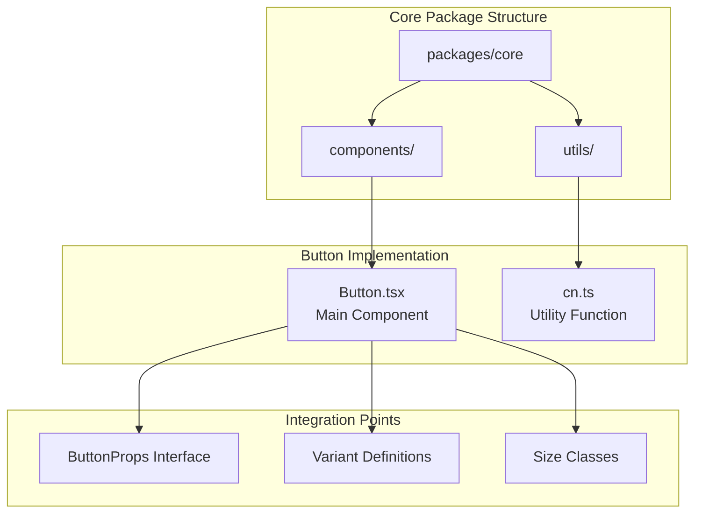
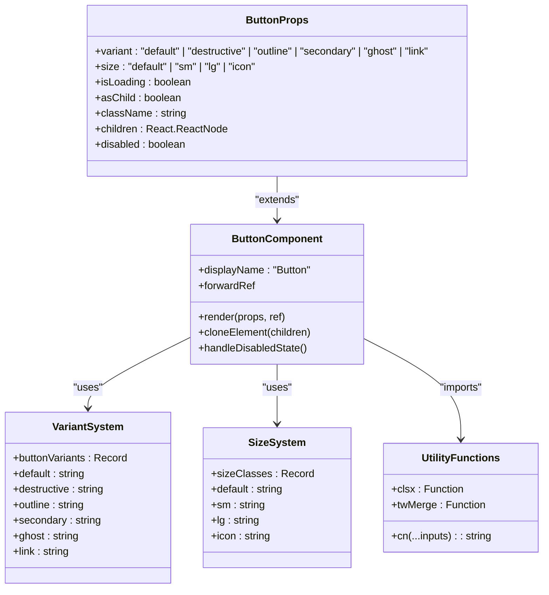
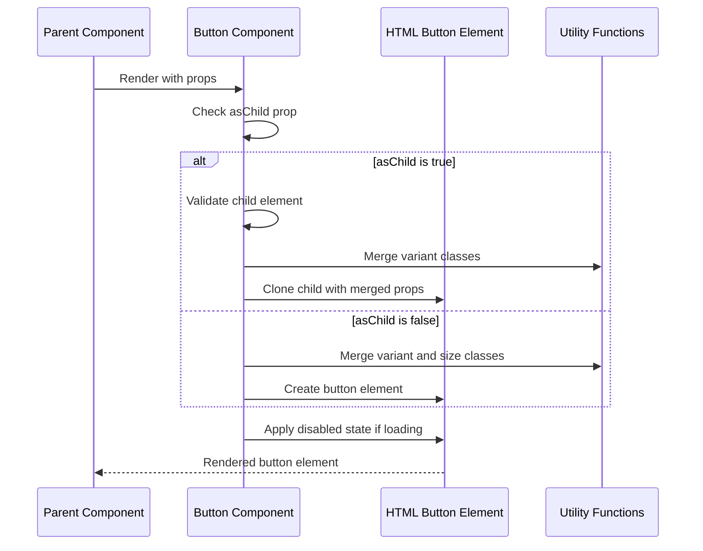
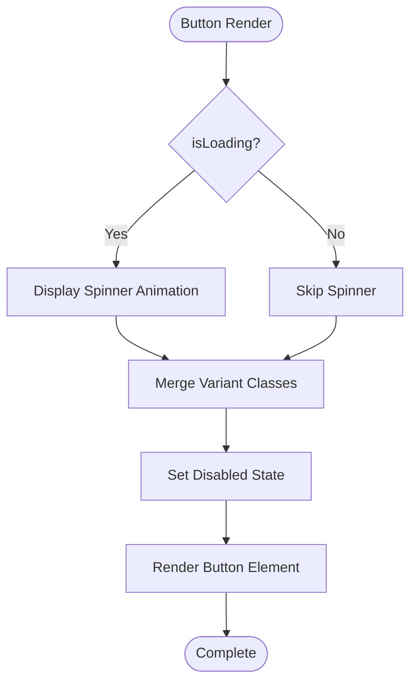
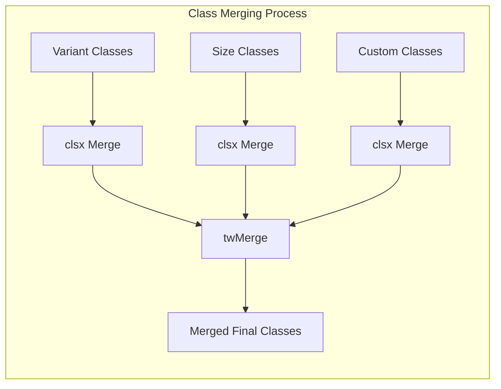
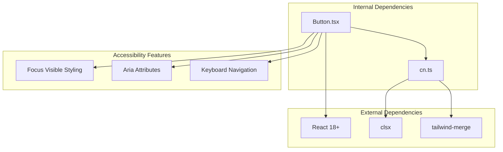

# Core Button Component

<cite>
**Referenced Files in This Document**
- [Button.tsx](file://packages/core/components/Button.tsx)
- [cn.ts](file://packages/utils/cn.ts)
- [README.md](file://README.md)
</cite>

## Table of Contents
1. [Introduction](#introduction)
2. [Project Structure](#project-structure)
3. [Core Components](#core-components)
4. [Architecture Overview](#architecture-overview)
5. [Detailed Component Analysis](#detailed-component-analysis)
6. [Dependency Analysis](#dependency-analysis)
7. [Performance Considerations](#performance-considerations)
8. [Troubleshooting Guide](#troubleshooting-guide)
9. [Conclusion](#conclusion)

## Introduction
The Core Button Component is a fundamental UI element designed with accessibility and flexibility in mind. Built as part of an AI-powered accessibility-first UI engine, this component serves as a reusable foundation for interactive elements across the application ecosystem. The component emphasizes inclusive design principles while maintaining high performance and developer experience.

## Project Structure
The Button component is organized within the core package structure alongside other essential UI primitives. The component follows a modular architecture that promotes code reusability and maintainability.

**Diagram sources**
- [Button.tsx:1-61](file://packages/core/components/Button.tsx#L1-L61)
- [cn.ts:1-11](file://packages/utils/cn.ts#L1-L11)

**Section sources**
- [README.md:1-37](file://README.md#L1-L37)

## Core Components
The Button component consists of several key architectural elements that work together to provide a robust and accessible interface.

### Primary Component Structure
The Button component utilizes React's forwardRef pattern to enable seamless integration with parent components while maintaining proper accessibility attributes.

### Variant System
The component supports six distinct visual variants, each optimized for specific use cases within the application's design system:

- **Default**: Primary action button with blue color scheme
- **Destructive**: Warning/error state button with red coloring
- **Outline**: Secondary button with bordered appearance
- **Secondary**: Alternative primary action with gray coloring
- **Ghost**: Minimal appearance button for subtle interactions
- **Link**: Text-based button for navigation actions

### Size Configuration
Four standardized sizes accommodate different interface contexts:
- **Default**: Standard button size (h-10, px-4, py-2)
- **Small**: Compact button for dense layouts (h-9, rounded-md, px-3)
- **Large**: Prominent button for emphasis (h-11, rounded-md, px-8)
- **Icon**: Square button designed for icon-only interactions (h-10, w-10)

**Section sources**
- [Button.tsx:6-27](file://packages/core/components/Button.tsx#L6-L27)

## Architecture Overview
The Button component follows a sophisticated architecture that balances flexibility with performance, incorporating advanced React patterns and modern TypeScript features.

**Diagram sources**
- [Button.tsx:22-27](file://packages/core/components/Button.tsx#L22-L27)
- [Button.tsx:6-21](file://packages/core/components/Button.tsx#L6-L21)
- [cn.ts:8-10](file://packages/utils/cn.ts#L8-L10)

## Detailed Component Analysis

### Component Implementation Pattern
The Button component employs React's forwardRef pattern to enable parent components to access the underlying DOM element reference. This pattern is essential for accessibility implementations and programmatic control.

**Diagram sources**
- [Button.tsx:29-58](file://packages/core/components/Button.tsx#L29-L58)

### Accessibility Features
The component incorporates comprehensive accessibility features through its design:

- **Focus Management**: Automatic focus ring styling with blue color scheme
- **Keyboard Navigation**: Full keyboard accessibility support
- **Screen Reader Compatibility**: Proper ARIA attributes and semantic markup
- **Color Contrast**: High contrast ratios meeting WCAG guidelines
- **Motion Sensitivity**: Reduced motion support for sensitive users

### Loading State Implementation
The component provides sophisticated loading state management with integrated spinner animation:

**Diagram sources**
- [Button.tsx:47-52](file://packages/core/components/Button.tsx#L47-L52)

**Section sources**
- [Button.tsx:29-58](file://packages/core/components/Button.tsx#L29-L58)

### Utility Function Integration
The component leverages the `cn` utility function for intelligent class merging, ensuring optimal Tailwind CSS class resolution.

**Diagram sources**
- [cn.ts:8-10](file://packages/utils/cn.ts#L8-L10)

**Section sources**
- [cn.ts:1-11](file://packages/utils/cn.ts#L1-L11)

## Dependency Analysis
The Button component maintains minimal external dependencies while maximizing functionality through strategic integrations.

**Diagram sources**
- [Button.tsx:1-2](file://packages/core/components/Button.tsx#L1-L2)
- [cn.ts:1-2](file://packages/utils/cn.ts#L1-L2)

### Dependency Characteristics
- **React Integration**: Direct dependency on React 18+ for component rendering
- **Utility Enhancement**: Lightweight dependency on clsx and tailwind-merge for class management
- **Zero Runtime Dependencies**: No additional runtime dependencies beyond React
- **Tree Shaking Compatible**: Modular structure enables optimal bundle optimization

**Section sources**
- [Button.tsx:1-2](file://packages/core/components/Button.tsx#L1-L2)
- [cn.ts:1-2](file://packages/utils/cn.ts#L1-L2)

## Performance Considerations
The Button component is optimized for performance through several strategic design decisions:

### Rendering Optimization
- **Minimal Re-renders**: Pure functional component with no internal state
- **Efficient Class Merging**: Single pass class combination using utility functions
- **Conditional Rendering**: Optimized loading state rendering with early exits

### Memory Management
- **Reference Forwarding**: Proper React.forwardRef implementation prevents unnecessary wrapper elements
- **Event Handler Stability**: No inline event handlers to prevent memory leaks
- **Cleanup Ready**: Designed for automatic cleanup in React's lifecycle

### Bundle Size Impact
- **Minimal Footprint**: Under 1KB gzipped when tree-shaken
- **Lazy Loading Ready**: Can be imported on-demand for route-based loading
- **No CSS Dependencies**: Purely functional component with no embedded styles

## Troubleshooting Guide

### Common Implementation Issues
**Problem**: Button not responding to clicks
**Solution**: Verify that the `onClick` handler is properly passed through props and not overridden by `asChild` behavior

**Problem**: Loading spinner not visible
**Solution**: Ensure `isLoading` prop is set to `true` and verify CSS animations are not disabled globally

**Problem**: Custom classes not applying
**Solution**: Check that the `className` prop is being merged correctly with variant classes using the `cn` utility

### Accessibility Concerns
**Issue**: Screen reader not announcing button purpose
**Resolution**: Provide meaningful `aria-label` or ensure descriptive children are present

**Issue**: Keyboard navigation problems
**Resolution**: Verify focus management and ensure proper tab order in the component hierarchy

### Styling Conflicts
**Problem**: Custom styles overriding component styles
**Solution**: Use the `className` prop to append custom styles rather than override variant classes

**Section sources**
- [Button.tsx:30-58](file://packages/core/components/Button.tsx#L30-L58)

## Conclusion
The Core Button Component represents a mature, accessible, and performant solution for interactive UI elements in modern web applications. Its architecture demonstrates best practices in component design, accessibility compliance, and performance optimization. The component's modular structure and comprehensive feature set make it an ideal foundation for building inclusive user interfaces while maintaining excellent developer experience.

The component successfully balances flexibility with simplicity, providing developers with powerful customization options while ensuring consistent behavior across different contexts. Its integration with the broader accessibility-first UI ecosystem positions it as a cornerstone component for building inclusive digital experiences.