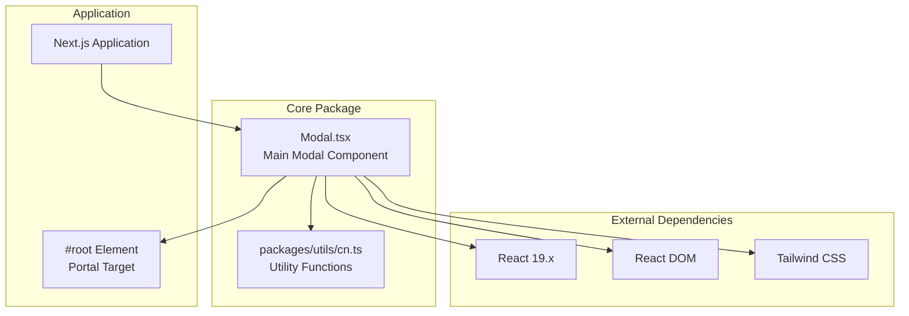
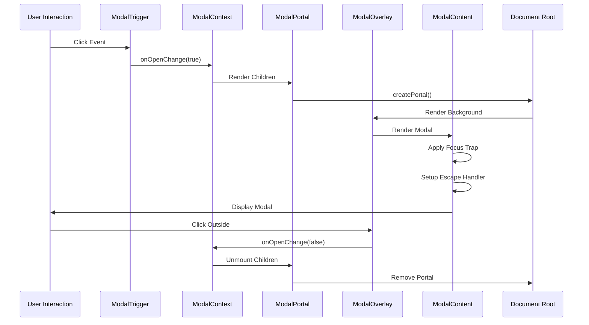
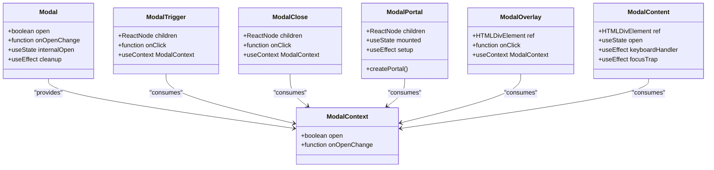
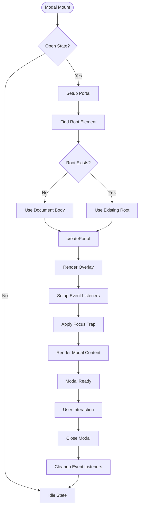
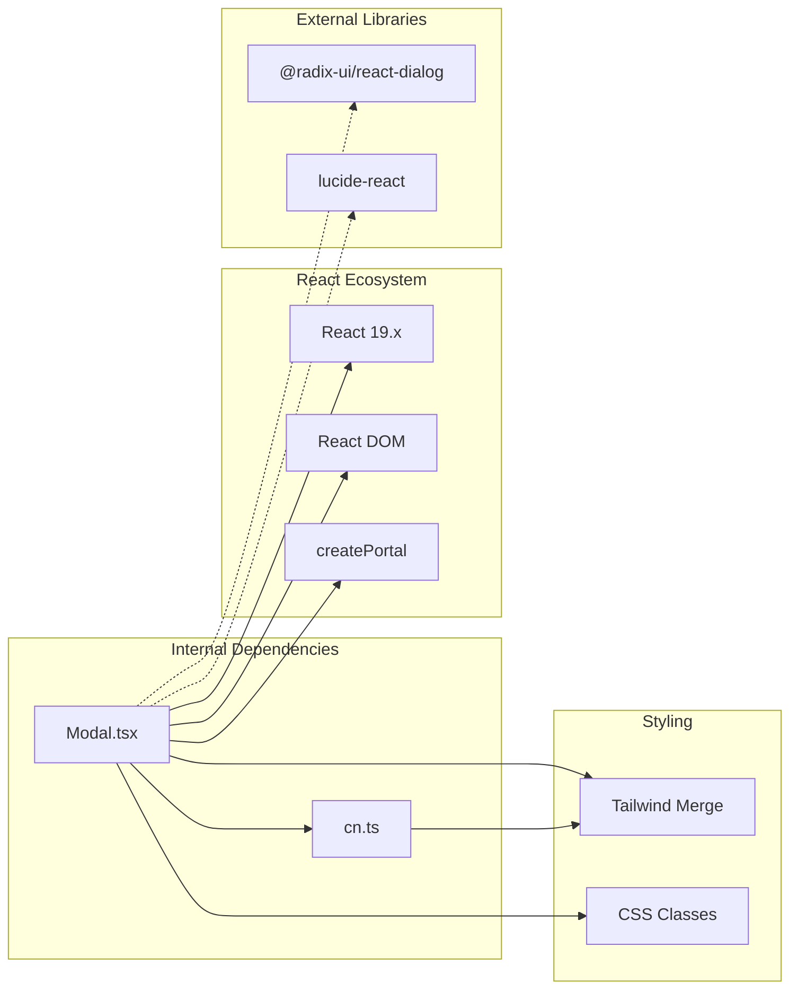

# Core Modal Component

<cite>
**Referenced Files in This Document**
- [Modal.tsx](file://packages/core/components/Modal.tsx)
- [cn.ts](file://packages/utils/cn.ts)
- [package.json](file://package.json)
</cite>

## Table of Contents
1. [Introduction](#introduction)
2. [Project Structure](#project-structure)
3. [Core Components](#core-components)
4. [Architecture Overview](#architecture-overview)
5. [Detailed Component Analysis](#detailed-component-analysis)
6. [Dependency Analysis](#dependency-analysis)
7. [Performance Considerations](#performance-considerations)
8. [Troubleshooting Guide](#troubleshooting-guide)
9. [Conclusion](#conclusion)

## Introduction
The Core Modal Component is a lightweight, accessible modal implementation built specifically for Next.js applications. Unlike traditional modal solutions that rely on external dependencies like Radix UI, this implementation leverages native HTML `<dialog>` semantics combined with React portals to create a robust, accessible modal system. The component follows modern React patterns including context-based state management, composition over inheritance, and proper accessibility attributes.

## Project Structure
The modal component is part of the core package ecosystem within the AI-powered accessibility-first UI engine. It utilizes shared utility functions and follows the established package structure conventions.

**Diagram sources**
- [Modal.tsx](file://packages/core/components/Modal.tsx)
- [cn.ts](file://packages/utils/cn.ts)

**Section sources**
- [Modal.tsx](file://packages/core/components/Modal.tsx)
- [package.json](file://package.json)

## Core Components
The modal system consists of nine distinct components that work together to create a complete modal solution:

### Modal Provider
The root component that manages the modal's open/close state and provides context to child components. It supports both controlled and uncontrolled modes through props and internal state management.

### ModalTrigger and ModalClose
Interactive elements that control modal visibility. The trigger opens the modal while the close button closes it, both leveraging the shared context for state management.

### ModalOverlay and ModalContent
Visual and functional foundation layers. The overlay handles background dimming and click-outside-to-close functionality, while the content container manages positioning, animations, and accessibility attributes.

### ModalPortal
Creates a React portal that renders modal content outside the normal component hierarchy, ensuring proper stacking context and avoiding layout conflicts.

### Structural Components
Additional components (header, footer, title, description) provide semantic structure and proper content organization within the modal interface.

**Section sources**
- [Modal.tsx](file://packages/core/components/Modal.tsx)

## Architecture Overview
The modal architecture implements a sophisticated composition pattern that separates concerns while maintaining accessibility and performance.

**Diagram sources**
- [Modal.tsx](file://packages/core/components/Modal.tsx)

The architecture emphasizes several key principles:
- **Separation of Concerns**: Each component has a single responsibility
- **Accessibility First**: Proper ARIA attributes and keyboard navigation
- **Performance Optimized**: Minimal re-renders and efficient DOM manipulation
- **Composition Friendly**: Flexible building blocks for various use cases

## Detailed Component Analysis

### State Management Architecture
The modal implements a dual-state management system that supports both controlled and uncontrolled usage patterns.

**Diagram sources**
- [Modal.tsx](file://packages/core/components/Modal.tsx)

### Accessibility Implementation
The modal system implements comprehensive accessibility features following WCAG guidelines:

#### Keyboard Navigation
- Escape key support for closing modals
- Focus trapping to prevent tab navigation outside the modal
- Proper focus restoration when modal closes

#### Screen Reader Support
- ARIA dialog roles and attributes
- Modal-specific labeling and descriptions
- Semantic HTML structure

#### Focus Management
- Automatic focus on modal content when opened
- Focus return to triggering element when closed
- Proper focus order within modal content

**Section sources**
- [Modal.tsx](file://packages/core/components/Modal.tsx)

### Rendering Pipeline
The modal rendering process involves multiple stages to ensure proper DOM placement and lifecycle management.

**Diagram sources**
- [Modal.tsx](file://packages/core/components/Modal.tsx)

**Section sources**
- [Modal.tsx](file://packages/core/components/Modal.tsx)

## Dependency Analysis
The modal component maintains minimal external dependencies while leveraging essential React capabilities.

**Diagram sources**
- [Modal.tsx](file://packages/core/components/Modal.tsx)
- [cn.ts](file://packages/utils/cn.ts)
- [package.json](file://package.json)

### External Dependencies Impact
The modal intentionally avoids heavy dependencies like Radix UI to maintain:
- **Bundle Size**: Reduced JavaScript payload
- **Flexibility**: Custom styling and behavior options
- **Performance**: Faster initial load times
- **Maintainability**: Fewer external breaking changes

**Section sources**
- [Modal.tsx](file://packages/core/components/Modal.tsx)
- [package.json](file://package.json)

## Performance Considerations
The modal implementation incorporates several performance optimizations:

### Efficient State Updates
- Context-based updates minimize unnecessary re-renders
- Controlled/uncontrolled mode detection prevents extra state calculations
- Cleanup functions properly remove event listeners

### Memory Management
- Proper event listener cleanup prevents memory leaks
- Conditional rendering prevents unused DOM nodes
- Portal cleanup ensures proper DOM tree maintenance

### Bundle Optimization
- Tree-shaking friendly component structure
- Minimal external dependencies
- Utility functions optimized for reuse

## Troubleshooting Guide

### Common Issues and Solutions

#### Modal Not Closing on Escape Key
**Symptoms**: Escape key press has no effect
**Causes**: 
- Event listener not attached properly
- Modal not in open state
- Parent component preventing event propagation

**Solutions**:
- Verify modal is mounted and open
- Check for event handler conflicts
- Ensure proper context usage

#### Focus Trap Not Working
**Symptoms**: Tab navigation escapes modal boundaries
**Causes**:
- Focus management disabled
- Dynamic content changes
- Custom focus handlers interfering

**Solutions**:
- Verify focus trap initialization
- Check for custom focus management
- Ensure proper focus restoration

#### Portal Rendering Issues
**Symptoms**: Modal content appears in unexpected locations
**Causes**:
- Root element not found
- Portal target conflicts
- SSR hydration mismatches

**Solutions**:
- Verify "#root" element exists
- Check portal target configuration
- Review SSR setup

**Section sources**
- [Modal.tsx](file://packages/core/components/Modal.tsx)

## Conclusion
The Core Modal Component represents a sophisticated implementation of accessible, performant modal dialogs for Next.js applications. By combining native HTML semantics with React's advanced features, it provides a flexible, lightweight alternative to heavier modal solutions. The component's architecture prioritizes accessibility, performance, and developer experience while maintaining compatibility with modern React patterns.

Key strengths include:
- **Accessibility Compliance**: Full WCAG support with proper ARIA attributes
- **Performance Optimized**: Minimal overhead and efficient rendering
- **Flexible Design**: Composable components for various use cases
- **Modern Patterns**: Context-based state management and React best practices

The implementation serves as an excellent foundation for building accessible user interfaces while maintaining the flexibility needed for complex applications.