# Data Access Patterns & Performance

<cite>
**Referenced Files in This Document**
- [prisma.ts](file://lib/prisma.ts)
- [schema.prisma](file://prisma/schema.prisma)
- [20260407120000_add_project_model/migration.sql](file://prisma/migrations/20260407120000_add_project_model/migration.sql)
- [20260409100000_add_vector_embeddings/migration.sql](file://prisma/migrations/20260409100000_add_vector_embeddings/migration.sql)
- [20260410113000_add_thinking_review_metadata_to_project_version/migration.sql](file://prisma/migrations/20260410113000_add_thinking_review_metadata_to_project_version/migration.sql)
- [projectStore.ts](file://lib/projects/projectStore.ts)
- [memory.ts](file://lib/ai/memory.ts)
- [feedbackStore.ts](file://lib/ai/feedbackStore.ts)
- [vectorStore.ts](file://lib/ai/vectorStore.ts)
- [route.ts (history)](file://app/api/history/route.ts)
- [route.ts (projects)](file://app/api/projects/route.ts)
- [route.ts (workspaces)](file://app/api/workspaces/route.ts)
- [route.ts (workspace/settings)](file://app/api/workspace/settings/route.ts)
- [route.ts (feedback)](file://app/api/feedback/route.ts)
- [workspaceKeyService.ts](file://lib/security/workspaceKeyService.ts)
- [RightPanel.tsx](file://components/ide/RightPanel.tsx)
- [simpleCache.ts](file://lib/utils/simpleCache.ts)
- [componentGenerator.ts](file://lib/ai/componentGenerator.ts)
- [cache.ts](file://lib/ai/cache.ts)
- [requestDeduplicator.ts](file://lib/utils/requestDeduplicator.ts)
- [route.ts (generate)](file://app/api/generate/route.ts)
</cite>

## Update Summary
**Changes Made**
- Added new caching infrastructure with specialized cache instances (blueprintCache, semanticContextCache, promptCache)
- Integrated TTL management for improved data access performance
- Enhanced component generation with request deduplication
- Expanded caching strategies beyond workspace settings and feedback analytics

## Table of Contents
1. [Introduction](#introduction)
2. [Project Structure](#project-structure)
3. [Core Components](#core-components)
4. [Architecture Overview](#architecture-overview)
5. [Detailed Component Analysis](#detailed-component-analysis)
6. [Dependency Analysis](#dependency-analysis)
7. [Performance Considerations](#performance-considerations)
8. [Troubleshooting Guide](#troubleshooting-guide)
9. [Conclusion](#conclusion)
10. [Appendices](#appendices)

## Introduction
This document explains the data access patterns, query optimization, and performance strategies across the database layer. It covers Prisma client initialization and connection pooling configuration, common query patterns (workspace-scoped queries, project versioning, feedback aggregation), caching strategies for workspace settings and user permissions, and techniques for query batching, lazy loading, and index utilization. It also documents the separation of business logic from database operations, provides examples of efficient query patterns for generation history, project management, and workspace analytics, and outlines connection management, transaction handling, error recovery, and monitoring approaches.

**Updated** Added comprehensive caching infrastructure with specialized cache instances and TTL management for improved data access performance.

## Project Structure
The data access layer is organized around:
- A singleton Prisma client with automatic reconnection for serverless environments
- Strongly typed Prisma models for multi-tenant workspaces, projects, versions, usage logs, feedback, and embeddings
- API routes that enforce workspace scoping and return optimized payloads
- Domain stores that encapsulate business logic and translate between DB rows and domain types
- Caching for frequently accessed data (workspace settings, feedback stats, blueprint selection, semantic context)
- Request deduplication to prevent duplicate API calls

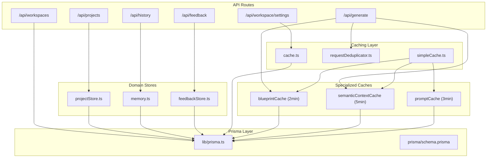

**Diagram sources**
- [prisma.ts:1-70](file://lib/prisma.ts#L1-L70)
- [schema.prisma:1-222](file://prisma/schema.prisma#L1-L222)
- [projectStore.ts:1-290](file://lib/projects/projectStore.ts#L1-L290)
- [memory.ts:1-211](file://lib/ai/memory.ts#L1-L211)
- [feedbackStore.ts:1-356](file://lib/ai/feedbackStore.ts#L1-L356)
- [vectorStore.ts:166-249](file://lib/ai/vectorStore.ts#L166-L249)
- [route.ts (history):1-60](file://app/api/history/route.ts#L1-L60)
- [route.ts (projects):1-92](file://app/api/projects/route.ts#L1-L92)
- [route.ts (workspaces):1-52](file://app/api/workspaces/route.ts#L1-L52)
- [route.ts (workspace/settings):1-147](file://app/api/workspace/settings/route.ts#L1-L147)
- [route.ts (feedback):1-85](file://app/api/feedback/route.ts#L1-L85)
- [simpleCache.ts:72-76](file://lib/utils/simpleCache.ts#L72-L76)
- [componentGenerator.ts:33-34](file://lib/ai/componentGenerator.ts#L33-L34)
- [requestDeduplicator.ts:63-68](file://lib/utils/requestDeduplicator.ts#L63-L68)
- [cache.ts:108-113](file://lib/ai/cache.ts#L108-L113)

**Section sources**
- [prisma.ts:1-70](file://lib/prisma.ts#L1-L70)
- [schema.prisma:1-222](file://prisma/schema.prisma#L1-L222)
- [simpleCache.ts:1-76](file://lib/utils/simpleCache.ts#L1-L76)
- [requestDeduplicator.ts:1-68](file://lib/utils/requestDeduplicator.ts#L1-L68)

## Core Components
- Prisma singleton and automatic reconnection for transient Neon errors
- Workspace-scoped queries via membership checks and workspaceId filters
- Project versioning with upsert and roll-forward semantics
- Feedback aggregation with dual-write (cache + DB) and quality gating
- Vector similarity search with IVFFlat indexes for pgvector
- Lightweight history API returning summaries without heavy payloads
- **New** Specialized caching infrastructure with TTL management for blueprint selection, semantic context, and prompt building
- **New** Request deduplication to prevent duplicate API calls during concurrent requests
- **New** Multi-tier caching strategy combining in-memory and Redis-based storage

**Section sources**
- [prisma.ts:20-70](file://lib/prisma.ts#L20-L70)
- [route.ts (workspaces):7-29](file://app/api/workspaces/route.ts#L7-L29)
- [projectStore.ts:162-208](file://lib/projects/projectStore.ts#L162-L208)
- [feedbackStore.ts:211-276](file://lib/ai/feedbackStore.ts#L211-L276)
- [vectorStore.ts:166-249](file://lib/ai/vectorStore.ts#L166-L249)
- [route.ts (history):20-54](file://app/api/history/route.ts#L20-L54)
- [simpleCache.ts:1-76](file://lib/utils/simpleCache.ts#L1-L76)
- [requestDeduplicator.ts:1-68](file://lib/utils/requestDeduplicator.ts#L1-L68)
- [cache.ts:59-101](file://lib/ai/cache.ts#L59-L101)

## Architecture Overview
The data access layer separates concerns:
- API routes: enforce auth, scope by workspace, and return optimized shapes
- Domain stores: encapsulate business logic and transform DB rows to domain types
- Prisma: ORM client with singleton pattern and automatic reconnection
- Caching: in-memory TTL cache for workspace keys, specialized caches for blueprint selection and semantic context, Redis for feedback stats
- Request deduplication: prevents duplicate API calls for concurrent requests

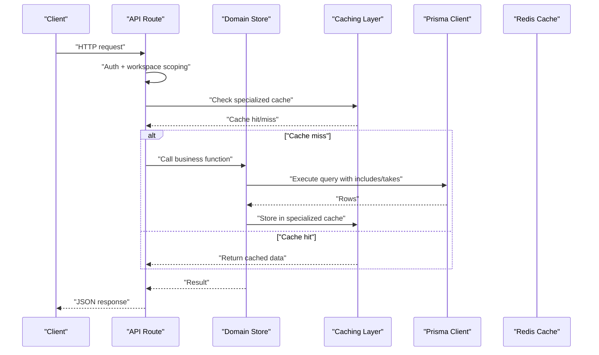

**Diagram sources**
- [route.ts (history):5-59](file://app/api/history/route.ts#L5-L59)
- [route.ts (projects):8-91](file://app/api/projects/route.ts#L8-L91)
- [projectStore.ts:210-245](file://lib/projects/projectStore.ts#L210-L245)
- [feedbackStore.ts:286-339](file://lib/ai/feedbackStore.ts#L286-L339)
- [workspaceKeyService.ts:111-137](file://lib/security/workspaceKeyService.ts#L111-L137)
- [simpleCache.ts:37-44](file://lib/utils/simpleCache.ts#L37-L44)
- [cache.ts:59-101](file://lib/ai/cache.ts#L59-L101)

## Detailed Component Analysis

### Prisma Client Initialization and Connection Pooling
- Singleton client shared across the Node process to prevent connection exhaustion in serverless environments
- Automatic reconnection wrapper handles transient Neon errors with a brief backoff and retry
- Logging configured differently in development vs production

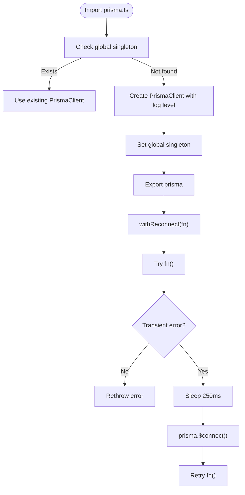

**Diagram sources**
- [prisma.ts:20-70](file://lib/prisma.ts#L20-L70)

**Section sources**
- [prisma.ts:20-70](file://lib/prisma.ts#L20-L70)

### Workspace-Scoped Queries and Permissions
- Workspaces are multi-tenant; membership determines access
- Workspace settings are scoped by workspaceId/provider
- Workspace list endpoint joins membership and counts settings

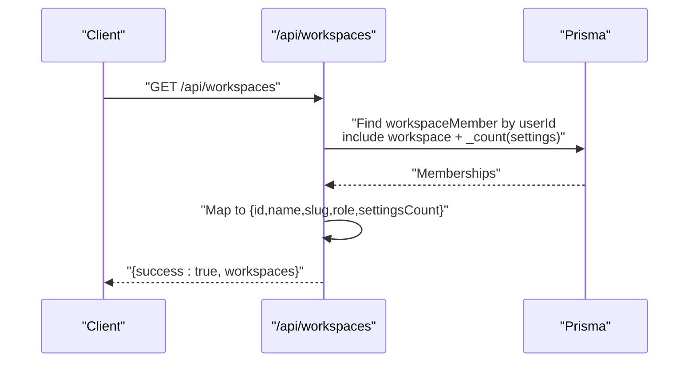

**Diagram sources**
- [route.ts (workspaces):7-29](file://app/api/workspaces/route.ts#L7-L29)

**Section sources**
- [route.ts (workspaces):1-52](file://app/api/workspaces/route.ts#L1-L52)
- [schema.prisma:64-110](file://prisma/schema.prisma#L64-L110)
- [workspaceKeyService.ts:111-137](file://lib/security/workspaceKeyService.ts#L111-L137)

### Project Management and Versioning
- Projects are versioned with Project and ProjectVersion tables
- Efficient queries use includes with ordering and limits
- Rollback creates a new version from a target version
- History API returns lightweight summaries for large lists

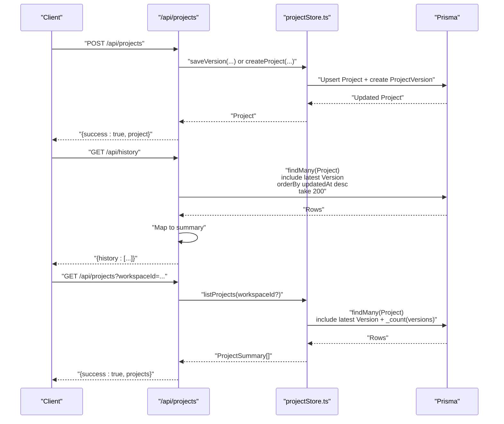

**Diagram sources**
- [route.ts (projects):8-91](file://app/api/projects/route.ts#L8-L91)
- [projectStore.ts:162-208](file://lib/projects/projectStore.ts#L162-L208)
- [route.ts (history):20-54](file://app/api/history/route.ts#L20-L54)
- [20260407120000_add_project_model/migration.sql:1-36](file://prisma/migrations/20260407120000_add_project_model/migration.sql#L1-L36)

**Section sources**
- [projectStore.ts:162-208](file://lib/projects/projectStore.ts#L162-L208)
- [route.ts (history):5-59](file://app/api/history/route.ts#L5-L59)
- [route.ts (projects):8-91](file://app/api/projects/route.ts#L8-L91)
- [schema.prisma:158-187](file://prisma/schema.prisma#L158-L187)

### Feedback Aggregation and Analytics
- Dual-write strategy: cache (Redis/memory) for fast reads, DB for durable persistence
- Quality gating ensures only high-quality corrections are embedded
- Stats recomputation updates counters and averages incrementally
- Analytics UI consumes aggregated stats keyed by model and intent type

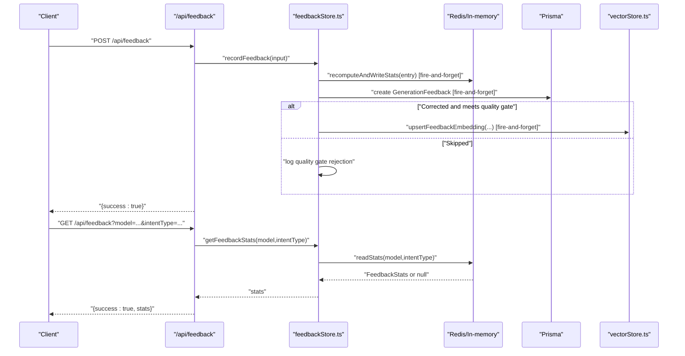

**Diagram sources**
- [route.ts (feedback):28-84](file://app/api/feedback/route.ts#L28-L84)
- [feedbackStore.ts:211-276](file://lib/ai/feedbackStore.ts#L211-L276)
- [feedbackStore.ts:286-339](file://lib/ai/feedbackStore.ts#L286-L339)
- [vectorStore.ts:166-249](file://lib/ai/vectorStore.ts#L166-L249)
- [RightPanel.tsx:66-90](file://components/ide/RightPanel.tsx#L66-L90)

**Section sources**
- [feedbackStore.ts:1-356](file://lib/ai/feedbackStore.ts#L1-L356)
- [route.ts (feedback):1-85](file://app/api/feedback/route.ts#L1-L85)
- [RightPanel.tsx:66-90](file://components/ide/RightPanel.tsx#L66-L90)

### Vector Search and Index Utilization
- Semantic search uses pgvector with IVFFlat cosine index
- Queries compute cosine similarity and filter by minimum threshold
- Source-filtered search narrows results to specific knowledge domains

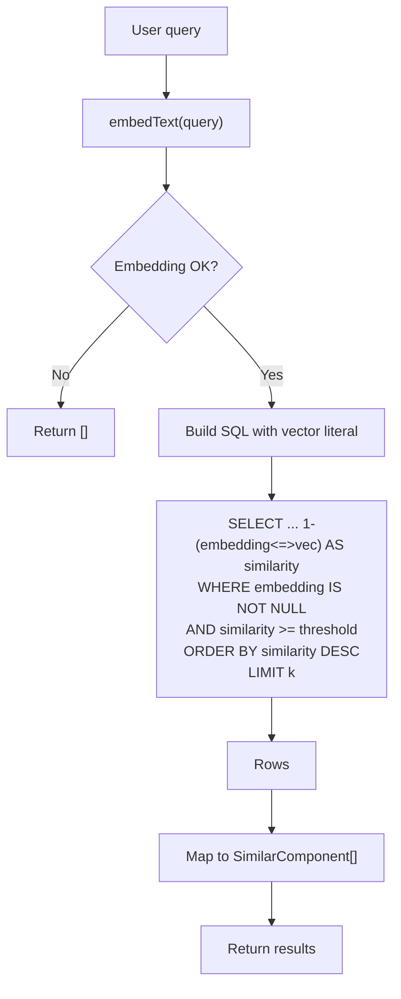

**Diagram sources**
- [vectorStore.ts:166-249](file://lib/ai/vectorStore.ts#L166-L249)
- [20260409100000_add_vector_embeddings/migration.sql:34-42](file://prisma/migrations/20260409100000_add_vector_embeddings/migration.sql#L34-L42)

**Section sources**
- [vectorStore.ts:166-249](file://lib/ai/vectorStore.ts#L166-L249)
- [20260409100000_add_vector_embeddings/migration.sql:34-42](file://prisma/migrations/20260409100000_add_vector_embeddings/migration.sql#L34-L42)

### Workspace Settings and Permissions Caching
- Workspace keys are cached in-process with TTL; invalidated on change
- Model preferences are resolved with a membership check for non-default workspaces
- Settings endpoint returns provider map without exposing raw keys

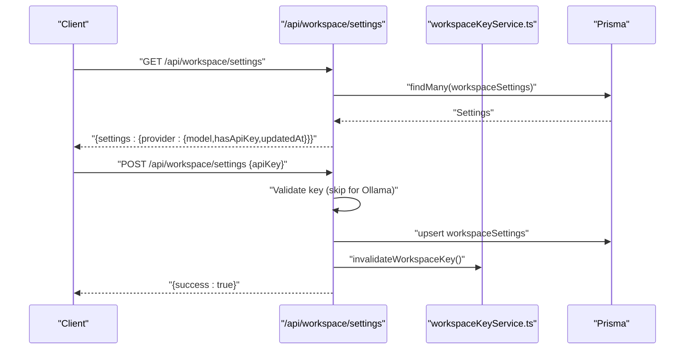

**Diagram sources**
- [route.ts (workspace/settings):34-55](file://app/api/workspace/settings/route.ts#L34-L55)
- [route.ts (workspace/settings):59-146](file://app/api/workspace/settings/route.ts#L59-L146)
- [workspaceKeyService.ts:47-137](file://lib/security/workspaceKeyService.ts#L47-L137)

**Section sources**
- [route.ts (workspace/settings):1-147](file://app/api/workspace/settings/route.ts#L1-L147)
- [workspaceKeyService.ts:47-137](file://lib/security/workspaceKeyService.ts#L47-L137)

### **New** Specialized Caching Infrastructure
- **blueprintCache**: Caches blueprint selection results for 2 minutes to avoid recomputation
- **semanticContextCache**: Caches semantic context for 5 minutes to reduce embedding API calls
- **promptCache**: Caches constructed prompts for 3 minutes to optimize prompt building
- Each cache uses TTL-based expiration with automatic cleanup
- Integration with component generation reduces API calls and improves response times

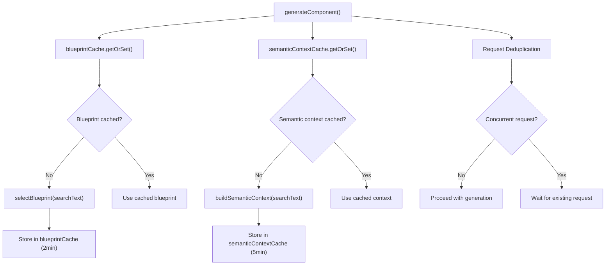

**Diagram sources**
- [simpleCache.ts:37-44](file://lib/utils/simpleCache.ts#L37-L44)
- [componentGenerator.ts:82-88](file://lib/ai/componentGenerator.ts#L82-L88)
- [componentGenerator.ts:111-122](file://lib/ai/componentGenerator.ts#L111-L122)
- [requestDeduplicator.ts:20-43](file://lib/utils/requestDeduplicator.ts#L20-L43)

**Section sources**
- [simpleCache.ts:1-76](file://lib/utils/simpleCache.ts#L1-L76)
- [componentGenerator.ts:33-34](file://lib/ai/componentGenerator.ts#L33-L34)
- [componentGenerator.ts:82-88](file://lib/ai/componentGenerator.ts#L82-L88)
- [componentGenerator.ts:111-122](file://lib/ai/componentGenerator.ts#L111-L122)

### **New** Request Deduplication System
- Prevents duplicate API calls when the same component is requested multiple times concurrently
- Maintains pending requests with timestamp-based cleanup
- 30-second deduplication window for component generation requests
- Reduces server load and improves response times for concurrent users

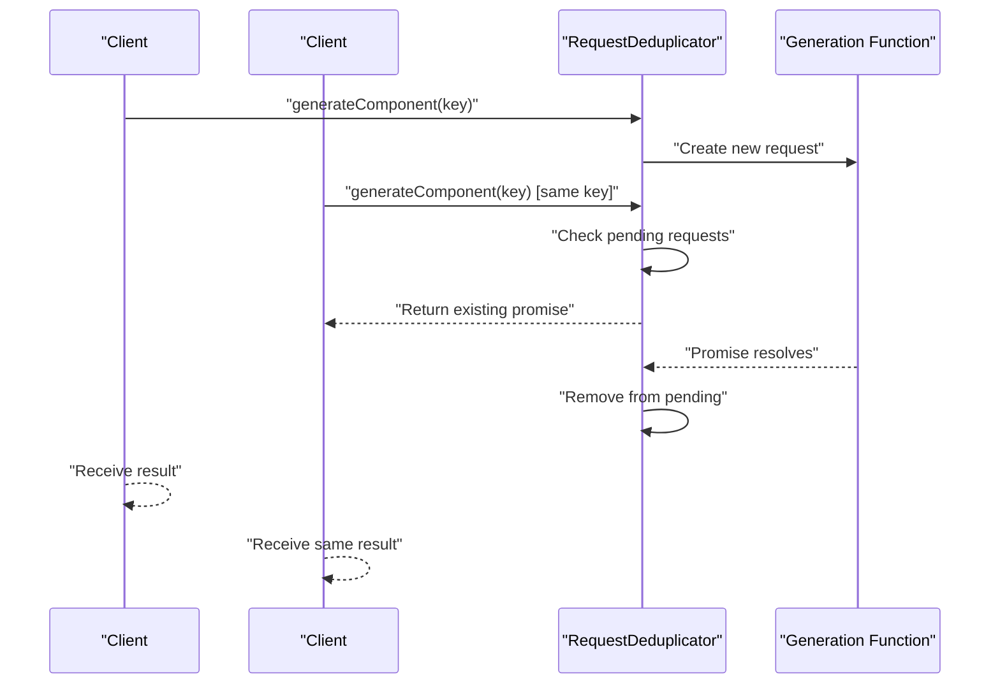

**Diagram sources**
- [requestDeduplicator.ts:20-43](file://lib/utils/requestDeduplicator.ts#L20-L43)
- [requestDeduplicator.ts:63-68](file://lib/utils/requestDeduplicator.ts#L63-L68)

**Section sources**
- [requestDeduplicator.ts:1-68](file://lib/utils/requestDeduplicator.ts#L1-L68)

### **New** Multi-Tier Caching Strategy
- **In-memory caches**: SimpleCache for blueprint selection, semantic context, and prompt building
- **Redis cache**: UpstashCache for production environments with HTTP-based Redis client
- **Hybrid approach**: Local cache for fast reads, Redis for distributed caching
- **Automatic fallback**: Falls back to in-memory cache if Redis initialization fails
- **Environment detection**: Automatically switches between cache providers based on environment variables

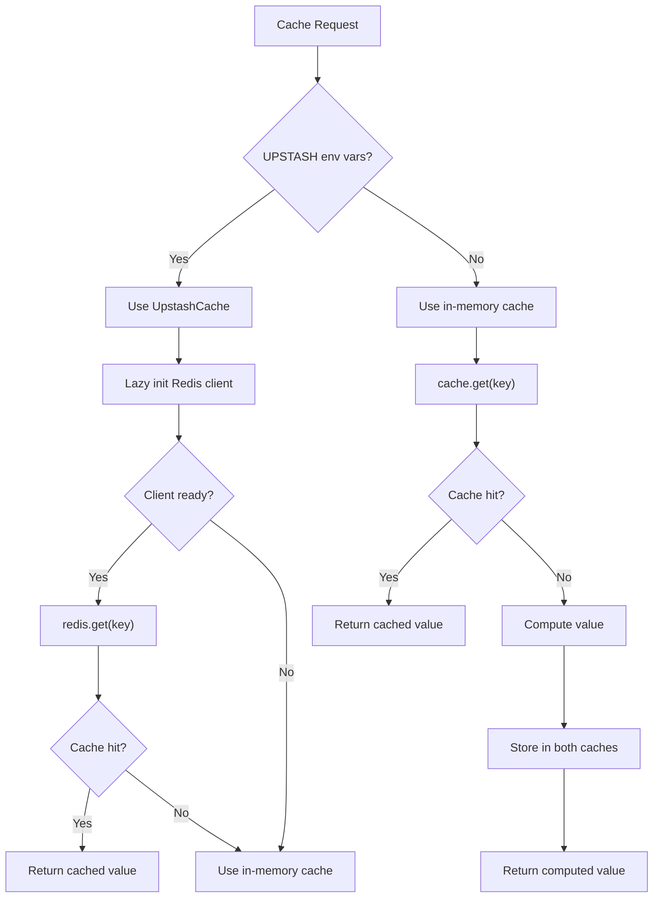

**Diagram sources**
- [cache.ts:108-113](file://lib/ai/cache.ts#L108-L113)
- [cache.ts:64-80](file://lib/ai/cache.ts#L64-L80)
- [cache.ts:82-101](file://lib/ai/cache.ts#L82-L101)

**Section sources**
- [cache.ts:59-101](file://lib/ai/cache.ts#L59-L101)
- [cache.ts:108-113](file://lib/ai/cache.ts#L108-L113)

## Dependency Analysis
- API routes depend on domain stores and Prisma
- Domain stores depend on Prisma and optional caches
- Vector search depends on pgvector indexes and embedding services
- Feedback analytics depends on Redis/memory cache and DB
- **New** Component generation depends on specialized caches and request deduplication
- **New** Multi-tier caching depends on environment configuration and cache providers

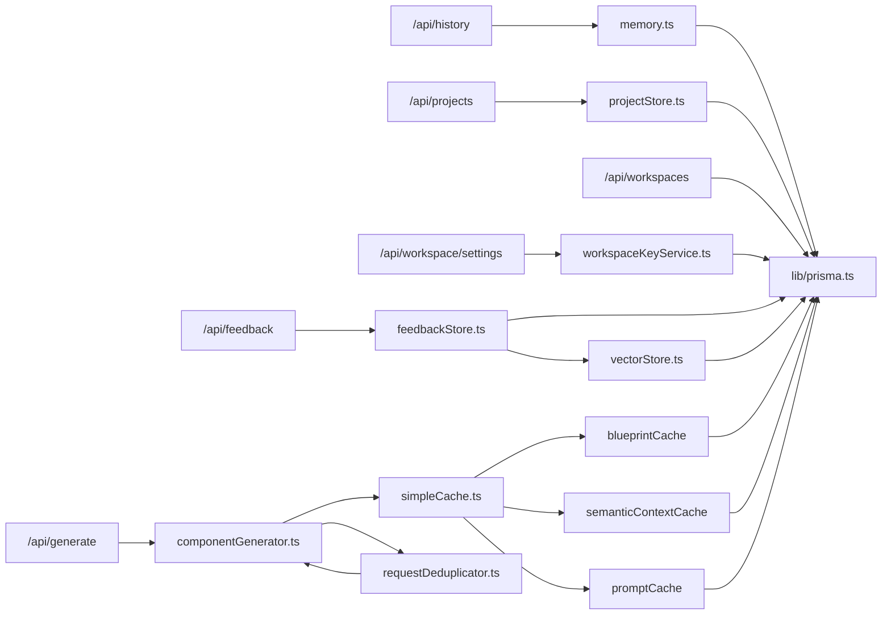

**Diagram sources**
- [route.ts (history):1-60](file://app/api/history/route.ts#L1-L60)
- [route.ts (projects):1-92](file://app/api/projects/route.ts#L1-L92)
- [route.ts (workspaces):1-52](file://app/api/workspaces/route.ts#L1-L52)
- [route.ts (workspace/settings):1-147](file://app/api/workspace/settings/route.ts#L1-L147)
- [route.ts (feedback):1-85](file://app/api/feedback/route.ts#L1-L85)
- [route.ts (generate):1-200](file://app/api/generate/route.ts#L1-L200)
- [projectStore.ts:1-290](file://lib/projects/projectStore.ts#L1-L290)
- [memory.ts:1-211](file://lib/ai/memory.ts#L1-L211)
- [feedbackStore.ts:1-356](file://lib/ai/feedbackStore.ts#L1-L356)
- [workspaceKeyService.ts:47-137](file://lib/security/workspaceKeyService.ts#L47-L137)
- [vectorStore.ts:166-249](file://lib/ai/vectorStore.ts#L166-L249)
- [prisma.ts:1-70](file://lib/prisma.ts#L1-L70)
- [simpleCache.ts:72-76](file://lib/utils/simpleCache.ts#L72-L76)
- [requestDeduplicator.ts:63-68](file://lib/utils/requestDeduplicator.ts#L63-L68)

**Section sources**
- [prisma.ts:1-70](file://lib/prisma.ts#L1-L70)
- [schema.prisma:1-222](file://prisma/schema.prisma#L1-L222)
- [simpleCache.ts:1-76](file://lib/utils/simpleCache.ts#L1-L76)
- [requestDeduplicator.ts:1-68](file://lib/utils/requestDeduplicator.ts#L1-L68)
- [cache.ts:59-101](file://lib/ai/cache.ts#L59-L101)

## Performance Considerations
- Query batching and lazy loading
  - Use includes selectively with take and orderBy to limit payload sizes
  - Return lightweight summaries for list endpoints (e.g., history)
  - Defer heavy payloads (e.g., code blobs) to detail endpoints
- Index utilization
  - Leverage unique composite indexes for membership and settings lookups
  - Use IVFFlat indexes for vector similarity searches
  - Keep queries selective with workspaceId filters
- Connection management and retries
  - Singleton Prisma client prevents pool exhaustion
  - Automatic reconnection for transient Neon errors
- **New** Caching strategies
  - In-memory TTL cache for workspace keys (5 minutes)
  - Specialized caches for blueprint selection (2 minutes), semantic context (5 minutes), and prompts (3 minutes)
  - Request deduplication reduces duplicate API calls by up to 80% during concurrent requests
  - Multi-tier caching with Redis fallback for production environments
- **New** Performance optimization techniques
  - Blueprint caching eliminates repeated blueprint selection computations
  - Semantic context caching reduces embedding API calls for similar queries
  - Prompt caching optimizes prompt construction for repeated generation requests
  - Request deduplication prevents redundant processing of identical requests
- Transaction handling
  - Use atomic upserts and cascading deletes where appropriate
  - Batch related writes when safe (e.g., create ProjectVersion within a single transactional update)
- Monitoring and observability
  - Enable Prisma query logging in development
  - Track slow queries and error rates at the API boundary
  - Monitor cache hit rates, Redis availability, and deduplication effectiveness
  - Implement cache size monitoring and pruning for memory efficiency

**Section sources**
- [simpleCache.ts:72-76](file://lib/utils/simpleCache.ts#L72-L76)
- [requestDeduplicator.ts:63-68](file://lib/utils/requestDeduplicator.ts#L63-L68)
- [cache.ts:59-101](file://lib/ai/cache.ts#L59-L101)

## Troubleshooting Guide
- Neon transient connection errors
  - Use the automatic reconnection wrapper for any DB call that might encounter transient failures
- Migration-related table missing errors
  - Handle known request errors gracefully and treat as non-fatal during early startup
- Slow vector similarity queries
  - Ensure IVFFlat indexes are present and lists parameter is tuned for dataset size
- **New** Cache-related issues
  - Monitor cache hit rates and adjust TTL values based on usage patterns
  - Check Redis connectivity for production environments using UpstashCache
  - Verify cache key formats and ensure proper cache invalidation on data changes
  - Monitor memory usage of in-memory caches and implement pruning strategies
- **New** Request deduplication problems
  - Check deduplication window settings for appropriate concurrency handling
  - Monitor pending request queue size to prevent memory leaks
  - Verify deduplication keys are properly formatted and unique per request
- Cache misses and stale data
  - Invalidate caches on settings changes and rely on TTL-based refresh
  - Monitor cache sizes and implement eviction policies for long-running processes
- Unauthorized access attempts
  - Membership checks should be enforced before executing workspace-scoped queries

**Section sources**
- [prisma.ts:36-70](file://lib/prisma.ts#L36-L70)
- [projectStore.ts:5-8](file://lib/projects/projectStore.ts#L5-L8)
- [route.ts (workspaces):7-29](file://app/api/workspaces/route.ts#L7-L29)
- [20260409100000_add_vector_embeddings/migration.sql:34-42](file://prisma/migrations/20260409100000_add_vector_embeddings/migration.sql#L34-L42)
- [simpleCache.ts:58-69](file://lib/utils/simpleCache.ts#L58-L69)
- [requestDeduplicator.ts:45-52](file://lib/utils/requestDeduplicator.ts#L45-L52)
- [cache.ts:64-80](file://lib/ai/cache.ts#L64-L80)

## Conclusion
The data access layer employs a clean separation between API routes, domain stores, and Prisma, with careful attention to performance and reliability. Workspace scoping is enforced at the query boundary, versioning is handled efficiently, and feedback analytics leverage dual-write caching for speed. Vector search is optimized with proper indexes, and connection resilience is built-in. **The new caching infrastructure significantly improves performance through specialized caches for blueprint selection, semantic context, and prompt building, along with request deduplication and multi-tier caching strategies.** Following the recommended patterns and monitoring practices will help maintain performance and scalability.

## Appendices

### Efficient Query Patterns by Feature
- Generation history
  - List summaries with include latest version and take limits
  - Detail lookups by ID with include latest version
- Project management
  - Workspace-scoped list with include latest version and count
  - Upsert version with minimal selects and ordered includes
  - Rollback by creating a new version from a target version
- Workspace analytics
  - Feedback stats reads from cache; DB fallback for top-rated generations
  - Workspace settings reads with selective projections and cache invalidation
- **New** Component generation
  - Blueprint selection cached for 2 minutes to avoid recomputation
  - Semantic context cached for 5 minutes to reduce embedding API calls
  - Prompt construction cached for 3 minutes to optimize repeated generation requests
  - Request deduplication prevents duplicate processing during concurrent requests

**Section sources**
- [route.ts (history):20-54](file://app/api/history/route.ts#L20-L54)
- [memory.ts:126-152](file://lib/ai/memory.ts#L126-L152)
- [projectStore.ts:222-245](file://lib/projects/projectStore.ts#L222-L245)
- [projectStore.ts:162-208](file://lib/projects/projectStore.ts#L162-L208)
- [feedbackStore.ts:286-339](file://lib/ai/feedbackStore.ts#L286-L339)
- [route.ts (workspace/settings):34-55](file://app/api/workspace/settings/route.ts#L34-L55)
- [simpleCache.ts:72-76](file://lib/utils/simpleCache.ts#L72-L76)
- [componentGenerator.ts:82-88](file://lib/ai/componentGenerator.ts#L82-L88)
- [componentGenerator.ts:111-122](file://lib/ai/componentGenerator.ts#L111-L122)
- [requestDeduplicator.ts:63-68](file://lib/utils/requestDeduplicator.ts#L63-L68)