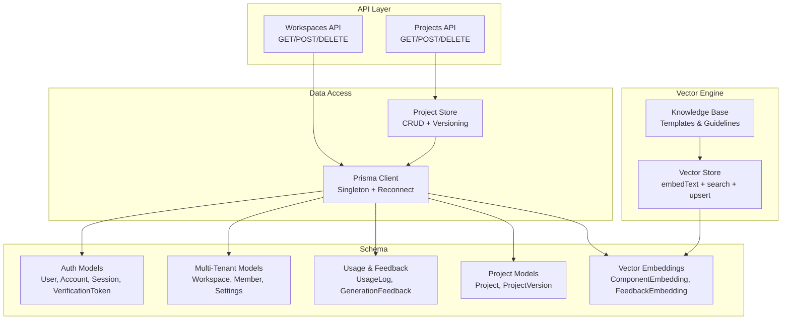
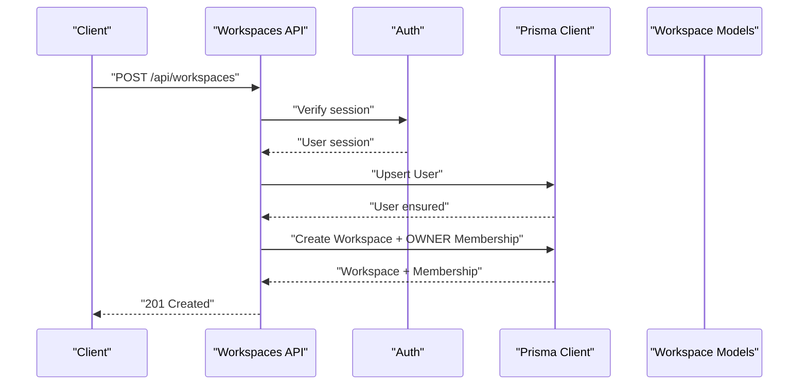
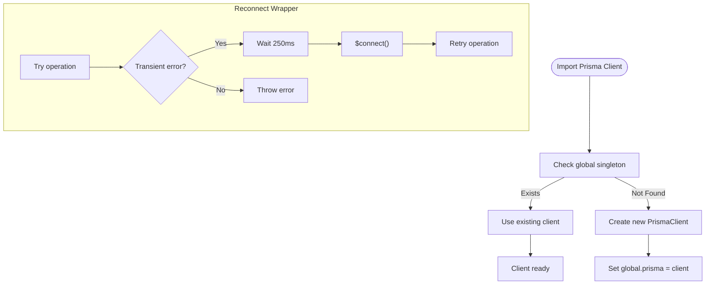
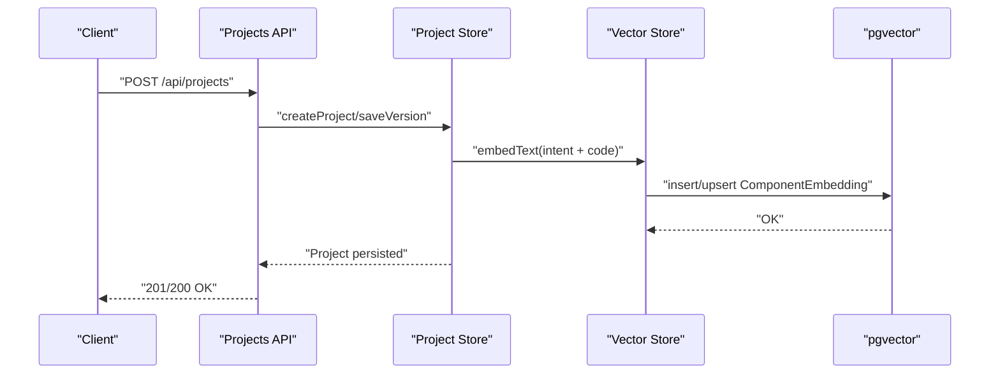
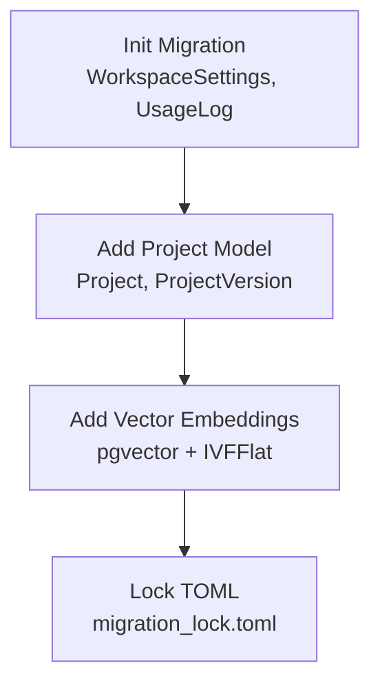
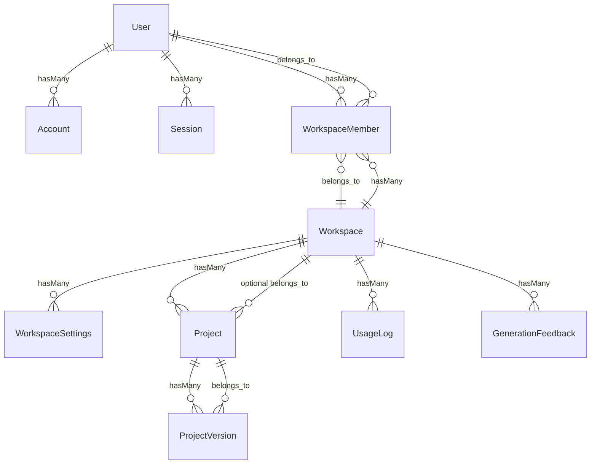
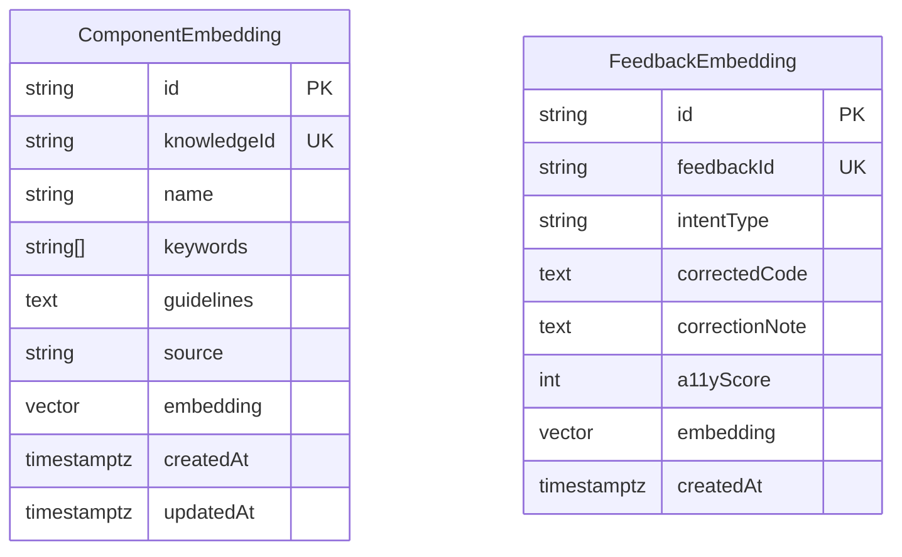
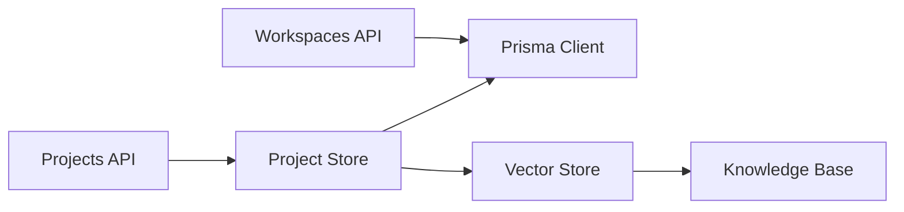

# Database & Data Layer

<cite>
**Referenced Files in This Document**
- [schema.prisma](file://prisma/schema.prisma)
- [prisma.ts](file://lib/prisma.ts)
- [route.ts](file://app/api/workspaces/route.ts)
- [route.ts](file://app/api/projects/route.ts)
- [projectStore.ts](file://lib/projects/projectStore.ts)
- [vectorStore.ts](file://lib/ai/vectorStore.ts)
- [knowledgeBase.ts](file://lib/ai/knowledgeBase.ts)
- [seed-embeddings.ts](file://scripts/seed-embeddings.ts)
- [seed-workspace-db.mjs](file://scripts/seed-workspace-db.mjs)
- [20260403065359_init_workspace_settings/migration.sql](file://prisma/migrations/20260403065359_init_workspace_settings/migration.sql)
- [20260407120000_add_project_model/migration.sql](file://prisma/migrations/20260407120000_add_project_model/migration.sql)
- [20260409100000_add_vector_embeddings/migration.sql](file://prisma/migrations/20260409100000_add_vector_embeddings/migration.sql)
- [migration_lock.toml](file://prisma/migrations/migration_lock.toml)
</cite>

## Table of Contents
1. [Introduction](#introduction)
2. [Project Structure](#project-structure)
3. [Core Components](#core-components)
4. [Architecture Overview](#architecture-overview)
5. [Detailed Component Analysis](#detailed-component-analysis)
6. [Dependency Analysis](#dependency-analysis)
7. [Performance Considerations](#performance-considerations)
8. [Troubleshooting Guide](#troubleshooting-guide)
9. [Conclusion](#conclusion)
10. [Appendices](#appendices)

## Introduction
This document provides comprehensive data model documentation for the database layer and data management systems. It covers Prisma ORM configuration, schema design with entities for workspaces, projects, generations, and user relationships, and the migration management strategy. It also documents the vector embeddings system for semantic search and knowledge base implementation, data access patterns, query optimization, and caching strategies. The knowledge ingestion pipeline, semantic search implementation, and retrieval-augmented generation (RAG) workflows are explained, along with data security, privacy requirements, and access control mechanisms. Examples of common queries, data migration procedures, and performance optimization techniques are included.

## Project Structure
The data layer is organized around:
- Prisma schema defining entities, relations, and constraints
- Prisma client initialization and reconnection utilities
- API routes orchestrating data access and enforcing authorization
- Project persistence layer replacing a read-only filesystem JSON store
- Vector embeddings subsystem for semantic search powered by pgvector
- Migration scripts and seed utilities

**Diagram sources**
- [route.ts:1-145](file://app/api/workspaces/route.ts#L1-L145)
- [route.ts:1-92](file://app/api/projects/route.ts#L1-L92)
- [projectStore.ts:1-291](file://lib/projects/projectStore.ts#L1-L291)
- [prisma.ts:1-70](file://lib/prisma.ts#L1-L70)
- [schema.prisma:1-222](file://prisma/schema.prisma#L1-L222)
- [vectorStore.ts:1-378](file://lib/ai/vectorStore.ts#L1-L378)
- [knowledgeBase.ts:1-293](file://lib/ai/knowledgeBase.ts#L1-L293)

**Section sources**
- [schema.prisma:1-222](file://prisma/schema.prisma#L1-L222)
- [prisma.ts:1-70](file://lib/prisma.ts#L1-L70)
- [route.ts:1-145](file://app/api/workspaces/route.ts#L1-L145)
- [route.ts:1-92](file://app/api/projects/route.ts#L1-L92)
- [projectStore.ts:1-291](file://lib/projects/projectStore.ts#L1-L291)
- [vectorStore.ts:1-378](file://lib/ai/vectorStore.ts#L1-L378)
- [knowledgeBase.ts:1-293](file://lib/ai/knowledgeBase.ts#L1-L293)

## Core Components
- Prisma ORM configuration and client lifecycle
- Authentication and multi-tenancy models
- Project and versioning persistence
- Usage logging and feedback storage
- Vector embeddings for semantic search and RAG
- Migration management and seed utilities

**Section sources**
- [schema.prisma:1-222](file://prisma/schema.prisma#L1-L222)
- [prisma.ts:1-70](file://lib/prisma.ts#L1-L70)
- [projectStore.ts:1-291](file://lib/projects/projectStore.ts#L1-L291)
- [vectorStore.ts:1-378](file://lib/ai/vectorStore.ts#L1-L378)

## Architecture Overview
The system uses Prisma for relational modeling and access, with a dedicated vector engine for semantic search powered by pgvector. Workspaces and projects are central to multi-tenancy and persistence. API routes enforce authorization and delegate data operations to the project store and Prisma client. Vector operations bypass Prisma’s ORM for raw SQL to leverage vector similarity.

**Diagram sources**
- [route.ts:47-109](file://app/api/workspaces/route.ts#L47-L109)
- [prisma.ts:20-28](file://lib/prisma.ts#L20-L28)

**Section sources**
- [route.ts:1-145](file://app/api/workspaces/route.ts#L1-L145)
- [prisma.ts:1-70](file://lib/prisma.ts#L1-L70)

## Detailed Component Analysis

### Prisma ORM Configuration and Client Lifecycle
- Provider: PostgreSQL
- Datasource URLs: DATABASE_URL and DIRECT_URL
- Client singleton pattern with global reuse to prevent connection exhaustion
- Automatic reconnection wrapper for transient Neon errors

**Diagram sources**
- [prisma.ts:20-70](file://lib/prisma.ts#L20-L70)

**Section sources**
- [prisma.ts:1-70](file://lib/prisma.ts#L1-L70)

### Schema Design and Entities

#### Authentication and Session Models
- User: identity with optional password hash and image
- Account: OAuth/OpenID Connect credentials
- Session: JWT-style session tokens
- VerificationToken: one-time token for email verification

Constraints and relations:
- Unique constraints on provider/providerAccountId for accounts
- Unique sessionToken for sessions
- Unique email for users
- Cascade deletes on user/workspace relations

**Section sources**
- [schema.prisma:13-60](file://prisma/schema.prisma#L13-L60)

#### Multi-Tenancy Core
- Workspace: tenant root with slug uniqueness
- WorkspaceMember: many-to-many via role enum (OWNER, ADMIN, MEMBER)
- WorkspaceSettings: per-workspace provider/model with encrypted API key
- UsageLog: token usage, latency, cost, cache flag
- GenerationFeedback: feedback signals, intent, prompt hash, corrections

Constraints:
- Unique workspace/provider for settings
- Unique workspace/user for memberships
- Optional workspace relation for project versions

**Section sources**
- [schema.prisma:64-154](file://prisma/schema.prisma#L64-L154)

#### Project Persistence
- Project: id, name, componentType, workspaceId, versioning
- ProjectVersion: code (JSON/text), intent JSON, a11yReport JSON, metadata, changeDescription, linesChanged

Constraints:
- Unique projectId/version composite index
- Cascade delete on project version deletion
- Optional workspaceId for portability

**Section sources**
- [schema.prisma:158-187](file://prisma/schema.prisma#L158-L187)
- [20260407120000_add_project_model/migration.sql:1-37](file://prisma/migrations/20260407120000_add_project_model/migration.sql#L1-L37)

#### Vector Embeddings (pgvector)
- ComponentEmbedding: knowledgeId, name, keywords[], guidelines, source, embedding(vector)
- FeedbackEmbedding: feedbackId, intentType, correctedCode, correctionNote, a11yScore, embedding(vector)

Indexes:
- IVFFlat with cosine ops and lists parameter
- Unique indexes on knowledgeId and feedbackId

**Section sources**
- [schema.prisma:194-221](file://prisma/schema.prisma#L194-L221)
- [20260409100000_add_vector_embeddings/migration.sql:1-43](file://prisma/migrations/20260409100000_add_vector_embeddings/migration.sql#L1-L43)

### Data Access Patterns and API Routes

#### Workspaces API
- GET: list workspaces for a user with role and settings count
- POST: create a workspace and auto-upsert user, then create OWNER membership atomically
- DELETE: require OWNER role to delete workspace

Authorization enforcement:
- Session required; unauthorized returns 401
- Ownership check for deletion

**Section sources**
- [route.ts:1-145](file://app/api/workspaces/route.ts#L1-L145)

#### Projects API and Store
- GET: list projects optionally filtered by workspaceId
- POST: create new project or upsert a new version; supports isNewProject flag and metadata
- DELETE: delete a project by id

Project store responsibilities:
- Convert DB rows to domain types
- Handle missing table errors gracefully during migration
- Compute linesChanged deltas across versions
- Support rollback to a previous version

**Section sources**
- [route.ts:1-92](file://app/api/projects/route.ts#L1-L92)
- [projectStore.ts:1-291](file://lib/projects/projectStore.ts#L1-L291)

### Vector Embeddings System and Semantic Search

#### Embedding Generation
- Uses Google embedding API with fallback model selection
- Returns normalized 768-dimension vectors
- Graceful fallback when API key is missing

#### Knowledge Ingestion
- Seed script iterates KNOWLEDGE_BASE and upserts ComponentEmbedding records
- Uses ON CONFLICT DO UPDATE semantics
- Requires pgvector extension and applied migrations

#### Semantic Search
- Component search: cosine similarity over vector embeddings
- Source-filtered search: restrict by knowledge domain
- Feedback search: retrieve similar user corrections for RAG

#### Retrieval-Augmented Generation (RAG)
- Shared semantic context built once per request to avoid redundant embeddings
- Context budgeting to fit model token limits
- Injection of approved blueprints/components into prompts

**Diagram sources**
- [route.ts:16-81](file://app/api/projects/route.ts#L16-L81)
- [projectStore.ts:105-160](file://lib/projects/projectStore.ts#L105-L160)
- [vectorStore.ts:49-97](file://lib/ai/vectorStore.ts#L49-L97)
- [seed-embeddings.ts:29-63](file://scripts/seed-embeddings.ts#L29-L63)

**Section sources**
- [vectorStore.ts:1-378](file://lib/ai/vectorStore.ts#L1-L378)
- [knowledgeBase.ts:1-293](file://lib/ai/knowledgeBase.ts#L1-L293)
- [seed-embeddings.ts:1-69](file://scripts/seed-embeddings.ts#L1-L69)

### Migration Management Strategy
- Migrations are tracked via migration_lock.toml
- Initial workspace settings and usage logs
- Project model addition with foreign keys and unique indexes
- Vector embeddings with pgvector extension and IVFFlat indexes

**Diagram sources**
- [20260403065359_init_workspace_settings/migration.sql:1-32](file://prisma/migrations/20260403065359_init_workspace_settings/migration.sql#L1-L32)
- [20260407120000_add_project_model/migration.sql:1-37](file://prisma/migrations/20260407120000_add_project_model/migration.sql#L1-L37)
- [20260409100000_add_vector_embeddings/migration.sql:1-43](file://prisma/migrations/20260409100000_add_vector_embeddings/migration.sql#L1-L43)
- [migration_lock.toml:1-3](file://prisma/migrations/migration_lock.toml#L1-L3)

**Section sources**
- [20260403065359_init_workspace_settings/migration.sql:1-32](file://prisma/migrations/20260403065359_init_workspace_settings/migration.sql#L1-L32)
- [20260407120000_add_project_model/migration.sql:1-37](file://prisma/migrations/20260407120000_add_project_model/migration.sql#L1-L37)
- [20260409100000_add_vector_embeddings/migration.sql:1-43](file://prisma/migrations/20260409100000_add_vector_embeddings/migration.sql#L1-L43)
- [migration_lock.toml:1-3](file://prisma/migrations/migration_lock.toml#L1-L3)

### Data Security, Privacy, and Access Control
- Encrypted API keys stored in WorkspaceSettings
- Session-based authentication enforced in API routes
- Workspace roles (OWNER, ADMIN, MEMBER) govern access to resources
- Ownership check required for destructive operations (e.g., workspace deletion)
- Prisma client configured for development logging and production error logging

**Section sources**
- [schema.prisma:99-110](file://prisma/schema.prisma#L99-L110)
- [route.ts:111-144](file://app/api/workspaces/route.ts#L111-L144)

### Database Schema Diagrams

#### Entity Relationship Diagram

**Diagram sources**
- [schema.prisma:13-187](file://prisma/schema.prisma#L13-L187)

#### Vector Embeddings Indexes

**Diagram sources**
- [schema.prisma:194-221](file://prisma/schema.prisma#L194-L221)
- [20260409100000_add_vector_embeddings/migration.sql:5-32](file://prisma/migrations/20260409100000_add_vector_embeddings/migration.sql#L5-L32)

## Dependency Analysis
- API routes depend on Prisma client and project store
- Project store depends on Prisma client and Prisma error codes
- Vector store depends on Neon SQL client and embedding API
- Knowledge base provides structured templates for ingestion

**Diagram sources**
- [route.ts:1-145](file://app/api/workspaces/route.ts#L1-L145)
- [route.ts:1-92](file://app/api/projects/route.ts#L1-L92)
- [projectStore.ts:1-291](file://lib/projects/projectStore.ts#L1-L291)
- [vectorStore.ts:1-378](file://lib/ai/vectorStore.ts#L1-L378)
- [knowledgeBase.ts:1-293](file://lib/ai/knowledgeBase.ts#L1-L293)

**Section sources**
- [route.ts:1-145](file://app/api/workspaces/route.ts#L1-L145)
- [route.ts:1-92](file://app/api/projects/route.ts#L1-L92)
- [projectStore.ts:1-291](file://lib/projects/projectStore.ts#L1-L291)
- [vectorStore.ts:1-378](file://lib/ai/vectorStore.ts#L1-L378)
- [knowledgeBase.ts:1-293](file://lib/ai/knowledgeBase.ts#L1-L293)

## Performance Considerations
- Use IVFFlat indexes with appropriate lists parameter for cosine similarity
- Limit returned results (topK) and apply similarity thresholds
- Batch embedding requests and throttle to avoid rate limits
- Prefer source-filtered searches to reduce candidate set
- Use withReconnect wrapper to handle transient Neon connection issues
- Cache frequently accessed project summaries and workspace lists at the application level when appropriate

[No sources needed since this section provides general guidance]

## Troubleshooting Guide
- Neon transient errors: use withReconnect wrapper to retry after a short delay
- Missing table errors: project store handles P2021 gracefully by returning in-memory stubs
- Embedding API failures: vector store returns null and logs warnings; fallback logic continues
- Migration lock issues: ensure migration_lock.toml is present and committed

**Section sources**
- [prisma.ts:36-70](file://lib/prisma.ts#L36-L70)
- [projectStore.ts:5-8](file://lib/projects/projectStore.ts#L5-L8)
- [vectorStore.ts:49-97](file://lib/ai/vectorStore.ts#L49-L97)

## Conclusion
The data layer combines robust relational modeling with a scalable vector search engine to power semantic search and RAG workflows. Prisma manages multi-tenancy, project persistence, and usage/feedback tracking, while the vector subsystem enables efficient similarity search over knowledge and user feedback. The API enforces strict access control, and the system is designed to handle transient database errors and evolving schema migrations.

[No sources needed since this section summarizes without analyzing specific files]

## Appendices

### Common Queries and Examples
- List projects for a workspace: filter by workspaceId in project list
- Upsert a project version: POST with isNewProject=false; if not found, store auto-creates
- Create a workspace and become OWNER: POST to workspaces with session
- Delete a workspace: DELETE requires OWNER role
- Seed vector embeddings: run seed script to embed KNOWLEDGE_BASE entries

**Section sources**
- [route.ts:8-14](file://app/api/projects/route.ts#L8-L14)
- [route.ts:49-75](file://app/api/projects/route.ts#L49-L75)
- [route.ts:74-109](file://app/api/workspaces/route.ts#L74-L109)
- [route.ts:126-143](file://app/api/workspaces/route.ts#L126-L143)
- [seed-embeddings.ts:29-63](file://scripts/seed-embeddings.ts#L29-L63)

### Data Migration Procedures
- Apply migrations: ensure pgvector is enabled and run Prisma migrate deploy
- Seed workspace.db: use seed script to insert default settings and usage log
- Verify migrations: check migration_lock.toml presence and commit status

**Section sources**
- [20260409100000_add_vector_embeddings/migration.sql:1-43](file://prisma/migrations/20260409100000_add_vector_embeddings/migration.sql#L1-L43)
- [seed-workspace-db.mjs:1-96](file://scripts/seed-workspace-db.mjs#L1-L96)
- [migration_lock.toml:1-3](file://prisma/migrations/migration_lock.toml#L1-L3)

### Performance Optimization Techniques
- Use similarity thresholds and topK limits to bound query cost
- Precompute shared semantic context for RAG to avoid repeated embeddings
- Keep indexes tuned (IVFFlat lists) as dataset scales
- Minimize embedding calls by batching and throttling

[No sources needed since this section provides general guidance]