# Prisma ORM Configuration

<cite>
**Referenced Files in This Document**
- [schema.prisma](file://prisma/schema.prisma)
- [prisma.ts](file://lib/prisma.ts)
- [20260403065359_init_workspace_settings/migration.sql](file://prisma/migrations/20260403065359_init_workspace_settings/migration.sql)
- [20260407120000_add_project_model/migration.sql](file://prisma/migrations/20260407120000_add_project_model/migration.sql)
- [20260409100000_add_vector_embeddings/migration.sql](file://prisma/migrations/20260409100000_add_vector_embeddings/migration.sql)
- [20260410000000_add_source_to_component_embedding/migration.sql](file://prisma/migrations/20260410000000_add_source_to_component_embedding/migration.sql)
- [20260410113000_add_thinking_review_metadata_to_project_version/migration.sql](file://prisma/migrations/20260410113000_add_thinking_review_metadata_to_project_version/migration.sql)
- [migration_lock.toml](file://prisma/migrations/migration_lock.toml)
- [route.ts](file://app/api/auth/[...nextauth]/route.ts)
- [auth.ts](file://lib/auth.ts)
- [package.json](file://package.json)
</cite>

## Table of Contents
1. [Introduction](#introduction)
2. [Project Structure](#project-structure)
3. [Core Components](#core-components)
4. [Architecture Overview](#architecture-overview)
5. [Detailed Component Analysis](#detailed-component-analysis)
6. [Dependency Analysis](#dependency-analysis)
7. [Performance Considerations](#performance-considerations)
8. [Troubleshooting Guide](#troubleshooting-guide)
9. [Conclusion](#conclusion)
10. [Appendices](#appendices)

## Introduction
This document explains the Prisma ORM configuration and database schema design for an AI-powered, accessibility-first UI engine. It covers the complete schema including authentication (User, Account, Session), multi-tenancy (Workspace, WorkspaceMember, WorkspaceSettings), project management (Project, ProjectVersion), feedback system (GenerationFeedback), usage tracking (UsageLog), and vector embeddings (ComponentEmbedding, FeedbackEmbedding). It also documents migration management, PostgreSQL provider configuration, environment variable handling, NextAuth.js integration, and practical query patterns and performance tips.

## Project Structure
The Prisma configuration centers around a single schema definition and a set of SQL migrations. The application integrates Prisma via a singleton client and uses NextAuth.js for authentication, with routes delegating to a shared handler.

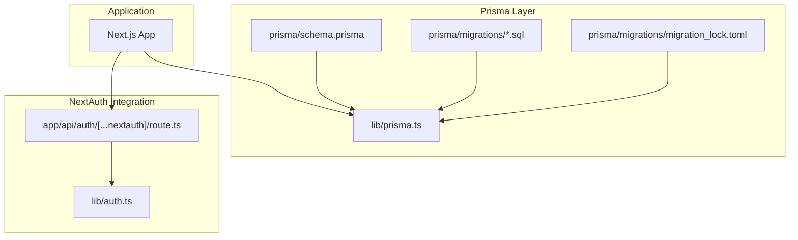

**Diagram sources**
- [schema.prisma:1-222](file://prisma/schema.prisma#L1-L222)
- [prisma.ts:1-70](file://lib/prisma.ts#L1-L70)
- [20260403065359_init_workspace_settings/migration.sql:1-32](file://prisma/migrations/20260403065359_init_workspace_settings/migration.sql#L1-L32)
- [route.ts:1-4](file://app/api/auth/[...nextauth]/route.ts#L1-L4)
- [auth.ts:1-87](file://lib/auth.ts#L1-L87)

**Section sources**
- [schema.prisma:1-222](file://prisma/schema.prisma#L1-L222)
- [prisma.ts:1-70](file://lib/prisma.ts#L1-L70)
- [package.json:1-68](file://package.json#L1-L68)

## Core Components
This section outlines the primary entities and their relationships, highlighting keys, indexes, and constraints.

- Authentication models
  - User: identity with optional email uniqueness and relations to Account and Session.
  - Account: OAuth/social login records linked to User with a composite unique index on provider/providerAccountId.
  - Session: JWT/session token storage with a unique sessionToken and relation to User.
  - VerificationToken: one-time token for email verification with a composite unique index.

- Multi-tenancy models
  - Workspace: tenant container with unique slug and collections of members, settings, projects, usage logs, and feedbacks.
  - WorkspaceMember: many-to-many bridging User and Workspace with a unique constraint on (workspaceId, userId) and a role enum.
  - WorkspaceSettings: per-provider settings per workspace with a unique constraint on (workspaceId, provider).

- Project management models
  - Project: named artifact under a workspace with a current version counter and relation to Workspace.
  - ProjectVersion: immutable snapshots of a project’s code and metadata, uniquely identified by (projectId, version).

- Feedback and usage models
  - GenerationFeedback: user feedback on generated outputs with intent metadata, scores, and timestamps.
  - UsageLog: token usage, latency, cost, and caching flags per workspace/provider/model.

- Vector embedding models
  - ComponentEmbedding: knowledge chunks with vector embeddings (via raw SQL), keyword tags, and a source domain.
  - FeedbackEmbedding: feedback vectors keyed by feedback ID.

**Section sources**
- [schema.prisma:13-60](file://prisma/schema.prisma#L13-L60)
- [schema.prisma:64-126](file://prisma/schema.prisma#L64-L126)
- [schema.prisma:158-187](file://prisma/schema.prisma#L158-L187)
- [schema.prisma:137-154](file://prisma/schema.prisma#L137-L154)
- [schema.prisma:112-126](file://prisma/schema.prisma#L112-L126)
- [schema.prisma:194-221](file://prisma/schema.prisma#L194-L221)

## Architecture Overview
The system uses Prisma with PostgreSQL as the data source. Environment variables supply connection URLs, and migrations manage schema evolution. NextAuth.js handles authentication and delegates to a shared handler. The application accesses the database through a singleton Prisma client with automatic reconnection logic for transient Neon errors.

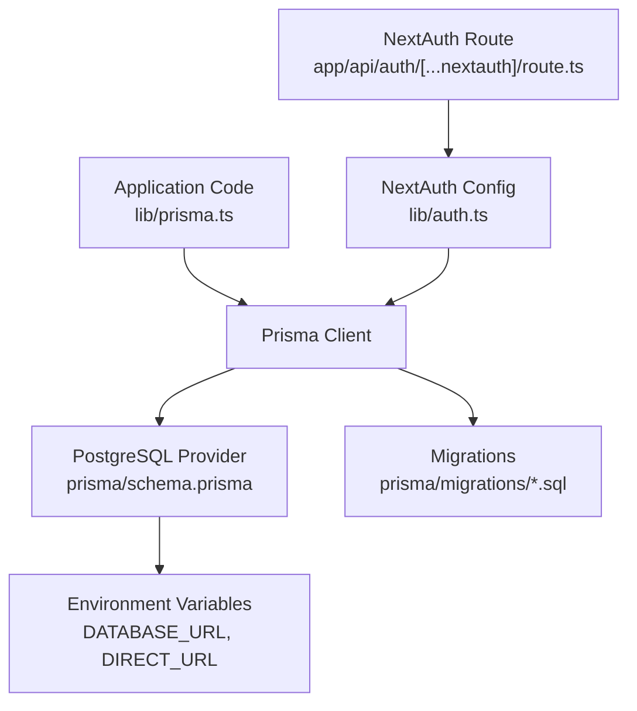

**Diagram sources**
- [prisma.ts:1-70](file://lib/prisma.ts#L1-L70)
- [schema.prisma:5-9](file://prisma/schema.prisma#L5-L9)
- [route.ts:1-4](file://app/api/auth/[...nextauth]/route.ts#L1-L4)
- [auth.ts:1-87](file://lib/auth.ts#L1-L87)
- [20260403065359_init_workspace_settings/migration.sql:1-32](file://prisma/migrations/20260403065359_init_workspace_settings/migration.sql#L1-L32)

**Section sources**
- [prisma.ts:1-70](file://lib/prisma.ts#L1-L70)
- [schema.prisma:5-9](file://prisma/schema.prisma#L5-L9)
- [route.ts:1-4](file://app/api/auth/[...nextauth]/route.ts#L1-L4)
- [auth.ts:1-87](file://lib/auth.ts#L1-L87)

## Detailed Component Analysis

### Authentication Schema (User, Account, Session, VerificationToken)
- Keys and relations
  - User.id is the primary key; Account.userId and Session.userId both reference User.id with cascade delete.
  - Account has a unique constraint on (provider, providerAccountId); Session has a unique sessionToken; User has a unique email.
- Data types and constraints
  - String identifiers using cuid() for UUID-like IDs.
  - Token fields stored as text; expiry stored as integer; email verified as datetime; image as string.
- Typical access patterns
  - Find user by email or account provider ID.
  - Manage sessions via sessionToken and enforce expiration checks.
  - Store and rotate tokens for external providers.

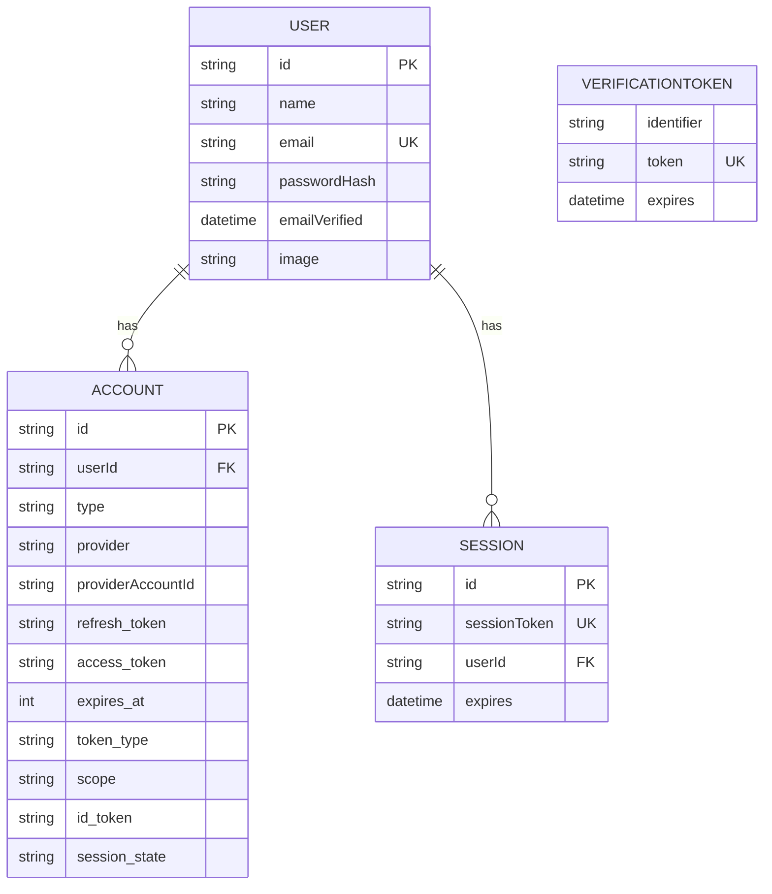

**Diagram sources**
- [schema.prisma:13-60](file://prisma/schema.prisma#L13-L60)

**Section sources**
- [schema.prisma:13-60](file://prisma/schema.prisma#L13-L60)

### Multi-Tenancy Schema (Workspace, WorkspaceMember, WorkspaceSettings)
- Keys and relations
  - WorkspaceMembers form a many-to-many bridge with unique (workspaceId, userId).
  - WorkspaceSettings is unique per provider per workspace and cascades deletes with Workspace.
- Roles and membership
  - WorkspaceRole enum supports OWNER, ADMIN, MEMBER.
- Data types and constraints
  - Workspace slug is unique; WorkspaceMember.createdAt defaults to now; WorkspaceSettings.updatedAt tracks changes.

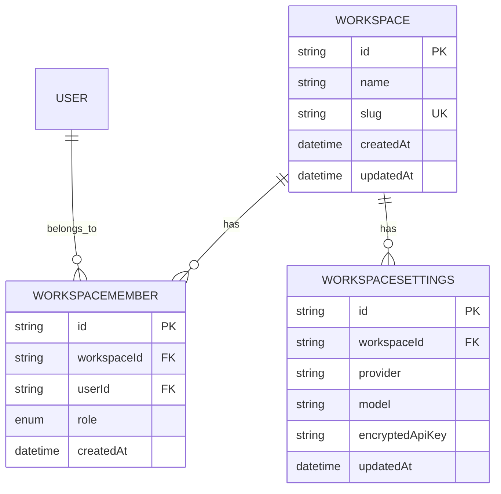

**Diagram sources**
- [schema.prisma:64-110](file://prisma/schema.prisma#L64-L110)

**Section sources**
- [schema.prisma:64-110](file://prisma/schema.prisma#L64-L110)

### Project Management Schema (Project, ProjectVersion)
- Keys and relations
  - ProjectVersion is uniquely identified by (projectId, version) and cascades deletes on parent Project.
  - Project optionally belongs to a Workspace with SET NULL on delete.
- Data types and constraints
  - JSON fields for intent, a11yReport, thinkingPlan, and reviewData; Text fields for code and changeDescription.
  - Lines changed and version counters track diffs and iteration.

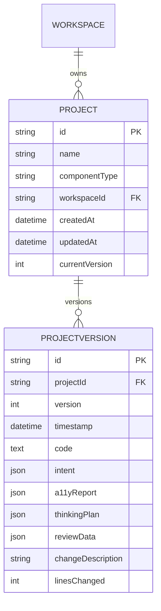

**Diagram sources**
- [schema.prisma:158-187](file://prisma/schema.prisma#L158-L187)

**Section sources**
- [schema.prisma:158-187](file://prisma/schema.prisma#L158-L187)

### Feedback and Usage Schema (GenerationFeedback, UsageLog)
- Keys and relations
  - GenerationFeedback optionally belongs to a Workspace; UsageLog optionally belongs to a Workspace.
- Data types and constraints
  - FeedbackSignal enum supports thumbs_up, thumbs_down, corrected, discarded.
  - UsageLog tracks token counts, latency, cost, and cache flag with defaults.

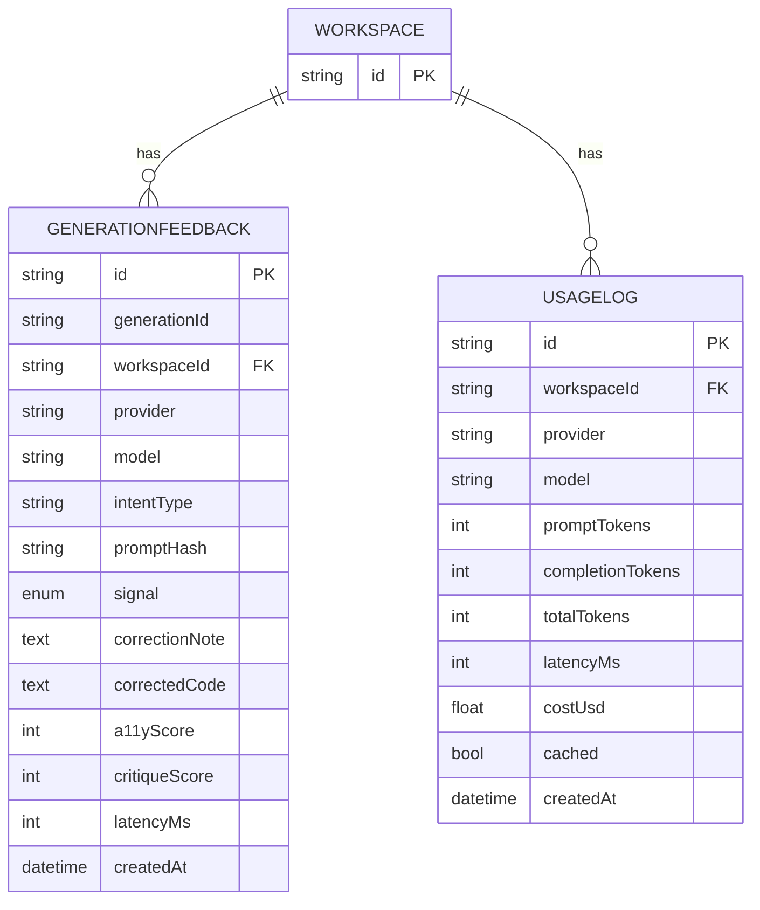

**Diagram sources**
- [schema.prisma:137-154](file://prisma/schema.prisma#L137-L154)
- [schema.prisma:112-126](file://prisma/schema.prisma#L112-L126)

**Section sources**
- [schema.prisma:137-154](file://prisma/schema.prisma#L137-L154)
- [schema.prisma:112-126](file://prisma/schema.prisma#L112-L126)

### Vector Embeddings Schema (ComponentEmbedding, FeedbackEmbedding)
- Keys and relations
  - ComponentEmbedding has a unique knowledgeId; FeedbackEmbedding has a unique feedbackId.
- Data types and constraints
  - Embedding fields are declared as Unsupported("vector(768)") in Prisma; raw SQL manages creation and indexing.
  - Indexes use IVFFlat with cosine operations for approximate nearest neighbor search.

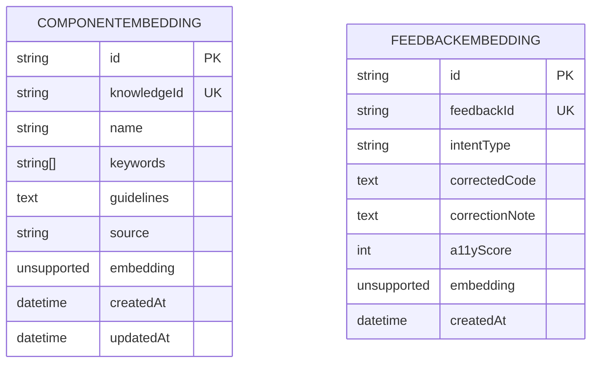

**Diagram sources**
- [schema.prisma:194-221](file://prisma/schema.prisma#L194-L221)

**Section sources**
- [schema.prisma:194-221](file://prisma/schema.prisma#L194-L221)
- [20260409100000_add_vector_embeddings/migration.sql:1-43](file://prisma/migrations/20260409100000_add_vector_embeddings/migration.sql#L1-L43)

### Migration Management Strategy
- Purpose and impact
  - Each migration file defines a discrete schema change and is applied in order. The lock file confirms the provider.
  - Migrations create tables, add indexes, and alter tables to evolve the schema safely.
- Migration sequence
  - Initial workspace settings and usage logging tables.
  - Addition of Project and ProjectVersion with foreign keys and unique indexes.
  - Vector embeddings tables with pgvector extension and IVFFlat indexes.
  - Component embedding source column for knowledge domain filtering.
  - Additional JSON metadata columns for project versioning.

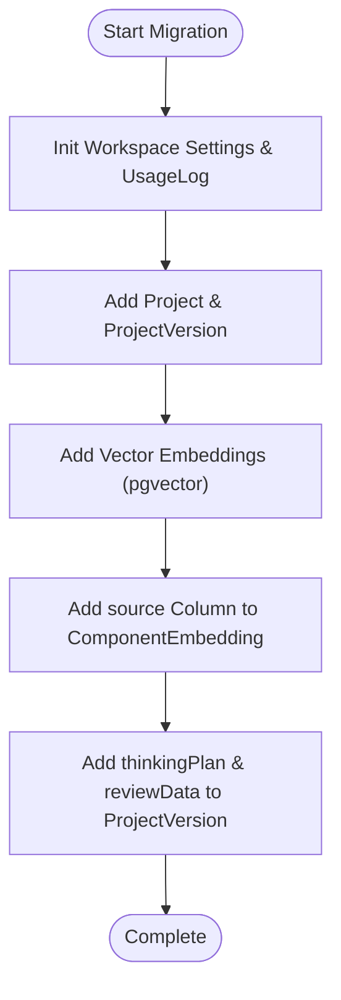

**Diagram sources**
- [20260403065359_init_workspace_settings/migration.sql:1-32](file://prisma/migrations/20260403065359_init_workspace_settings/migration.sql#L1-L32)
- [20260407120000_add_project_model/migration.sql:1-37](file://prisma/migrations/20260407120000_add_project_model/migration.sql#L1-L37)
- [20260409100000_add_vector_embeddings/migration.sql:1-43](file://prisma/migrations/20260409100000_add_vector_embeddings/migration.sql#L1-L43)
- [20260410000000_add_source_to_component_embedding/migration.sql:1-18](file://prisma/migrations/20260410000000_add_source_to_component_embedding/migration.sql#L1-L18)
- [20260410113000_add_thinking_review_metadata_to_project_version/migration.sql:1-5](file://prisma/migrations/20260410113000_add_thinking_review_metadata_to_project_version/migration.sql#L1-L5)

**Section sources**
- [20260403065359_init_workspace_settings/migration.sql:1-32](file://prisma/migrations/20260403065359_init_workspace_settings/migration.sql#L1-L32)
- [20260407120000_add_project_model/migration.sql:1-37](file://prisma/migrations/20260407120000_add_project_model/migration.sql#L1-L37)
- [20260409100000_add_vector_embeddings/migration.sql:1-43](file://prisma/migrations/20260409100000_add_vector_embeddings/migration.sql#L1-L43)
- [20260410000000_add_source_to_component_embedding/migration.sql:1-18](file://prisma/migrations/20260410000000_add_source_to_component_embedding/migration.sql#L1-L18)
- [20260410113000_add_thinking_review_metadata_to_project_version/migration.sql:1-5](file://prisma/migrations/20260410113000_add_thinking_review_metadata_to_project_version/migration.sql#L1-L5)
- [migration_lock.toml:1-4](file://prisma/migrations/migration_lock.toml#L1-L4)

### Database Provider Configuration and Environment Variables
- Provider and URLs
  - PostgreSQL provider configured with DATABASE_URL and DIRECT_URL environment variables.
  - The Prisma client is initialized with development logging enabled and production logging limited to errors.
- Connection handling
  - A singleton client prevents connection exhaustion in serverless environments.
  - Automatic reconnection logic retries transient Neon errors with a brief delay.

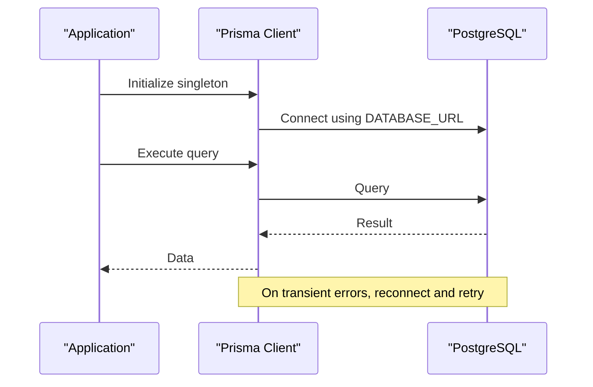

**Diagram sources**
- [schema.prisma:5-9](file://prisma/schema.prisma#L5-L9)
- [prisma.ts:1-70](file://lib/prisma.ts#L1-L70)

**Section sources**
- [schema.prisma:5-9](file://prisma/schema.prisma#L5-L9)
- [prisma.ts:1-70](file://lib/prisma.ts#L1-L70)

### NextAuth.js Integration
- Handler delegation
  - The NextAuth route exports GET and POST handlers from a shared configuration module.
- Authentication flow
  - Credentials provider validates a hashed password against environment configuration.
  - JWT strategy stores user info in tokens; session callback enriches session with user claims.
- Security and UX
  - Secret configured via AUTH_SECRET or NEXTAUTH_SECRET.
  - Login and error pages mapped to application routes.

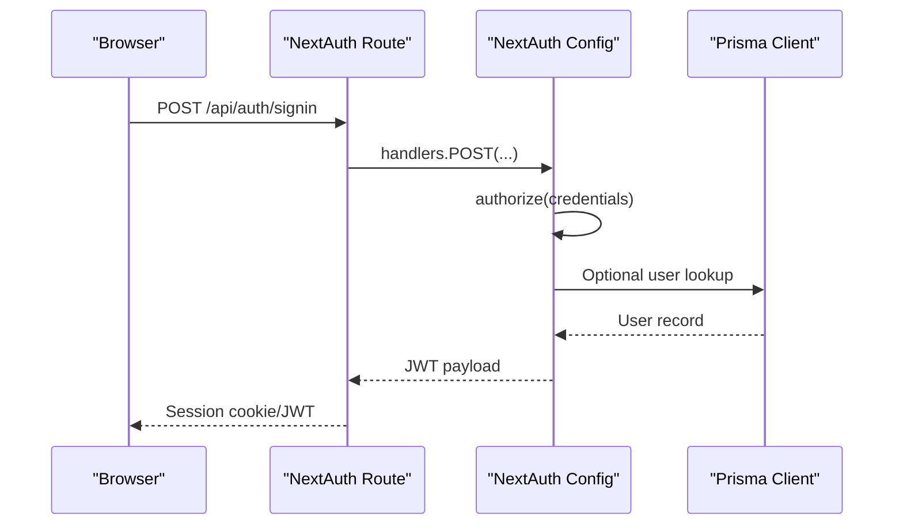

**Diagram sources**
- [route.ts:1-4](file://app/api/auth/[...nextauth]/route.ts#L1-L4)
- [auth.ts:1-87](file://lib/auth.ts#L1-L87)

**Section sources**
- [route.ts:1-4](file://app/api/auth/[...nextauth]/route.ts#L1-L4)
- [auth.ts:1-87](file://lib/auth.ts#L1-L87)

## Dependency Analysis
- Internal dependencies
  - Application code depends on lib/prisma.ts for the Prisma client.
  - NextAuth route depends on lib/auth.ts for configuration.
- External dependencies
  - Prisma client and adapter for NextAuth are included in package.json.
  - Neon serverless driver is used for PostgreSQL connectivity.

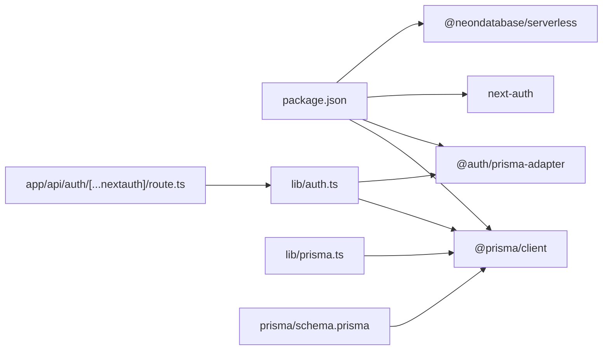

**Diagram sources**
- [package.json:13-44](file://package.json#L13-L44)
- [route.ts:1-4](file://app/api/auth/[...nextauth]/route.ts#L1-L4)
- [auth.ts:1-87](file://lib/auth.ts#L1-L87)
- [prisma.ts:1-70](file://lib/prisma.ts#L1-L70)
- [schema.prisma:1-9](file://prisma/schema.prisma#L1-L9)

**Section sources**
- [package.json:13-44](file://package.json#L13-L44)
- [route.ts:1-4](file://app/api/auth/[...nextauth]/route.ts#L1-L4)
- [auth.ts:1-87](file://lib/auth.ts#L1-L87)
- [prisma.ts:1-70](file://lib/prisma.ts#L1-L70)
- [schema.prisma:1-9](file://prisma/schema.prisma#L1-L9)

## Performance Considerations
- Connection pooling and singleton pattern
  - Use a singleton Prisma client to avoid exhausting the connection pool in serverless environments.
  - Configure DATABASE_URL with connection_limit=1 and pool_timeout=0 on Vercel to cap per-instance connections.
- Transient error resilience
  - Wrap operations that may encounter Neon idle disconnects with automatic reconnection logic.
- Vector similarity queries
  - Use IVFFlat indexes with cosine operations for approximate nearest neighbor search.
  - Tune lists parameter as data scales (e.g., increase from 10 to 100 for larger datasets).
- Indexing strategy
  - Leverage unique indexes for frequent lookups (e.g., provider/providerAccountId, sessionToken, workspace slug).
  - Add selective indexes on source for filtered retrieval in ComponentEmbedding.

[No sources needed since this section provides general guidance]

## Troubleshooting Guide
- Connection issues with Neon
  - Symptoms: “kind: Closed”, “Connection closed”, “connection timeout”, “ECONNRESET”.
  - Resolution: Use the provided withReconnect wrapper to retry once after a short delay.
- Migration conflicts
  - Ensure migration_lock.toml reflects the PostgreSQL provider and that migrations are applied in order.
  - Verify that unique indexes and foreign keys are present after applying each migration.
- Authentication failures
  - Confirm AUTH_SECRET or NEXTAUTH_SECRET is set and that OWNER_PASSWORD_HASH is properly formatted.
  - Check that the Credentials provider receives non-empty email and password values.

**Section sources**
- [prisma.ts:36-70](file://lib/prisma.ts#L36-L70)
- [migration_lock.toml:1-4](file://prisma/migrations/migration_lock.toml#L1-L4)
- [auth.ts:11-87](file://lib/auth.ts#L11-L87)

## Conclusion
The Prisma configuration establishes a robust, multi-tenant architecture with clear entity relationships, safe migration practices, and performance-conscious design choices. The integration with NextAuth.js provides secure authentication, while the vector embedding schema supports scalable similarity search. Following the recommended patterns ensures reliable operation in serverless environments and maintainable schema evolution.

[No sources needed since this section summarizes without analyzing specific files]

## Appendices

### Common Queries and Data Access Patterns
- Authentication
  - Find user by email or account provider ID; validate session by sessionToken; verify token expiration.
- Multi-tenancy
  - List a user’s workspaces via WorkspaceMember; fetch workspace settings per provider; enforce role checks.
- Projects
  - Retrieve latest version of a project; enumerate versions ordered by timestamp; diff versions by linesChanged.
- Feedback and usage
  - Aggregate usage metrics by workspace/provider/model; filter feedback by signal or intent type.
- Vector similarity
  - Perform cosine similarity searches using IVFFlat indexes; filter by source for domain-specific retrieval.

[No sources needed since this section provides general guidance]