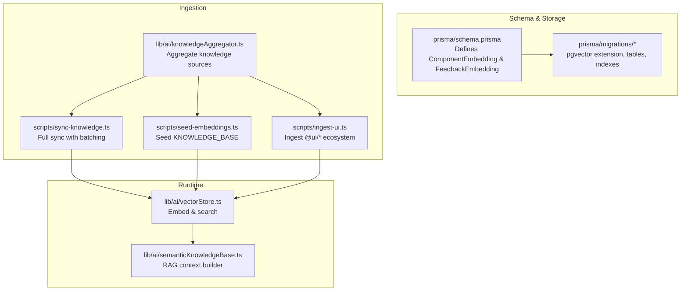
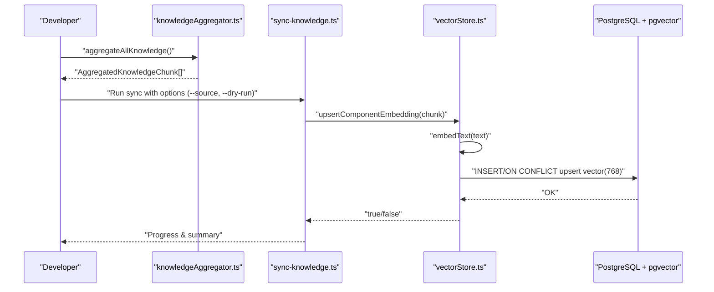
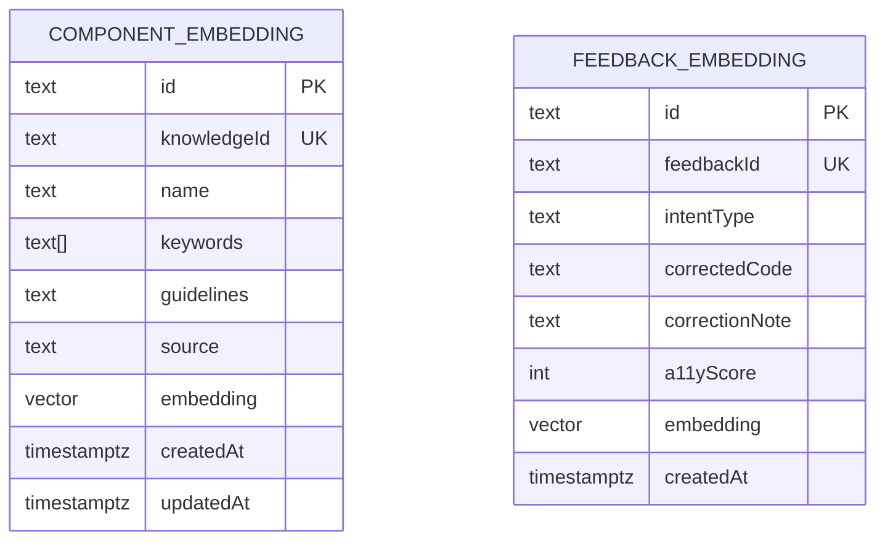
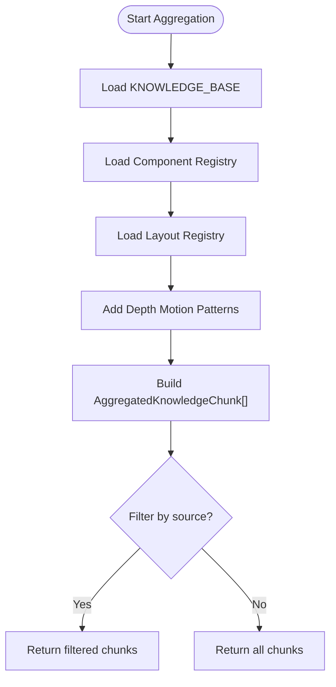
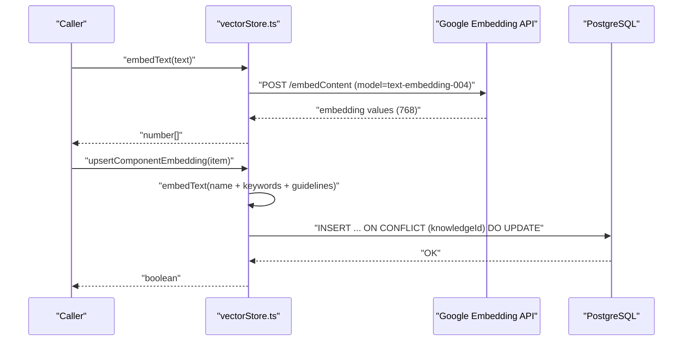
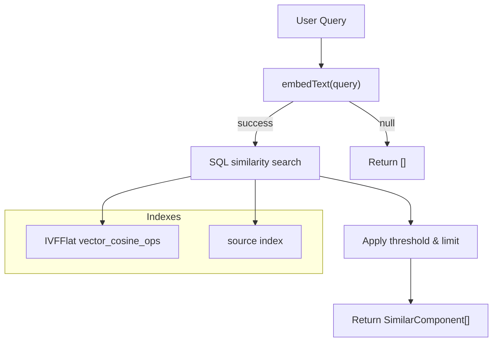
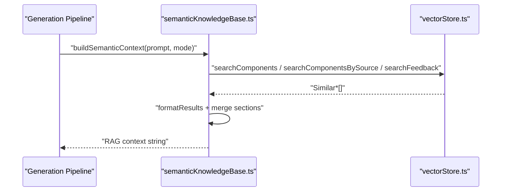
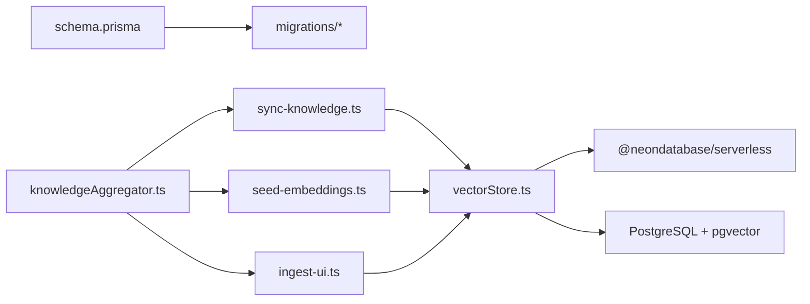

# Vector Embeddings & Knowledge Base

<cite>
**Referenced Files in This Document**
- [schema.prisma](file://prisma/schema.prisma)
- [migration.sql](file://prisma/migrations/20260409100000_add_vector_embeddings/migration.sql)
- [add_source_migration.sql](file://prisma/migrations/20260410000000_add_source_to_component_embedding/migration.sql)
- [knowledgeBase.ts](file://lib/ai/knowledgeBase.ts)
- [knowledgeAggregator.ts](file://lib/ai/knowledgeAggregator.ts)
- [vectorStore.ts](file://lib/ai/vectorStore.ts)
- [sync-knowledge.ts](file://scripts/sync-knowledge.ts)
- [seed-embeddings.ts](file://scripts/seed-embeddings.ts)
- [ingest-ui.ts](file://scripts/ingest-ui.ts)
- [semanticKnowledgeBase.ts](file://lib/ai/semanticKnowledgeBase.ts)
</cite>

## Table of Contents
1. [Introduction](#introduction)
2. [Project Structure](#project-structure)
3. [Core Components](#core-components)
4. [Architecture Overview](#architecture-overview)
5. [Detailed Component Analysis](#detailed-component-analysis)
6. [Dependency Analysis](#dependency-analysis)
7. [Performance Considerations](#performance-considerations)
8. [Troubleshooting Guide](#troubleshooting-guide)
9. [Conclusion](#conclusion)

## Introduction
This document explains the vector embeddings system and semantic knowledge base that powers retrieval-augmented generation (RAG) in the AI-powered accessibility-first UI engine. It covers:
- pgvector integration with PostgreSQL for storing and querying high-dimensional embeddings
- Embedding dimensions (768) and the text-embedding-004 model used for vector generation
- ComponentEmbedding and FeedbackEmbedding models, their fields, and relationships
- Knowledge ingestion pipeline that converts UI components, templates, blueprints, and feedback into searchable embeddings
- Semantic search implementation, similarity scoring, and filtered retrieval using the source field
- Batch processing strategies and performance optimizations
- Examples of vector search queries, similarity threshold tuning, and integration with the AI generation pipeline

## Project Structure
The vector embeddings system spans schema definitions, ingestion scripts, and runtime vector operations:

**Diagram sources**
- [schema.prisma:189-222](file://prisma/schema.prisma#L189-L222)
- [migration.sql:1-43](file://prisma/migrations/20260409100000_add_vector_embeddings/migration.sql#L1-L43)
- [add_source_migration.sql:1-18](file://prisma/migrations/20260410000000_add_source_to_component_embedding/migration.sql#L1-L18)
- [knowledgeAggregator.ts:1-312](file://lib/ai/knowledgeAggregator.ts#L1-L312)
- [sync-knowledge.ts:1-192](file://scripts/sync-knowledge.ts#L1-L192)
- [seed-embeddings.ts:1-69](file://scripts/seed-embeddings.ts#L1-L69)
- [ingest-ui.ts:1-81](file://scripts/ingest-ui.ts#L1-L81)
- [vectorStore.ts:1-378](file://lib/ai/vectorStore.ts#L1-L378)
- [semanticKnowledgeBase.ts](file://lib/ai/semanticKnowledgeBase.ts)

**Section sources**
- [schema.prisma:189-222](file://prisma/schema.prisma#L189-L222)
- [migration.sql:1-43](file://prisma/migrations/20260409100000_add_vector_embeddings/migration.sql#L1-L43)
- [add_source_migration.sql:1-18](file://prisma/migrations/20260410000000_add_source_to_component_embedding/migration.sql#L1-L18)
- [knowledgeAggregator.ts:1-312](file://lib/ai/knowledgeAggregator.ts#L1-L312)
- [sync-knowledge.ts:1-192](file://scripts/sync-knowledge.ts#L1-L192)
- [seed-embeddings.ts:1-69](file://scripts/seed-embeddings.ts#L1-L69)
- [ingest-ui.ts:1-81](file://scripts/ingest-ui.ts#L1-L81)
- [vectorStore.ts:1-378](file://lib/ai/vectorStore.ts#L1-L378)
- [semanticKnowledgeBase.ts](file://lib/ai/semanticKnowledgeBase.ts)

## Core Components
- ComponentEmbedding: Stores semantic chunks with knowledgeId, name, keywords, guidelines, source, and vector(768). Supports IVFFlat cosine similarity indexing and source-filtered retrieval.
- FeedbackEmbedding: Stores corrected user feedback with feedbackId, intentType, correctedCode, correctionNote, a11yScore, and vector(768). Enables retrieval of prior approved patterns.
- Knowledge aggregation: Converts structured knowledge sources (templates, registry, blueprints, motion patterns) into source-tagged semantic chunks.
- Embedding generation: Uses Google embedding APIs to produce normalized 768-dimension vectors.
- Search and filters: Cosine similarity search with configurable thresholds and source-domain filtering.

**Section sources**
- [schema.prisma:194-221](file://prisma/schema.prisma#L194-L221)
- [migration.sql:4-42](file://prisma/migrations/20260409100000_add_vector_embeddings/migration.sql#L4-L42)
- [add_source_migration.sql:5-17](file://prisma/migrations/20260410000000_add_source_to_component_embedding/migration.sql#L5-L17)
- [vectorStore.ts:25-26](file://lib/ai/vectorStore.ts#L25-L26)
- [vectorStore.ts:109-116](file://lib/ai/vectorStore.ts#L109-L116)
- [vectorStore.ts:267-273](file://lib/ai/vectorStore.ts#L267-L273)

## Architecture Overview
The system integrates ingestion, storage, and retrieval:

**Diagram sources**
- [knowledgeAggregator.ts:267-289](file://lib/ai/knowledgeAggregator.ts#L267-L289)
- [sync-knowledge.ts:75-168](file://scripts/sync-knowledge.ts#L75-L168)
- [vectorStore.ts:124-155](file://lib/ai/vectorStore.ts#L124-L155)

## Detailed Component Analysis

### pgvector Schema and Indexes
- Tables: ComponentEmbedding and FeedbackEmbedding with vector(768) columns.
- Indexes: IVFFlat with vector_cosine_ops and lists=10; source index for filtered retrieval.
- Extension: vector extension enabled via migration.

**Diagram sources**
- [schema.prisma:194-221](file://prisma/schema.prisma#L194-L221)
- [migration.sql:5-32](file://prisma/migrations/20260409100000_add_vector_embeddings/migration.sql#L5-L32)
- [add_source_migration.sql:5-17](file://prisma/migrations/20260410000000_add_source_to_component_embedding/migration.sql#L5-L17)

**Section sources**
- [schema.prisma:189-222](file://prisma/schema.prisma#L189-L222)
- [migration.sql:1-43](file://prisma/migrations/20260409100000_add_vector_embeddings/migration.sql#L1-L43)
- [add_source_migration.sql:1-18](file://prisma/migrations/20260410000000_add_source_to_component_embedding/migration.sql#L1-L18)

### Knowledge Aggregation and Ingestion
- Sources: template (manual KNOWLEDGE_BASE), registry (component registry), blueprint (layout registry), motion (depth UI patterns).
- Chunk format: id (source:slug), source, name, keywords, content (structured prose).
- Scripts:
  - sync-knowledge.ts: full sync with batching, optional dry-run and source filter.
  - seed-embeddings.ts: one-time seeding of KNOWLEDGE_BASE.
  - ingest-ui.ts: reads compiled UI ecosystem JSON and ingests component code as guidelines.

**Diagram sources**
- [knowledgeAggregator.ts:267-289](file://lib/ai/knowledgeAggregator.ts#L267-L289)
- [sync-knowledge.ts:75-78](file://scripts/sync-knowledge.ts#L75-L78)
- [seed-embeddings.ts:29-55](file://scripts/seed-embeddings.ts#L29-L55)
- [ingest-ui.ts:24-74](file://scripts/ingest-ui.ts#L24-L74)

**Section sources**
- [knowledgeAggregator.ts:39-47](file://lib/ai/knowledgeAggregator.ts#L39-L47)
- [knowledgeAggregator.ts:55-63](file://lib/ai/knowledgeAggregator.ts#L55-L63)
- [knowledgeAggregator.ts:73-123](file://lib/ai/knowledgeAggregator.ts#L73-L123)
- [knowledgeAggregator.ts:130-165](file://lib/ai/knowledgeAggregator.ts#L130-L165)
- [knowledgeAggregator.ts:174-257](file://lib/ai/knowledgeAggregator.ts#L174-L257)
- [sync-knowledge.ts:75-168](file://scripts/sync-knowledge.ts#L75-L168)
- [seed-embeddings.ts:29-55](file://scripts/seed-embeddings.ts#L29-L55)
- [ingest-ui.ts:24-74](file://scripts/ingest-ui.ts#L24-L74)

### Embedding Generation and Upsert
- Embedding model: text-embedding-004 (fallback to gemini-embedding-001).
- Dimensions: 768.
- Upsert logic: embeds concatenated name + keywords + guidelines; stores vector literal; upserts by knowledgeId.
- Feedback embedding: embeds intent + correction note + code snippet; upserts by feedbackId.

**Diagram sources**
- [vectorStore.ts:49-97](file://lib/ai/vectorStore.ts#L49-L97)
- [vectorStore.ts:124-155](file://lib/ai/vectorStore.ts#L124-L155)
- [vectorStore.ts:281-318](file://lib/ai/vectorStore.ts#L281-L318)

**Section sources**
- [vectorStore.ts:25-26](file://lib/ai/vectorStore.ts#L25-L26)
- [vectorStore.ts:49-97](file://lib/ai/vectorStore.ts#L49-L97)
- [vectorStore.ts:124-155](file://lib/ai/vectorStore.ts#L124-L155)
- [vectorStore.ts:281-318](file://lib/ai/vectorStore.ts#L281-L318)

### Semantic Search and Filtering
- Cosine similarity: 1 - (embedding <=> query_vector).
- Thresholds: configurable per source/type; defaults tuned for quality.
- Filters:
  - Global: topK and similarity threshold.
  - Domain-specific: searchComponentsBySource restricts to a source.
- Feedback search: retrieves similar prior corrections for RAG.

**Diagram sources**
- [vectorStore.ts:174-212](file://lib/ai/vectorStore.ts#L174-L212)
- [vectorStore.ts:223-263](file://lib/ai/vectorStore.ts#L223-L263)
- [vectorStore.ts:337-377](file://lib/ai/vectorStore.ts#L337-L377)

**Section sources**
- [vectorStore.ts:174-212](file://lib/ai/vectorStore.ts#L174-L212)
- [vectorStore.ts:223-263](file://lib/ai/vectorStore.ts#L223-L263)
- [vectorStore.ts:337-377](file://lib/ai/vectorStore.ts#L337-L377)

### RAG Integration and Threshold Tuning
- Thresholds:
  - Component/registry/blueprint: ~0.48–0.50
  - Feedback/repair: ~0.60–0.62
- Context builder: runs multiple searches concurrently and merges results into a single prompt block.
- Repair memory: leverages past mistakes to avoid repeating errors.

**Diagram sources**
- [semanticKnowledgeBase.ts](file://lib/ai/semanticKnowledgeBase.ts)
- [vectorStore.ts:174-212](file://lib/ai/vectorStore.ts#L174-L212)
- [vectorStore.ts:223-263](file://lib/ai/vectorStore.ts#L223-L263)
- [vectorStore.ts:337-377](file://lib/ai/vectorStore.ts#L337-L377)

**Section sources**
- [semanticKnowledgeBase.ts](file://lib/ai/semanticKnowledgeBase.ts)
- [vectorStore.ts:37-43](file://lib/ai/vectorStore.ts#L37-L43)

## Dependency Analysis
- Schema depends on pgvector extension and defines vector(768) as Unsupported in Prisma.
- Runtime vector operations use @neondatabase/serverless for raw SQL with vector operators.
- Ingestion scripts depend on environment variables for API keys and database URLs.
- Knowledge aggregation is decoupled from storage and can be executed independently.

**Diagram sources**
- [schema.prisma:189-222](file://prisma/schema.prisma#L189-L222)
- [migration.sql:1-43](file://prisma/migrations/20260409100000_add_vector_embeddings/migration.sql#L1-L43)
- [knowledgeAggregator.ts:25-29](file://lib/ai/knowledgeAggregator.ts#L25-L29)
- [sync-knowledge.ts:23-31](file://scripts/sync-knowledge.ts#L23-L31)
- [seed-embeddings.ts:19-21](file://scripts/seed-embeddings.ts#L19-L21)
- [ingest-ui.ts:3-4](file://scripts/ingest-ui.ts#L3-L4)
- [vectorStore.ts:20-39](file://lib/ai/vectorStore.ts#L20-L39)

**Section sources**
- [schema.prisma:189-222](file://prisma/schema.prisma#L189-L222)
- [migration.sql:1-43](file://prisma/migrations/20260409100000_add_vector_embeddings/migration.sql#L1-L43)
- [knowledgeAggregator.ts:25-29](file://lib/ai/knowledgeAggregator.ts#L25-L29)
- [sync-knowledge.ts:23-31](file://scripts/sync-knowledge.ts#L23-L31)
- [seed-embeddings.ts:19-21](file://scripts/seed-embeddings.ts#L19-L21)
- [ingest-ui.ts:3-4](file://scripts/ingest-ui.ts#L3-L4)
- [vectorStore.ts:20-39](file://lib/ai/vectorStore.ts#L20-L39)

## Performance Considerations
- Indexing: IVFFlat with vector_cosine_ops and lists=10 for fast ANN cosine similarity; increase lists as data grows.
- Batching: sync-knowledge.ts batches up to 5 concurrent embeddings to respect API rate limits.
- Throttling: seed-embeddings.ts and ingest-ui.ts throttle requests to avoid rate limits.
- Source filtering: pre-filter by source to reduce candidate set and improve precision.
- Threshold tuning: adjust thresholds per source/type to balance recall and relevance.
- Dimensionality: 768 dimensions enable strong semantic capture; keep input concise to manage token costs.

[No sources needed since this section provides general guidance]

## Troubleshooting Guide
- Missing API key: embedText returns null; ingestion gracefully skips and logs debug info.
- Missing DATABASE_URL: vectorStore throws early; ensure environment variable is set.
- Unexpected embedding shape: API may return wrong dimension; fallback model is attempted automatically.
- Search failures: caught and logged; returns empty results to maintain pipeline resilience.
- Dry-run mode: use --dry-run to preview what would be synced without writing to DB.

**Section sources**
- [vectorStore.ts:50-53](file://lib/ai/vectorStore.ts#L50-L53)
- [vectorStore.ts:35-39](file://lib/ai/vectorStore.ts#L35-L39)
- [vectorStore.ts:80-87](file://lib/ai/vectorStore.ts#L80-L87)
- [vectorStore.ts:207-211](file://lib/ai/vectorStore.ts#L207-L211)
- [sync-knowledge.ts:99-110](file://scripts/sync-knowledge.ts#L99-L110)

## Conclusion
The vector embeddings system provides a robust foundation for semantic search and RAG:
- pgvector-backed storage with IVFFlat indexes ensures scalable similarity search.
- A unified ingestion pipeline aggregates diverse knowledge sources into source-tagged semantic chunks.
- Runtime search supports global and domain-specific retrieval with tunable thresholds.
- Integration with the generation pipeline enhances code quality and consistency by reusing prior approved patterns and templates.

[No sources needed since this section summarizes without analyzing specific files]