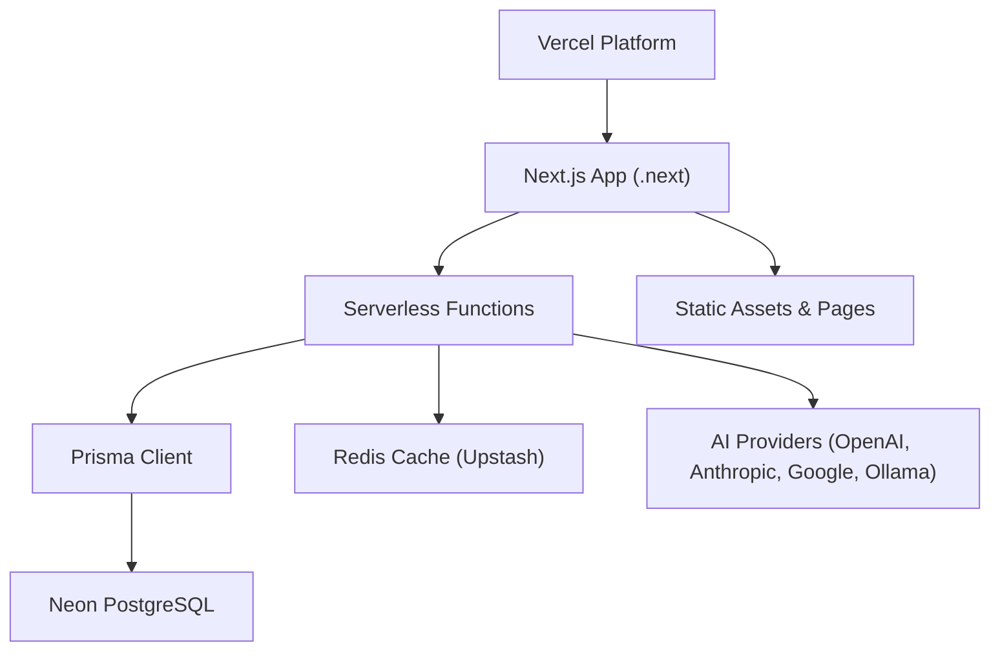
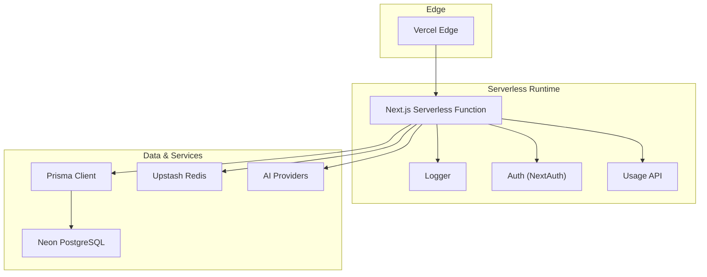
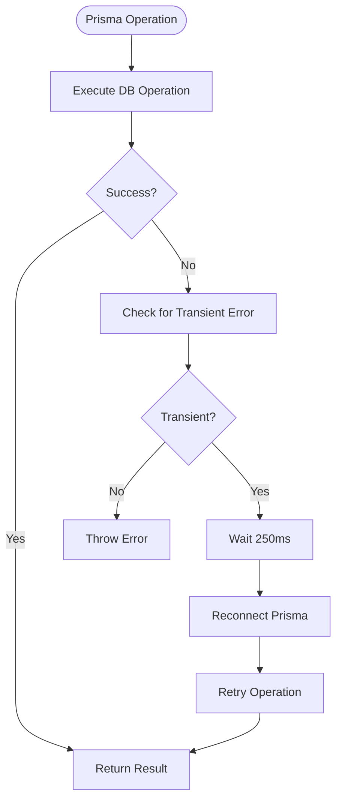
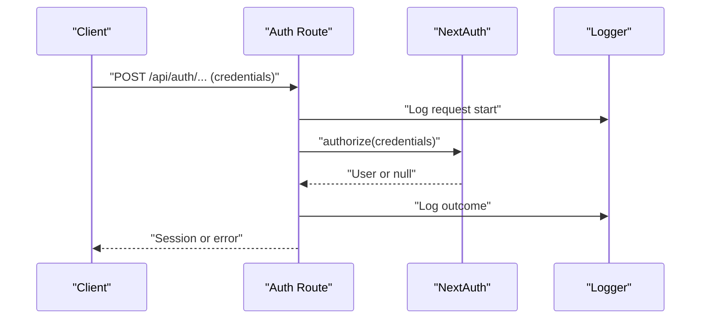
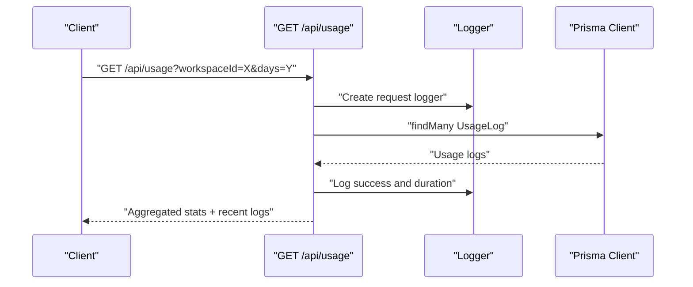
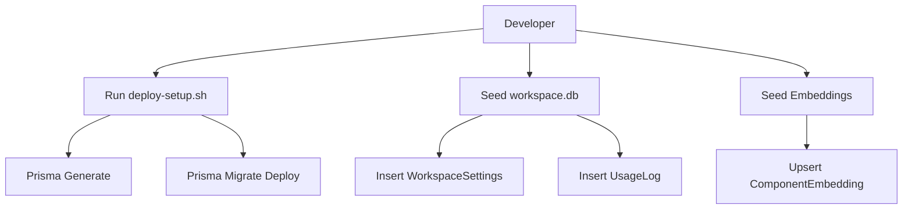
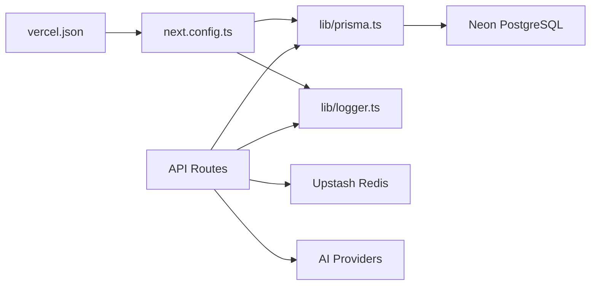

# Deployment & Operations

<cite>
**Referenced Files in This Document**
- [vercel.json](file://vercel.json)
- [package.json](file://package.json)
- [next.config.ts](file://next.config.ts)
- [prisma/schema.prisma](file://prisma/schema.prisma)
- [lib/prisma.ts](file://lib/prisma.ts)
- [lib/logger.ts](file://lib/logger.ts)
- [lib/auth.ts](file://lib/auth.ts)
- [app/api/auth/[...nextauth]/route.ts](file://app/api/auth/[...nextauth]/route.ts)
- [app/api/usage/route.ts](file://app/api/usage/route.ts)
- [scripts/deploy-setup.sh](file://scripts/deploy-setup.sh)
- [scripts/seed-workspace-db.mjs](file://scripts/seed-workspace-db.mjs)
- [scripts/seed-embeddings.ts](file://scripts/seed-embeddings.ts)
- [docs/ENV_SETUP.md](file://docs/ENV_SETUP.md)
</cite>

## Table of Contents
1. [Introduction](#introduction)
2. [Project Structure](#project-structure)
3. [Core Components](#core-components)
4. [Architecture Overview](#architecture-overview)
5. [Detailed Component Analysis](#detailed-component-analysis)
6. [Dependency Analysis](#dependency-analysis)
7. [Performance Considerations](#performance-considerations)
8. [Troubleshooting Guide](#troubleshooting-guide)
9. [Conclusion](#conclusion)
10. [Appendices](#appendices)

## Introduction
This document provides comprehensive deployment and operations guidance for the AI-powered UI engine. It covers Vercel deployment configuration, serverless optimization, environment variables, build and deployment pipelines, database migrations and seeding, monitoring and logging, health and operational metrics, scaling and high availability, CI/CD and security practices, and performance tuning/capacity planning recommendations.

## Project Structure
The project is a Next.js application configured for Vercel serverless deployments. Key deployment-related assets include:
- Vercel configuration for framework, build/install commands, output directory, regions, and security headers
- Next.js configuration enabling standalone output, externalized Prisma packages, React compiler, caching, and server actions limits
- Prisma schema defining PostgreSQL data sources and models
- Application API endpoints for authentication and usage analytics
- Scripts for initial deployment setup, workspace database seeding, and vector embeddings seeding
- Environment variables documentation for local and Vercel environments

**Diagram sources**
- [vercel.json:1-20](file://vercel.json#L1-L20)
- [next.config.ts:1-38](file://next.config.ts#L1-L38)
- [prisma/schema.prisma:5-9](file://prisma/schema.prisma#L5-L9)

**Section sources**
- [vercel.json:1-20](file://vercel.json#L1-L20)
- [next.config.ts:1-38](file://next.config.ts#L1-L38)
- [prisma/schema.prisma:1-222](file://prisma/schema.prisma#L1-L222)

## Core Components
- Vercel configuration orchestrates build and runtime behavior, including Prisma generation/migration, security headers, and output directory.
- Next.js configuration optimizes serverless performance via standalone output, externalized Prisma packages, React compiler, component caching, and server actions limits.
- Prisma client manages database connections with a global singleton and transient error handling for Neon serverless.
- Logging service provides structured request-scoped logs with timing and metadata.
- Authentication uses NextAuth with a credentials provider and bcrypt-based access control.
- Usage API aggregates and returns token usage and cost metrics with caching and request logging.

**Section sources**
- [vercel.json:1-20](file://vercel.json#L1-L20)
- [next.config.ts:1-38](file://next.config.ts#L1-L38)
- [lib/prisma.ts:1-70](file://lib/prisma.ts#L1-L70)
- [lib/logger.ts:1-89](file://lib/logger.ts#L1-L89)
- [lib/auth.ts:1-87](file://lib/auth.ts#L1-L87)
- [app/api/usage/route.ts:1-111](file://app/api/usage/route.ts#L1-L111)

## Architecture Overview
The deployment architecture centers on Vercel serverless functions serving a Next.js application. The backend integrates with:
- Neon PostgreSQL for relational data persistence
- Upstash Redis for caching
- AI providers for model inference
- Prisma for schema-driven database operations

**Diagram sources**
- [vercel.json:1-20](file://vercel.json#L1-L20)
- [next.config.ts:1-38](file://next.config.ts#L1-L38)
- [lib/prisma.ts:1-70](file://lib/prisma.ts#L1-L70)
- [lib/logger.ts:1-89](file://lib/logger.ts#L1-L89)
- [lib/auth.ts:1-87](file://lib/auth.ts#L1-L87)
- [app/api/usage/route.ts:1-111](file://app/api/usage/route.ts#L1-L111)

## Detailed Component Analysis

### Vercel Deployment Configuration
- Framework and build pipeline: Next.js framework, Prisma generation and migration, and Next build.
- Install and output: npm install and .next output directory.
- Regions: iad1 region selection.
- Security headers: X-Content-Type-Options, X-Frame-Options, X-XSS-Protection, Strict-Transport-Security for API routes.

Operational implications:
- Ensures Prisma client is generated and migrations are applied before building.
- Standardized security headers improve resilience against common web vulnerabilities.
- Region selection impacts latency; monitor and adjust per target markets.

**Section sources**
- [vercel.json:1-20](file://vercel.json#L1-L20)

### Next.js Serverless Optimization
- Standalone output reduces bundle size and improves cold start performance.
- Externalized Prisma packages prevent bundling and enable serverless compatibility.
- React Compiler and component caching improve rendering performance.
- Server Actions body size limit tuned for production workloads.
- Global security headers for all routes.

**Section sources**
- [next.config.ts:1-38](file://next.config.ts#L1-L38)

### Database and Schema Management
- Data sources: PostgreSQL via DATABASE_URL and DIRECT_URL.
- Models: Auth, multi-tenancy, workspace settings, usage logs, feedback, projects, and vector embeddings.
- Vector embeddings: pgvector support via raw SQL; embedding dimension 768.

Operational guidance:
- Apply migrations in CI/CD prior to deployment.
- Use DIRECT_URL for admin tasks and DATABASE_URL for application connections.
- Enable pgvector extension in Neon for vector similarity queries.

**Section sources**
- [prisma/schema.prisma:5-9](file://prisma/schema.prisma#L5-L9)
- [prisma/schema.prisma:11-222](file://prisma/schema.prisma#L11-L222)

### Prisma Client and Connection Resilience
- Global singleton pattern prevents connection exhaustion in serverless.
- Automatic reconnection wrapper handles transient Neon errors.
- Connection limit and pool timeout adjustments recommended for Vercel.

**Diagram sources**
- [lib/prisma.ts:36-70](file://lib/prisma.ts#L36-L70)

**Section sources**
- [lib/prisma.ts:1-70](file://lib/prisma.ts#L1-L70)

### Authentication and Access Control
- NextAuth with a credentials provider and bcrypt-based password verification.
- Owner credentials configured via environment variables.
- Trust host enabled for Vercel preview and production domains.

**Diagram sources**
- [app/api/auth/[...nextauth]/route.ts:1-4](file://app/api/auth/[...nextauth]/route.ts#L1-L4)
- [lib/auth.ts:11-87](file://lib/auth.ts#L11-L87)
- [lib/logger.ts:65-85](file://lib/logger.ts#L65-L85)

**Section sources**
- [lib/auth.ts:1-87](file://lib/auth.ts#L1-L87)
- [app/api/auth/[...nextauth]/route.ts:1-4](file://app/api/auth/[...nextauth]/route.ts#L1-L4)
- [lib/logger.ts:1-89](file://lib/logger.ts#L1-L89)

### Usage Analytics Endpoint
- Fetches usage logs within a date range, aggregates totals and breakdowns by provider/model, and returns recent logs.
- Uses request-scoped logging and caching hints.

**Diagram sources**
- [app/api/usage/route.ts:72-110](file://app/api/usage/route.ts#L72-L110)
- [lib/logger.ts:65-85](file://lib/logger.ts#L65-L85)
- [lib/prisma.ts:20-27](file://lib/prisma.ts#L20-L27)

**Section sources**
- [app/api/usage/route.ts:1-111](file://app/api/usage/route.ts#L1-L111)
- [lib/logger.ts:1-89](file://lib/logger.ts#L1-L89)
- [lib/prisma.ts:1-70](file://lib/prisma.ts#L1-L70)

### Monitoring and Logging
- Structured logging with request IDs, durations, and metadata.
- Console output optimized for parsing; supports info/warn/error/debug levels.
- Request-scoped logger tracks endpoint, request ID, and end-of-request timing.

**Section sources**
- [lib/logger.ts:1-89](file://lib/logger.ts#L1-L89)

### Database Migration and Seeding Procedures
- Initial setup script generates Prisma client and applies migrations to Neon.
- Workspace database seeding script inserts default workspace settings and usage log row into a local SQLite workspace database.
- Embeddings seeding script upserts knowledge base entries into pgvector with throttling and idempotency.

**Diagram sources**
- [scripts/deploy-setup.sh:1-19](file://scripts/deploy-setup.sh#L1-L19)
- [scripts/seed-workspace-db.mjs:1-96](file://scripts/seed-workspace-db.mjs#L1-L96)
- [scripts/seed-embeddings.ts:1-69](file://scripts/seed-embeddings.ts#L1-L69)

**Section sources**
- [scripts/deploy-setup.sh:1-19](file://scripts/deploy-setup.sh#L1-L19)
- [scripts/seed-workspace-db.mjs:1-96](file://scripts/seed-workspace-db.mjs#L1-L96)
- [scripts/seed-embeddings.ts:1-69](file://scripts/seed-embeddings.ts#L1-L69)

### Environment Variables and Secrets
- Local development and Vercel production variables documented, including database URLs, Redis, encryption secret, and AI provider keys.
- Owner credentials and encryption secret generation guidance provided.

**Section sources**
- [docs/ENV_SETUP.md:1-81](file://docs/ENV_SETUP.md#L1-L81)

## Dependency Analysis
- Vercel depends on Next.js build and Prisma migration steps.
- Next.js relies on Prisma client and external packages managed via serverless-compatible configuration.
- Application APIs depend on Prisma for data access, Redis for caching, and AI providers for inference.
- Logging is decoupled and used across API endpoints.

**Diagram sources**
- [vercel.json:1-20](file://vercel.json#L1-L20)
- [next.config.ts:1-38](file://next.config.ts#L1-L38)
- [lib/prisma.ts:1-70](file://lib/prisma.ts#L1-L70)
- [lib/logger.ts:1-89](file://lib/logger.ts#L1-L89)

**Section sources**
- [vercel.json:1-20](file://vercel.json#L1-L20)
- [next.config.ts:1-38](file://next.config.ts#L1-L38)
- [lib/prisma.ts:1-70](file://lib/prisma.ts#L1-L70)
- [lib/logger.ts:1-89](file://lib/logger.ts#L1-L89)

## Performance Considerations
- Cold starts: Standalone output and externalized Prisma reduce bundle size and improve cold start times.
- Connection pooling: Adjust pool sizes and timeouts; use connection limit parameters for Vercel serverless.
- Caching: Use Upstash Redis for frequently accessed data; leverage Next.js caching for static or semi-static content.
- Token budgets: Monitor usage via the usage endpoint to track costs and optimize model choices.
- Rate limiting: Embeddings seeding script includes throttling; apply similar patterns for API endpoints.

[No sources needed since this section provides general guidance]

## Troubleshooting Guide
Common deployment issues and resolutions:
- Prisma configuration errors: Ensure DATABASE_URL is present in environment variables; validate Prisma schema and connection strings.
- Neon connection drops: Use the automatic reconnection wrapper for transient errors; confirm connection limit parameters.
- Authentication failures: Verify OWNER_PASSWORD_HASH format and presence; confirm bcrypt hash validity.
- Missing environment variables: Review environment setup guide for required variables and generation steps.
- Build failures: Confirm Prisma generate and migrate steps precede Next build in both local and Vercel pipelines.

**Section sources**
- [lib/prisma.ts:36-70](file://lib/prisma.ts#L36-L70)
- [lib/auth.ts:25-59](file://lib/auth.ts#L25-L59)
- [docs/ENV_SETUP.md:1-81](file://docs/ENV_SETUP.md#L1-L81)

## Conclusion
The deployment and operations model leverages Vercel’s serverless platform with Next.js optimizations, robust Prisma connectivity, and structured logging. By following the outlined configuration, migration, and operational practices, teams can achieve reliable, secure, and scalable delivery of the AI-powered UI engine.

[No sources needed since this section summarizes without analyzing specific files]

## Appendices

### Health and Operational Metrics
- Usage endpoint provides aggregated token usage, cost, and request counts by provider/model.
- Request-scoped logging records endpoint, request ID, and duration for observability.
- Security headers are enforced at the platform and application levels.

**Section sources**
- [app/api/usage/route.ts:72-110](file://app/api/usage/route.ts#L72-L110)
- [lib/logger.ts:65-85](file://lib/logger.ts#L65-L85)
- [vercel.json:8-18](file://vercel.json#L8-L18)
- [next.config.ts:21-34](file://next.config.ts#L21-L34)

### Scaling and High Availability
- Vercel serverless scales automatically; configure regions for optimal latency.
- Use Upstash Redis for horizontal scalability of caches.
- Monitor usage trends and adjust model tiers to balance performance and cost.

[No sources needed since this section provides general guidance]

### CI/CD Pipeline Setup and Automated Testing
- Build pipeline: Prisma generate, Prisma migrate deploy, Playwright install, Next build.
- Install step: npm install.
- Automated testing: Jest and Playwright tests included in scripts and package.json.

**Section sources**
- [package.json:5-11](file://package.json#L5-L11)
- [vercel.json:3](file://vercel.json#L3)
- [next.config.ts:5](file://next.config.ts#L5)

### Operational Security Practices
- Encryption secret management and rotation.
- Environment variable fallbacks and precedence.
- Owner password hashing and credential provider configuration.

**Section sources**
- [docs/ENV_SETUP.md:20-43](file://docs/ENV_SETUP.md#L20-L43)
- [lib/auth.ts:5-10](file://lib/auth.ts#L5-L10)
- [lib/security/workspaceKeyService.ts:47-67](file://lib/security/workspaceKeyService.ts#L47-L67)

### Performance Tuning and Capacity Planning
- Tune server actions body size limits and component caching.
- Optimize database queries and indexes; monitor pgvector similarity queries.
- Plan for concurrency and connection limits; use connection limit parameters for Vercel.

**Section sources**
- [next.config.ts:13-18](file://next.config.ts#L13-L18)
- [lib/prisma.ts:14-15](file://lib/prisma.ts#L14-L15)