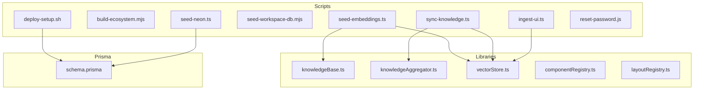
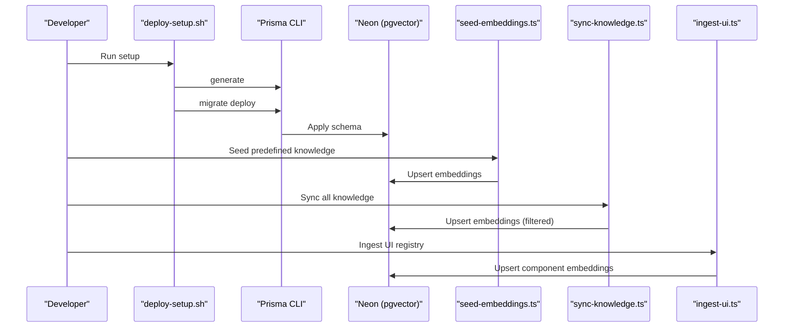
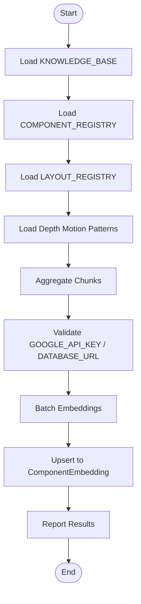
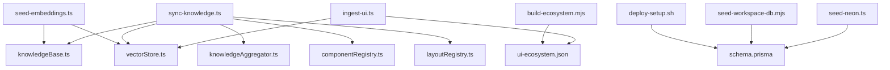

# Development Scripts

<cite>
**Referenced Files in This Document**
- [deploy-setup.sh](file://scripts/deploy-setup.sh)
- [build-ecosystem.mjs](file://scripts/build-ecosystem.mjs)
- [seed-embeddings.ts](file://scripts/seed-embeddings.ts)
- [seed-workspace-db.mjs](file://scripts/seed-workspace-db.mjs)
- [ingest-ui.ts](file://scripts/ingest-ui.ts)
- [sync-knowledge.ts](file://scripts/sync-knowledge.ts)
- [seed-neon.ts](file://scripts/seed-neon.ts)
- [reset-password.js](file://scripts/reset-password.js)
- [package.json](file://package.json)
- [knowledgeBase.ts](file://lib/ai/knowledgeBase.ts)
- [vectorStore.ts](file://lib/ai/vectorStore.ts)
- [knowledgeAggregator.ts](file://lib/ai/knowledgeAggregator.ts)
- [componentRegistry.ts](file://lib/intelligence/componentRegistry.ts)
- [layoutRegistry.ts](file://lib/intelligence/layoutRegistry.ts)
- [schema.prisma](file://prisma/schema.prisma)
</cite>

## Update Summary
**Changes Made**
- Updated script inventory to reflect current repository state
- Removed references to deleted development scripts (fix-colors.mjs, generate-hash.js, inspect-workspace-db.mjs, test-encryption.ts)
- Removed references to deleted temporary workspace data files (seed-workspace.sql, ts_feedback.txt, verify_multitenancy.ts)
- Added documentation for newly present scripts (seed-neon.ts, reset-password.js)
- Updated package.json scripts section to reflect current script availability

## Table of Contents
1. [Introduction](#introduction)
2. [Project Structure](#project-structure)
3. [Core Components](#core-components)
4. [Architecture Overview](#architecture-overview)
5. [Detailed Component Analysis](#detailed-component-analysis)
6. [Dependency Analysis](#dependency-analysis)
7. [Performance Considerations](#performance-considerations)
8. [Troubleshooting Guide](#troubleshooting-guide)
9. [Conclusion](#conclusion)
10. [Appendices](#appendices)

## Introduction
This document explains the development and operational scripts that power the AI-powered UI engine. It covers:
- Deployment setup for database provisioning
- Ecosystem build for integrating UI components into the Sandpack runtime
- Vector database seeding and ingestion for semantic search
- Knowledge synchronization across templates, registries, and motion patterns
- Workspace database management and password reset utilities
- Package.json scripts for common tasks
- Step-by-step execution guides, parameters, error handling, customization, and CI/CD integration

## Project Structure
The scripts are organized under the scripts directory and integrate with shared libraries for knowledge aggregation, vector storage, and registry metadata.

**Diagram sources**
- [deploy-setup.sh:1-19](file://scripts/deploy-setup.sh#L1-L19)
- [build-ecosystem.mjs:1-48](file://scripts/build-ecosystem.mjs#L1-L48)
- [seed-embeddings.ts:1-69](file://scripts/seed-embeddings.ts#L1-L69)
- [seed-workspace-db.mjs:1-96](file://scripts/seed-workspace-db.mjs#L1-L96)
- [ingest-ui.ts:1-81](file://scripts/ingest-ui.ts#L1-L81)
- [sync-knowledge.ts:1-192](file://scripts/sync-knowledge.ts#L1-L192)
- [seed-neon.ts:1-55](file://scripts/seed-neon.ts#L1-L55)
- [reset-password.js:1-27](file://scripts/reset-password.js#L1-L27)
- [knowledgeBase.ts:1-293](file://lib/ai/knowledgeBase.ts#L1-L293)
- [knowledgeAggregator.ts:1-312](file://lib/ai/knowledgeAggregator.ts#L1-L312)
- [vectorStore.ts:1-378](file://lib/ai/vectorStore.ts#L1-L378)
- [componentRegistry.ts:1-117](file://lib/intelligence/componentRegistry.ts#L1-L117)
- [layoutRegistry.ts:1-79](file://lib/intelligence/layoutRegistry.ts#L1-L79)
- [schema.prisma:1-222](file://prisma/schema.prisma#L1-L222)

**Section sources**
- [deploy-setup.sh:1-19](file://scripts/deploy-setup.sh#L1-L19)
- [build-ecosystem.mjs:1-48](file://scripts/build-ecosystem.mjs#L1-L48)
- [seed-embeddings.ts:1-69](file://scripts/seed-embeddings.ts#L1-L69)
- [seed-workspace-db.mjs:1-96](file://scripts/seed-workspace-db.mjs#L1-L96)
- [ingest-ui.ts:1-81](file://scripts/ingest-ui.ts#L1-L81)
- [sync-knowledge.ts:1-192](file://scripts/sync-knowledge.ts#L1-L192)
- [seed-neon.ts:1-55](file://scripts/seed-neon.ts#L1-L55)
- [reset-password.js:1-27](file://scripts/reset-password.js#L1-L27)
- [knowledgeBase.ts:1-293](file://lib/ai/knowledgeBase.ts#L1-L293)
- [knowledgeAggregator.ts:1-312](file://lib/ai/knowledgeAggregator.ts#L1-L312)
- [vectorStore.ts:1-378](file://lib/ai/vectorStore.ts#L1-L378)
- [componentRegistry.ts:1-117](file://lib/intelligence/componentRegistry.ts#L1-L117)
- [layoutRegistry.ts:1-79](file://lib/intelligence/layoutRegistry.ts#L1-L79)
- [schema.prisma:1-222](file://prisma/schema.prisma#L1-L222)

## Core Components
- Deployment setup script: prepares Prisma client, runs migrations, and prints next steps.
- Ecosystem build script: scans packages, compiles a UI registry map, and writes a JSON artifact for Sandpack.
- Vector database seeding: embeds predefined knowledge and upserts into pgvector.
- Workspace database seeding: initializes a local SQLite workspace database with defaults.
- UI ingestion: reads the built ecosystem JSON and ingests component code as embeddings.
- Knowledge synchronization: aggregates templates, registries, and motion patterns, then syncs to pgvector with filtering and dry-run support.
- Neon database seeding: creates default workspace, settings, and usage log entries.
- Password reset utility: resets owner password hash in .env configuration.
- Package.json scripts: dev, build, start, lint, test, and test coverage commands.

**Section sources**
- [deploy-setup.sh:1-19](file://scripts/deploy-setup.sh#L1-L19)
- [build-ecosystem.mjs:1-48](file://scripts/build-ecosystem.mjs#L1-L48)
- [seed-embeddings.ts:1-69](file://scripts/seed-embeddings.ts#L1-L69)
- [seed-workspace-db.mjs:1-96](file://scripts/seed-workspace-db.mjs#L1-L96)
- [ingest-ui.ts:1-81](file://scripts/ingest-ui.ts#L1-L81)
- [sync-knowledge.ts:1-192](file://scripts/sync-knowledge.ts#L1-L192)
- [seed-neon.ts:1-55](file://scripts/seed-neon.ts#L1-L55)
- [reset-password.js:1-27](file://scripts/reset-password.js#L1-L27)
- [package.json:1-68](file://package.json#L1-L68)

## Architecture Overview
The scripts orchestrate data and knowledge flows into the vector database for semantic search. The build script produces a JSON map consumed by ingestion and synchronization.

**Diagram sources**
- [deploy-setup.sh:1-19](file://scripts/deploy-setup.sh#L1-L19)
- [seed-embeddings.ts:1-69](file://scripts/seed-embeddings.ts#L1-L69)
- [sync-knowledge.ts:1-192](file://scripts/sync-knowledge.ts#L1-L192)
- [ingest-ui.ts:1-81](file://scripts/ingest-ui.ts#L1-L81)
- [schema.prisma:1-222](file://prisma/schema.prisma#L1-L222)

## Detailed Component Analysis

### Deployment Setup Script (deploy-setup.sh)
Purpose:
- Generate Prisma client
- Run database migrations against Neon
- Print next steps for local dev and auto-deployment

Execution:
- Requires DATABASE_URL and DIRECT_URL in .env.local
- Non-interactive failure on errors (set -e)

Outputs:
- Ready-to-use Neon database with latest schema

Operational notes:
- Run once after cloning
- After success, start dev server locally or push to GitHub for Vercel auto-deploy

**Section sources**
- [deploy-setup.sh:1-19](file://scripts/deploy-setup.sh#L1-L19)

### Ecosystem Build Script (build-ecosystem.mjs)
Purpose:
- Scan packages directory recursively
- Read TypeScript/TSX files
- Produce a JSON map with file paths as keys and contents as values
- Prefix keys with "/packages/" for Sandpack virtual filesystem alignment
- Write to lib/sandbox/ui-ecosystem.json

Processing logic:
- Directory traversal with fs.readdirSync and fs.statSync
- Content capture with fs.readFileSync
- Output file path resolution using path.join
- Console logging for progress and final count

Integration:
- Consumed by ingest-ui.ts to analyze component code and generate embeddings

**Section sources**
- [build-ecosystem.mjs:1-48](file://scripts/build-ecosystem.mjs#L1-L48)

### Database Management Scripts

#### Seed Embeddings (seed-embeddings.ts)
Purpose:
- Embed all entries from KNOWLEDGE_BASE and upsert into ComponentEmbedding
- Idempotent operation using ON CONFLICT DO UPDATE

Preconditions:
- pgvector extension enabled in Neon
- Migrations applied
- GOOGLE_API_KEY and DATABASE_URL set in .env

Behavior:
- Iterates KNOWLEDGE_BASE entries
- Calls upsertComponentEmbedding with knowledgeId, name, keywords, guidelines
- Throttles requests to respect free tier limits
- Reports success/failure counts
- Exits with non-zero status if any failures

**Section sources**
- [seed-embeddings.ts:1-69](file://scripts/seed-embeddings.ts#L1-L69)
- [knowledgeBase.ts:1-293](file://lib/ai/knowledgeBase.ts#L1-L293)
- [vectorStore.ts:1-378](file://lib/ai/vectorStore.ts#L1-L378)

#### Seed Workspace DB (seed-workspace-db.mjs)
Purpose:
- Initialize a local SQLite workspace database (workspace.db)
- Insert default WorkspaceSettings and a sample UsageLog row
- Supports reset via --reset flag

Execution:
- Writes SQL to a temporary file to avoid shell escaping issues
- Executes via npx prisma db execute with explicit --url pointing to workspace.db
- Logs generated ids and reminders to update encrypted API key

Error handling:
- Catches and logs failures
- Prints fallback SQL for manual execution

**Section sources**
- [seed-workspace-db.mjs:1-96](file://scripts/seed-workspace-db.mjs#L1-L96)

#### Ingest UI (ingest-ui.ts)
Purpose:
- Ingest the compiled UI ecosystem into pgvector
- Reads lib/sandbox/ui-ecosystem.json
- Extracts component names and exports from code
- Builds structured guidelines and upserts embeddings

Preconditions:
- OPENAI_API_KEY and DATABASE_URL set in .env
- build-ecosystem.mjs must have run to produce ui-ecosystem.json

Processing:
- Parses JSON file
- Filters TS/TSX entries
- Extracts named exports using regex
- Builds knowledgeId and keywords
- Calls upsertComponentEmbedding with source: registry
- Pauses between requests to respect rate limits

**Section sources**
- [ingest-ui.ts:1-81](file://scripts/ingest-ui.ts#L1-L81)
- [vectorStore.ts:1-378](file://lib/ai/vectorStore.ts#L1-L378)

#### Sync Knowledge (sync-knowledge.ts)
Purpose:
- Aggregate all internal knowledge sources and sync to pgvector
- Supports filtering by source, dry-run, and verbose modes

Inputs:
- --source=<template|registry|blueprint|motion>
- --dry-run
- --verbose

Processing:
- Aggregates KNOWLEDGE_BASE, COMPONENT_REGISTRY, LAYOUT_REGISTRY, and motion patterns
- Validates environment (GOOGLE_API_KEY or GEMINI_API_KEY, DATABASE_URL)
- Batches embeddings with concurrency and brief pauses
- Tracks success, failed, and skipped counts
- Reports progress and final summary

**Section sources**
- [sync-knowledge.ts:1-192](file://scripts/sync-knowledge.ts#L1-L192)
- [knowledgeAggregator.ts:1-312](file://lib/ai/knowledgeAggregator.ts#L1-L312)
- [knowledgeBase.ts:1-293](file://lib/ai/knowledgeBase.ts#L1-L293)
- [componentRegistry.ts:1-117](file://lib/intelligence/componentRegistry.ts#L1-L117)
- [layoutRegistry.ts:1-79](file://lib/intelligence/layoutRegistry.ts#L1-L79)
- [vectorStore.ts:1-378](file://lib/ai/vectorStore.ts#L1-L378)

#### Seed Neon (seed-neon.ts)
Purpose:
- Seed the Neon PostgreSQL database with default workspace, settings, and usage log
- Creates baseline data for development and testing

Execution:
- Uses Prisma Client to upsert workspace and settings
- Creates a baseline usage log entry for performance metrics
- Provides idempotent operations with upsert patterns

**Section sources**
- [seed-neon.ts:1-55](file://scripts/seed-neon.ts#L1-L55)

#### Reset Password (reset-password.js)
Purpose:
- Reset owner password hash in .env configuration
- Useful for development environment setup and testing

Execution:
- Reads .env file content
- Replaces password hash with bcrypt hash for 'password123'
- Adds OWNER_PASSWORD_HASH if not present
- Extracts and displays associated email for user reference

**Section sources**
- [reset-password.js:1-27](file://scripts/reset-password.js#L1-L27)

### Knowledge Aggregation and Vector Store

**Diagram sources**
- [sync-knowledge.ts:53-186](file://scripts/sync-knowledge.ts#L53-L186)
- [knowledgeAggregator.ts:267-289](file://lib/ai/knowledgeAggregator.ts#L267-L289)
- [vectorStore.ts:124-155](file://lib/ai/vectorStore.ts#L124-L155)

**Section sources**
- [knowledgeAggregator.ts:1-312](file://lib/ai/knowledgeAggregator.ts#L1-L312)
- [vectorStore.ts:1-378](file://lib/ai/vectorStore.ts#L1-L378)

## Dependency Analysis

**Diagram sources**
- [seed-embeddings.ts:19-21](file://scripts/seed-embeddings.ts#L19-L21)
- [sync-knowledge.ts:24-30](file://scripts/sync-knowledge.ts#L24-L30)
- [ingest-ui.ts:1-4](file://scripts/ingest-ui.ts#L1-L4)
- [deploy-setup.sh:8-12](file://scripts/deploy-setup.sh#L8-L12)
- [seed-workspace-db.mjs:79-85](file://scripts/seed-workspace-db.mjs#L79-L85)
- [seed-neon.ts:2-4](file://scripts/seed-neon.ts#L2-L4)
- [build-ecosystem.mjs:44-45](file://scripts/build-ecosystem.mjs#L44-L45)

**Section sources**
- [seed-embeddings.ts:19-21](file://scripts/seed-embeddings.ts#L19-L21)
- [sync-knowledge.ts:24-30](file://scripts/sync-knowledge.ts#L24-L30)
- [ingest-ui.ts:1-4](file://scripts/ingest-ui.ts#L1-L4)
- [deploy-setup.sh:8-12](file://scripts/deploy-setup.sh#L8-L12)
- [seed-workspace-db.mjs:79-85](file://scripts/seed-workspace-db.mjs#L79-L85)
- [seed-neon.ts:2-4](file://scripts/seed-neon.ts#L2-L4)
- [build-ecosystem.mjs:44-45](file://scripts/build-ecosystem.mjs#L44-L45)

## Performance Considerations
- Rate limiting: seed-embeddings.ts throttles to 100ms per request; ingest-ui.ts waits 200ms; sync-knowledge.ts batches with 250ms pauses between batches.
- Embedding model fallback: vectorStore.ts tries multiple model IDs for compatibility.
- Dry-run mode: sync-knowledge.ts allows validating what would be synced without DB writes.
- Batch sizes: sync-knowledge.ts uses a small batch size to avoid API rate limits.
- Environment checks: scripts validate required API keys and database URLs early to fail fast.
- Idempotent operations: seed-embeddings.ts and seed-neon.ts use upsert patterns to prevent duplicate data.

## Troubleshooting Guide

Common issues and resolutions:
- Missing environment variables:
  - GOOGLE_API_KEY or GEMINI_API_KEY required for embeddings
  - DATABASE_URL required for pgvector writes
  - OPENAI_API_KEY required for ingest-ui.ts
  - DATABASE_URL and DIRECT_URL required for deploy-setup.sh
- Prisma client generation fails:
  - Ensure Prisma is installed and run npx prisma generate
- Migration errors:
  - Confirm DATABASE_URL points to a reachable Neon instance
  - Apply migrations with npx prisma migrate deploy
- Embedding failures:
  - Check API key validity and quota
  - Review throttling and retry logic
- Workspace DB seeding:
  - If prisma db execute fails, manually run the printed SQL in an SQLite client
- Neon seeding issues:
  - Ensure Prisma Client is properly configured
  - Verify database connectivity and permissions
- Password reset failures:
  - Check .env file permissions
  - Ensure .env file exists and is writable
- Permission denied or invalid path:
  - Ensure file paths exist and are readable/writable

**Section sources**
- [seed-embeddings.ts:15-16](file://scripts/seed-embeddings.ts#L15-L16)
- [seed-embeddings.ts:59-62](file://scripts/seed-embeddings.ts#L59-L62)
- [sync-knowledge.ts:99-110](file://scripts/sync-knowledge.ts#L99-L110)
- [ingest-ui.ts:15-22](file://scripts/ingest-ui.ts#L15-L22)
- [deploy-setup.sh:4](file://scripts/deploy-setup.sh#L4)
- [seed-workspace-db.mjs:90-95](file://scripts/seed-workspace-db.mjs#L90-L95)
- [seed-neon.ts:1-55](file://scripts/seed-neon.ts#L1-L55)
- [reset-password.js:1-27](file://scripts/reset-password.js#L1-L27)

## Conclusion
These scripts provide a complete pipeline for preparing the environment, building the UI ecosystem, seeding and synchronizing knowledge, and maintaining semantic search capabilities. They are designed for idempotency, safety, and CI-friendly execution with clear error handling and dry-run options. The current script inventory includes essential development utilities while excluding deprecated or temporary files.

## Appendices

### Package.json Scripts
Commonly used commands:
- dev: starts the Next.js development server
- build: installs Playwright browsers, generates Prisma client, applies migrations, then builds the app
- start: starts the Next.js production server with PORT fallback
- lint: runs ESLint
- test: runs Jest tests
- test:coverage: runs Jest with coverage

**Section sources**
- [package.json:5-12](file://package.json#L5-L12)

### Execution Guides

- deploy-setup.sh
  - Steps:
    1. Ensure .env.local contains DATABASE_URL and DIRECT_URL
    2. Run the script
    3. On success, run npm run dev or push to GitHub for Vercel auto-deploy
  - Parameters: none
  - Error handling: exits on any failure due to set -e

- build-ecosystem.mjs
  - Steps:
    1. Ensure packages directory exists
    2. Run the script
    3. Verify lib/sandbox/ui-ecosystem.json is generated
  - Parameters: none
  - Error handling: throws if directories are missing; otherwise logs and exits

- seed-embeddings.ts
  - Steps:
    1. Ensure .env has GOOGLE_API_KEY and DATABASE_URL
    2. Run npx tsx scripts/seed-embeddings.ts
  - Parameters: none
  - Error handling: warns and continues; exits with non-zero if any failures

- seed-workspace-db.mjs
  - Steps:
    1. Run node scripts/seed-workspace-db.mjs for default seed
    2. Use --reset to clear existing rows before seeding
  - Parameters: --reset
  - Error handling: logs fallback SQL and exits on failure

- ingest-ui.ts
  - Steps:
    1. Ensure lib/sandbox/ui-ecosystem.json exists (after build-ecosystem.mjs)
    2. Ensure .env has OPENAI_API_KEY and DATABASE_URL
    3. Run npx tsx scripts/ingest-ui.ts
  - Parameters: none
  - Error handling: exits on missing environment variables; logs warnings per failure

- sync-knowledge.ts
  - Steps:
    1. Ensure .env has GOOGLE_API_KEY or GEMINI_API_KEY and DATABASE_URL
    2. Run npx tsx scripts/sync-knowledge.ts
  - Parameters:
    - --source=<template|registry|blueprint|motion>
    - --dry-run
    - --verbose
  - Error handling: validates environment early; reports counts and exits with non-zero if any failures

- seed-neon.ts
  - Steps:
    1. Ensure .env has DATABASE_URL and proper credentials
    2. Run node scripts/seed-neon.ts
  - Parameters: none
  - Error handling: logs seed results and exits with non-zero on failure

- reset-password.js
  - Steps:
    1. Ensure .env file exists and is writable
    2. Run node scripts/reset-password.js
  - Parameters: none
  - Error handling: logs password reset results and exits with non-zero on failure

**Section sources**
- [deploy-setup.sh:1-19](file://scripts/deploy-setup.sh#L1-L19)
- [build-ecosystem.mjs:1-48](file://scripts/build-ecosystem.mjs#L1-L48)
- [seed-embeddings.ts:1-69](file://scripts/seed-embeddings.ts#L1-L69)
- [seed-workspace-db.mjs:1-96](file://scripts/seed-workspace-db.mjs#L1-L96)
- [ingest-ui.ts:1-81](file://scripts/ingest-ui.ts#L1-L81)
- [sync-knowledge.ts:1-192](file://scripts/sync-knowledge.ts#L1-L192)
- [seed-neon.ts:1-55](file://scripts/seed-neon.ts#L1-L55)
- [reset-password.js:1-27](file://scripts/reset-password.js#L1-L27)

### CI/CD Integration Notes
- Use deploy-setup.sh in CI to prepare the database schema
- Run seed-embeddings.ts and sync-knowledge.ts with appropriate secrets
- Cache node_modules and Prisma binaries for faster builds
- Use --dry-run in pre-flight checks to validate knowledge aggregation
- For UI ingestion, ensure build-ecosystem.mjs runs before ingest-ui.ts
- Include seed-neon.ts for comprehensive database initialization in CI environments
- Monitor script exit codes for proper CI pipeline flow control