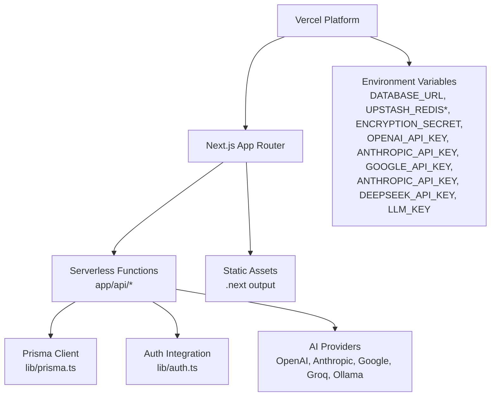
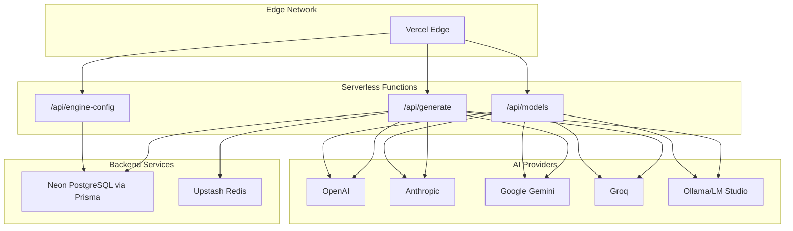
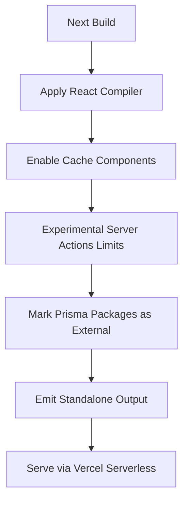
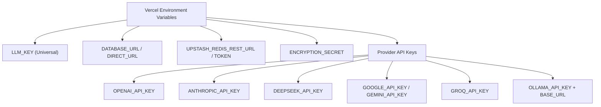
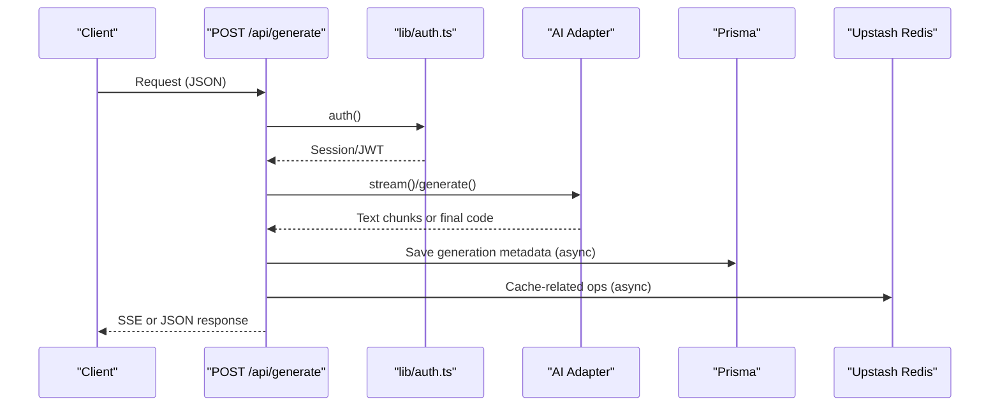
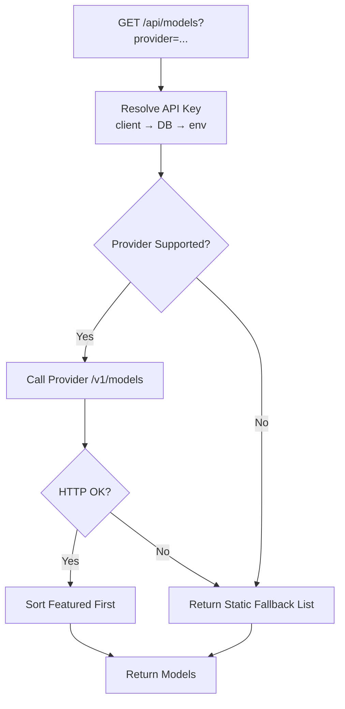
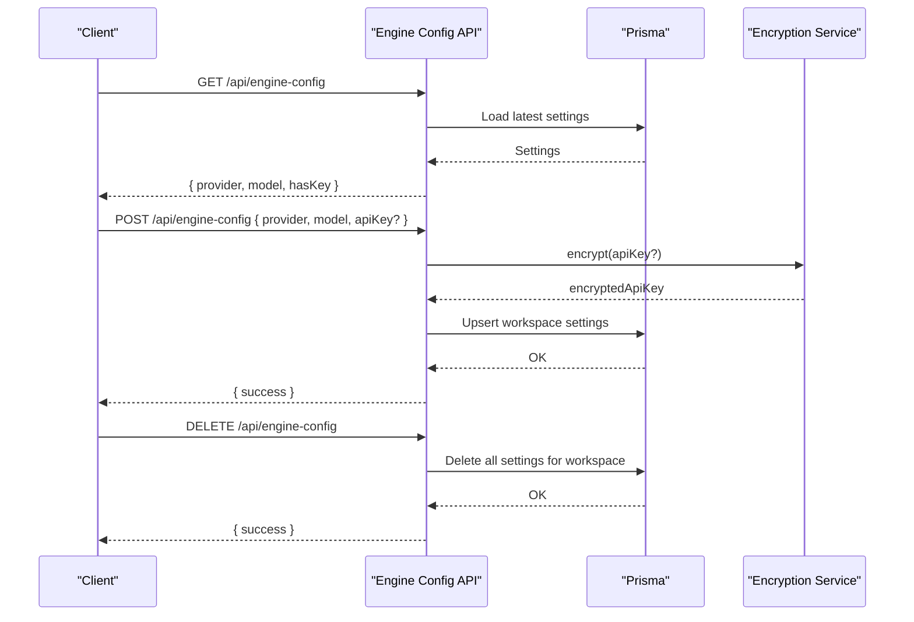
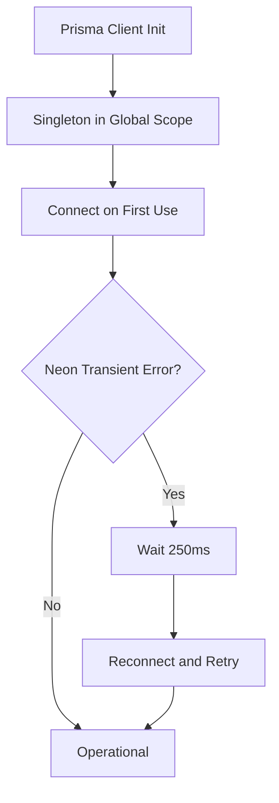
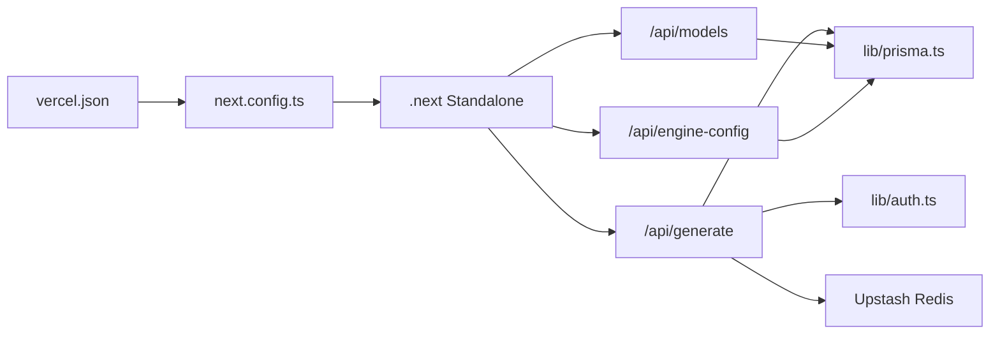

# Vercel Deployment

<cite>
**Referenced Files in This Document**
- [vercel.json](file://vercel.json)
- [next.config.ts](file://next.config.ts)
- [package.json](file://package.json)
- [lib/prisma.ts](file://lib/prisma.ts)
- [lib/auth.ts](file://lib/auth.ts)
- [app/api/generate/route.ts](file://app/api/generate/route.ts)
- [app/api/models/route.ts](file://app/api/models/route.ts)
- [app/api/engine-config/route.ts](file://app/api/engine-config/route.ts)
- [VERCEL_CONNECTION_FIX.md](file://VERCEL_CONNECTION_FIX.md)
- [lib/ai/resolveDefaultAdapter.ts](file://lib/ai/resolveDefaultAdapter.ts)
- [lib/ai/adapters/google.ts](file://lib/ai/adapters/google.ts)
- [lib/ai/adapters/openai.ts](file://lib/ai/adapters/openai.ts)
- [lib/ai/adapters/anthropic.ts](file://lib/ai/adapters/anthropic.ts)
- [lib/security/workspaceKeyService.ts](file://lib/security/workspaceKeyService.ts)
</cite>

## Update Summary
**Changes Made**
- Added comprehensive Vercel deployment troubleshooting guide covering environment variable configuration for all AI providers
- Updated environment variable reference section with detailed provider-specific configurations
- Enhanced troubleshooting section with practical solutions for connection errors
- Added provider priority order and universal key configuration guidance
- Included advanced error logging and diagnostic information

## Table of Contents
1. [Introduction](#introduction)
2. [Project Structure](#project-structure)
3. [Core Components](#core-components)
4. [Architecture Overview](#architecture-overview)
5. [Detailed Component Analysis](#detailed-component-analysis)
6. [Dependency Analysis](#dependency-analysis)
7. [Performance Considerations](#performance-considerations)
8. [Troubleshooting Guide](#troubleshooting-guide)
9. [Conclusion](#conclusion)
10. [Appendices](#appendices)

## Introduction
This document provides comprehensive guidance for deploying the AI-powered accessibility-first UI engine to Vercel. It covers Vercel configuration, Next.js serverless optimization, environment variable setup, deployment pipeline, performance strategies, scaling and edge networking, and operational troubleshooting. The system integrates AI model orchestration, secure workspace-scoped API key storage, and database connectivity optimized for Vercel's serverless runtime.

## Project Structure
The repository follows a Next.js App Router layout with API routes under app/api. Serverless functions are defined per route, enabling scalable, per-endpoint cold start and concurrency characteristics. The deployment configuration is centralized in vercel.json, while Next.js optimization is configured in next.config.ts. Environment variables for production are managed through Vercel's environment variable groups and individual provider configurations.



**Diagram sources**
- [vercel.json:1-20](file://vercel.json#L1-L20)
- [next.config.ts:1-38](file://next.config.ts#L1-L38)
- [lib/prisma.ts:1-70](file://lib/prisma.ts#L1-L70)
- [lib/auth.ts:1-87](file://lib/auth.ts#L1-L87)
- [VERCEL_CONNECTION_FIX.md:28-51](file://VERCEL_CONNECTION_FIX.md#L28-L51)

**Section sources**
- [vercel.json:1-20](file://vercel.json#L1-L20)
- [next.config.ts:1-38](file://next.config.ts#L1-L38)
- [package.json:1-68](file://package.json#L1-L68)

## Core Components
- Vercel configuration: framework detection, build/install commands, output directory, regions, and security headers for API routes.
- Next.js optimization: standalone output, externalized Prisma packages, React Compiler, component caching, and global security headers.
- Database and caching: Prisma singleton with automatic reconnection for Neon serverless; Upstash Redis for caching.
- Authentication: NextAuth with JWT sessions and trustHost for Vercel preview domains.
- AI provider orchestration: dynamic selection of provider/model with fallbacks and timeouts; workspace-scoped encrypted keys.

**Section sources**
- [vercel.json:1-20](file://vercel.json#L1-L20)
- [next.config.ts:1-38](file://next.config.ts#L1-L38)
- [lib/prisma.ts:1-70](file://lib/prisma.ts#L1-L70)
- [lib/auth.ts:1-87](file://lib/auth.ts#L1-L87)
- [VERCEL_CONNECTION_FIX.md:28-51](file://VERCEL_CONNECTION_FIX.md#L28-L51)

## Architecture Overview
The deployment architecture leverages Vercel's edge network and serverless functions. API routes handle generation, model discovery, and engine configuration. Prisma connects to Neon PostgreSQL, and Upstash Redis provides caching. Next.js generates a standalone output for minimal cold starts.



**Diagram sources**
- [app/api/generate/route.ts:1-440](file://app/api/generate/route.ts#L1-L440)
- [app/api/models/route.ts:1-457](file://app/api/models/route.ts#L1-L457)
- [app/api/engine-config/route.ts:1-154](file://app/api/engine-config/route.ts#L1-L154)
- [lib/prisma.ts:1-70](file://lib/prisma.ts#L1-L70)

## Detailed Component Analysis

### Vercel Configuration (vercel.json)
- Framework: Next.js detection enables optimized builds.
- Build command: Prisma client generation, migration deployment or push with acceptance of data loss, followed by Next.js build.
- Install command: npm install.
- Output directory: .next.
- Regions: iad1 (use "iad1" for US East).
- Security headers: X-Content-Type-Options, X-Frame-Options, X-XSS-Protection, Strict-Transport-Security applied to API routes.


**Diagram sources**
- [vercel.json:1-20](file://vercel.json#L1-L20)

**Section sources**
- [vercel.json:1-20](file://vercel.json#L1-L20)

### Next.js Serverless Optimization (next.config.ts)
- Output: standalone for smaller bundles and faster cold starts.
- External packages: Prisma client and Prisma are marked external to reduce function size.
- React Compiler and component caching enabled for performance.
- Experimental server actions: body size limit tuned for production.
- Global security headers for all routes.



**Diagram sources**
- [next.config.ts:1-38](file://next.config.ts#L1-L38)

**Section sources**
- [next.config.ts:1-38](file://next.config.ts#L1-L38)

### Environment Variables (Production)
Required environment variables for production with comprehensive provider configuration:

**Universal Configuration:**
- LLM_KEY: Universal API key that works with all providers (recommended approach)
- DATABASE_URL and DIRECT_URL: Neon PostgreSQL connection strings
- UPSTASH_REDIS_REST_URL and UPSTASH_REDIS_REST_TOKEN: Upstash Redis caching
- ENCRYPTION_SECRET: 32-character random secret for workspace-scoped key encryption

**Provider-Specific Keys:**
- **Groq**: GROQ_API_KEY (fastest, generous free tier)
- **Google**: GOOGLE_API_KEY or GEMINI_API_KEY (Gemini models)
- **Anthropic**: ANTHROPIC_API_KEY (Claude models)
- **OpenAI**: OPENAI_API_KEY (GPT models)
- **Ollama Cloud**: OLLAMA_API_KEY + OLLAMA_BASE_URL (cloud-hosted instances)

**Provider Priority Order** (from resolveDefaultAdapter.ts):
1. Groq (fastest, best free tier)
2. Google Gemini
3. Anthropic
4. OpenAI (last - quota exhausts quickly)
5. Ollama Cloud (cloud-hosted instances)



**Diagram sources**
- [VERCEL_CONNECTION_FIX.md:28-51](file://VERCEL_CONNECTION_FIX.md#L28-L51)
- [lib/ai/resolveDefaultAdapter.ts:44-56](file://lib/ai/resolveDefaultAdapter.ts#L44-L56)

**Section sources**
- [VERCEL_CONNECTION_FIX.md:28-51](file://VERCEL_CONNECTION_FIX.md#L28-L51)
- [lib/ai/resolveDefaultAdapter.ts:44-56](file://lib/ai/resolveDefaultAdapter.ts#L44-L56)

### API Routes and Serverless Behavior

#### Generation Pipeline (/api/generate)
- Streaming and non-streaming modes supported.
- Uses workspace-scoped adapters and provider selection.
- Includes timeouts and fallbacks to protect against long-running operations.
- Writes telemetry and logs for observability.



**Diagram sources**
- [app/api/generate/route.ts:1-440](file://app/api/generate/route.ts#L1-L440)
- [lib/auth.ts:1-87](file://lib/auth.ts#L1-L87)

**Section sources**
- [app/api/generate/route.ts:1-440](file://app/api/generate/route.ts#L1-L440)
- [lib/auth.ts:1-87](file://lib/auth.ts#L1-L87)

#### Model Discovery (/api/models)
- Resolves API keys from client, DB, or environment variables.
- Supports multiple providers with provider-specific fetchers and static fallbacks.
- Enforces short timeouts to keep responses responsive.



**Diagram sources**
- [app/api/models/route.ts:1-457](file://app/api/models/route.ts#L1-L457)

**Section sources**
- [app/api/models/route.ts:1-457](file://app/api/models/route.ts#L1-L457)

#### Engine Configuration (/api/engine-config)
- Manages workspace-scoped provider/model selection.
- Stores encrypted API keys in DB; never returns keys to clients.
- Provides GET, POST, and DELETE endpoints.



**Diagram sources**
- [app/api/engine-config/route.ts:1-154](file://app/api/engine-config/route.ts#L1-L154)

**Section sources**
- [app/api/engine-config/route.ts:1-154](file://app/api/engine-config/route.ts#L1-L154)

### Database and Caching Integration
- Prisma singleton with automatic reconnection for Neon serverless environments.
- Recommended connection limit and pool timeout adjustments in DATABASE_URL for Vercel.
- Upstash Redis used for caching and rate limiting.



**Diagram sources**
- [lib/prisma.ts:1-70](file://lib/prisma.ts#L1-L70)

**Section sources**
- [lib/prisma.ts:1-70](file://lib/prisma.ts#L1-L70)

## Dependency Analysis
- Vercel depends on Next.js build outputs and applies security headers.
- Next.js marks Prisma as external and emits a standalone output.
- API routes depend on Prisma for persistence and Upstash Redis for caching.
- Authentication relies on NextAuth with JWT and trustHost for Vercel preview domains.



**Diagram sources**
- [vercel.json:1-20](file://vercel.json#L1-L20)
- [next.config.ts:1-38](file://next.config.ts#L1-L38)
- [lib/prisma.ts:1-70](file://lib/prisma.ts#L1-L70)
- [lib/auth.ts:1-87](file://lib/auth.ts#L1-L87)

**Section sources**
- [vercel.json:1-20](file://vercel.json#L1-L20)
- [next.config.ts:1-38](file://next.config.ts#L1-L38)
- [lib/prisma.ts:1-70](file://lib/prisma.ts#L1-L70)
- [lib/auth.ts:1-87](file://lib/auth.ts#L1-L87)

## Performance Considerations
- Standalone output: reduces cold start time and minimizes function size.
- External Prisma packages: decreases function payload size.
- React Compiler and component caching: improves rendering performance.
- Security headers: applied globally for all routes.
- API timeouts: generation pipeline enforces per-phase budgets to avoid exceeding Vercel limits.
- Model listing: enforced short timeouts and static fallbacks for resilience.
- Caching: Upstash Redis for frequently accessed data.

## Troubleshooting Guide

### Comprehensive Vercel Deployment Troubleshooting

**Issue Summary**
Your Vercel deployment is showing "Connection error" for `/api/think` and `/api/classify` endpoints.

**Root Cause Analysis**
The error logs indicate:
```
[WARN] /api/think | Thinking plan generation failed — returning deterministic fallback plan
  error: "Thinking engine API error: Connection error."

[WARN] /api/classify | Classification failed
  error: "Classifier API error: Connection error."
```

This typically occurs when:
1. **API keys are not configured** in Vercel's environment variables
2. **Network connectivity issues** between Vercel and AI provider endpoints
3. **Provider API endpoints** are unreachable or changed

### Immediate Solutions

#### 1. Configure Environment Variables in Vercel
Go to your Vercel project settings → **Environment Variables** and add:

**Required (at least ONE):**
```bash
# Option 1: Groq (Recommended - fast, generous free tier)
GROQ_API_KEY=gsk_your_key_here

# Option 2: Google Gemini
GOOGLE_API_KEY=AIzaSy_your_key_here
# OR
GEMINI_API_KEY=AIzaSy_your_key_here

# Option 3: Anthropic
ANTHROPIC_API_KEY=sk-ant_your_key_here

# Option 4: OpenAI
OPENAI_API_KEY=sk-proj_your_key_here

# Option 5: Ollama Cloud (cloud-hosted instances)
OLLAMA_API_KEY=your_ollama_key_here
OLLAMA_BASE_URL=https://your-ollama-cloud-instance.com/v1

# 🌟 UNIVERSAL KEY - Works with ALL providers above
# Fill this ONE key and your UI Engine will work immediately
LLM_KEY=your_api_key_here
```

**How LLM_KEY Works:**
- If you set `LLM_KEY`, the engine automatically uses it with Groq (default provider)
- This is the quickest way to get your UI Engine running - just ONE key!
- You can still override with specific provider keys if needed

**Provider Priority Order** (from resolveDefaultAdapter.ts):
1. Groq (fastest, best free tier)
2. Google Gemini
3. Anthropic
4. OpenAI (last - quota exhausts quickly)
5. Ollama Cloud (cloud-hosted instances)

#### 2. Verify Environment Variables Are Set
After adding the variables to Vercel:
1. **Redeploy** your application (environment changes require a new deployment)
2. Check the deployment logs to confirm the variables are loaded
3. Test the endpoints again

#### 3. Check Vercel Function Logs
In Vercel dashboard:
1. Go to **Logs** → **Functions**
2. Look for logs from `[resolveDefaultAdapter]` and `[getWorkspaceAdapter]`
3. These will show which provider is being selected and if keys are found

**Expected successful logs:**
```
[resolveDefaultAdapter] Resolving adapter for purpose: CLASSIFIER
[resolveDefaultAdapter] ✓ Found GROQ_API_KEY, using provider: groq
[getWorkspaceAdapter] ✓ Using universal LLM_KEY for groq
```

**Error logs indicating missing keys:**
```
[resolveDefaultAdapter] ✗ No API keys found for purpose: CLASSIFIER
[getWorkspaceAdapter] ✗ No API key found for groq
```

### Enhanced Error Logging

I've updated the code to provide better diagnostic information:

**Changes Made:**
1. **Added timeout detection** to network error handling
2. **Enhanced error logging** with provider, model, and API key status
3. **Added request timeout constants** (30 seconds) for future timeout implementation

**Updated Files:**
- `lib/ai/intentClassifier.ts` - Better error logging
- `lib/ai/thinkingEngine.ts` - Better error logging

After redeploying, you'll see detailed error information like:
```
[intentClassifier] Classification failed for provider=groq, model=llama-3.3-70b-versatile:
{
  error: "Connection error.",
  provider: "groq",
  model: "llama-3.3-70b-versatile",
  workspaceId: "default",
  hasApiKey: false  // ← This tells you if the key is configured
}
```

### Advanced Troubleshooting

#### Check if Vercel Can Reach AI Providers
Vercel serverless functions should have outbound internet access, but you can verify:

1. **Test with a simple API route:**
   Create `app/api/test-connection/route.ts`:
   ```typescript
   import { NextResponse } from 'next/server';
   
   export async function GET() {
     try {
       const res = await fetch('https://api.groq.com/openai/v1/models', {
         headers: {
           'Authorization': `Bearer ${process.env.GROQ_API_KEY}`
         }
       });
       return NextResponse.json({ 
         status: res.status,
         ok: res.ok 
       });
     } catch (error) {
       return NextResponse.json({ 
         error: error.message 
       }, { status: 500 });
     }
   }
   ```

2. **Check Vercel's outbound networking:**
   - Vercel Pro/Enterprise: No restrictions
   - Vercel Hobby: May have rate limits on outbound requests

#### Fallback Behavior
Your app already has graceful fallbacks:
- **`/api/classify`**: Returns 400 error (but UI handles this with default intent)
- **`/api/think`**: Returns a deterministic fallback plan (line 66-68 in `route.ts`)

This means **the app will still work** even with connection errors, just with reduced intelligence.

### Prevention

#### 1. Use Vercel's Environment Variable Groups
Organize your variables:
- `production` - Production API keys
- `preview` - Staging/test keys
- `development` - Local development keys

#### 2. Monitor API Usage
Set up alerts for:
- API quota limits
- Rate limiting (429 errors)
- Connection failures

#### 3. Consider Vercel's Edge Functions
For better performance and reliability, consider moving these endpoints to Edge Functions:
```typescript
// In your route.ts file
export const runtime = 'edge';
```

Note: Edge Functions have different limitations (no Node.js APIs, smaller bundle size).

### Quick Fix Checklist
- [ ] Add at least one API key to Vercel environment variables (or just set `LLM_KEY`)
- [ ] For Ollama Cloud: Set both `OLLAMA_API_KEY` and `OLLAMA_BASE_URL`
- [ ] Redeploy the application (required for env var changes to take effect)
- [ ] Check Vercel function logs for `[resolveDefaultAdapter]` messages
- [ ] Test the `/api/classify` and `/api/think` endpoints
- [ ] Verify the fallback plan is being generated correctly if needed
- [ ] Monitor for recurring connection errors

### All 5 Supported Adapters

Your UI Engine supports **5 AI providers** out of the box:

| Provider | Env Variable | Base URL | Notes |
|----------|-------------|----------|-------|
| **Groq** | `GROQ_API_KEY` | Auto-configured | ⚡ Fastest, generous free tier |
| **Google** | `GOOGLE_API_KEY` or `GEMINI_API_KEY` | Auto-configured | 🚀 Gemini models |
| **Anthropic** | `ANTHROPIC_API_KEY` | Auto-configured | 🎯 Claude models |
| **OpenAI** | `OPENAI_API_KEY` | Auto-configured | 🌟 GPT models |
| **Ollama** | `OLLAMA_API_KEY` + `OLLAMA_BASE_URL` | Your cloud URL | ☁️ Cloud-hosted instances only |

### Need More Help?
If the issue persists after adding API keys:
1. Share the Vercel function logs showing `[getWorkspaceAdapter]` output
2. Check if your API key has the correct permissions/quotas
3. Verify the API key works locally first (`npm run dev`)
4. Consider trying a different provider (e.g., switch from OpenAI to Groq)
5. For Ollama Cloud: Ensure both `OLLAMA_API_KEY` and `OLLAMA_BASE_URL` are configured

**Section sources**
- [VERCEL_CONNECTION_FIX.md:1-213](file://VERCEL_CONNECTION_FIX.md#L1-L213)
- [vercel.json:1-20](file://vercel.json#L1-L20)
- [next.config.ts:1-38](file://next.config.ts#L1-L38)
- [lib/prisma.ts:1-70](file://lib/prisma.ts#L1-L70)
- [lib/auth.ts:1-87](file://lib/auth.ts#L1-L87)
- [app/api/models/route.ts:1-457](file://app/api/models/route.ts#L1-L457)
- [lib/ai/resolveDefaultAdapter.ts:44-56](file://lib/ai/resolveDefaultAdapter.ts#L44-L56)

## Conclusion
The deployment configuration aligns with Vercel's serverless model and Next.js best practices. By leveraging standalone output, external Prisma packages, and robust security headers, the system achieves fast cold starts and strong protections. The API routes are designed with timeouts and fallbacks to remain resilient under varying provider conditions. Proper environment variable configuration and caching enable reliable production performance.

The comprehensive troubleshooting guide addresses the most common deployment issues, particularly AI provider connection errors, with practical solutions and diagnostic information. The universal LLM_KEY configuration simplifies setup while maintaining flexibility for provider-specific customization.

## Appendices

### Environment Variable Reference
- **DATABASE_URL**: Neon Prisma connection string.
- **DIRECT_URL**: Neon direct connection string.
- **UPSTASH_REDIS_REST_URL**: Upstash Redis REST endpoint.
- **UPSTASH_REDIS_REST_TOKEN**: Upstash Redis token.
- **ENCRYPTION_SECRET**: 32-character random secret for encryption.
- **OPENAI_API_KEY**: OpenAI GPT models API key.
- **ANTHROPIC_API_KEY**: Anthropic Claude models API key.
- **DEEPSEEK_API_KEY**: DeepSeek models API key.
- **GOOGLE_API_KEY**: Google Gemini models API key.
- **GEMINI_API_KEY**: Alternative Google Gemini API key variable.
- **GROQ_API_KEY**: Fast Groq models API key.
- **OLLAMA_API_KEY**: Ollama Cloud API key.
- **OLLAMA_BASE_URL**: Ollama Cloud base URL for cloud-hosted instances.
- **LLM_KEY**: Universal API key that works with all providers.

### Provider Configuration Matrix

**Priority-Based Provider Detection:**
1. **Groq** - Primary recommendation for fastest performance
2. **Google Gemini** - High-quality models with good free tier
3. **Anthropic** - Strong reasoning capabilities
4. **OpenAI** - GPT models (deprioritized due to quota limitations)
5. **Ollama Cloud** - Cloud-hosted local models

**Adapter-Specific Configuration:**
- **GoogleAdapter**: Uses `GOOGLE_API_KEY` or `GEMINI_API_KEY` with auto-configured base URL
- **OpenAIAdapter**: Uses `OPENAI_API_KEY` with optional custom base URL support
- **AnthropicAdapter**: Uses `ANTHROPIC_API_KEY` with native API endpoint
- **GroqAdapter**: Uses `GROQ_API_KEY` with auto-configured base URL
- **OllamaAdapter**: Uses `OLLAMA_API_KEY` + `OLLAMA_BASE_URL` for cloud instances

**Section sources**
- [VERCEL_CONNECTION_FIX.md:28-51](file://VERCEL_CONNECTION_FIX.md#L28-L51)
- [lib/ai/resolveDefaultAdapter.ts:44-56](file://lib/ai/resolveDefaultAdapter.ts#L44-L56)
- [lib/ai/adapters/google.ts:28-33](file://lib/ai/adapters/google.ts#L28-L33)
- [lib/ai/adapters/openai.ts:53-56](file://lib/ai/adapters/openai.ts#L53-L56)
- [lib/ai/adapters/anthropic.ts:75-77](file://lib/ai/adapters/anthropic.ts#L75-L77)
- [lib/security/workspaceKeyService.ts:32-67](file://lib/security/workspaceKeyService.ts#L32-L67)