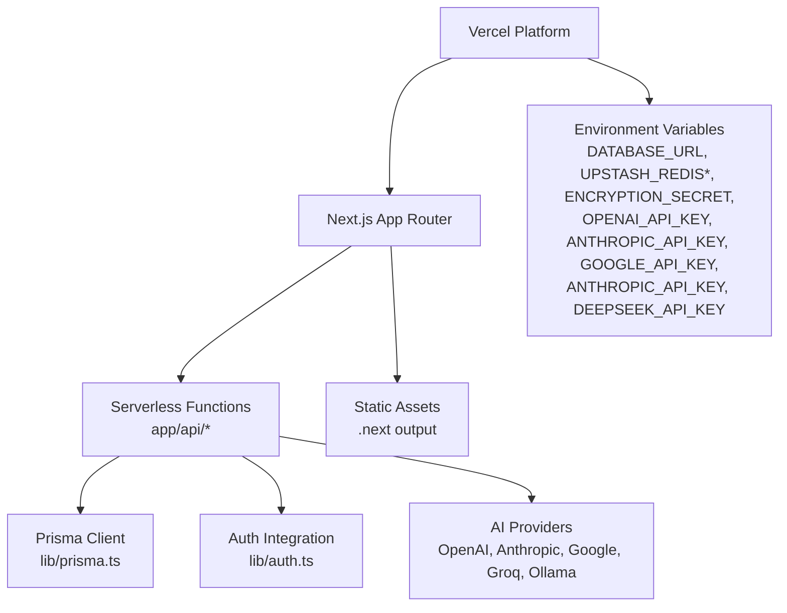
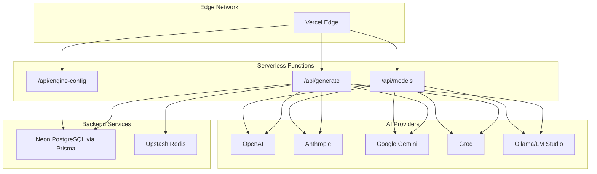
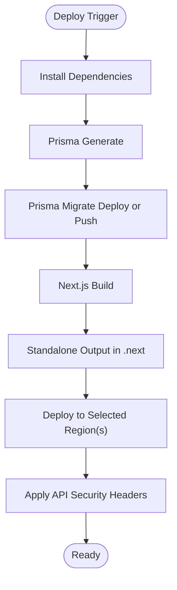
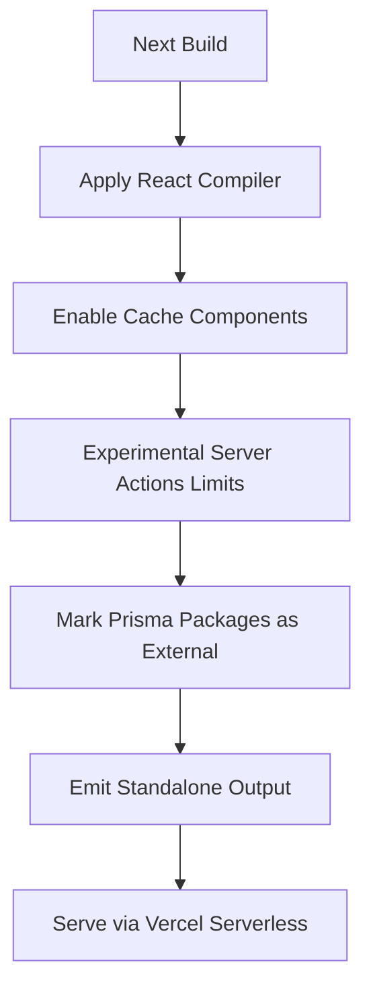
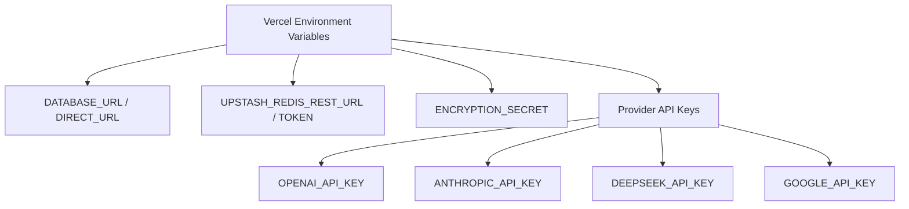
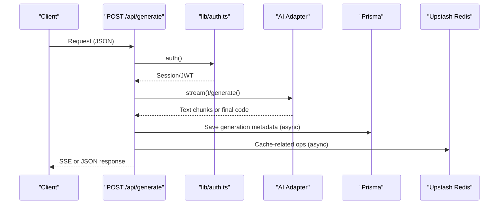
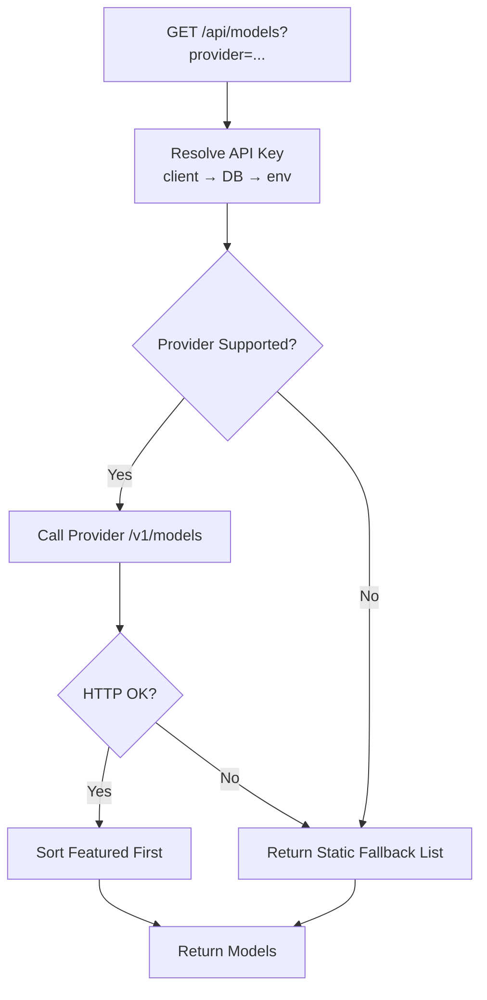
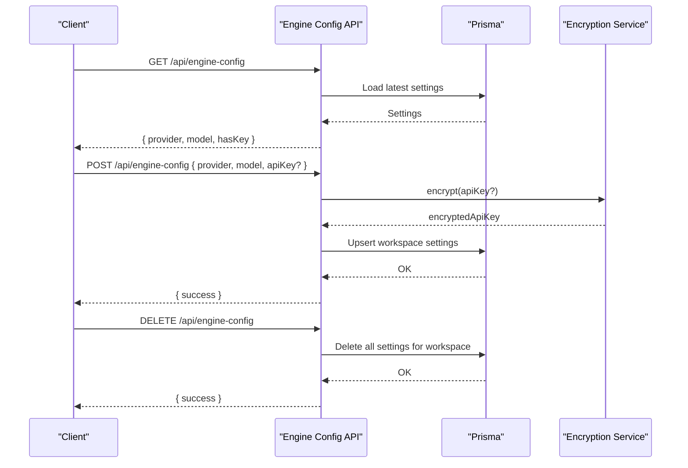
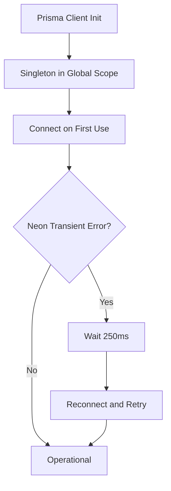
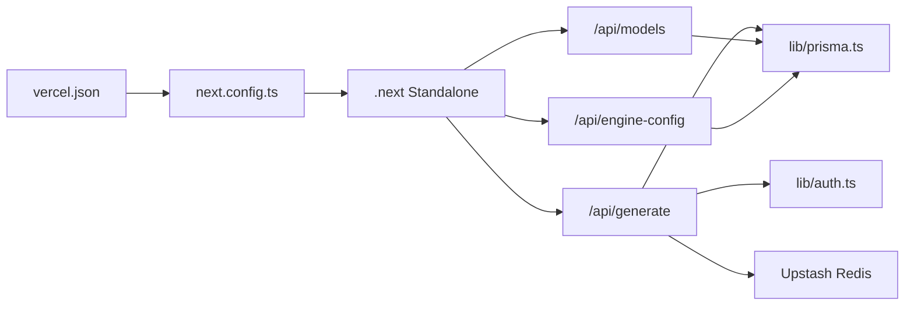

# Vercel Deployment

<cite>
**Referenced Files in This Document**
- [vercel.json](file://vercel.json)
- [next.config.ts](file://next.config.ts)
- [package.json](file://package.json)
- [lib/prisma.ts](file://lib/prisma.ts)
- [lib/auth.ts](file://lib/auth.ts)
- [app/api/generate/route.ts](file://app/api/generate/route.ts)
- [app/api/models/route.ts](file://app/api/models/route.ts)
- [app/api/engine-config/route.ts](file://app/api/engine-config/route.ts)
- [docs/ENV_SETUP.md](file://docs/ENV_SETUP.md)
</cite>

## Table of Contents
1. [Introduction](#introduction)
2. [Project Structure](#project-structure)
3. [Core Components](#core-components)
4. [Architecture Overview](#architecture-overview)
5. [Detailed Component Analysis](#detailed-component-analysis)
6. [Dependency Analysis](#dependency-analysis)
7. [Performance Considerations](#performance-considerations)
8. [Troubleshooting Guide](#troubleshooting-guide)
9. [Conclusion](#conclusion)
10. [Appendices](#appendices)

## Introduction
This document provides comprehensive guidance for deploying the AI-powered accessibility-first UI engine to Vercel. It covers Vercel configuration, Next.js serverless optimization, environment variable setup, deployment pipeline, performance strategies, scaling and edge networking, and operational troubleshooting. The system integrates AI model orchestration, secure workspace-scoped API key storage, and database connectivity optimized for Vercel’s serverless runtime.

## Project Structure
The repository follows a Next.js App Router layout with API routes under app/api. Serverless functions are defined per route, enabling scalable, per-endpoint cold start and concurrency characteristics. The deployment configuration is centralized in vercel.json, while Next.js optimization is configured in next.config.ts. Environment variables for production are documented in docs/ENV_SETUP.md.

**Diagram sources**
- [vercel.json:1-20](file://vercel.json#L1-L20)
- [next.config.ts:1-38](file://next.config.ts#L1-L38)
- [lib/prisma.ts:1-70](file://lib/prisma.ts#L1-L70)
- [lib/auth.ts:1-87](file://lib/auth.ts#L1-L87)
- [docs/ENV_SETUP.md:47-62](file://docs/ENV_SETUP.md#L47-L62)

**Section sources**
- [vercel.json:1-20](file://vercel.json#L1-L20)
- [next.config.ts:1-38](file://next.config.ts#L1-L38)
- [package.json:1-68](file://package.json#L1-L68)

## Core Components
- Vercel configuration: framework detection, build/install commands, output directory, regions, and security headers for API routes.
- Next.js optimization: standalone output, externalized Prisma packages, React Compiler, component caching, and global security headers.
- Database and caching: Prisma singleton with automatic reconnection for Neon serverless; Upstash Redis for caching.
- Authentication: NextAuth with JWT sessions and trustHost for Vercel preview domains.
- AI provider orchestration: dynamic selection of provider/model with fallbacks and timeouts; workspace-scoped encrypted keys.

**Section sources**
- [vercel.json:1-20](file://vercel.json#L1-L20)
- [next.config.ts:1-38](file://next.config.ts#L1-L38)
- [lib/prisma.ts:1-70](file://lib/prisma.ts#L1-L70)
- [lib/auth.ts:1-87](file://lib/auth.ts#L1-L87)
- [docs/ENV_SETUP.md:47-62](file://docs/ENV_SETUP.md#L47-L62)

## Architecture Overview
The deployment architecture leverages Vercel’s edge network and serverless functions. API routes handle generation, model discovery, and engine configuration. Prisma connects to Neon PostgreSQL, and Upstash Redis provides caching. Next.js generates a standalone output for minimal cold starts.

**Diagram sources**
- [app/api/generate/route.ts:1-440](file://app/api/generate/route.ts#L1-L440)
- [app/api/models/route.ts:1-457](file://app/api/models/route.ts#L1-L457)
- [app/api/engine-config/route.ts:1-154](file://app/api/engine-config/route.ts#L1-L154)
- [lib/prisma.ts:1-70](file://lib/prisma.ts#L1-L70)

## Detailed Component Analysis

### Vercel Configuration (vercel.json)
- Framework: Next.js detection enables optimized builds.
- Build command: Prisma client generation, migration deployment or push with acceptance of data loss, followed by Next.js build.
- Install command: npm install.
- Output directory: .next.
- Regions: iad1 (use “iad1” for US East).
- Security headers: X-Content-Type-Options, X-Frame-Options, X-XSS-Protection, Strict-Transport-Security applied to API routes.

**Diagram sources**
- [vercel.json:1-20](file://vercel.json#L1-L20)

**Section sources**
- [vercel.json:1-20](file://vercel.json#L1-L20)

### Next.js Serverless Optimization (next.config.ts)
- Output: standalone for smaller bundles and faster cold starts.
- External packages: Prisma client and Prisma are marked external to reduce function size.
- React Compiler and component caching enabled for performance.
- Experimental server actions: body size limit tuned for production.
- Global security headers for all routes.

**Diagram sources**
- [next.config.ts:1-38](file://next.config.ts#L1-L38)

**Section sources**
- [next.config.ts:1-38](file://next.config.ts#L1-L38)

### Environment Variables (Production)
Required environment variables for production:
- DATABASE_URL and DIRECT_URL for Neon PostgreSQL.
- UPSTASH_REDIS_REST_URL and UPSTASH_REDIS_REST_TOKEN for caching.
- ENCRYPTION_SECRET for encrypting workspace-scoped API keys at rest.
- Provider keys: OPENAI_API_KEY, ANTHROPIC_API_KEY, DEEPSEEK_API_KEY, GOOGLE_API_KEY.

**Diagram sources**
- [docs/ENV_SETUP.md:47-62](file://docs/ENV_SETUP.md#L47-L62)

**Section sources**
- [docs/ENV_SETUP.md:47-62](file://docs/ENV_SETUP.md#L47-L62)

### API Routes and Serverless Behavior

#### Generation Pipeline (/api/generate)
- Streaming and non-streaming modes supported.
- Uses workspace-scoped adapters and provider selection.
- Includes timeouts and fallbacks to protect against long-running operations.
- Writes telemetry and logs for observability.

**Diagram sources**
- [app/api/generate/route.ts:1-440](file://app/api/generate/route.ts#L1-L440)
- [lib/auth.ts:1-87](file://lib/auth.ts#L1-L87)

**Section sources**
- [app/api/generate/route.ts:1-440](file://app/api/generate/route.ts#L1-L440)
- [lib/auth.ts:1-87](file://lib/auth.ts#L1-L87)

#### Model Discovery (/api/models)
- Resolves API keys from client, DB, or environment variables.
- Supports multiple providers with provider-specific fetchers and static fallbacks.
- Enforces short timeouts to keep responses responsive.

**Diagram sources**
- [app/api/models/route.ts:1-457](file://app/api/models/route.ts#L1-L457)

**Section sources**
- [app/api/models/route.ts:1-457](file://app/api/models/route.ts#L1-L457)

#### Engine Configuration (/api/engine-config)
- Manages workspace-scoped provider/model selection.
- Stores encrypted API keys in DB; never returns keys to clients.
- Provides GET, POST, and DELETE endpoints.

**Diagram sources**
- [app/api/engine-config/route.ts:1-154](file://app/api/engine-config/route.ts#L1-L154)

**Section sources**
- [app/api/engine-config/route.ts:1-154](file://app/api/engine-config/route.ts#L1-L154)

### Database and Caching Integration
- Prisma singleton with automatic reconnection for Neon serverless environments.
- Recommended connection limit and pool timeout adjustments in DATABASE_URL for Vercel.
- Upstash Redis used for caching and rate limiting.

**Diagram sources**
- [lib/prisma.ts:1-70](file://lib/prisma.ts#L1-L70)

**Section sources**
- [lib/prisma.ts:1-70](file://lib/prisma.ts#L1-L70)

## Dependency Analysis
- Vercel depends on Next.js build outputs and applies security headers.
- Next.js marks Prisma as external and emits a standalone output.
- API routes depend on Prisma for persistence and Upstash Redis for caching.
- Authentication relies on NextAuth with JWT and trustHost for Vercel preview domains.

**Diagram sources**
- [vercel.json:1-20](file://vercel.json#L1-L20)
- [next.config.ts:1-38](file://next.config.ts#L1-L38)
- [lib/prisma.ts:1-70](file://lib/prisma.ts#L1-L70)
- [lib/auth.ts:1-87](file://lib/auth.ts#L1-L87)

**Section sources**
- [vercel.json:1-20](file://vercel.json#L1-L20)
- [next.config.ts:1-38](file://next.config.ts#L1-L38)
- [lib/prisma.ts:1-70](file://lib/prisma.ts#L1-L70)
- [lib/auth.ts:1-87](file://lib/auth.ts#L1-L87)

## Performance Considerations
- Standalone output: reduces cold start time and minimizes function size.
- External Prisma packages: decreases function payload size.
- React Compiler and component caching: improves rendering performance.
- Security headers: applied globally for all routes.
- API timeouts: generation pipeline enforces per-phase budgets to avoid exceeding Vercel limits.
- Model listing: enforced short timeouts and static fallbacks for resilience.
- Caching: Upstash Redis for frequently accessed data.

[No sources needed since this section provides general guidance]

## Troubleshooting Guide
Common deployment and runtime issues:
- Build fails on Prisma migration: ensure DATABASE_URL/DIRECT_URL are set and migrations succeed; the build command includes migration deployment or push with data loss acceptance.
- Cold start slowness: confirm standalone output and external Prisma packages are enabled.
- Database connection exhaustion: adjust DATABASE_URL connection parameters and rely on Prisma singleton to reuse connections within a process.
- Authentication errors on preview domains: trustHost is enabled; verify domain settings in Vercel.
- Model listing timeouts: provider endpoints may be slow or blocked; static fallback lists are returned when fetch fails.
- Missing provider keys: engine configuration stores encrypted keys; ensure keys are present for desired providers.

**Section sources**
- [vercel.json:1-20](file://vercel.json#L1-L20)
- [next.config.ts:1-38](file://next.config.ts#L1-L38)
- [lib/prisma.ts:1-70](file://lib/prisma.ts#L1-L70)
- [lib/auth.ts:1-87](file://lib/auth.ts#L1-L87)
- [app/api/models/route.ts:1-457](file://app/api/models/route.ts#L1-L457)
- [docs/ENV_SETUP.md:47-62](file://docs/ENV_SETUP.md#L47-L62)

## Conclusion
The deployment configuration aligns with Vercel’s serverless model and Next.js best practices. By leveraging standalone output, external Prisma packages, and robust security headers, the system achieves fast cold starts and strong protections. The API routes are designed with timeouts and fallbacks to remain resilient under varying provider conditions. Proper environment variable configuration and caching enable reliable production performance.

[No sources needed since this section summarizes without analyzing specific files]

## Appendices

### Environment Variable Reference
- DATABASE_URL: Neon Prisma connection string.
- DIRECT_URL: Neon direct connection string.
- UPSTASH_REDIS_REST_URL: Upstash Redis REST endpoint.
- UPSTASH_REDIS_REST_TOKEN: Upstash Redis token.
- ENCRYPTION_SECRET: 32-character random secret for encryption.
- OPENAI_API_KEY, ANTHROPIC_API_KEY, DEEPSEEK_API_KEY, GOOGLE_API_KEY: Provider keys for AI engines.

**Section sources**
- [docs/ENV_SETUP.md:47-62](file://docs/ENV_SETUP.md#L47-L62)