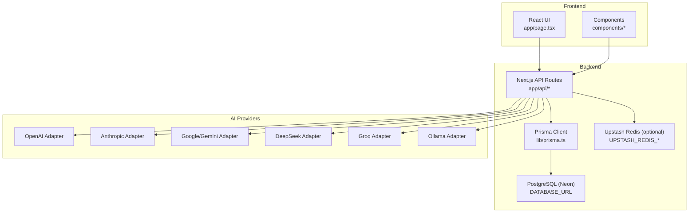
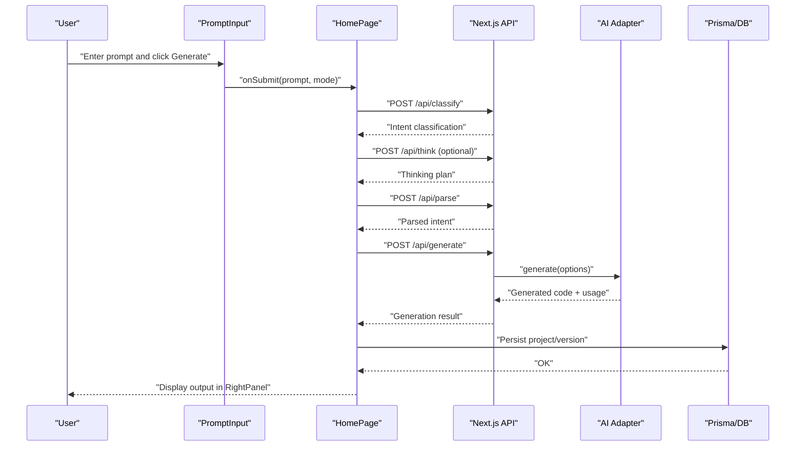
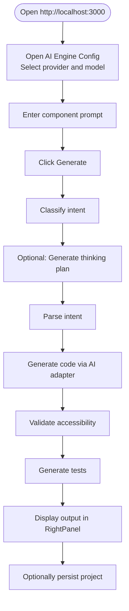
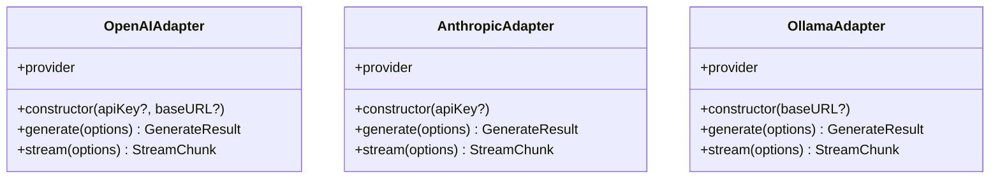
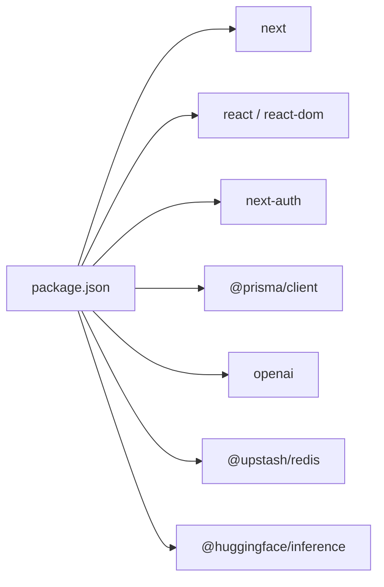

# Getting Started

<cite>
**Referenced Files in This Document**
- [package.json](file://package.json)
- [README.md](file://README.md)
- [docs/ENV_SETUP.md](file://docs/ENV_SETUP.md)
- [prisma/schema.prisma](file://prisma/schema.prisma)
- [lib/prisma.ts](file://lib/prisma.ts)
- [next.config.ts](file://next.config.ts)
- [app/layout.tsx](file://app/layout.tsx)
- [app/page.tsx](file://app/page.tsx)
- [components/PromptInput.tsx](file://components/PromptInput.tsx)
- [components/AIEngineConfigPanel.tsx](file://components/AIEngineConfigPanel.tsx)
- [lib/ai/adapters/openai.ts](file://lib/ai/adapters/openai.ts)
- [lib/ai/adapters/anthropic.ts](file://lib/ai/adapters/anthropic.ts)
- [lib/ai/adapters/ollama.ts](file://lib/ai/adapters/ollama.ts)
</cite>

## Table of Contents
1. [Introduction](#introduction)
2. [Project Structure](#project-structure)
3. [Core Components](#core-components)
4. [Architecture Overview](#architecture-overview)
5. [Detailed Component Analysis](#detailed-component-analysis)
6. [Dependency Analysis](#dependency-analysis)
7. [Performance Considerations](#performance-considerations)
8. [Troubleshooting Guide](#troubleshooting-guide)
9. [Conclusion](#conclusion)
10. [Appendices](#appendices)

## Introduction
This guide helps you set up and run the AI-powered accessibility-first UI engine locally. You will configure the development environment, set up environment variables for AI providers, configure the database with Prisma and PostgreSQL, optionally connect Upstash Redis, and run the Next.js application. It also includes a first-generation example to describe a UI component and see the generated output.

## Project Structure
The project is a Next.js 16 application with a modern stack:
- Frontend: React 19, Next.js App Router, TypeScript
- Backend: Next.js API routes under app/api/*
- AI adapters: OpenAI, Anthropic, Google, DeepSeek, Groq, Ollama
- Database: Prisma with PostgreSQL (Neon recommended)
- Optional cache: Upstash Redis
- Authentication: NextAuth.js with Prisma adapter

**Diagram sources**
- [app/page.tsx:1-525](file://app/page.tsx#L1-L525)
- [lib/prisma.ts:1-70](file://lib/prisma.ts#L1-L70)
- [prisma/schema.prisma:1-222](file://prisma/schema.prisma#L1-L222)
- [lib/ai/adapters/openai.ts:1-223](file://lib/ai/adapters/openai.ts#L1-L223)
- [lib/ai/adapters/anthropic.ts:1-210](file://lib/ai/adapters/anthropic.ts#L1-L210)
- [lib/ai/adapters/ollama.ts:1-87](file://lib/ai/adapters/ollama.ts#L1-L87)

**Section sources**
- [README.md:1-37](file://README.md#L1-L37)
- [package.json:1-68](file://package.json#L1-L68)
- [next.config.ts:1-38](file://next.config.ts#L1-L38)

## Core Components
- Development server and scripts are defined in package.json. Use dev, build, start, lint, test, and test:coverage.
- The root layout sets global metadata and wraps the app with SessionProvider and WorkspaceProvider.
- The home page orchestrates the AI generation pipeline, including classification, thinking, parsing, generation, validation, testing, and persistence.
- AI adapters encapsulate provider-specific logic for OpenAI, Anthropic, and Ollama.

**Section sources**
- [package.json:5-12](file://package.json#L5-L12)
- [app/layout.tsx:1-57](file://app/layout.tsx#L1-L57)
- [app/page.tsx:168-311](file://app/page.tsx#L168-L311)
- [lib/ai/adapters/openai.ts:36-223](file://lib/ai/adapters/openai.ts#L36-L223)
- [lib/ai/adapters/anthropic.ts:71-210](file://lib/ai/adapters/anthropic.ts#L71-L210)
- [lib/ai/adapters/ollama.ts:21-87](file://lib/ai/adapters/ollama.ts#L21-L87)

## Architecture Overview
The UI engine follows a pipeline:
- User submits a prompt via PromptInput.
- Classification determines intent and confidence.
- Thinking generates a plan (optional).
- Parsing extracts structured intent.
- Generation calls the selected AI provider adapter.
- Validation and testing finalize the output.
- Results are persisted and displayed in the right panel.

**Diagram sources**
- [components/PromptInput.tsx:190-230](file://components/PromptInput.tsx#L190-L230)
- [app/page.tsx:314-376](file://app/page.tsx#L314-L376)
- [app/page.tsx:168-311](file://app/page.tsx#L168-L311)
- [lib/ai/adapters/openai.ts:64-157](file://lib/ai/adapters/openai.ts#L64-L157)

## Detailed Component Analysis

### Development Environment Setup
- Node.js: The project uses Next.js 16 and React 19. Ensure you have a compatible Node.js version installed.
- Package managers: npm, yarn, pnpm, and bun are supported for running the dev script.
- Install dependencies using your preferred package manager.

Steps:
1. Install dependencies:
   - npm install
   - yarn install
   - pnpm install
   - bun install
2. Start the development server:
   - npm run dev
   - yarn dev
   - pnpm dev
   - bun dev
3. Open http://localhost:3000 in your browser.

**Section sources**
- [README.md:3-17](file://README.md#L3-L17)
- [package.json:5-12](file://package.json#L5-L12)

### Environment Variables and Services
- Database (Neon PostgreSQL): Configure DATABASE_URL and DIRECT_URL from your Neon console. Use the Prisma connection string for DATABASE_URL and the Direct connection string for DIRECT_URL.
- Redis (Upstash): Optional. Configure UPSTASH_REDIS_REST_URL and UPSTASH_REDIS_REST_TOKEN. Leave empty in local dev to use in-memory cache.
- Security: Generate ENCRYPTION_SECRET (exactly 32 characters) and keep it secret.
- AI providers: OPENAI_API_KEY, ANTHROPIC_API_KEY, DEEPSEEK_API_KEY, GOOGLE_API_KEY.
- Ollama: Optional. Configure OLLAMA_BASE_URL if running locally.
- Model overrides: Optionally override models for classifier, thinking, review, and repair stages.

Setup steps:
1. Copy the environment template to .env.local and fill in values.
2. For production on Vercel, add the same variables in the dashboard.
3. Generate ENCRYPTION_SECRET using the provided command.
4. For Neon, copy Prisma and Direct connection strings from the console.
5. For Upstash, create a database and copy REST API credentials.

**Section sources**
- [docs/ENV_SETUP.md:1-89](file://docs/ENV_SETUP.md#L1-L89)

### Database Configuration with Prisma and PostgreSQL
- Prisma schema defines models for auth, workspaces, projects, usage logs, feedback, and embeddings.
- DATABASE_URL and DIRECT_URL are loaded from environment variables.
- Use Prisma CLI to migrate and manage the database.

Steps:
1. Set DATABASE_URL and DIRECT_URL in your environment.
2. Run Prisma migrations:
   - npx prisma migrate deploy
3. Verify with Prisma Studio:
   - npx prisma studio
4. Confirm tables like WorkspaceSettings and UsageLog exist.

**Section sources**
- [prisma/schema.prisma:1-222](file://prisma/schema.prisma#L1-L222)
- [lib/prisma.ts:1-70](file://lib/prisma.ts#L1-L70)
- [docs/ENV_SETUP.md:75-81](file://docs/ENV_SETUP.md#L75-L81)

### Optional Upstash Redis
- Configure UPSTASH_REDIS_REST_URL and UPSTASH_REDIS_REST_TOKEN for production.
- In local dev, leaving Redis variables empty uses in-memory cache.

**Section sources**
- [docs/ENV_SETUP.md:14-18](file://docs/ENV_SETUP.md#L14-L18)

### Running the Development Server
- Scripts:
  - dev: next dev
  - build: playwright install, prisma generate, prisma migrate deploy, next build
  - start: next start with PORT fallback to 3000
  - lint, test, test:coverage
- Next.js configuration:
  - standalone output
  - serverExternalPackages for Prisma
  - reactCompiler enabled
  - security headers

**Section sources**
- [package.json:5-12](file://package.json#L5-L12)
- [next.config.ts:1-38](file://next.config.ts#L1-L38)

### First-Generation Example: Describe a UI Component
Goal: Convert a natural language description into an accessible React component with live preview and WCAG 2.1 AA validation.

Steps:
1. Open http://localhost:3000
2. In the left sidebar, open AI Engine Config and choose a provider (OpenAI, Anthropic, Google, Groq, or Ollama). Save the configuration.
3. Back in the center pane, describe a UI component (e.g., “A login form with email and password”).
4. Click Generate.
5. Observe the pipeline stages: parsing, generating, validating, testing, and completion.
6. View the generated code and accessibility report in the right panel.
7. Persist the project via the sidebar.

**Diagram sources**
- [components/AIEngineConfigPanel.tsx:194-443](file://components/AIEngineConfigPanel.tsx#L194-L443)
- [components/PromptInput.tsx:190-230](file://components/PromptInput.tsx#L190-L230)
- [app/page.tsx:168-311](file://app/page.tsx#L168-L311)

**Section sources**
- [README.md:3-17](file://README.md#L3-L17)
- [components/AIEngineConfigPanel.tsx:194-443](file://components/AIEngineConfigPanel.tsx#L194-L443)
- [components/PromptInput.tsx:190-230](file://components/PromptInput.tsx#L190-L230)
- [app/page.tsx:168-311](file://app/page.tsx#L168-L311)

### AI Provider Adapters
- OpenAI adapter supports GPT models and reasoning models with provider-specific constraints.
- Anthropic adapter uses the native Messages API (/v1/messages) and handles JSON mode and token caps.
- Ollama adapter uses the OpenAI-compatible API exposed by Ollama.

**Diagram sources**
- [lib/ai/adapters/openai.ts:36-223](file://lib/ai/adapters/openai.ts#L36-L223)
- [lib/ai/adapters/anthropic.ts:71-210](file://lib/ai/adapters/anthropic.ts#L71-L210)
- [lib/ai/adapters/ollama.ts:21-87](file://lib/ai/adapters/ollama.ts#L21-L87)

**Section sources**
- [lib/ai/adapters/openai.ts:1-223](file://lib/ai/adapters/openai.ts#L1-L223)
- [lib/ai/adapters/anthropic.ts:1-210](file://lib/ai/adapters/anthropic.ts#L1-L210)
- [lib/ai/adapters/ollama.ts:1-87](file://lib/ai/adapters/ollama.ts#L1-L87)

## Dependency Analysis
- Runtime dependencies include Next.js, React, NextAuth.js, Prisma Client, OpenAI, @huggingface/inference, @upstash/redis, resend, lucide-react, radix-ui, codemirror, and others.
- Dev dependencies include Prisma, Jest, Playwright, TailwindCSS, ESLint, and TypeScript.

**Diagram sources**
- [package.json:13-44](file://package.json#L13-L44)

**Section sources**
- [package.json:13-66](file://package.json#L13-L66)

## Performance Considerations
- Use the standalone output setting for faster cold starts on platforms like Vercel.
- Limit concurrent DB connections and leverage Prisma’s singleton pattern to avoid pool exhaustion.
- For Neon serverless, transient connection errors are handled with automatic reconnect logic.
- Enable React Compiler and cache components for improved runtime performance.

**Section sources**
- [next.config.ts:1-38](file://next.config.ts#L1-L38)
- [lib/prisma.ts:1-70](file://lib/prisma.ts#L1-L70)

## Troubleshooting Guide
Common issues and resolutions:
- Missing environment variables:
  - Ensure DATABASE_URL and DIRECT_URL are set for Prisma.
  - Generate and set ENCRYPTION_SECRET.
  - Add provider keys (OPENAI_API_KEY, ANTHROPIC_API_KEY, etc.) or leave empty to use Ollama fallback.
- Database migration errors:
  - Run npx prisma migrate deploy after setting DATABASE_URL.
  - Verify with npx prisma studio.
- Redis connectivity:
  - If using Upstash, confirm UPSTASH_REDIS_REST_URL and UPSTASH_REDIS_REST_TOKEN.
- Provider connectivity:
  - Test connection in the AI Engine Config panel.
  - For custom base URLs, ensure they point to a valid OpenAI-compatible endpoint.
- Ollama:
  - Ensure Ollama is running and accessible at the configured base URL (default http://localhost:11434/v1).
- Network and timeouts:
  - For transient Neon errors, the Prisma wrapper retries once after a brief delay.

**Section sources**
- [docs/ENV_SETUP.md:1-89](file://docs/ENV_SETUP.md#L1-L89)
- [lib/prisma.ts:36-70](file://lib/prisma.ts#L36-L70)
- [components/AIEngineConfigPanel.tsx:340-356](file://components/AIEngineConfigPanel.tsx#L340-L356)

## Conclusion
You now have the prerequisites and steps to set up the AI-powered accessibility-first UI engine locally. After configuring environment variables, database, and optional Redis, run the development server and experiment with generating UI components. Use the AI Engine Config panel to select providers and models, and follow the pipeline stages to see how prompts become accessible, validated React components.

## Appendices

### Appendix A: Environment Variables Reference
- DATABASE_URL: Prisma connection string from Neon
- DIRECT_URL: Direct connection string from Neon
- UPSTASH_REDIS_REST_URL: Upstash REST API URL
- UPSTASH_REDIS_REST_TOKEN: Upstash REST API token
- ENCRYPTION_SECRET: 32-character secret for encryption
- OPENAI_API_KEY, ANTHROPIC_API_KEY, DEEPSEEK_API_KEY, GOOGLE_API_KEY: Provider keys
- OLLAMA_BASE_URL: Local Ollama endpoint (optional)
- Additional model override variables for classifier, thinking, review, and repair stages

**Section sources**
- [docs/ENV_SETUP.md:25-43](file://docs/ENV_SETUP.md#L25-L43)