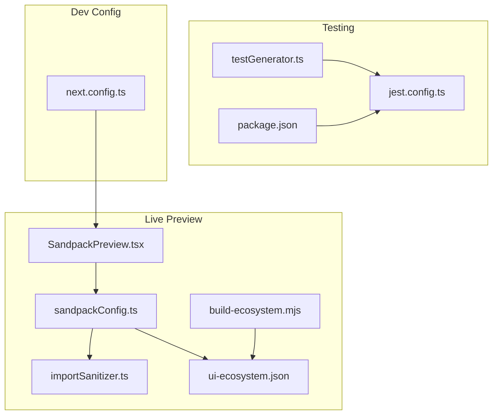
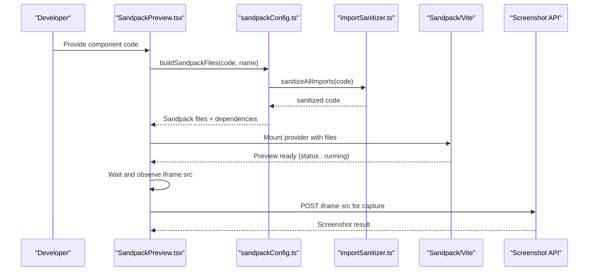
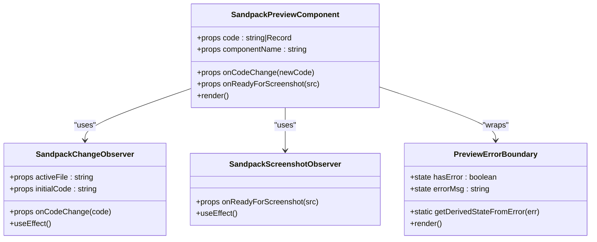
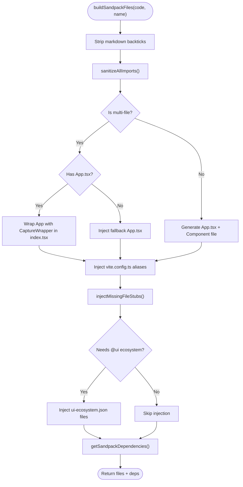
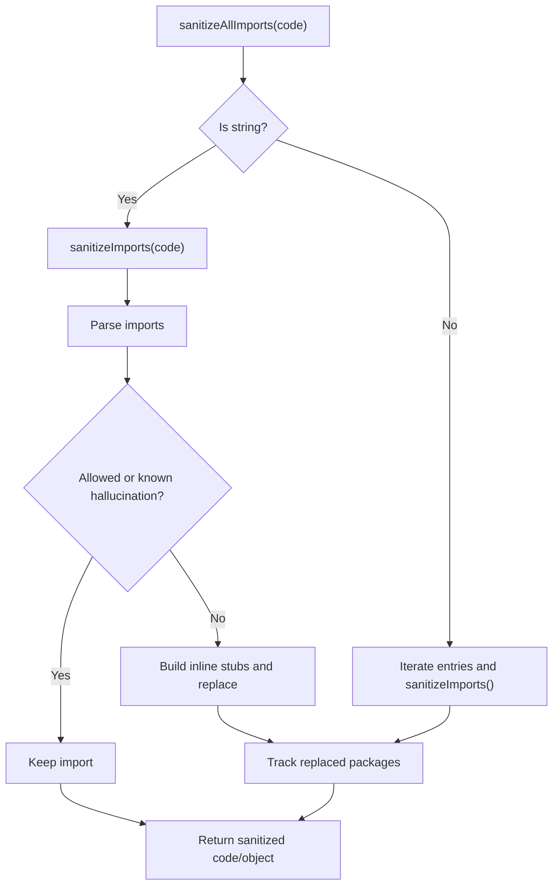
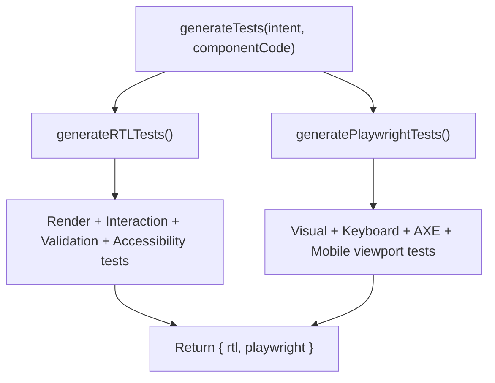
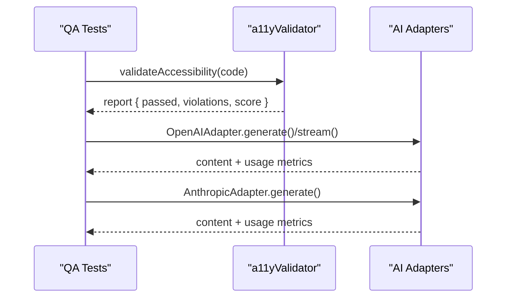
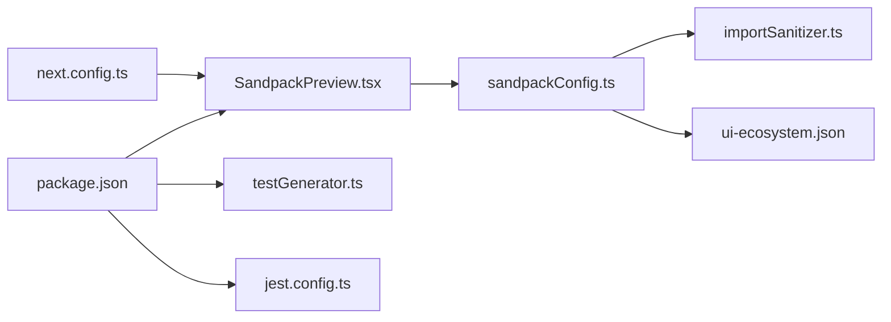

# Live Preview & Development Tools

<cite>
**Referenced Files in This Document**
- [SandpackPreview.tsx](file://components/SandpackPreview.tsx)
- [sandpackConfig.ts](file://lib/sandbox/sandpackConfig.ts)
- [importSanitizer.ts](file://lib/sandbox/importSanitizer.ts)
- [ui-ecosystem.json](file://lib/sandbox/ui-ecosystem.json)
- [build-ecosystem.mjs](file://scripts/build-ecosystem.mjs)
- [testGenerator.ts](file://lib/testGenerator.ts)
- [jest.config.ts](file://jest.config.ts)
- [package.json](file://package.json)
- [next.config.ts](file://next.config.ts)
- [a11yValidator.test.ts](file://__tests__/a11yValidator.test.ts)
- [adapters.test.ts](file://__tests__/adapters.test.ts)
</cite>

## Table of Contents
1. [Introduction](#introduction)
2. [Project Structure](#project-structure)
3. [Core Components](#core-components)
4. [Architecture Overview](#architecture-overview)
5. [Detailed Component Analysis](#detailed-component-analysis)
6. [Dependency Analysis](#dependency-analysis)
7. [Performance Considerations](#performance-considerations)
8. [Troubleshooting Guide](#troubleshooting-guide)
9. [Conclusion](#conclusion)
10. [Appendices](#appendices)

## Introduction
This document explains the live preview and development tooling system that powers real-time component previews, automated test generation, and quality assurance workflows. It focuses on:
- CodeSandbox Sandpack integration for live editing and preview
- Dependency management and UI ecosystem injection
- Automated test generation using Playwright and React Testing Library/Jest
- Development utilities, debugging, and performance monitoring
- Configuration options for the Sandpack environment and UI component integration

## Project Structure
The live preview and testing tooling spans several areas:
- Live preview component and Sandpack orchestration
- Sandpack configuration, dependency resolution, and UI ecosystem injection
- Automated test generation and quality assurance tests
- Build scripts and configuration for development and deployment

**Diagram sources**
- [SandpackPreview.tsx:144-287](file://components/SandpackPreview.tsx#L144-L287)
- [sandpackConfig.ts:112-401](file://lib/sandbox/sandpackConfig.ts#L112-L401)
- [importSanitizer.ts:169-224](file://lib/sandbox/importSanitizer.ts#L169-L224)
- [ui-ecosystem.json:1-49](file://lib/sandbox/ui-ecosystem.json#L1-L49)
- [build-ecosystem.mjs:1-48](file://scripts/build-ecosystem.mjs#L1-L48)
- [testGenerator.ts:1-265](file://lib/testGenerator.ts#L1-L265)
- [jest.config.ts:1-23](file://jest.config.ts#L1-L23)
- [package.json:1-68](file://package.json#L1-L68)
- [next.config.ts:1-38](file://next.config.ts#L1-L38)

**Section sources**
- [SandpackPreview.tsx:1-287](file://components/SandpackPreview.tsx#L1-L287)
- [sandpackConfig.ts:1-485](file://lib/sandbox/sandpackConfig.ts#L1-L485)
- [importSanitizer.ts:1-224](file://lib/sandbox/importSanitizer.ts#L1-L224)
- [ui-ecosystem.json:1-49](file://lib/sandbox/ui-ecosystem.json#L1-L49)
- [build-ecosystem.mjs:1-48](file://scripts/build-ecosystem.mjs#L1-L48)
- [testGenerator.ts:1-265](file://lib/testGenerator.ts#L1-L265)
- [jest.config.ts:1-23](file://jest.config.ts#L1-L23)
- [package.json:1-68](file://package.json#L1-L68)
- [next.config.ts:1-38](file://next.config.ts#L1-L38)

## Core Components
- SandpackPreview: A client component that hosts a live preview with optional inline editor, change observation, and screenshot readiness detection.
- Sandpack configuration: Builds the virtual file system, resolves dependencies, injects UI ecosystem packages, and sanitizes imports.
- Test generator: Produces RTL and Playwright tests from UI intents.
- Quality assurance tests: Validate accessibility and adapter implementations.

**Section sources**
- [SandpackPreview.tsx:144-287](file://components/SandpackPreview.tsx#L144-L287)
- [sandpackConfig.ts:112-485](file://lib/sandbox/sandpackConfig.ts#L112-L485)
- [testGenerator.ts:1-265](file://lib/testGenerator.ts#L1-L265)
- [a11yValidator.test.ts:1-110](file://__tests__/a11yValidator.test.ts#L1-L110)
- [adapters.test.ts:1-109](file://__tests__/adapters.test.ts#L1-L109)

## Architecture Overview
The live preview pipeline integrates user-generated code with a Sandpack-managed Vite environment. The system:
- Sanitizes imports to prevent unresolved dependencies
- Injects a minimal UI ecosystem when needed
- Wraps the preview in a capture layer for screenshots
- Observes editor changes and preview readiness for automation

**Diagram sources**
- [SandpackPreview.tsx:144-287](file://components/SandpackPreview.tsx#L144-L287)
- [sandpackConfig.ts:112-401](file://lib/sandbox/sandpackConfig.ts#L112-L401)
- [importSanitizer.ts:207-224](file://lib/sandbox/importSanitizer.ts#L207-L224)

## Detailed Component Analysis

### SandpackPreview Component
SandpackPreview orchestrates:
- Provider setup with template, theme, files, and custom dependencies
- Optional inline editor and edit-mode toggle
- Error boundary for crash handling
- Observers for code changes and screenshot readiness

**Diagram sources**
- [SandpackPreview.tsx:144-287](file://components/SandpackPreview.tsx#L144-L287)

**Section sources**
- [SandpackPreview.tsx:144-287](file://components/SandpackPreview.tsx#L144-L287)

### Sandpack Configuration and Dependency Management
The configuration builds a virtual file system and resolves dependencies:
- Builds HTML, entry, styles, Tailwind/PostCSS configs, and a capture wrapper
- Generates App.tsx or multi-file structure and injects missing file stubs
- Injects UI ecosystem packages only when referenced
- Resolves dependencies dynamically based on code content
- Provides Vite aliases for @ui packages

**Diagram sources**
- [sandpackConfig.ts:112-401](file://lib/sandbox/sandpackConfig.ts#L112-L401)
- [importSanitizer.ts:34-91](file://lib/sandbox/importSanitizer.ts#L34-L91)

**Section sources**
- [sandpackConfig.ts:112-485](file://lib/sandbox/sandpackConfig.ts#L112-L485)
- [importSanitizer.ts:1-224](file://lib/sandbox/importSanitizer.ts#L1-L224)
- [ui-ecosystem.json:1-49](file://lib/sandbox/ui-ecosystem.json#L1-L49)
- [build-ecosystem.mjs:1-48](file://scripts/build-ecosystem.mjs#L1-L48)

### Import Sanitization Strategy
The sanitizer:
- Identifies allowed prefixes and known hallucinations
- Parses import statements and replaces unknown packages with inline stubs
- Drops side-effect imports from unknown packages
- Supports both single-file and multi-file sanitization

**Diagram sources**
- [importSanitizer.ts:169-224](file://lib/sandbox/importSanitizer.ts#L169-L224)

**Section sources**
- [importSanitizer.ts:1-224](file://lib/sandbox/importSanitizer.ts#L1-L224)

### Automated Test Generation
The test generator produces:
- RTL tests for rendering, interactions, validation, and accessibility checks
- Playwright E2E tests for visual checks, keyboard navigation, accessibility, and responsiveness

**Diagram sources**
- [testGenerator.ts:8-15](file://lib/testGenerator.ts#L8-L15)

**Section sources**
- [testGenerator.ts:1-265](file://lib/testGenerator.ts#L1-L265)

### Quality Assurance Workflows
- Accessibility validator tests assert detection and repair of common issues
- Adapter tests validate multiple AI providers with mocked clients

**Diagram sources**
- [a11yValidator.test.ts:1-110](file://__tests__/a11yValidator.test.ts#L1-L110)
- [adapters.test.ts:1-109](file://__tests__/adapters.test.ts#L1-L109)

**Section sources**
- [a11yValidator.test.ts:1-110](file://__tests__/a11yValidator.test.ts#L1-L110)
- [adapters.test.ts:1-109](file://__tests__/adapters.test.ts#L1-L109)

## Dependency Analysis
- Sandpack runtime depends on @codesandbox/sandpack-react and Vite-based template
- UI ecosystem packages are injected conditionally based on code references
- Testing stack includes Jest, Playwright, and testing libraries
- Next.js configuration enables standalone output and security headers

**Diagram sources**
- [package.json:1-68](file://package.json#L1-L68)
- [SandpackPreview.tsx:1-13](file://components/SandpackPreview.tsx#L1-L13)
- [sandpackConfig.ts:1-12](file://lib/sandbox/sandpackConfig.ts#L1-L12)
- [importSanitizer.ts:1-14](file://lib/sandbox/importSanitizer.ts#L1-L14)
- [ui-ecosystem.json:1-49](file://lib/sandbox/ui-ecosystem.json#L1-L49)
- [next.config.ts:1-38](file://next.config.ts#L1-L38)

**Section sources**
- [package.json:1-68](file://package.json#L1-L68)
- [next.config.ts:1-38](file://next.config.ts#L1-L38)

## Performance Considerations
- Conditional UI ecosystem injection reduces cold-start time and avoids timeouts
- Vite aliases configured in the virtual environment ensure predictable resolution
- Capture wrapper defers snapshot capture to guarantee preview stability
- Jest coverage configured for targeted libraries improves feedback speed

[No sources needed since this section provides general guidance]

## Troubleshooting Guide
Common issues and resolutions:
- Preview crashes: The error boundary displays a concise message and a retry action
- Unresolved imports: The sanitizer replaces unknown packages with inline stubs; verify allowed prefixes
- Missing UI components: Ensure code references @ui packages; the ecosystem is injected automatically when detected
- Screenshot timing: The observer waits for the preview to settle before emitting the iframe URL

**Section sources**
- [SandpackPreview.tsx:105-140](file://components/SandpackPreview.tsx#L105-L140)
- [importSanitizer.ts:169-205](file://lib/sandbox/importSanitizer.ts#L169-L205)
- [sandpackConfig.ts:386-398](file://lib/sandbox/sandpackConfig.ts#L386-L398)
- [sandpackConfig.ts:257-299](file://lib/sandbox/sandpackConfig.ts#L257-L299)

## Conclusion
The live preview and development tooling system combines a robust Sandpack integration, intelligent import sanitization, and a scalable UI ecosystem to deliver reliable, accessible, and fast previews. Automated test generation and quality assurance tests ensure ongoing reliability and adherence to accessibility standards.

[No sources needed since this section summarizes without analyzing specific files]

## Appendices

### Configuration Options and Best Practices
- Sandpack environment
  - Template: Vite + React + TypeScript
  - Theme: Dark
  - Visibility: All files visible; active file selected based on input
- Dependency injection
  - Dynamic dependencies computed from code content
  - Always-included packages for UI ecosystem compatibility
- UI component integration
  - Vite aliases for @ui packages and @/lib/utils
  - Conditional injection of ui-ecosystem.json files
- Testing strategy
  - Jest configuration with moduleNameMapper and coverage provider v8
  - Playwright tests scaffolded with environment-specific notes
- Development best practices
  - Keep code self-contained to minimize missing file stubs
  - Prefer @ui package imports for consistent behavior
  - Use the inline editor to capture feedback and trigger screenshots

**Section sources**
- [SandpackPreview.tsx:219-229](file://components/SandpackPreview.tsx#L219-L229)
- [sandpackConfig.ts:427-472](file://lib/sandbox/sandpackConfig.ts#L427-L472)
- [sandpackConfig.ts:353-382](file://lib/sandbox/sandpackConfig.ts#L353-L382)
- [sandpackConfig.ts:394-398](file://lib/sandbox/sandpackConfig.ts#L394-L398)
- [jest.config.ts:8-20](file://jest.config.ts#L8-L20)
- [testGenerator.ts:178-185](file://lib/testGenerator.ts#L178-L185)