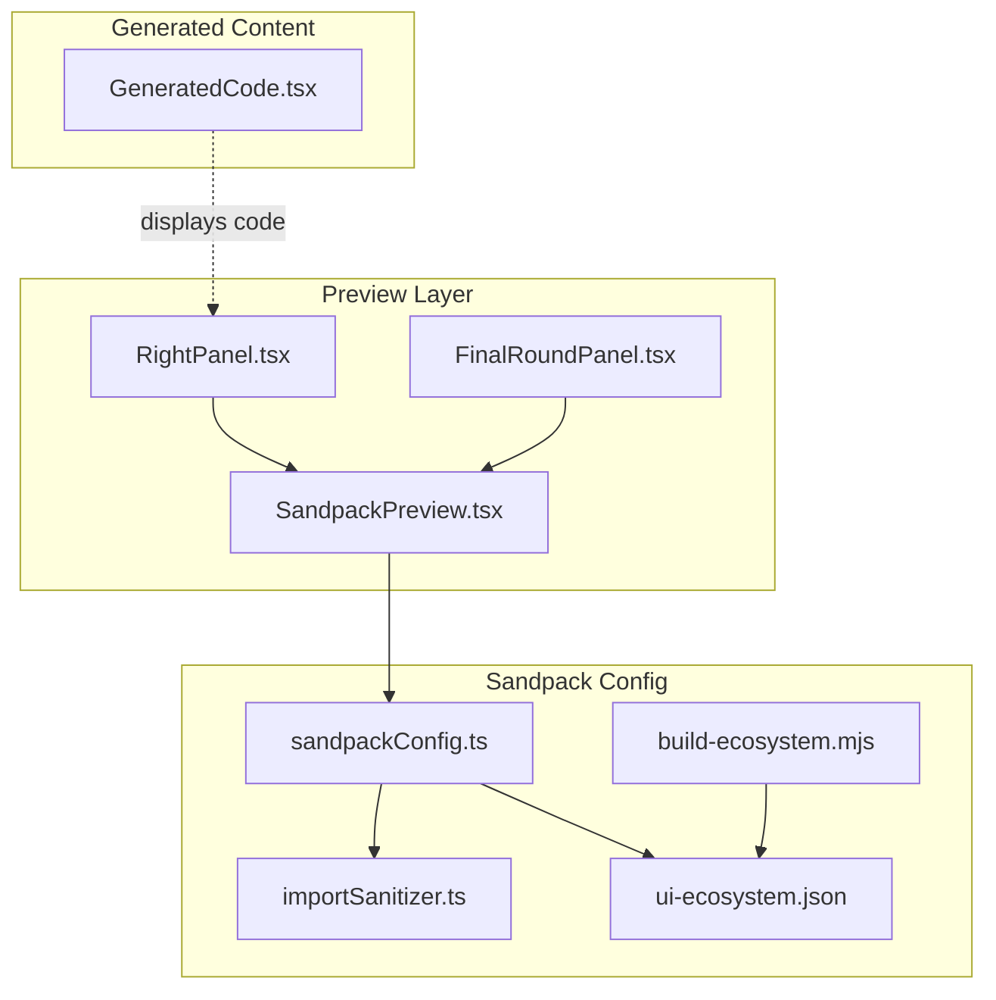
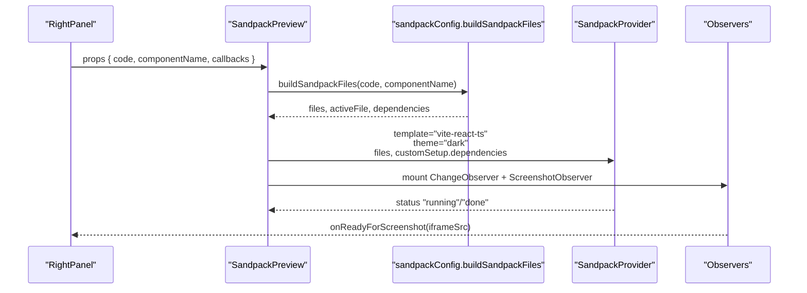
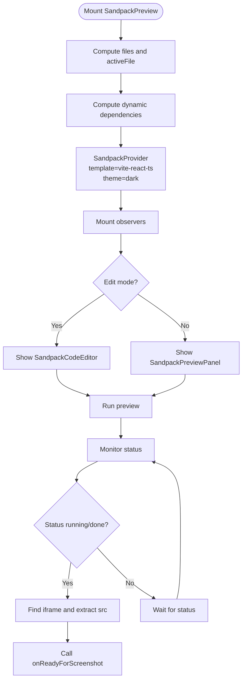
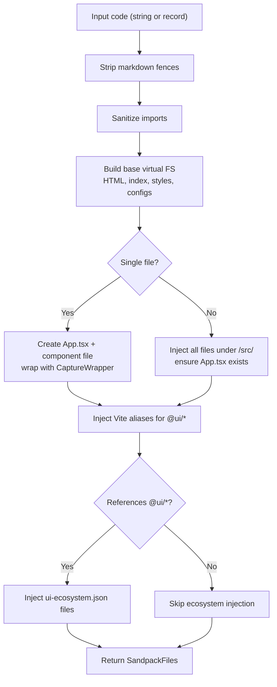
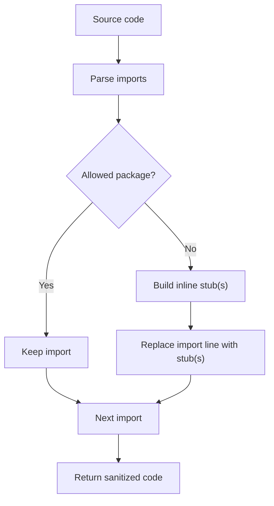
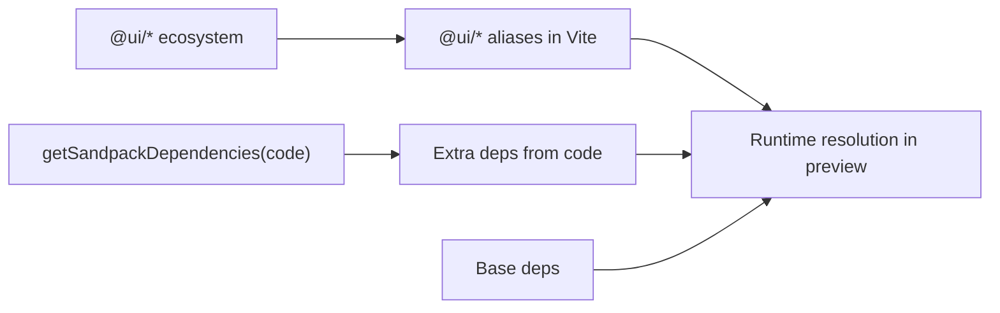

# Sandpack Integration

<cite>
**Referenced Files in This Document**
- [SandpackPreview.tsx](file://components/SandpackPreview.tsx)
- [sandpackConfig.ts](file://lib/sandbox/sandpackConfig.ts)
- [importSanitizer.ts](file://lib/sandbox/importSanitizer.ts)
- [ui-ecosystem.json](file://lib/sandbox/ui-ecosystem.json)
- [build-ecosystem.mjs](file://scripts/build-ecosystem.mjs)
- [GeneratedCode.tsx](file://components/GeneratedCode.tsx)
- [RightPanel.tsx](file://components/ide/RightPanel.tsx)
- [FinalRoundPanel.tsx](file://components/FinalRoundPanel.tsx)
</cite>

## Table of Contents
1. [Introduction](#introduction)
2. [Project Structure](#project-structure)
3. [Core Components](#core-components)
4. [Architecture Overview](#architecture-overview)
5. [Detailed Component Analysis](#detailed-component-analysis)
6. [Dependency Analysis](#dependency-analysis)
7. [Performance Considerations](#performance-considerations)
8. [Troubleshooting Guide](#troubleshooting-guide)
9. [Conclusion](#conclusion)
10. [Appendices](#appendices)

## Introduction
This document explains the CodeSandbox Sandpack integration that powers the real-time component preview. It covers how the Sandpack environment is configured, how dependencies are managed, how the UI ecosystem is injected, and how the preview renders generated components with styling and interactivity. It also documents the preview observers, error handling, and integration points with the broader IDE and final review panels.

## Project Structure
The Sandpack integration spans several modules:
- The preview component that hosts Sandpack and orchestrates observers and error handling
- The Sandpack configuration builder that generates the virtual file system and dependency set
- The import sanitizer that guards against unresolved or hallucinated imports
- The UI ecosystem snapshot that supplies @ui/* packages to the preview
- Supporting UI components that display and interact with generated code and preview state

**Diagram sources**
- [SandpackPreview.tsx:144-286](file://components/SandpackPreview.tsx#L144-L286)
- [sandpackConfig.ts:112-401](file://lib/sandbox/sandpackConfig.ts#L112-L401)
- [importSanitizer.ts:169-223](file://lib/sandbox/importSanitizer.ts#L169-L223)
- [ui-ecosystem.json:1-49](file://lib/sandbox/ui-ecosystem.json#L1-L49)
- [build-ecosystem.mjs:1-47](file://scripts/build-ecosystem.mjs#L1-L47)
- [GeneratedCode.tsx:14-148](file://components/GeneratedCode.tsx#L14-L148)
- [RightPanel.tsx:36-64](file://components/ide/RightPanel.tsx#L36-L64)
- [FinalRoundPanel.tsx:203-255](file://components/FinalRoundPanel.tsx#L203-L255)

**Section sources**
- [SandpackPreview.tsx:144-286](file://components/SandpackPreview.tsx#L144-L286)
- [sandpackConfig.ts:112-401](file://lib/sandbox/sandpackConfig.ts#L112-L401)
- [importSanitizer.ts:169-223](file://lib/sandbox/importSanitizer.ts#L169-L223)
- [ui-ecosystem.json:1-49](file://lib/sandbox/ui-ecosystem.json#L1-L49)
- [build-ecosystem.mjs:1-47](file://scripts/build-ecosystem.mjs#L1-L47)
- [GeneratedCode.tsx:14-148](file://components/GeneratedCode.tsx#L14-L148)
- [RightPanel.tsx:36-64](file://components/ide/RightPanel.tsx#L36-L64)
- [FinalRoundPanel.tsx:203-255](file://components/FinalRoundPanel.tsx#L203-L255)

## Core Components
- SandpackPreview: The main preview host that sets up SandpackProvider, manages edit mode, exposes a reload button, and wires observers for code change capture and screenshot readiness.
- Sandpack configuration builder: Generates the virtual file system, injects the @ui/* ecosystem only when needed, builds Vite aliases, and computes dynamic dependencies.
- Import sanitizer: Scrubs unknown or hallucinated imports and replaces them with safe inline stubs.
- UI ecosystem snapshot: A prebuilt JSON of @ui/* package files injected into the virtual FS when referenced by generated code.
- Observers: Change observer to surface inline edits and a screenshot observer to signal when the preview iframe is ready for capture.

**Section sources**
- [SandpackPreview.tsx:144-286](file://components/SandpackPreview.tsx#L144-L286)
- [sandpackConfig.ts:112-401](file://lib/sandbox/sandpackConfig.ts#L112-L401)
- [importSanitizer.ts:169-223](file://lib/sandbox/importSanitizer.ts#L169-L223)
- [ui-ecosystem.json:1-49](file://lib/sandbox/ui-ecosystem.json#L1-L49)

## Architecture Overview
The preview pipeline:
- The parent panel passes generated code and component name to SandpackPreview.
- The preview builds a virtual file system and dependency set using the configuration builder.
- The configuration builder sanitizes imports, injects the @ui/* ecosystem snapshot, and sets Vite aliases.
- Sandpack runs the preview in a Vite-powered environment with Tailwind and React.
- Observers monitor for code changes and preview readiness.

**Diagram sources**
- [RightPanel.tsx:36-64](file://components/ide/RightPanel.tsx#L36-L64)
- [SandpackPreview.tsx:144-286](file://components/SandpackPreview.tsx#L144-L286)
- [sandpackConfig.ts:112-401](file://lib/sandbox/sandpackConfig.ts#L112-L401)

## Detailed Component Analysis

### SandpackPreview Component
Responsibilities:
- Host SandpackProvider with a dark theme and Vite React TS template.
- Compute files and active file from either a single code string or a multi-file record.
- Dynamically compute dependencies based on code content.
- Toggle edit mode to show/hide the inline code editor.
- Provide a force reload mechanism.
- Mount observers:
  - ChangeObserver: emits captured edits when the active file changes from its initial state.
  - ScreenshotObserver: detects when the preview iframe is ready and posts back the iframe URL for capture.

Preview rendering:
- Uses SandpackLayout with a custom split between editor and preview panes.
- SandpackPreviewPanel is configured to hide navigation buttons and customize sizing.

Error handling:
- PreviewErrorBoundary displays a friendly crash screen with a retry action when the preview fails to mount.

**Diagram sources**
- [SandpackPreview.tsx:144-286](file://components/SandpackPreview.tsx#L144-L286)
- [SandpackPreview.tsx:38-55](file://components/SandpackPreview.tsx#L38-L55)
- [SandpackPreview.tsx:65-103](file://components/SandpackPreview.tsx#L65-L103)

**Section sources**
- [SandpackPreview.tsx:144-286](file://components/SandpackPreview.tsx#L144-L286)
- [SandpackPreview.tsx:38-55](file://components/SandpackPreview.tsx#L38-L55)
- [SandpackPreview.tsx:65-103](file://components/SandpackPreview.tsx#L65-L103)

### Sandpack Configuration Builder
Responsibilities:
- Strip markdown fences from code.
- Sanitize imports to avoid unresolved references.
- Build a virtual file system with:
  - HTML shell and Vite/Tailwind setup
  - React entry point and styles
  - Tailwind/postcss configs
  - A capture wrapper for screenshots
  - Either a single App.tsx + component file or a multi-file structure
  - Vite resolve aliases for @ui/* and @/lib/utils
- Inject the @ui/* ecosystem snapshot only when the code references it.
- Compute dynamic dependencies based on detected imports.

Key behaviors:
- Missing relative imports are stubbed to prevent Vite resolution failures.
- Multi-file inputs are normalized and App.tsx is ensured to exist.
- Vite aliases are required because Vite 4 does not honor tsconfig paths.

**Diagram sources**
- [sandpackConfig.ts:112-401](file://lib/sandbox/sandpackConfig.ts#L112-L401)
- [ui-ecosystem.json:1-49](file://lib/sandbox/ui-ecosystem.json#L1-L49)

**Section sources**
- [sandpackConfig.ts:112-401](file://lib/sandbox/sandpackConfig.ts#L112-L401)
- [ui-ecosystem.json:1-49](file://lib/sandbox/ui-ecosystem.json#L1-L49)

### Import Sanitizer
Responsibilities:
- Parse import statements and detect unknown packages.
- Drop side-effect-only imports from unknown packages.
- Replace named/default imports from unknown packages with inline stubs.
- Special-case hooks, providers, and contexts with appropriate stubs.
- Warn on common hallucinations (e.g., Chakra UI, MUI, shadcn).

Behavior:
- Maintains a strict allow-list of known packages and prefixes.
- Supports relative imports and aliased imports via Vite aliases.

**Diagram sources**
- [importSanitizer.ts:169-223](file://lib/sandbox/importSanitizer.ts#L169-L223)

**Section sources**
- [importSanitizer.ts:169-223](file://lib/sandbox/importSanitizer.ts#L169-L223)

### UI Ecosystem Injection
Mechanism:
- A build script scans the packages directory and produces a JSON map of all TypeScript files under a virtual path aligned with the Sandpack FS.
- The configuration builder conditionally injects these files into the virtual FS when the generated code references @ui/* or related aliases.

Benefits:
- Enables generated components to import from @ui/* without bundling the entire monorepo.
- Reduces cold start times by injecting only what is needed.

**Section sources**
- [build-ecosystem.mjs:1-47](file://scripts/build-ecosystem.mjs#L1-L47)
- [sandpackConfig.ts:386-398](file://lib/sandbox/sandpackConfig.ts#L386-L398)
- [ui-ecosystem.json:1-49](file://lib/sandbox/ui-ecosystem.json#L1-L49)

### Observers and Integration Points
- ChangeObserver: Watches the active file’s code and emits changes once the content diverges from the initial state and exceeds a minimum length threshold. Used to capture inline edits for feedback loops.
- ScreenshotObserver: Waits for the preview to reach a running/done state, then locates the preview iframe and posts back either its external src or a special internal URL for capture. This is used by the final round to generate screenshots.

Integration with panels:
- RightPanel receives the generated code and can trigger the preview.
- FinalRoundPanel coordinates with the preview to capture screenshots and display review results.

**Section sources**
- [SandpackPreview.tsx:38-55](file://components/SandpackPreview.tsx#L38-L55)
- [SandpackPreview.tsx:65-103](file://components/SandpackPreview.tsx#L65-L103)
- [RightPanel.tsx:36-64](file://components/ide/RightPanel.tsx#L36-L64)
- [FinalRoundPanel.tsx:203-255](file://components/FinalRoundPanel.tsx#L203-L255)

## Dependency Analysis
The Sandpack environment relies on:
- React and ReactDOM
- Tailwind, PostCSS, and Autoprefixer
- UI ecosystem packages aliased via Vite
- Optional extras based on code content (e.g., Three.js, Framer Motion, Recharts)

Dynamic dependency detection:
- The builder augments a base set of dependencies with extras inferred from the code content.

**Diagram sources**
- [sandpackConfig.ts:403-425](file://lib/sandbox/sandpackConfig.ts#L403-L425)
- [sandpackConfig.ts:427-472](file://lib/sandbox/sandpackConfig.ts#L427-L472)

**Section sources**
- [sandpackConfig.ts:403-472](file://lib/sandbox/sandpackConfig.ts#L403-L472)

## Performance Considerations
- Conditional UI ecosystem injection: The @ui/* files are only injected when the code references them, avoiding unnecessary cold starts and timeouts.
- Virtual FS stubs: Missing relative imports are stubbed to prevent Vite resolution errors and reduce rebuild cycles.
- Vite aliases: Aliases are defined in a dedicated Vite config injected into the preview to ensure fast and correct resolution.
- Tailwind JIT: Tailwind is configured for content paths within the preview to minimize build overhead.

[No sources needed since this section provides general guidance]

## Troubleshooting Guide
Common preview issues and remedies:
- Preview crashes with “Failed to resolve import”:
  - Cause: Relative import pointing to a missing file.
  - Remedy: The configuration builder injects stubs for missing relative imports; ensure the code references files that are included in the virtual FS.
- Preview crashes with “Cannot resolve module @ui/...”:
  - Cause: The code references @ui/* without the ecosystem being injected.
  - Remedy: Ensure the code includes references to @ui/* or related aliases; the builder injects the ecosystem when detected.
- Preview shows a blank screen or white page:
  - Cause: App.tsx missing or entry point not rendering.
  - Remedy: The builder ensures App.tsx exists; if multi-file input lacks App.tsx, a fallback App.tsx is created.
- Slow cold starts:
  - Cause: Full UI ecosystem injection on every preview.
  - Remedy: The builder conditionally injects the ecosystem only when @ui/* is referenced.
- Screenshot capture not triggered:
  - Cause: Preview iframe not ready or src not extracted.
  - Remedy: The observer waits for the preview to reach a running/done state and then reads the iframe src; ensure the preview is fully loaded before expecting capture.

**Section sources**
- [sandpackConfig.ts:345-347](file://lib/sandbox/sandpackConfig.ts#L345-L347)
- [sandpackConfig.ts:386-398](file://lib/sandbox/sandpackConfig.ts#L386-L398)
- [sandpackConfig.ts:302-333](file://lib/sandbox/sandpackConfig.ts#L302-L333)
- [SandpackPreview.tsx:65-103](file://components/SandpackPreview.tsx#L65-L103)

## Conclusion
The Sandpack integration provides a robust, configurable, and performant live preview environment. By sanitizing imports, injecting only necessary UI ecosystem files, and dynamically computing dependencies, it supports real-time editing and screenshot capture while maintaining stability and speed. The preview component’s observers and error boundary further enhance usability by surfacing changes and handling failures gracefully.

[No sources needed since this section summarizes without analyzing specific files]

## Appendices

### Preview Workflow Examples
- Single-file generation:
  - Pass a string containing a single component.
  - The builder creates App.tsx that wraps the generated component with the capture wrapper and injects the ecosystem if referenced.
- Multi-file generation:
  - Pass a record of files.
  - The builder injects all files under /src and ensures App.tsx exists; if none is present, a fallback App.tsx is created.
- Inline editing:
  - Enable edit mode to reveal the code editor; changes are emitted to the parent for feedback capture.
- Screenshot capture:
  - After the preview reaches a running state, the observer posts back the iframe URL for capture; the final round panel uses this to generate images.

**Section sources**
- [SandpackPreview.tsx:144-286](file://components/SandpackPreview.tsx#L144-L286)
- [sandpackConfig.ts:302-343](file://lib/sandbox/sandpackConfig.ts#L302-L343)
- [SandpackPreview.tsx:65-103](file://components/SandpackPreview.tsx#L65-L103)

### Configuration Customization
- Environment:
  - Template: Vite + React + TypeScript
  - Theme: Dark
  - Visible files and active file are computed from the input.
- Dependencies:
  - Base dependencies include React, ReactDOM, Tailwind, and UI ecosystem packages.
  - Extra dependencies are added based on detected imports (e.g., Three.js, Framer Motion, Recharts).
- File system simulation:
  - Includes HTML shell, index entry, Tailwind/postcss configs, and a capture wrapper.
  - Vite resolve aliases for @ui/* and @/lib/utils are defined in a dedicated vite.config.ts injected into the preview.
- Runtime execution:
  - The index entry mounts the App inside a StrictMode wrapper and applies the capture wrapper for screenshotting.

**Section sources**
- [SandpackPreview.tsx:219-229](file://components/SandpackPreview.tsx#L219-L229)
- [sandpackConfig.ts:132-255](file://lib/sandbox/sandpackConfig.ts#L132-L255)
- [sandpackConfig.ts:353-384](file://lib/sandbox/sandpackConfig.ts#L353-L384)
- [sandpackConfig.ts:403-472](file://lib/sandbox/sandpackConfig.ts#L403-L472)

### UI Component Integration Patterns
- Generated components can import from @ui/* packages; the preview injects only the referenced packages to keep startup fast.
- Aliases in Vite ensure that imports like @ui/core, @ui/forms, and @/lib/utils resolve correctly within the preview.
- The capture wrapper ensures screenshots capture the full component content reliably.

**Section sources**
- [sandpackConfig.ts:386-398](file://lib/sandbox/sandpackConfig.ts#L386-L398)
- [sandpackConfig.ts:353-384](file://lib/sandbox/sandpackConfig.ts#L353-L384)
- [ui-ecosystem.json:1-49](file://lib/sandbox/ui-ecosystem.json#L1-L49)