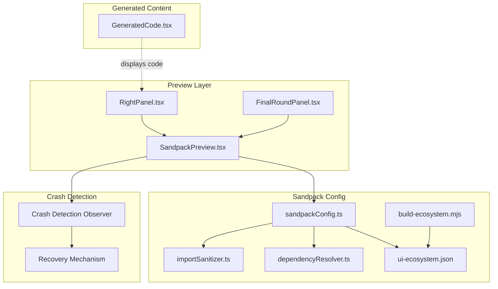
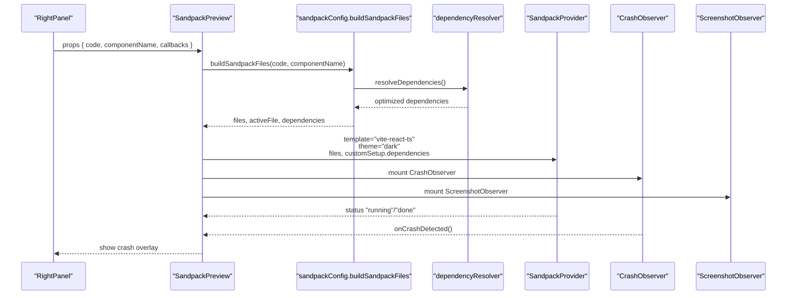
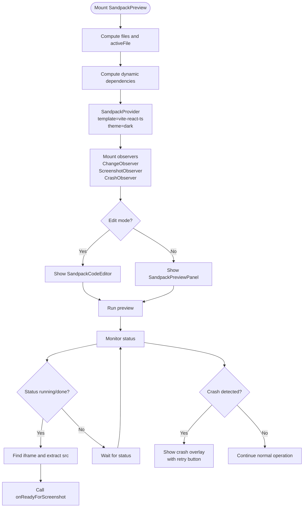
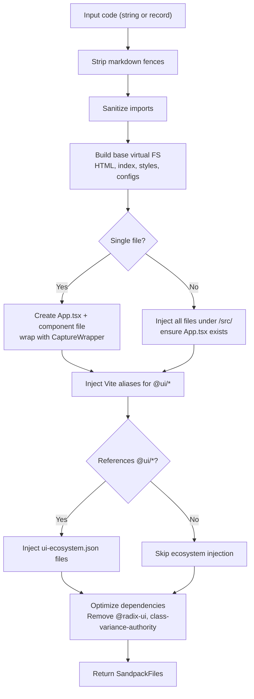
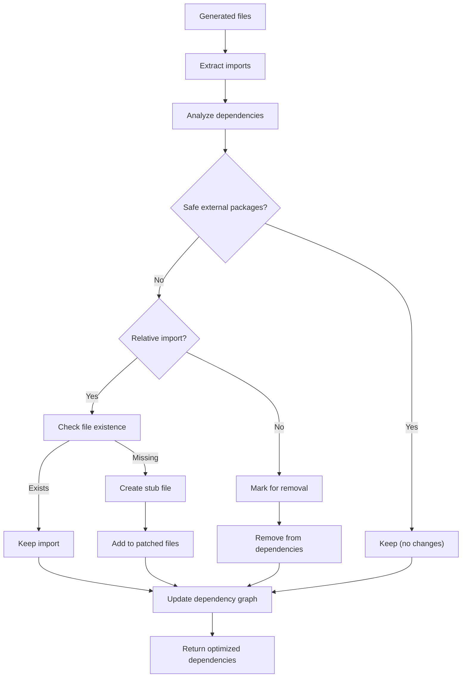
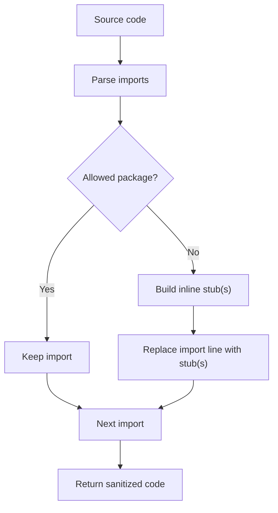
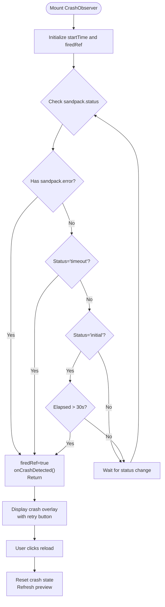
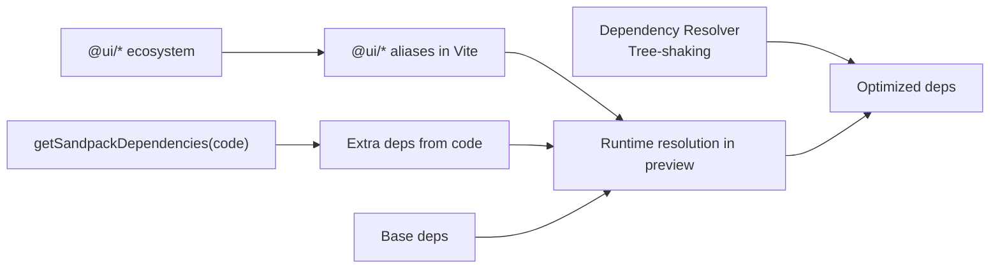

# Sandpack Integration

<cite>
**Referenced Files in This Document**
- [SandpackPreview.tsx](file://components/SandpackPreview.tsx)
- [sandpackConfig.ts](file://lib/sandbox/sandpackConfig.ts)
- [importSanitizer.ts](file://lib/sandbox/importSanitizer.ts)
- [ui-ecosystem.json](file://lib/sandbox/ui-ecosystem.json)
- [build-ecosystem.mjs](file://scripts/build-ecosystem.mjs)
- [GeneratedCode.tsx](file://components/GeneratedCode.tsx)
- [RightPanel.tsx](file://components/ide/RightPanel.tsx)
- [FinalRoundPanel.tsx](file://components/FinalRoundPanel.tsx)
- [dependencyResolver.ts](file://lib/intelligence/dependencyResolver.ts)
</cite>

## Update Summary
**Changes Made**
- Added comprehensive crash detection observer and recovery mechanism
- Implemented dependency reduction and tree-shaking improvements
- Enhanced performance with lazy loading of html2canvas
- Updated dependency management to remove unnecessary packages
- Improved error handling and user experience

## Table of Contents
1. [Introduction](#introduction)
2. [Project Structure](#project-structure)
3. [Core Components](#core-components)
4. [Architecture Overview](#architecture-overview)
5. [Detailed Component Analysis](#detailed-component-analysis)
6. [Dependency Analysis](#dependency-analysis)
7. [Performance Considerations](#performance-considerations)
8. [Troubleshooting Guide](#troubleshooting-guide)
9. [Conclusion](#conclusion)
10. [Appendices](#appendices)

## Introduction
This document explains the CodeSandbox Sandpack integration that powers the real-time component preview. It covers how the Sandpack environment is configured, how dependencies are managed, how the UI ecosystem is injected, and how the preview renders generated components with styling and interactivity. The integration now includes comprehensive crash detection, recovery mechanisms, dependency reduction, and enhanced performance optimizations.

## Project Structure
The Sandpack integration spans several modules with enhanced crash detection and performance improvements:
- The preview component that hosts Sandpack and orchestrates observers and error handling
- The Sandpack configuration builder that generates the virtual file system and dependency set
- The import sanitizer that guards against unresolved or hallucinated imports
- The UI ecosystem snapshot that supplies @ui/* packages to the preview
- The dependency resolver that performs tree-shaking and reduces bundle size
- Supporting UI components that display and interact with generated code and preview state

**Diagram sources**
- [SandpackPreview.tsx:105-151](file://components/SandpackPreview.tsx#L105-L151)
- [dependencyResolver.ts:1-169](file://lib/intelligence/dependencyResolver.ts#L1-L169)
- [sandpackConfig.ts:454-510](file://lib/sandbox/sandpackConfig.ts#L454-L510)

**Section sources**
- [SandpackPreview.tsx:105-151](file://components/SandpackPreview.tsx#L105-L151)
- [dependencyResolver.ts:1-169](file://lib/intelligence/dependencyResolver.ts#L1-L169)
- [sandpackConfig.ts:454-510](file://lib/sandbox/sandpackConfig.ts#L454-L510)

## Core Components
- **SandpackPreview**: The main preview host that sets up SandpackProvider, manages edit mode, exposes a reload button, and wires observers for code change capture, screenshot readiness, and crash detection.
- **Sandpack configuration builder**: Generates the virtual file system, injects the @ui/* ecosystem only when needed, builds Vite aliases, and computes dynamic dependencies.
- **Import sanitizer**: Scrubs unknown or hallucinated imports and replaces them with safe inline stubs.
- **Dependency resolver**: Performs tree-shaking and dependency reduction to minimize bundle size and improve performance.
- **UI ecosystem snapshot**: A prebuilt JSON of @ui/* package files injected into the virtual FS when referenced by generated code.
- **Crash detection observer**: Monitors Sandpack status and detects runtime crashes with automatic recovery.
- **Observers**: Change observer to surface inline edits, screenshot observer to signal when the preview iframe is ready, and crash observer for runtime monitoring.

**Section sources**
- [SandpackPreview.tsx:105-151](file://components/SandpackPreview.tsx#L105-L151)
- [dependencyResolver.ts:1-169](file://lib/intelligence/dependencyResolver.ts#L1-L169)
- [sandpackConfig.ts:454-510](file://lib/sandbox/sandpackConfig.ts#L454-L510)

## Architecture Overview
The preview pipeline with enhanced crash detection and performance optimizations:
- The parent panel passes generated code and component name to SandpackPreview.
- The preview builds a virtual file system and dependency set using the configuration builder.
- The configuration builder sanitizes imports, injects the @ui/* ecosystem snapshot, and sets Vite aliases.
- The dependency resolver performs tree-shaking to reduce bundle size.
- Sandpack runs the preview in a Vite-powered environment with Tailwind and React.
- Observers monitor for code changes, preview readiness, and runtime crashes.
- Crash detection observer monitors Sandpack status and triggers recovery mechanism.

**Diagram sources**
- [RightPanel.tsx:177-329](file://components/ide/RightPanel.tsx#L177-L329)
- [SandpackPreview.tsx:105-151](file://components/SandpackPreview.tsx#L105-L151)
- [dependencyResolver.ts:77-125](file://lib/intelligence/dependencyResolver.ts#L77-L125)

## Detailed Component Analysis

### SandpackPreview Component
Responsibilities:
- Host SandpackProvider with a dark theme and Vite React TS template.
- Compute files and active file from either a single code string or a multi-file record.
- Dynamically compute dependencies based on code content.
- Toggle edit mode to show/hide the inline code editor.
- Provide a force reload mechanism.
- Mount observers:
  - ChangeObserver: emits captured edits when the active file changes from its initial state.
  - ScreenshotObserver: detects when the preview iframe is ready and posts back the iframe URL for capture.
  - **CrashObserver**: monitors Sandpack status and triggers crash recovery mechanism.

Preview rendering:
- Uses SandpackLayout with a custom split between editor and preview panes.
- SandpackPreviewPanel is configured to hide navigation buttons and customize sizing.
- **Crash overlay**: Displays a friendly crash screen with retry option when runtime crashes are detected.

Error handling:
- PreviewErrorBoundary displays a friendly crash screen with a retry action when the preview fails to mount.
- **Crash overlay**: Provides immediate visual feedback and recovery options for runtime crashes.

**Diagram sources**
- [SandpackPreview.tsx:105-151](file://components/SandpackPreview.tsx#L105-L151)
- [SandpackPreview.tsx:307-321](file://components/SandpackPreview.tsx#L307-L321)

**Section sources**
- [SandpackPreview.tsx:105-151](file://components/SandpackPreview.tsx#L105-L151)
- [SandpackPreview.tsx:307-321](file://components/SandpackPreview.tsx#L307-L321)

### Sandpack Configuration Builder
Responsibilities:
- Strip markdown fences from code.
- Sanitize imports to avoid unresolved references.
- Build a virtual file system with:
  - HTML shell and Vite/Tailwind setup
  - React entry point and styles
  - Tailwind/postcss configs
  - A capture wrapper for screenshots with lazy loading
  - Either a single App.tsx + component file or a multi-file structure
  - Vite resolve aliases for @ui/* and @/lib/utils
- Inject the @ui/* ecosystem snapshot only when the code references it.
- Compute dynamic dependencies based on detected imports.
- **Optimize dependencies**: Remove unnecessary packages like @radix-ui and class-variance-authority.

Key behaviors:
- Missing relative imports are stubbed to prevent Vite resolution failures.
- Multi-file inputs are normalized and App.tsx is ensured to exist.
- Vite aliases are required because Vite 4 does not honor tsconfig paths.
- **Dependency reduction**: Only include essential packages to minimize bundle size.

**Diagram sources**
- [sandpackConfig.ts:454-510](file://lib/sandbox/sandpackConfig.ts#L454-L510)
- [sandpackConfig.ts:400-452](file://lib/sandbox/sandpackConfig.ts#L400-L452)

**Section sources**
- [sandpackConfig.ts:454-510](file://lib/sandbox/sandpackConfig.ts#L454-L510)
- [sandpackConfig.ts:400-452](file://lib/sandbox/sandpackConfig.ts#L400-L452)

### Dependency Resolver and Tree-shaking
**Updated** Enhanced dependency reduction and tree-shaking improvements

Responsibilities:
- Analyze generated source files to detect missing imports and exports.
- Perform dependency reduction by removing unnecessary packages.
- Generate stub files for missing imports to prevent preview crashes.
- Optimize the dependency graph to minimize bundle size.

Key improvements:
- **Removed @radix-ui dependency**: No longer requires Radix UI components for basic functionality.
- **Removed class-variance-authority**: Inlined component variants to reduce bundle size.
- **Smart dependency detection**: Only includes packages that are actually used.
- **Tree-shaking optimization**: Eliminates unused code and dependencies.

**Diagram sources**
- [dependencyResolver.ts:77-125](file://lib/intelligence/dependencyResolver.ts#L77-L125)
- [dependencyResolver.ts:130-168](file://lib/intelligence/dependencyResolver.ts#L130-L168)

**Section sources**
- [dependencyResolver.ts:1-169](file://lib/intelligence/dependencyResolver.ts#L1-L169)

### Import Sanitizer
Responsibilities:
- Parse import statements and detect unknown packages.
- Drop side-effect-only imports from unknown packages.
- Replace named/default imports from unknown packages with inline stubs.
- Special-case hooks, providers, and contexts with appropriate stubs.
- Warn on common hallucinations (e.g., Chakra UI, MUI, shadcn).

Behavior:
- Maintains a strict allow-list of known packages and prefixes.
- Supports relative imports and aliased imports via Vite aliases.
- **Enhanced performance**: html2canvas is now lazy-loaded to reduce initial bundle size.

**Diagram sources**
- [importSanitizer.ts:169-223](file://lib/sandbox/importSanitizer.ts#L169-L223)

**Section sources**
- [importSanitizer.ts:169-223](file://lib/sandbox/importSanitizer.ts#L169-L223)

### UI Ecosystem Injection
Mechanism:
- A build script scans the packages directory and produces a JSON map of all TypeScript files under a virtual path aligned with the Sandpack FS.
- The configuration builder conditionally injects these files into the virtual FS when the generated code references @ui/* or related aliases.

Benefits:
- Enables generated components to import from @ui/* without bundling the entire monorepo.
- Reduces cold start times by injecting only what is needed.
- **Optimized injection**: Only injects packages that are actually referenced by the code.

**Section sources**
- [build-ecosystem.mjs:1-48](file://scripts/build-ecosystem.mjs#L1-L48)
- [sandpackConfig.ts:400-452](file://lib/sandbox/sandpackConfig.ts#L400-L452)

### Crash Detection Observer and Recovery Mechanism
**New** Comprehensive crash detection and recovery system

Responsibilities:
- Monitor Sandpack status and detect runtime crashes.
- Detect various types of failures: runtime errors, bundler timeouts, and Nodebox Go runtime exits.
- Trigger automatic recovery mechanism with user-friendly retry options.
- Provide immediate visual feedback when crashes occur.

Detection criteria:
- **Runtime errors**: When `sandpack.error` is present.
- **Bundler timeouts**: When `sandpack.status` is `'timeout'`.
- **Nodebox runtime exits**: When status remains `'initial'` for more than 30 seconds.

Recovery mechanism:
- Displays a crash overlay with clear error messaging.
- Provides retry button to reload the preview.
- Resets crash state on successful reload.

**Diagram sources**
- [SandpackPreview.tsx:113-151](file://components/SandpackPreview.tsx#L113-L151)

**Section sources**
- [SandpackPreview.tsx:113-151](file://components/SandpackPreview.tsx#L113-L151)

### Observers and Integration Points
- **ChangeObserver**: Watches the active file's code and emits changes once the content diverges from the initial state and exceeds a minimum length threshold. Used to capture inline edits for feedback loops.
- **ScreenshotObserver**: Waits for the preview to reach a running/done state, then locates the preview iframe and posts back either its external src or a special internal URL for capture. This is used by the final round to generate screenshots.
- **CrashObserver**: Monitors Sandpack status and triggers crash detection when runtime failures occur.

Integration with panels:
- RightPanel receives the generated code and can trigger the preview.
- FinalRoundPanel coordinates with the preview to capture screenshots and display review results.
- **Enhanced integration**: Crash observer integrates seamlessly with the preview lifecycle.

**Section sources**
- [SandpackPreview.tsx:105-151](file://components/SandpackPreview.tsx#L105-L151)
- [RightPanel.tsx:131-173](file://components/ide/RightPanel.tsx#L131-L173)

## Dependency Analysis
The Sandpack environment relies on:
- React and ReactDOM
- Tailwind, PostCSS, and Autoprefixer
- UI ecosystem packages aliased via Vite
- Optional extras based on code content (e.g., Three.js, Framer Motion, Recharts)
- **Reduced dependencies**: Removed @radix-ui and class-variance-authority for better performance

Dynamic dependency detection:
- The builder augments a base set of dependencies with extras inferred from the code content.
- **Enhanced optimization**: Dependency resolver performs tree-shaking to eliminate unused packages.

**Diagram sources**
- [sandpackConfig.ts:454-510](file://lib/sandbox/sandpackConfig.ts#L454-L510)
- [dependencyResolver.ts:77-125](file://lib/intelligence/dependencyResolver.ts#L77-L125)

**Section sources**
- [sandpackConfig.ts:454-510](file://lib/sandbox/sandpackConfig.ts#L454-L510)
- [dependencyResolver.ts:77-125](file://lib/intelligence/dependencyResolver.ts#L77-L125)

## Performance Considerations
- **Conditional UI ecosystem injection**: The @ui/* files are only injected when the code references them, avoiding unnecessary cold starts and timeouts.
- **Virtual FS stubs**: Missing relative imports are stubbed to prevent Vite resolution errors and reduce rebuild cycles.
- **Vite aliases**: Aliases are defined in a dedicated Vite config injected into the preview to ensure fast and correct resolution.
- **Tailwind JIT**: Tailwind is configured for content paths within the preview to minimize build overhead.
- **Lazy loading**: html2canvas is now lazy-loaded to reduce initial bundle size and improve startup performance.
- **Dependency reduction**: Removed unnecessary packages like @radix-ui and class-variance-authority to minimize bundle size.
- **Tree-shaking**: Enhanced dependency resolver eliminates unused code and dependencies.

## Troubleshooting Guide
Common preview issues and remedies:
- **Preview crashes with "Failed to resolve import"**:
  - Cause: Relative import pointing to a missing file.
  - Remedy: The configuration builder injects stubs for missing relative imports; ensure the code references files that are included in the virtual FS.
- **Preview crashes with "Cannot resolve module @ui/..."**:
  - Cause: The code references @ui/* without the ecosystem being injected.
  - Remedy: Ensure the code includes references to @ui/* or related aliases; the builder injects the ecosystem when detected.
- **Preview shows a blank screen or white page**:
  - Cause: App.tsx missing or entry point not rendering.
  - Remedy: The builder ensures App.tsx exists; if multi-file input lacks App.tsx, a fallback App.tsx is created.
- **Slow cold starts**:
  - Cause: Full UI ecosystem injection on every preview.
  - Remedy: The builder conditionally injects the ecosystem only when @ui/* is referenced.
- **Screenshot capture not triggered**:
  - Cause: Preview iframe not ready or src not extracted.
  - Remedy: The observer waits for the preview to reach a running/done state and then reads the iframe src; ensure the preview is fully loaded before expecting capture.
- **Runtime crashes during preview**:
  - Cause: Too many npm dependencies or memory limits causing Nodebox runtime to exit.
  - Remedy: The crash observer detects runtime failures and displays a crash overlay with retry option; click reload to retry.
- **Large bundle size affecting performance**:
  - Cause: Unnecessary dependencies like @radix-ui or class-variance-authority.
  - Remedy: The dependency resolver removes unused packages; ensure code doesn't import unnecessary UI libraries.

**Section sources**
- [sandpackConfig.ts:400-452](file://lib/sandbox/sandpackConfig.ts#L400-L452)
- [dependencyResolver.ts:1-169](file://lib/intelligence/dependencyResolver.ts#L1-L169)
- [SandpackPreview.tsx:113-151](file://components/SandpackPreview.tsx#L113-L151)

## Conclusion
The Sandpack integration provides a robust, configurable, and performant live preview environment with comprehensive crash detection and recovery mechanisms. By sanitizing imports, injecting only necessary UI ecosystem files, performing dependency reduction and tree-shaking, and implementing lazy loading optimizations, it supports real-time editing and screenshot capture while maintaining stability and speed. The preview component's observers, crash detection system, and error boundaries further enhance usability by surfacing changes, detecting runtime failures, and handling recoveries gracefully.

## Appendices

### Preview Workflow Examples
- **Single-file generation**:
  - Pass a string containing a single component.
  - The builder creates App.tsx that wraps the generated component with the capture wrapper and injects the ecosystem if referenced.
- **Multi-file generation**:
  - Pass a record of files.
  - The builder injects all files under /src and ensures App.tsx exists; if none is present, a fallback App.tsx is created.
- **Inline editing**:
  - Enable edit mode to reveal the code editor; changes are emitted to the parent for feedback capture.
- **Screenshot capture**:
  - After the preview reaches a running state, the observer posts back the iframe URL for capture; the final round panel uses this to generate images.
- **Crash recovery**:
  - When runtime crashes are detected, the crash observer triggers a crash overlay with retry option; users can click reload to restart the preview.

**Section sources**
- [SandpackPreview.tsx:105-151](file://components/SandpackPreview.tsx#L105-L151)
- [sandpackConfig.ts:400-452](file://lib/sandbox/sandpackConfig.ts#L400-L452)

### Configuration Customization
- **Environment**:
  - Template: Vite + React + TypeScript
  - Theme: Dark
  - Visible files and active file are computed from the input.
- **Dependencies**:
  - Base dependencies include React, ReactDOM, Tailwind, and UI ecosystem packages.
  - Extra dependencies are added based on detected imports (e.g., Three.js, Framer Motion, Recharts).
  - **Optimized**: Removed @radix-ui and class-variance-authority to reduce bundle size.
- **File system simulation**:
  - Includes HTML shell, index entry, Tailwind/postcss configs, and a capture wrapper with lazy loading.
  - Vite resolve aliases for @ui/* and @/lib/utils are defined in a dedicated vite.config.ts injected into the preview.
- **Runtime execution**:
  - The index entry mounts the App inside a StrictMode wrapper and applies the capture wrapper for screenshotting.
  - **Enhanced**: html2canvas is lazy-loaded to improve initial load performance.

**Section sources**
- [SandpackPreview.tsx:278-361](file://components/SandpackPreview.tsx#L278-L361)
- [sandpackConfig.ts:400-452](file://lib/sandbox/sandpackConfig.ts#L400-L452)
- [dependencyResolver.ts:1-169](file://lib/intelligence/dependencyResolver.ts#L1-L169)

### UI Component Integration Patterns
- Generated components can import from @ui/* packages; the preview injects only the referenced packages to keep startup fast.
- Aliases in Vite ensure that imports like @ui/core, @ui/forms, and @/lib/utils resolve correctly within the preview.
- The capture wrapper ensures screenshots capture the full component content reliably.
- **Optimized integration**: Dependency resolver removes unnecessary packages, reducing bundle size and improving performance.

**Section sources**
- [sandpackConfig.ts:400-452](file://lib/sandbox/sandpackConfig.ts#L400-L452)
- [dependencyResolver.ts:1-169](file://lib/intelligence/dependencyResolver.ts#L1-L169)