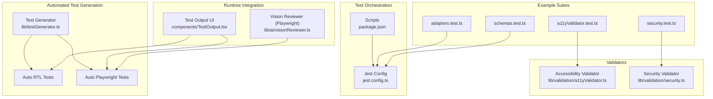
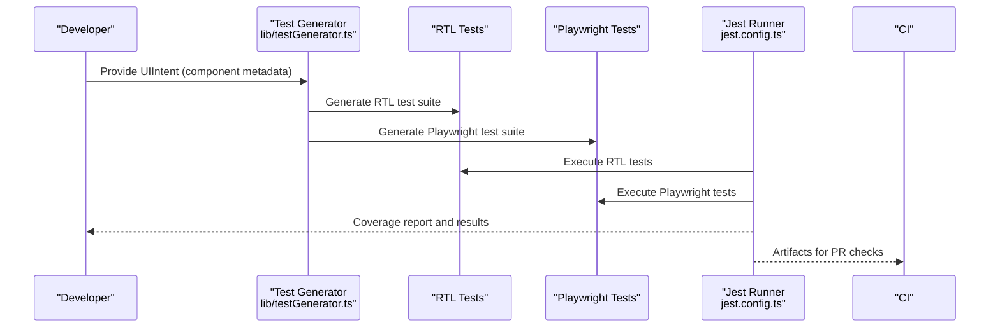
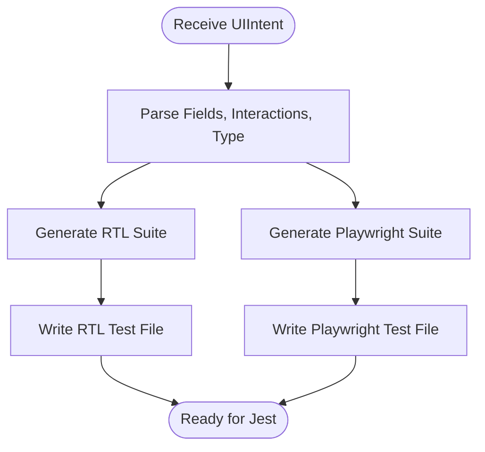
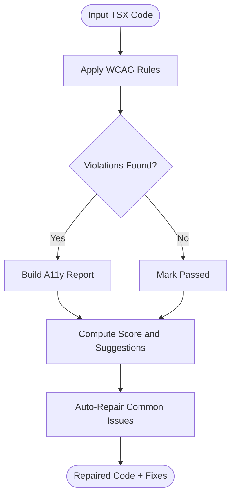
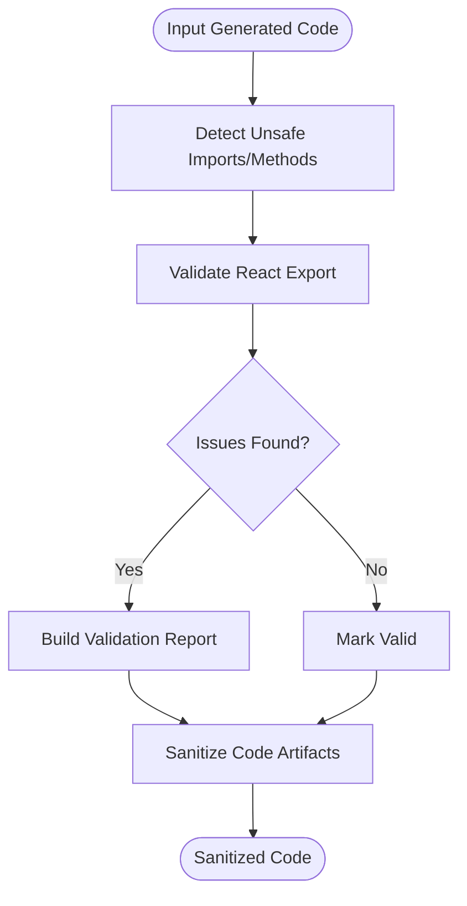
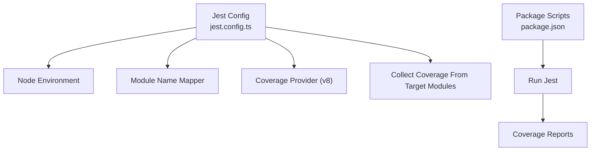
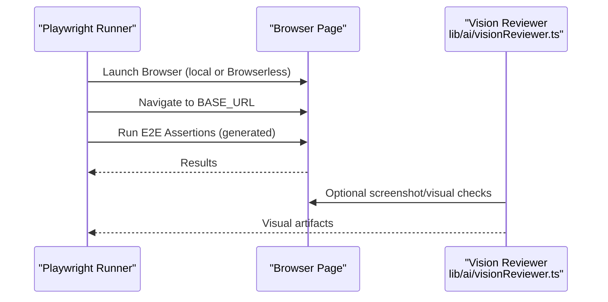
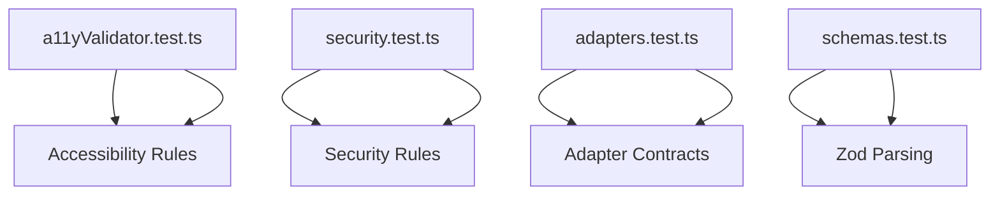
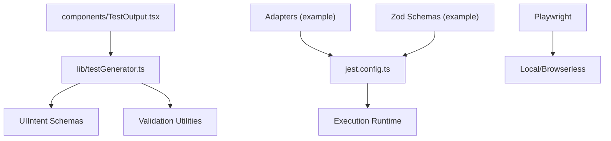

# Testing & Quality Assurance

<cite>
**Referenced Files in This Document**
- [jest.config.ts](file://jest.config.ts)
- [package.json](file://package.json)
- [lib/testGenerator.ts](file://lib/testGenerator.ts)
- [lib/validation/a11yValidator.ts](file://lib/validation/a11yValidator.ts)
- [lib/validation/security.ts](file://lib/validation/security.ts)
- [__tests__/a11yValidator.test.ts](file://__tests__/a11yValidator.test.ts)
- [__tests__/security.test.ts](file://__tests__/security.test.ts)
- [__tests__/adapters.test.ts](file://__tests__/adapters.test.ts)
- [__tests__/schemas.test.ts](file://__tests__/schemas.test.ts)
- [components/TestOutput.tsx](file://components/TestOutput.tsx)
- [lib/ai/visionReviewer.ts](file://lib/ai/visionReviewer.ts)
</cite>

## Table of Contents
1. [Introduction](#introduction)
2. [Project Structure](#project-structure)
3. [Core Components](#core-components)
4. [Architecture Overview](#architecture-overview)
5. [Detailed Component Analysis](#detailed-component-analysis)
6. [Dependency Analysis](#dependency-analysis)
7. [Performance Considerations](#performance-considerations)
8. [Troubleshooting Guide](#troubleshooting-guide)
9. [Conclusion](#conclusion)
10. [Appendices](#appendices)

## Introduction
This document describes the automated testing and quality assurance system for the AI-powered accessibility-first UI engine. It covers:
- The Playwright end-to-end (E2E) test integration for component validation and cross-browser compatibility.
- The automated test generation system that produces React Testing Library and Playwright test suites for generated components.
- Jest configuration, execution workflows, and coverage measurement strategies.
- Quality assurance processes including component testing, integration testing, and regression testing.
- Practical guidance for writing custom tests, running suites, interpreting results, and maintaining coverage.
- Debugging test failures, performance testing considerations, and continuous integration workflows.

## Project Structure
The testing ecosystem is organized around:
- Jest configuration and scripts for unit and integration tests.
- A dedicated test generator that produces RTL and Playwright tests from component intents.
- Validation libraries for accessibility and security checks used during QA.
- Example test suites demonstrating coverage of adapters, schemas, and validators.
- UI components that surface generated test outputs for review and iteration.

**Diagram sources**
- [jest.config.ts:1-23](file://jest.config.ts#L1-L23)
- [package.json:5-12](file://package.json#L5-L12)
- [lib/testGenerator.ts:1-265](file://lib/testGenerator.ts#L1-L265)
- [lib/validation/a11yValidator.ts:1-376](file://lib/validation/a11yValidator.ts#L1-L376)
- [lib/validation/security.ts:1-129](file://lib/validation/security.ts#L1-L129)
- [__tests__/a11yValidator.test.ts:1-110](file://__tests__/a11yValidator.test.ts#L1-L110)
- [__tests__/security.test.ts:1-60](file://__tests__/security.test.ts#L1-L60)
- [__tests__/adapters.test.ts:1-109](file://__tests__/adapters.test.ts#L1-L109)
- [__tests__/schemas.test.ts:1-120](file://__tests__/schemas.test.ts#L1-L120)
- [components/TestOutput.tsx:93-123](file://components/TestOutput.tsx#L93-L123)
- [lib/ai/visionReviewer.ts:37-64](file://lib/ai/visionReviewer.ts#L37-L64)

**Section sources**
- [jest.config.ts:1-23](file://jest.config.ts#L1-L23)
- [package.json:5-12](file://package.json#L5-L12)
- [lib/testGenerator.ts:1-265](file://lib/testGenerator.ts#L1-L265)
- [lib/validation/a11yValidator.ts:1-376](file://lib/validation/a11yValidator.ts#L1-L376)
- [lib/validation/security.ts:1-129](file://lib/validation/security.ts#L1-L129)
- [__tests__/a11yValidator.test.ts:1-110](file://__tests__/a11yValidator.test.ts#L1-L110)
- [__tests__/security.test.ts:1-60](file://__tests__/security.test.ts#L1-L60)
- [__tests__/adapters.test.ts:1-109](file://__tests__/adapters.test.ts#L1-L109)
- [__tests__/schemas.test.ts:1-120](file://__tests__/schemas.test.ts#L1-L120)
- [components/TestOutput.tsx:93-123](file://components/TestOutput.tsx#L93-L123)
- [lib/ai/visionReviewer.ts:37-64](file://lib/ai/visionReviewer.ts#L37-L64)

## Core Components
- Jest configuration defines environment, module mapping, and coverage collection for targeted modules.
- Automated test generator produces:
  - React Testing Library tests for rendering, interaction, validation, and accessibility checks.
  - Playwright E2E tests for visual checks, keyboard navigation, accessibility scanning, and mobile responsiveness.
- Validators enforce accessibility and security rules on generated code and surface actionable reports and repairs.
- Example test suites demonstrate:
  - Accessibility rule detection and auto-repair.
  - Security validation for browser-safe code and sanitization.
  - Adapter implementations and streaming behavior.
  - Zod schema parsing and defaults.

**Section sources**
- [jest.config.ts:8-22](file://jest.config.ts#L8-L22)
- [lib/testGenerator.ts:8-161](file://lib/testGenerator.ts#L8-L161)
- [lib/testGenerator.ts:163-263](file://lib/testGenerator.ts#L163-L263)
- [lib/validation/a11yValidator.ts:264-297](file://lib/validation/a11yValidator.ts#L264-L297)
- [lib/validation/security.ts:6-34](file://lib/validation/security.ts#L6-L34)
- [__tests__/a11yValidator.test.ts:1-110](file://__tests__/a11yValidator.test.ts#L1-L110)
- [__tests__/security.test.ts:1-60](file://__tests__/security.test.ts#L1-L60)
- [__tests__/adapters.test.ts:1-109](file://__tests__/adapters.test.ts#L1-L109)
- [__tests__/schemas.test.ts:1-120](file://__tests__/schemas.test.ts#L1-L120)

## Architecture Overview
The QA pipeline integrates code generation, validation, automated test generation, and execution across unit, component, and E2E layers.

**Diagram sources**
- [lib/testGenerator.ts:8-161](file://lib/testGenerator.ts#L8-L161)
- [lib/testGenerator.ts:163-263](file://lib/testGenerator.ts#L163-L263)
- [jest.config.ts:1-23](file://jest.config.ts#L1-L23)

## Detailed Component Analysis

### Automated Test Generation System
The generator accepts a UI intent and produces two complementary suites:
- React Testing Library tests covering rendering, user interactions, validation, and accessibility checks.
- Playwright E2E tests covering visual stability, keyboard navigation, accessibility scanning, and mobile viewport behavior.

**Diagram sources**
- [lib/testGenerator.ts:8-161](file://lib/testGenerator.ts#L8-L161)
- [lib/testGenerator.ts:163-263](file://lib/testGenerator.ts#L163-L263)

**Section sources**
- [lib/testGenerator.ts:8-161](file://lib/testGenerator.ts#L8-L161)
- [lib/testGenerator.ts:163-263](file://lib/testGenerator.ts#L163-L263)

### Accessibility Validator and Auto-Repair
The validator statically analyzes generated TSX code against WCAG 2.1 AA rules and computes a pass/fail score. It also auto-repairs common issues.

**Diagram sources**
- [lib/validation/a11yValidator.ts:264-297](file://lib/validation/a11yValidator.ts#L264-L297)
- [lib/validation/a11yValidator.ts:303-375](file://lib/validation/a11yValidator.ts#L303-L375)

**Section sources**
- [lib/validation/a11yValidator.ts:19-260](file://lib/validation/a11yValidator.ts#L19-L260)
- [lib/validation/a11yValidator.ts:264-297](file://lib/validation/a11yValidator.ts#L264-L297)
- [lib/validation/a11yValidator.ts:303-375](file://lib/validation/a11yValidator.ts#L303-L375)
- [__tests__/a11yValidator.test.ts:1-110](file://__tests__/a11yValidator.test.ts#L1-L110)

### Security Validator and Sanitization
The security validator ensures generated code is safe for the browser environment and sanitizes problematic constructs that cause parsing errors.

**Diagram sources**
- [lib/validation/security.ts:6-34](file://lib/validation/security.ts#L6-L34)
- [lib/validation/security.ts:44-128](file://lib/validation/security.ts#L44-L128)

**Section sources**
- [lib/validation/security.ts:6-34](file://lib/validation/security.ts#L6-L34)
- [lib/validation/security.ts:44-128](file://lib/validation/security.ts#L44-L128)
- [__tests__/security.test.ts:1-60](file://__tests__/security.test.ts#L1-L60)

### Jest Configuration and Coverage
Jest runs under Node environment, resolves monorepo-style aliases, and collects coverage from selected modules. Scripts enable quick test runs and coverage reporting.

**Diagram sources**
- [jest.config.ts:8-22](file://jest.config.ts#L8-L22)
- [package.json:5-12](file://package.json#L5-L12)

**Section sources**
- [jest.config.ts:8-22](file://jest.config.ts#L8-L22)
- [package.json:5-12](file://package.json#L5-L12)

### Playwright E2E Integration and Cross-Browser Compatibility
Playwright is integrated for E2E testing and optional cloud execution via Browserless. The generator emits Playwright tests that validate:
- Page load and visibility.
- Keyboard navigation reachability.
- Accessibility checks (placeholder for axe-core).
- Focus indicators.
- Required field validation.
- Mobile viewport responsiveness.

**Diagram sources**
- [lib/testGenerator.ts:163-263](file://lib/testGenerator.ts#L163-L263)
- [lib/ai/visionReviewer.ts:37-64](file://lib/ai/visionReviewer.ts#L37-L64)

**Section sources**
- [lib/testGenerator.ts:163-263](file://lib/testGenerator.ts#L163-L263)
- [lib/ai/visionReviewer.ts:37-64](file://lib/ai/visionReviewer.ts#L37-L64)

### Example Test Suites and QA Processes
- Accessibility Validator tests assert detection and auto-repair of common issues.
- Security Validator tests assert detection of unsafe constructs and sanitization behavior.
- Adapters tests validate multiple AI providers, streaming, and URL migration logic.
- Schemas tests validate Zod parsing and defaults for intent structures.

**Diagram sources**
- [__tests__/a11yValidator.test.ts:1-110](file://__tests__/a11yValidator.test.ts#L1-L110)
- [__tests__/security.test.ts:1-60](file://__tests__/security.test.ts#L1-L60)
- [__tests__/adapters.test.ts:1-109](file://__tests__/adapters.test.ts#L1-L109)
- [__tests__/schemas.test.ts:1-120](file://__tests__/schemas.test.ts#L1-L120)

**Section sources**
- [__tests__/a11yValidator.test.ts:1-110](file://__tests__/a11yValidator.test.ts#L1-L110)
- [__tests__/security.test.ts:1-60](file://__tests__/security.test.ts#L1-L60)
- [__tests__/adapters.test.ts:1-109](file://__tests__/adapters.test.ts#L1-L109)
- [__tests__/schemas.test.ts:1-120](file://__tests__/schemas.test.ts#L1-L120)

## Dependency Analysis
The system exhibits clear separation of concerns:
- Test generation depends on UI intent schemas and validation utilities.
- Jest orchestrates execution and coverage collection.
- Playwright executes E2E tests and integrates with optional cloud browsers.
- Example suites depend on core validators and adapters.

**Diagram sources**
- [lib/testGenerator.ts:1-265](file://lib/testGenerator.ts#L1-L265)
- [jest.config.ts:1-23](file://jest.config.ts#L1-L23)
- [components/TestOutput.tsx:93-123](file://components/TestOutput.tsx#L93-L123)
- [__tests__/adapters.test.ts:1-109](file://__tests__/adapters.test.ts#L1-L109)
- [__tests__/schemas.test.ts:1-120](file://__tests__/schemas.test.ts#L1-L120)

**Section sources**
- [lib/testGenerator.ts:1-265](file://lib/testGenerator.ts#L1-L265)
- [jest.config.ts:1-23](file://jest.config.ts#L1-L23)
- [components/TestOutput.tsx:93-123](file://components/TestOutput.tsx#L93-L123)
- [__tests__/adapters.test.ts:1-109](file://__tests__/adapters.test.ts#L1-L109)
- [__tests__/schemas.test.ts:1-120](file://__tests__/schemas.test.ts#L1-L120)

## Performance Considerations
- Prefer Playwright’s headless mode for CI and reduce viewport sizes for faster runs.
- Use Browserless for scalable cross-browser testing without local browser installs.
- Limit coverage collection to relevant modules to speed up Jest runs.
- Parallelize test execution where appropriate and avoid heavy fixtures initialization in shared setup.

[No sources needed since this section provides general guidance]

## Troubleshooting Guide
Common issues and resolutions:
- Playwright not installed: Ensure the Chromium browser is installed before running E2E tests.
- BASE_URL not set: Set the BASE_URL environment variable to point to the running application.
- Missing axe-core integration: The Playwright tests include a placeholder for axe-core checks; install and configure as needed.
- Browserless connectivity: Confirm API key and network access; the reviewer handles connection timeouts gracefully.
- Coverage gaps: Adjust Jest coverage collection patterns to include newly added modules.

**Section sources**
- [lib/testGenerator.ts:189-190](file://lib/testGenerator.ts#L189-L190)
- [lib/ai/visionReviewer.ts:37-64](file://lib/ai/visionReviewer.ts#L37-L64)
- [jest.config.ts:14-19](file://jest.config.ts#L14-L19)

## Conclusion
The QA system combines automated test generation, robust validators, and flexible execution environments to ensure generated components are accessible, secure, and resilient. By leveraging Jest for unit/integration tests and Playwright for E2E validation, teams can maintain high-quality standards across UI generations and integrations.

[No sources needed since this section summarizes without analyzing specific files]

## Appendices

### Writing Custom Tests
- For RTL: Use the generated templates as a starting point and add assertions for component-specific behavior.
- For Playwright: Extend the generated suites with domain-specific validations and cross-browser checks.
- For Jest: Add new test files under the test directory and ensure they align with coverage targets.

**Section sources**
- [lib/testGenerator.ts:88-160](file://lib/testGenerator.ts#L88-L160)
- [lib/testGenerator.ts:178-263](file://lib/testGenerator.ts#L178-L263)

### Running Test Suites and Interpreting Results
- Unit and integration tests: Use the test scripts to run Jest and view coverage summaries.
- E2E tests: Install Playwright browsers and execute Playwright tests against the running application.
- Coverage: Review coverage reports to identify untested modules and expand test coverage accordingly.

**Section sources**
- [package.json:5-12](file://package.json#L5-L12)
- [jest.config.ts:9-22](file://jest.config.ts#L9-L22)

### Maintaining Test Coverage
- Keep coverage collection focused on critical modules (security, validation, adapters).
- Regularly regenerate tests for new components and update expectations as UI evolves.
- Use the Test Output UI to review and iterate on generated tests.

**Section sources**
- [jest.config.ts:14-19](file://jest.config.ts#L14-L19)
- [components/TestOutput.tsx:93-123](file://components/TestOutput.tsx#L93-L123)