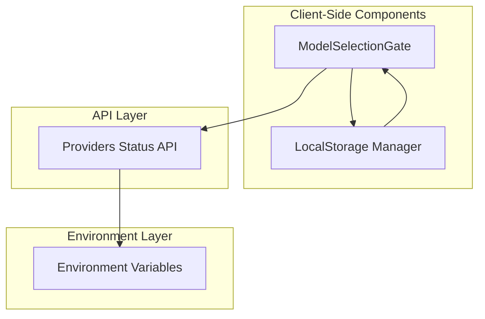
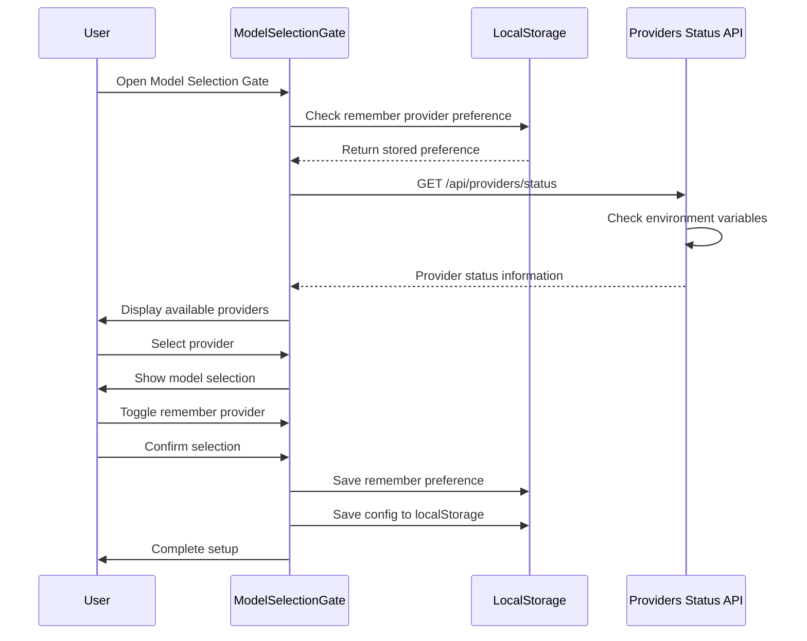
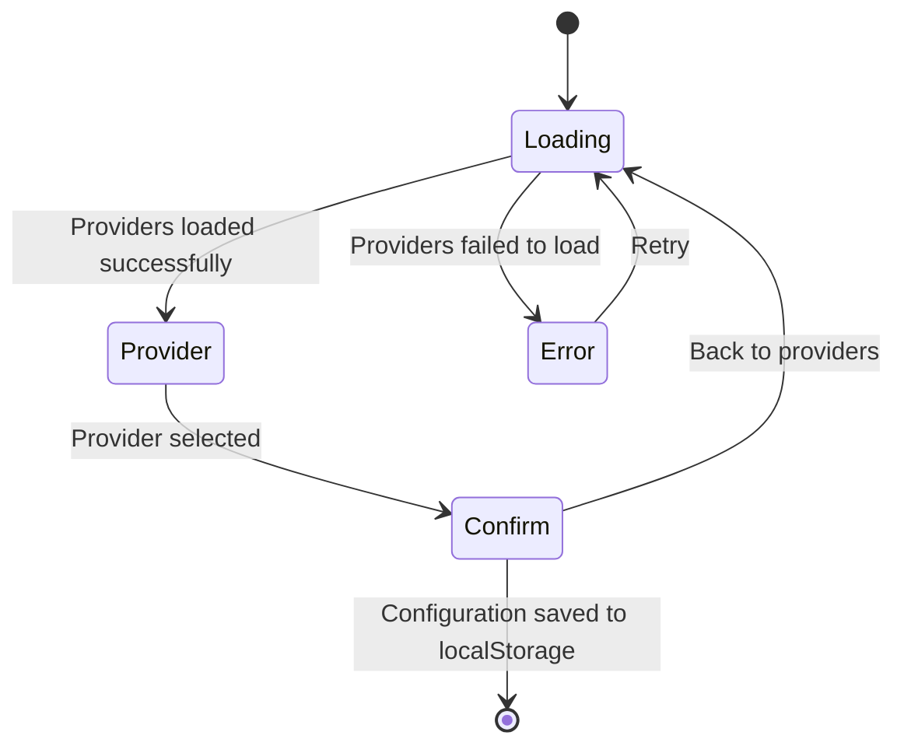
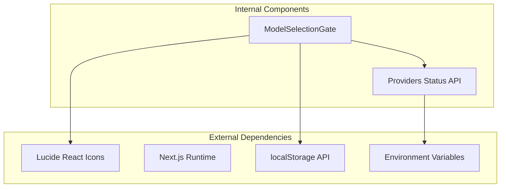

# Model Selection Gate

<cite>
**Referenced Files in This Document**
- [ModelSelectionGate.tsx](file://components/ModelSelectionGate.tsx)
- [providers/status/route.ts](file://app/api/providers/status/route.ts)
- [page.tsx](file://app/page.tsx)
</cite>

## Update Summary
**Changes Made**
- Updated to reflect migration from server-side configuration management to client-side localStorage persistence
- Removed references to /api/engine-config endpoint and server-side encryption
- Updated component architecture to show localStorage-based configuration storage
- Revised security implementation details to reflect client-side preference management
- Updated workflow diagrams to show simplified configuration process without server calls

## Table of Contents
1. [Introduction](#introduction)
2. [Project Structure](#project-structure)
3. [Core Components](#core-components)
4. [Architecture Overview](#architecture-overview)
5. [Detailed Component Analysis](#detailed-component-analysis)
6. [Enhanced Features](#enhanced-features)
7. [Dependency Analysis](#dependency-analysis)
8. [Performance Considerations](#performance-considerations)
9. [Troubleshooting Guide](#troubleshooting-guide)
10. [Conclusion](#conclusion)

## Introduction

The Model Selection Gate is a critical component in the AI-powered accessibility-first UI engine that serves as the primary entry point for configuring AI providers and models. This component provides a guided, secure, and user-friendly interface for users to select their preferred AI provider, configure model settings, and establish secure connections to external AI services.

**Updated** The component now operates entirely on the client side with configuration persisted in localStorage, eliminating the need for server-side API calls. The migration from server-side configuration management to client-side localStorage persistence simplifies the architecture while maintaining security through environment variable-based API key resolution.

The gate operates as a modal overlay that appears when no existing AI configuration is detected in localStorage, ensuring that users cannot proceed with the application until they have properly configured their AI provider settings. This design choice prioritizes security by preventing accidental operation without proper authentication and by providing clear guidance for API key configuration.

## Project Structure

The Model Selection Gate has been redesigned to operate entirely client-side with configuration stored in localStorage. The component follows a simplified architecture with clear separation between presentation, local storage management, and security considerations.

**Diagram sources**
- [ModelSelectionGate.tsx:76-81](file://components/ModelSelectionGate.tsx#L76-L81)
- [ModelSelectionGate.tsx:130-141](file://components/ModelSelectionGate.tsx#L130-L141)
- [providers/status/route.ts:137-215](file://app/api/providers/status/route.ts#L137-L215)

**Section sources**
- [ModelSelectionGate.tsx:1-425](file://components/ModelSelectionGate.tsx#L1-L425)
- [page.tsx:550-557](file://app/page.tsx#L550-L557)

## Core Components

The Model Selection Gate system has been streamlined to operate entirely on the client side with configuration stored in localStorage. The component maintains its core functionality while eliminating server-side dependencies.

### Primary Components

**ModelSelectionGate Component**
- Main modal interface for provider selection with enhanced user experience
- Handles loading states, error conditions, and user interactions
- Manages the new 'remember provider' toggle functionality using localStorage
- Integrates with localStorage for preference persistence
- Provides streamlined configuration workflow without server calls
- **Updated**: Eliminated server-side API dependency for configuration storage

**Provider Status API**
- Returns configured providers based on environment variables
- Provides optimized settings for each AI provider
- Supports universal API key configuration
- Filters providers based on availability
- **Updated**: Simplified to focus solely on provider discovery

**Local Storage Management**
- **New**: Client-side configuration persistence using localStorage
- **New**: Remember provider preference management
- **New**: Configuration retrieval and validation
- **New**: Graceful degradation when localStorage is unavailable

**Section sources**
- [ModelSelectionGate.tsx:65-425](file://components/ModelSelectionGate.tsx#L65-L425)
- [providers/status/route.ts:137-215](file://app/api/providers/status/route.ts#L137-L215)

## Architecture Overview

The Model Selection Gate now implements a client-side architecture that eliminates server dependencies while maintaining security and performance standards. The system operates entirely in the browser with configuration stored locally.

**Diagram sources**
- [ModelSelectionGate.tsx:76-81](file://components/ModelSelectionGate.tsx#L76-L81)
- [ModelSelectionGate.tsx:130-141](file://components/ModelSelectionGate.tsx#L130-L141)
- [providers/status/route.ts:137-215](file://app/api/providers/status/route.ts#L137-L215)

The architecture emphasizes several key principles:

**Client-Side First Design**: Configuration is managed entirely in the browser using localStorage, eliminating server dependencies and reducing complexity.

**Enhanced User Experience**: The component now includes intelligent preference management through localStorage integration, allowing users to streamline their configuration process on subsequent visits.

**Simplified Security Model**: API keys are resolved through environment variables and never stored in localStorage, maintaining security while simplifying the configuration process.

**Performance Optimization**: The system eliminates server round-trips for configuration storage, improving response times and reducing server load.

**User Experience**: The component provides clear feedback at every step, with loading indicators, error handling, and intuitive navigation between different configuration stages. The new remember provider feature enhances the user experience by reducing repetitive configuration steps.

## Detailed Component Analysis

### ModelSelectionGate Component

The ModelSelectionGate component has been redesigned to operate entirely client-side with configuration stored in localStorage. The component maintains its core functionality while eliminating server dependencies.

#### Component Structure and State Management

The component manages several distinct states to handle the different phases of the configuration process, including the new remember provider functionality:

**Diagram sources**
- [ModelSelectionGate.tsx:70-110](file://components/ModelSelectionGate.tsx#L70-L110)

The component implements a comprehensive state management system with the following key states:

- **Loading State**: Initial state while fetching provider information from the server
- **Provider Selection State**: Displays available providers with their branding and features
- **Confirmation State**: Allows users to review and finalize their selection with remember provider toggle
- **Error State**: Handles configuration failures and provides guidance

#### Enhanced Provider Integration and Branding

The component supports five major AI providers, each with customized branding and optimized settings:

| Provider | Brand Color | Icon | Recommended Models |
|----------|-------------|------|-------------------|
| OpenAI | Emerald Green | ✨ | GPT-4o, GPT-4o-mini, o3-mini |
| Anthropic | Amber Orange | 💻 | Claude 3.5 Sonnet, Claude 3 Opus |
| Google | Blue | 🌍 | Gemini 2.0 Flash, Gemini 1.5 Pro |
| Groq | Orange | ⚡ | Llama 3.3 70B, Mixtral 8x7B |
| Ollama | Gray | 🖥️ | Local models |

Each provider integration includes:
- Custom branded visual elements
- Optimized temperature and token settings
- Provider-specific model recommendations
- **Updated**: Security indicators showing environment variable-based key resolution

#### Enhanced Security Implementation

The Model Selection Gate implements a client-side security model that leverages environment variables for API key management:

**Client-Side Security**:
- API keys are resolved from environment variables, never stored in localStorage
- Configuration is validated before transmission
- **New**: Remember provider preference stored in localStorage with automatic persistence
- **New**: Environment variable-based key resolution for enhanced security

**Simplified Server-Side Security**:
- **Updated**: Server-side encryption and database storage eliminated
- **Updated**: Provider detection now focuses on environment variable validation
- **Updated**: Reduced server dependencies for configuration management

**Section sources**
- [ModelSelectionGate.tsx:55-61](file://components/ModelSelectionGate.tsx#L55-L61)
- [ModelSelectionGate.tsx:20-39](file://components/ModelSelectionGate.tsx#L20-L39)
- [providers/status/route.ts:62-120](file://app/api/providers/status/route.ts#L62-L120)

### API Integration Layer

The Model Selection Gate relies on a simplified server-side API for provider discovery and configuration validation.

#### Providers Status API

The `/api/providers/status` endpoint serves as the central hub for provider discovery and configuration validation. This API checks environment variables to determine which providers are available to the current workspace.

**Key Features**:
- Environment variable detection for API keys
- Universal key support (LLM_KEY for all providers)
- Provider-specific model lists
- Optimized settings for each provider
- Real-time configuration status
- **Updated**: Simplified to focus on provider discovery only

**Section sources**
- [providers/status/route.ts:137-215](file://app/api/providers/status/route.ts#L137-L215)

### Security Architecture

The Model Selection Gate now implements a client-side security architecture that leverages environment variables for API key management.

**Diagram sources**
- [ModelSelectionGate.tsx:130-141](file://components/ModelSelectionGate.tsx#L130-L141)

**Section sources**
- [page.tsx:104-105](file://app/page.tsx#L104-L105)

## Enhanced Features

### Remember Provider Toggle Feature

**New Feature**: The Model Selection Gate now includes a 'remember provider' toggle that enhances user experience by allowing users to persist their provider preferences across sessions.

#### Implementation Details

The remember provider feature is implemented using localStorage for client-side persistence:

- **State Management**: The component maintains a `rememberProvider` state that is initialized from localStorage
- **Automatic Persistence**: When users confirm their selection, the preference is automatically saved to localStorage
- **Cross-Session Persistence**: Preferences are maintained across browser sessions and page reloads
- **Default Behavior**: Defaults to `false` for new users, allowing them to decide whether to remember their choice

#### User Experience Benefits

- **Reduced Configuration Steps**: Returning users can bypass the provider selection process
- **Personalized Experience**: Users can set their preferred provider as default
- **Intuitive Controls**: Simple checkbox toggle with clear visual feedback
- **Privacy Control**: Users retain full control over whether to remember their preference

**Section sources**
- [ModelSelectionGate.tsx:76-81](file://components/ModelSelectionGate.tsx#L76-L81)
- [ModelSelectionGate.tsx:130-131](file://components/ModelSelectionGate.tsx#L130-L131)
- [ModelSelectionGate.tsx:388-400](file://components/ModelSelectionGate.tsx#L388-L400)

### Streamlined Configuration Workflow

**Enhanced Feature**: The component has been optimized to provide a more streamlined configuration experience with improved provider detection and environment variable-based credential management.

#### Workflow Improvements

- **Enhanced Provider Detection**: Improved logic for detecting configured providers from environment variables
- **Better Error Handling**: More informative error messages and guidance for users
- **Optimized Loading States**: Faster provider loading with better user feedback
- **Improved Model Selection**: Enhanced model selection interface with better visual hierarchy
- **Updated**: Simplified configuration process without server dependencies

#### User Interface Enhancements

- **Visual Progress Indicators**: Clear indication of current configuration step
- **Better Form Feedback**: Real-time validation and error messaging
- **Enhanced Security Indicators**: Clear communication of environment variable-based key resolution
- **Responsive Design**: Improved mobile and desktop user experience

**Section sources**
- [ModelSelectionGate.tsx:84-116](file://components/ModelSelectionGate.tsx#L84-L116)
- [ModelSelectionGate.tsx:190-233](file://components/ModelSelectionGate.tsx#L190-L233)

## Dependency Analysis

The Model Selection Gate system has been simplified to operate entirely client-side with minimal dependencies.

**Diagram sources**
- [ModelSelectionGate.tsx:3-16](file://components/ModelSelectionGate.tsx#L3-L16)
- [providers/status/route.ts:10-11](file://app/api/providers/status/route.ts#L10-L11)

### Component Coupling Analysis

The Model Selection Gate demonstrates excellent design principles with low internal coupling and high external coupling:

**Low Internal Coupling**:
- Component focuses solely on UI and user interaction
- Minimal state sharing between different functional areas
- Clear separation between presentation and logic

**High External Coupling**:
- Integration with API layer for provider discovery
- Deep integration with environment variables for credential resolution
- Seamless integration with localStorage for configuration persistence

### Data Flow Patterns

The system implements a simplified data flow pattern:

**Unidirectional Data Flow**: All state changes flow from parent components to child components, ensuring predictable behavior and easier debugging.

**Event-Driven Communication**: Parent components receive callbacks from child components, enabling loose coupling while maintaining clear communication channels.

**Asynchronous Data Loading**: Network operations use async/await patterns with proper error handling and loading states.

**Enhanced Preference Management**: New data flow for localStorage integration with automatic persistence and retrieval.

**Section sources**
- [ModelSelectionGate.tsx:77-154](file://components/ModelSelectionGate.tsx#L77-L154)
- [page.tsx:523-537](file://app/page.tsx#L523-L537)

## Performance Considerations

The Model Selection Gate system has been optimized for client-side performance with reduced complexity and improved efficiency.

### Client-Side Caching Strategy

The component implements efficient client-side caching using localStorage:

**Local Storage Optimization**:
- Configuration stored directly in localStorage for instant retrieval
- Remember provider preference cached for immediate access
- Environment variable resolution handled by the browser
- Fallback mechanisms for graceful degradation

**Performance Impact**:
- Elimination of server round-trips for configuration storage
- Reduced latency for returning users
- Lower server load and improved scalability

### Network Optimization

The system implements several network optimization strategies:

**Reduced API Calls**: Only provider discovery requires server communication, eliminating configuration storage calls.

**Timeout Management**: All external API calls implement timeout mechanisms to prevent hanging requests and improve user experience.

**Error Recovery**: Intelligent retry mechanisms with exponential backoff for transient failures.

### Memory Management

The component is designed with memory efficiency in mind:

**State Optimization**: Only essential data is maintained in component state, with heavy data structures managed by server-side APIs.

**Cleanup Strategies**: Proper cleanup of event listeners and timers to prevent memory leaks.

**Enhanced Preference Management**: Efficient localStorage integration with minimal memory footprint.

**Section sources**
- [ModelSelectionGate.tsx:76-81](file://components/ModelSelectionGate.tsx#L76-L81)
- [page.tsx:550-557](file://app/page.tsx#L550-L557)

## Troubleshooting Guide

The Model Selection Gate system includes comprehensive error handling and diagnostic capabilities to help users and developers identify and resolve issues quickly.

### Common Configuration Issues

**Missing API Keys**:
- Symptom: Error state displays with environment variable requirements
- Solution: Add required API keys to Vercel environment variables
- Prevention: Use universal LLM_KEY for simplified configuration

**Network Connectivity Problems**:
- Symptom: Loading state persists beyond expected time
- Solution: Check external API connectivity and firewall settings
- Prevention: Implement proper timeout handling and retry logic

**LocalStorage Issues**:
- **New**: Symptom: Remember provider preference not persisting
- **New**: Solution: Check browser localStorage permissions and quota limits
- **New**: Prevention: Implement graceful degradation when localStorage is unavailable

**Environment Variable Issues**:
- **Updated**: Symptom: Providers not appearing despite having API keys
- **Updated**: Solution: Verify environment variables are properly configured in Vercel
- **Updated**: Prevention: Use universal LLM_KEY for simplified configuration

### Diagnostic Tools

**Debug Information**: The system provides detailed debug information in development environments, including:

- Environment variable inspection
- Provider configuration status
- LocalStorage preference management
- **Updated**: Environment variable-based key resolution diagnostics

**Error Logging**: Comprehensive error logging with structured data for troubleshooting:

- Request/response traces
- Authentication failures
- Network connectivity issues
- **New**: Preference persistence errors
- **Updated**: Environment variable resolution errors

### Section sources**
- [ModelSelectionGate.tsx:190-224](file://components/ModelSelectionGate.tsx#L190-L224)
- [providers/status/route.ts:146-176](file://app/api/providers/status/route.ts#L146-L176)

## Conclusion

The Model Selection Gate represents a significantly simplified implementation of AI provider configuration that successfully balances user experience, security, and performance. The migration from server-side configuration management to client-side localStorage persistence has resulted in a more efficient and user-friendly system.

**Recent Enhancements**:
- **Client-Side Architecture**: Complete migration to localStorage-based configuration management
- **Enhanced User Experience**: Improved provider detection, environment variable-based credential management, and visual feedback
- **Optimized Performance**: Elimination of server dependencies and reduced configuration steps for returning users
- **Simplified Security Model**: Environment variable-based key resolution with enhanced security

Key achievements of the system include:

**Simplified Architecture**: Complete elimination of server-side dependencies while maintaining functionality and security.

**Enhanced User Experience**: Intuitive multi-step wizard with clear feedback, comprehensive error handling, responsive design, and personalized preference management through the remember provider feature.

**Performance Optimization**: Elimination of server round-trips for configuration storage, improved response times, and reduced server load.

**Security Excellence**: Environment variable-based API key resolution maintains security while simplifying the configuration process.

**Extensibility**: Modular architecture that supports easy addition of new AI providers and configuration options.

The Model Selection Gate serves as a foundational component that enables the broader AI-powered accessibility-first UI engine to deliver a secure, reliable, and user-friendly experience for generating accessible user interfaces through AI assistance. The recent migration to client-side configuration management makes it an even more effective tool for onboarding new users while improving the experience for returning users through the remember provider feature and streamlined workflow.