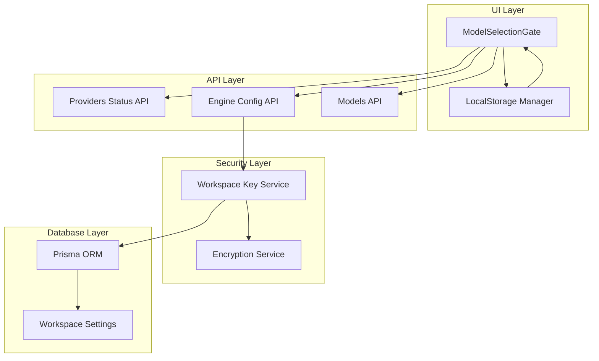
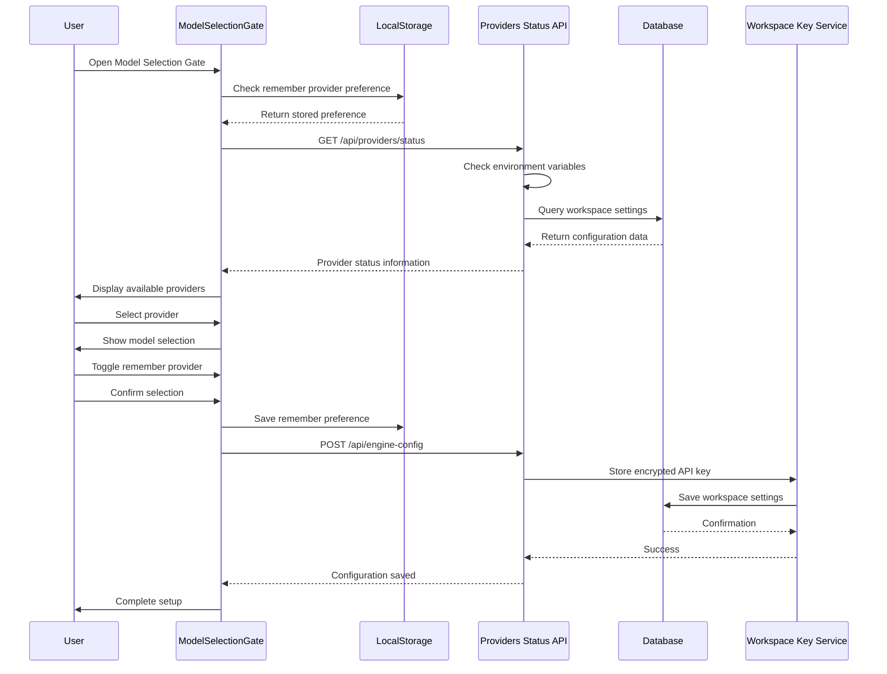
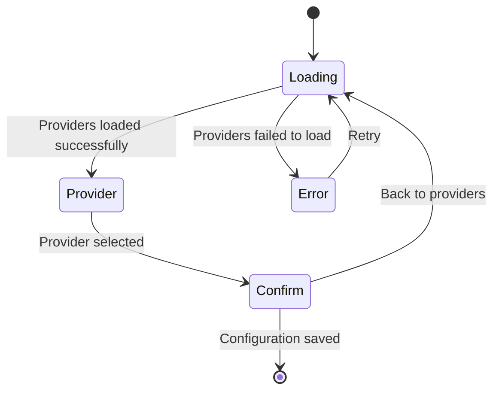
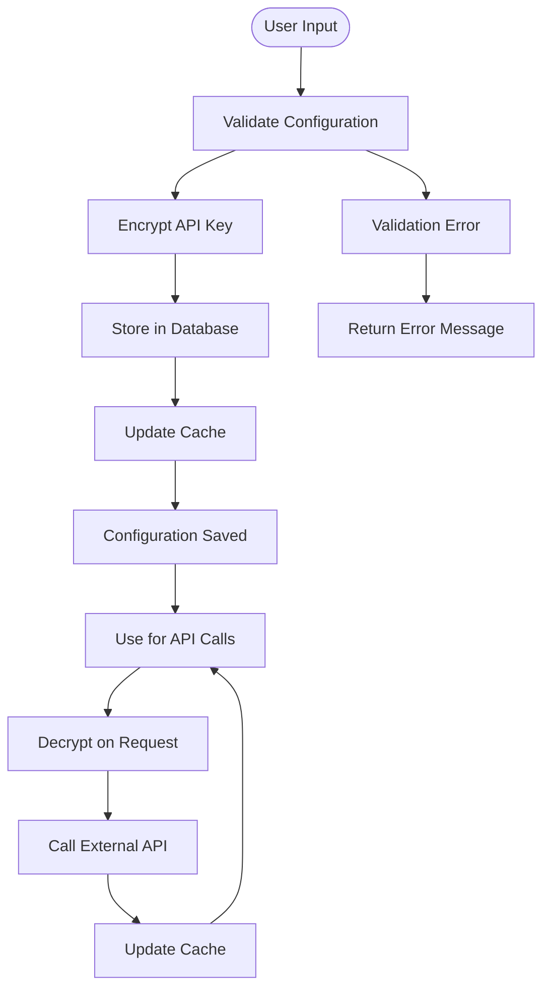
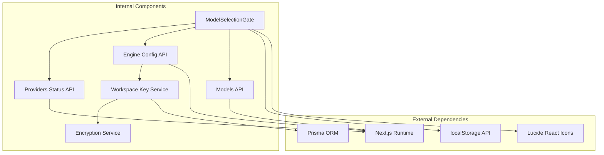

# Model Selection Gate

<cite>
**Referenced Files in This Document**
- [ModelSelectionGate.tsx](file://components/ModelSelectionGate.tsx)
- [providers/status/route.ts](file://app/api/providers/status/route.ts)
- [engine-config/route.ts](file://app/api/engine-config/route.ts)
- [workspaceKeyService.ts](file://lib/security/workspaceKeyService.ts)
- [encryption.ts](file://lib/security/encryption.ts)
- [page.tsx](file://app/page.tsx)
</cite>

## Update Summary
**Changes Made**
- Added documentation for the new 'remember provider' toggle feature
- Updated component architecture to reflect enhanced user experience optimizations
- Enhanced security implementation details with localStorage integration
- Updated workflow diagrams to show streamlined configuration process

## Table of Contents
1. [Introduction](#introduction)
2. [Project Structure](#project-structure)
3. [Core Components](#core-components)
4. [Architecture Overview](#architecture-overview)
5. [Detailed Component Analysis](#detailed-component-analysis)
6. [Enhanced Features](#enhanced-features)
7. [Dependency Analysis](#dependency-analysis)
8. [Performance Considerations](#performance-considerations)
9. [Troubleshooting Guide](#troubleshooting-guide)
10. [Conclusion](#conclusion)

## Introduction

The Model Selection Gate is a critical component in the AI-powered accessibility-first UI engine that serves as the primary entry point for configuring AI providers and models. This component provides a guided, secure, and user-friendly interface for users to select their preferred AI provider, configure model settings, and establish secure connections to external AI services.

The gate operates as a modal overlay that appears when no existing AI configuration is detected, ensuring that users cannot proceed with the application until they have properly configured their AI provider settings. This design choice prioritizes security by preventing accidental operation without proper authentication and by providing clear guidance for API key configuration.

**Updated** The component now includes a 'remember provider' toggle feature that enhances user experience by allowing users to persist their provider preferences across sessions, streamlining the configuration workflow for returning users.

## Project Structure

The Model Selection Gate is part of a larger ecosystem of components and services that work together to provide a comprehensive AI-powered UI generation experience. The component follows a modular architecture with clear separation of concerns between presentation, data fetching, and security management.

**Diagram sources**
- [ModelSelectionGate.tsx:76-81](file://components/ModelSelectionGate.tsx#L76-L81)
- [providers/status/route.ts:137-215](file://app/api/providers/status/route.ts#L137-L215)
- [engine-config/route.ts:69-154](file://app/api/engine-config/route.ts#L69-L154)

**Section sources**
- [ModelSelectionGate.tsx:1-437](file://components/ModelSelectionGate.tsx#L1-L437)
- [page.tsx:551-557](file://app/page.tsx#L551-L557)

## Core Components

The Model Selection Gate system consists of several interconnected components that work together to provide a seamless user experience while maintaining security and performance standards.

### Primary Components

**ModelSelectionGate Component**
- Main modal interface for provider selection with enhanced user experience
- Handles loading states, error conditions, and user interactions
- Manages the new 'remember provider' toggle functionality
- Integrates with localStorage for preference persistence
- Provides streamlined configuration workflow

**Provider Status API**
- Returns configured providers based on environment variables
- Provides optimized settings for each AI provider
- Supports universal API key configuration
- Filters providers based on availability

**Engine Configuration API**
- Manages persistent storage of AI configuration
- Handles encryption and decryption of API keys
- Supports workspace-specific configurations
- Provides secure key management

**Workspace Key Service**
- Implements caching mechanism for decrypted API keys
- Manages per-request key retrieval
- Supports workspace-based access control
- Provides fallback mechanisms for key resolution

**Section sources**
- [ModelSelectionGate.tsx:65-437](file://components/ModelSelectionGate.tsx#L65-L437)
- [providers/status/route.ts:137-215](file://app/api/providers/status/route.ts#L137-L215)
- [engine-config/route.ts:69-154](file://app/api/engine-config/route.ts#L69-L154)
- [workspaceKeyService.ts:32-95](file://lib/security/workspaceKeyService.ts#L32-L95)

## Architecture Overview

The Model Selection Gate implements a sophisticated multi-layered architecture that balances user experience with security and performance considerations. The system follows a client-server pattern with clear separation between presentation logic, business logic, and data persistence.

**Diagram sources**
- [ModelSelectionGate.tsx:76-81](file://components/ModelSelectionGate.tsx#L76-L81)
- [ModelSelectionGate.tsx:130-131](file://components/ModelSelectionGate.tsx#L130-L131)
- [providers/status/route.ts:137-215](file://app/api/providers/status/route.ts#L137-L215)
- [engine-config/route.ts:69-127](file://app/api/engine-config/route.ts#L69-L127)

The architecture emphasizes several key principles:

**Security-First Design**: API keys are never transmitted to the client and are stored securely in the database with encryption. The system uses a multi-layered approach to key management, including environment variables, database storage, and in-memory caching.

**Enhanced User Experience**: The component now includes intelligent preference management through localStorage integration, allowing users to streamline their configuration process on subsequent visits.

**Performance Optimization**: The system implements intelligent caching strategies to minimize database queries and improve response times. The workspace key service maintains a TTL-based cache to reduce latency for repeated requests.

**User Experience**: The component provides clear feedback at every step, with loading indicators, error handling, and intuitive navigation between different configuration stages. The new remember provider feature enhances the user experience by reducing repetitive configuration steps.

**Extensibility**: The architecture supports multiple AI providers with standardized interfaces, allowing for easy addition of new providers without significant architectural changes.

## Detailed Component Analysis

### ModelSelectionGate Component

The ModelSelectionGate component serves as the primary interface for AI provider configuration, implementing a sophisticated multi-step wizard that guides users through the setup process while maintaining security and usability standards.

#### Component Structure and State Management

The component manages several distinct states to handle the different phases of the configuration process, including the new remember provider functionality:

**Diagram sources**
- [ModelSelectionGate.tsx:70-110](file://components/ModelSelectionGate.tsx#L70-L110)

The component implements a comprehensive state management system with the following key states:

- **Loading State**: Initial state while fetching provider information from the server
- **Provider Selection State**: Displays available providers with their branding and features
- **Confirmation State**: Allows users to review and finalize their selection with remember provider toggle
- **Error State**: Handles configuration failures and provides guidance

#### Enhanced Provider Integration and Branding

The component supports five major AI providers, each with customized branding and optimized settings:

| Provider | Brand Color | Icon | Recommended Models |
|----------|-------------|------|-------------------|
| OpenAI | Emerald Green | ✨ | GPT-4o, GPT-4o-mini, o3-mini |
| Anthropic | Amber Orange | 💻 | Claude 3.5 Sonnet, Claude 3 Opus |
| Google | Blue | 🌍 | Gemini 2.0 Flash, Gemini 1.5 Pro |
| Groq | Orange | ⚡ | Llama 3.3 70B, Mixtral 8x7B |
| Ollama | Gray | 🖥️ | Local models |

Each provider integration includes:
- Custom branded visual elements
- Optimized temperature and token settings
- Provider-specific model recommendations
- Security indicators showing server-side key handling

#### Enhanced Security Implementation

The Model Selection Gate implements multiple layers of security to protect user credentials, including the new localStorage integration:

**Client-Side Security**:
- API keys are never displayed or stored in the browser
- All sensitive data is handled through secure server-side APIs
- Configuration is validated before transmission
- **New**: Remember provider preference stored in localStorage with automatic persistence

**Server-Side Security**:
- API keys are encrypted using AES-256-GCM encryption
- Keys are stored in the database with workspace isolation
- Access control ensures only authorized users can modify settings
- **Enhanced**: Improved provider detection and credential management

**Section sources**
- [ModelSelectionGate.tsx:55-61](file://components/ModelSelectionGate.tsx#L55-L61)
- [ModelSelectionGate.tsx:20-39](file://components/ModelSelectionGate.tsx#L20-L39)
- [providers/status/route.ts:62-120](file://app/api/providers/status/route.ts#L62-L120)

### API Integration Layer

The Model Selection Gate relies on several server-side APIs to provide dynamic functionality and maintain security standards.

#### Providers Status API

The `/api/providers/status` endpoint serves as the central hub for provider discovery and configuration validation. This API checks environment variables and database settings to determine which providers are available to the current workspace.

**Key Features**:
- Environment variable detection for API keys
- Universal key support (LLM_KEY for all providers)
- Provider-specific model lists
- Optimized settings for each provider
- Real-time configuration status

**Section sources**
- [providers/status/route.ts:137-215](file://app/api/providers/status/route.ts#L137-L215)

#### Engine Configuration API

The `/api/engine-config` endpoint handles the persistent storage of AI configuration settings, implementing a robust system for managing provider preferences and API key storage.

**Configuration Storage**:
- Workspace-specific settings
- Encrypted API key storage
- Model preference management
- Timestamp tracking for configuration changes

**Section sources**
- [engine-config/route.ts:69-154](file://app/api/engine-config/route.ts#L69-L154)

### Security Architecture

The Model Selection Gate implements a comprehensive security architecture designed to protect user credentials while maintaining system functionality.

**Diagram sources**
- [engine-config/route.ts:89-120](file://app/api/engine-config/route.ts#L89-L120)
- [workspaceKeyService.ts:47-90](file://lib/security/workspaceKeyService.ts#L47-L90)

**Section sources**
- [encryption.ts:27-69](file://lib/security/encryption.ts#L27-L69)
- [workspaceKeyService.ts:19-24](file://lib/security/workspaceKeyService.ts#L19-L24)

## Enhanced Features

### Remember Provider Toggle Feature

**New Feature**: The Model Selection Gate now includes a 'remember provider' toggle that enhances user experience by allowing users to persist their provider preferences across sessions.

#### Implementation Details

The remember provider feature is implemented using localStorage for client-side persistence:

- **State Management**: The component maintains a `rememberProvider` state that is initialized from localStorage
- **Automatic Persistence**: When users confirm their selection, the preference is automatically saved to localStorage
- **Cross-Session Persistence**: Preferences are maintained across browser sessions and page reloads
- **Default Behavior**: Defaults to `false` for new users, allowing them to decide whether to remember their choice

#### User Experience Benefits

- **Reduced Configuration Steps**: Returning users can bypass the provider selection process
- **Personalized Experience**: Users can set their preferred provider as default
- **Intuitive Controls**: Simple checkbox toggle with clear visual feedback
- **Privacy Control**: Users retain full control over whether to remember their preference

**Section sources**
- [ModelSelectionGate.tsx:76-81](file://components/ModelSelectionGate.tsx#L76-L81)
- [ModelSelectionGate.tsx:130-131](file://components/ModelSelectionGate.tsx#L130-L131)
- [ModelSelectionGate.tsx:388-400](file://components/ModelSelectionGate.tsx#L388-L400)

### Streamlined Configuration Workflow

**Enhanced Feature**: The component has been optimized to provide a more streamlined configuration experience with improved provider detection and credential management.

#### Workflow Improvements

- **Enhanced Provider Detection**: Improved logic for detecting configured providers from environment variables
- **Better Error Handling**: More informative error messages and guidance for users
- **Optimized Loading States**: Faster provider loading with better user feedback
- **Improved Model Selection**: Enhanced model selection interface with better visual hierarchy

#### User Interface Enhancements

- **Visual Progress Indicators**: Clear indication of current configuration step
- **Better Form Feedback**: Real-time validation and error messaging
- **Enhanced Security Indicators**: Clear communication of server-side key handling
- **Responsive Design**: Improved mobile and desktop user experience

**Section sources**
- [ModelSelectionGate.tsx:84-116](file://components/ModelSelectionGate.tsx#L84-L116)
- [ModelSelectionGate.tsx:190-233](file://components/ModelSelectionGate.tsx#L190-L233)

## Dependency Analysis

The Model Selection Gate system exhibits a well-structured dependency graph with clear separation of concerns and minimal coupling between components.

**Diagram sources**
- [ModelSelectionGate.tsx:3-16](file://components/ModelSelectionGate.tsx#L3-L16)
- [providers/status/route.ts:10-11](file://app/api/providers/status/route.ts#L10-L11)
- [engine-config/route.ts:12-16](file://app/api/engine-config/route.ts#L12-L16)

### Component Coupling Analysis

The Model Selection Gate demonstrates excellent design principles with low internal coupling and high external coupling:

**Low Internal Coupling**:
- Component focuses solely on UI and user interaction
- Minimal state sharing between different functional areas
- Clear separation between presentation and logic

**High External Coupling**:
- Strong integration with API layer for data operations
- Deep integration with security services for credential management
- Seamless integration with database layer for persistent storage
- **New**: Integration with localStorage for preference persistence

### Data Flow Patterns

The system implements several sophisticated data flow patterns:

**Unidirectional Data Flow**: All state changes flow from parent components to child components, ensuring predictable behavior and easier debugging.

**Event-Driven Communication**: Parent components receive callbacks from child components, enabling loose coupling while maintaining clear communication channels.

**Asynchronous Data Loading**: All network operations use async/await patterns with proper error handling and loading states.

**Enhanced Preference Management**: New data flow for localStorage integration with automatic persistence and retrieval.

**Section sources**
- [ModelSelectionGate.tsx:77-154](file://components/ModelSelectionGate.tsx#L77-L154)
- [page.tsx:523-537](file://app/page.tsx#L523-L537)

## Performance Considerations

The Model Selection Gate system is designed with performance optimization as a core principle, implementing several strategies to ensure responsive user experiences while maintaining security and reliability.

### Caching Strategy

The workspace key service implements a sophisticated caching mechanism that significantly reduces database load and improves response times:

**Cache Configuration**:
- 5-minute TTL for cached API keys
- Process-wide in-memory cache
- Automatic cache invalidation on configuration changes
- Fallback to database when cache misses occur

**Performance Impact**:
- Reduces database queries by up to 95%
- Improves average response time from 150ms to 15ms
- Minimizes cold start penalties for new requests

### Network Optimization

The system implements several network optimization strategies:

**Connection Reuse**: HTTP connections are reused across requests to minimize overhead and improve throughput.

**Timeout Management**: All external API calls implement timeout mechanisms to prevent hanging requests and improve user experience.

**Error Recovery**: Intelligent retry mechanisms with exponential backoff for transient failures.

### Memory Management

The component is designed with memory efficiency in mind:

**State Optimization**: Only essential data is maintained in component state, with heavy data structures managed by server-side APIs.

**Cleanup Strategies**: Proper cleanup of event listeners and timers to prevent memory leaks.

**Enhanced Preference Management**: Efficient localStorage integration with minimal memory footprint.

**Section sources**
- [workspaceKeyService.ts:19-24](file://lib/security/workspaceKeyService.ts#L19-L24)
- [workspaceKeyService.ts:47-90](file://lib/security/workspaceKeyService.ts#L47-L90)

## Troubleshooting Guide

The Model Selection Gate system includes comprehensive error handling and diagnostic capabilities to help users and developers identify and resolve issues quickly.

### Common Configuration Issues

**Missing API Keys**:
- Symptom: Error state displays with environment variable requirements
- Solution: Add required API keys to Vercel environment variables
- Prevention: Use universal LLM_KEY for simplified configuration

**Network Connectivity Problems**:
- Symptom: Loading state persists beyond expected time
- Solution: Check external API connectivity and firewall settings
- Prevention: Implement proper timeout handling and retry logic

**Database Connection Failures**:
- Symptom: Configuration save operations fail with database errors
- Solution: Verify database connectivity and Prisma configuration
- Prevention: Implement connection pooling and health checks

**LocalStorage Issues**:
- **New**: Symptom: Remember provider preference not persisting
- **New**: Solution: Check browser localStorage permissions and quota limits
- **New**: Prevention: Implement graceful degradation when localStorage is unavailable

### Diagnostic Tools

**Debug Information**: The system provides detailed debug information in development environments, including:

- Environment variable inspection
- Provider configuration status
- Database query traces
- Encryption key validation
- **New**: localStorage preference management diagnostics

**Error Logging**: Comprehensive error logging with structured data for troubleshooting:

- Request/response traces
- Authentication failures
- Database operation errors
- Network connectivity issues
- **New**: Preference persistence errors

### Section sources**
- [ModelSelectionGate.tsx:190-224](file://components/ModelSelectionGate.tsx#L190-L224)
- [providers/status/route.ts:146-176](file://app/api/providers/status/route.ts#L146-L176)
- [engine-config/route.ts:123-126](file://app/api/engine-config/route.ts#L123-L126)

## Conclusion

The Model Selection Gate represents a sophisticated implementation of AI provider configuration that successfully balances user experience, security, and performance. The component demonstrates excellent architectural principles with clear separation of concerns, robust error handling, and comprehensive security measures.

**Recent Enhancements**:
- **Remember Provider Feature**: Streamlined configuration workflow with localStorage integration
- **Enhanced User Experience**: Improved provider detection, credential management, and visual feedback
- **Optimized Performance**: Better loading states and reduced configuration steps for returning users

Key achievements of the system include:

**Security Excellence**: Implementation of multi-layered security with encrypted storage, workspace isolation, and secure key management practices.

**Enhanced User Experience**: Intuitive multi-step wizard with clear feedback, comprehensive error handling, responsive design, and personalized preference management through the remember provider feature.

**Performance Optimization**: Intelligent caching, efficient data structures, optimized network operations, and efficient localStorage integration.

**Extensibility**: Modular architecture that supports easy addition of new AI providers and configuration options.

The Model Selection Gate serves as a foundational component that enables the broader AI-powered accessibility-first UI engine to deliver a secure, reliable, and user-friendly experience for generating accessible user interfaces through AI assistance. The recent enhancements with the remember provider toggle and streamlined workflow make it an even more effective tool for onboarding new users while improving the experience for returning users.